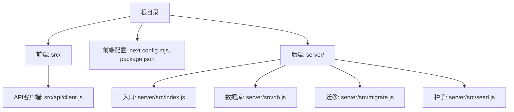
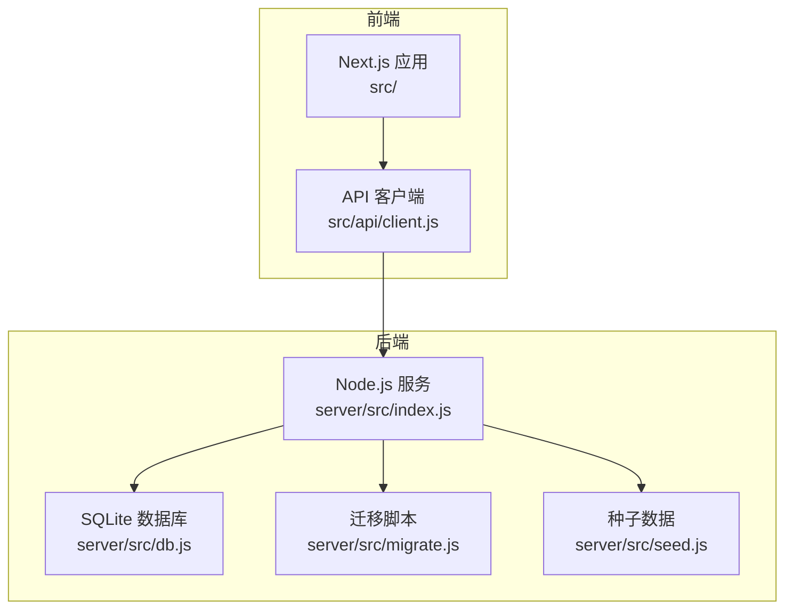
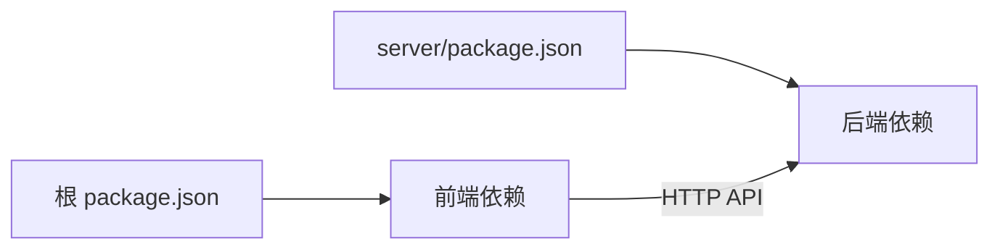

# 快速开始

<cite>
**本文引用的文件**   
- [README.md](file://README.md)
- [package.json](file://package.json)
- [next.config.mjs](file://next.config.mjs)
- [server/package.json](file://server/package.json)
- [server/src/index.js](file://server/src/index.js)
- [server/src/db.js](file://server/src/db.js)
- [server/src/migrate.js](file://server/src/migrate.js)
- [server/src/seed.js](file://server/src/seed.js)
- [server/src/check-users.js](file://server/src/check-users.js)
- [src/api/client.js](file://src/api/client.js)
</cite>

## 目录
1. [简介](#简介)
2. [项目结构](#项目结构)
3. [核心组件](#核心组件)
4. [架构总览](#架构总览)
5. [详细组件分析](#详细组件分析)
6. [依赖分析](#依赖分析)
7. [性能考虑](#性能考虑)
8. [故障排查指南](#故障排查指南)
9. [结论](#结论)
10. [附录](#附录)

## 简介
本指南面向首次接触该博客系统的开发者，目标是在30分钟内完成环境准备、项目克隆、依赖安装、前后端启动、环境变量配置、数据库迁移与种子数据初始化，并成功访问基本功能。系统采用前后端分离架构：前端基于 Next.js，后端基于 Node.js 服务，默认使用 SQLite 作为数据存储。

## 项目结构
仓库为单仓（monorepo）形式，根目录包含前端工程与配置文件，server 子目录包含后端服务、路由、中间件、数据库连接、迁移与种子脚本等。

图表来源
- [next.config.mjs](file://next.config.mjs)
- [package.json](file://package.json)
- [server/src/index.js](file://server/src/index.js)
- [server/src/db.js](file://server/src/db.js)
- [server/src/migrate.js](file://server/src/migrate.js)
- [server/src/seed.js](file://server/src/seed.js)
- [src/api/client.js](file://src/api/client.js)

章节来源
- [README.md](file://README.md)
- [package.json](file://package.json)
- [next.config.mjs](file://next.config.mjs)
- [server/package.json](file://server/package.json)

## 核心组件
- 前端应用（Next.js）
  - 提供页面、组件与 API 客户端，负责渲染与用户交互。
  - 通过 API 客户端调用后端接口。
- 后端服务（Node.js）
  - 提供 RESTful API，处理认证、文章、问答、专栏、搜索、排行榜等。
  - 使用 SQLite 存储数据，支持迁移与种子数据初始化。
- 数据库
  - 默认使用 SQLite，便于本地开发无需额外安装数据库服务。
- 环境变量
  - 用于配置后端端口、数据库路径、JWT 密钥等关键参数。

章节来源
- [server/src/index.js](file://server/src/index.js)
- [server/src/db.js](file://server/src/db.js)
- [server/src/migrate.js](file://server/src/migrate.js)
- [server/src/seed.js](file://server/src/seed.js)
- [src/api/client.js](file://src/api/client.js)

## 架构总览
下图展示了前后端在开发与运行时的交互关系：前端通过 API 客户端向后端发起请求，后端读取环境变量进行数据库连接与鉴权配置，执行迁移与种子数据后对外暴露 API。

图表来源
- [server/src/index.js](file://server/src/index.js)
- [server/src/db.js](file://server/src/db.js)
- [server/src/migrate.js](file://server/src/migrate.js)
- [server/src/seed.js](file://server/src/seed.js)
- [src/api/client.js](file://src/api/client.js)

## 详细组件分析

### 环境准备
- Node.js 版本要求
  - 请确保已安装符合项目要求的 Node.js 版本（建议与 package.json 中声明的版本一致）。
- 包管理器
  - 可使用 npm 或 yarn。若使用 yarn，请在各模块目录下执行相应命令。
- 可选工具
  - 终端/命令行工具、文本编辑器或 IDE。

章节来源
- [package.json](file://package.json)
- [server/package.json](file://server/package.json)

### 克隆与安装依赖
- 克隆仓库
  - 将仓库克隆到本地任意目录。
- 安装前端依赖
  - 在项目根目录执行包管理器的安装命令。
- 安装后端依赖
  - 进入 server 目录，执行包管理器的安装命令。

章节来源
- [package.json](file://package.json)
- [server/package.json](file://server/package.json)

### 环境变量配置
- 创建环境变量文件
  - 在后端目录创建 .env 文件（如 server/.env），用于存放敏感配置。
- 关键变量说明
  - 后端服务端口：用于指定后端监听端口。
  - 数据库路径：SQLite 数据库文件路径，默认位于后端目录下的 data 文件夹。
  - JWT 密钥：用于签发和校验令牌，需设置为足够安全的随机字符串。
- 加载方式
  - 后端服务启动时会自动读取环境变量以配置数据库与鉴权。

章节来源
- [server/src/index.js](file://server/src/index.js)
- [server/src/db.js](file://server/src/db.js)

### 数据库迁移与种子数据
- 首次运行前执行迁移
  - 进入后端目录，执行迁移脚本，以确保数据库表结构与初始数据就绪。
- 初始化种子数据
  - 执行种子脚本，插入演示所需的基础数据（如示例用户、文章、问答等）。
- 验证用户
  - 可运行检查用户脚本，确认管理员或测试用户是否已成功创建。

章节来源
- [server/src/migrate.js](file://server/src/migrate.js)
- [server/src/seed.js](file://server/src/seed.js)
- [server/src/check-users.js](file://server/src/check-users.js)

### 启动后端服务
- 进入后端目录
  - 切换到 server 目录。
- 启动服务
  - 执行后端启动命令，服务将读取环境变量并监听指定端口。
- 健康检查
  - 可通过浏览器或 curl 访问后端根路径，确认服务正常响应。

章节来源
- [server/src/index.js](file://server/src/index.js)
- [server/package.json](file://server/package.json)

### 启动前端开发服务器
- 返回根目录
  - 回到项目根目录。
- 启动开发服务器
  - 执行前端启动命令，Next.js 开发服务器将在本地端口提供服务。
- 访问站点
  - 打开浏览器访问前端地址，查看首页与基础页面是否正常显示。

章节来源
- [package.json](file://package.json)
- [next.config.mjs](file://next.config.mjs)

### 前后端联调与跨域
- 前端 API 客户端
  - 前端通过 API 客户端统一调用后端接口，注意代理或跨域设置。
- 代理配置
  - 可在前端配置中将 /api 请求代理至后端服务地址，避免跨域问题。

章节来源
- [src/api/client.js](file://src/api/client.js)
- [next.config.mjs](file://next.config.mjs)

## 依赖分析
- 前端依赖
  - 由根目录 package.json 声明，包括 Next.js 及其生态插件。
- 后端依赖
  - 由 server/package.json 声明，包括 Web 框架、数据库驱动、鉴权库等。
- 依赖关系图
  - 前端依赖 Next.js 生态；后端依赖 Web 框架与数据库驱动；前后端通过 HTTP API 通信。

图表来源
- [package.json](file://package.json)
- [server/package.json](file://server/package.json)

章节来源
- [package.json](file://package.json)
- [server/package.json](file://server/package.json)

## 性能考虑
- 开发阶段
  - 使用 Next.js 开发模式以获得热重载与调试能力。
  - 后端使用 SQLite，适合本地开发，生产环境建议切换为更健壮的数据库。
- 资源优化
  - 合理拆分页面与组件，按需加载图片与样式。
  - 对频繁查询的接口添加缓存策略（如 Redis）。
- 并发与扩展
  - 后端可水平扩展多个实例，配合反向代理与负载均衡。

[本节为通用指导，不直接分析具体文件]

## 故障排查指南
- 端口占用
  - 现象：后端或前端启动失败，提示端口被占用。
  - 解决：修改环境变量中的端口或停止占用进程。
- 数据库路径错误
  - 现象：后端无法连接数据库或找不到数据文件。
  - 解决：检查环境变量中的数据库路径是否正确，并确保目录存在且可写。
- 迁移失败
  - 现象：执行迁移脚本报错。
  - 解决：检查数据库连接与环境变量，必要时清理旧数据文件后重试。
- 种子数据未生效
  - 现象：登录后无演示数据。
  - 解决：重新执行种子脚本，确认脚本执行成功。
- 登录鉴权失败
  - 现象：登录或访问受保护接口返回未授权。
  - 解决：检查 JWT 密钥配置是否与前后端一致，确认令牌生成与校验逻辑。
- 跨域问题
  - 现象：前端控制台报跨域错误。
  - 解决：在前端配置代理或将后端允许的来源加入白名单。

章节来源
- [server/src/index.js](file://server/src/index.js)
- [server/src/db.js](file://server/src/db.js)
- [server/src/migrate.js](file://server/src/migrate.js)
- [server/src/seed.js](file://server/src/seed.js)
- [src/api/client.js](file://src/api/client.js)

## 结论
按照本指南完成环境准备、依赖安装、环境变量配置、迁移与种子数据初始化后，即可在本地同时运行前后端服务，访问博客系统的基本功能。建议在后续迭代中逐步完善生产环境配置、安全策略与性能优化。

[本节为总结性内容，不直接分析具体文件]

## 附录

### 常用命令速查
- 安装依赖
  - 前端：在根目录执行安装命令。
  - 后端：在 server 目录执行安装命令。
- 启动后端
  - 在 server 目录执行启动命令。
- 启动前端
  - 在根目录执行开发服务器启动命令。
- 执行迁移
  - 在 server 目录执行迁移脚本。
- 初始化种子数据
  - 在 server 目录执行种子脚本。
- 检查用户
  - 在 server 目录执行用户检查脚本。

章节来源
- [package.json](file://package.json)
- [server/package.json](file://server/package.json)
- [server/src/migrate.js](file://server/src/migrate.js)
- [server/src/seed.js](file://server/src/seed.js)
- [server/src/check-users.js](file://server/src/check-users.js)