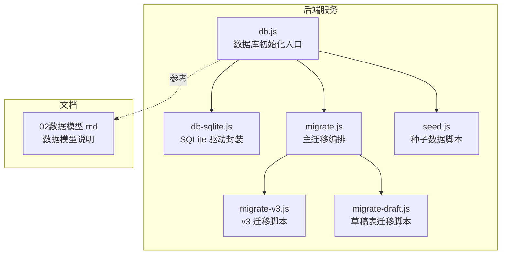
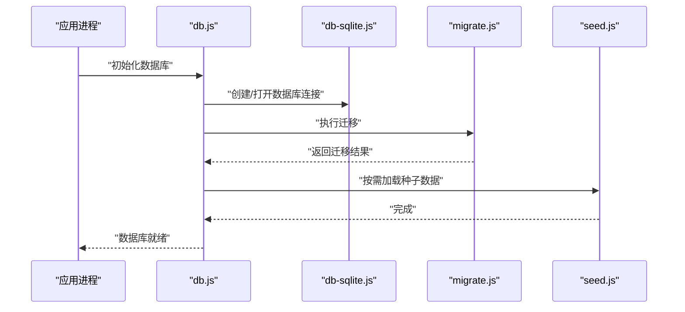
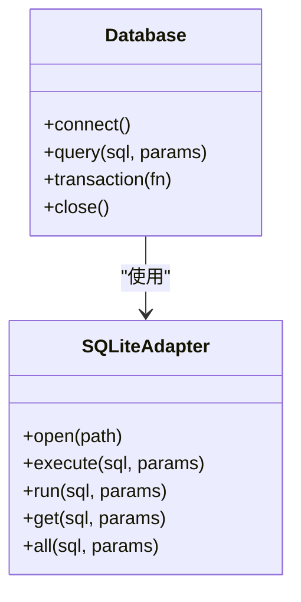
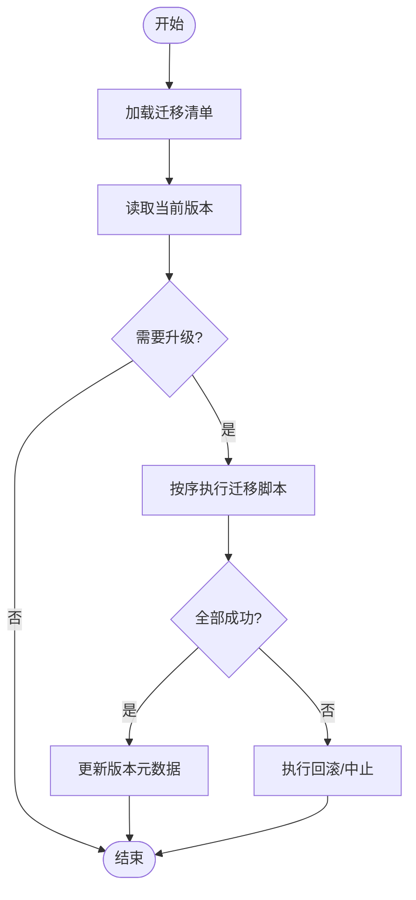
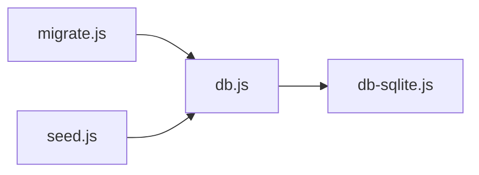
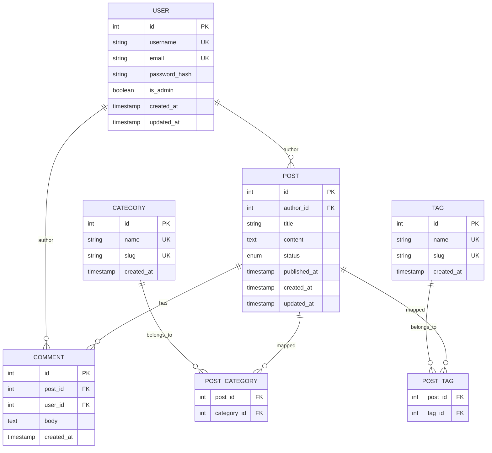

# 数据库设计

<cite>
**本文引用的文件**   
- [server/src/db.js](file://server/src/db.js)
- [server/src/db-sqlite.js](file://server/src/db-sqlite.js)
- [server/src/migrate.js](file://server/src/migrate.js)
- [server/src/migrate-v3.js](file://server/src/migrate-v3.js)
- [server/src/migrate-draft.js](file://server/src/migrate-draft.js)
- [server/src/seed.js](file://server/src/seed.js)
- [server/package.json](file://server/package.json)
- [docs/02数据模型.md](file://docs/02数据模型.md)
</cite>

## 目录
1. [简介](#简介)
2. [项目结构](#项目结构)
3. [核心组件](#核心组件)
4. [架构总览](#架构总览)
5. [详细组件分析](#详细组件分析)
6. [依赖关系分析](#依赖关系分析)
7. [性能考虑](#性能考虑)
8. [故障排查指南](#故障排查指南)
9. [结论](#结论)
10. [附录](#附录)

## 简介
本文件面向博客系统的数据库设计与实现，聚焦于 SQLite 作为嵌入式关系型数据库的选型与落地方案。文档涵盖：
- 数据表结构与字段定义、约束与索引策略
- 表间关系与引用完整性（外键）
- 数据迁移策略（版本管理、增量更新、回滚机制）
- 种子数据的生成与管理
- 数据访问模式（查询优化、连接池配置、事务处理）
- 备份与恢复策略
- 数据模型变更的管理流程与最佳实践

## 项目结构
后端服务位于 server 目录，数据库相关代码集中在 src 下，包括数据库初始化、SQLite 适配、迁移脚本与种子数据脚本；同时 docs/02数据模型.md 提供高层数据模型说明。

图表来源
- [server/src/db.js](file://server/src/db.js)
- [server/src/db-sqlite.js](file://server/src/db-sqlite.js)
- [server/src/migrate.js](file://server/src/migrate.js)
- [server/src/migrate-v3.js](file://server/src/migrate-v3.js)
- [server/src/migrate-draft.js](file://server/src/migrate-draft.js)
- [server/src/seed.js](file://server/src/seed.js)
- [docs/02数据模型.md](file://docs/02数据模型.md)

章节来源
- [server/src/db.js](file://server/src/db.js)
- [server/src/db-sqlite.js](file://server/src/db-sqlite.js)
- [server/src/migrate.js](file://server/src/migrate.js)
- [server/src/migrate-v3.js](file://server/src/migrate-v3.js)
- [server/src/migrate-draft.js](file://server/src/migrate-draft.js)
- [server/src/seed.js](file://server/src/seed.js)
- [docs/02数据模型.md](file://docs/02数据模型.md)

## 核心组件
- 数据库初始化与连接管理：负责加载 SQLite 驱动、建立连接、启用必要特性（如外键）、暴露统一查询接口。
- 迁移系统：集中管理 schema 演进，支持按版本顺序执行增量变更，并提供回滚能力。
- 种子数据：在开发/测试环境快速填充初始数据，便于联调与演示。
- 数据模型文档：以自然语言描述实体、字段、关系与业务规则，指导迁移脚本编写。

章节来源
- [server/src/db.js](file://server/src/db.js)
- [server/src/db-sqlite.js](file://server/src/db-sqlite.js)
- [server/src/migrate.js](file://server/src/migrate.js)
- [server/src/seed.js](file://server/src/seed.js)
- [docs/02数据模型.md](file://docs/02数据模型.md)

## 架构总览
下图展示了从应用启动到数据库就绪的关键路径：初始化模块加载 SQLite 驱动并建立连接，随后执行迁移确保 schema 最新，最后可加载种子数据。

图表来源
- [server/src/db.js](file://server/src/db.js)
- [server/src/db-sqlite.js](file://server/src/db-sqlite.js)
- [server/src/migrate.js](file://server/src/migrate.js)
- [server/src/seed.js](file://server/src/seed.js)

## 详细组件分析

### 数据库初始化与连接管理（db.js / db-sqlite.js）
- 职责
  - 加载 SQLite 驱动并建立连接
  - 开启外键约束检查等关键特性
  - 暴露统一的查询与事务 API
- 关键点
  - 连接生命周期：单例或按需复用，避免频繁创建销毁
  - 错误传播：将底层 SQL 错误包装为统一错误类型，便于上层处理
  - 特性开关：根据运行环境决定是否启用 WAL、外键等

图表来源
- [server/src/db.js](file://server/src/db.js)
- [server/src/db-sqlite.js](file://server/src/db-sqlite.js)

章节来源
- [server/src/db.js](file://server/src/db.js)
- [server/src/db-sqlite.js](file://server/src/db-sqlite.js)

### 迁移系统（migrate.js / migrate-v3.js / migrate-draft.js）
- 职责
  - 维护迁移版本号与执行顺序
  - 记录已执行的迁移，防止重复执行
  - 支持增量更新与回滚
- 关键流程
  - 读取迁移清单，比较目标版本与当前版本
  - 依次执行新增迁移脚本
  - 失败时中止并保留一致性状态
  - 可选：提供反向迁移脚本以实现回滚

图表来源
- [server/src/migrate.js](file://server/src/migrate.js)
- [server/src/migrate-v3.js](file://server/src/migrate-v3.js)
- [server/src/migrate-draft.js](file://server/src/migrate-draft.js)

章节来源
- [server/src/migrate.js](file://server/src/migrate.js)
- [server/src/migrate-v3.js](file://server/src/migrate-v3.js)
- [server/src/migrate-draft.js](file://server/src/migrate-draft.js)

### 种子数据（seed.js）
- 职责
  - 在开发/测试环境插入基础数据（用户、分类、示例文章等）
  - 幂等性：支持重复执行而不产生冲突（例如先删后插或条件插入）
- 注意事项
  - 仅用于非生产环境
  - 与迁移解耦，不替代迁移

章节来源
- [server/src/seed.js](file://server/src/seed.js)

### 数据模型说明（docs/02数据模型.md）
- 内容定位
  - 以自然语言描述实体、字段、关系与业务规则
  - 作为迁移脚本编写的依据
- 建议
  - 保持与迁移脚本同步更新
  - 对关键字段增加注释，明确取值范围与默认值

章节来源
- [docs/02数据模型.md](file://docs/02数据模型.md)

## 依赖关系分析
- 内部依赖
  - db.js 依赖 db-sqlite.js 提供的 SQLite 操作封装
  - migrate.js 依赖 db.js 提供的连接与事务能力
  - seed.js 依赖 db.js 提供的写入能力
- 外部依赖
  - SQLite 运行时库（通过 Node 包引入）
  - 文件系统（用于存储 .sqlite 文件）

图表来源
- [server/src/db.js](file://server/src/db.js)
- [server/src/db-sqlite.js](file://server/src/db-sqlite.js)
- [server/src/migrate.js](file://server/src/migrate.js)
- [server/src/seed.js](file://server/src/seed.js)

章节来源
- [server/src/db.js](file://server/src/db.js)
- [server/src/db-sqlite.js](file://server/src/db-sqlite.js)
- [server/src/migrate.js](file://server/src/migrate.js)
- [server/src/seed.js](file://server/src/seed.js)

## 性能考虑
- 连接与并发
  - SQLite 适合单写多读场景；在高并发写压力下需评估分库或迁移至客户端服务器型数据库
  - 合理设置 PRAGMA（如 journal_mode=WAL）以提升并发读性能
- 索引与查询
  - 为高频过滤/排序字段建立索引（如时间戳、状态、外键列）
  - 避免 SELECT *，只选择必要字段
  - 分页查询使用基于游标的分页替代 OFFSET 深翻页
- 事务与批处理
  - 批量写入使用事务包裹，减少磁盘落盘次数
  - 长事务需谨慎，避免锁竞争
- 备份与恢复
  - 冷备：停止服务后复制 .sqlite 文件
  - 热备：WAL 模式下可使用 sqlite3 工具进行在线备份（需停机窗口或低峰期）

[本节为通用性能建议，无需特定文件来源]

## 故障排查指南
- 常见问题
  - 外键约束失败：检查关联记录是否存在、删除顺序是否正确
  - 迁移失败：查看迁移日志，确认 SQL 语法与依赖顺序
  - 权限问题：确保进程对数据库文件有读写权限
- 诊断步骤
  - 验证数据库文件是否损坏（尝试用 sqlite3 打开）
  - 打印最近一次失败的迁移与 SQL 语句
  - 检查 WAL 文件与主数据库的一致性

章节来源
- [server/src/migrate.js](file://server/src/migrate.js)
- [server/src/db.js](file://server/src/db.js)

## 结论
本项目采用 SQLite 作为嵌入式数据库，满足博客系统在中小规模下的读写需求。通过清晰的迁移系统与种子数据管理，实现了可复现的环境搭建与稳定的数据演进。后续可根据增长趋势评估是否需要向客户端服务器型数据库迁移，并持续优化索引与查询。

[本节为总结性内容，无需特定文件来源]

## 附录

### SQLite 选型理由与适用场景
- 优点
  - 零配置、无独立进程，部署简单
  - 单机高并发读场景表现良好
  - 与 Node.js 生态集成成熟
- 适用场景
  - 个人博客、小型团队站点
  - 边缘计算、离线应用、嵌入式设备
- 不适用场景
  - 高并发写、强一致分布式需求
  - 超大规模数据量与复杂 OLAP 查询

[本节为通用说明，无需特定文件来源]

### 数据表结构与关系（概念图）
以下为概念级 ER 图，用于理解实体与关系，具体字段以迁移脚本为准。

[此图为概念模型示意，不对应具体源文件，故不提供图表来源]

### 数据迁移策略
- 版本管理
  - 每个迁移脚本对应一个版本号或时间戳
  - 维护已执行迁移的元数据表，避免重复执行
- 增量更新
  - 新增表、字段、索引、约束均以正向脚本形式提交
  - 大表变更建议在低峰期执行，必要时拆分为多个小步迁移
- 回滚机制
  - 为关键迁移提供反向脚本，或在迁移框架中支持 rollback 命令
  - 回滚前务必备份数据库
- 幂等性
  - 尽量使用 IF NOT EXISTS、ON CONFLICT 等幂等语句

章节来源
- [server/src/migrate.js](file://server/src/migrate.js)
- [server/src/migrate-v3.js](file://server/src/migrate-v3.js)
- [server/src/migrate-draft.js](file://server/src/migrate-draft.js)

### 种子数据管理
- 生成方法
  - 使用 seed.js 在开发/测试环境插入基础数据
  - 保证幂等，避免重复执行导致数据不一致
- 管理方式
  - 区分环境与用途（开发、测试、演示）
  - 定期清理过期种子数据，保持数据库整洁

章节来源
- [server/src/seed.js](file://server/src/seed.js)

### 数据访问模式
- 查询优化
  - 为常用过滤/排序字段建立索引
  - 使用覆盖索引减少回表
  - 避免函数包裹索引列，确保索引可用
- 连接池配置
  - SQLite 通常使用单连接或有限并发连接
  - 在高并发读场景可考虑只读副本或缓存层
- 事务处理
  - 批量写入包裹事务，减少 I/O
  - 短事务优先，降低锁持有时间

章节来源
- [server/src/db.js](file://server/src/db.js)
- [server/src/db-sqlite.js](file://server/src/db-sqlite.js)

### 备份与恢复策略
- 冷备份
  - 停止服务后复制 .sqlite 文件
- 热备份
  - WAL 模式下使用 sqlite3 工具进行在线备份
- 恢复
  - 替换 .sqlite 文件并重启服务
  - 校验备份完整性后再恢复

[本节为通用说明，无需特定文件来源]

### 数据模型变更流程与最佳实践
- 流程
  - 在 docs/02数据模型.md 中更新模型说明
  - 编写迁移脚本并提交
  - 本地验证迁移与回滚
  - 在预发布环境演练迁移
  - 灰度发布并监控错误率
- 最佳实践
  - 小步快跑，拆分大变更
  - 变更前备份数据库
  - 为关键变更编写反向迁移
  - 自动化测试覆盖迁移与回滚路径

章节来源
- [docs/02数据模型.md](file://docs/02数据模型.md)
- [server/src/migrate.js](file://server/src/migrate.js)

### 运行与脚本说明
- 包管理与脚本入口
  - 通过 package.json 中的脚本命令触发迁移与种子数据加载
- 典型命令
  - 执行迁移
  - 加载种子数据
  - 检查数据库结构

章节来源
- [server/package.json](file://server/package.json)