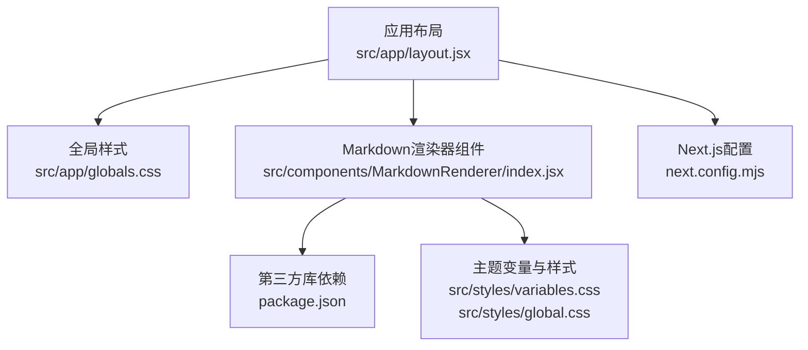
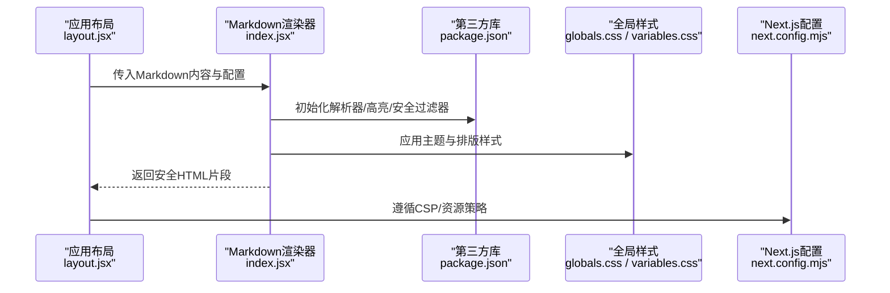
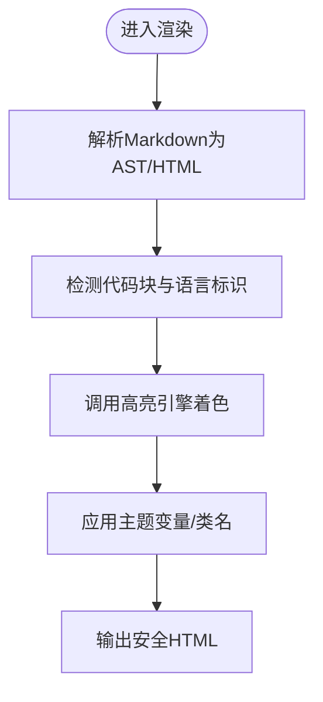
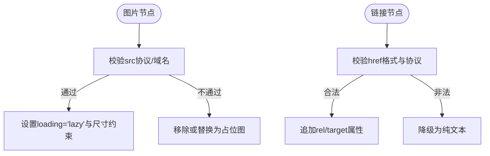
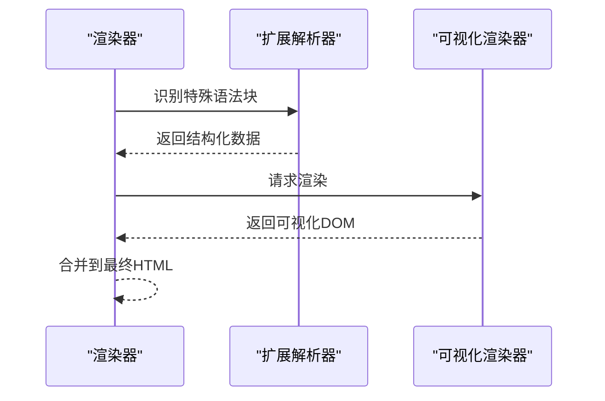
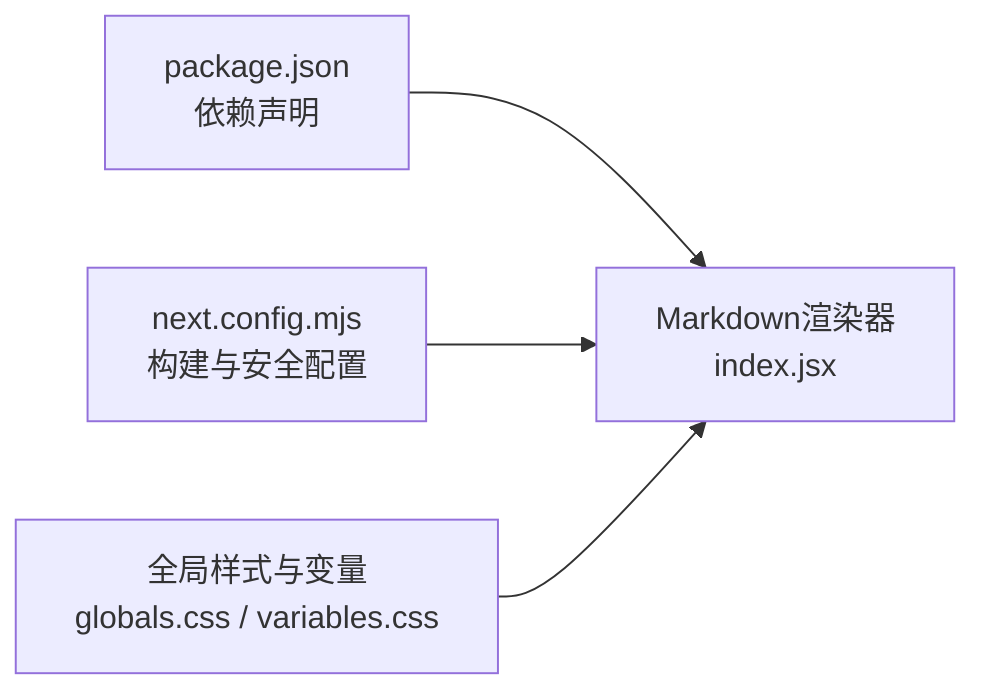

# Markdown渲染器

<cite>
**本文引用的文件**   
- [src/components/MarkdownRenderer/index.jsx](file://src/components/MarkdownRenderer/index.jsx)
- [package.json](file://package.json)
- [next.config.mjs](file://next.config.mjs)
- [src/app/layout.jsx](file://src/app/layout.jsx)
- [src/app/globals.css](file://src/app/globals.css)
- [src/styles/global.css](file://src/styles/global.css)
- [src/styles/variables.css](file://src/styles/variables.css)
</cite>

## 目录
1. [简介](#简介)
2. [项目结构](#项目结构)
3. [核心组件](#核心组件)
4. [架构总览](#架构总览)
5. [详细组件分析](#详细组件分析)
6. [依赖分析](#依赖分析)
7. [性能考虑](#性能考虑)
8. [故障排查指南](#故障排查指南)
9. [结论](#结论)
10. [附录](#附录)

## 简介
本技术文档围绕项目中“Markdown渲染器”的实现与扩展进行系统化说明，覆盖以下方面：
- Markdown基础语法支持范围（标题、列表、表格、代码块等）及其渲染实现要点
- 代码高亮功能的配置与自定义主题方案
- 图片处理与链接跳转的安全策略（XSS防护、外部链接处理）
- 数学公式、流程图等特殊语法的扩展方法
- 自定义渲染规则的配置指南与插件开发规范
- 性能优化策略（懒加载、缓存机制）

## 项目结构
本项目采用Next.js前端工程组织方式，Markdown渲染能力集中在组件层，样式通过全局CSS与变量管理。关键路径如下：
- 渲染组件入口：src/components/MarkdownRenderer/index.jsx
- 运行时依赖声明：package.json
- Next.js构建与安全相关配置：next.config.mjs
- 应用级布局与全局样式：src/app/layout.jsx、src/app/globals.css、src/styles/*.css

图表来源
- [src/app/layout.jsx](file://src/app/layout.jsx)
- [src/app/globals.css](file://src/app/globals.css)
- [src/components/MarkdownRenderer/index.jsx](file://src/components/MarkdownRenderer/index.jsx)
- [package.json](file://package.json)
- [next.config.mjs](file://next.config.mjs)
- [src/styles/variables.css](file://src/styles/variables.css)
- [src/styles/global.css](file://src/styles/global.css)

章节来源
- [src/components/MarkdownRenderer/index.jsx](file://src/components/MarkdownRenderer/index.jsx)
- [package.json](file://package.json)
- [next.config.mjs](file://next.config.mjs)
- [src/app/layout.jsx](file://src/app/layout.jsx)
- [src/app/globals.css](file://src/app/globals.css)
- [src/styles/global.css](file://src/styles/global.css)
- [src/styles/variables.css](file://src/styles/variables.css)

## 核心组件
- Markdown渲染器组件负责将Markdown文本转换为安全的HTML片段，并注入到页面中。其职责包括：
  - 解析Markdown为DOM或HTML
  - 对输出进行安全过滤与属性白名单控制
  - 集成代码高亮、图片懒加载、外链安全处理
  - 暴露可配置项以支持主题与插件扩展

章节来源
- [src/components/MarkdownRenderer/index.jsx](file://src/components/MarkdownRenderer/index.jsx)

## 架构总览
下图展示了从应用布局到渲染器的调用关系以及样式与配置的参与点。

图表来源
- [src/app/layout.jsx](file://src/app/layout.jsx)
- [src/components/MarkdownRenderer/index.jsx](file://src/components/MarkdownRenderer/index.jsx)
- [package.json](file://package.json)
- [src/app/globals.css](file://src/app/globals.css)
- [src/styles/variables.css](file://src/styles/variables.css)
- [next.config.mjs](file://next.config.mjs)

## 详细组件分析

### Markdown基础语法支持
- 标题、段落、强调、粗体、分割线、引用、列表（有序/无序）、任务列表、表格、行内代码、代码块等基础语法由底层解析器提供。
- 表格渲染需确保列对齐与表头样式；列表嵌套层级应正确映射至DOM树。
- 代码块默认按语言分类，便于后续高亮接入。

章节来源
- [src/components/MarkdownRenderer/index.jsx](file://src/components/MarkdownRenderer/index.jsx)

### 代码高亮配置与自定义主题
- 高亮引擎通过第三方库在客户端或服务端完成词法分析与着色。
- 主题可通过CSS变量或主题包切换，建议将颜色、字体、背景等抽象为变量，便于统一维护。
- 语言集合按需引入，避免打包体积过大。

图表来源
- [src/components/MarkdownRenderer/index.jsx](file://src/components/MarkdownRenderer/index.jsx)
- [package.json](file://package.json)
- [src/styles/variables.css](file://src/styles/variables.css)

章节来源
- [src/components/MarkdownRenderer/index.jsx](file://src/components/MarkdownRenderer/index.jsx)
- [package.json](file://package.json)
- [src/styles/variables.css](file://src/styles/variables.css)

### 图片处理与链接跳转安全
- 图片：
  - 建议启用懒加载以减少首屏压力
  - 限制尺寸与占位图，避免布局抖动
  - 校验协议与域名白名单，拒绝不安全来源
- 链接：
  - 外链统一添加 rel="noopener noreferrer" 与 target="_blank"
  - 对 href 进行协议与URL格式校验，禁止 javascript: 等危险协议
  - 可选：对站内路由进行规范化与鉴权检查

图表来源
- [src/components/MarkdownRenderer/index.jsx](file://src/components/MarkdownRenderer/index.jsx)

章节来源
- [src/components/MarkdownRenderer/index.jsx](file://src/components/MarkdownRenderer/index.jsx)

### 数学公式与流程图等扩展语法
- 数学公式：
  - 使用专用解析器将LaTeX语法转为MathML或SVG
  - 在渲染阶段插入容器节点，并在挂载后执行公式渲染
- 流程图/时序图等：
  - 使用对应库解析特定语法块，生成可视化元素
  - 注意异步渲染与错误兜底，避免阻塞主流程

图表来源
- [src/components/MarkdownRenderer/index.jsx](file://src/components/MarkdownRenderer/index.jsx)
- [package.json](file://package.json)

章节来源
- [src/components/MarkdownRenderer/index.jsx](file://src/components/MarkdownRenderer/index.jsx)
- [package.json](file://package.json)

### 自定义渲染规则与插件开发规范
- 自定义规则：
  - 基于AST或HTML钩子，拦截特定节点进行替换或增强
  - 保持输入输出的确定性，避免副作用
- 插件接口：
  - 提供统一的注册/卸载生命周期
  - 明确配置项类型与默认值
  - 提供错误边界与日志上报
- 主题与样式：
  - 通过CSS变量或类名约定，保证可扩展性
  - 避免硬编码颜色与尺寸

章节来源
- [src/components/MarkdownRenderer/index.jsx](file://src/components/MarkdownRenderer/index.jsx)
- [src/styles/variables.css](file://src/styles/variables.css)

## 依赖分析
- package.json用于声明渲染器所需第三方库（如解析器、高亮引擎、安全过滤器、数学公式与流程图库等）。
- next.config.mjs可能包含CSP、资源策略、静态资源处理等影响渲染安全与性能的选项。
- 全局样式与变量集中管理，确保渲染产物具备一致的主题表现。

图表来源
- [package.json](file://package.json)
- [next.config.mjs](file://next.config.mjs)
- [src/components/MarkdownRenderer/index.jsx](file://src/components/MarkdownRenderer/index.jsx)
- [src/app/globals.css](file://src/app/globals.css)
- [src/styles/variables.css](file://src/styles/variables.css)

章节来源
- [package.json](file://package.json)
- [next.config.mjs](file://next.config.mjs)
- [src/app/globals.css](file://src/app/globals.css)
- [src/styles/variables.css](file://src/styles/variables.css)
- [src/components/MarkdownRenderer/index.jsx](file://src/components/MarkdownRenderer/index.jsx)

## 性能考虑
- 懒加载：
  - 图片与大型可视化内容（流程图、公式）采用懒加载，减少首屏负载
- 缓存机制：
  - 对已渲染的Markdown片段进行内存缓存，键由内容哈希或ID决定
  - 结合浏览器缓存策略，避免重复解析与渲染
- 增量更新：
  - 当内容变化时，仅重渲染受影响区域
- 资源优化：
  - 按需引入高亮语言与扩展库
  - 使用CDN与版本锁定，提升稳定性与加载速度

[本节为通用指导，无需源码引用]

## 故障排查指南
- 常见症状与定位：
  - 代码块未高亮：检查高亮引擎是否成功加载、语言标识是否正确、主题类名是否生效
  - 外链点击无响应或安全风险：确认链接属性注入与协议校验逻辑
  - 图片显示异常：检查懒加载触发条件、占位图与尺寸约束
  - 公式/流程图不渲染：确认扩展解析器与渲染器初始化顺序与错误边界
- 调试建议：
  - 在渲染前后打印AST/HTML片段，对比差异
  - 开启控制台警告与错误捕获，记录失败节点与原因
  - 使用浏览器开发者工具审查网络与资源加载情况

章节来源
- [src/components/MarkdownRenderer/index.jsx](file://src/components/MarkdownRenderer/index.jsx)

## 结论
本渲染器以组件为核心，结合第三方库与全局样式，实现了Markdown基础语法、代码高亮、图片与链接安全处理，并为数学公式与流程图等扩展提供了清晰的接入点。通过合理的配置与插件化设计，可在保障安全与性能的前提下持续扩展功能。

[本节为总结性内容，无需源码引用]

## 附录
- 配置清单建议：
  - 高亮主题与语言集合
  - 图片懒加载开关与占位图
  - 外链安全策略（协议白名单、目标窗口行为）
  - 扩展插件列表与初始化参数
- 样式约定：
  - 使用CSS变量定义主题色、字号、行高、边距
  - 为不同语法块定义稳定的类名，便于主题定制

[本节为补充信息，无需源码引用]