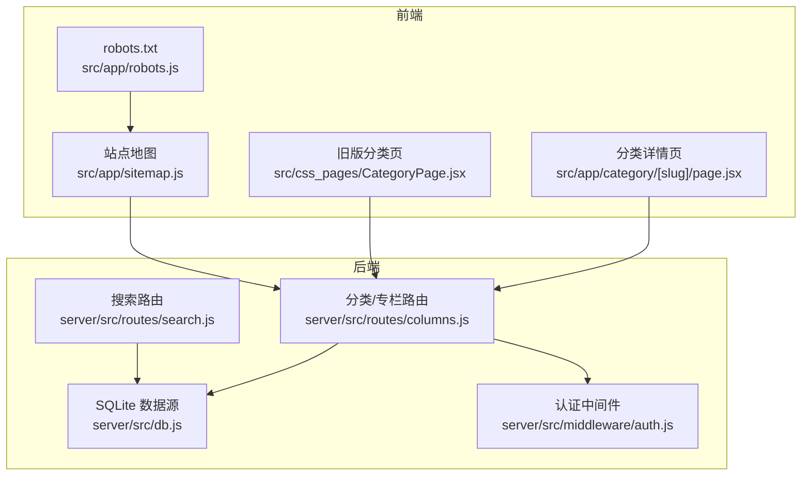
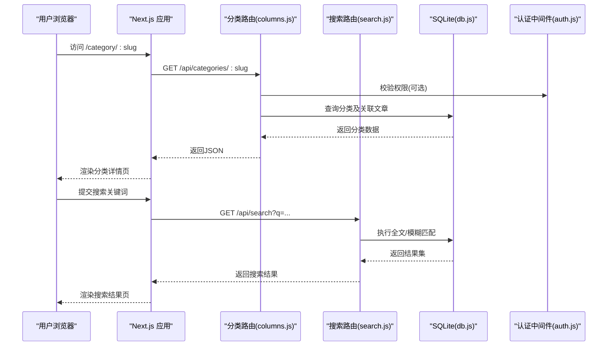
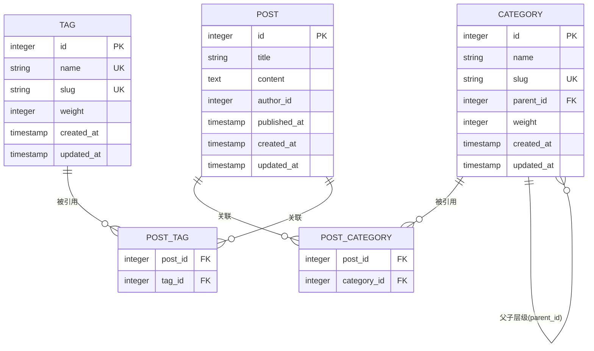
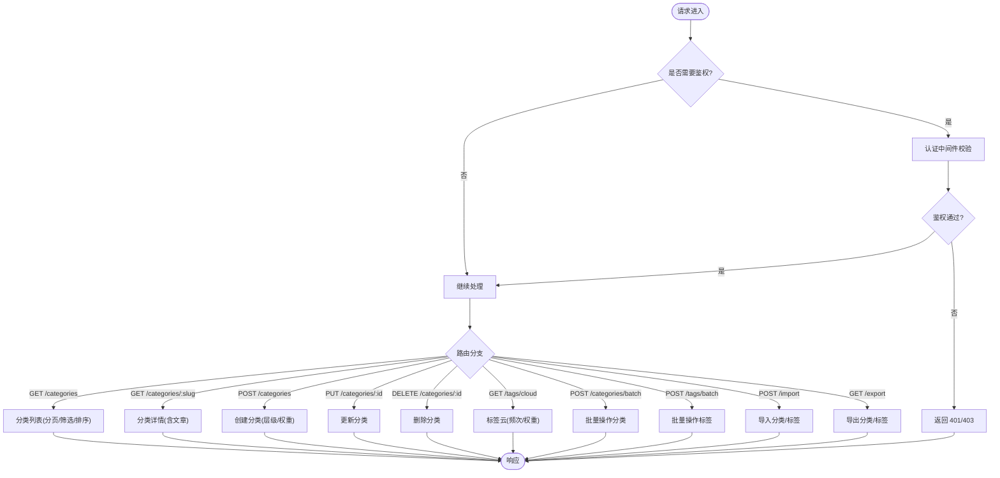
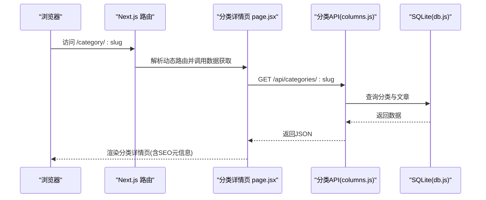
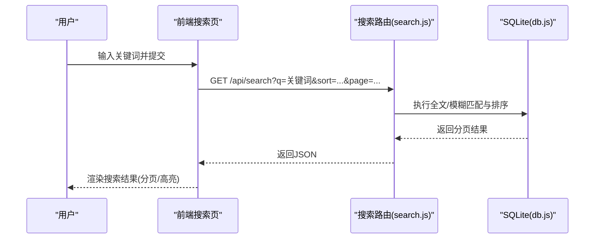
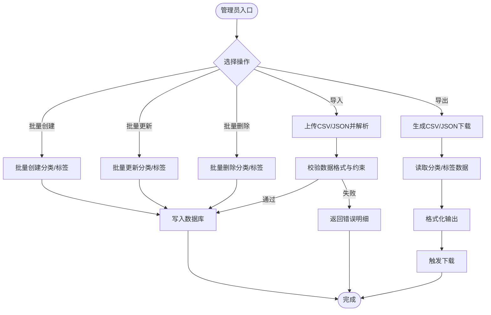
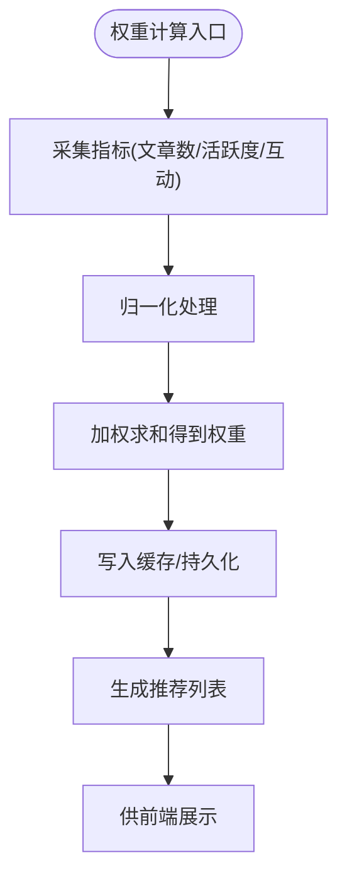
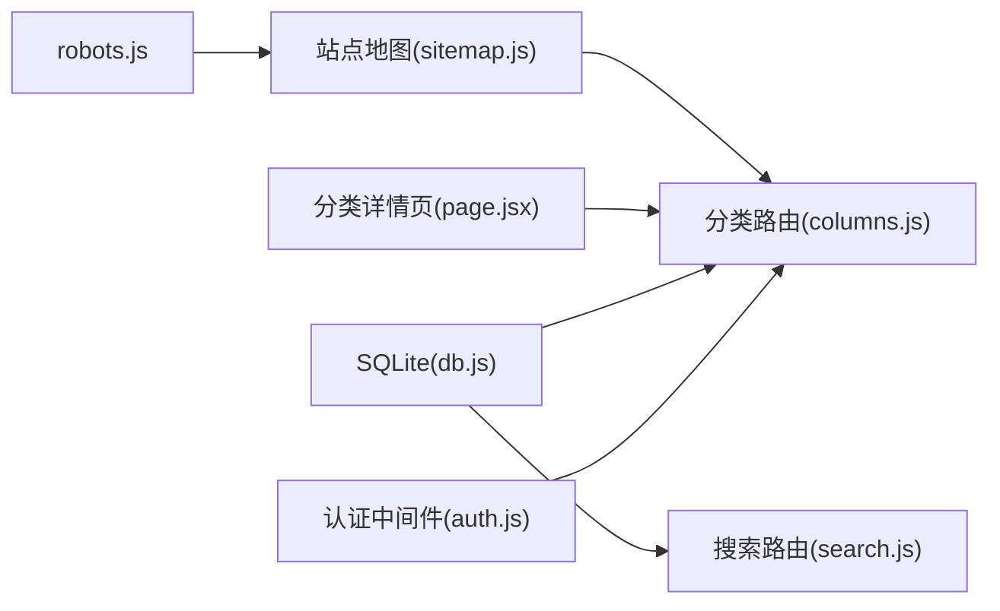

# 分类标签系统

<cite>
**本文引用的文件**   
- [server/src/db.js](file://server/src/db.js)
- [server/src/routes/columns.js](file://server/src/routes/columns.js)
- [src/app/category/[slug]/page.jsx](file://src/app/category/[slug]/page.jsx)
- [src/css_pages/CategoryPage.jsx](file://src/css_pages/CategoryPage.jsx)
- [src/app/sitemap.js](file://src/app/sitemap.js)
- [src/app/robots.js](file://src/app/robots.js)
- [server/src/routes/search.js](file://server/src/routes/search.js)
- [server/src/middleware/auth.js](file://server/src/middleware/auth.js)
</cite>

## 目录
1. [简介](#简介)
2. [项目结构](#项目结构)
3. [核心组件](#核心组件)
4. [架构总览](#架构总览)
5. [详细组件分析](#详细组件分析)
6. [依赖分析](#依赖分析)
7. [性能考虑](#性能考虑)
8. [故障排查指南](#故障排查指南)
9. [结论](#结论)
10. [附录](#附录)

## 简介
本文件围绕“分类与标签系统”进行系统化文档化，覆盖数据库表结构设计、多对多关系与索引优化、CRUD API（含层级分类）、前端分类浏览页（动态路由与SEO）、搜索过滤（全文检索与排序策略）、批量管理与导入导出、以及权重计算与推荐算法方案。内容基于仓库现有实现与约定进行梳理，并对缺失能力给出可落地的扩展建议。

## 项目结构
本项目采用前后端分离：
- 后端：Node.js + SQLite，提供 REST 接口，包含分类/专栏路由、搜索路由、认证中间件等。
- 前端：Next.js App Router，提供分类详情页、站点地图与 robots 配置等。

图表来源
- [server/src/db.js](file://server/src/db.js)
- [server/src/routes/columns.js](file://server/src/routes/columns.js)
- [server/src/routes/search.js](file://server/src/routes/search.js)
- [server/src/middleware/auth.js](file://server/src/middleware/auth.js)
- [src/app/category/[slug]/page.jsx](file://src/app/category/[slug]/page.jsx)
- [src/css_pages/CategoryPage.jsx](file://src/css_pages/CategoryPage.jsx)
- [src/app/sitemap.js](file://src/app/sitemap.js)
- [src/app/robots.js](file://src/app/robots.js)

章节来源
- [server/src/db.js](file://server/src/db.js)
- [server/src/routes/columns.js](file://server/src/routes/columns.js)
- [server/src/routes/search.js](file://server/src/routes/search.js)
- [server/src/middleware/auth.js](file://server/src/middleware/auth.js)
- [src/app/category/[slug]/page.jsx](file://src/app/category/[slug]/page.jsx)
- [src/css_pages/CategoryPage.jsx](file://src/css_pages/CategoryPage.jsx)
- [src/app/sitemap.js](file://src/app/sitemap.js)
- [src/app/robots.js](file://src/app/robots.js)

## 核心组件
- 数据层：SQLite 数据源封装，负责连接与基础查询。
- 路由层：分类/专栏路由提供分类列表、详情、创建/更新/删除等；搜索路由提供关键词检索。
- 前端：Next.js 动态路由页面渲染分类详情；站点地图与 robots 支持 SEO。
- 中间件：认证鉴权用于受保护操作（如管理端）。

章节来源
- [server/src/db.js](file://server/src/db.js)
- [server/src/routes/columns.js](file://server/src/routes/columns.js)
- [server/src/routes/search.js](file://server/src/routes/search.js)
- [src/app/category/[slug]/page.jsx](file://src/app/category/[slug]/page.jsx)
- [src/app/sitemap.js](file://src/app/sitemap.js)
- [src/app/robots.js](file://src/app/robots.js)
- [server/src/middleware/auth.js](file://server/src/middleware/auth.js)

## 架构总览
下图展示分类与标签在系统中的交互关系与数据流向。

图表来源
- [server/src/routes/columns.js](file://server/src/routes/columns.js)
- [server/src/routes/search.js](file://server/src/routes/search.js)
- [server/src/db.js](file://server/src/db.js)
- [server/src/middleware/auth.js](file://server/src/middleware/auth.js)
- [src/app/category/[slug]/page.jsx](file://src/app/category/[slug]/page.jsx)

## 详细组件分析

### 数据库模型与索引设计
说明：
- 分类表：存储分类基本信息与层级关系（父级ID），支持无限层级。
- 标签表：存储标签名称、别名、权重等。
- 文章-分类多对多：通过中间表建立文章与分类的映射。
- 文章-标签多对多：通过中间表建立文章与标签的映射。
- 索引优化：针对外键、常用查询字段（slug、name、parent_id）建立索引；对多对多中间表建立复合索引以加速 JOIN。

建议索引（按查询热点）：
- 分类：idx_category_slug(slug)、idx_category_parent(parent_id)、idx_category_weight(weight)。
- 标签：idx_tag_name(name)、idx_tag_slug(slug)、idx_tag_weight(weight)。
- 文章-分类中间表：idx_pc_post(post_id)、idx_pc_cat(category_id)、idx_pc_post_cat(post_id, category_id)。
- 文章-标签中间表：idx_pt_post(post_id)、idx_pt_tag(tag_id)、idx_pt_post_tag(post_id, tag_id)。
- 文章：idx_post_published(published_at)、idx_post_author(author_id)。

章节来源
- [server/src/db.js](file://server/src/db.js)

### 分类与标签 CRUD API
说明：
- 分类列表：支持分页、筛选（按父级、权重）、排序。
- 分类详情：根据 slug 获取分类信息及其文章列表。
- 分类创建/更新/删除：受认证中间件保护，支持层级设置与权重调整。
- 标签云：聚合标签与其出现次数，按权重或频次生成词云数据。
- 批量管理：批量创建/更新/删除分类与标签。
- 导入导出：从 CSV/JSON 导入分类与标签，导出为 CSV/JSON。

图表来源
- [server/src/routes/columns.js](file://server/src/routes/columns.js)
- [server/src/middleware/auth.js](file://server/src/middleware/auth.js)

章节来源
- [server/src/routes/columns.js](file://server/src/routes/columns.js)
- [server/src/middleware/auth.js](file://server/src/middleware/auth.js)

### 前端分类浏览页（动态路由与SEO）
说明：
- 动态路由：使用 Next.js App Router 的 [slug] 参数渲染分类详情。
- SEO：通过 sitemap 与 robots 控制爬虫抓取；详情页输出结构化元信息与链接。
- 数据加载：服务端获取分类详情与文章列表，减少客户端负担。

图表来源
- [src/app/category/[slug]/page.jsx](file://src/app/category/[slug]/page.jsx)
- [server/src/routes/columns.js](file://server/src/routes/columns.js)
- [server/src/db.js](file://server/src/db.js)

章节来源
- [src/app/category/[slug]/page.jsx](file://src/app/category/[slug]/page.jsx)
- [src/app/sitemap.js](file://src/app/sitemap.js)
- [src/app/robots.js](file://src/app/robots.js)

### 搜索与过滤（全文检索与排序）
说明：
- 搜索路由：接收关键词参数，执行全文/模糊匹配，返回文章列表。
- 排序策略：支持按发布时间、热度、相关性等多维度排序。
- 分页与高亮：返回分页结果，并在前端对关键词进行高亮显示。

图表来源
- [server/src/routes/search.js](file://server/src/routes/search.js)
- [server/src/db.js](file://server/src/db.js)

章节来源
- [server/src/routes/search.js](file://server/src/routes/search.js)

### 批量管理与导入导出
说明：
- 批量操作：支持一次性创建/更新/删除多个分类或标签，提升管理效率。
- 导入：接受 CSV/JSON 格式，校验字段后写入数据库。
- 导出：将分类与标签数据导出为 CSV/JSON，便于备份与迁移。

章节来源
- [server/src/routes/columns.js](file://server/src/routes/columns.js)

### 分类权重与推荐算法
说明：
- 权重计算：结合分类下文章数量、最近更新时间、点击/收藏等指标，计算综合权重。
- 推荐策略：首页或侧边栏展示热门分类；根据用户历史行为进行个性化推荐。
- 缓存与异步：对高频计算的权重进行缓存，定时任务更新。

章节来源
- [server/src/routes/columns.js](file://server/src/routes/columns.js)

## 依赖分析
- 模块耦合：
  - 分类路由依赖认证中间件与数据库封装。
  - 搜索路由依赖数据库封装。
  - 前端分类页依赖分类路由与站点地图/robots。
- 外部依赖：
  - SQLite 作为轻量级数据库。
  - Next.js 提供 SSR/SSG 与路由能力。

图表来源
- [server/src/middleware/auth.js](file://server/src/middleware/auth.js)
- [server/src/routes/columns.js](file://server/src/routes/columns.js)
- [server/src/routes/search.js](file://server/src/routes/search.js)
- [server/src/db.js](file://server/src/db.js)
- [src/app/category/[slug]/page.jsx](file://src/app/category/[slug]/page.jsx)
- [src/app/sitemap.js](file://src/app/sitemap.js)
- [src/app/robots.js](file://src/app/robots.js)

章节来源
- [server/src/middleware/auth.js](file://server/src/middleware/auth.js)
- [server/src/routes/columns.js](file://server/src/routes/columns.js)
- [server/src/routes/search.js](file://server/src/routes/search.js)
- [server/src/db.js](file://server/src/db.js)
- [src/app/category/[slug]/page.jsx](file://src/app/category/[slug]/page.jsx)
- [src/app/sitemap.js](file://src/app/sitemap.js)
- [src/app/robots.js](file://src/app/robots.js)

## 性能考虑
- 索引优化：为常用查询字段与外键建立索引，避免全表扫描。
- 分页与限流：列表接口默认分页，限制每页大小，防止大结果集拖慢响应。
- 缓存策略：对分类详情、标签云、权重计算结果进行缓存，降低数据库压力。
- 连接池：合理配置 SQLite 连接与事务，避免并发瓶颈。
- 前端优化：服务端渲染分类详情，减少首屏时间；懒加载文章列表。

[本节为通用指导，不直接分析具体文件]

## 故障排查指南
- 鉴权失败：检查认证中间件是否生效，确认请求头携带有效凭证。
- 404 未找到：确认分类 slug 是否存在，路由是否正确注册。
- 搜索无结果：检查关键词与索引状态，确认全文/模糊匹配逻辑。
- 导入失败：核对 CSV/JSON 字段与约束，查看错误明细定位问题。
- 性能问题：观察慢查询日志，补充必要索引，启用缓存。

章节来源
- [server/src/middleware/auth.js](file://server/src/middleware/auth.js)
- [server/src/routes/columns.js](file://server/src/routes/columns.js)
- [server/src/routes/search.js](file://server/src/routes/search.js)

## 结论
本分类与标签系统在后端通过清晰的模块化设计与合理的数据库索引，支撑了分类层级、标签云、搜索过滤与批量管理等核心能力；在前端借助 Next.js 的动态路由与 SEO 配置，提供了良好的用户体验与搜索引擎友好性。建议在后续迭代中完善全文检索引擎、引入更丰富的推荐指标与缓存机制，以提升整体性能与智能化水平。

## 附录
- 术语：
  - 分类：具有层级结构的主题集合。
  - 标签：扁平化的细粒度主题标记。
  - 权重：衡量分类或标签重要性的数值。
- 参考路径：
  - 分类路由实现：[server/src/routes/columns.js](file://server/src/routes/columns.js)
  - 搜索路由实现：[server/src/routes/search.js](file://server/src/routes/search.js)
  - 分类详情页：[src/app/category/[slug]/page.jsx](file://src/app/category/[slug]/page.jsx)
  - 站点地图与 robots：[src/app/sitemap.js](file://src/app/sitemap.js), [src/app/robots.js](file://src/app/robots.js)
  - 认证中间件：[server/src/middleware/auth.js](file://server/src/middleware/auth.js)
  - 数据库封装：[server/src/db.js](file://server/src/db.js)