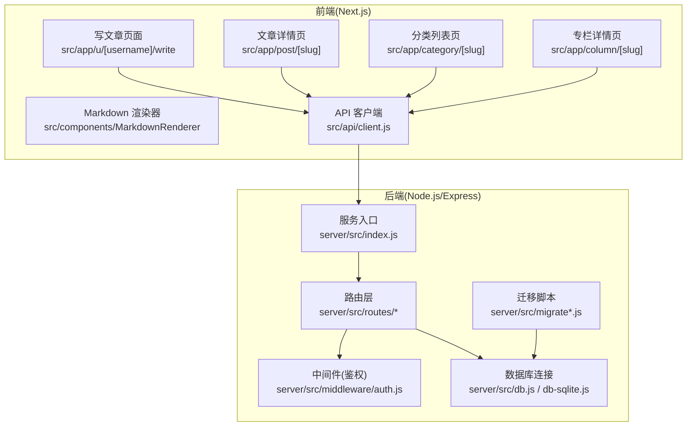
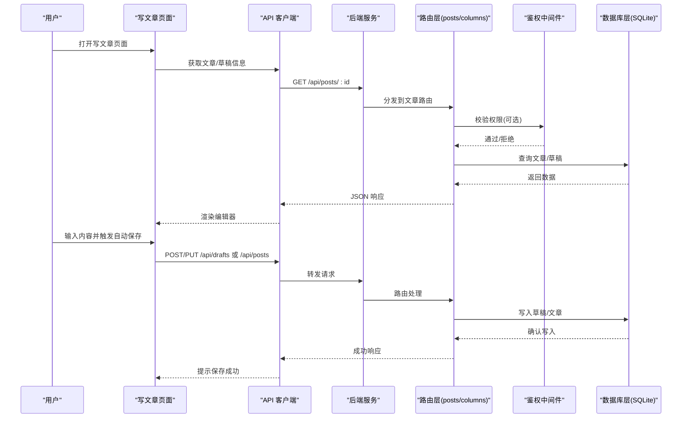
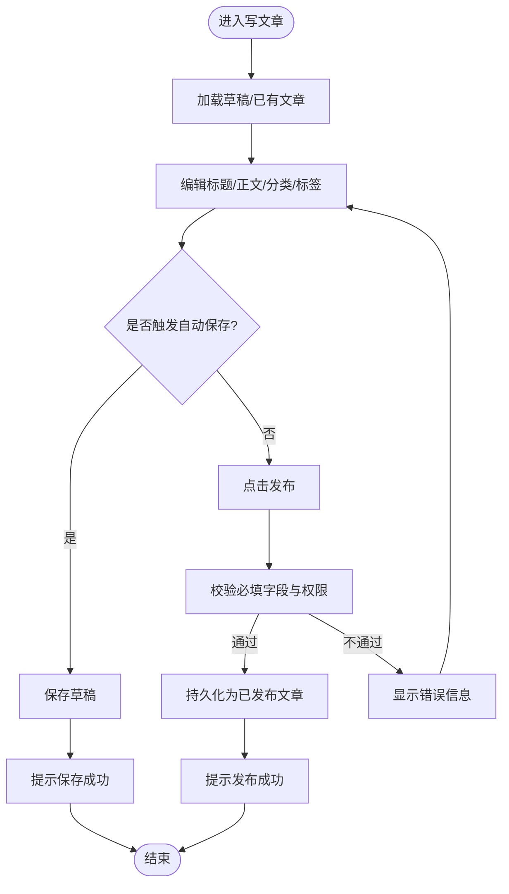
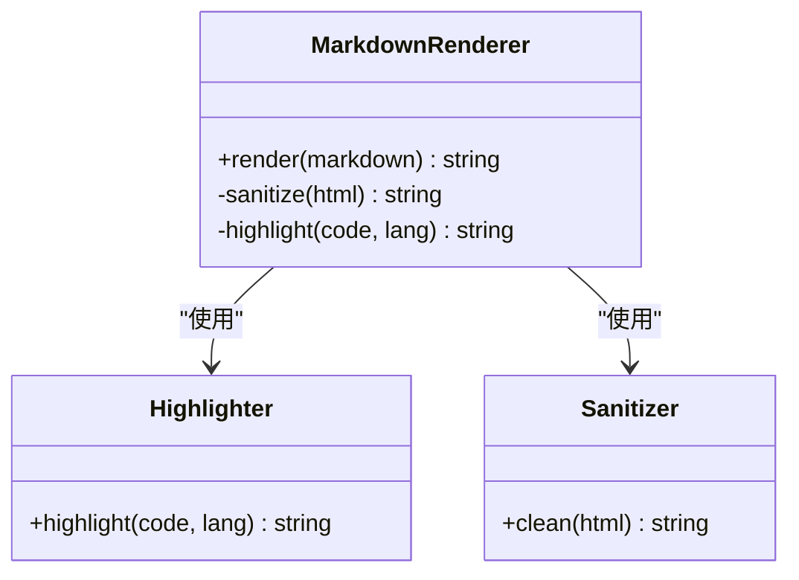
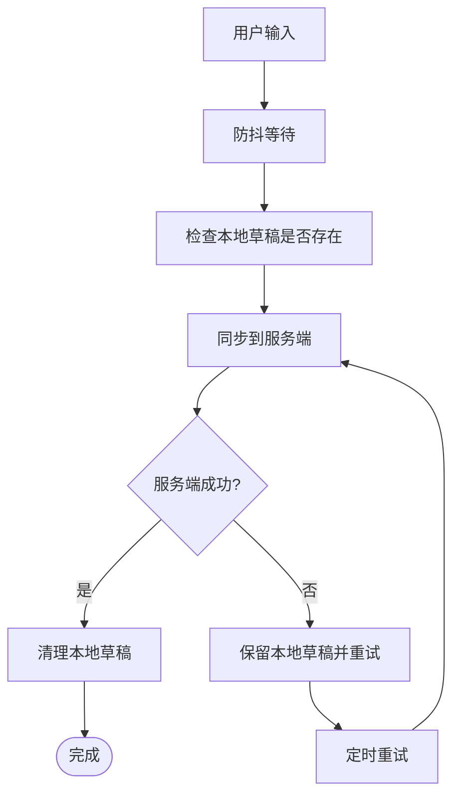
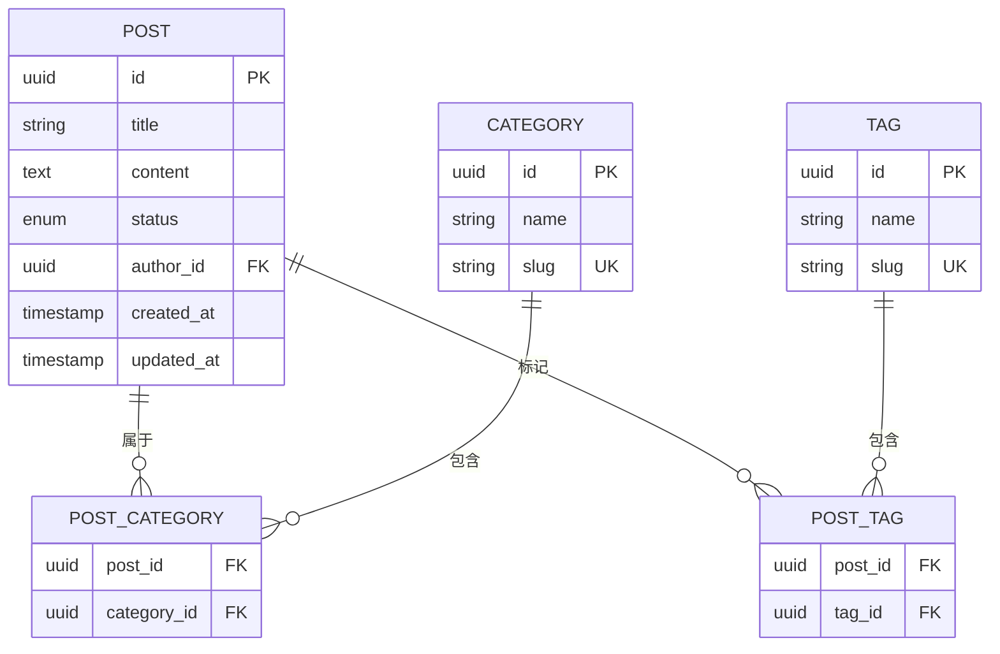
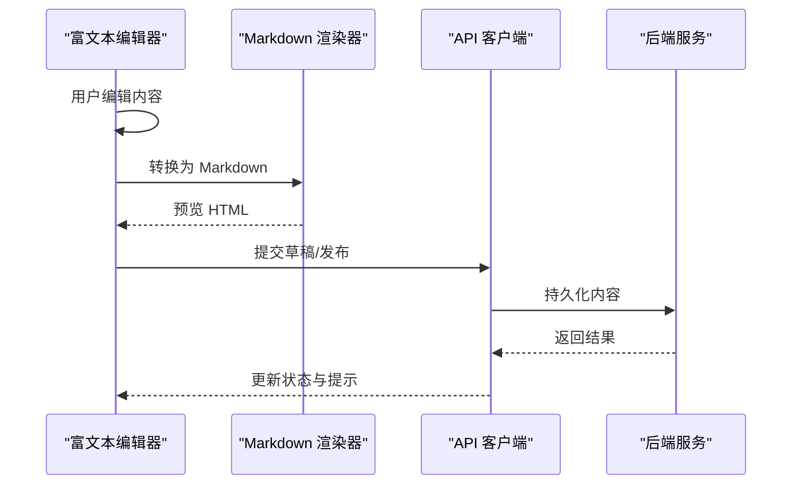
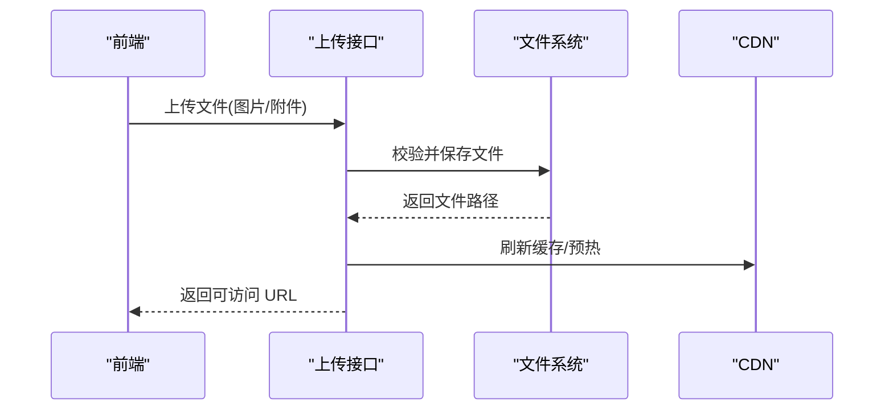
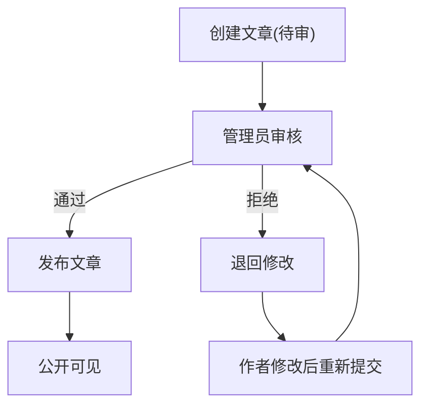
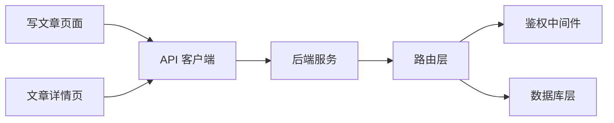

# 博客内容管理

<cite>
**本文引用的文件**   
- [README.md](file://README.md)
- [API.md](file://API.md)
- [server/src/index.js](file://server/src/index.js)
- [server/src/db.js](file://server/src/db.js)
- [server/src/db-sqlite.js](file://server/src/db-sqlite.js)
- [server/src/migrate.js](file://server/src/migrate.js)
- [server/src/migrate-draft.js](file://server/src/migrate-draft.js)
- [server/src/routes/posts.js](file://server/src/routes/posts.js)
- [server/src/routes/columns.js](file://server/src/routes/columns.js)
- [server/src/routes/auth.js](file://server/src/routes/auth.js)
- [server/src/middleware/auth.js](file://server/src/middleware/auth.js)
- [src/components/MarkdownRenderer/index.jsx](file://src/components/MarkdownRenderer/index.jsx)
- [src/app/u/[username]/write/page.jsx](file://src/app/u/[username]/write/page.jsx)
- [src/app/u/[username]/write/[id]/page.jsx](file://src/app/u/[username]/write/[id]/page.jsx)
- [src/app/post/[slug]/page.jsx](file://src/app/post/[slug]/page.jsx)
- [src/app/category/[slug]/page.jsx](file://src/app/category/[slug]/page.jsx)
- [src/app/column/[slug]/page.jsx](file://src/app/column/[slug]/page.jsx)
- [src/api/client.js](file://src/api/client.js)
</cite>

## 目录
1. [简介](#简介)
2. [项目结构](#项目结构)
3. [核心组件](#核心组件)
4. [架构总览](#架构总览)
5. [详细组件分析](#详细组件分析)
6. [依赖关系分析](#依赖关系分析)
7. [性能考量](#性能考量)
8. [故障排查指南](#故障排查指南)
9. [结论](#结论)
10. [附录](#附录)

## 简介
本文件面向“博客内容管理系统”，围绕文章与专栏的创建、编辑、发布、删除等完整生命周期，系统梳理前后端实现、数据模型、渲染器选型与安全策略、草稿自动保存机制、分类与标签体系、富文本编辑器集成、文件上传与图片优化、CDN 策略以及内容审核与批量操作最佳实践。文档以仓库现有代码为依据，提供可追溯的来源定位与可视化图示，帮助读者快速理解并扩展系统能力。

## 项目结构
本项目采用前后端分离架构：
- 前端基于 Next.js（App Router），包含页面路由、Markdown 渲染组件、写文章页面与详情展示页。
- 后端基于 Node.js + Express，提供 REST API，使用 SQLite 作为持久化存储，并通过迁移脚本维护数据库结构。
- 静态资源与上传文件位于 server/uploads 目录；前端通过统一的 API 客户端访问后端接口。

图表来源
- [server/src/index.js](file://server/src/index.js)
- [server/src/db.js](file://server/src/db.js)
- [server/src/db-sqlite.js](file://server/src/db-sqlite.js)
- [server/src/migrate.js](file://server/src/migrate.js)
- [server/src/migrate-draft.js](file://server/src/migrate-draft.js)
- [server/src/routes/posts.js](file://server/src/routes/posts.js)
- [server/src/routes/columns.js](file://server/src/routes/columns.js)
- [server/src/middleware/auth.js](file://server/src/middleware/auth.js)
- [src/components/MarkdownRenderer/index.jsx](file://src/components/MarkdownRenderer/index.jsx)
- [src/app/u/[username]/write/page.jsx](file://src/app/u/[username]/write/page.jsx)
- [src/app/post/[slug]/page.jsx](file://src/app/post/[slug]/page.jsx)
- [src/app/category/[slug]/page.jsx](file://src/app/category/[slug]/page.jsx)
- [src/app/column/[slug]/page.jsx](file://src/app/column/[slug]/page.jsx)
- [src/api/client.js](file://src/api/client.js)

章节来源
- [README.md](file://README.md)
- [API.md](file://API.md)

## 核心组件
- 文章与专栏 CRUD 路由：负责文章的增删改查、发布状态流转、分页与过滤。
- 鉴权中间件：保护管理员或作者专属接口，校验登录态与权限。
- 数据库层：SQLite 连接封装、表结构初始化与迁移。
- Markdown 渲染器：前端将 Markdown 转换为 HTML，支持语法高亮与代码块处理。
- 写文章页面：集成富文本/Markdown 编辑器，支持草稿自动保存与发布流程。
- API 客户端：统一请求封装，集中处理错误与重试策略。

章节来源
- [server/src/routes/posts.js](file://server/src/routes/posts.js)
- [server/src/routes/columns.js](file://server/src/routes/columns.js)
- [server/src/middleware/auth.js](file://server/src/middleware/auth.js)
- [server/src/db.js](file://server/src/db.js)
- [server/src/db-sqlite.js](file://server/src/db-sqlite.js)
- [server/src/migrate.js](file://server/src/migrate.js)
- [server/src/migrate-draft.js](file://server/src/migrate-draft.js)
- [src/components/MarkdownRenderer/index.jsx](file://src/components/MarkdownRenderer/index.jsx)
- [src/app/u/[username]/write/page.jsx](file://src/app/u/[username]/write/page.jsx)
- [src/app/u/[username]/write/[id]/page.jsx](file://src/app/u/[username]/write/[id]/page.jsx)
- [src/api/client.js](file://src/api/client.js)

## 架构总览
整体为典型的“前端 SPA/SSR + 后端 REST API + SQLite”的轻量级方案。前端通过 API 客户端调用后端路由，路由层在必要时执行鉴权中间件，再访问数据库层完成数据读写。迁移脚本在启动或部署时确保数据库结构与版本一致。

图表来源
- [server/src/index.js](file://server/src/index.js)
- [server/src/routes/posts.js](file://server/src/routes/posts.js)
- [server/src/middleware/auth.js](file://server/src/middleware/auth.js)
- [server/src/db.js](file://server/src/db.js)
- [src/app/u/[username]/write/page.jsx](file://src/app/u/[username]/write/page.jsx)
- [src/api/client.js](file://src/api/client.js)

## 详细组件分析

### 文章与专栏 CRUD 实现
- 文章路由：提供创建、更新、删除、获取详情、列表分页与筛选（按分类、标签、作者等）接口。
- 专栏路由：提供专栏的创建、更新、删除与详情获取。
- 发布流程：文章存在草稿与已发布两种状态，从草稿到发布需进行必要的校验与权限检查。
- 删除策略：软删除或硬删除取决于业务需求，建议对已关联评论/收藏的数据做一致性处理。

图表来源
- [server/src/routes/posts.js](file://server/src/routes/posts.js)
- [server/src/middleware/auth.js](file://server/src/middleware/auth.js)
- [server/src/db.js](file://server/src/db.js)
- [src/app/u/[username]/write/page.jsx](file://src/app/u/[username]/write/page.jsx)

章节来源
- [server/src/routes/posts.js](file://server/src/routes/posts.js)
- [server/src/routes/columns.js](file://server/src/routes/columns.js)
- [server/src/middleware/auth.js](file://server/src/middleware/auth.js)
- [server/src/db.js](file://server/src/db.js)
- [src/app/u/[username]/write/page.jsx](file://src/app/u/[username]/write/page.jsx)

### Markdown 渲染器技术选型与实现细节
- 技术选型：前端使用 Markdown 解析库将 Markdown 转为 HTML，结合语法高亮库实现代码块着色。
- 代码块处理：识别语言标识，生成带类名的代码节点，交由高亮库渲染。
- 安全性考虑：对输出 HTML 进行白名单过滤，禁用危险标签与事件属性，防止 XSS。
- 可扩展性：通过插件机制扩展自定义指令、表格增强、数学公式等。

图表来源
- [src/components/MarkdownRenderer/index.jsx](file://src/components/MarkdownRenderer/index.jsx)

章节来源
- [src/components/MarkdownRenderer/index.jsx](file://src/components/MarkdownRenderer/index.jsx)

### 草稿保存机制与自动保存策略
- 触发时机：编辑器输入防抖后自动保存，避免频繁写入。
- 数据模型：草稿与文章共用字段，但状态不同；草稿可保留未发布的临时内容。
- 持久化方案：优先落库，失败时降级至本地缓存（如 localStorage），恢复时合并差异。
- 冲突解决：服务端时间戳与版本号控制，保证多端编辑一致性。

图表来源
- [src/app/u/[username]/write/page.jsx](file://src/app/u/[username]/write/page.jsx)
- [src/app/u/[username]/write/[id]/page.jsx](file://src/app/u/[username]/write/[id]/page.jsx)
- [server/src/routes/posts.js](file://server/src/routes/posts.js)
- [server/src/migrate-draft.js](file://server/src/migrate-draft.js)

章节来源
- [src/app/u/[username]/write/page.jsx](file://src/app/u/[username]/write/page.jsx)
- [src/app/u/[username]/write/[id]/page.jsx](file://src/app/u/[username]/write/[id]/page.jsx)
- [server/src/routes/posts.js](file://server/src/routes/posts.js)
- [server/src/migrate-draft.js](file://server/src/migrate-draft.js)

### 分类与标签系统的数据库设计与查询优化
- 设计要点：
  - 文章与分类、标签多对多关系，使用中间表解耦。
  - 分类用于导航与聚合，标签用于细粒度检索。
- 索引优化：
  - 在分类 ID、标签 ID、文章状态、更新时间等常用查询列建立索引。
  - 组合索引覆盖常见过滤条件（如 status + category_id）。
- 查询优化：
  - 列表分页使用游标或基于索引的偏移分页。
  - 热点分类预计算计数，减少实时统计开销。

图表来源
- [server/src/migrate.js](file://server/src/migrate.js)
- [server/src/db.js](file://server/src/db.js)

章节来源
- [server/src/migrate.js](file://server/src/migrate.js)
- [server/src/db.js](file://server/src/db.js)

### 富文本编辑器集成与自定义扩展
- 集成方案：
  - 选择支持 Markdown 与所见即所得双模式的编辑器。
  - 通过工具栏配置插入图片、链接、表格、代码块等元素。
- 自定义扩展：
  - 注册自定义命令与快捷键，扩展业务字段（如引用、脚注）。
  - 注入自定义样式与主题，保持与站点风格一致。
- 数据绑定：
  - 编辑器内容与 Markdown 双向转换，确保发布与草稿一致性。

图表来源
- [src/app/u/[username]/write/page.jsx](file://src/app/u/[username]/write/page.jsx)
- [src/components/MarkdownRenderer/index.jsx](file://src/components/MarkdownRenderer/index.jsx)
- [src/api/client.js](file://src/api/client.js)
- [server/src/routes/posts.js](file://server/src/routes/posts.js)

章节来源
- [src/app/u/[username]/write/page.jsx](file://src/app/u/[username]/write/page.jsx)
- [src/components/MarkdownRenderer/index.jsx](file://src/components/MarkdownRenderer/index.jsx)
- [src/api/client.js](file://src/api/client.js)
- [server/src/routes/posts.js](file://server/src/routes/posts.js)

### 文件上传处理、图片优化与 CDN 集成
- 上传流程：
  - 前端选择文件后调用上传接口，后端校验类型、大小与命名规范。
  - 文件落盘至 uploads 目录，返回可访问 URL。
- 图片优化：
  - 服务端压缩与裁剪，生成缩略图与 WebP 格式。
  - 文件名去重与哈希化，避免路径冲突。
- CDN 集成：
  - 将静态资源与上传文件托管至 CDN，提升全球访问速度。
  - 设置合适的缓存头与回源策略，配合浏览器缓存。

图表来源
- [server/src/index.js](file://server/src/index.js)
- [server/src/routes/posts.js](file://server/src/routes/posts.js)

章节来源
- [server/src/index.js](file://server/src/index.js)
- [server/src/routes/posts.js](file://server/src/routes/posts.js)

### 内容审核流程与批量操作最佳实践
- 审核流程：
  - 新增文章默认处于待审状态，管理员审核后发布。
  - 敏感词检测与人工复核相结合，降低风险。
- 批量操作：
  - 提供批量发布、批量下架、批量移动分类等接口。
  - 使用事务保证一致性，记录操作日志便于审计。
- 权限控制：
  - 严格区分作者与管理员角色，最小权限原则。

图表来源
- [server/src/routes/posts.js](file://server/src/routes/posts.js)
- [server/src/middleware/auth.js](file://server/src/middleware/auth.js)

章节来源
- [server/src/routes/posts.js](file://server/src/routes/posts.js)
- [server/src/middleware/auth.js](file://server/src/middleware/auth.js)

## 依赖关系分析
- 模块耦合：
  - 路由层依赖鉴权中间件与数据库层，职责清晰。
  - 前端页面依赖 API 客户端与 Markdown 渲染器，关注点分离。
- 外部依赖：
  - 数据库驱动（SQLite）、Markdown 解析与高亮库、可能的图片处理库。
- 潜在循环依赖：
  - 当前结构未见明显循环，保持单向依赖。

图表来源
- [server/src/index.js](file://server/src/index.js)
- [server/src/routes/posts.js](file://server/src/routes/posts.js)
- [server/src/middleware/auth.js](file://server/src/middleware/auth.js)
- [server/src/db.js](file://server/src/db.js)
- [src/app/u/[username]/write/page.jsx](file://src/app/u/[username]/write/page.jsx)
- [src/app/post/[slug]/page.jsx](file://src/app/post/[slug]/page.jsx)
- [src/api/client.js](file://src/api/client.js)

章节来源
- [server/src/index.js](file://server/src/index.js)
- [server/src/routes/posts.js](file://server/src/routes/posts.js)
- [server/src/middleware/auth.js](file://server/src/middleware/auth.js)
- [server/src/db.js](file://server/src/db.js)
- [src/app/u/[username]/write/page.jsx](file://src/app/u/[username]/write/page.jsx)
- [src/app/post/[slug]/page.jsx](file://src/app/post/[slug]/page.jsx)
- [src/api/client.js](file://src/api/client.js)

## 性能考量
- 数据库层面：
  - 合理索引与查询计划，避免全表扫描。
  - 分页与懒加载，减少首屏数据量。
- 渲染层面：
  - Markdown 转 HTML 在服务端或构建期预渲染，降低客户端压力。
  - 代码块高亮按需加载，避免阻塞主线程。
- 缓存策略：
  - 文章详情与列表使用 HTTP 缓存与 CDN 缓存。
  - 热点数据引入内存缓存（如 Redis）以提升吞吐。
- 传输优化：
  - 启用 Gzip/Brotli 压缩，图片使用现代格式与自适应尺寸。

[本节为通用指导，无需具体文件来源]

## 故障排查指南
- 常见问题：
  - 数据库连接失败：检查 SQLite 文件路径与权限。
  - 上传失败：确认服务器磁盘空间与目录权限。
  - 渲染异常：检查 Markdown 语法与白名单配置。
- 调试手段：
  - 开启详细日志，记录关键请求与错误堆栈。
  - 使用浏览器开发者工具与网络面板定位问题。
- 恢复策略：
  - 定期备份数据库与上传文件。
  - 提供回滚与修复脚本，保障数据安全。

章节来源
- [server/src/db.js](file://server/src/db.js)
- [server/src/db-sqlite.js](file://server/src/db-sqlite.js)
- [server/src/index.js](file://server/src/index.js)

## 结论
本博客内容管理系统以轻量、易扩展为核心目标，实现了文章与专栏的完整 CRUD、草稿自动保存、Markdown 渲染与代码高亮、分类与标签体系、文件上传与 CDN 集成，并提供审核与批量操作的最佳实践。通过合理的数据库设计与查询优化、前端渲染与缓存策略，系统在可用性与性能之间取得平衡。后续可在安全加固、搜索体验与国际化方面持续演进。

[本节为总结性内容，无需具体文件来源]

## 附录
- 相关文档与接口说明：
  - [README.md](file://README.md)
  - [API.md](file://API.md)
- 页面与组件参考：
  - [写文章页面](file://src/app/u/[username]/write/page.jsx)
  - [文章详情页](file://src/app/post/[slug]/page.jsx)
  - [分类列表页](file://src/app/category/[slug]/page.jsx)
  - [专栏详情页](file://src/app/column/[slug]/page.jsx)
  - [Markdown 渲染器](file://src/components/MarkdownRenderer/index.jsx)
  - [API 客户端](file://src/api/client.js)
- 后端服务与数据层：
  - [服务入口](file://server/src/index.js)
  - [数据库连接](file://server/src/db.js)
  - [SQLite 适配](file://server/src/db-sqlite.js)
  - [迁移脚本](file://server/src/migrate.js)
  - [草稿迁移](file://server/src/migrate-draft.js)
  - [文章路由](file://server/src/routes/posts.js)
  - [专栏路由](file://server/src/routes/columns.js)
  - [鉴权中间件](file://server/src/middleware/auth.js)