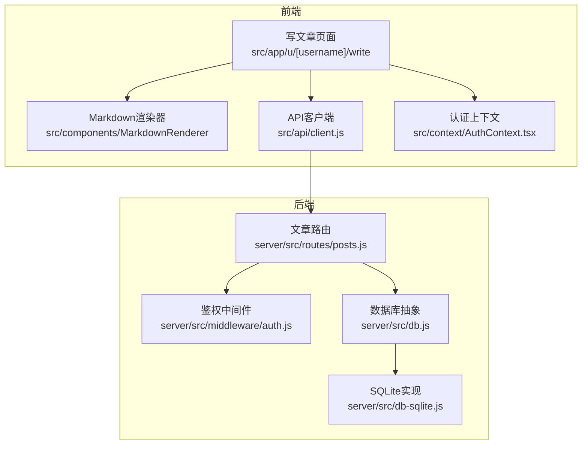
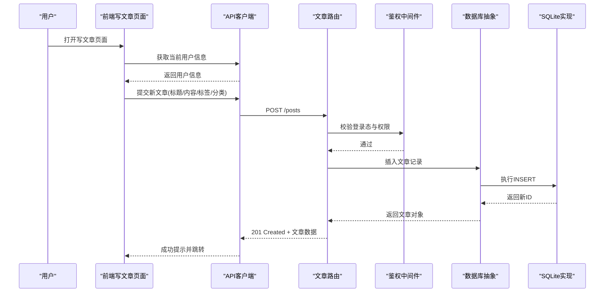
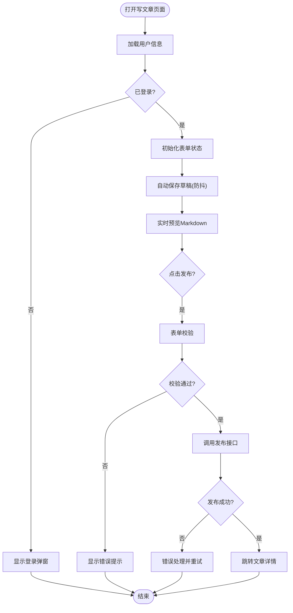
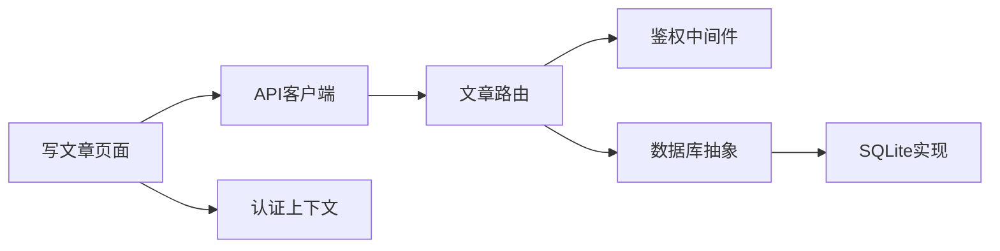

# 文章CRUD操作

<cite>
**本文引用的文件**   
- [server/src/routes/posts.js](file://server/src/routes/posts.js)
- [server/src/middleware/auth.js](file://server/src/middleware/auth.js)
- [server/src/db.js](file://server/src/db.js)
- [server/src/db-sqlite.js](file://server/src/db-sqlite.js)
- [src/app/u/[username]/write/page.jsx](file://src/app/u/[username]/write/page.jsx)
- [src/app/u/[username]/write/[id]/page.jsx](file://src/app/u/[username]/write/[id]/page.jsx)
- [src/components/MarkdownRenderer/index.jsx](file://src/components/MarkdownRenderer/index.jsx)
- [src/api/client.js](file://src/api/client.js)
- [src/context/AuthContext.tsx](file://src/context/AuthContext.tsx)
- [API.md](file://API.md)
</cite>

## 目录
1. [简介](#简介)
2. [项目结构](#项目结构)
3. [核心组件](#核心组件)
4. [架构总览](#架构总览)
5. [详细组件分析](#详细组件分析)
6. [依赖分析](#依赖分析)
7. [性能考虑](#性能考虑)
8. [故障排查指南](#故障排查指南)
9. [结论](#结论)
10. [附录](#附录)

## 简介
本文围绕“文章”的创建、读取、更新、删除（CRUD）进行系统化文档化，覆盖后端接口、前端写文章页面、权限控制、版本与历史记录方案、批量操作设计与优化策略。目标读者包括前后端开发者与产品/测试人员，力求在保持技术深度的同时提供可操作的实践指导。

## 项目结构
与文章CRUD相关的代码主要分布在以下位置：
- 后端路由与中间件：server/src/routes/posts.js、server/src/middleware/auth.js
- 数据库访问层：server/src/db.js、server/src/db-sqlite.js
- 前端写文章页面与编辑器：src/app/u/[username]/write/page.jsx、src/app/u/[username]/write/[id]/page.jsx
- Markdown渲染：src/components/MarkdownRenderer/index.jsx
- 前端API客户端与认证上下文：src/api/client.js、src/context/AuthContext.tsx
- API文档：API.md

图表来源
- [server/src/routes/posts.js](file://server/src/routes/posts.js)
- [server/src/middleware/auth.js](file://server/src/middleware/auth.js)
- [server/src/db.js](file://server/src/db.js)
- [server/src/db-sqlite.js](file://server/src/db-sqlite.js)
- [src/app/u/[username]/write/page.jsx](file://src/app/u/[username]/write/page.jsx)
- [src/app/u/[username]/write/[id]/page.jsx](file://src/app/u/[username]/write/[id]/page.jsx)
- [src/components/MarkdownRenderer/index.jsx](file://src/components/MarkdownRenderer/index.jsx)
- [src/api/client.js](file://src/api/client.js)
- [src/context/AuthContext.tsx](file://src/context/AuthContext.tsx)

章节来源
- [server/src/routes/posts.js](file://server/src/routes/posts.js)
- [server/src/middleware/auth.js](file://server/src/middleware/auth.js)
- [server/src/db.js](file://server/src/db.js)
- [server/src/db-sqlite.js](file://server/src/db-sqlite.js)
- [src/app/u/[username]/write/page.jsx](file://src/app/u/[username]/write/page.jsx)
- [src/app/u/[username]/write/[id]/page.jsx](file://src/app/u/[username]/write/[id]/page.jsx)
- [src/components/MarkdownRenderer/index.jsx](file://src/components/MarkdownRenderer/index.jsx)
- [src/api/client.js](file://src/api/client.js)
- [src/context/AuthContext.tsx](file://src/context/AuthContext.tsx)

## 核心组件
- 文章路由模块：负责文章的增删改查、草稿/发布状态管理、列表分页、按作者筛选等。
- 鉴权中间件：校验登录态与用户角色，用于保护写文章、编辑、删除等操作。
- 数据库抽象层：统一SQL执行与连接管理；SQLite实现提供具体持久化能力。
- 前端写文章页面：包含表单、内容预览、自动保存草稿、发布流程。
- Markdown渲染器：将文章内容渲染为HTML，支持安全过滤与样式。
- API客户端：封装HTTP请求、错误处理、重试与拦截器。
- 认证上下文：全局登录态、用户信息、权限判断。

章节来源
- [server/src/routes/posts.js](file://server/src/routes/posts.js)
- [server/src/middleware/auth.js](file://server/src/middleware/auth.js)
- [server/src/db.js](file://server/src/db.js)
- [server/src/db-sqlite.js](file://server/src/db-sqlite.js)
- [src/app/u/[username]/write/page.jsx](file://src/app/u/[username]/write/page.jsx)
- [src/app/u/[username]/write/[id]/page.jsx](file://src/app/u/[username]/write/[id]/page.jsx)
- [src/components/MarkdownRenderer/index.jsx](file://src/components/MarkdownRenderer/index.jsx)
- [src/api/client.js](file://src/api/client.js)
- [src/context/AuthContext.tsx](file://src/context/AuthContext.tsx)

## 架构总览
文章CRUD的整体调用链如下：
- 前端通过API客户端发起请求，携带认证令牌。
- 后端路由接收请求，先经过鉴权中间件校验身份与权限。
- 路由层解析参数并调用数据库抽象层执行SQL。
- SQLite实现完成数据读写，返回结果给路由层。
- 路由层组装响应，前端根据响应码与数据结构更新UI。

图表来源
- [server/src/routes/posts.js](file://server/src/routes/posts.js)
- [server/src/middleware/auth.js](file://server/src/middleware/auth.js)
- [server/src/db.js](file://server/src/db.js)
- [server/src/db-sqlite.js](file://server/src/db-sqlite.js)
- [src/app/u/[username]/write/page.jsx](file://src/app/u/[username]/write/page.jsx)
- [src/api/client.js](file://src/api/client.js)

## 详细组件分析

### 后端：文章路由与接口定义
- 职责
  - 提供文章CRUD接口：创建、读取详情、更新、删除、列表分页、按作者筛选、草稿/发布切换。
  - 参数校验与错误处理：字段缺失、类型错误、重复slug、权限不足等。
  - 事务与一致性：更新/删除时确保关联数据一致。
- 关键接口（示例说明）
  - 创建文章：POST /api/posts，请求体包含标题、内容、标签、分类、是否草稿等；成功后返回文章对象与201状态码。
  - 获取文章详情：GET /api/posts/:slug，返回文章详情及元信息。
  - 更新文章：PUT /api/posts/:slug，仅作者或管理员可编辑。
  - 删除文章：DELETE /api/posts/:slug，仅作者或管理员可删除。
  - 列表分页：GET /api/posts?page=...&size=...&author=...&status=draft|published。
  - 草稿/发布切换：PATCH /api/posts/:slug/status。
- 错误处理
  - 400：参数校验失败（如缺少必填字段）。
  - 401：未登录或令牌无效。
  - 403：无权限操作他人文章。
  - 404：文章不存在。
  - 500：服务器内部错误（数据库异常等）。

章节来源
- [server/src/routes/posts.js](file://server/src/routes/posts.js)
- [API.md](file://API.md)

### 后端：鉴权中间件
- 职责
  - 从请求头提取令牌并验证签名/过期时间。
  - 注入当前用户信息到请求上下文。
  - 基于用户角色（普通用户/管理员）进行授权判断。
- 使用方式
  - 对写文章、编辑、删除等敏感路由应用鉴权中间件。
  - 可选：针对特定资源（文章）进行二次校验（是否为作者）。

章节来源
- [server/src/middleware/auth.js](file://server/src/middleware/auth.js)

### 后端：数据库抽象与SQLite实现
- 职责
  - 数据库连接管理与生命周期控制。
  - 统一查询执行接口（单条/批量），参数绑定与结果映射。
  - 事务支持：BEGIN/COMMIT/ROLLBACK。
- SQLite实现
  - 基于sqlite3驱动，提供建表、迁移、索引优化。
  - 针对高频查询建立索引（如作者、状态、更新时间）。

章节来源
- [server/src/db.js](file://server/src/db.js)
- [server/src/db-sqlite.js](file://server/src/db-sqlite.js)

### 前端：写文章页面与状态管理
- 页面结构
  - 表单区：标题、正文（Markdown）、标签、分类、封面图、是否草稿。
  - 预览区：实时渲染Markdown内容。
  - 工具栏：保存草稿、发布、撤销、清空。
- 状态管理
  - 本地状态：表单值、预览HTML、加载态、错误信息。
  - 全局状态：登录态、用户信息、权限（来自认证上下文）。
- 交互流程
  - 新建：填写表单后点击“保存草稿”，调用创建接口；成功后进入编辑模式。
  - 编辑：自动保存草稿（防抖），避免丢失内容。
  - 发布：校验通过后调用发布接口，跳转到文章详情页。
  - 错误提示：统一Toast提示，网络异常重试机制。

章节来源
- [src/app/u/[username]/write/page.jsx](file://src/app/u/[username]/write/page.jsx)
- [src/app/u/[username]/write/[id]/page.jsx](file://src/app/u/[username]/write/[id]/page.jsx)
- [src/components/MarkdownRenderer/index.jsx](file://src/components/MarkdownRenderer/index.jsx)
- [src/api/client.js](file://src/api/client.js)
- [src/context/AuthContext.tsx](file://src/context/AuthContext.tsx)

### 前端：Markdown渲染器
- 职责
  - 将Markdown文本转换为安全的HTML。
  - 支持代码高亮、图片懒加载、链接新窗口打开等特性。
  - 提供主题适配与无障碍支持。
- 安全策略
  - 白名单过滤危险标签与属性。
  - 外链添加rel="noopener noreferrer"。

章节来源
- [src/components/MarkdownRenderer/index.jsx](file://src/components/MarkdownRenderer/index.jsx)

### 前端：API客户端与认证上下文
- API客户端
  - 统一请求封装：基础URL、超时、重试、错误码映射。
  - 拦截器：自动附加令牌、统一错误提示。
- 认证上下文
  - 提供登录、登出、刷新令牌、权限判断方法。
  - 订阅登录态变化，触发UI更新。

章节来源
- [src/api/client.js](file://src/api/client.js)
- [src/context/AuthContext.tsx](file://src/context/AuthContext.tsx)

## 依赖分析
- 耦合关系
  - 文章路由依赖鉴权中间件与数据库抽象层。
  - 前端写文章页面依赖API客户端与认证上下文。
  - Markdown渲染器独立于业务逻辑，便于复用。
- 外部依赖
  - 数据库：SQLite（开发/轻量部署）。
  - HTTP：Node.js内置http/https或框架封装。
  - Markdown：第三方库（如marked、highlight.js）。

图表来源
- [server/src/routes/posts.js](file://server/src/routes/posts.js)
- [server/src/middleware/auth.js](file://server/src/middleware/auth.js)
- [server/src/db.js](file://server/src/db.js)
- [server/src/db-sqlite.js](file://server/src/db-sqlite.js)
- [src/app/u/[username]/write/page.jsx](file://src/app/u/[username]/write/page.jsx)
- [src/api/client.js](file://src/api/client.js)
- [src/context/AuthContext.tsx](file://src/context/AuthContext.tsx)

章节来源
- [server/src/routes/posts.js](file://server/src/routes/posts.js)
- [server/src/middleware/auth.js](file://server/src/middleware/auth.js)
- [server/src/db.js](file://server/src/db.js)
- [server/src/db-sqlite.js](file://server/src/db-sqlite.js)
- [src/app/u/[username]/write/page.jsx](file://src/app/u/[username]/write/page.jsx)
- [src/api/client.js](file://src/api/client.js)
- [src/context/AuthContext.tsx](file://src/context/AuthContext.tsx)

## 性能考虑
- 数据库层面
  - 为常用查询字段建立索引（作者、状态、更新时间、slug）。
  - 分页查询使用LIMIT/OFFSET或游标分页，避免大偏移量。
  - 批量操作使用事务减少IO次数。
- 后端层面
  - 缓存热点文章详情（Redis或内存缓存），设置合理TTL。
  - 限流与熔断：对写接口实施速率限制，防止滥用。
  - 异步任务：发布后生成静态片段、统计指标等放入队列。
- 前端层面
  - 自动保存草稿采用防抖，降低频繁请求。
  - 列表页虚拟滚动，按需渲染长列表。
  - 图片懒加载与CDN加速。

[本节为通用性能建议，不直接分析具体文件]

## 故障排查指南
- 常见问题
  - 401未登录：检查令牌是否存在且有效，确认认证上下文是否正确注入。
  - 403无权限：确认当前用户是否为文章作者或管理员。
  - 404文章不存在：检查slug是否正确，或文章是否已被删除。
  - 500服务器错误：查看后端日志，定位数据库异常或空指针。
- 调试技巧
  - 开启后端详细日志，记录请求参数与SQL语句。
  - 前端启用网络面板，观察请求/响应结构与耗时。
  - 单元测试覆盖边界条件（空内容、超长字段、非法字符）。

章节来源
- [server/src/routes/posts.js](file://server/src/routes/posts.js)
- [server/src/middleware/auth.js](file://server/src/middleware/auth.js)
- [server/src/db.js](file://server/src/db.js)
- [server/src/db-sqlite.js](file://server/src/db-sqlite.js)
- [src/api/client.js](file://src/api/client.js)
- [src/context/AuthContext.tsx](file://src/context/AuthContext.tsx)

## 结论
本文档系统梳理了文章CRUD的后端接口、前端页面、权限控制与性能优化策略。通过清晰的架构图与流程图，帮助读者快速理解整体流程与关键实现点。建议在后续迭代中完善版本管理与历史记录功能，并引入更完善的监控与告警体系。

[本节为总结性内容，不直接分析具体文件]

## 附录

### 权限控制机制
- 作者权限验证
  - 写文章/编辑/删除需校验当前用户是否为文章作者或管理员。
  - 非作者尝试修改他人文章应返回403。
- 内容访问控制
  - 草稿仅作者可见，公开文章对所有用户可见。
  - 可按作者维度筛选文章列表。

章节来源
- [server/src/routes/posts.js](file://server/src/routes/posts.js)
- [server/src/middleware/auth.js](file://server/src/middleware/auth.js)

### 版本管理与历史记录方案
- 设计思路
  - 新增文章版本表，记录每次发布的快照（标题、内容、标签、分类、摘要、封面等）。
  - 文章主表保留最新版本引用，历史版本通过外键关联。
  - 支持回滚至指定版本，并生成新的版本号。
- 实现要点
  - 发布时写入新版本记录，原子更新主表版本指针。
  - 对比差异：计算内容变更行级diff，便于展示变更历史。
  - 审计日志：记录操作人、时间、原因。

[本节为概念性方案，不直接分析具体文件]

### 批量操作接口设计与优化
- 接口设计
  - 批量删除：DELETE /api/posts/batch，请求体为文章ID数组。
  - 批量状态切换：PATCH /api/posts/batch/status，请求体为{ids:[], status:"draft|published"}。
- 优化策略
  - 使用事务包裹多条SQL，保证一致性。
  - 分批处理：单次最多处理N条，避免超大请求体。
  - 幂等性：基于请求ID去重，防止重复提交。
  - 进度反馈：返回处理进度与结果汇总。

[本节为概念性设计，不直接分析具体文件]