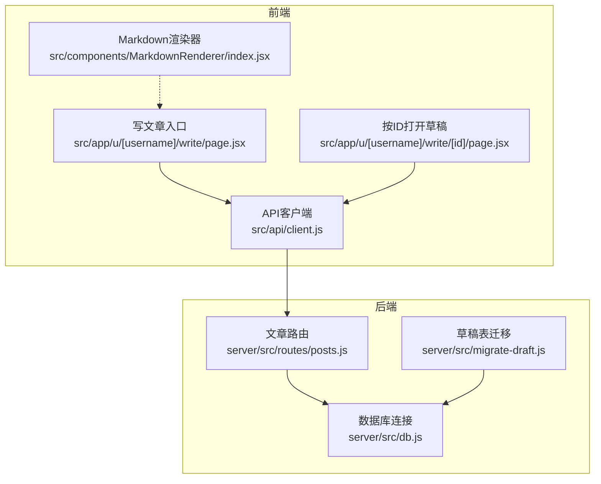
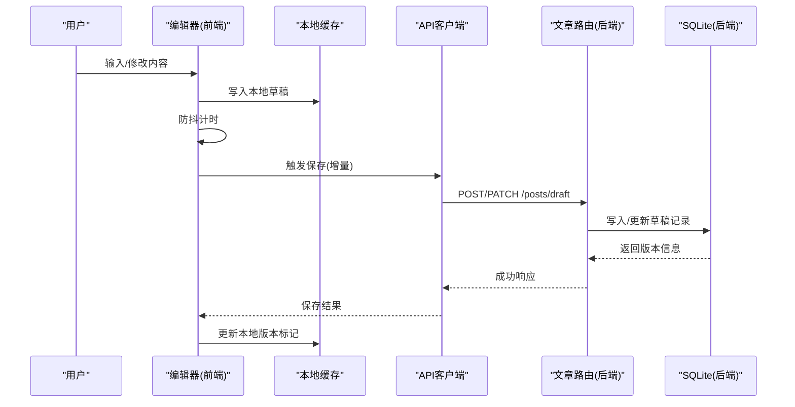
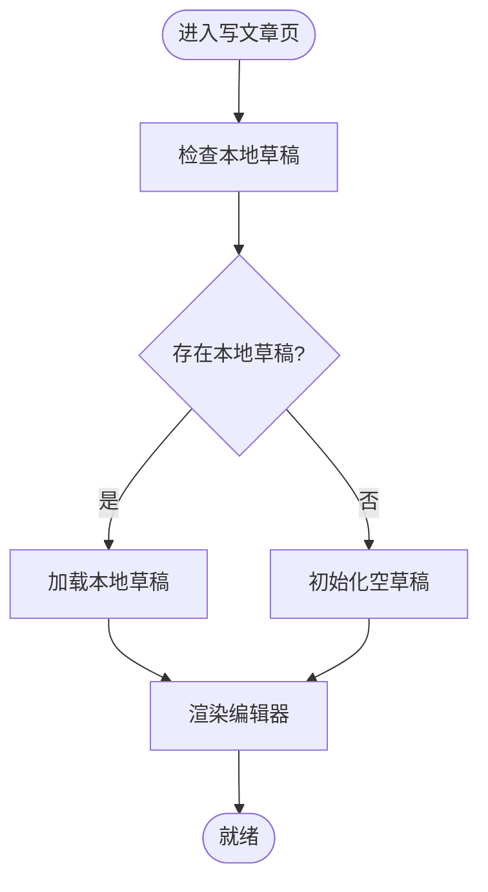
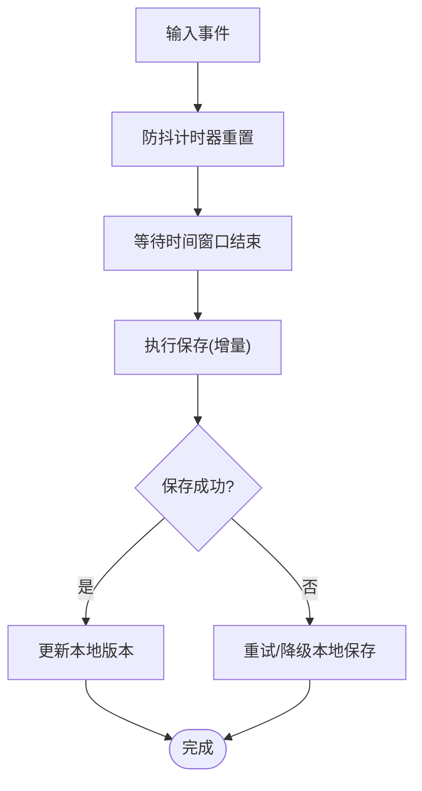
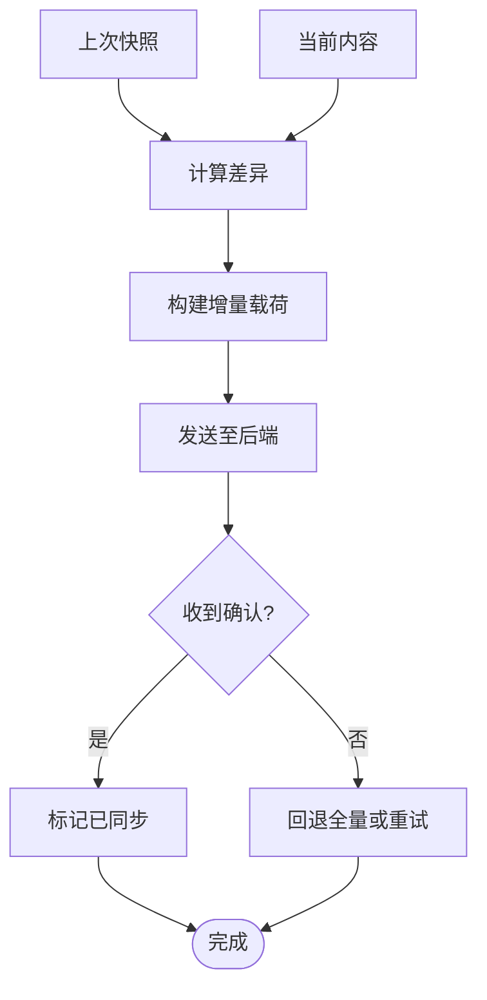
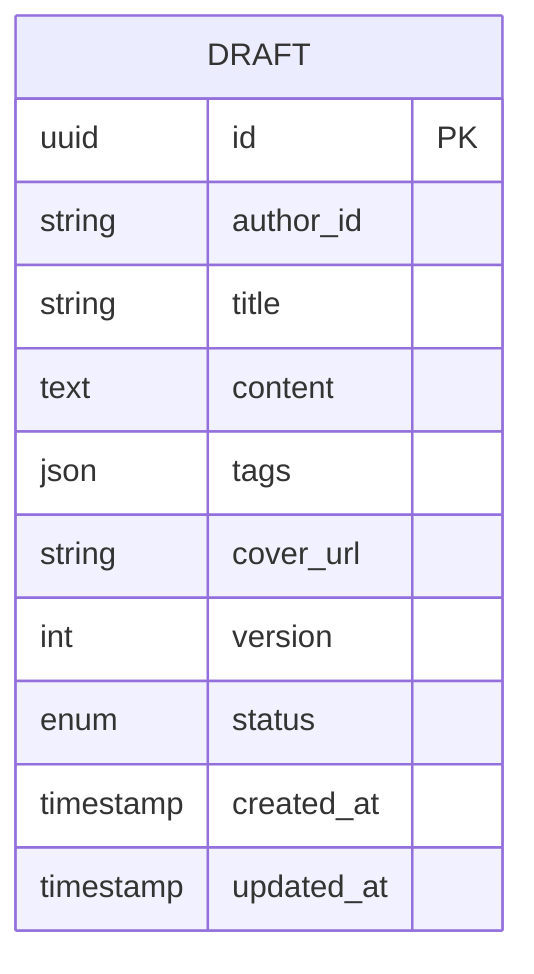
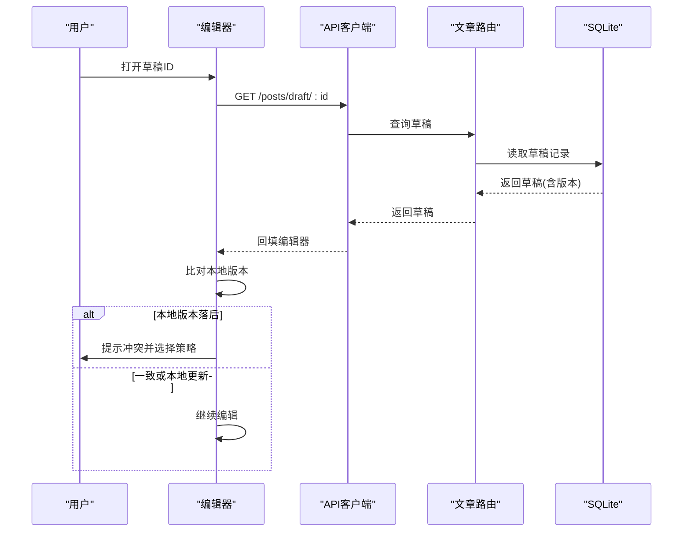
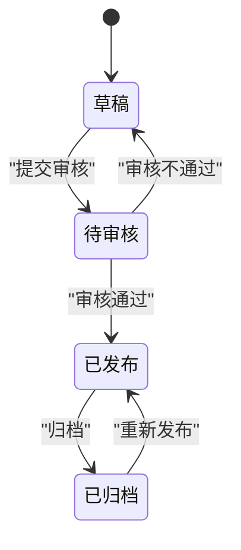
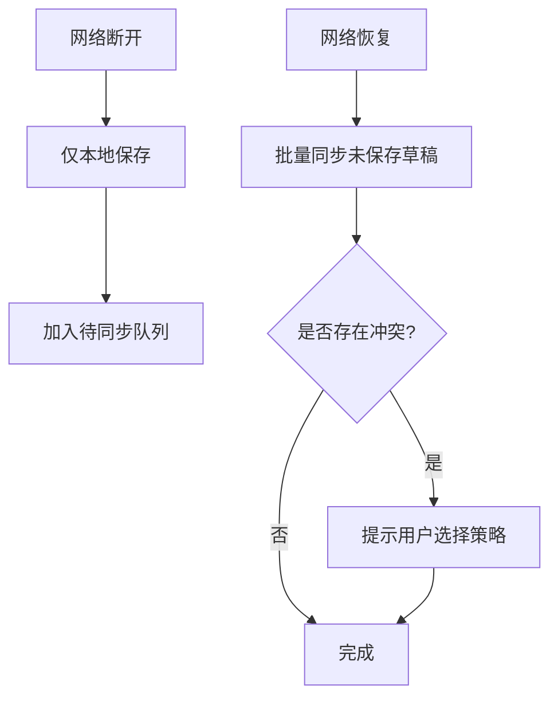
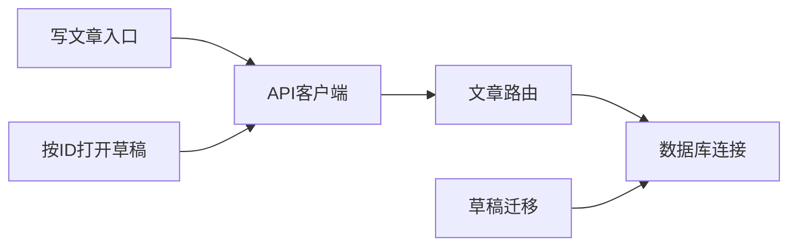

# 草稿保存系统

<cite>
**本文引用的文件**   
- [src/app/u/[username]/write/page.jsx](file://src/app/u/[username]/write/page.jsx)
- [src/app/u/[username]/write/[id]/page.jsx](file://src/app/u/[username]/write/[id]/page.jsx)
- [server/src/routes/posts.js](file://server/src/routes/posts.js)
- [server/src/db.js](file://server/src/db.js)
- [server/src/migrate-draft.js](file://server/src/migrate-draft.js)
- [src/api/client.js](file://src/api/client.js)
- [src/components/MarkdownRenderer/index.jsx](file://src/components/MarkdownRenderer/index.jsx)
- [API.md](file://API.md)
</cite>

## 目录
1. [简介](#简介)
2. [项目结构](#项目结构)
3. [核心组件](#核心组件)
4. [架构总览](#架构总览)
5. [详细组件分析](#详细组件分析)
6. [依赖关系分析](#依赖关系分析)
7. [性能考虑](#性能考虑)
8. [故障排查指南](#故障排查指南)
9. [结论](#结论)
10. [附录](#附录)

## 简介
本文件面向“草稿保存系统”的完整设计与实现，覆盖以下关键主题：
- 自动保存机制：防抖策略与增量保存算法
- 数据模型与存储：本地持久化与服务器同步策略
- 草稿恢复：版本管理与冲突解决
- 清理与优化：过期清理、空间压缩与索引策略
- 发布转换：草稿到已发布内容的状态流转
- 离线一致性：断网处理与最终一致性保障

## 项目结构
围绕草稿系统的代码主要分布在前后端：
- 前端编辑页面与渲染器
  - 写文章入口与按ID打开草稿页
  - Markdown渲染组件（用于预览）
  - API客户端封装
- 后端路由与数据库
  - 文章与草稿相关接口
  - SQLite数据库连接与迁移脚本

图表来源
- [src/app/u/[username]/write/page.jsx](file://src/app/u/[username]/write/page.jsx)
- [src/app/u/[username]/write/[id]/page.jsx](file://src/app/u/[username]/write/[id]/page.jsx)
- [src/components/MarkdownRenderer/index.jsx](file://src/components/MarkdownRenderer/index.jsx)
- [src/api/client.js](file://src/api/client.js)
- [server/src/routes/posts.js](file://server/src/routes/posts.js)
- [server/src/db.js](file://server/src/db.js)
- [server/src/migrate-draft.js](file://server/src/migrate-draft.js)

章节来源
- [src/app/u/[username]/write/page.jsx](file://src/app/u/[username]/write/page.jsx)
- [src/app/u/[username]/write/[id]/page.jsx](file://src/app/u/[username]/write/[id]/page.jsx)
- [src/components/MarkdownRenderer/index.jsx](file://src/components/MarkdownRenderer/index.jsx)
- [src/api/client.js](file://src/api/client.js)
- [server/src/routes/posts.js](file://server/src/routes/posts.js)
- [server/src/db.js](file://server/src/db.js)
- [server/src/migrate-draft.js](file://server/src/migrate-draft.js)

## 核心组件
- 编辑器入口与草稿加载
  - 新建草稿：进入写文章页时创建或获取本地草稿
  - 打开已有草稿：根据URL中的ID拉取服务端草稿并回填
- 自动保存与防抖
  - 基于输入事件触发保存任务
  - 使用防抖合并高频变更，降低网络请求频率
- 增量保存
  - 仅提交差异字段（如内容片段、元数据变更），减少带宽与计算开销
- 本地持久化
  - 在浏览器端缓存当前编辑态，支持刷新恢复
- 服务端同步
  - 通过统一API客户端调用后端接口完成落库
- 版本与冲突
  - 为每次保存生成版本号或时间戳
  - 冲突检测与合并策略（以服务端为准或提示用户选择）
- 清理与优化
  - 定期清理过期草稿
  - 对大文本进行分块或压缩存储
- 发布转换
  - 将草稿转换为正式文章，更新状态机并归档历史版本

章节来源
- [src/app/u/[username]/write/page.jsx](file://src/app/u/[username]/write/page.jsx)
- [src/app/u/[username]/write/[id]/page.jsx](file://src/app/u/[username]/write/[id]/page.jsx)
- [src/api/client.js](file://src/api/client.js)
- [server/src/routes/posts.js](file://server/src/routes/posts.js)
- [server/src/db.js](file://server/src/db.js)
- [server/src/migrate-draft.js](file://server/src/migrate-draft.js)

## 架构总览
整体采用“前端编辑+本地缓存+后端落库”的分层架构。编辑器负责采集变更与触发保存；API客户端统一封装请求；后端路由提供CRUD能力；SQLite作为持久化存储；迁移脚本保证表结构演进。

图表来源
- [src/app/u/[username]/write/page.jsx](file://src/app/u/[username]/write/page.jsx)
- [src/app/u/[username]/write/[id]/page.jsx](file://src/app/u/[username]/write/[id]/page.jsx)
- [src/api/client.js](file://src/api/client.js)
- [server/src/routes/posts.js](file://server/src/routes/posts.js)
- [server/src/db.js](file://server/src/db.js)

## 详细组件分析

### 编辑器与草稿加载流程
- 新建草稿
  - 进入写文章页时，优先读取本地草稿；若无则初始化空草稿并落盘
- 打开已有草稿
  - 解析URL中的草稿ID，调用后端接口获取草稿详情并回填编辑器
- 渲染预览
  - 使用Markdown渲染器实时预览

图表来源
- [src/app/u/[username]/write/page.jsx](file://src/app/u/[username]/write/page.jsx)
- [src/components/MarkdownRenderer/index.jsx](file://src/components/MarkdownRenderer/index.jsx)

章节来源
- [src/app/u/[username]/write/page.jsx](file://src/app/u/[username]/write/page.jsx)
- [src/components/MarkdownRenderer/index.jsx](file://src/components/MarkdownRenderer/index.jsx)

### 自动保存与防抖策略
- 触发时机
  - 监听编辑器输入事件，收集变更
- 防抖实现
  - 设置固定时间窗口（例如若干毫秒），窗口内多次变更只保留最后一次保存任务
- 保存队列
  - 若需要，维护轻量队列避免并发冲突
- 失败重试
  - 网络异常时指数退避重试，达到上限后降级为仅本地保存

图表来源
- [src/app/u/[username]/write/page.jsx](file://src/app/u/[username]/write/page.jsx)
- [src/api/client.js](file://src/api/client.js)

章节来源
- [src/app/u/[username]/write/page.jsx](file://src/app/u/[username]/write/page.jsx)
- [src/api/client.js](file://src/api/client.js)

### 增量保存算法
- 差异计算
  - 对比上次保存快照与当前内容，提取变更字段（如content、title、tags等）
- 传输格式
  - 仅发送变更字段与版本标识，后端据此进行条件更新
- 幂等性
  - 携带版本号或时间戳，确保重复提交不会产生副作用

图表来源
- [src/app/u/[username]/write/page.jsx](file://src/app/u/[username]/write/page.jsx)
- [server/src/routes/posts.js](file://server/src/routes/posts.js)

章节来源
- [src/app/u/[username]/write/page.jsx](file://src/app/u/[username]/write/page.jsx)
- [server/src/routes/posts.js](file://server/src/routes/posts.js)

### 草稿数据模型与存储设计
- 本地存储
  - 键名建议包含作者与草稿ID，便于多用户与多草稿隔离
  - 字段包括：标题、正文、标签、封面图、版本、更新时间戳、是否已同步
- 服务端存储
  - 草稿表需包含：主键、作者、标题、正文、标签、封面、版本、状态、创建/更新时间
  - 索引建议：作者+状态、更新时间
- 迁移与兼容
  - 通过迁移脚本新增/调整字段，保证向后兼容

图表来源
- [server/src/migrate-draft.js](file://server/src/migrate-draft.js)
- [server/src/db.js](file://server/src/db.js)

章节来源
- [server/src/migrate-draft.js](file://server/src/migrate-draft.js)
- [server/src/db.js](file://server/src/db.js)

### 草稿恢复与版本管理
- 恢复策略
  - 打开草稿时优先拉取服务端最新版本；若失败则回退至本地最新快照
- 版本管理
  - 每次保存递增版本号；前端显示最近保存时间与版本
- 冲突解决
  - 若检测到服务端版本高于本地，提示用户选择“覆盖本地”或“合并差异”
  - 合并策略可基于字段级合并或整篇替换

图表来源
- [src/app/u/[username]/write/[id]/page.jsx](file://src/app/u/[username]/write/[id]/page.jsx)
- [server/src/routes/posts.js](file://server/src/routes/posts.js)
- [server/src/db.js](file://server/src/db.js)

章节来源
- [src/app/u/[username]/write/[id]/page.jsx](file://src/app/u/[username]/write/[id]/page.jsx)
- [server/src/routes/posts.js](file://server/src/routes/posts.js)
- [server/src/db.js](file://server/src/db.js)

### 草稿清理与存储空间优化
- 清理策略
  - 定时任务或手动触发清理超过阈值的草稿（如30天未更新）
  - 删除前导出备份或归档
- 空间优化
  - 对长文内容进行分块存储或压缩
  - 图片资源走对象存储，本地仅保留引用
- 索引优化
  - 针对常用查询字段建立索引，提升列表与检索性能

章节来源
- [server/src/routes/posts.js](file://server/src/routes/posts.js)
- [server/src/db.js](file://server/src/db.js)

### 草稿到已发布内容的转换与状态管理
- 状态机
  - 草稿→待审核→已发布→已归档（可选）
- 转换流程
  - 校验必填字段与内容质量
  - 生成唯一slug与发布时间
  - 更新状态并记录操作日志
- 幂等与回滚
  - 发布操作具备幂等键；失败时可回滚状态

章节来源
- [server/src/routes/posts.js](file://server/src/routes/posts.js)

### 断网环境下的草稿处理与一致性保证
- 离线优先
  - 所有编辑变更先落本地，标记为“未同步”
- 重连恢复
  - 监听网络状态变化，自动尝试补发未同步草稿
- 最终一致性
  - 使用版本号与去重键避免重复保存
  - 冲突时以上次服务端版本为准，必要时提示用户合并

章节来源
- [src/app/u/[username]/write/page.jsx](file://src/app/u/[username]/write/page.jsx)
- [src/api/client.js](file://src/api/client.js)

## 依赖关系分析
- 前端依赖
  - 编辑器页面依赖API客户端与服务端路由
  - Markdown渲染器独立于保存逻辑，仅用于预览
- 后端依赖
  - 路由依赖数据库连接与迁移脚本
  - 迁移脚本负责表结构演进与兼容性

图表来源
- [src/app/u/[username]/write/page.jsx](file://src/app/u/[username]/write/page.jsx)
- [src/app/u/[username]/write/[id]/page.jsx](file://src/app/u/[username]/write/[id]/page.jsx)
- [src/api/client.js](file://src/api/client.js)
- [server/src/routes/posts.js](file://server/src/routes/posts.js)
- [server/src/db.js](file://server/src/db.js)
- [server/src/migrate-draft.js](file://server/src/migrate-draft.js)

章节来源
- [src/app/u/[username]/write/page.jsx](file://src/app/u/[username]/write/page.jsx)
- [src/app/u/[username]/write/[id]/page.jsx](file://src/app/u/[username]/write/[id]/page.jsx)
- [src/api/client.js](file://src/api/client.js)
- [server/src/routes/posts.js](file://server/src/routes/posts.js)
- [server/src/db.js](file://server/src/db.js)
- [server/src/migrate-draft.js](file://server/src/migrate-draft.js)

## 性能考虑
- 防抖参数调优
  - 根据设备性能与网络状况动态调整时间窗口
- 增量载荷大小控制
  - 限制单次增量大小，超大变更拆分为多次提交
- 数据库索引
  - 针对作者、状态、更新时间建立复合索引
- 前端渲染优化
  - 懒加载与虚拟滚动用于长文预览

[本节为通用指导，无需具体文件来源]

## 故障排查指南
- 常见问题
  - 自动保存未触发：检查输入事件绑定与防抖配置
  - 草稿丢失：核对本地缓存键与过期策略
  - 冲突频繁：确认版本号传递与后端条件更新逻辑
  - 发布失败：检查必填字段校验与状态机约束
- 定位步骤
  - 查看浏览器控制台与网络面板
  - 检查后端日志与数据库记录
  - 复现路径：新建草稿→编辑→保存→刷新→打开草稿

章节来源
- [src/app/u/[username]/write/page.jsx](file://src/app/u/[username]/write/page.jsx)
- [src/app/u/[username]/write/[id]/page.jsx](file://src/app/u/[username]/write/[id]/page.jsx)
- [server/src/routes/posts.js](file://server/src/routes/posts.js)

## 结论
本草稿保存系统通过“本地优先+增量同步+版本管理”的设计，在保证用户体验的同时实现了高可用与最终一致性。结合合理的清理与优化策略，可在复杂网络环境下稳定运行，并为后续扩展（如协作编辑、全文检索）奠定基础。

[本节为总结性内容，无需具体文件来源]

## 附录
- 参考文档
  - API接口说明：[API.md](file://API.md)

章节来源
- [API.md](file://API.md)