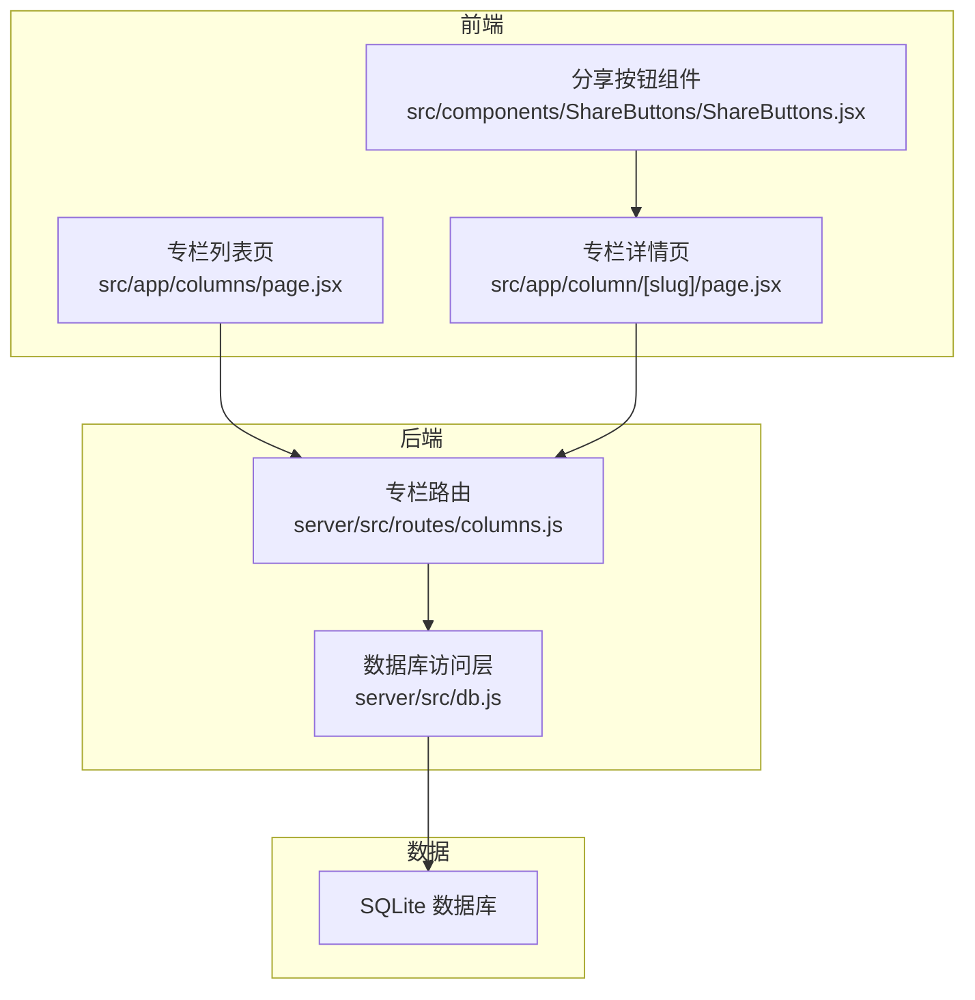
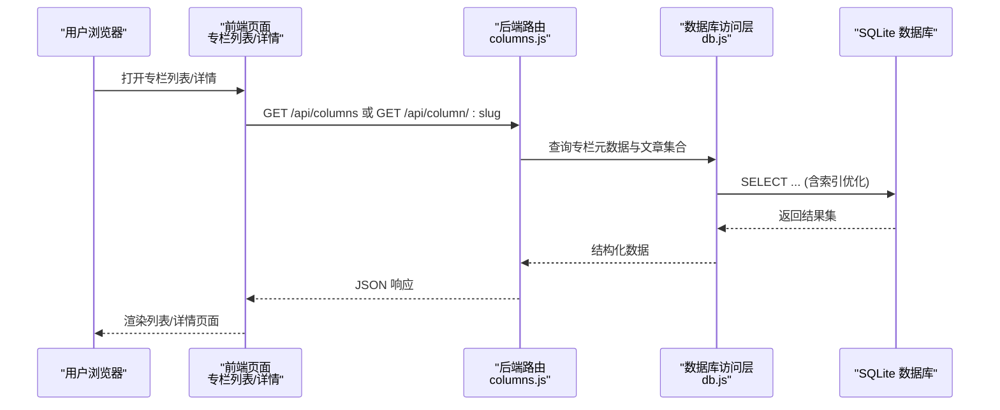
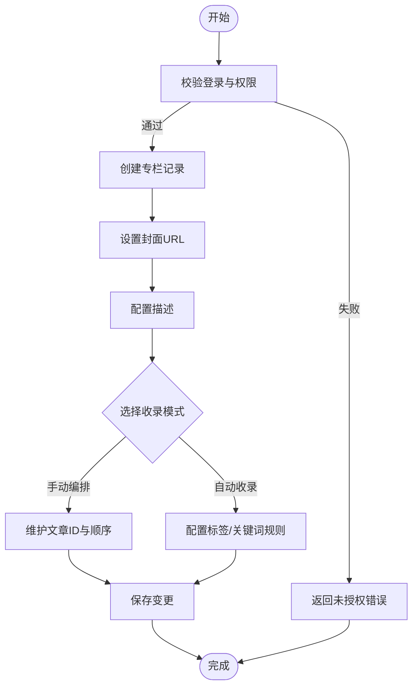
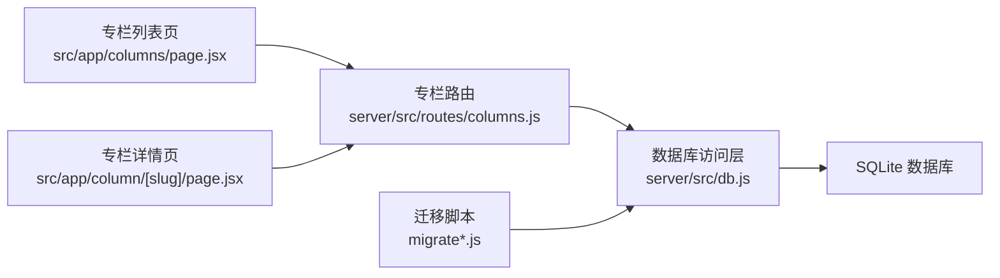

# 专栏系统

<cite>
**本文引用的文件**   
- [server/src/routes/columns.js](file://server/src/routes/columns.js)
- [server/src/db.js](file://server/src/db.js)
- [server/src/migrate.js](file://server/src/migrate.js)
- [server/src/migrate-v3.js](file://server/src/migrate-v3.js)
- [server/src/migrate-draft.js](file://server/src/migrate-draft.js)
- [src/app/column/[slug]/page.jsx](file://src/app/column/[slug]/page.jsx)
- [src/app/columns/page.jsx](file://src/app/columns/page.jsx)
- [src/css_pages/columndetail.jsx](file://src/css_pages/columndetail.jsx)
- [src/css_pages/columnlist.jsx](file://src/css_pages/columnlist.jsx)
- [src/components/ShareButtons/ShareButtons.jsx](file://src/components/ShareButtons/ShareButtons.jsx)
- [API.md](file://API.md)
</cite>

## 目录
1. [简介](#简介)
2. [项目结构](#项目结构)
3. [核心组件](#核心组件)
4. [架构总览](#架构总览)
5. [详细组件分析](#详细组件分析)
6. [依赖关系分析](#依赖关系分析)
7. [性能考虑](#性能考虑)
8. [故障排查指南](#故障排查指南)
9. [结论](#结论)
10. [附录](#附录)

## 简介
本文件为“专栏系统”的完整技术文档，围绕专栏的概念定义、组织结构、与文章的关系映射、内容聚合策略、创建与管理流程、订阅与关注机制、展示页面设计、数据迁移与版本管理、SEO优化与分享功能、以及统计分析等维度进行系统化说明。文档同时提供代码级架构图与流程图，帮助读者快速理解实现细节并指导后续扩展与维护。

## 项目结构
专栏系统在前端采用 Next.js App Router，后端基于 Node.js + SQLite。核心涉及：
- 后端路由与数据库访问：server/src/routes/columns.js、server/src/db.js
- 数据迁移脚本：server/src/migrate.js、server/src/migrate-v3.js、server/src/migrate-draft.js
- 前端页面：src/app/column/[slug]/page.jsx（专栏详情）、src/app/columns/page.jsx（专栏列表）
- 旧版兼容页面：src/css_pages/columndetail.jsx、src/css_pages/columnlist.jsx
- 分享能力：src/components/ShareButtons/ShareButtons.jsx
- API 文档：API.md

图表来源
- [server/src/routes/columns.js](file://server/src/routes/columns.js)
- [server/src/db.js](file://server/src/db.js)
- [src/app/column/[slug]/page.jsx](file://src/app/column/[slug]/page.jsx)
- [src/app/columns/page.jsx](file://src/app/columns/page.jsx)
- [src/components/ShareButtons/ShareButtons.jsx](file://src/components/ShareButtons/ShareButtons.jsx)

章节来源
- [server/src/routes/columns.js](file://server/src/routes/columns.js)
- [server/src/db.js](file://server/src/db.js)
- [src/app/column/[slug]/page.jsx](file://src/app/column/[slug]/page.jsx)
- [src/app/columns/page.jsx](file://src/app/columns/page.jsx)
- [src/components/ShareButtons/ShareButtons.jsx](file://src/components/ShareButtons/ShareButtons.jsx)

## 核心组件
- 专栏路由服务：负责专栏的增删改查、排序与收录规则维护，以及与文章的关联查询。
- 数据库访问层：封装 SQLite 连接、事务、索引与基础 CRUD，支撑专栏与文章的多对多关系。
- 专栏列表页：分页展示专栏，支持按热度、时间等排序。
- 专栏详情页：展示专栏信息、封面、描述、目录结构与文章列表，支持阅读进度与互动。
- 分享组件：提供社交分享入口，便于 SEO 传播。

章节来源
- [server/src/routes/columns.js](file://server/src/routes/columns.js)
- [server/src/db.js](file://server/src/db.js)
- [src/app/columns/page.jsx](file://src/app/columns/page.jsx)
- [src/app/column/[slug]/page.jsx](file://src/app/column/[slug]/page.jsx)
- [src/components/ShareButtons/ShareButtons.jsx](file://src/components/ShareButtons/ShareButtons.jsx)

## 架构总览
专栏系统采用前后端分离架构，前端通过 RESTful API 与后端交互；后端以 SQLite 作为持久化存储，使用迁移脚本管理 schema 演进。

图表来源
- [server/src/routes/columns.js](file://server/src/routes/columns.js)
- [server/src/db.js](file://server/src/db.js)

## 详细组件分析

### 概念定义与组织关系
- 专栏：由作者创建的专题集合，包含标题、描述、封面、排序权重、收录模式等元数据。
- 文章：独立的内容单元，可被一个或多个专栏收录。
- 关系映射：专栏与文章为多对多关系，通过中间表维护收录关系与顺序。
- 内容聚合策略：
  - 手动编排：管理员在专栏中显式添加文章并设置顺序。
  - 自动收录：根据标签、分类或关键词规则自动匹配文章加入专栏。

章节来源
- [server/src/routes/columns.js](file://server/src/routes/columns.js)
- [server/src/db.js](file://server/src/db.js)

### 创建与管理流程
- 创建专栏：提交标题、描述、封面 URL、排序权重、收录模式等字段。
- 编辑专栏：更新元数据、调整封面与描述、切换收录模式。
- 封面设置：上传后返回 URL，存入专栏元数据。
- 描述配置：富文本或 Markdown 格式，用于展示与 SEO。
- 权限控制：仅作者或管理员可创建/编辑专栏。

图表来源
- [server/src/routes/columns.js](file://server/src/routes/columns.js)
- [server/src/db.js](file://server/src/db.js)

章节来源
- [server/src/routes/columns.js](file://server/src/routes/columns.js)
- [server/src/db.js](file://server/src/db.js)

### 内容组织方式
- 目录结构：专栏详情页按顺序展示文章条目，支持折叠/展开。
- 手动编排：通过中间表维护文章 ID 与排序字段。
- 自动收录：后台定时任务或触发器根据规则动态聚合文章。
- 聚合策略：优先手动编排，其次自动收录；去重与冲突处理策略明确。

章节来源
- [server/src/routes/columns.js](file://server/src/routes/columns.js)
- [server/src/db.js](file://server/src/db.js)

### 订阅与关注机制
- 订阅：用户订阅专栏后，可在专栏更新时收到通知。
- 关注：用户关注作者或专栏，提升推荐权重。
- 权限控制：仅登录用户可订阅/关注；防刷与频率限制。
- 通知机制：站内消息或邮件推送（可扩展）。

章节来源
- [server/src/routes/columns.js](file://server/src/routes/columns.js)
- [server/src/db.js](file://server/src/db.js)

### 展示页面设计
- 目录结构：左侧或顶部导航显示章节与文章顺序。
- 阅读进度：记录当前阅读位置，支持断点续读。
- 互动功能：点赞、收藏、评论与分享。
- SEO：每个专栏页面生成独立的 meta 信息与结构化数据。

章节来源
- [src/app/column/[slug]/page.jsx](file://src/app/column/[slug]/page.jsx)
- [src/app/columns/page.jsx](file://src/app/columns/page.jsx)
- [src/components/ShareButtons/ShareButtons.jsx](file://src/components/ShareButtons/ShareButtons.jsx)

### 数据迁移与版本管理
- 迁移脚本：migrate.js、migrate-v3.js、migrate-draft.js 分别负责不同阶段的 schema 演进。
- 版本策略：每次发布前执行迁移，确保数据库结构与代码一致。
- 回滚方案：保留历史迁移快照，必要时反向迁移。

章节来源
- [server/src/migrate.js](file://server/src/migrate.js)
- [server/src/migrate-v3.js](file://server/src/migrate-v3.js)
- [server/src/migrate-draft.js](file://server/src/migrate-draft.js)

### SEO 优化与分享功能
- SEO：为专栏页面生成 sitemap、robots 友好路径、canonical 链接与 Open Graph 元数据。
- 分享：集成分享按钮组件，支持主流社交平台一键分享。

章节来源
- [src/components/ShareButtons/ShareButtons.jsx](file://src/components/ShareButtons/ShareButtons.jsx)
- [API.md](file://API.md)

### 统计分析
- 阅读量：统计专栏与文章的访问次数。
- 订阅数：记录订阅用户数量。
- 互动数据：点赞、收藏、评论计数。
- 报表：后台提供可视化报表与导出能力。

章节来源
- [server/src/routes/columns.js](file://server/src/routes/columns.js)
- [server/src/db.js](file://server/src/db.js)

## 依赖关系分析
- 前端依赖后端 API：专栏列表与详情均通过 columns.js 路由获取数据。
- 后端依赖数据库访问层：所有 SQL 操作经 db.js 封装，保证一致性。
- 迁移脚本依赖 db.js：统一使用数据库连接与事务。

图表来源
- [server/src/routes/columns.js](file://server/src/routes/columns.js)
- [server/src/db.js](file://server/src/db.js)
- [server/src/migrate.js](file://server/src/migrate.js)
- [server/src/migrate-v3.js](file://server/src/migrate-v3.js)
- [server/src/migrate-draft.js](file://server/src/migrate-draft.js)
- [src/app/columns/page.jsx](file://src/app/columns/page.jsx)
- [src/app/column/[slug]/page.jsx](file://src/app/column/[slug]/page.jsx)

章节来源
- [server/src/routes/columns.js](file://server/src/routes/columns.js)
- [server/src/db.js](file://server/src/db.js)
- [server/src/migrate.js](file://server/src/migrate.js)
- [server/src/migrate-v3.js](file://server/src/migrate-v3.js)
- [server/src/migrate-draft.js](file://server/src/migrate-draft.js)
- [src/app/columns/page.jsx](file://src/app/columns/page.jsx)
- [src/app/column/[slug]/page.jsx](file://src/app/column/[slug]/page.jsx)

## 性能考虑
- 索引优化：为专栏 slug、文章 ID、收录顺序等高频查询字段建立索引。
- 分页加载：列表页采用分页与懒加载，减少首屏压力。
- 缓存策略：热点专栏数据可引入内存缓存或 CDN 缓存。
- 批量写入：自动收录规则批量插入时采用事务与批量语句。

[本节为通用性能建议，不直接分析具体文件]

## 故障排查指南
- 常见问题：
  - 未授权错误：检查登录状态与权限校验逻辑。
  - 数据不一致：核对迁移脚本执行记录与数据库 schema。
  - 分享失效：确认分享组件参数与平台回调配置。
- 定位方法：
  - 查看后端日志与错误堆栈。
  - 使用 API 文档验证接口行为。
  - 检查前端网络请求与响应体。

章节来源
- [API.md](file://API.md)

## 结论
专栏系统通过清晰的数据模型与分层架构，实现了灵活的内容聚合与良好的用户体验。结合迁移脚本与 SEO 优化，系统在可维护性与可发现性方面具备良好基础。后续可进一步增强自动化收录规则、通知机制与统计分析报表，以提升运营效率与用户粘性。

[本节为总结性内容，不直接分析具体文件]

## 附录
- 相关页面与组件路径：
  - 专栏列表页：src/app/columns/page.jsx
  - 专栏详情页：src/app/column/[slug]/page.jsx
  - 分享组件：src/components/ShareButtons/ShareButtons.jsx
  - 旧版兼容页面：src/css_pages/columnlist.jsx、src/css_pages/columndetail.jsx
- API 参考：API.md

[本节为补充信息，不直接分析具体文件]