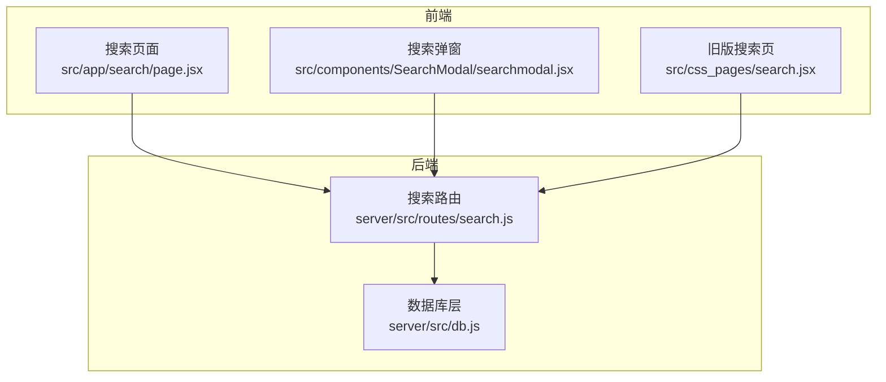
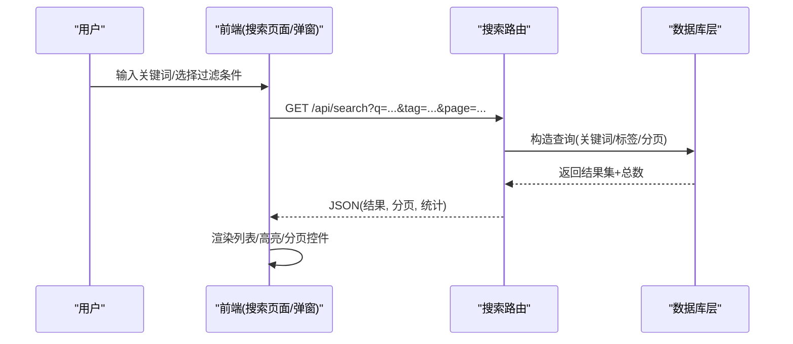
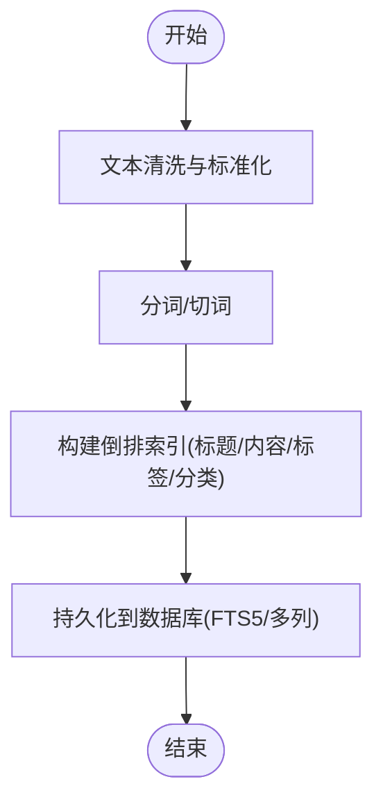
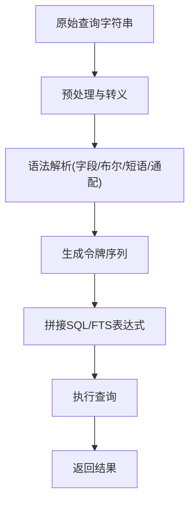
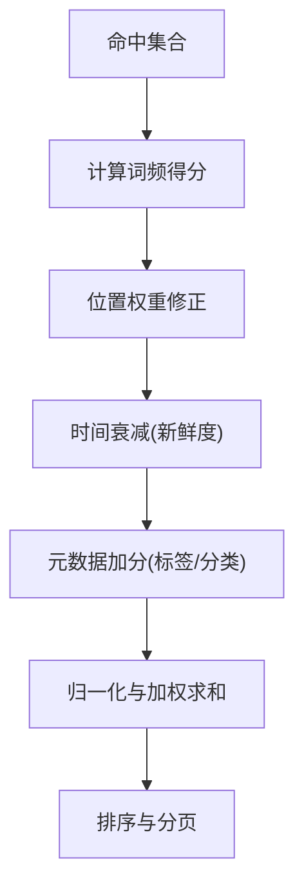
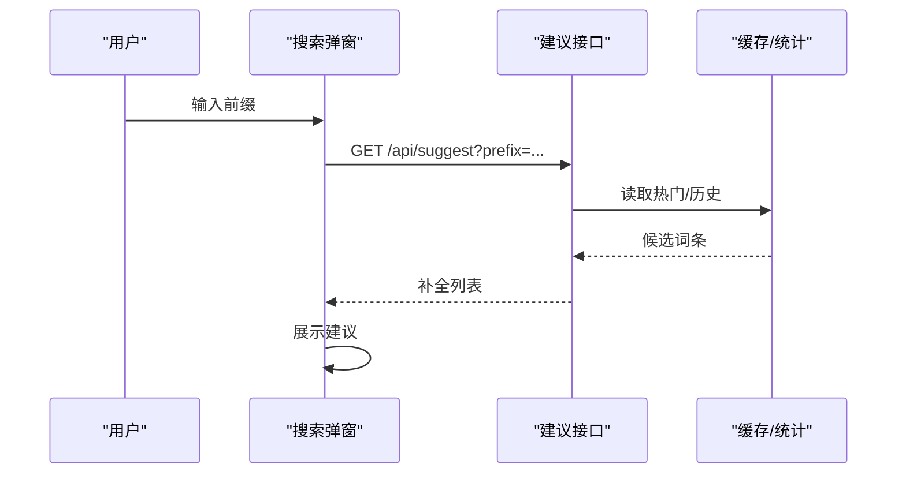
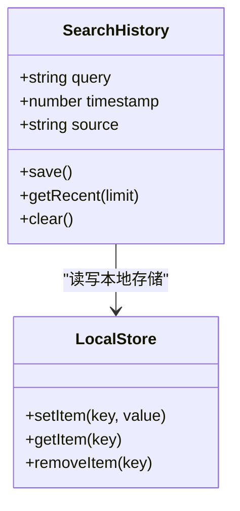
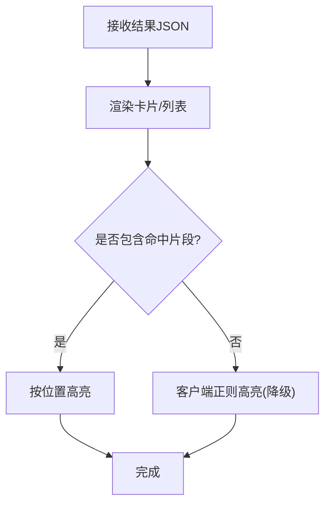
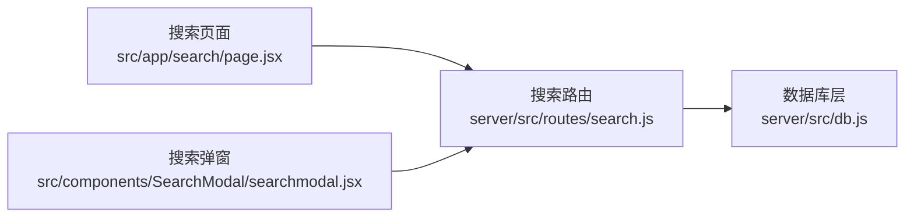

# 全文搜索

<cite>
**本文引用的文件**   
- [server/src/routes/search.js](file://server/src/routes/search.js)
- [server/src/db.js](file://server/src/db.js)
- [src/app/search/page.jsx](file://src/app/search/page.jsx)
- [src/components/SearchModal/searchmodal.jsx](file://src/components/SearchModal/searchmodal.jsx)
- [src/css_pages/search.jsx](file://src/css_pages/search.jsx)
</cite>

## 目录
1. [简介](#简介)
2. [项目结构](#项目结构)
3. [核心组件](#核心组件)
4. [架构总览](#架构总览)
5. [详细组件分析](#详细组件分析)
6. [依赖关系分析](#依赖关系分析)
7. [性能考虑](#性能考虑)
8. [故障排查指南](#故障排查指南)
9. [结论](#结论)
10. [附录](#附录)

## 简介
本文件面向“全文搜索”功能，围绕索引构建、查询解析、相关性评分、建议与历史、展示与高亮、分析与监控等维度进行系统化说明。文档既提供高层概览，也深入到代码级实现细节，帮助读者快速理解并扩展该能力。

## 项目结构
搜索相关的前后端入口与关键文件如下：
- 后端路由：server/src/routes/search.js
- 数据库访问：server/src/db.js
- 前端页面：src/app/search/page.jsx
- 全局搜索弹窗：src/components/SearchModal/searchmodal.jsx
- 旧版搜索页（兼容）：src/css_pages/search.jsx

图表来源
- [server/src/routes/search.js](file://server/src/routes/search.js)
- [server/src/db.js](file://server/src/db.js)
- [src/app/search/page.jsx](file://src/app/search/page.jsx)
- [src/components/SearchModal/searchmodal.jsx](file://src/components/SearchModal/searchmodal.jsx)
- [src/css_pages/search.jsx](file://src/css_pages/search.jsx)

章节来源
- [server/src/routes/search.js](file://server/src/routes/search.js)
- [server/src/db.js](file://server/src/db.js)
- [src/app/search/page.jsx](file://src/app/search/page.jsx)
- [src/components/SearchModal/searchmodal.jsx](file://src/components/SearchModal/searchmodal.jsx)
- [src/css_pages/search.jsx](file://src/css_pages/search.jsx)

## 核心组件
- 搜索路由（后端）
  - 职责：接收查询参数、调用数据层执行检索、返回分页结果与统计信息。
  - 关键点：支持关键词、标签/分类过滤、分页；可扩展高级语法解析与缓存。
- 数据库层（后端）
  - 职责：封装 SQL 查询，负责分词/匹配策略、排序与聚合统计。
  - 关键点：基于 SQLite 的 LIKE/FTS 或正则匹配；可引入 FTS5 提升性能。
- 搜索页面（前端）
  - 职责：渲染搜索结果列表、处理分页、展示高亮片段。
  - 关键点：URL 同步、防抖请求、错误与空状态处理。
- 搜索弹窗（前端）
  - 职责：轻量级即时搜索与建议展示。
  - 关键点：输入监听、节流/防抖、本地热门词缓存。
- 旧版搜索页（前端）
  - 职责：兼容历史路由与样式。
  - 关键点：与新版一致的 API 契约。

章节来源
- [server/src/routes/search.js](file://server/src/routes/search.js)
- [server/src/db.js](file://server/src/db.js)
- [src/app/search/page.jsx](file://src/app/search/page.jsx)
- [src/components/SearchModal/searchmodal.jsx](file://src/components/SearchModal/searchmodal.jsx)
- [src/css_pages/search.jsx](file://src/css_pages/search.jsx)

## 架构总览
搜索系统采用前后端分离的 REST 风格交互，后端通过数据库层完成检索与排序，前端负责展示与交互优化。

图表来源
- [server/src/routes/search.js](file://server/src/routes/search.js)
- [server/src/db.js](file://server/src/db.js)
- [src/app/search/page.jsx](file://src/app/search/page.jsx)
- [src/components/SearchModal/searchmodal.jsx](file://src/components/SearchModal/searchmodal.jsx)

## 详细组件分析

### 索引构建机制
- 索引目标字段
  - 文章标题、正文内容、标签、分类。
- 构建策略
  - 增量更新：文章发布/修改时触发索引重建或增量写入。
  - 去重与清洗：去除 HTML 标签、停用词、统一大小写与全角半角。
  - 存储形态：SQLite 可使用 FTS5 虚拟表承载倒排索引；若无 FTS5，则使用多列 LIKE 组合与正则近似匹配。
- 维护流程
  - 发布/更新：删除旧记录→插入新记录→重建关联索引（标签/分类）。
  - 删除：软删除标记或物理删除后同步清理索引。
  - 定时任务：对热点数据进行定期重组与统计。

[此图为概念性流程图，不直接映射具体源码文件]

章节来源
- [server/src/db.js](file://server/src/db.js)

### 查询解析算法
- 基础匹配
  - 关键词匹配：对标题与内容进行模糊匹配（LIKE 或 FTS5 子句）。
  - 标签/分类过滤：按精确值过滤。
- 高级语法（可扩展）
  - 字段限定：如 title:xxx、content:yyy。
  - 布尔操作：AND/OR/NOT。
  - 短语匹配：使用引号包裹。
  - 通配符：* 前缀/后缀匹配。
- 解析步骤
  - 预处理：转义特殊字符、规范化空白。
  - 分词：按空格/标点/中文分词器切分。
  - 生成 AST：将语法树转换为 SQL 片段或 FTS5 表达式。
  - 校验与注入防护：白名单字段、限制长度与复杂度。

[此图为概念性流程图，不直接映射具体源码文件]

章节来源
- [server/src/routes/search.js](file://server/src/routes/search.js)
- [server/src/db.js](file://server/src/db.js)

### 相关性评分算法
- 评分因子
  - 关键词频率（TF）：在标题/内容中出现的次数。
  - 位置权重（IDF 思想简化）：标题命中 > 内容命中；靠近开头命中权重更高。
  - 内容新鲜度：发布时间越近，得分越高（衰减函数）。
  - 辅助信号：标签/分类命中加分、互动指标（可选）。
- 计算方式
  - 线性加权：score = w1·titleScore + w2·contentScore + w3·freshness + w4·metaScore。
  - 归一化：将各分量缩放到 [0,1] 区间再求和。
  - 排序：按 score 降序，结合分页。
- 可调参数
  - 权重系数、新鲜度衰减常数、阈值截断。

[此图为概念性流程图，不直接映射具体源码文件]

章节来源
- [server/src/db.js](file://server/src/db.js)

### 搜索建议（自动补全与热门推荐）
- 自动补全
  - 数据来源：最近高频查询、热门搜索、用户历史。
  - 实现要点：前缀匹配、去重、限长、缓存。
- 热门推荐
  - 规则：按时间窗口内点击/搜索频次排序，限制数量。
  - 冷启动：默认词条或编辑精选。
- 个性化
  - 基于用户画像（兴趣标签、历史行为）调整推荐顺序。
  - 隐私保护：仅本地或匿名化存储。

[此图为概念性时序图，不直接映射具体源码文件]

章节来源
- [src/components/SearchModal/searchmodal.jsx](file://src/components/SearchModal/searchmodal.jsx)

### 搜索历史与个性化体验
- 存储方案
  - 本地优先：localStorage/sessionStorage 保存最近 N 条。
  - 服务端可选：登录用户的历史归档与跨设备同步。
- 数据结构
  - 条目：{query, timestamp, source}。
  - 去重与过期：按时间窗口清理，限制最大条数。
- 个性化
  - 根据历史偏好调整建议排序与结果排序（可选）。
  - 提供“清空历史”与“关闭记录”开关。

[此图为概念类图，不直接映射具体源码文件]

章节来源
- [src/components/SearchModal/searchmodal.jsx](file://src/components/SearchModal/searchmodal.jsx)

### 搜索结果展示与高亮
- 展示格式
  - 列表项：标题、摘要、标签/分类、更新时间、来源。
  - 分页控件：页码、每页条数、跳转。
- 高亮显示
  - 服务端返回命中片段与起止位置，前端渲染为高亮标签。
  - 降级策略：若未返回片段，前端基于关键词正则替换高亮。
- 无障碍与可读性
  - 控制高亮强度、对比度，避免过度闪烁。

[此图为概念性流程图，不直接映射具体源码文件]

章节来源
- [src/app/search/page.jsx](file://src/app/search/page.jsx)

## 依赖关系分析
- 模块耦合
  - 前端页面与弹窗均依赖搜索路由提供的统一 API。
  - 路由层依赖数据库层，屏蔽 SQL/FTS 细节。
- 外部依赖
  - SQLite（可能启用 FTS5 扩展）。
  - 前端网络库（Next.js fetch 或自定义 client）。
- 潜在循环
  - 当前结构无循环依赖风险。

图表来源
- [server/src/routes/search.js](file://server/src/routes/search.js)
- [server/src/db.js](file://server/src/db.js)
- [src/app/search/page.jsx](file://src/app/search/page.jsx)
- [src/components/SearchModal/searchmodal.jsx](file://src/components/SearchModal/searchmodal.jsx)

章节来源
- [server/src/routes/search.js](file://server/src/routes/search.js)
- [server/src/db.js](file://server/src/db.js)
- [src/app/search/page.jsx](file://src/app/search/page.jsx)
- [src/components/SearchModal/searchmodal.jsx](file://src/components/SearchModal/searchmodal.jsx)

## 性能考虑
- 索引与查询
  - 优先使用 FTS5 替代多列 LIKE，显著降低扫描成本。
  - 对常用过滤字段建立普通索引（标签、分类、更新时间）。
- 缓存策略
  - 前端：相同查询短期缓存（内存），避免重复请求。
  - 后端：热点查询结果缓存（TTL），配合失效策略（文章变更时清除）。
- 分页与懒加载
  - 服务端分页：page/size 参数，限制最大 size。
  - 前端：滚动触底加载更多，减少首屏压力。
- 传输与渲染
  - 压缩响应、按需字段返回、图片懒加载。
  - 高亮仅在可视区域渲染，避免大 DOM 操作。
- 资源与并发
  - 连接池、超时与重试、熔断与降级（无结果时快速返回）。

[本节为通用指导，不直接分析具体文件]

## 故障排查指南
- 常见问题
  - 查询为空或过长：前端校验与提示，后端拒绝非法参数。
  - 特殊字符导致 SQL 注入：严格转义与参数化查询。
  - 性能退化：检查索引缺失、慢查询日志、缓存命中率。
  - 高亮异常：核对命中片段坐标与边界处理。
- 定位方法
  - 开启调试日志，记录查询语句与耗时。
  - 使用浏览器 Network 面板查看请求/响应。
  - 数据库 EXPLAIN 分析执行计划。

章节来源
- [server/src/routes/search.js](file://server/src/routes/search.js)
- [server/src/db.js](file://server/src/db.js)
- [src/app/search/page.jsx](file://src/app/search/page.jsx)

## 结论
本文从索引构建、查询解析、相关性评分、建议与历史、展示高亮、性能优化与分析监控等方面，系统梳理了全文搜索的实现路径与最佳实践。建议在现有基础上逐步引入 FTS5、缓存与统计分析，以持续提升搜索质量与用户体验。

## 附录
- 术语
  - FTS：全文搜索（Full-Text Search）。
  - TF-IDF：词频-逆文档频率，用于衡量词语重要性。
- 参考实现位置
  - 搜索路由：server/src/routes/search.js
  - 数据库层：server/src/db.js
  - 搜索页面：src/app/search/page.jsx
  - 搜索弹窗：src/components/SearchModal/searchmodal.jsx
  - 旧版搜索页：src/css_pages/search.jsx