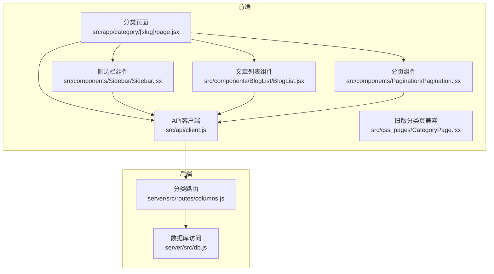
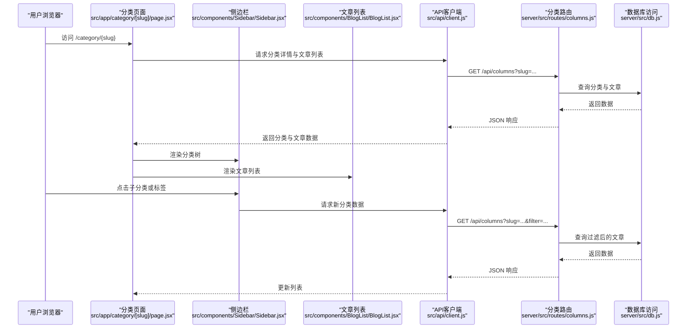
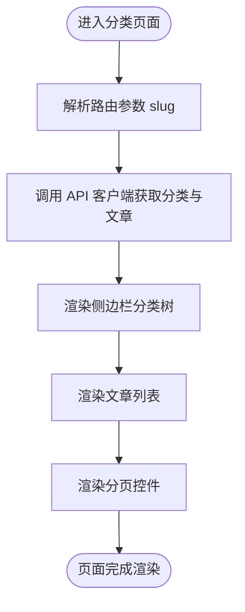
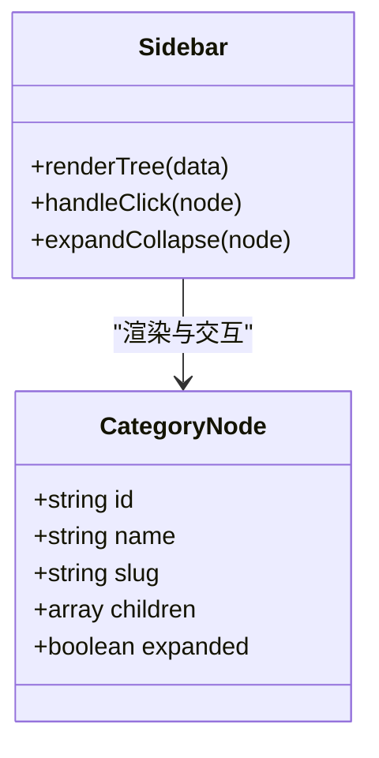
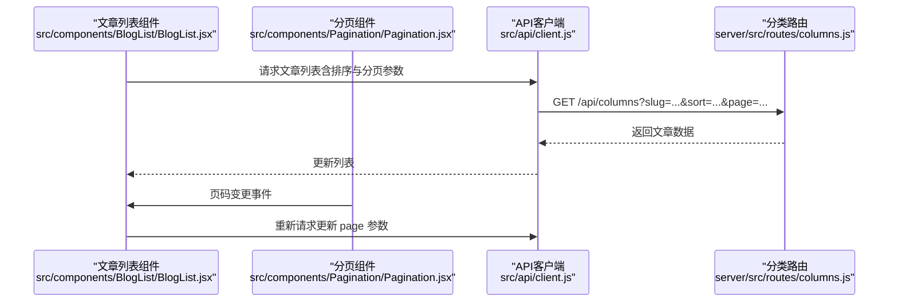
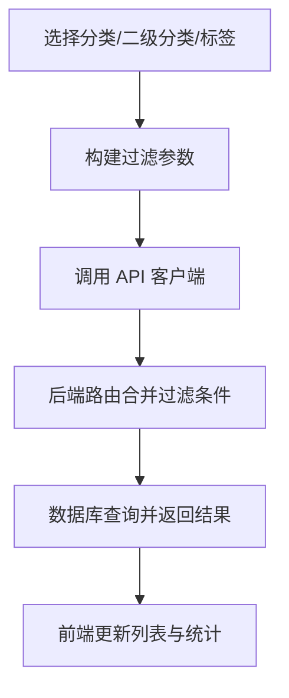
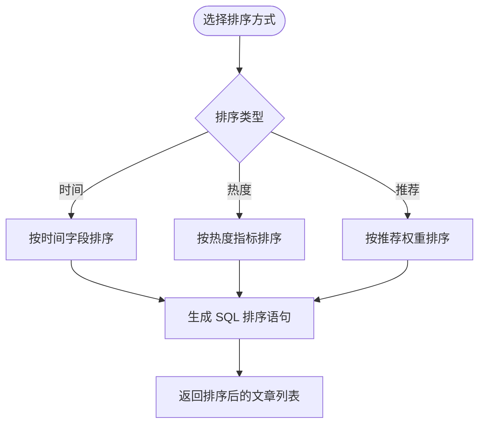
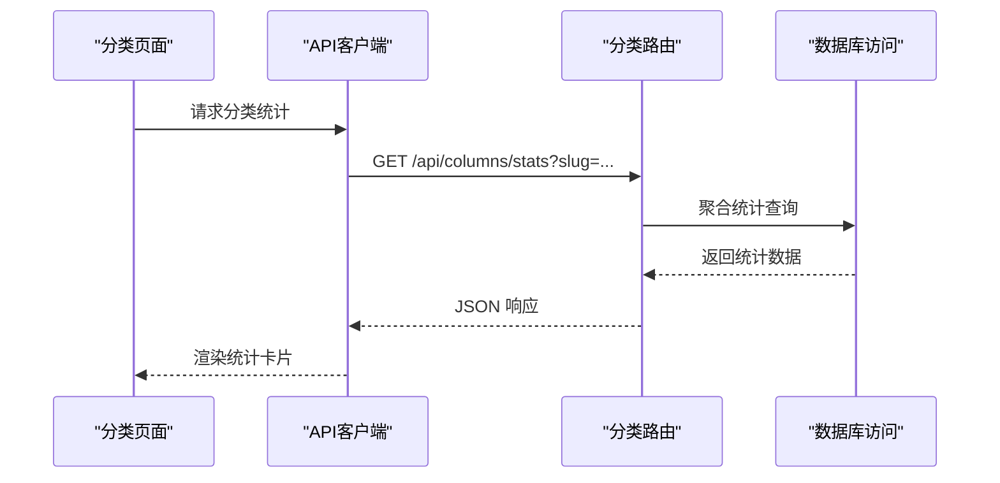
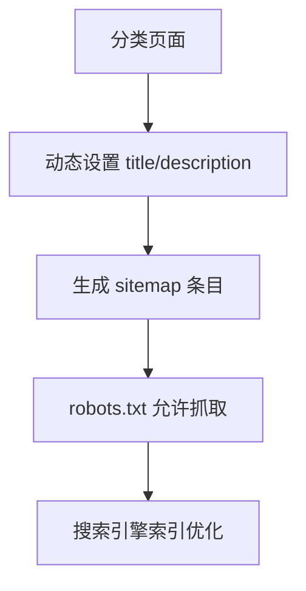
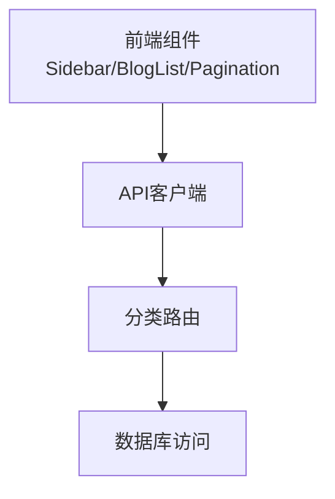

# 分类浏览

<cite>
**本文引用的文件**
- [src/app/category/[slug]/page.jsx](file://src/app/category/[slug]/page.jsx)
- [src/components/Sidebar/Sidebar.jsx](file://src/components/Sidebar/Sidebar.jsx)
- [server/src/routes/columns.js](file://server/src/routes/columns.js)
- [server/src/db.js](file://server/src/db.js)
- [src/api/client.js](file://src/api/client.js)
- [src/css_pages/CategoryPage.jsx](file://src/css_pages/CategoryPage.jsx)
- [src/css_pages/CategoryPage.module.css](file://src/css_pages/CategoryPage.module.css)
- [src/components/BlogList/BlogList.jsx](file://src/components/BlogList/BlogList.jsx)
- [src/components/Pagination/Pagination.jsx](file://src/components/Pagination/Pagination.jsx)
- [src/app/sitemap.js](file://src/app/sitemap.js)
- [src/app/robots.js](file://src/app/robots.js)
</cite>

## 目录
1. [简介](#简介)
2. [项目结构](#项目结构)
3. [核心组件](#核心组件)
4. [架构总览](#架构总览)
5. [详细组件分析](#详细组件分析)
6. [依赖关系分析](#依赖关系分析)
7. [性能考虑](#性能考虑)
8. [故障排查指南](#故障排查指南)
9. [结论](#结论)
10. [附录](#附录)

## 简介
本章节聚焦“分类浏览”功能，围绕以下目标展开：
- 分类体系设计：一级分类、二级分类与标签的多层次组织。
- 路由设计与动态加载：基于 Next.js 的动态路由与数据获取流程。
- 侧边栏导航：分类树渲染与交互逻辑。
- 筛选与过滤：多条件组合查询的实现方式。
- 排序规则：时间、热度、推荐等排序策略。
- 统计信息：文章数量、活跃用户数等展示。
- SEO 优化：URL 结构化与元数据管理。
- 后台管理：分类管理的界面与能力。

## 项目结构
分类浏览涉及前端页面、侧边栏、列表与分页组件，以及后端分类接口与数据库访问层。整体采用前后端分离的架构，Next.js 负责页面路由与数据请求，Node.js 提供 REST API 并访问 SQLite 数据库。

图表来源
- [src/app/category/[slug]/page.jsx](file://src/app/category/[slug]/page.jsx)
- [src/components/Sidebar/Sidebar.jsx](file://src/components/Sidebar/Sidebar.jsx)
- [src/components/BlogList/BlogList.jsx](file://src/components/BlogList/BlogList.jsx)
- [src/components/Pagination/Pagination.jsx](file://src/components/Pagination/Pagination.jsx)
- [src/api/client.js](file://src/api/client.js)
- [server/src/routes/columns.js](file://server/src/routes/columns.js)
- [server/src/db.js](file://server/src/db.js)

章节来源
- [src/app/category/[slug]/page.jsx](file://src/app/category/[slug]/page.jsx)
- [src/components/Sidebar/Sidebar.jsx](file://src/components/Sidebar/Sidebar.jsx)
- [src/components/BlogList/BlogList.jsx](file://src/components/BlogList/BlogList.jsx)
- [src/components/Pagination/Pagination.jsx](file://src/components/Pagination/Pagination.jsx)
- [src/api/client.js](file://src/api/client.js)
- [server/src/routes/columns.js](file://server/src/routes/columns.js)
- [server/src/db.js](file://server/src/db.js)

## 核心组件
- 分类页面（动态路由）：根据 URL 中的 slug 解析分类标识，发起数据请求，渲染分类标题、描述、侧边栏与文章列表。
- 侧边栏组件：渲染分类树形结构，支持展开/折叠与点击切换当前分类。
- 文章列表组件：接收分类上下文参数，按排序规则展示文章卡片。
- 分页组件：处理页码切换与状态同步。
- API 客户端：封装对后端的分类相关接口调用。
- 旧版分类页（兼容）：保留历史样式与行为，便于迁移过渡。

章节来源
- [src/app/category/[slug]/page.jsx](file://src/app/category/[slug]/page.jsx)
- [src/components/Sidebar/Sidebar.jsx](file://src/components/Sidebar/Sidebar.jsx)
- [src/components/BlogList/BlogList.jsx](file://src/components/BlogList/BlogList.jsx)
- [src/components/Pagination/Pagination.jsx](file://src/components/Pagination/Pagination.jsx)
- [src/api/client.js](file://src/api/client.js)
- [src/css_pages/CategoryPage.jsx](file://src/css_pages/CategoryPage.jsx)
- [src/css_pages/CategoryPage.module.css](file://src/css_pages/CategoryPage.module.css)

## 架构总览
分类浏览的整体数据流如下：
- 用户在浏览器中访问 /category/{slug}。
- Next.js 页面组件解析路由参数，调用 API 客户端。
- API 客户端向后端分类路由发起请求。
- 后端路由查询数据库，返回分类信息与文章列表。
- 前端渲染分类详情、侧边栏与文章列表，并支持分页与排序。

图表来源
- [src/app/category/[slug]/page.jsx](file://src/app/category/[slug]/page.jsx)
- [src/components/Sidebar/Sidebar.jsx](file://src/components/Sidebar/Sidebar.jsx)
- [src/components/BlogList/BlogList.jsx](file://src/components/BlogList/BlogList.jsx)
- [src/api/client.js](file://src/api/client.js)
- [server/src/routes/columns.js](file://server/src/routes/columns.js)
- [server/src/db.js](file://server/src/db.js)

## 详细组件分析

### 分类页面（动态路由）
- 路由设计：使用 Next.js 动态路由 /category/[slug]，slug 对应分类的唯一标识。
- 数据加载：在页面组件中读取路由参数，调用 API 客户端获取分类详情与文章列表。
- 内容渲染：渲染分类标题、描述、侧边栏与文章列表；支持分页与排序控制。
- SEO 元数据：结合 sitemap 与 robots 配置，提升搜索引擎收录效果。

图表来源
- [src/app/category/[slug]/page.jsx](file://src/app/category/[slug]/page.jsx)
- [src/components/Sidebar/Sidebar.jsx](file://src/components/Sidebar/Sidebar.jsx)
- [src/components/BlogList/BlogList.jsx](file://src/components/BlogList/BlogList.jsx)
- [src/components/Pagination/Pagination.jsx](file://src/components/Pagination/Pagination.jsx)
- [src/app/sitemap.js](file://src/app/sitemap.js)
- [src/app/robots.js](file://src/app/robots.js)

章节来源
- [src/app/category/[slug]/page.jsx](file://src/app/category/[slug]/page.jsx)
- [src/app/sitemap.js](file://src/app/sitemap.js)
- [src/app/robots.js](file://src/app/robots.js)

### 侧边栏导航（分类树）
- 数据结构：分类树包含一级分类、二级分类与标签节点，支持层级展开/折叠。
- 交互逻辑：点击节点时更新当前分类上下文，触发文章列表刷新。
- 状态管理：通过页面级状态或上下文保存当前选中分类与过滤条件。

图表来源
- [src/components/Sidebar/Sidebar.jsx](file://src/components/Sidebar/Sidebar.jsx)

章节来源
- [src/components/Sidebar/Sidebar.jsx](file://src/components/Sidebar/Sidebar.jsx)

### 文章列表与分页
- 列表渲染：根据分类上下文与排序规则渲染文章卡片。
- 分页交互：页码变化时重新请求数据，保持 URL 与状态一致。
- 排序规则：支持时间排序、热度排序、推荐排序，具体实现由后端接口与前端参数共同决定。

图表来源
- [src/components/BlogList/BlogList.jsx](file://src/components/BlogList/BlogList.jsx)
- [src/components/Pagination/Pagination.jsx](file://src/components/Pagination/Pagination.jsx)
- [src/api/client.js](file://src/api/client.js)
- [server/src/routes/columns.js](file://server/src/routes/columns.js)

章节来源
- [src/components/BlogList/BlogList.jsx](file://src/components/BlogList/BlogList.jsx)
- [src/components/Pagination/Pagination.jsx](file://src/components/Pagination/Pagination.jsx)

### 筛选与过滤（多条件组合）
- 过滤维度：支持按分类、二级分类、标签进行筛选。
- 组合查询：将多个过滤条件拼接为查询参数，统一由后端处理。
- 状态同步：URL 参数与页面状态双向绑定，确保分享链接可复现筛选结果。

图表来源
- [src/components/Sidebar/Sidebar.jsx](file://src/components/Sidebar/Sidebar.jsx)
- [src/api/client.js](file://src/api/client.js)
- [server/src/routes/columns.js](file://server/src/routes/columns.js)

章节来源
- [src/components/Sidebar/Sidebar.jsx](file://src/components/Sidebar/Sidebar.jsx)
- [src/api/client.js](file://src/api/client.js)
- [server/src/routes/columns.js](file://server/src/routes/columns.js)

### 排序规则
- 时间排序：按发布时间降序或升序排列。
- 热度排序：按浏览量、点赞数或评论数综合计算热度值排序。
- 推荐排序：依据编辑标记或算法评分置顶。
- 实现要点：前端传递 sort 参数，后端根据参数执行不同排序逻辑。

图表来源
- [server/src/routes/columns.js](file://server/src/routes/columns.js)
- [server/src/db.js](file://server/src/db.js)

章节来源
- [server/src/routes/columns.js](file://server/src/routes/columns.js)
- [server/src/db.js](file://server/src/db.js)

### 分类统计信息
- 统计维度：文章总数、活跃用户数、最近更新时间等。
- 数据来源：后端聚合查询，前端展示统计卡片。
- 更新策略：按需刷新或在分类切换时自动更新。

图表来源
- [src/app/category/[slug]/page.jsx](file://src/app/category/[slug]/page.jsx)
- [src/api/client.js](file://src/api/client.js)
- [server/src/routes/columns.js](file://server/src/routes/columns.js)
- [server/src/db.js](file://server/src/db.js)

章节来源
- [src/app/category/[slug]/page.jsx](file://src/app/category/[slug]/page.jsx)
- [server/src/routes/columns.js](file://server/src/routes/columns.js)
- [server/src/db.js](file://server/src/db.js)

### SEO 优化策略
- URL 结构化：使用 /category/{slug} 作为分类页面路径，slug 语义化且唯一。
- 元数据管理：页面标题、描述与关键词随分类信息动态设置。
- 站点地图与爬虫：通过 sitemap 与 robots 配置提升收录效率。

图表来源
- [src/app/category/[slug]/page.jsx](file://src/app/category/[slug]/page.jsx)
- [src/app/sitemap.js](file://src/app/sitemap.js)
- [src/app/robots.js](file://src/app/robots.js)

章节来源
- [src/app/category/[slug]/page.jsx](file://src/app/category/[slug]/page.jsx)
- [src/app/sitemap.js](file://src/app/sitemap.js)
- [src/app/robots.js](file://src/app/robots.js)

### 后台管理（分类管理界面）
- 功能范围：创建、编辑、删除分类；维护一级/二级分类与标签关系；设置排序与可见性。
- 界面设计：表单输入、树形结构可视化、批量操作与权限控制。
- 数据同步：后台修改后实时同步至前端分类树与列表。

说明：后台管理的具体实现未在当前代码库中直接体现，建议参考现有分类路由与数据库模型进行扩展。

[本节为概念性说明，不直接分析具体文件，故无章节来源]

## 依赖关系分析
- 前端依赖：分类页面依赖侧边栏、文章列表与分页组件；所有组件通过 API 客户端与后端通信。
- 后端依赖：分类路由依赖数据库访问层，执行分类与文章的增删改查与聚合统计。
- 外部依赖：SQLite 作为数据存储；Next.js 提供路由与静态资源服务。

图表来源
- [src/components/Sidebar/Sidebar.jsx](file://src/components/Sidebar/Sidebar.jsx)
- [src/components/BlogList/BlogList.jsx](file://src/components/BlogList/BlogList.jsx)
- [src/components/Pagination/Pagination.jsx](file://src/components/Pagination/Pagination.jsx)
- [src/api/client.js](file://src/api/client.js)
- [server/src/routes/columns.js](file://server/src/routes/columns.js)
- [server/src/db.js](file://server/src/db.js)

章节来源
- [src/components/Sidebar/Sidebar.jsx](file://src/components/Sidebar/Sidebar.jsx)
- [src/components/BlogList/BlogList.jsx](file://src/components/BlogList/BlogList.jsx)
- [src/components/Pagination/Pagination.jsx](file://src/components/Pagination/Pagination.jsx)
- [src/api/client.js](file://src/api/client.js)
- [server/src/routes/columns.js](file://server/src/routes/columns.js)
- [server/src/db.js](file://server/src/db.js)

## 性能考虑
- 分页与懒加载：避免一次性加载大量文章，提升首屏性能。
- 缓存策略：对分类树与热门分类数据进行短期缓存，减少重复请求。
- 查询优化：在后端使用合适的索引与聚合查询，降低数据库压力。
- 前端渲染优化：列表项虚拟化与增量更新，提高交互流畅度。

[本节提供通用指导，不直接分析具体文件，故无章节来源]

## 故障排查指南
- 路由参数错误：检查 slug 是否有效，确认分类是否存在。
- 接口返回异常：查看分类路由日志与数据库连接状态。
- 筛选条件无效：核对前端传递的过滤参数与后端解析逻辑。
- 排序结果不符：验证 sort 参数与后端排序实现的一致性。
- 分页错乱：确认页码边界处理与后端分页参数是否正确。

章节来源
- [server/src/routes/columns.js](file://server/src/routes/columns.js)
- [server/src/db.js](file://server/src/db.js)
- [src/api/client.js](file://src/api/client.js)

## 结论
分类浏览功能通过清晰的层次结构与前后端协作，实现了高效的内容组织与检索。动态路由与侧边栏树形导航提升了用户体验，筛选与排序机制增强了灵活性，SEO 优化策略有助于提升搜索可见性。建议在后台管理中完善分类维护能力，并在性能方面持续优化缓存与查询。

[本节为总结性内容，不直接分析具体文件，故无章节来源]

## 附录
- 兼容性说明：旧版分类页（css_pages）可用于样式与行为对比，便于迁移与回滚。
- 样式模块：分类页面样式位于 CategoryPage.module.css，便于主题定制。

章节来源
- [src/css_pages/CategoryPage.jsx](file://src/css_pages/CategoryPage.jsx)
- [src/css_pages/CategoryPage.module.css](file://src/css_pages/CategoryPage.module.css)