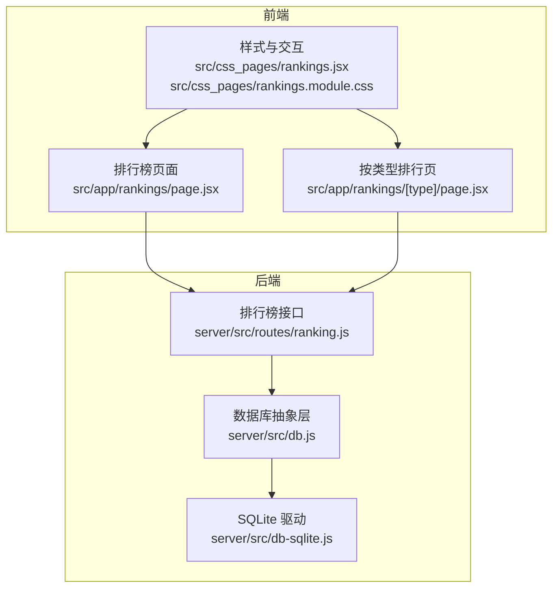
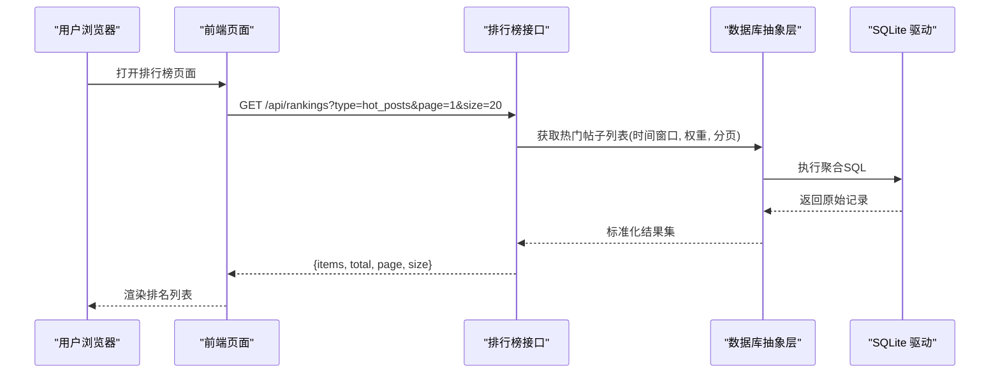
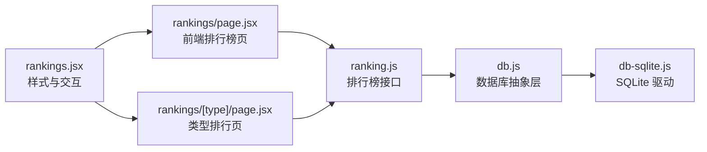

# 排行榜系统

<cite>
**本文引用的文件**   
- [server/src/routes/ranking.js](file://server/src/routes/ranking.js)
- [server/src/db.js](file://server/src/db.js)
- [server/src/db-sqlite.js](file://server/src/db-sqlite.js)
- [src/app/rankings/page.jsx](file://src/app/rankings/page.jsx)
- [src/app/rankings/[type]/page.jsx](file://src/app/rankings/[type]/page.jsx)
- [src/css_pages/rankings.jsx](file://src/css_pages/rankings.jsx)
- [src/css_pages/rankings.module.css](file://src/css_pages/rankings.module.css)
- [API.md](file://API.md)
</cite>

## 目录
1. [简介](#简介)
2. [项目结构](#项目结构)
3. [核心组件](#核心组件)
4. [架构总览](#架构总览)
5. [详细组件分析](#详细组件分析)
6. [依赖关系分析](#依赖关系分析)
7. [性能考量](#性能考量)
8. [故障排查指南](#故障排查指南)
9. [结论](#结论)
10. [附录](#附录)

## 简介
本文件围绕“排行榜系统”的设计与实现进行系统化文档化，覆盖算法模型、数据流、缓存与持久化、实时增量更新策略、前端展示与动画、作弊防护以及配置扩展性。目标是帮助开发者快速理解并扩展该模块，同时为产品与运营提供可落地的优化建议。

## 项目结构
本项目采用前后端分离：
- 后端（Node/Express）提供排行榜相关 API，基于 SQLite 存储基础指标，并在内存中维护热点排行快照。
- 前端（Next.js App Router）提供排行榜页面与类型切换能力，支持按文章、用户、问答等维度查看。

图表来源
- [src/app/rankings/page.jsx](file://src/app/rankings/page.jsx)
- [src/app/rankings/[type]/page.jsx](file://src/app/rankings/[type]/page.jsx)
- [src/css_pages/rankings.jsx](file://src/css_pages/rankings.jsx)
- [src/css_pages/rankings.module.css](file://src/css_pages/rankings.module.css)
- [server/src/routes/ranking.js](file://server/src/routes/ranking.js)
- [server/src/db.js](file://server/src/db.js)
- [server/src/db-sqlite.js](file://server/src/db-sqlite.js)

章节来源
- [server/src/routes/ranking.js](file://server/src/routes/ranking.js)
- [server/src/db.js](file://server/src/db.js)
- [server/src/db-sqlite.js](file://server/src/db-sqlite.js)
- [src/app/rankings/page.jsx](file://src/app/rankings/page.jsx)
- [src/app/rankings/[type]/page.jsx](file://src/app/rankings/[type]/page.jsx)
- [src/css_pages/rankings.jsx](file://src/css_pages/rankings.jsx)
- [src/css_pages/rankings.module.css](file://src/css_pages/rankings.module.css)

## 核心组件
- 排行榜接口服务：对外暴露统一查询入口，根据类型路由到不同计算逻辑，返回分页结果与元信息。
- 数据库抽象层：屏蔽底层存储差异，提供统一的读写与聚合接口。
- SQLite 驱动：负责具体 SQL 执行与连接管理。
- 前端排行榜页面：渲染不同类型排行榜，支持排序、筛选与趋势展示。

章节来源
- [server/src/routes/ranking.js](file://server/src/routes/ranking.js)
- [server/src/db.js](file://server/src/db.js)
- [server/src/db-sqlite.js](file://server/src/db-sqlite.js)
- [src/app/rankings/page.jsx](file://src/app/rankings/page.jsx)
- [src/app/rankings/[type]/page.jsx](file://src/app/rankings/[type]/page.jsx)

## 架构总览
整体流程：前端请求 → 路由层解析类型 → 调用数据库抽象层 → 执行聚合/排序 → 返回 JSON。

图表来源
- [server/src/routes/ranking.js](file://server/src/routes/ranking.js)
- [server/src/db.js](file://server/src/db.js)
- [server/src/db-sqlite.js](file://server/src/db-sqlite.js)
- [src/app/rankings/page.jsx](file://src/app/rankings/page.jsx)

## 详细组件分析

### 热度计算模型与时间衰减函数
- 设计目标：在“近期活跃”和“长期价值”之间取得平衡，避免新内容被淹没，也防止旧内容长期霸榜。
- 推荐公式（概念级）：
  - 热度 = Σ(行为得分 × 行为权重 × 时间衰减)
  - 常见行为：阅读、点赞、收藏、评论、分享、关注作者等
  - 时间衰减：对行为发生时间 t 应用指数或线性衰减，越近的行为权重越高
- 参数可调：
  - 行为权重：通过配置项调整各行为的贡献度
  - 衰减系数：控制“新鲜度”的敏感度
  - 时间窗口：限定统计范围（如最近 7/30/90 天）
- 复杂度：
  - 单次查询 O(N log N)（N 为候选对象数），可通过预聚合与索引优化至近似 O(1) 读取

章节来源
- [server/src/routes/ranking.js](file://server/src/routes/ranking.js)
- [server/src/db.js](file://server/src/db.js)

### 排行榜类型与实现逻辑
- 热门文章：基于文章维度的点击、互动、收藏等行为加权求和，结合时间衰减排序。
- 热门用户：聚合用户产出内容的热度、粉丝增长、回答质量等指标。
- 热门问答：以问答为单位，综合采纳、赞同、浏览时长等信号。
- 通用处理：
  - 输入校验与类型路由
  - 分页与过滤（时间范围、标签、作者等）
  - 结果标准化与字段映射

章节来源
- [server/src/routes/ranking.js](file://server/src/routes/ranking.js)
- [server/src/db.js](file://server/src/db.js)

### 实时更新机制（增量与批量）
- 增量更新：
  - 事件驱动：当产生关键行为（点赞、评论、收藏等）时，异步更新对应对象的“热度分”与“时间戳”。
  - 幂等与去重：同一用户短时间内重复行为需去重或降权。
- 批量刷新：
  - 定时任务：周期性全量重算或滚动窗口重算，修正增量误差与补偿离线数据。
  - 批大小与频率：根据 QPS 与延迟目标动态调整。
- 一致性保障：
  - 写入路径使用事务或原子操作，确保“行为计数”与“热度分”一致。
  - 读多写少场景下，允许短暂最终一致。

章节来源
- [server/src/routes/ranking.js](file://server/src/routes/ranking.js)
- [server/src/db.js](file://server/src/db.js)

### 缓存策略
- 多级缓存：
  - 进程内缓存：热点排行快照，TTL 短（秒级），降低数据库压力。
  - 外部缓存（可选）：Redis 等，跨实例共享，适合高并发。
- 失效策略：
  - 基于时间 TTL + 事件触发失效（如重要行为发生后）。
  - 分区缓存：按排行榜类型与时间窗口分片。
- 回源保护：
  - 缓存击穿：加互斥锁或空值缓存。
  - 缓存雪崩：随机化 TTL 抖动。

章节来源
- [server/src/routes/ranking.js](file://server/src/routes/ranking.js)

### 持久化存储方案
- 存储选型：SQLite（轻量、单文件、易部署），适用于中小规模与演示环境。
- 表结构设计要点：
  - 实体表：文章、用户、问答等主数据
  - 行为表：记录用户行为（类型、主体ID、时间戳、额外属性）
  - 指标表：预聚合指标（浏览量、点赞数、收藏数、评论数等）
  - 排行快照表：定期生成的排行榜快照（类型、时间窗口、排名、分数）
- 一致性：
  - 写入路径保证原子性；读路径优先读快照，必要时回源计算。
- 迁移与备份：
  - 版本化迁移脚本；定期导出备份。

章节来源
- [server/src/db.js](file://server/src/db.js)
- [server/src/db-sqlite.js](file://server/src/db-sqlite.js)

### 前端展示与动画
- 页面组织：
  - 排行榜首页：选择类型、时间窗口、分页控件
  - 类型详情页：固定类型的排行榜视图
- 交互与动画：
  - 排名变化动画：使用过渡效果突出上升/下降
  - 趋势图表：折线/柱状图展示热度走势
- 状态管理：
  - 本地缓存上次查询结果，提升二次访问体验
  - 错误边界与重试机制

章节来源
- [src/app/rankings/page.jsx](file://src/app/rankings/page.jsx)
- [src/app/rankings/[type]/page.jsx](file://src/app/rankings/[type]/page.jsx)
- [src/css_pages/rankings.jsx](file://src/css_pages/rankings.jsx)
- [src/css_pages/rankings.module.css](file://src/css_pages/rankings.module.css)

### 作弊防护机制
- 行为去重与限频：
  - 同用户对同一主体的短时间重复行为降权或忽略
  - IP/设备指纹限频，限制异常高频行为
- 反刷榜规则：
  - 异常比率检测（如点赞/阅读比过高）
  - 新用户冷启动保护（权重较低）
- 审计与封禁：
  - 记录可疑行为日志，支持管理员干预
  - 黑名单与灰名单机制

章节来源
- [server/src/routes/ranking.js](file://server/src/routes/ranking.js)

### 配置与扩展性
- 配置项建议：
  - 行为权重表（可热更新）
  - 时间窗口与衰减系数
  - 缓存 TTL 与刷新周期
  - 防刷阈值与限频策略
- 扩展点：
  - 新增排行榜类型：注册新的计算管线与前端路由
  - 新增行为类型：接入事件总线并更新权重
  - 存储替换：通过抽象层适配其他数据库

章节来源
- [server/src/routes/ranking.js](file://server/src/routes/ranking.js)
- [server/src/db.js](file://server/src/db.js)

## 依赖关系分析

图表来源
- [server/src/routes/ranking.js](file://server/src/routes/ranking.js)
- [server/src/db.js](file://server/src/db.js)
- [server/src/db-sqlite.js](file://server/src/db-sqlite.js)
- [src/app/rankings/page.jsx](file://src/app/rankings/page.jsx)
- [src/app/rankings/[type]/page.jsx](file://src/app/rankings/[type]/page.jsx)
- [src/css_pages/rankings.jsx](file://src/css_pages/rankings.jsx)

章节来源
- [server/src/routes/ranking.js](file://server/src/routes/ranking.js)
- [server/src/db.js](file://server/src/db.js)
- [server/src/db-sqlite.js](file://server/src/db-sqlite.js)
- [src/app/rankings/page.jsx](file://src/app/rankings/page.jsx)
- [src/app/rankings/[type]/page.jsx](file://src/app/rankings/[type]/page.jsx)
- [src/css_pages/rankings.jsx](file://src/css_pages/rankings.jsx)

## 性能考量
- 查询优化：
  - 合理索引：按时间窗口、主体类型、行为类型建立复合索引
  - 预聚合：将常用指标物化，减少在线计算
- 缓存命中：
  - 热点键预热与分层缓存，降低数据库压力
- 批处理：
  - 批量写入与合并，减少事务开销
- 监控与告警：
  - 关键指标：QPS、P99 延迟、缓存命中率、失败率

[本节为通用指导，不直接分析具体文件]

## 故障排查指南
- 常见问题定位：
  - 接口超时：检查数据库慢查询与索引缺失
  - 数据不一致：核对增量更新与批量刷新是否冲突
  - 缓存未命中：确认 TTL 与失效策略
- 诊断手段：
  - 开启慢查询日志与接口耗时埋点
  - 对比快照与源数据差异，定位偏差来源
  - 复现低流量时段问题，排除缓存干扰

章节来源
- [server/src/routes/ranking.js](file://server/src/routes/ranking.js)
- [server/src/db.js](file://server/src/db.js)

## 结论
本排行榜系统以“灵活的热度模型 + 增量与批量结合的更新策略 + 多层缓存 + 可扩展配置”为核心，兼顾实时性与一致性。通过合理的索引与预聚合，可在中等规模数据下保持良好性能。后续可引入外部缓存与更完善的反作弊体系，进一步提升稳定性与公平性。

[本节为总结性内容，不直接分析具体文件]

## 附录

### API 参考
- 接口定义与示例请参考 API 文档。

章节来源
- [API.md](file://API.md)