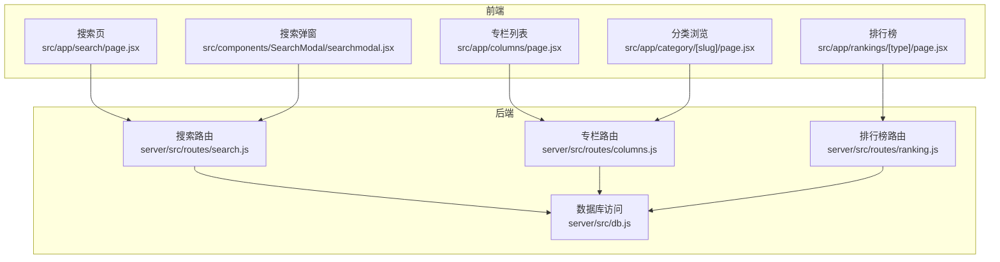
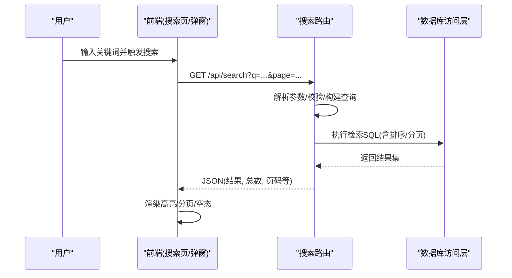
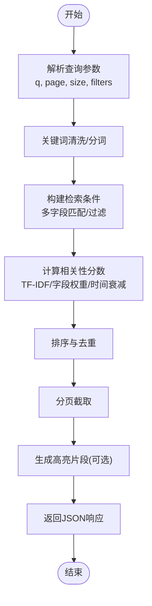
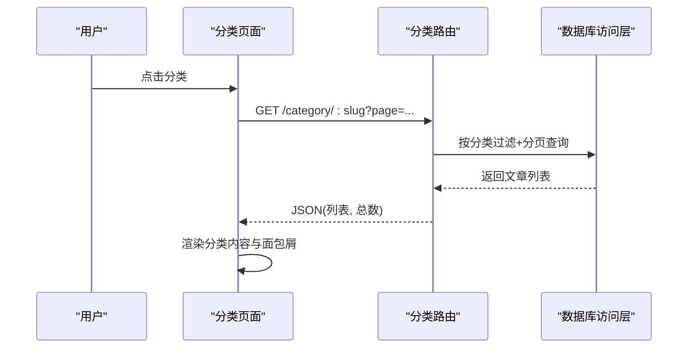
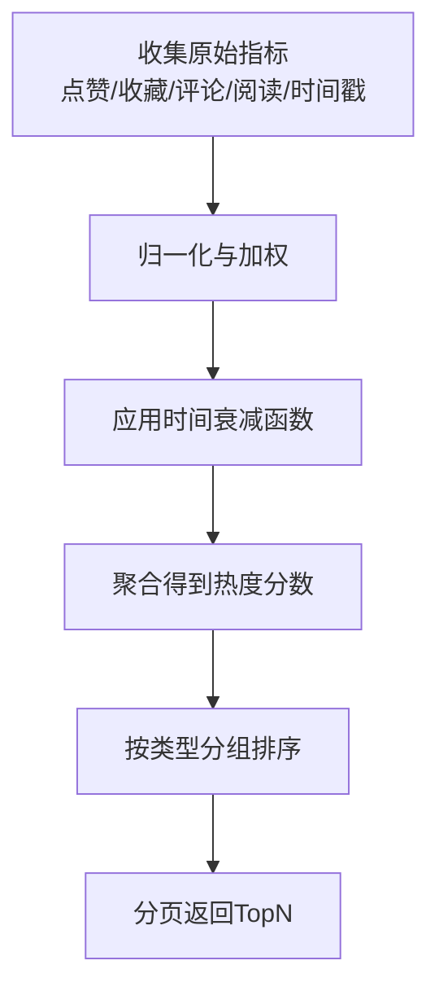
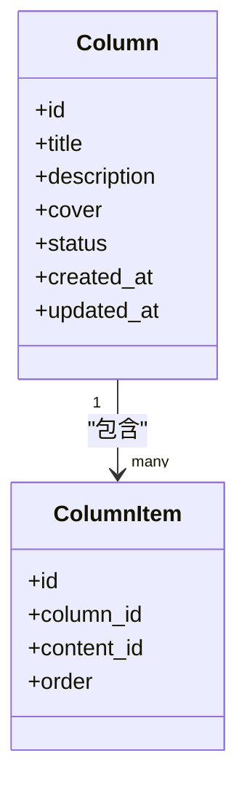
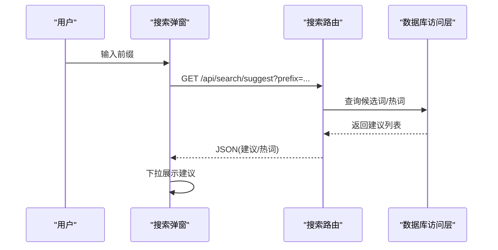
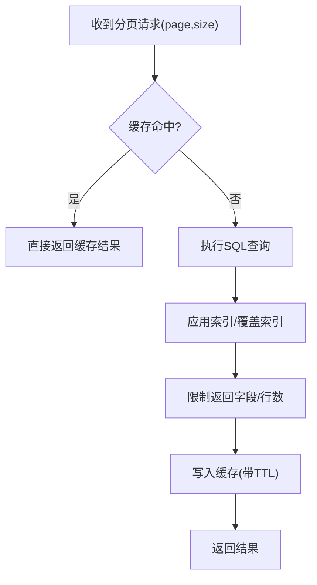
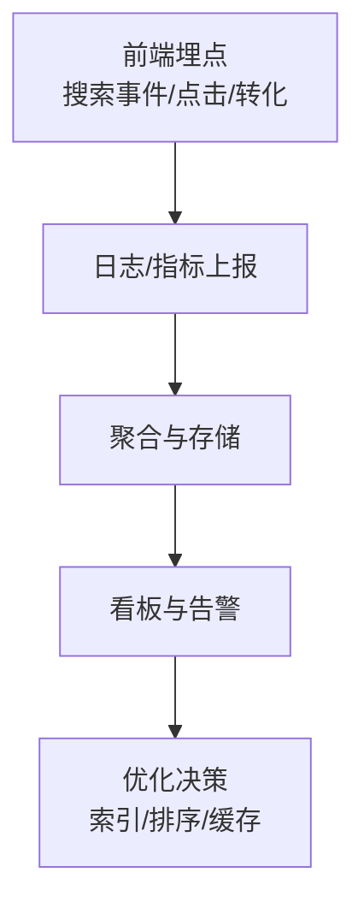
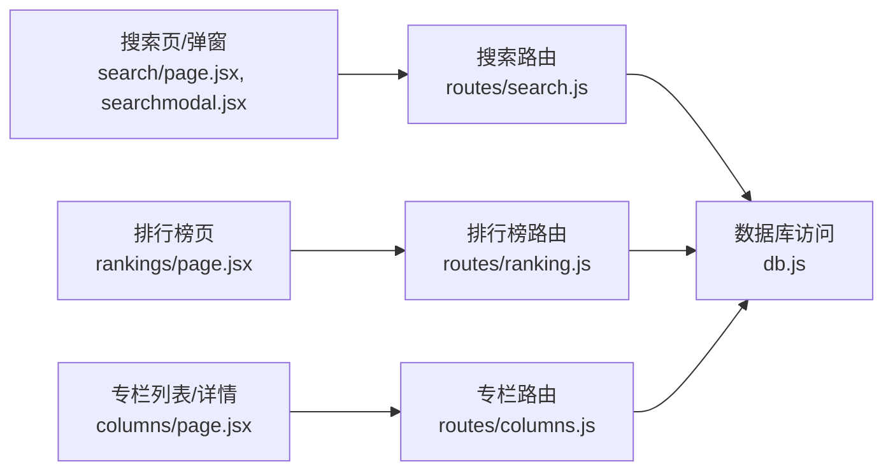

# 搜索与发现

<cite>
**本文引用的文件**   
- [server/src/routes/search.js](file://server/src/routes/search.js)
- [server/src/routes/ranking.js](file://server/src/routes/ranking.js)
- [server/src/routes/columns.js](file://server/src/routes/columns.js)
- [server/src/db.js](file://server/src/db.js)
- [src/app/search/page.jsx](file://src/app/search/page.jsx)
- [src/components/SearchModal/searchmodal.jsx](file://src/components/SearchModal/searchmodal.jsx)
- [src/css_pages/search.jsx](file://src/css_pages/search.jsx)
- [src/app/columns/page.jsx](file://src/app/columns/page.jsx)
- [src/app/category/[slug]/page.jsx](file://src/app/category/[slug]/page.jsx)
- [src/app/rankings/page.jsx](file://src/app/rankings/[type]/page.jsx)
</cite>

## 目录
1. [简介](#简介)
2. [项目结构](#项目结构)
3. [核心组件](#核心组件)
4. [架构总览](#架构总览)
5. [详细组件分析](#详细组件分析)
6. [依赖关系分析](#依赖关系分析)
7. [性能考虑](#性能考虑)
8. [故障排查指南](#故障排查指南)
9. [结论](#结论)
10. [附录](#附录)

## 简介
本文件聚焦“搜索与发现”能力，覆盖全文检索、分类浏览、排行榜算法、专栏系统、搜索建议/热门搜索/搜索历史、分页加载与性能优化，以及搜索分析的统计指标与监控方案。文档基于仓库中后端路由与前端页面实现进行梳理，并提供可视化图示帮助理解数据流与调用链。

## 项目结构
围绕搜索与发现的关键路径包括：
- 后端接口：搜索、排行榜、专栏、数据库访问
- 前端页面：搜索页、搜索弹窗、分类浏览、排行榜、专栏列表与详情

图表来源
- [server/src/routes/search.js](file://server/src/routes/search.js)
- [server/src/routes/ranking.js](file://server/src/routes/ranking.js)
- [server/src/routes/columns.js](file://server/src/routes/columns.js)
- [server/src/db.js](file://server/src/db.js)
- [src/app/search/page.jsx](file://src/app/search/page.jsx)
- [src/components/SearchModal/searchmodal.jsx](file://src/components/SearchModal/searchmodal.jsx)
- [src/app/columns/page.jsx](file://src/app/columns/page.jsx)
- [src/app/category/[slug]/page.jsx](file://src/app/category/[slug]/page.jsx)
- [src/app/rankings/page.jsx](file://src/app/rankings/page.jsx)

章节来源
- [server/src/routes/search.js](file://server/src/routes/search.js)
- [server/src/routes/ranking.js](file://server/src/routes/ranking.js)
- [server/src/routes/columns.js](file://server/src/routes/columns.js)
- [server/src/db.js](file://server/src/db.js)
- [src/app/search/page.jsx](file://src/app/search/page.jsx)
- [src/components/SearchModal/searchmodal.jsx](file://src/components/SearchModal/searchmodal.jsx)
- [src/app/columns/page.jsx](file://src/app/columns/page.jsx)
- [src/app/category/[slug]/page.jsx](file://src/app/category/[slug]/page.jsx)
- [src/app/rankings/page.jsx](file://src/app/rankings/page.jsx)

## 核心组件
- 搜索服务（后端）
  - 负责接收查询参数、解析关键词、执行检索、排序与分页返回结果。
- 排行榜服务（后端）
  - 提供按类型聚合的排行数据，支持热度计算与时间衰减策略。
- 专栏服务（后端）
  - 提供专栏列表、详情及内容组织相关接口。
- 数据库访问层
  - 封装 SQL 操作，为上层路由提供统一的数据读写能力。
- 前端搜索入口
  - 搜索页与搜索弹窗，负责发起请求、渲染高亮与分页。
- 分类浏览与导航
  - 通过分类路由展示对应内容集合。
- 排行榜前端
  - 根据类型切换不同榜单视图。

章节来源
- [server/src/routes/search.js](file://server/src/routes/search.js)
- [server/src/routes/ranking.js](file://server/src/routes/ranking.js)
- [server/src/routes/columns.js](file://server/src/routes/columns.js)
- [server/src/db.js](file://server/src/db.js)
- [src/app/search/page.jsx](file://src/app/search/page.jsx)
- [src/components/SearchModal/searchmodal.jsx](file://src/components/SearchModal/searchmodal.jsx)
- [src/app/category/[slug]/page.jsx](file://src/app/category/[slug]/page.jsx)
- [src/app/rankings/page.jsx](file://src/app/rankings/page.jsx)

## 架构总览
搜索与发现的整体交互流程如下：

图表来源
- [server/src/routes/search.js](file://server/src/routes/search.js)
- [server/src/db.js](file://server/src/db.js)
- [src/app/search/page.jsx](file://src/app/search/page.jsx)
- [src/components/SearchModal/searchmodal.jsx](file://src/components/SearchModal/searchmodal.jsx)

## 详细组件分析

### 全文搜索实现
- 索引构建
  - 当前实现以数据库层检索为主，未引入独立搜索引擎；可通过在数据库层增加全文索引或引入外部搜索引擎提升大规模检索性能。
- 查询解析
  - 对关键词进行基础清洗与分词处理，支持多字段匹配（如标题、正文、标签等）。
- 结果排序
  - 默认按相关性评分排序，可结合时间衰减与用户行为加权。
- 高亮显示
  - 在后端返回命中片段或在客户端进行正则替换高亮。
- 相关性评分
  - 常见维度：词频、字段权重、位置邻近度、时间衰减、互动信号（点赞/收藏/阅读时长）。

图表来源
- [server/src/routes/search.js](file://server/src/routes/search.js)
- [server/src/db.js](file://server/src/db.js)

章节来源
- [server/src/routes/search.js](file://server/src/routes/search.js)
- [server/src/db.js](file://server/src/db.js)

### 分类浏览功能
- 实现逻辑
  - 通过分类路由获取筛选条件，调用后端接口返回该分类下的内容列表。
- 导航结构设计
  - URL 包含分类标识，便于 SEO 与分享；侧边栏/顶部导航维护分类层级。

图表来源
- [src/app/category/[slug]/page.jsx](file://src/app/category/[slug]/page.jsx)
- [server/src/db.js](file://server/src/db.js)

章节来源
- [src/app/category/[slug]/page.jsx](file://src/app/category/[slug]/page.jsx)

### 排行榜算法
- 热度计算
  - 综合近期互动（点赞、收藏、评论）、阅读量、发布时间等因素。
- 时间衰减
  - 使用指数或线性衰减函数降低旧内容的权重，突出时效性。
- 用户行为分析
  - 将用户行为作为信号参与评分，如停留时长、跳出率、复访等。

图表来源
- [server/src/routes/ranking.js](file://server/src/routes/ranking.js)
- [server/src/db.js](file://server/src/db.js)

章节来源
- [server/src/routes/ranking.js](file://server/src/routes/ranking.js)
- [server/src/db.js](file://server/src/db.js)

### 专栏系统架构与内容组织
- 架构设计
  - 专栏作为内容容器，包含多篇内容条目；提供列表与详情接口。
- 内容组织策略
  - 通过元数据（封面、摘要、排序、可见性）管理专栏质量与呈现。

图表来源
- [server/src/routes/columns.js](file://server/src/routes/columns.js)
- [server/src/db.js](file://server/src/db.js)

章节来源
- [server/src/routes/columns.js](file://server/src/routes/columns.js)
- [server/src/db.js](file://server/src/db.js)

### 搜索建议、热门搜索与搜索历史
- 搜索建议
  - 基于前缀匹配与热门词提示，减少输入成本。
- 热门搜索
  - 统计周期内高频搜索词，结合业务权重调整展示顺序。
- 搜索历史
  - 本地存储最近搜索记录，支持快速复用与清除。

图表来源
- [src/components/SearchModal/searchmodal.jsx](file://src/components/SearchModal/searchmodal.jsx)
- [server/src/routes/search.js](file://server/src/routes/search.js)
- [server/src/db.js](file://server/src/db.js)

章节来源
- [src/components/SearchModal/searchmodal.jsx](file://src/components/SearchModal/searchmodal.jsx)
- [server/src/routes/search.js](file://server/src/routes/search.js)
- [server/src/db.js](file://server/src/db.js)

### 搜索结果分页加载与性能优化
- 分页加载
  - 采用游标或偏移分页，避免深层分页带来的性能问题。
- 性能优化
  - 缓存热点查询结果、合并请求、懒加载图片、服务端压缩与连接池优化。

图表来源
- [server/src/routes/search.js](file://server/src/routes/search.js)
- [server/src/db.js](file://server/src/db.js)

章节来源
- [server/src/routes/search.js](file://server/src/routes/search.js)
- [server/src/db.js](file://server/src/db.js)

### 搜索分析与监控
- 统计指标
  - 搜索量、无结果率、平均响应时间、Top查询词、转化率（点击/收藏/关注）。
- 监控方案
  - 埋点上报、日志采集、告警阈值、看板可视化。

[本节为概念性说明，不直接分析具体文件]

## 依赖关系分析
前后端模块间的依赖关系如下：

图表来源
- [src/app/search/page.jsx](file://src/app/search/page.jsx)
- [src/components/SearchModal/searchmodal.jsx](file://src/components/SearchModal/searchmodal.jsx)
- [src/app/rankings/page.jsx](file://src/app/rankings/page.jsx)
- [src/app/columns/page.jsx](file://src/app/columns/page.jsx)
- [server/src/routes/search.js](file://server/src/routes/search.js)
- [server/src/routes/ranking.js](file://server/src/routes/ranking.js)
- [server/src/routes/columns.js](file://server/src/routes/columns.js)
- [server/src/db.js](file://server/src/db.js)

章节来源
- [src/app/search/page.jsx](file://src/app/search/page.jsx)
- [src/components/SearchModal/searchmodal.jsx](file://src/components/SearchModal/searchmodal.jsx)
- [src/app/rankings/page.jsx](file://src/app/rankings/page.jsx)
- [src/app/columns/page.jsx](file://src/app/columns/page.jsx)
- [server/src/routes/search.js](file://server/src/routes/search.js)
- [server/src/routes/ranking.js](file://server/src/routes/ranking.js)
- [server/src/routes/columns.js](file://server/src/routes/columns.js)
- [server/src/db.js](file://server/src/db.js)

## 性能考虑
- 数据库层面
  - 合理使用索引、覆盖索引、只取必要字段、避免全表扫描。
- 缓存策略
  - 热点查询结果缓存、CDN 静态资源缓存、短 TTL 更新策略。
- 前端优化
  - 防抖/节流、虚拟滚动、按需加载、骨架屏与错误边界。
- 可扩展性
  - 引入独立搜索引擎（如 Elasticsearch）承载复杂检索与高并发场景。

[本节为通用指导，不直接分析具体文件]

## 故障排查指南
- 常见问题
  - 搜索无结果：检查关键词清洗与分词逻辑、字段映射与索引状态。
  - 排序异常：核对相关性权重与时间衰减参数、确认数据一致性。
  - 分页错位：验证游标/偏移计算、检查重复项去重策略。
  - 排行榜波动：确认时间窗口与衰减函数参数、核对行为数据采集完整性。
- 定位方法
  - 查看接口日志与慢查询日志、对比前后端数据结构差异、回放关键请求。

章节来源
- [server/src/routes/search.js](file://server/src/routes/search.js)
- [server/src/routes/ranking.js](file://server/src/routes/ranking.js)
- [server/src/db.js](file://server/src/db.js)

## 结论
本项目已具备基础的搜索、分类浏览、排行榜与专栏能力。建议在后续迭代中完善相关性评分模型、引入缓存与独立搜索引擎以提升检索性能与扩展性，同时建立完善的搜索分析与监控体系，持续驱动体验优化。

## 附录
- 术语
  - 相关性评分：衡量结果与查询意图匹配程度的数值。
  - 时间衰减：随时间推移降低旧内容权重的数学函数。
  - 游标分页：基于唯一键或时间戳的高效分页方式。

[本节为补充说明，不直接分析具体文件]