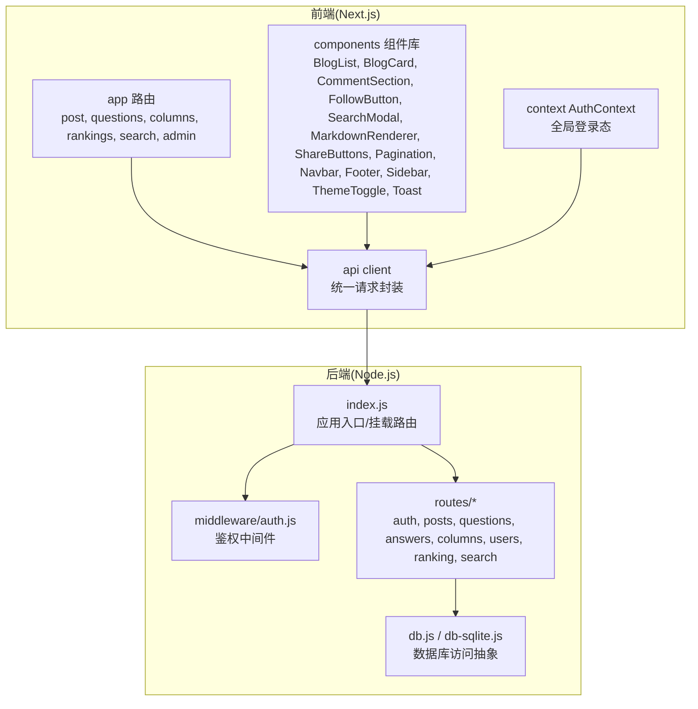
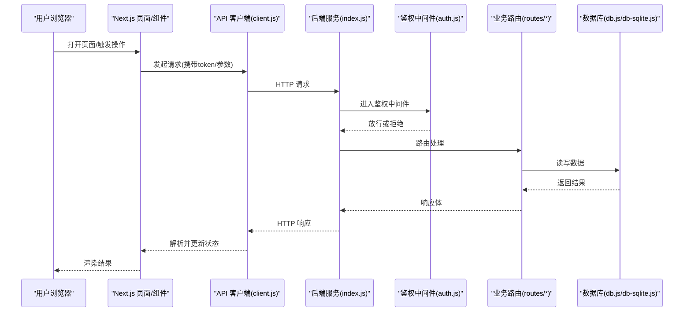
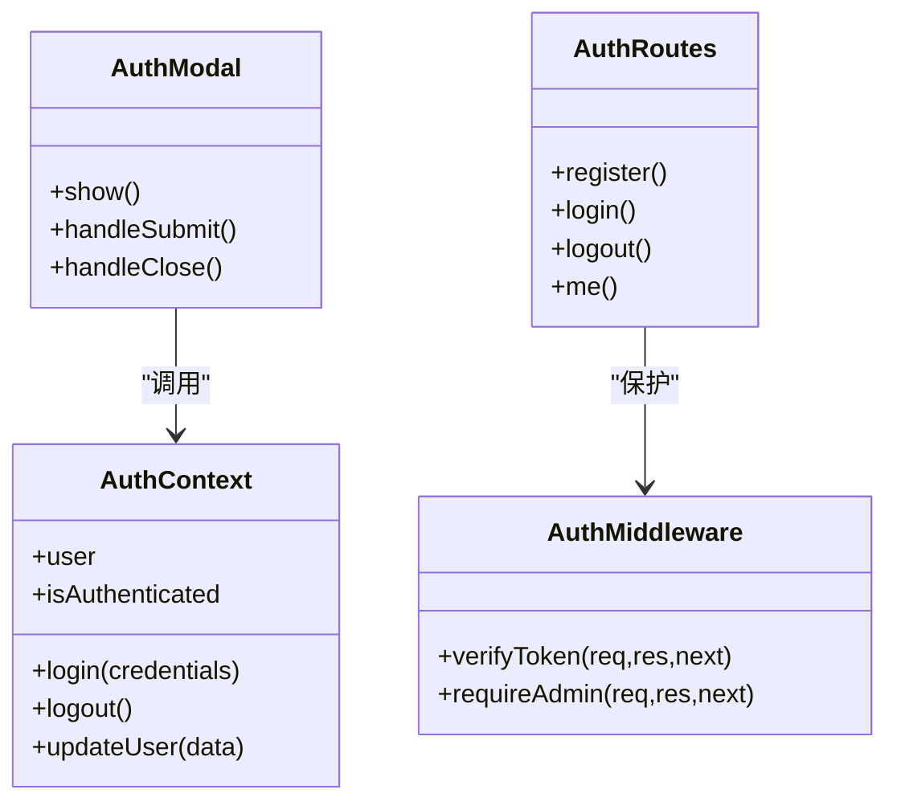
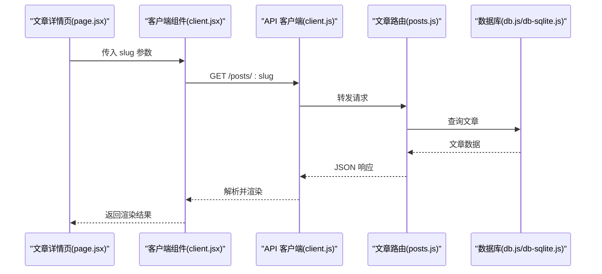
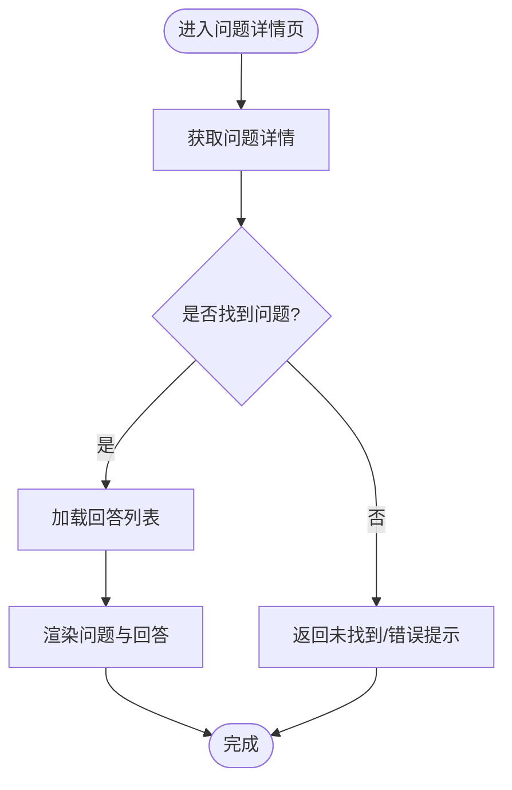
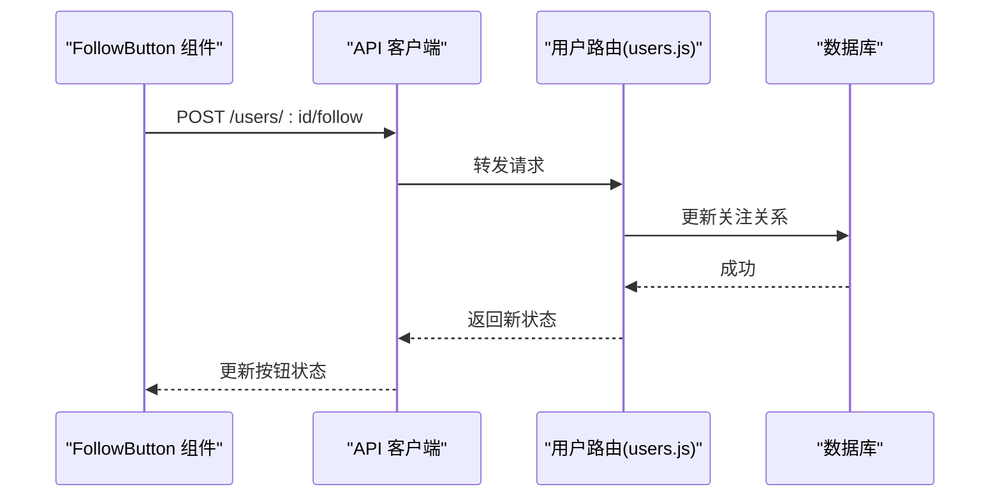
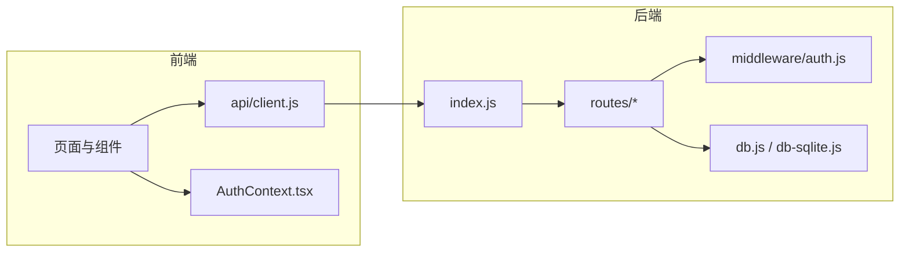

# 核心功能模块

<cite>
**本文引用的文件**   
- [server/src/index.js](file://server/src/index.js)
- [server/src/middleware/auth.js](file://server/src/middleware/auth.js)
- [server/src/routes/auth.js](file://server/src/routes/auth.js)
- [server/src/routes/posts.js](file://server/src/routes/posts.js)
- [server/src/routes/questions.js](file://server/src/routes/questions.js)
- [server/src/routes/answers.js](file://server/src/routes/answers.js)
- [server/src/routes/columns.js](file://server/src/routes/columns.js)
- [server/src/routes/users.js](file://server/src/routes/users.js)
- [server/src/routes/ranking.js](file://server/src/routes/ranking.js)
- [server/src/routes/search.js](file://server/src/routes/search.js)
- [server/src/db.js](file://server/src/db.js)
- [server/src/db-sqlite.js](file://server/src/db-sqlite.js)
- [src/api/client.js](file://src/api/client.js)
- [src/context/AuthContext.tsx](file://src/context/AuthContext.tsx)
- [src/components/AuthModal/AuthModal.jsx](file://src/components/AuthModal/AuthModal.jsx)
- [src/app/layout.jsx](file://src/app/layout.jsx)
- [src/app/providers.jsx](file://src/app/providers.jsx)
- [src/app/page.jsx](file://src/app/page.jsx)
- [src/app/home-client.jsx](file://src/app/home-client.jsx)
- [src/app/post/[slug]/page.jsx](file://src/app/post/[slug]/page.jsx)
- [src/app/post/[slug]/client.jsx](file://src/app/post/[slug]/client.jsx)
- [src/app/questions/page.jsx](file://src/app/questions/page.jsx)
- [src/app/questions/[id]/page.jsx](file://src/app/questions/[id]/page.jsx)
- [src/app/u/[username]/write/page.jsx](file://src/app/u/[username]/write/page.jsx)
- [src/app/u/[username]/write/[id]/page.jsx](file://src/app/u/[username]/write/[id]/page.jsx)
- [src/app/columns/page.jsx](file://src/app/columns/page.jsx)
- [src/app/column/[slug]/page.jsx](file://src/app/column/[slug]/page.jsx)
- [src/app/category/[slug]/page.jsx](file://src/app/category/[slug]/page.jsx)
- [src/app/rankings/page.jsx](file://src/app/rankings/page.jsx)
- [src/app/rankings/[type]/page.jsx](file://src/app/rankings/[type]/page.jsx)
- [src/app/search/page.jsx](file://src/app/search/page.jsx)
- [src/app/admin/page.tsx](file://src/app/admin/page.tsx)
- [src/components/BlogList/BlogList.jsx](file://src/components/BlogList/BlogList.jsx)
- [src/components/BlogCard/BlogCard.jsx](file://src/components/BlogCard/BlogCard.jsx)
- [src/components/CommentSection/CommentSection.jsx](file://src/components/CommentSection/CommentSection.jsx)
- [src/components/FollowButton/followbutton.jsx](file://src/components/FollowButton/followbutton.jsx)
- [src/components/SearchModal/searchmodal.jsx](file://src/components/SearchModal/searchmodal.jsx)
- [src/components/MarkdownRenderer/index.jsx](file://src/components/MarkdownRenderer/index.jsx)
- [src/components/ShareButtons/ShareButtons.jsx](file://src/components/ShareButtons/ShareButtons.jsx)
- [src/components/Pagination/Pagination.jsx](file://src/components/Pagination/Pagination.jsx)
- [src/components/Navbar/navbar.jsx](file://src/components/Navbar/navbar.jsx)
- [src/components/Footer/Footer.jsx](file://src/components/Footer/Footer.jsx)
- [src/components/Sidebar/Sidebar.jsx](file://src/components/Sidebar/Sidebar.jsx)
- [src/components/ThemeToggle/ThemeToggle.jsx](file://src/components/ThemeToggle/ThemeToggle.jsx)
- [src/components/Toast/Toast.jsx](file://src/components/Toast/Toast.jsx)
- [API.md](file://API.md)
- [README.md](file://README.md)
</cite>

## 目录
1. [简介](#简介)
2. [项目结构](#项目结构)
3. [核心组件](#核心组件)
4. [架构总览](#架构总览)
5. [详细组件分析](#详细组件分析)
6. [依赖关系分析](#依赖关系分析)
7. [性能考虑](#性能考虑)
8. [故障排查指南](#故障排查指南)
9. [结论](#结论)
10. [附录](#附录)

## 简介
本文件聚焦博客系统的核心业务功能，围绕用户认证、博客内容管理、问答系统、社区互动等关键模块进行系统化说明。文档从后端路由与中间件、数据库访问层、前端页面与组件、上下文状态管理以及 API 客户端等维度展开，解释各模块的业务逻辑、数据模型、接口契约、前后端交互流程、配置项与扩展点，并提供常见使用场景的最佳实践、性能优化策略与故障排查建议。

## 项目结构
本项目采用前后端分离的 Next.js + Node.js 架构：
- 后端位于 server/src，提供 RESTful API，包含认证、文章、问答、专栏、用户、排行、搜索等路由，并通过中间件实现鉴权；数据访问通过 db.js 与 db-sqlite.js 抽象。
- 前端位于 src，基于 Next.js App Router，按功能域组织页面与组件，使用 context 管理认证状态，统一通过 api/client.js 调用后端接口。

图表来源
- [server/src/index.js](file://server/src/index.js)
- [server/src/middleware/auth.js](file://server/src/middleware/auth.js)
- [server/src/routes/auth.js](file://server/src/routes/auth.js)
- [server/src/routes/posts.js](file://server/src/routes/posts.js)
- [server/src/routes/questions.js](file://server/src/routes/questions.js)
- [server/src/routes/answers.js](file://server/src/routes/answers.js)
- [server/src/routes/columns.js](file://server/src/routes/columns.js)
- [server/src/routes/users.js](file://server/src/routes/users.js)
- [server/src/routes/ranking.js](file://server/src/routes/ranking.js)
- [server/src/routes/search.js](file://server/src/routes/search.js)
- [server/src/db.js](file://server/src/db.js)
- [server/src/db-sqlite.js](file://server/src/db-sqlite.js)
- [src/api/client.js](file://src/api/client.js)
- [src/context/AuthContext.tsx](file://src/context/AuthContext.tsx)
- [src/app/layout.jsx](file://src/app/layout.jsx)
- [src/app/providers.jsx](file://src/app/providers.jsx)

章节来源
- [README.md](file://README.md)
- [API.md](file://API.md)

## 核心组件
本节概述各核心模块的职责与边界，为后续深入分析奠定基础。

- 用户认证系统
  - 负责注册、登录、登出、会话校验、权限控制（含管理员）。
  - 关键文件：server/src/middleware/auth.js、server/src/routes/auth.js、src/context/AuthContext.tsx、src/components/AuthModal/AuthModal.jsx。
- 博客内容管理
  - 负责文章的创建、编辑、草稿保存、发布、分类/标签、分页与详情渲染。
  - 关键文件：server/src/routes/posts.js、src/app/post/[slug]/page.jsx、src/app/post/[slug]/client.jsx、src/components/BlogList/BlogList.jsx、src/components/BlogCard/BlogCard.jsx、src/components/MarkdownRenderer/index.jsx。
- 问答系统
  - 负责问题发布、答案提交、排序与详情展示。
  - 关键文件：server/src/routes/questions.js、server/src/routes/answers.js、src/app/questions/page.jsx、src/app/questions/[id]/page.jsx。
- 社区互动
  - 关注/取关、评论、分享、搜索、排行榜。
  - 关键文件：server/src/routes/users.js、server/src/routes/ranking.js、server/src/routes/search.js、src/components/FollowButton/followbutton.jsx、src/components/CommentSection/CommentSection.jsx、src/components/ShareButtons/ShareButtons.jsx、src/components/SearchModal/searchmodal.jsx、src/app/rankings/page.jsx、src/app/rankings/[type]/page.jsx、src/app/search/page.jsx。
- 专栏与分类
  - 专栏列表与详情、文章按分类筛选。
  - 关键文件：server/src/routes/columns.js、src/app/columns/page.jsx、src/app/column/[slug]/page.jsx、src/app/category/[slug]/page.jsx。
- 管理与统计
  - 后台概览与管理操作。
  - 关键文件：src/app/admin/page.tsx。

章节来源
- [server/src/middleware/auth.js](file://server/src/middleware/auth.js)
- [server/src/routes/auth.js](file://server/src/routes/auth.js)
- [server/src/routes/posts.js](file://server/src/routes/posts.js)
- [server/src/routes/questions.js](file://server/src/routes/questions.js)
- [server/src/routes/answers.js](file://server/src/routes/answers.js)
- [server/src/routes/columns.js](file://server/src/routes/columns.js)
- [server/src/routes/users.js](file://server/src/routes/users.js)
- [server/src/routes/ranking.js](file://server/src/routes/ranking.js)
- [server/src/routes/search.js](file://server/src/routes/search.js)
- [src/context/AuthContext.tsx](file://src/context/AuthContext.tsx)
- [src/components/AuthModal/AuthModal.jsx](file://src/components/AuthModal/AuthModal.jsx)
- [src/app/post/[slug]/page.jsx](file://src/app/post/[slug]/page.jsx)
- [src/app/post/[slug]/client.jsx](file://src/app/post/[slug]/client.jsx)
- [src/app/questions/page.jsx](file://src/app/questions/page.jsx)
- [src/app/questions/[id]/page.jsx](file://src/app/questions/[id]/page.jsx)
- [src/app/columns/page.jsx](file://src/app/columns/page.jsx)
- [src/app/column/[slug]/page.jsx](file://src/app/column/[slug]/page.jsx)
- [src/app/category/[slug]/page.jsx](file://src/app/category/[slug]/page.jsx)
- [src/app/rankings/page.jsx](file://src/app/rankings/page.jsx)
- [src/app/rankings/[type]/page.jsx](file://src/app/rankings/[type]/page.jsx)
- [src/app/search/page.jsx](file://src/app/search/page.jsx)
- [src/app/admin/page.tsx](file://src/app/admin/page.tsx)

## 架构总览
整体采用“前端页面/组件 -> API 客户端 -> 后端路由 -> 中间件鉴权 -> 数据库”的分层结构。Next.js 负责 SSR/CSR 渲染与路由分发；Node.js 暴露 REST API；db.js/db-sqlite.js 屏蔽底层存储差异。

图表来源
- [src/api/client.js](file://src/api/client.js)
- [server/src/index.js](file://server/src/index.js)
- [server/src/middleware/auth.js](file://server/src/middleware/auth.js)
- [server/src/routes/posts.js](file://server/src/routes/posts.js)
- [server/src/db.js](file://server/src/db.js)
- [server/src/db-sqlite.js](file://server/src/db-sqlite.js)

## 详细组件分析

### 用户认证系统
- 业务逻辑
  - 注册/登录：校验输入、生成令牌、写入会话或持久化存储。
  - 鉴权：中间件校验请求头中的令牌，注入用户上下文供路由使用。
  - 权限：区分普通用户与管理员，保护敏感路由。
- 数据模型
  - 用户实体：用户名、邮箱、密码哈希、角色、时间戳等字段。
  - 会话/令牌：JWT 或自定义 token，包含过期策略。
- API 接口
  - 登录/注册/登出、获取当前用户信息、修改资料等。
- 前端实现
  - AuthContext 维护登录态与用户信息，AuthModal 提供弹窗式登录注册。
  - 受保护页面在 layout 或 providers 中注入认证上下文。
- 依赖关系
  - 前端依赖 API 客户端与上下文；后端依赖鉴权中间件与各业务路由。

图表来源
- [src/context/AuthContext.tsx](file://src/context/AuthContext.tsx)
- [src/components/AuthModal/AuthModal.jsx](file://src/components/AuthModal/AuthModal.jsx)
- [server/src/middleware/auth.js](file://server/src/middleware/auth.js)
- [server/src/routes/auth.js](file://server/src/routes/auth.js)

章节来源
- [server/src/middleware/auth.js](file://server/src/middleware/auth.js)
- [server/src/routes/auth.js](file://server/src/routes/auth.js)
- [src/context/AuthContext.tsx](file://src/context/AuthContext.tsx)
- [src/components/AuthModal/AuthModal.jsx](file://src/components/AuthModal/AuthModal.jsx)
- [src/app/layout.jsx](file://src/app/layout.jsx)
- [src/app/providers.jsx](file://src/app/providers.jsx)

### 博客内容管理
- 业务逻辑
  - 文章 CRUD：支持草稿保存、发布、更新、删除。
  - 分类/标签：文章与分类关联，支持按分类筛选。
  - 详情渲染：Markdown 渲染、评论、分享、点赞/收藏（若存在）。
- 数据模型
  - 文章实体：标题、正文、摘要、作者、分类、标签、状态、时间戳等。
  - 分类实体：名称、slug、描述等。
- API 接口
  - 文章列表/详情、创建/更新/删除、草稿保存、按分类查询。
- 前端实现
  - 列表页使用 BlogList/BlogCard 渲染卡片；详情页使用 MarkdownRenderer 渲染正文；编辑器页面支持草稿自动保存。
- 依赖关系
  - 前端通过 client.js 调用 posts 路由；路由层通过 db.js/db-sqlite.js 存取数据。

图表来源
- [src/app/post/[slug]/page.jsx](file://src/app/post/[slug]/page.jsx)
- [src/app/post/[slug]/client.jsx](file://src/app/post/[slug]/client.jsx)
- [src/api/client.js](file://src/api/client.js)
- [server/src/routes/posts.js](file://server/src/routes/posts.js)
- [server/src/db.js](file://server/src/db.js)
- [server/src/db-sqlite.js](file://server/src/db-sqlite.js)

章节来源
- [server/src/routes/posts.js](file://server/src/routes/posts.js)
- [src/app/post/[slug]/page.jsx](file://src/app/post/[slug]/page.jsx)
- [src/app/post/[slug]/client.jsx](file://src/app/post/[slug]/client.jsx)
- [src/components/BlogList/BlogList.jsx](file://src/components/BlogList/BlogList.jsx)
- [src/components/BlogCard/BlogCard.jsx](file://src/components/BlogCard/BlogCard.jsx)
- [src/components/MarkdownRenderer/index.jsx](file://src/components/MarkdownRenderer/index.jsx)

### 问答系统
- 业务逻辑
  - 提问：用户可发布问题，支持标签与分类。
  - 回答：其他用户可对问题进行回答，支持排序与采纳（若存在）。
  - 详情：问题详情聚合回答列表与元数据。
- 数据模型
  - 问题实体：标题、正文、作者、标签、时间戳、状态等。
  - 回答实体：内容、作者、问题ID、时间戳等。
- API 接口
  - 问题列表/详情、创建问题、提交回答、回答排序。
- 前端实现
  - 问题列表页与详情页分别对应 questions/page.jsx 与 questions/[id]/page.jsx。
- 依赖关系
  - 前端通过 client.js 调用 questions/answers 路由；路由层通过数据库存取。

图表来源
- [src/app/questions/[id]/page.jsx](file://src/app/questions/[id]/page.jsx)
- [server/src/routes/questions.js](file://server/src/routes/questions.js)
- [server/src/routes/answers.js](file://server/src/routes/answers.js)

章节来源
- [server/src/routes/questions.js](file://server/src/routes/questions.js)
- [server/src/routes/answers.js](file://server/src/routes/answers.js)
- [src/app/questions/page.jsx](file://src/app/questions/page.jsx)
- [src/app/questions/[id]/page.jsx](file://src/app/questions/[id]/page.jsx)

### 社区互动
- 关注/取关
  - 用户间关注关系维护，支持一键关注/取消。
  - 前端组件 FollowButton 封装交互逻辑。
- 评论
  - 文章/问题评论列表与新增评论。
  - 组件 CommentSection 负责渲染与提交。
- 分享
  - 分享按钮组件 ShareButtons 提供多平台分享入口。
- 搜索
  - 搜索框与搜索结果页，支持关键词匹配与分页。
  - 组件 SearchModal 与页面 search/page.jsx。
- 排行榜
  - 按类型（如热度、最新）展示排名。
  - 路由 ranking.js 与页面 rankings/page.jsx、rankings/[type]/page.jsx。

图表来源
- [src/components/FollowButton/followbutton.jsx](file://src/components/FollowButton/followbutton.jsx)
- [src/api/client.js](file://src/api/client.js)
- [server/src/routes/users.js](file://server/src/routes/users.js)
- [server/src/db.js](file://server/src/db.js)

章节来源
- [server/src/routes/users.js](file://server/src/routes/users.js)
- [server/src/routes/ranking.js](file://server/src/routes/ranking.js)
- [server/src/routes/search.js](file://server/src/routes/search.js)
- [src/components/FollowButton/followbutton.jsx](file://src/components/FollowButton/followbutton.jsx)
- [src/components/CommentSection/CommentSection.jsx](file://src/components/CommentSection/CommentSection.jsx)
- [src/components/ShareButtons/ShareButtons.jsx](file://src/components/ShareButtons/ShareButtons.jsx)
- [src/components/SearchModal/searchmodal.jsx](file://src/components/SearchModal/searchmodal.jsx)
- [src/app/rankings/page.jsx](file://src/app/rankings/page.jsx)
- [src/app/rankings/[type]/page.jsx](file://src/app/rankings/[type]/page.jsx)
- [src/app/search/page.jsx](file://src/app/search/page.jsx)

### 专栏与分类
- 业务逻辑
  - 专栏：创建、编辑、列出专栏及其文章。
  - 分类：文章按分类筛选，支持 slug 路由。
- API 接口
  - 专栏列表/详情、文章按分类查询。
- 前端实现
  - columns/page.jsx 展示专栏列表；column/[slug]/page.jsx 展示专栏详情；category/[slug]/page.jsx 按分类筛选文章。

章节来源
- [server/src/routes/columns.js](file://server/src/routes/columns.js)
- [src/app/columns/page.jsx](file://src/app/columns/page.jsx)
- [src/app/column/[slug]/page.jsx](file://src/app/column/[slug]/page.jsx)
- [src/app/category/[slug]/page.jsx](file://src/app/category/[slug]/page.jsx)

### 管理与统计
- 业务逻辑
  - 后台概览：用户数、文章数、问答数等统计。
  - 管理操作：内容审核、用户管理等（视权限）。
- 前端实现
  - admin/page.tsx 作为管理入口，结合认证上下文限制访问。

章节来源
- [src/app/admin/page.tsx](file://src/app/admin/page.tsx)

## 依赖关系分析
- 前端依赖
  - 页面与组件依赖 api/client.js 进行网络请求。
  - 认证相关页面与组件依赖 AuthContext 提供的用户状态。
- 后端依赖
  - index.js 挂载所有路由，统一经过 auth 中间件校验。
  - routes/* 各自实现业务逻辑，依赖 db.js/db-sqlite.js 进行数据存取。
- 外部依赖
  - 数据库驱动由 db-sqlite.js 提供 SQLite 实现；db.js 定义通用接口。

图表来源
- [src/api/client.js](file://src/api/client.js)
- [src/context/AuthContext.tsx](file://src/context/AuthContext.tsx)
- [server/src/index.js](file://server/src/index.js)
- [server/src/middleware/auth.js](file://server/src/middleware/auth.js)
- [server/src/db.js](file://server/src/db.js)
- [server/src/db-sqlite.js](file://server/src/db-sqlite.js)

章节来源
- [server/src/index.js](file://server/src/index.js)
- [server/src/middleware/auth.js](file://server/src/middleware/auth.js)
- [server/src/db.js](file://server/src/db.js)
- [server/src/db-sqlite.js](file://server/src/db-sqlite.js)
- [src/api/client.js](file://src/api/client.js)
- [src/context/AuthContext.tsx](file://src/context/AuthContext.tsx)

## 性能考虑
- 缓存策略
  - 列表类接口（文章、问答、排行榜）可引入服务端缓存或 CDN 缓存，减少重复查询。
  - 静态资源与 Markdown 渲染产物可缓存，降低前端计算开销。
- 分页与懒加载
  - 列表页默认分页，避免一次性加载大量数据。
  - 图片与长文内容按需加载，提升首屏性能。
- 数据库优化
  - 对高频查询字段建立索引（如分类、标签、更新时间）。
  - 复杂查询尽量使用预编译语句与必要字段投影。
- 前端优化
  - 组件拆分与代码分割，按需加载页面与组件。
  - 使用 React.memo/useMemo 减少不必要的重渲染。
- 并发与限流
  - 对写操作接口实施速率限制，防止滥用。
  - 批量操作合并请求，减少往返次数。

[本节为通用指导，不直接分析具体文件]

## 故障排查指南
- 认证失败
  - 检查请求头是否携带有效令牌；确认中间件是否正确解析与校验。
  - 查看后端日志输出与错误码，定位令牌过期或签名错误。
- 数据不一致
  - 核对数据库表结构与迁移脚本，确保字段与约束正确。
  - 对比前后端字段映射，避免命名不一致导致的数据丢失。
- 接口 404/500
  - 确认路由路径与参数是否与前端一致。
  - 检查数据库连接与 SQL 执行异常，必要时回滚变更。
- 前端渲染异常
  - 检查 Markdown 渲染器与样式冲突。
  - 使用浏览器开发者工具查看网络与控制台错误。

章节来源
- [server/src/middleware/auth.js](file://server/src/middleware/auth.js)
- [server/src/db.js](file://server/src/db.js)
- [server/src/db-sqlite.js](file://server/src/db-sqlite.js)
- [src/components/MarkdownRenderer/index.jsx](file://src/components/MarkdownRenderer/index.jsx)

## 结论
本博客系统以清晰的模块化设计实现了用户认证、内容管理、问答与社区互动等核心能力。前后端职责明确、依赖关系清晰，具备良好的可扩展性。建议在现有基础上进一步完善缓存机制、权限细化与监控告警，以提升稳定性与用户体验。

[本节为总结性内容，不直接分析具体文件]

## 附录
- 常用页面与组件路径
  - 首页与布局：src/app/page.jsx、src/app/layout.jsx、src/app/home-client.jsx
  - 文章详情：src/app/post/[slug]/page.jsx、src/app/post/[slug]/client.jsx
  - 问答：src/app/questions/page.jsx、src/app/questions/[id]/page.jsx
  - 专栏与分类：src/app/columns/page.jsx、src/app/column/[slug]/page.jsx、src/app/category/[slug]/page.jsx
  - 排行榜与搜索：src/app/rankings/page.jsx、src/app/rankings/[type]/page.jsx、src/app/search/page.jsx
  - 管理后台：src/app/admin/page.tsx
  - 导航与基础组件：src/components/Navbar/navbar.jsx、src/components/Footer/Footer.jsx、src/components/Sidebar/Sidebar.jsx、src/components/ThemeToggle/ThemeToggle.jsx、src/components/Toast/Toast.jsx、src/components/Pagination/Pagination.jsx

章节来源
- [src/app/page.jsx](file://src/app/page.jsx)
- [src/app/layout.jsx](file://src/app/layout.jsx)
- [src/app/home-client.jsx](file://src/app/home-client.jsx)
- [src/app/post/[slug]/page.jsx](file://src/app/post/[slug]/page.jsx)
- [src/app/post/[slug]/client.jsx](file://src/app/post/[slug]/client.jsx)
- [src/app/questions/page.jsx](file://src/app/questions/page.jsx)
- [src/app/questions/[id]/page.jsx](file://src/app/questions/[id]/page.jsx)
- [src/app/columns/page.jsx](file://src/app/columns/page.jsx)
- [src/app/column/[slug]/page.jsx](file://src/app/column/[slug]/page.jsx)
- [src/app/category/[slug]/page.jsx](file://src/app/category/[slug]/page.jsx)
- [src/app/rankings/page.jsx](file://src/app/rankings/page.jsx)
- [src/app/rankings/[type]/page.jsx](file://src/app/rankings/[type]/page.jsx)
- [src/app/search/page.jsx](file://src/app/search/page.jsx)
- [src/app/admin/page.tsx](file://src/app/admin/page.tsx)
- [src/components/Navbar/navbar.jsx](file://src/components/Navbar/navbar.jsx)
- [src/components/Footer/Footer.jsx](file://src/components/Footer/Footer.jsx)
- [src/components/Sidebar/Sidebar.jsx](file://src/components/Sidebar/Sidebar.jsx)
- [src/components/ThemeToggle/ThemeToggle.jsx](file://src/components/ThemeToggle/ThemeToggle.jsx)
- [src/components/Toast/Toast.jsx](file://src/components/Toast/Toast.jsx)
- [src/components/Pagination/Pagination.jsx](file://src/components/Pagination/Pagination.jsx)