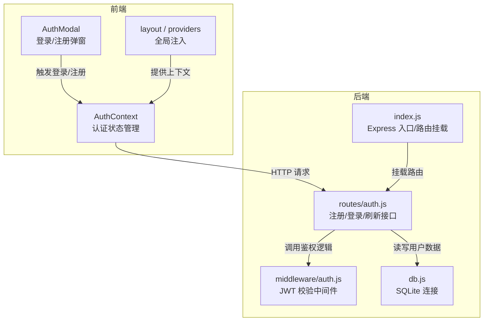
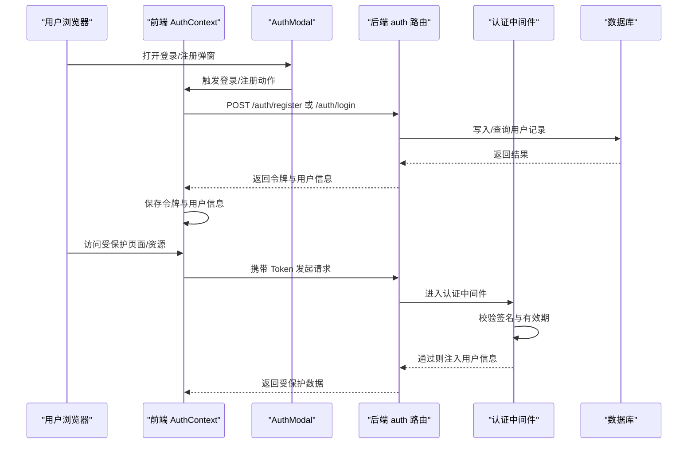
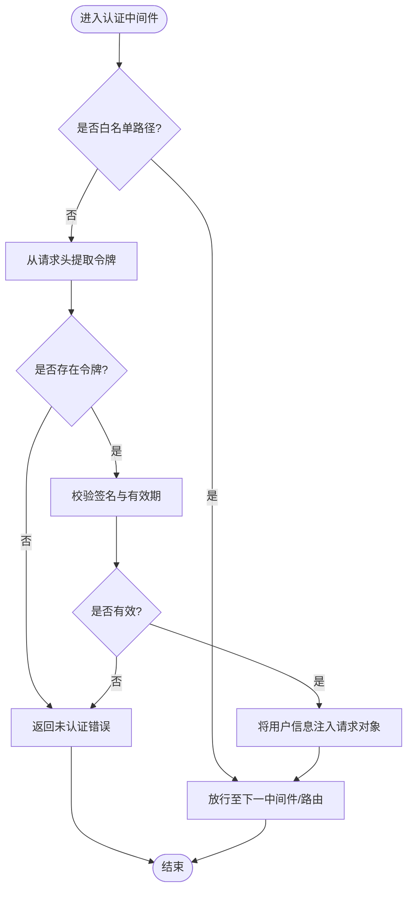
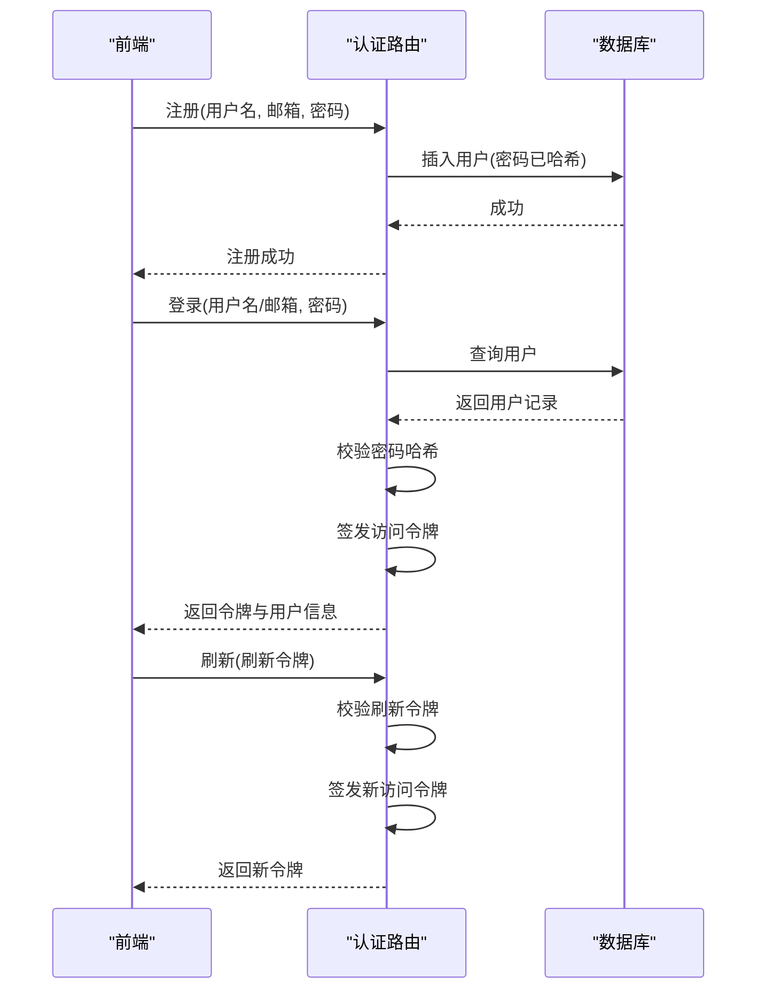
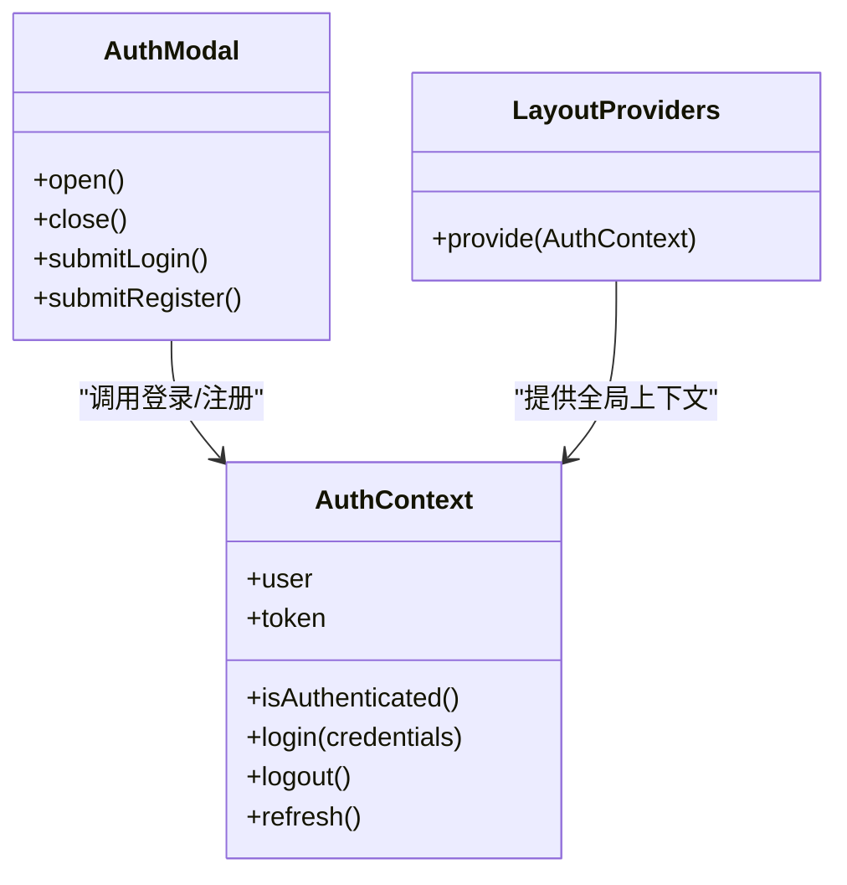
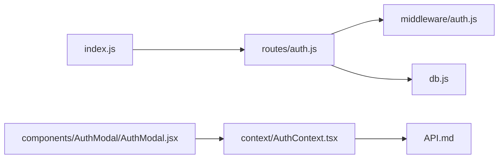

# 用户认证系统

<cite>
**本文引用的文件**   
- [server/src/middleware/auth.js](file://server/src/middleware/auth.js)
- [server/src/routes/auth.js](file://server/src/routes/auth.js)
- [server/src/db.js](file://server/src/db.js)
- [server/src/index.js](file://server/src/index.js)
- [src/context/AuthContext.tsx](file://src/context/AuthContext.tsx)
- [src/components/AuthModal/AuthModal.jsx](file://src/components/AuthModal/AuthModal.jsx)
- [src/app/layout.jsx](file://src/app/layout.jsx)
- [src/app/providers.jsx](file://src/app/providers.jsx)
- [API.md](file://API.md)
</cite>

## 目录
1. [简介](#简介)
2. [项目结构](#项目结构)
3. [核心组件](#核心组件)
4. [架构总览](#架构总览)
5. [详细组件分析](#详细组件分析)
6. [依赖关系分析](#依赖关系分析)
7. [性能考虑](#性能考虑)
8. [故障排查指南](#故障排查指南)
9. [结论](#结论)
10. [附录](#附录)

## 简介
本文件面向“用户认证系统”的实现与使用，覆盖注册、登录、权限验证的完整流程；深入说明JWT令牌机制（生成、校验、刷新策略）；文档化认证中间件与安全考量；阐述前端认证状态管理的上下文架构与组件集成方式；提供角色权限与路由保护示例；并给出密码加密存储、会话管理与安全最佳实践，以及常见问题排查与性能优化建议。

## 项目结构
认证相关的关键位置：
- 后端
  - 认证中间件：server/src/middleware/auth.js
  - 认证路由：server/src/routes/auth.js
  - 数据库连接：server/src/db.js
  - 服务入口与路由挂载：server/src/index.js
- 前端
  - 认证上下文：src/context/AuthContext.tsx
  - 认证弹窗组件：src/components/AuthModal/AuthModal.jsx
  - 应用布局与提供者：src/app/layout.jsx、src/app/providers.jsx
- API 文档：API.md

图表来源
- [server/src/index.js](file://server/src/index.js)
- [server/src/routes/auth.js](file://server/src/routes/auth.js)
- [server/src/middleware/auth.js](file://server/src/middleware/auth.js)
- [server/src/db.js](file://server/src/db.js)
- [src/context/AuthContext.tsx](file://src/context/AuthContext.tsx)
- [src/components/AuthModal/AuthModal.jsx](file://src/components/AuthModal/AuthModal.jsx)
- [src/app/layout.jsx](file://src/app/layout.jsx)
- [src/app/providers.jsx](file://src/app/providers.jsx)

章节来源
- [server/src/index.js](file://server/src/index.js)
- [server/src/routes/auth.js](file://server/src/routes/auth.js)
- [server/src/middleware/auth.js](file://server/src/middleware/auth.js)
- [server/src/db.js](file://server/src/db.js)
- [src/context/AuthContext.tsx](file://src/context/AuthContext.tsx)
- [src/components/AuthModal/AuthModal.jsx](file://src/components/AuthModal/AuthModal.jsx)
- [src/app/layout.jsx](file://src/app/layout.jsx)
- [src/app/providers.jsx](file://src/app/providers.jsx)

## 核心组件
- 认证中间件（服务端）
  - 职责：从请求头解析 JWT，校验签名与有效期，将用户信息注入到请求对象，供后续路由或业务逻辑使用。
  - 关键点：密钥配置、算法选择、错误码统一返回、白名单路径跳过校验。
- 认证路由（服务端）
  - 职责：处理注册、登录、刷新等接口；负责密码哈希与比对；签发与刷新 JWT。
  - 关键点：输入校验、唯一性检查、失败计数与锁定策略、令牌生命周期控制。
- 数据库层（服务端）
  - 职责：提供用户表访问能力（创建、查询、更新）。
  - 关键点：事务与并发安全、索引设计、敏感字段不落盘明文。
- 认证上下文（前端）
  - 职责：集中管理登录态、令牌、用户信息；封装登录/登出/刷新方法；在应用内广播状态变化。
  - 关键点：持久化策略（localStorage/cookie）、自动刷新、错误重试与降级。
- 认证弹窗（前端）
  - 职责：提供登录/注册 UI，调用上下文方法完成认证流程。
  - 关键点：表单校验、防重复提交、错误提示与跳转。

章节来源
- [server/src/middleware/auth.js](file://server/src/middleware/auth.js)
- [server/src/routes/auth.js](file://server/src/routes/auth.js)
- [server/src/db.js](file://server/src/db.js)
- [src/context/AuthContext.tsx](file://src/context/AuthContext.tsx)
- [src/components/AuthModal/AuthModal.jsx](file://src/components/AuthModal/AuthModal.jsx)

## 架构总览
整体交互时序如下：

图表来源
- [server/src/routes/auth.js](file://server/src/routes/auth.js)
- [server/src/middleware/auth.js](file://server/src/middleware/auth.js)
- [server/src/db.js](file://server/src/db.js)
- [src/context/AuthContext.tsx](file://src/context/AuthContext.tsx)
- [src/components/AuthModal/AuthModal.jsx](file://src/components/AuthModal/AuthModal.jsx)

## 详细组件分析

### 认证中间件（服务端）
- 功能要点
  - 从请求头提取令牌并进行签名与过期校验。
  - 校验通过后，将解码后的用户标识等信息挂载到请求对象，便于下游路由使用。
  - 对未登录或无效令牌返回标准错误响应。
- 安全考虑
  - 仅信任强随机密钥与固定算法。
  - 严格校验令牌格式与载荷字段类型。
  - 对关键接口增加二次校验（如管理员操作）。
- 扩展点
  - 支持黑名单/撤销列表（可选）。
  - 支持按角色/权限快速判断（可在中间件后追加授权中间件）。

图表来源
- [server/src/middleware/auth.js](file://server/src/middleware/auth.js)

章节来源
- [server/src/middleware/auth.js](file://server/src/middleware/auth.js)

### 认证路由（注册/登录/刷新）
- 注册流程
  - 接收用户名、邮箱、密码等参数。
  - 进行输入校验与唯一性检查。
  - 对密码进行哈希处理后写入数据库。
  - 返回成功响应（通常不直接返回令牌，由登录接口签发）。
- 登录流程
  - 根据用户名或邮箱查询用户。
  - 校验密码哈希。
  - 签发短期访问令牌（JWT），可附带用户角色/权限。
  - 返回令牌与必要用户信息。
- 刷新流程
  - 接收刷新令牌（若实现双令牌机制）。
  - 校验刷新令牌有效性。
  - 签发新的访问令牌。
  - 返回新令牌。

图表来源
- [server/src/routes/auth.js](file://server/src/routes/auth.js)
- [server/src/db.js](file://server/src/db.js)

章节来源
- [server/src/routes/auth.js](file://server/src/routes/auth.js)
- [server/src/db.js](file://server/src/db.js)

### 数据库层（用户数据）
- 职责
  - 提供用户记录的增删改查能力。
  - 保证密码等敏感字段以哈希形式存储。
- 注意事项
  - 为常用查询字段建立索引（如用户名、邮箱）。
  - 使用事务确保一致性。
  - 避免在日志中输出敏感信息。

章节来源
- [server/src/db.js](file://server/src/db.js)

### 前端认证上下文（AuthContext）
- 职责
  - 维护登录态、令牌、用户信息。
  - 提供登录、登出、刷新等方法。
  - 在应用启动时尝试恢复本地持久化的认证状态。
- 集成方式
  - 在应用根布局或提供者中包裹上下文，使全应用可用。
  - 组件通过上下文获取当前用户与鉴权状态。
- 安全与体验
  - 令牌持久化需权衡安全性与可用性（优先使用 httpOnly cookie 更佳）。
  - 自动刷新与错误重试提升用户体验。
  - 登出时清理本地状态与缓存。

图表来源
- [src/context/AuthContext.tsx](file://src/context/AuthContext.tsx)
- [src/components/AuthModal/AuthModal.jsx](file://src/components/AuthModal/AuthModal.jsx)
- [src/app/layout.jsx](file://src/app/layout.jsx)
- [src/app/providers.jsx](file://src/app/providers.jsx)

章节来源
- [src/context/AuthContext.tsx](file://src/context/AuthContext.tsx)
- [src/components/AuthModal/AuthModal.jsx](file://src/components/AuthModal/AuthModal.jsx)
- [src/app/layout.jsx](file://src/app/layout.jsx)
- [src/app/providers.jsx](file://src/app/providers.jsx)

### 权限控制与路由保护
- 服务端
  - 在认证中间件之后，可增加基于角色的授权中间件，依据令牌中的角色/权限决定访问。
  - 针对管理员接口进行额外校验。
- 前端
  - 在页面级或组件级根据上下文的用户信息进行渲染控制。
  - 结合路由守卫，在未登录或无权限时重定向到登录页或无权限页。

章节来源
- [server/src/middleware/auth.js](file://server/src/middleware/auth.js)
- [server/src/routes/auth.js](file://server/src/routes/auth.js)
- [src/context/AuthContext.tsx](file://src/context/AuthContext.tsx)

## 依赖关系分析

图表来源
- [server/src/index.js](file://server/src/index.js)
- [server/src/routes/auth.js](file://server/src/routes/auth.js)
- [server/src/middleware/auth.js](file://server/src/middleware/auth.js)
- [server/src/db.js](file://server/src/db.js)
- [src/context/AuthContext.tsx](file://src/context/AuthContext.tsx)
- [src/components/AuthModal/AuthModal.jsx](file://src/components/AuthModal/AuthModal.jsx)
- [API.md](file://API.md)

章节来源
- [server/src/index.js](file://server/src/index.js)
- [server/src/routes/auth.js](file://server/src/routes/auth.js)
- [server/src/middleware/auth.js](file://server/src/middleware/auth.js)
- [server/src/db.js](file://server/src/db.js)
- [src/context/AuthContext.tsx](file://src/context/AuthContext.tsx)
- [src/components/AuthModal/AuthModal.jsx](file://src/components/AuthModal/AuthModal.jsx)
- [API.md](file://API.md)

## 性能考虑
- 服务端
  - 为高频查询字段建立索引，减少登录/注册时的扫描成本。
  - 合理设置令牌过期时间，平衡安全与刷新频率。
  - 对认证接口启用限流与防暴力破解策略。
- 前端
  - 合并请求与去抖/节流，避免频繁刷新。
  - 仅在必要时拉取用户信息，利用缓存与懒加载。
  - 错误重试采用指数退避，降低瞬时压力。

## 故障排查指南
- 常见症状与定位
  - 401 未认证：检查请求头是否携带正确令牌、令牌是否过期、中间件是否放行白名单。
  - 403 禁止访问：检查用户角色/权限是否满足目标接口要求。
  - 登录失败：核对用户名/邮箱是否正确、密码哈希比对逻辑、数据库记录是否存在。
  - 注册冲突：确认唯一性约束与错误码返回。
- 调试建议
  - 在服务端打印关键步骤日志（注意脱敏）。
  - 在前端控制台查看网络请求与上下文状态。
  - 使用最小复现用例逐步缩小问题范围。

章节来源
- [server/src/middleware/auth.js](file://server/src/middleware/auth.js)
- [server/src/routes/auth.js](file://server/src/routes/auth.js)
- [server/src/db.js](file://server/src/db.js)
- [src/context/AuthContext.tsx](file://src/context/AuthContext.tsx)

## 结论
本认证系统围绕 JWT 与前后端协作展开：后端通过中间件统一鉴权，路由负责注册/登录/刷新；前端通过上下文集中管理认证状态并与弹窗组件协同工作。遵循安全最佳实践（强密钥、短时效、最小权限、输入校验、防暴力破解）与性能优化策略，可获得稳定且高效的认证体验。

## 附录
- API 参考
  - 注册、登录、刷新等接口的定义与示例请参考 API 文档。

章节来源
- [API.md](file://API.md)