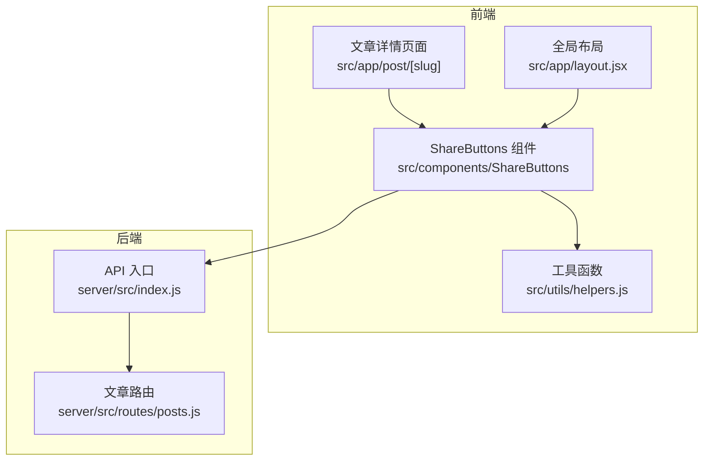
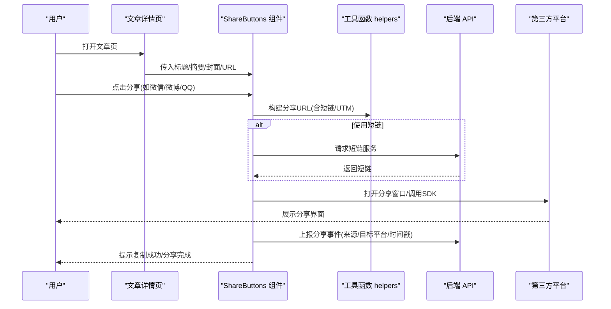
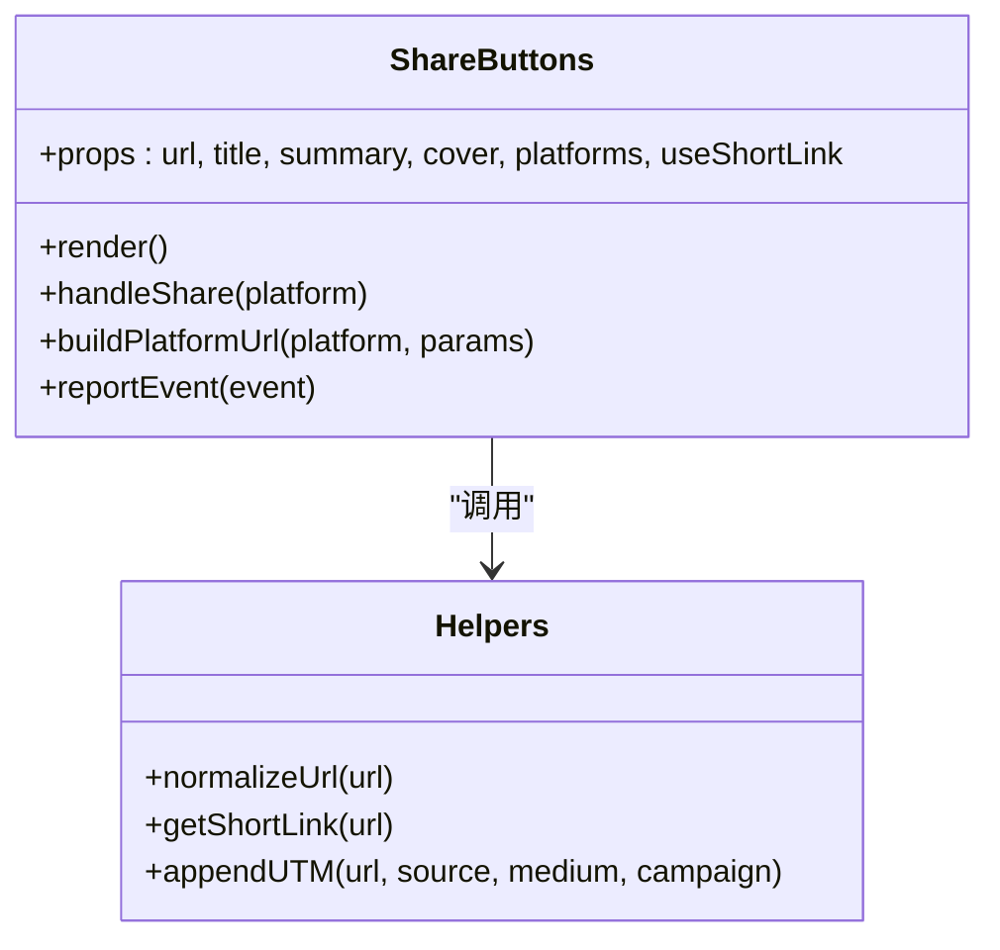
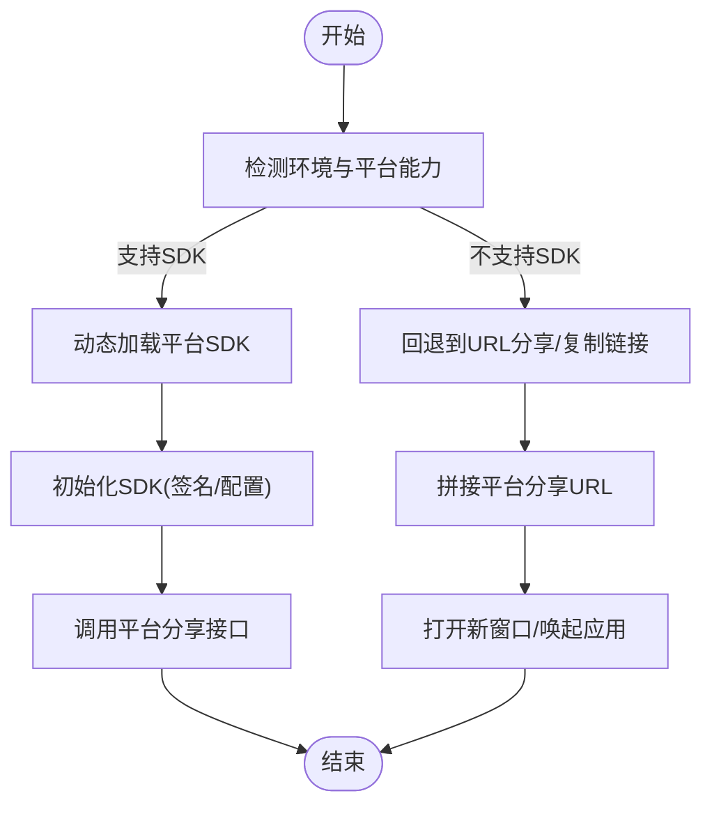
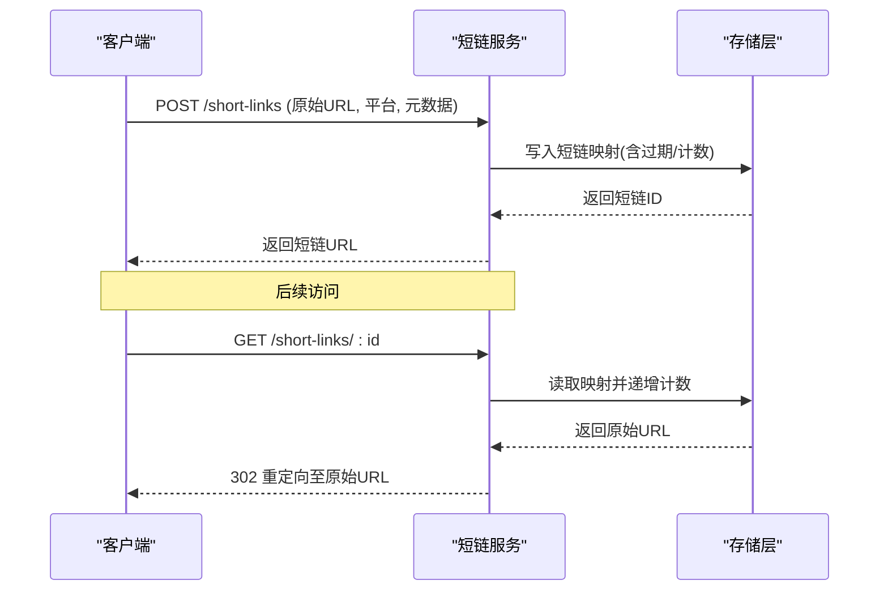
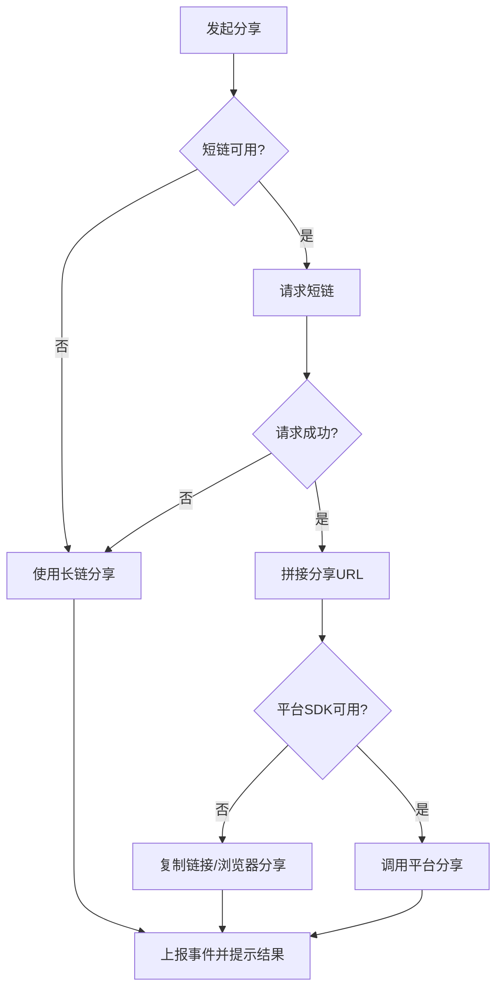
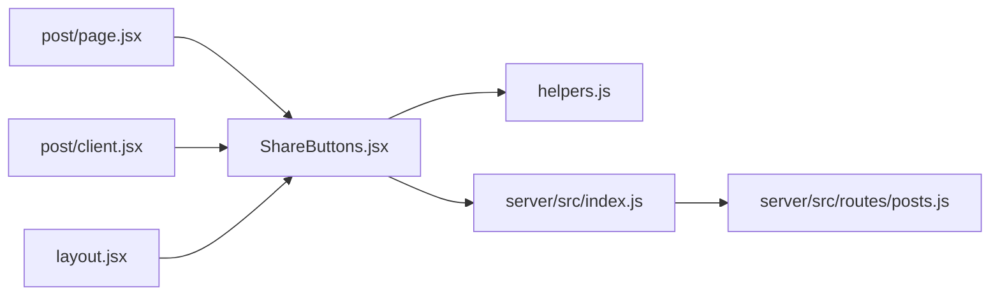

# 分享功能

<cite>
**本文引用的文件**   
- [ShareButtons.jsx](file://src/components/ShareButtons/ShareButtons.jsx)
- [ShareButtons.module.css](file://src/components/ShareButtons/ShareButtons.module.css)
- [post/page.jsx](file://src/app/post/[slug]/page.jsx)
- [post/client.jsx](file://src/app/post/[slug]/client.jsx)
- [layout.jsx](file://src/app/layout.jsx)
- [helpers.js](file://src/utils/helpers.js)
- [index.js](file://server/src/index.js)
- [posts.js](file://server/src/routes/posts.js)
</cite>

## 目录
1. [简介](#简介)
2. [项目结构](#项目结构)
3. [核心组件](#核心组件)
4. [架构总览](#架构总览)
5. [详细组件分析](#详细组件分析)
6. [依赖关系分析](#依赖关系分析)
7. [性能与可扩展性](#性能与可扩展性)
8. [故障排查指南](#故障排查指南)
9. [结论](#结论)
10. [附录](#附录)

## 简介
本文件围绕“分享功能”进行系统化文档化，覆盖以下关键主题：
- 分享按钮组件的设计模式：可配置的平台集成、动态加载机制、样式与交互。
- 第三方平台对接方案：微信、微博、QQ等主流平台的接入策略与注意事项。
- 分享链接的生成与管理：短链接服务、访问统计、有效期控制。
- 内容定制与SEO优化：标题、描述、图片、Open Graph/Twitter Card等元数据。
- 分享追踪与分析：来源识别、转化率、用户行为埋点。
- 权限控制与隐私保护：可见范围、鉴权、合规要求。
- 国际化与多语言适配：文案、URL参数、平台差异。
- 错误处理与降级：网络异常、平台不可用、回退路径。

## 项目结构
分享功能在前端以组件形式提供，在文章详情页嵌入；后端预留接口用于统计与短链扩展。

图表来源
- [ShareButtons.jsx](file://src/components/ShareButtons/ShareButtons.jsx)
- [post/page.jsx](file://src/app/post/[slug]/page.jsx)
- [post/client.jsx](file://src/app/post/[slug]/client.jsx)
- [layout.jsx](file://src/app/layout.jsx)
- [helpers.js](file://src/utils/helpers.js)
- [index.js](file://server/src/index.js)
- [posts.js](file://server/src/routes/posts.js)

章节来源
- [ShareButtons.jsx](file://src/components/ShareButtons/ShareButtons.jsx)
- [post/page.jsx](file://src/app/post/[slug]/page.jsx)
- [post/client.jsx](file://src/app/post/[slug]/client.jsx)
- [layout.jsx](file://src/app/layout.jsx)
- [helpers.js](file://src/utils/helpers.js)
- [index.js](file://server/src/index.js)
- [posts.js](file://server/src/routes/posts.js)

## 核心组件
- ShareButtons 组件
  - 职责：渲染分享入口、聚合平台列表、触发分享动作、上报埋点。
  - 输入：当前页面URL、标题、摘要、封面图、平台白名单、是否启用短链等。
  - 输出：各平台分享窗口或复制链接结果、事件回调（成功/失败）。
  - 样式：通过模块CSS隔离样式，支持暗色模式与响应式布局。
- 页面集成
  - 文章详情页将当前文章信息注入到 ShareButtons。
  - 全局布局可在需要时注入默认平台配置。
- 工具函数
  - 提供URL规范化、短链封装、平台URL模板拼接等通用能力。

章节来源
- [ShareButtons.jsx](file://src/components/ShareButtons/ShareButtons.jsx)
- [ShareButtons.module.css](file://src/components/ShareButtons/ShareButtons.module.css)
- [post/page.jsx](file://src/app/post/[slug]/page.jsx)
- [post/client.jsx](file://src/app/post/[slug]/client.jsx)
- [layout.jsx](file://src/app/layout.jsx)
- [helpers.js](file://src/utils/helpers.js)

## 架构总览
分享链路包含“前端触发—平台跳转/SDK调用—可选后端统计/短链—前端反馈”。

图表来源
- [ShareButtons.jsx](file://src/components/ShareButtons/ShareButtons.jsx)
- [helpers.js](file://src/utils/helpers.js)
- [index.js](file://server/src/index.js)
- [posts.js](file://server/src/routes/posts.js)

## 详细组件分析

### 分享按钮组件设计模式
- 可配置平台集成
  - 通过配置对象声明平台列表、图标、URL模板、是否需要登录态等。
  - 支持按环境或页面维度切换平台集合。
- 动态加载机制
  - 按需加载平台SDK（例如微信JS-SDK），避免首屏阻塞。
  - 对不支持的环境自动降级为复制链接或浏览器原生分享。
- 样式与交互
  - 使用模块CSS实现主题切换与响应式布局。
  - 统一的成功/失败提示与无障碍标签。

图表来源
- [ShareButtons.jsx](file://src/components/ShareButtons/ShareButtons.jsx)
- [helpers.js](file://src/utils/helpers.js)

章节来源
- [ShareButtons.jsx](file://src/components/ShareButtons/ShareButtons.jsx)
- [ShareButtons.module.css](file://src/components/ShareButtons/ShareButtons.module.css)
- [helpers.js](file://src/utils/helpers.js)

### 第三方平台对接方案
- 通用流程
  - 拼接平台分享URL模板，携带标题、摘要、封面、来源标识。
  - 若平台需SDK（如微信JS-SDK），则动态注入并初始化后再调用。
- 微信
  - 优先使用JS-SDK分享；不满足条件时回退到网页分享链接。
  - 注意域名校验、签名与时间戳、白名单配置。
- 微博
  - 使用官方分享URL模板，携带title、url、pic、summary等参数。
  - 注意字符编码与长度限制。
- QQ
  - 使用官方分享URL模板，携带title、desc、pic、url等参数。
  - 注意移动端与桌面端的差异。
- 其他平台
  - 遵循各自URL模板或SDK规范，保持统一的错误处理与日志上报。

图表来源
- [ShareButtons.jsx](file://src/components/ShareButtons/ShareButtons.jsx)
- [helpers.js](file://src/utils/helpers.js)

章节来源
- [ShareButtons.jsx](file://src/components/ShareButtons/ShareButtons.jsx)
- [helpers.js](file://src/utils/helpers.js)

### 分享链接的生成与管理
- 短链接服务
  - 前端请求后端短链接口，获得短链后拼接到分享URL中。
  - 建议增加幂等键（如原文ID+平台）以减少重复创建。
- 访问统计
  - 短链命中时记录来源、时间、设备、UA等字段。
  - 分享事件上报包含平台、操作类型、页面标识。
- 有效期控制
  - 短链可设置过期时间与最大使用次数。
  - 过期后返回友好提示并提供重新获取入口。

图表来源
- [index.js](file://server/src/index.js)
- [posts.js](file://server/src/routes/posts.js)

章节来源
- [index.js](file://server/src/index.js)
- [posts.js](file://server/src/routes/posts.js)
- [helpers.js](file://src/utils/helpers.js)

### 分享内容的定制化和SEO优化
- 元数据
  - 设置页面标题、描述、封面图，填充Open Graph与Twitter Card字段。
  - 根据平台特性调整摘要长度与图片尺寸。
- 结构化数据
  - 在文章页添加必要的结构化标记，提升社交预览质量。
- 平台差异化
  - 针对微信/微博/QQ等平台分别优化预览效果。

章节来源
- [post/page.jsx](file://src/app/post/[slug]/page.jsx)
- [post/client.jsx](file://src/app/post/[slug]/client.jsx)
- [layout.jsx](file://src/app/layout.jsx)

### 分享数据的追踪与分析
- 埋点事件
  - 事件名：share_click、share_success、share_fail、copy_link。
  - 属性：platform、source_page、content_id、timestamp、device_type。
- 指标
  - 分享率=分享次数/页面访问数。
  - 转化率=通过短链到达并完成目标的会话数/短链访问数。
- 可视化
  - 按平台、来源、时间维度聚合报表，定位高价值渠道。

章节来源
- [ShareButtons.jsx](file://src/components/ShareButtons/ShareButtons.jsx)
- [helpers.js](file://src/utils/helpers.js)

### 分享权限控制与隐私保护
- 权限控制
  - 仅允许已登录用户分享敏感内容，或未登录时限制平台。
  - 基于角色或资源可见性判断是否显示分享入口。
- 隐私保护
  - 最小化上报数据，避免泄露个人身份信息。
  - 遵守平台隐私政策与本地法规，提供关闭埋点选项。

章节来源
- [ShareButtons.jsx](file://src/components/ShareButtons/ShareButtons.jsx)
- [layout.jsx](file://src/app/layout.jsx)

### 国际化支持与多语言适配
- 文案
  - 分享按钮文案、提示消息按语言包切换。
- URL与平台差异
  - 不同地区平台可用性不同，动态过滤可用平台。
  - 多语言环境下确保标题/摘要正确编码。

章节来源
- [ShareButtons.jsx](file://src/components/ShareButtons/ShareButtons.jsx)
- [ShareButtons.module.css](file://src/components/ShareButtons/ShareButtons.module.css)

### 错误处理与降级方案
- 网络异常
  - 短链请求失败时回退到长链分享。
- 平台不可用
  - SDK加载失败或签名错误时，降级为复制链接或浏览器原生分享。
- 用户体验
  - 统一错误提示，提供重试与反馈入口。

图表来源
- [ShareButtons.jsx](file://src/components/ShareButtons/ShareButtons.jsx)
- [helpers.js](file://src/utils/helpers.js)

章节来源
- [ShareButtons.jsx](file://src/components/ShareButtons/ShareButtons.jsx)
- [helpers.js](file://src/utils/helpers.js)

## 依赖关系分析
- 前端
  - ShareButtons 依赖工具函数进行URL处理与短链封装。
  - 文章详情页与全局布局负责注入上下文与默认配置。
- 后端
  - API入口挂载路由，文章路由承载与分享相关的统计与短链扩展。

图表来源
- [ShareButtons.jsx](file://src/components/ShareButtons/ShareButtons.jsx)
- [helpers.js](file://src/utils/helpers.js)
- [post/page.jsx](file://src/app/post/[slug]/page.jsx)
- [post/client.jsx](file://src/app/post/[slug]/client.jsx)
- [layout.jsx](file://src/app/layout.jsx)
- [index.js](file://server/src/index.js)
- [posts.js](file://server/src/routes/posts.js)

章节来源
- [ShareButtons.jsx](file://src/components/ShareButtons/ShareButtons.jsx)
- [helpers.js](file://src/utils/helpers.js)
- [post/page.jsx](file://src/app/post/[slug]/page.jsx)
- [post/client.jsx](file://src/app/post/[slug]/client.jsx)
- [layout.jsx](file://src/app/layout.jsx)
- [index.js](file://server/src/index.js)
- [posts.js](file://server/src/routes/posts.js)

## 性能与可扩展性
- 首屏优化
  - 延迟加载分享相关脚本与SDK，减少主线程阻塞。
- 缓存策略
  - 短链结果与服务端缓存结合，降低重复计算与IO。
- 可扩展性
  - 平台配置集中管理，新增平台仅需注册模板与逻辑。
  - 埋点抽象为统一上报器，便于替换与分析平台。

[本节为通用指导，无需代码引用]

## 故障排查指南
- 常见问题
  - 短链无法生成：检查后端路由与数据库状态。
  - 平台分享失败：核对域名白名单、签名与参数长度。
  - 埋点未上报：确认上报接口可达与事件命名一致。
- 定位步骤
  - 查看浏览器控制台与网络面板，确认请求与错误码。
  - 在后端日志中检索短链创建与访问记录。
  - 复现问题并开启调试开关，捕获完整上下文。

章节来源
- [index.js](file://server/src/index.js)
- [posts.js](file://server/src/routes/posts.js)
- [ShareButtons.jsx](file://src/components/ShareButtons/ShareButtons.jsx)

## 结论
本分享功能以可配置的组件为核心，结合动态加载与完善的降级策略，实现对多平台的稳定接入。通过短链与埋点体系，形成从曝光到转化的闭环分析。建议在后续迭代中完善权限控制、隐私合规与国际化细节，持续提升分享体验与数据洞察能力。

[本节为总结性内容，无需代码引用]

## 附录
- 术语
  - 短链：用于缩短原始URL并附带统计能力的链接。
  - 埋点：用于采集用户行为与系统事件的记录机制。
- 参考
  - 平台官方文档：微信开放平台、微博开放平台、QQ互联。
  - SEO最佳实践：Open Graph、Twitter Card、结构化数据。

[本节为补充说明，无需代码引用]