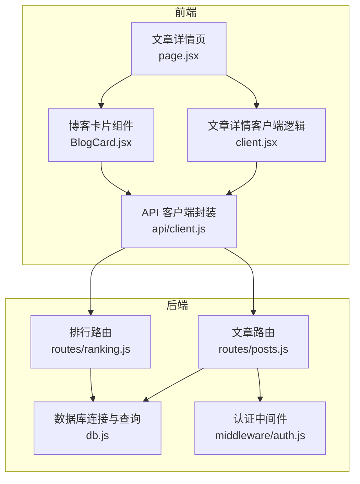
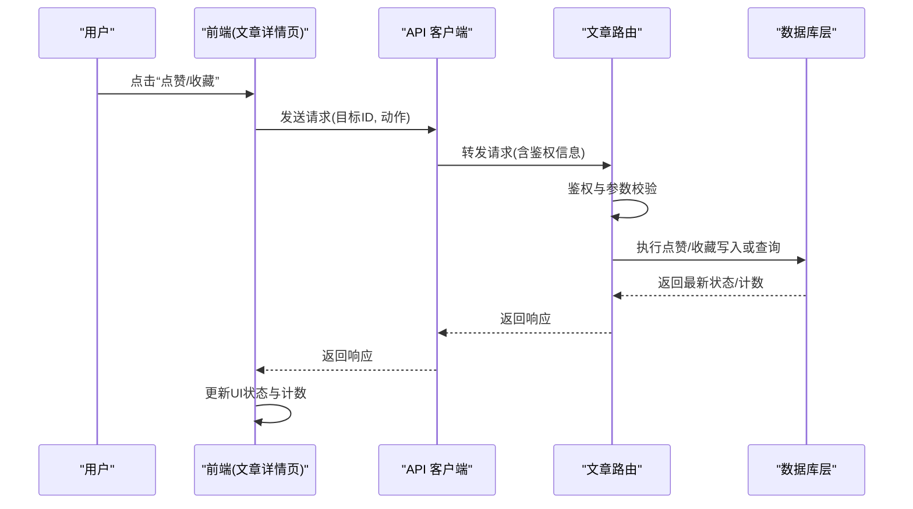
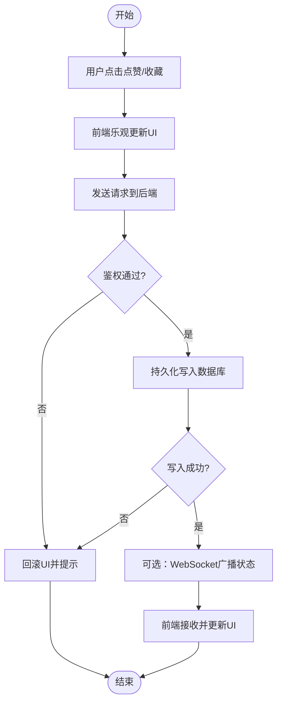
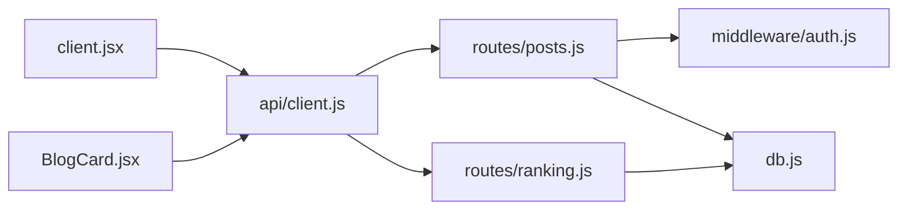

# 点赞收藏系统

<cite>
**本文引用的文件**
- [server/src/routes/posts.js](file://server/src/routes/posts.js)
- [server/src/routes/ranking.js](file://server/src/routes/ranking.js)
- [server/src/db.js](file://server/src/db.js)
- [server/src/middleware/auth.js](file://server/src/middleware/auth.js)
- [src/app/post/[slug]/page.jsx](file://src/app/post/[slug]/page.jsx)
- [src/app/post/[slug]/client.jsx](file://src/app/post/[slug]/client.jsx)
- [src/components/BlogCard/BlogCard.jsx](file://src/components/BlogCard/BlogCard.jsx)
- [src/api/client.js](file://src/api/client.js)
- [API.md](file://API.md)
</cite>

## 目录
1. [简介](#简介)
2. [项目结构](#项目结构)
3. [核心组件](#核心组件)
4. [架构总览](#架构总览)
5. [详细组件分析](#详细组件分析)
6. [依赖分析](#依赖分析)
7. [性能考虑](#性能考虑)
8. [故障排查指南](#故障排查指南)
9. [结论](#结论)
10. [附录](#附录)

## 简介
本文件围绕“点赞与收藏”功能，系统化梳理数据模型、接口与服务端实现、前端交互流程、实时状态同步策略、防刷与限流、统计与排行榜、通知与提醒、导入导出与备份恢复，以及性能优化与用户体验改进建议。文档以仓库现有代码为依据，结合工程实践给出可落地的设计与优化方案。

## 项目结构
本项目采用前后端分离：
- 后端（Node/Express）提供 REST API，使用 SQLite 作为持久化存储，包含文章、问答、用户、排行等路由；认证中间件用于鉴权。
- 前端（Next.js）通过 API 客户端调用后端接口，在文章详情页集成点赞与收藏交互。

图表来源
- [server/src/routes/posts.js](file://server/src/routes/posts.js)
- [server/src/routes/ranking.js](file://server/src/routes/ranking.js)
- [server/src/db.js](file://server/src/db.js)
- [server/src/middleware/auth.js](file://server/src/middleware/auth.js)
- [src/app/post/[slug]/page.jsx](file://src/app/post/[slug]/page.jsx)
- [src/app/post/[slug]/client.jsx](file://src/app/post/[slug]/client.jsx)
- [src/components/BlogCard/BlogCard.jsx](file://src/components/BlogCard/BlogCard.jsx)
- [src/api/client.js](file://src/api/client.js)

章节来源
- [server/src/routes/posts.js](file://server/src/routes/posts.js)
- [server/src/routes/ranking.js](file://server/src/routes/ranking.js)
- [server/src/db.js](file://server/src/db.js)
- [server/src/middleware/auth.js](file://server/src/middleware/auth.js)
- [src/app/post/[slug]/page.jsx](file://src/app/post/[slug]/page.jsx)
- [src/app/post/[slug]/client.jsx](file://src/app/post/[slug]/client.jsx)
- [src/components/BlogCard/BlogCard.jsx](file://src/components/BlogCard/BlogCard.jsx)
- [src/api/client.js](file://src/api/client.js)

## 核心组件
- 文章路由层：提供获取文章详情、点赞、收藏等接口，负责参数校验、权限控制、事务处理与结果返回。
- 排行路由层：聚合点赞数、收藏数等指标，生成各类排行榜。
- 数据库层：封装 SQLite 连接与常用查询，支撑点赞、收藏、计数更新等操作。
- 认证中间件：校验登录态，保护需要鉴权的写操作。
- 前端页面与组件：文章详情页展示点赞/收藏状态与数量，组件内触发交互并刷新 UI。
- API 客户端：统一封装请求、错误处理与重试策略。

章节来源
- [server/src/routes/posts.js](file://server/src/routes/posts.js)
- [server/src/routes/ranking.js](file://server/src/routes/ranking.js)
- [server/src/db.js](file://server/src/db.js)
- [server/src/middleware/auth.js](file://server/src/middleware/auth.js)
- [src/app/post/[slug]/page.jsx](file://src/app/post/[slug]/page.jsx)
- [src/app/post/[slug]/client.jsx](file://src/app/post/[slug]/client.jsx)
- [src/components/BlogCard/BlogCard.jsx](file://src/components/BlogCard/BlogCard.jsx)
- [src/api/client.js](file://src/api/client.js)

## 架构总览
点赞与收藏的整体流程如下：
- 前端在文章详情页发起点赞/收藏请求，携带目标对象标识与必要上下文。
- 后端路由进行鉴权与参数校验，调用数据库层完成状态变更或读取。
- 返回最新状态与计数给前端，前端更新本地 UI。
- 可选扩展：引入 WebSocket 推送以实现多端状态同步与实时通知。

图表来源
- [server/src/routes/posts.js](file://server/src/routes/posts.js)
- [server/src/db.js](file://server/src/db.js)
- [src/app/post/[slug]/page.jsx](file://src/app/post/[slug]/page.jsx)
- [src/app/post/[slug]/client.jsx](file://src/app/post/[slug]/client.jsx)
- [src/components/BlogCard/BlogCard.jsx](file://src/components/BlogCard/BlogCard.jsx)
- [src/api/client.js](file://src/api/client.js)

## 详细组件分析

### 数据模型设计
- 点赞表
  - 字段建议：主键、用户ID、目标类型（如文章）、目标ID、创建时间、更新时间。
  - 约束：用户+目标唯一索引，防止重复点赞。
- 收藏表
  - 字段建议：主键、用户ID、目标类型、目标ID、收藏夹ID、创建时间、更新时间。
  - 约束：用户+目标唯一索引；支持多收藏夹时增加分类维度。
- 用户偏好存储
  - 建议：用户设置表或 JSON 配置，记录是否开启点赞/收藏通知、默认收藏夹、排序偏好等。
- 计数缓存
  - 建议：为高频读场景维护文章级点赞数、收藏数字段，定期或事件驱动更新，避免每次聚合计算。

说明：以上为通用设计建议，具体字段与约束需结合当前数据库 schema 与业务需求落地。

章节来源
- [server/src/db.js](file://server/src/db.js)

### 点赞状态实时更新机制
- 基础方案（HTTP）
  - 前端在点赞/收藏后乐观更新 UI，随后等待服务端确认；失败则回滚。
  - 列表页可通过轮询或增量拉取刷新计数。
- 实时方案（WebSocket）
  - 服务端在点赞/收藏成功后，向相关房间（如文章ID）广播状态变更。
  - 前端建立 WS 连接，订阅文章频道，收到消息后即时更新 UI。
  - 断线重连与幂等处理：对同一动作的多次推送做去重。

图表来源
- [server/src/routes/posts.js](file://server/src/routes/posts.js)
- [server/src/db.js](file://server/src/db.js)
- [src/app/post/[slug]/client.jsx](file://src/app/post/[slug]/client.jsx)
- [src/api/client.js](file://src/api/client.js)

章节来源
- [server/src/routes/posts.js](file://server/src/routes/posts.js)
- [server/src/db.js](file://server/src/db.js)
- [src/app/post/[slug]/client.jsx](file://src/app/post/[slug]/client.jsx)
- [src/api/client.js](file://src/api/client.js)

### 收藏功能实现
- 收藏夹管理
  - 支持创建、编辑、删除收藏夹；收藏条目关联收藏夹ID。
  - 支持默认收藏夹与快速收藏入口。
- 分类组织
  - 基于收藏夹层级或标签体系组织内容，便于检索与批量移动。
- 批量操作
  - 支持多选收藏项进行移动、删除、导出等操作。
  - 前端提供选择模式与批量工具栏，后端提供批量接口。

章节来源
- [server/src/routes/posts.js](file://server/src/routes/posts.js)
- [server/src/db.js](file://server/src/db.js)

### 防刷机制与频率限制
- 鉴权与身份绑定
  - 所有写操作必须经过认证中间件，确保用户身份明确。
- 幂等与去重
  - 利用唯一索引保证同一用户对同一目标的单一状态。
- 速率限制
  - 针对点赞/收藏接口实施短时窗口限流（如每秒/每分钟次数上限）。
  - 结合 IP、用户ID、设备指纹等多维度风控。
- 验证码与二次确认
  - 对异常行为触发验证码或二次确认，降低自动化攻击风险。

章节来源
- [server/src/middleware/auth.js](file://server/src/middleware/auth.js)
- [server/src/routes/posts.js](file://server/src/routes/posts.js)

### 统计分析与排行榜算法
- 指标定义
  - 点赞数、收藏数、净互动量（点赞减取消）、近期活跃度（按时间窗加权）。
- 排行榜维度
  - 日榜、周榜、月榜、全站榜；可按类型（文章/问答）拆分。
- 算法要点
  - 滑动窗口聚合，避免全表扫描。
  - 权重衰减（时间越近权重越高），抑制历史堆积。
  - 冷启动保护（新内容短期加权）。
- 实现路径
  - 后台定时任务或事件驱动更新排行榜缓存表。
  - 前端分页加载排行榜数据。

章节来源
- [server/src/routes/ranking.js](file://server/src/routes/ranking.js)
- [server/src/db.js](file://server/src/db.js)

### 通知系统与用户提醒
- 触发条件
  - 被收藏、被点赞、评论回复、管理员反馈等。
- 渠道
  - 站内信、邮件、浏览器通知（可选）。
- 策略
  - 合并与降噪：短时间内的同类通知合并。
  - 用户偏好：允许关闭某类通知或设置免打扰时段。
- 实时性
  - 结合 WebSocket 推送，提升到达时效。

章节来源
- [server/src/routes/posts.js](file://server/src/routes/posts.js)
- [server/src/routes/ranking.js](file://server/src/routes/ranking.js)

### 导入导出与备份恢复
- 导出
  - 支持将用户的收藏列表导出为结构化文件（CSV/JSON），包含标题、链接、收藏时间、收藏夹等信息。
- 导入
  - 支持从外部源导入收藏，自动去重与冲突处理（保留最新或提示用户）。
- 备份恢复
  - 定期备份点赞/收藏数据；恢复时校验完整性与一致性。
- 隐私与安全
  - 导出文件加密传输与访问控制；敏感信息脱敏。

章节来源
- [server/src/routes/posts.js](file://server/src/routes/posts.js)
- [server/src/db.js](file://server/src/db.js)

### 性能优化与用户体验改进
- 前端
  - 乐观更新与错误回滚，减少感知延迟。
  - 列表虚拟滚动与分页加载，避免一次性渲染大量数据。
  - 图片与资源懒加载，首屏优化。
- 后端
  - 热点数据缓存（Redis/内存），降低数据库压力。
  - 读写分离与分库分表（规模增长后）。
  - 批量接口与异步任务，提高吞吐。
- 网络
  - 压缩与缓存头优化，CDN 加速静态资源。
- 体验
  - 微动效与即时反馈，提升交互愉悦感。
  - 无障碍与国际化支持。

章节来源
- [src/app/post/[slug]/client.jsx](file://src/app/post/[slug]/client.jsx)
- [src/components/BlogCard/BlogCard.jsx](file://src/components/BlogCard/BlogCard.jsx)
- [server/src/routes/posts.js](file://server/src/routes/posts.js)

## 依赖分析
- 模块耦合
  - 文章路由依赖认证中间件与数据库层；排行路由依赖数据库层。
  - 前端页面与组件依赖 API 客户端，间接依赖后端路由。
- 外部依赖
  - SQLite 作为轻量级数据库，适合中小规模场景。
  - Next.js 提供 SSR/CSR 能力，利于 SEO 与交互体验平衡。

图表来源
- [src/app/post/[slug]/client.jsx](file://src/app/post/[slug]/client.jsx)
- [src/components/BlogCard/BlogCard.jsx](file://src/components/BlogCard/BlogCard.jsx)
- [src/api/client.js](file://src/api/client.js)
- [server/src/routes/posts.js](file://server/src/routes/posts.js)
- [server/src/routes/ranking.js](file://server/src/routes/ranking.js)
- [server/src/middleware/auth.js](file://server/src/middleware/auth.js)
- [server/src/db.js](file://server/src/db.js)

章节来源
- [src/app/post/[slug]/client.jsx](file://src/app/post/[slug]/client.jsx)
- [src/components/BlogCard/BlogCard.jsx](file://src/components/BlogCard/BlogCard.jsx)
- [src/api/client.js](file://src/api/client.js)
- [server/src/routes/posts.js](file://server/src/routes/posts.js)
- [server/src/routes/ranking.js](file://server/src/routes/ranking.js)
- [server/src/middleware/auth.js](file://server/src/middleware/auth.js)
- [server/src/db.js](file://server/src/db.js)

## 性能考虑
- 热点优化
  - 对热门文章点赞/收藏计数采用缓存层，定时或事件驱动回写数据库。
- 批量与异步
  - 批量收藏/移动操作使用队列异步处理，避免阻塞主线程。
- 数据库
  - 合理索引（用户ID、目标ID、时间戳），避免全表扫描。
  - 分区与归档：历史数据归档至冷存储，提升热数据查询效率。
- 前端
  - 组件级缓存与状态复用，减少重复请求。
  - 骨架屏与占位图，提升感知性能。

[本节为通用指导，不直接分析具体文件]

## 故障排查指南
- 常见问题
  - 鉴权失败：检查登录态与中间件配置。
  - 重复点赞/收藏：检查唯一索引与幂等逻辑。
  - 计数不一致：核对缓存与数据库一致性，必要时触发补偿任务。
  - 实时推送失败：检查 WebSocket 连接状态与房间订阅。
- 日志与监控
  - 关键接口打点与错误码规范。
  - 告警阈值：错误率、延迟、限流触发次数。
- 定位步骤
  - 复现路径 → 查看请求链路 → 检查数据库状态 → 验证缓存与推送。

章节来源
- [server/src/middleware/auth.js](file://server/src/middleware/auth.js)
- [server/src/routes/posts.js](file://server/src/routes/posts.js)
- [server/src/db.js](file://server/src/db.js)

## 结论
点赞与收藏系统是提升用户参与度的重要能力。通过清晰的数据模型、稳健的后端实现、友好的前端交互与可扩展的实时与统计能力，可在保障安全与性能的前提下，持续优化用户体验。建议在规模化阶段引入缓存与异步化改造，并结合数据分析驱动产品迭代。

[本节为总结性内容，不直接分析具体文件]

## 附录
- 接口参考
  - 详见 API 文档中关于文章、收藏、排行的接口定义与示例。

章节来源
- [API.md](file://API.md)