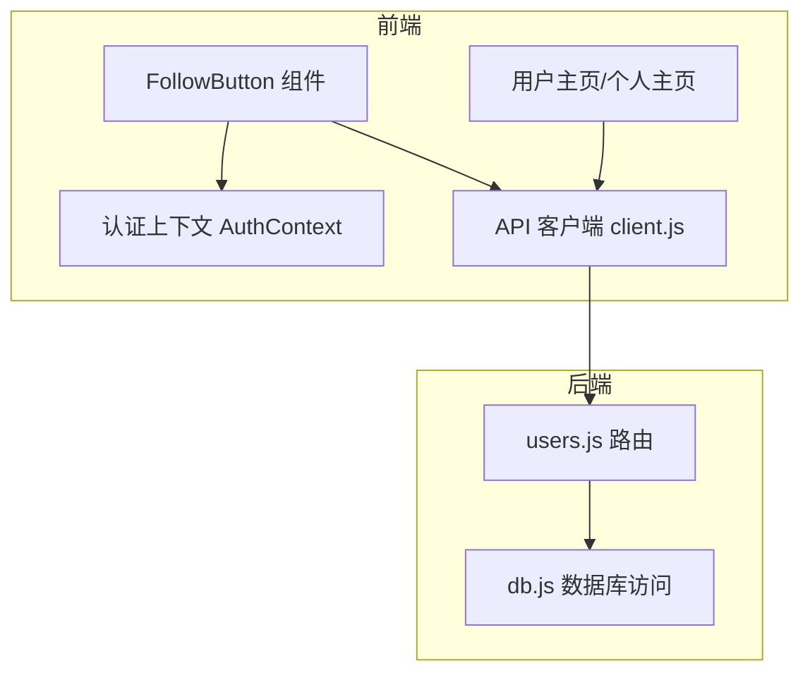
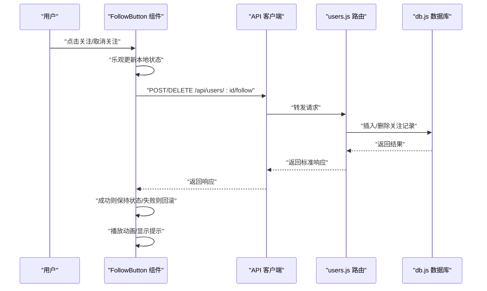
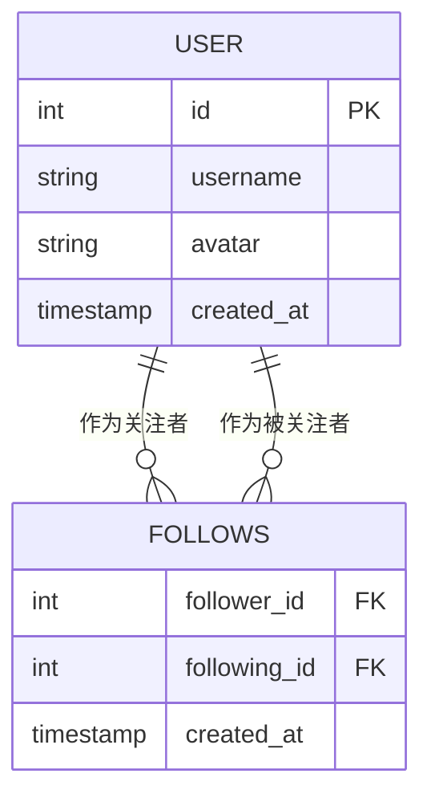
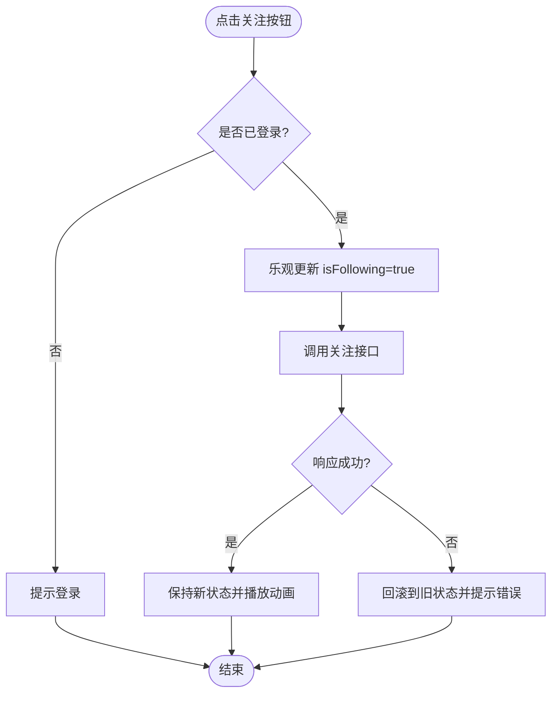
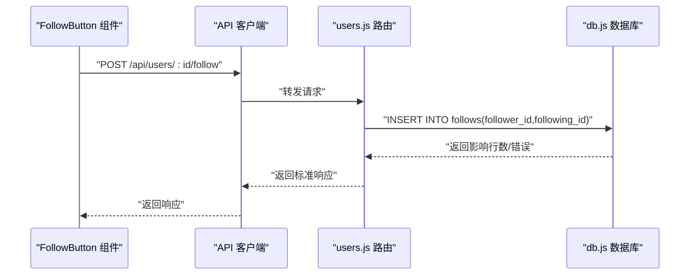
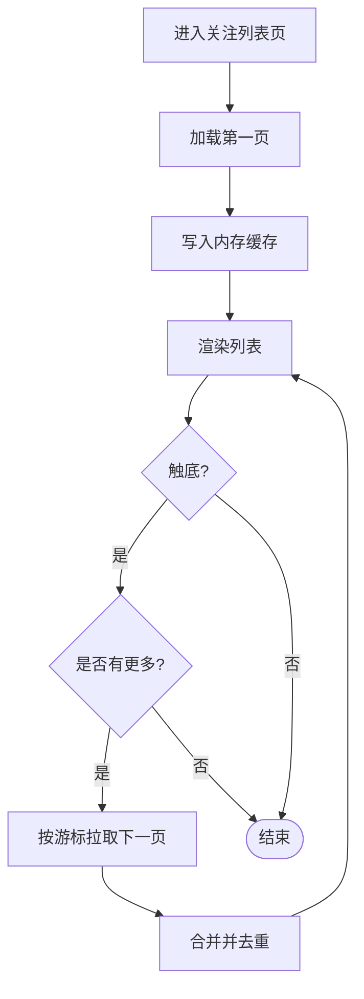
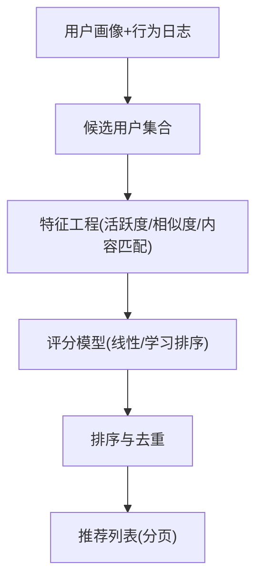
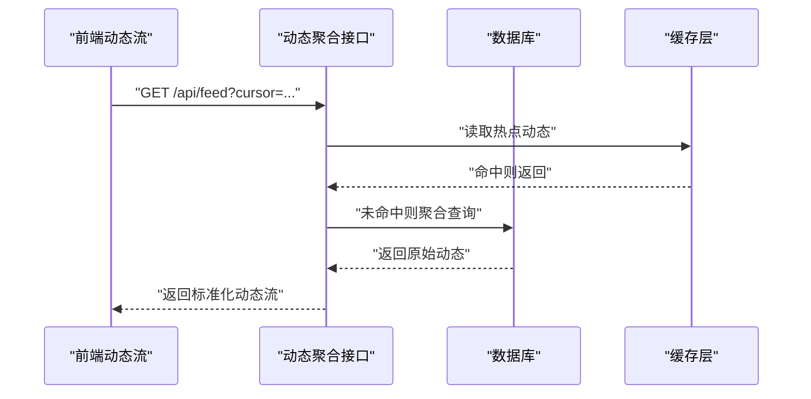
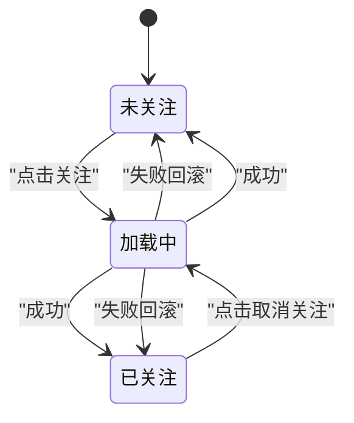
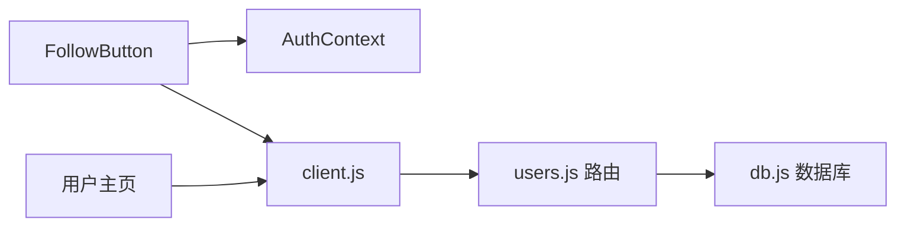

# 用户关注系统

<cite>
**本文引用的文件**   
- [server/src/routes/users.js](file://server/src/routes/users.js)
- [server/src/db.js](file://server/src/db.js)
- [src/components/FollowButton/followbutton.jsx](file://src/components/FollowButton/followbutton.jsx)
- [src/components/FollowButton/FollowButton.module.css](file://src/components/FollowButton/FollowButton.module.css)
- [src/api/client.js](file://src/api/client.js)
- [src/app/u/[username]/page.jsx](file://src/app/u/[username]/page.jsx)
- [src/app/u/[username]/profile/page.jsx](file://src/app/u/[username]/profile/page.jsx)
- [src/context/AuthContext.tsx](file://src/context/AuthContext.tsx)
</cite>

## 目录
1. [简介](#简介)
2. [项目结构](#项目结构)
3. [核心组件](#核心组件)
4. [架构总览](#架构总览)
5. [详细组件分析](#详细组件分析)
6. [依赖关系分析](#依赖关系分析)
7. [性能考虑](#性能考虑)
8. [故障排查指南](#故障排查指南)
9. [结论](#结论)
10. [附录](#附录)

## 简介
本文件围绕“用户关注系统”进行系统化文档化，覆盖数据模型、前后端交互、状态管理、动画与交互反馈、分页加载、推荐与发现机制、动态流聚合、同步与一致性保障，以及扩展点与自定义配置。目标是帮助开发者快速理解并高效扩展该功能。

## 项目结构
关注系统涉及前端组件、API 客户端、后端路由与数据库访问层：
- 前端
  - 关注按钮组件：负责展示当前关注状态、处理点击事件、触发 API 调用、更新本地状态与动画反馈。
  - 用户主页/个人主页：承载关注列表、粉丝列表、互相关注标识等展示逻辑。
  - 认证上下文：提供登录态与用户信息，驱动关注按钮的初始状态与权限控制。
- 后端
  - 用户路由：提供关注/取消关注/查询关注关系等接口。
  - 数据库访问：封装 SQL 操作，执行关注关系的增删改查。

图表来源
- [src/components/FollowButton/followbutton.jsx](file://src/components/FollowButton/followbutton.jsx)
- [src/api/client.js](file://src/api/client.js)
- [src/app/u/[username]/page.jsx](file://src/app/u/[username]/page.jsx)
- [src/context/AuthContext.tsx](file://src/context/AuthContext.tsx)
- [server/src/routes/users.js](file://server/src/routes/users.js)
- [server/src/db.js](file://server/src/db.js)

章节来源
- [src/components/FollowButton/followbutton.jsx](file://src/components/FollowButton/followbutton.jsx)
- [src/api/client.js](file://src/api/client.js)
- [src/app/u/[username]/page.jsx](file://src/app/u/[username]/page.jsx)
- [src/context/AuthContext.tsx](file://src/context/AuthContext.tsx)
- [server/src/routes/users.js](file://server/src/routes/users.js)
- [server/src/db.js](file://server/src/db.js)

## 核心组件
- 关注按钮组件（FollowButton）
  - 职责：渲染关注/已关注状态；处理点击；发起关注/取消关注请求；根据响应更新 UI 与动画。
  - 关键能力：本地乐观更新、错误回滚、加载态提示、无障碍标签。
- 用户主页/个人主页
  - 职责：拉取并展示关注列表、粉丝列表、互相关注标记；支持分页加载与无限滚动。
- 认证上下文（AuthContext）
  - 职责：维护登录态、当前用户信息；为关注按钮提供初始状态与鉴权判断。
- API 客户端（client.js）
  - 职责：统一封装 HTTP 请求、错误处理、重试策略、拦截器（如鉴权头）。
- 后端路由（users.js）
  - 职责：暴露关注/取消关注/查询关注关系等 REST 接口；校验参数与权限；返回标准响应。
- 数据库访问（db.js）
  - 职责：封装 SQL 语句，执行关注表、粉丝表的增删改查；必要时使用事务保证一致性。

章节来源
- [src/components/FollowButton/followbutton.jsx](file://src/components/FollowButton/followbutton.jsx)
- [src/components/FollowButton/FollowButton.module.css](file://src/components/FollowButton/FollowButton.module.css)
- [src/app/u/[username]/page.jsx](file://src/app/u/[username]/page.jsx)
- [src/app/u/[username]/profile/page.jsx](file://src/app/u/[username]/profile/page.jsx)
- [src/context/AuthContext.tsx](file://src/context/AuthContext.tsx)
- [src/api/client.js](file://src/api/client.js)
- [server/src/routes/users.js](file://server/src/routes/users.js)
- [server/src/db.js](file://server/src/db.js)

## 架构总览
关注系统的端到端流程如下：用户在页面点击关注按钮，组件通过 API 客户端向后端发起请求；后端路由校验权限后调用数据库层完成关注关系变更；前端收到响应后更新本地状态与 UI，并触发动画反馈。

图表来源
- [src/components/FollowButton/followbutton.jsx](file://src/components/FollowButton/followbutton.jsx)
- [src/api/client.js](file://src/api/client.js)
- [server/src/routes/users.js](file://server/src/routes/users.js)
- [server/src/db.js](file://server/src/db.js)

## 详细组件分析

### 数据模型与关系设计
- 关注表（follows）
  - 字段建议：follower_id（关注者）、following_id（被关注者）、created_at（创建时间）、updated_at（更新时间）。
  - 约束：唯一索引 (follower_id, following_id)，防止重复关注。
- 粉丝表（followers）
  - 说明：通常与关注表互为镜像视图，可通过 SQL JOIN 或物化视图实现；也可仅用关注表反向查询得到粉丝列表。
- 互相关注逻辑
  - 判定：当 A 关注 B 且 B 也关注 A 时，视为互相关注。
  - 查询优化：对 follower_id 与 following_id 建立索引，提升双向查询效率。

图表来源
- [server/src/db.js](file://server/src/db.js)

章节来源
- [server/src/db.js](file://server/src/db.js)

### 关注按钮组件（FollowButton）
- 状态管理
  - 本地状态：isFollowing（是否已关注）、isLoading（加载中）、error（错误信息）。
  - 初始状态：从认证上下文获取当前用户与被关注用户的关系，或先乐观默认未关注再异步确认。
- 交互反馈
  - 点击后立即进入 loading 态，成功后切换文案与图标；失败时回滚状态并提示错误。
  - 动画：CSS 过渡与关键帧用于缩放、颜色变化、微动效。
- 可访问性
  - aria-label 随状态变化；键盘可聚焦与回车触发。
- 错误处理
  - 网络异常、服务端错误均捕获并回滚；提供重试入口。

图表来源
- [src/components/FollowButton/followbutton.jsx](file://src/components/FollowButton/followbutton.jsx)
- [src/components/FollowButton/FollowButton.module.css](file://src/components/FollowButton/FollowButton.module.css)
- [src/context/AuthContext.tsx](file://src/context/AuthContext.tsx)

章节来源
- [src/components/FollowButton/followbutton.jsx](file://src/components/FollowButton/followbutton.jsx)
- [src/components/FollowButton/FollowButton.module.css](file://src/components/FollowButton/FollowButton.module.css)
- [src/context/AuthContext.tsx](file://src/context/AuthContext.tsx)

### 关注关系增删改查与批量操作
- 新增关注
  - 接口：POST /api/users/:id/follow
  - 行为：插入关注记录；若存在唯一冲突则返回幂等成功或冲突码。
- 取消关注
  - 接口：DELETE /api/users/:id/follow
  - 行为：删除对应关注记录。
- 查询关注关系
  - 接口：GET /api/users/:id/following（我关注的）
  - 接口：GET /api/users/:id/followers（我的粉丝）
  - 接口：GET /api/users/:id/mutual（与我互相关注的用户）
- 批量操作
  - 接口：POST /api/users/batch-follow
  - 行为：在事务中批量插入关注记录；任一失败整体回滚。
- 事务处理
  - 在 db.js 中封装事务方法，确保批量操作的原子性与一致性。

图表来源
- [src/components/FollowButton/followbutton.jsx](file://src/components/FollowButton/followbutton.jsx)
- [src/api/client.js](file://src/api/client.js)
- [server/src/routes/users.js](file://server/src/routes/users.js)
- [server/src/db.js](file://server/src/db.js)

章节来源
- [server/src/routes/users.js](file://server/src/routes/users.js)
- [server/src/db.js](file://server/src/db.js)

### 关注列表分页加载与性能优化
- 分页策略
  - 游标分页：基于 created_at 或自增 ID 的游标，避免深翻页性能问题。
  - 页大小限制：默认 20，最大不超过 100。
- 预取与缓存
  - 首次加载预取下一页数据；浏览器缓存与内存缓存结合。
- 去重与增量更新
  - 关注/取消关注后局部更新列表项，避免整页刷新。
- 懒加载与虚拟列表
  - 长列表采用虚拟滚动减少 DOM 节点数量。

图表来源
- [src/app/u/[username]/page.jsx](file://src/app/u/[username]/page.jsx)
- [src/app/u/[username]/profile/page.jsx](file://src/app/u/[username]/profile/page.jsx)
- [src/api/client.js](file://src/api/client.js)

章节来源
- [src/app/u/[username]/page.jsx](file://src/app/u/[username]/page.jsx)
- [src/app/u/[username]/profile/page.jsx](file://src/app/u/[username]/profile/page.jsx)
- [src/api/client.js](file://src/api/client.js)

### 关注推荐算法与用户发现机制
- 冷启动策略
  - 热门用户、全站活跃用户、同领域作者推荐。
- 协同过滤
  - 基于共同关注人群相似度，推荐“你可能认识的人”。
- 内容相关性
  - 根据用户浏览/点赞/收藏的文章主题，推荐相似作者。
- 实时性
  - 近 7 天活跃权重更高；新用户加权曝光。
- 实现要点
  - 离线计算 + 在线排序：离线生成候选集，在线打分排序。
  - 缓存热点推荐结果，降低数据库压力。

[本节为概念性方案，不直接映射具体源码文件]

### 关注动态流的聚合与展示
- 聚合规则
  - 以“我关注的人”的动态为主，合并点赞、评论、发布文章等行为。
  - 去重与折叠：同一用户的短时间密集动作折叠展示。
- 排序策略
  - 时间倒序 + 权重（互动量、作者权重）。
- 展示逻辑
  - 卡片式布局，包含作者头像、昵称、动作类型、摘要、时间戳。
  - 支持按类型筛选（关注、点赞、评论、发布）。

[本节为概念性方案，不直接映射具体源码文件]

### 同步机制与数据一致性
- 乐观更新与回滚
  - 前端先乐观更新状态，失败时回滚并提示。
- 幂等性
  - 关注接口具备幂等性，重复提交不会导致重复关注。
- 事务与锁
  - 批量操作使用事务；高并发场景下对关注表加行级锁或唯一约束冲突处理。
- 最终一致性
  - 关注关系变更后，动态流与推荐缓存失效或延迟刷新，保证最终一致。

[本节为通用一致性策略说明，不直接映射具体源码文件]

### 扩展点与自定义配置
- 前端
  - FollowButton 样式与动画：通过 CSS 变量与模块样式文件定制。
  - 认证上下文：注入自定义用户信息与权限判断。
  - 分页策略：可替换为无限滚动或固定分页。
- 后端
  - 路由扩展：新增关注分组、黑名单、关注等级等。
  - 数据库：增加关注原因、来源渠道、权重字段。
  - 中间件：统一鉴权、限流、审计日志。
- 配置项
  - 默认页大小、最大页大小、推荐权重、缓存过期时间等。

章节来源
- [src/components/FollowButton/FollowButton.module.css](file://src/components/FollowButton/FollowButton.module.css)
- [src/context/AuthContext.tsx](file://src/context/AuthContext.tsx)
- [server/src/routes/users.js](file://server/src/routes/users.js)
- [server/src/db.js](file://server/src/db.js)

## 依赖关系分析
- 组件耦合
  - FollowButton 依赖认证上下文与 API 客户端；用户主页依赖 API 客户端与分页逻辑。
- 外部依赖
  - 数据库访问层对外暴露 SQL 操作；HTTP 客户端统一处理鉴权与错误。
- 潜在循环依赖
  - 前端组件不应直接依赖后端，需通过 API 客户端解耦。

图表来源
- [src/components/FollowButton/followbutton.jsx](file://src/components/FollowButton/followbutton.jsx)
- [src/context/AuthContext.tsx](file://src/context/AuthContext.tsx)
- [src/api/client.js](file://src/api/client.js)
- [server/src/routes/users.js](file://server/src/routes/users.js)
- [server/src/db.js](file://server/src/db.js)

章节来源
- [src/components/FollowButton/followbutton.jsx](file://src/components/FollowButton/followbutton.jsx)
- [src/context/AuthContext.tsx](file://src/context/AuthContext.tsx)
- [src/api/client.js](file://src/api/client.js)
- [server/src/routes/users.js](file://server/src/routes/users.js)
- [server/src/db.js](file://server/src/db.js)

## 性能考虑
- 数据库
  - 为 follower_id、following_id 建立复合索引；关注表按 created_at 分区或归档历史数据。
- 缓存
  - 关注关系查询走 Redis 缓存；动态流热点数据缓存。
- 前端
  - 虚拟列表、图片懒加载、骨架屏；防抖/节流避免重复请求。
- 后端
  - 连接池、读写分离、慢查询监控；批量接口使用事务与批处理。

[本节为通用性能建议，不直接映射具体源码文件]

## 故障排查指南
- 常见问题
  - 关注状态不同步：检查前端乐观更新与回滚逻辑；核对后端幂等与唯一约束。
  - 分页错乱：确认游标传递正确、去重逻辑有效。
  - 推荐不准确：检查特征工程与评分模型权重；验证缓存失效策略。
- 定位步骤
  - 查看浏览器网络面板请求与响应；检查后端日志与数据库慢查询。
  - 复现路径：登录态、目标用户、操作序列。
- 恢复策略
  - 清理缓存并重试；回滚异常事务；降级到非缓存查询。

章节来源
- [src/components/FollowButton/followbutton.jsx](file://src/components/FollowButton/followbutton.jsx)
- [src/api/client.js](file://src/api/client.js)
- [server/src/routes/users.js](file://server/src/routes/users.js)
- [server/src/db.js](file://server/src/db.js)

## 结论
本方案从数据模型、前后端交互、状态管理与动画、分页与性能、推荐与发现、动态流聚合、一致性与扩展性等方面全面阐述了用户关注系统的设计与实现要点。建议在落地过程中优先完善幂等与事务、索引与缓存、前端乐观更新与回滚，逐步引入推荐与动态流聚合以提升用户体验。

## 附录
- 术语
  - 关注：A 订阅 B 的动态与内容。
  - 粉丝：B 的订阅者集合。
  - 互相关注：A 关注 B 且 B 关注 A。
- 参考实现位置
  - 前端组件与样式：FollowButton 及其模块样式。
  - 用户主页与个人主页：关注列表与粉丝列表展示。
  - 认证上下文：登录态与用户信息。
  - API 客户端：统一请求封装。
  - 后端路由与数据库：关注关系 CRUD 与事务。