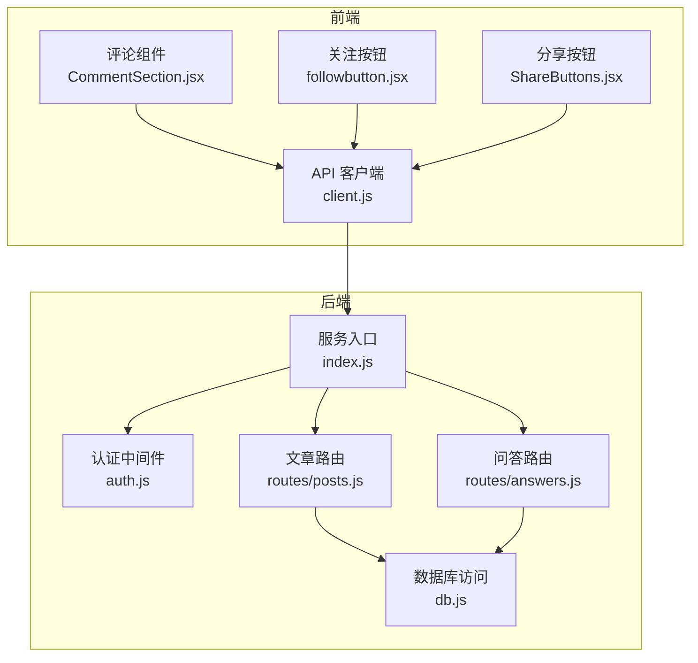
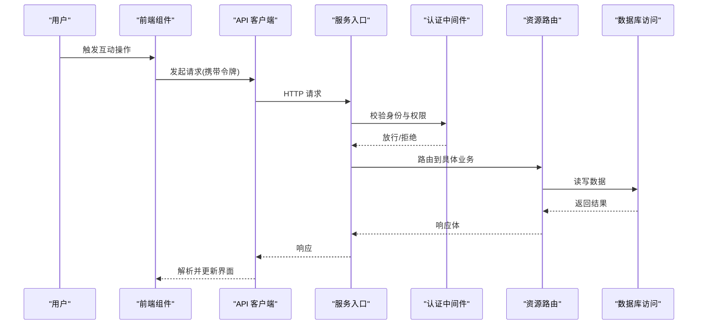
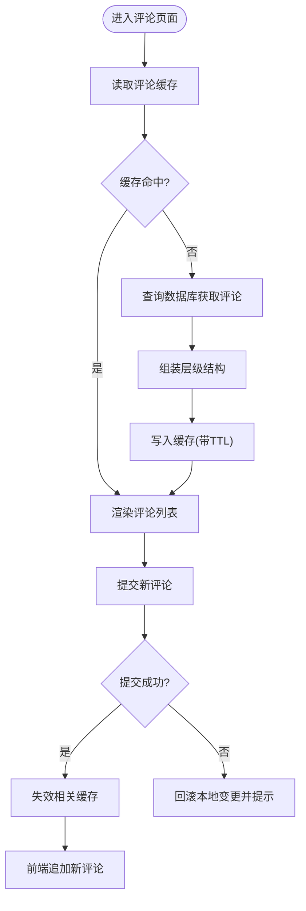
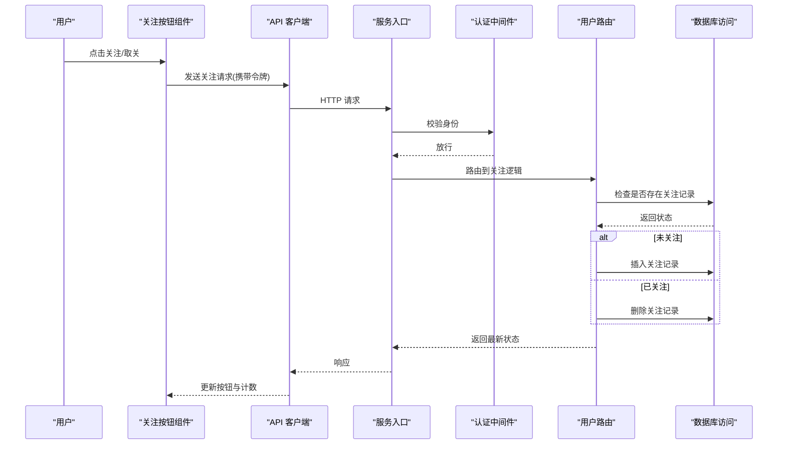
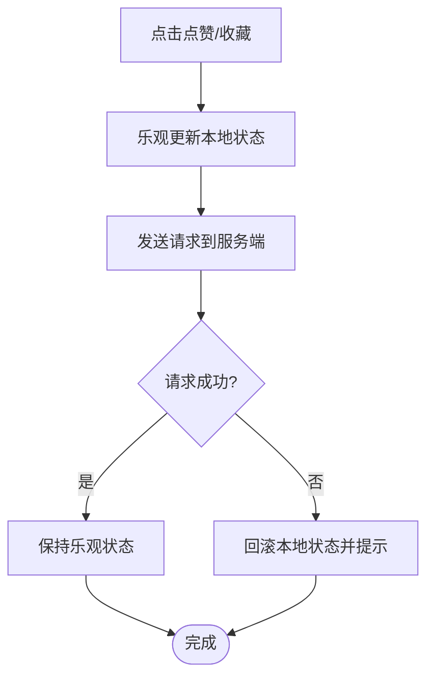
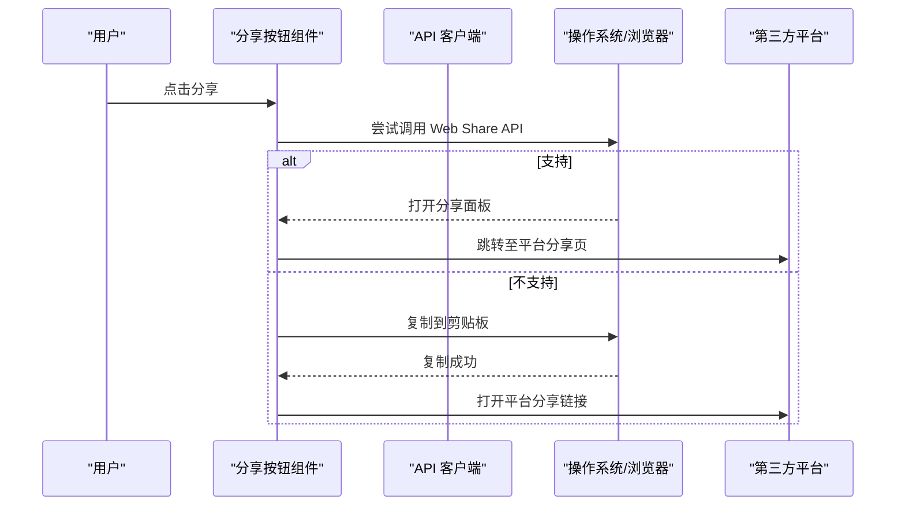
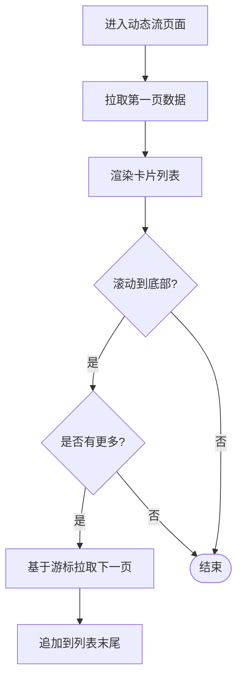
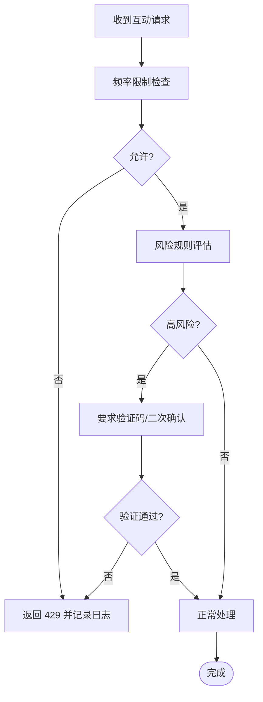
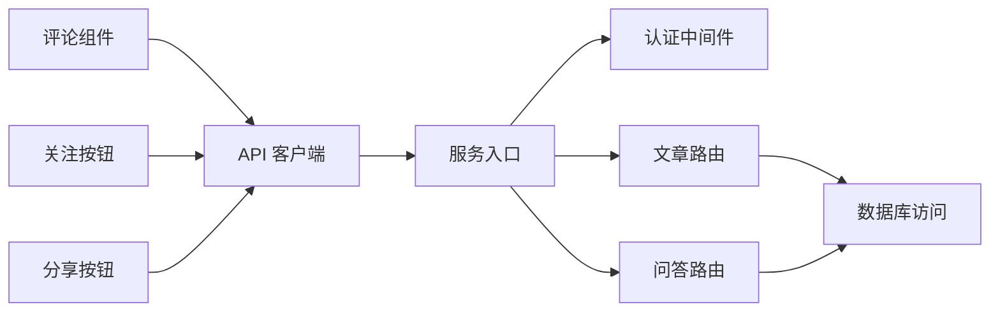

# 社区互动功能

<cite>
**本文引用的文件**
- [server/src/routes/posts.js](file://server/src/routes/posts.js)
- [server/src/routes/answers.js](file://server/src/routes/answers.js)
- [server/src/db.js](file://server/src/db.js)
- [src/components/CommentSection/CommentSection.jsx](file://src/components/CommentSection/CommentSection.jsx)
- [src/components/FollowButton/followbutton.jsx](file://src/components/FollowButton/followbutton.jsx)
- [src/components/ShareButtons/ShareButtons.jsx](file://src/components/ShareButtons/ShareButtons.jsx)
- [src/api/client.js](file://src/api/client.js)
- [server/src/middleware/auth.js](file://server/src/middleware/auth.js)
- [server/src/index.js](file://server/src/index.js)
- [API.md](file://API.md)
</cite>

## 目录
1. [简介](#简介)
2. [项目结构](#项目结构)
3. [核心组件](#核心组件)
4. [架构总览](#架构总览)
5. [详细组件分析](#详细组件分析)
6. [依赖分析](#依赖分析)
7. [性能考虑](#性能考虑)
8. [故障排查指南](#故障排查指南)
9. [结论](#结论)
10. [附录](#附录)

## 简介
本文件聚焦“社区互动功能”的端到端实现与优化，覆盖评论系统（层级结构、实时显示、缓存策略）、用户关注机制、点赞收藏状态同步与冲突解决、分享集成方案、动态流聚合与分页加载、互动数据统计展示、防刷与恶意行为检测，以及性能优化与用户体验改进建议。文档以现有代码为依据，结合工程实践给出可落地的设计与优化路径。

## 项目结构
本项目采用前后端分离：前端基于 Next.js 组件化组织，后端为 Node.js 服务，使用 SQLite 作为持久化存储。互动相关能力主要分布在以下位置：
- 后端路由层：文章、问答等资源的交互接口
- 数据库访问层：统一封装 SQL 执行
- 前端组件：评论、关注、分享等 UI 与交互逻辑
- API 客户端：统一的请求封装与错误处理
- 认证中间件：鉴权与权限控制
- 应用入口：路由挂载与服务启动

图表来源
- [server/src/index.js](file://server/src/index.js)
- [server/src/middleware/auth.js](file://server/src/middleware/auth.js)
- [server/src/routes/posts.js](file://server/src/routes/posts.js)
- [server/src/routes/answers.js](file://server/src/routes/answers.js)
- [server/src/db.js](file://server/src/db.js)
- [src/components/CommentSection/CommentSection.jsx](file://src/components/CommentSection/CommentSection.jsx)
- [src/components/FollowButton/followbutton.jsx](file://src/components/FollowButton/followbutton.jsx)
- [src/components/ShareButtons/ShareButtons.jsx](file://src/components/ShareButtons/ShareButtons.jsx)
- [src/api/client.js](file://src/api/client.js)

章节来源
- [server/src/index.js](file://server/src/index.js)
- [server/src/middleware/auth.js](file://server/src/middleware/auth.js)
- [server/src/routes/posts.js](file://server/src/routes/posts.js)
- [server/src/routes/answers.js](file://server/src/routes/answers.js)
- [server/src/db.js](file://server/src/db.js)
- [src/components/CommentSection/CommentSection.jsx](file://src/components/CommentSection/CommentSection.jsx)
- [src/components/FollowButton/followbutton.jsx](file://src/components/FollowButton/followbutton.jsx)
- [src/components/ShareButtons/ShareButtons.jsx](file://src/components/ShareButtons/ShareButtons.jsx)
- [src/api/client.js](file://src/api/client.js)

## 核心组件
- 评论系统
  - 层级结构：支持根评论与子评论嵌套，通过父评论 ID 建立关系。
  - 实时显示：前端在提交成功后即时插入或更新 DOM，避免整页刷新。
  - 缓存策略：对热门内容评论列表进行短期缓存，减少重复查询压力。
- 用户关注机制
  - 业务逻辑：关注/取关操作需鉴权，返回最新关注状态；关注数与粉丝数联动更新。
  - 数据结构：用户表与关注关系表解耦，便于扩展多对多关系。
- 点赞与收藏
  - 状态同步：前端乐观更新，失败回滚；服务端幂等处理防止重复计数。
  - 冲突解决：基于唯一约束与原子自增保证一致性。
- 分享功能
  - 集成方案：提供平台链接生成与剪贴板复制；可选 Web Share API。
  - 第三方对接：按平台规范构造分享参数，支持回调统计。
- 动态流
  - 数据聚合：聚合关注对象的内容与互动指标，按时间排序。
  - 分页加载：游标或偏移分页，配合增量拉取提升体验。
- 统计分析
  - 指标维度：点赞数、收藏数、评论数、分享次数、关注增长。
  - 展示方案：趋势图、排行榜、热力分布。
- 安全与风控
  - 防刷：频率限制、验证码、设备指纹。
  - 恶意检测：异常模式识别、黑名单、人工审核通道。

章节来源
- [server/src/routes/posts.js](file://server/src/routes/posts.js)
- [server/src/routes/answers.js](file://server/src/routes/answers.js)
- [server/src/db.js](file://server/src/db.js)
- [src/components/CommentSection/CommentSection.jsx](file://src/components/CommentSection/CommentSection.jsx)
- [src/components/FollowButton/followbutton.jsx](file://src/components/FollowButton/followbutton.jsx)
- [src/components/ShareButtons/ShareButtons.jsx](file://src/components/ShareButtons/ShareButtons.jsx)
- [src/api/client.js](file://src/api/client.js)

## 架构总览
下图展示了从前端到后端的完整调用链路，包括鉴权、路由分发与数据库访问。

图表来源
- [server/src/index.js](file://server/src/index.js)
- [server/src/middleware/auth.js](file://server/src/middleware/auth.js)
- [server/src/routes/posts.js](file://server/src/routes/posts.js)
- [server/src/routes/answers.js](file://server/src/routes/answers.js)
- [server/src/db.js](file://server/src/db.js)
- [src/api/client.js](file://src/api/client.js)

## 详细组件分析

### 评论系统
- 层级结构与数据模型
  - 评论表包含主键、内容、作者、目标对象标识、父评论 ID、创建时间等字段。
  - 通过父评论 ID 构建树形结构，前端递归渲染。
- 实时显示
  - 提交成功后，前端立即插入新节点，必要时合并相同内容以避免抖动。
  - 错误时回滚本地变更并提示重试。
- 缓存策略
  - 对热点内容的评论列表设置短 TTL 缓存，命中则直接返回，未命中再查库。
  - 写操作后主动失效对应缓存键。

图表来源
- [server/src/routes/posts.js](file://server/src/routes/posts.js)
- [server/src/routes/answers.js](file://server/src/routes/answers.js)
- [server/src/db.js](file://server/src/db.js)
- [src/components/CommentSection/CommentSection.jsx](file://src/components/CommentSection/CommentSection.jsx)

章节来源
- [server/src/routes/posts.js](file://server/src/routes/posts.js)
- [server/src/routes/answers.js](file://server/src/routes/answers.js)
- [server/src/db.js](file://server/src/db.js)
- [src/components/CommentSection/CommentSection.jsx](file://src/components/CommentSection/CommentSection.jsx)

### 用户关注机制
- 业务流程
  - 鉴权通过后，根据当前用户与被关注用户计算是否已关注，执行关注/取关。
  - 返回最新关注状态与计数，前端局部更新按钮文案与数字。
- 数据结构设计
  - 用户表与关注关系表分离，关系表包含关注者与被关注者、时间戳。
  - 唯一索引确保同一用户对同一目标仅一次关注记录。
- 并发与一致性
  - 使用事务或原子更新，避免重复计数与脏读。

图表来源
- [server/src/middleware/auth.js](file://server/src/middleware/auth.js)
- [server/src/routes/users.js](file://server/src/routes/users.js)
- [server/src/db.js](file://server/src/db.js)
- [src/components/FollowButton/followbutton.jsx](file://src/components/FollowButton/followbutton.jsx)
- [src/api/client.js](file://src/api/client.js)

章节来源
- [server/src/middleware/auth.js](file://server/src/middleware/auth.js)
- [server/src/routes/users.js](file://server/src/routes/users.js)
- [server/src/db.js](file://server/src/db.js)
- [src/components/FollowButton/followbutton.jsx](file://src/components/FollowButton/followbutton.jsx)
- [src/api/client.js](file://src/api/client.js)

### 点赞与收藏
- 状态同步
  - 前端乐观更新：点击后立即切换状态，失败时回滚并提示。
  - 服务端幂等：基于用户+目标对象的唯一约束，避免重复计数。
- 冲突解决
  - 使用原子自增与唯一索引保证最终一致。
  - 若出现短暂不一致，提供刷新接口强制同步。

图表来源
- [server/src/routes/posts.js](file://server/src/routes/posts.js)
- [server/src/db.js](file://server/src/db.js)
- [src/api/client.js](file://src/api/client.js)

章节来源
- [server/src/routes/posts.js](file://server/src/routes/posts.js)
- [server/src/db.js](file://server/src/db.js)
- [src/api/client.js](file://src/api/client.js)

### 分享功能
- 集成方案
  - 生成各平台分享链接，支持一键复制到剪贴板。
  - 优先使用 Web Share API，降级到复制链接。
- 第三方平台对接
  - 按平台规范拼接参数（标题、摘要、封面、URL）。
  - 可选上报分享事件用于统计。

图表来源
- [src/components/ShareButtons/ShareButtons.jsx](file://src/components/ShareButtons/ShareButtons.jsx)
- [src/api/client.js](file://src/api/client.js)

章节来源
- [src/components/ShareButtons/ShareButtons.jsx](file://src/components/ShareButtons/ShareButtons.jsx)
- [src/api/client.js](file://src/api/client.js)

### 用户动态流
- 数据聚合
  - 聚合关注对象的文章/问答，合并互动指标，按时间倒序排列。
  - 预取必要元数据（作者头像、缩略图）以减少二次请求。
- 分页加载
  - 游标分页：基于最后一条记录的 ID 或时间戳，避免深翻页性能问题。
  - 增量拉取：滚动到底部自动加载下一页，保持流畅体验。

图表来源
- [server/src/routes/posts.js](file://server/src/routes/posts.js)
- [server/src/routes/answers.js](file://server/src/routes/answers.js)
- [server/src/db.js](file://server/src/db.js)

章节来源
- [server/src/routes/posts.js](file://server/src/routes/posts.js)
- [server/src/routes/answers.js](file://server/src/routes/answers.js)
- [server/src/db.js](file://server/src/db.js)

### 互动数据统计分析与展示
- 指标定义
  - 点赞数、收藏数、评论数、分享次数、关注增长、活跃时段。
- 展示方案
  - 仪表盘：关键指标卡片与趋势折线图。
  - 排行榜：按互动热度排序的用户/内容榜单。
  - 导出：支持 CSV/Excel 导出供运营分析。

[本节为概念性说明，不直接分析具体文件]

### 防刷机制与恶意行为检测
- 频率限制
  - 基于 IP/用户维度的滑动窗口限流，超限返回 429。
- 验证码与设备指纹
  - 高风险操作触发验证码；采集设备指纹辅助风控。
- 异常模式识别
  - 短时间大量重复操作、异常 UA、地理位置跳变等触发告警。
- 处置策略
  - 临时封禁、降权、人工审核通道。

图表来源
- [server/src/middleware/auth.js](file://server/src/middleware/auth.js)
- [server/src/index.js](file://server/src/index.js)

章节来源
- [server/src/middleware/auth.js](file://server/src/middleware/auth.js)
- [server/src/index.js](file://server/src/index.js)

## 依赖分析
- 组件耦合
  - 前端组件通过 API 客户端与后端通信，职责清晰，易于替换实现。
  - 后端路由依赖认证中间件与数据库访问层，分层明确。
- 外部依赖
  - 浏览器 API（Web Share、剪贴板）与操作系统能力。
  - 第三方分享平台 URL 规范。

图表来源
- [src/components/CommentSection/CommentSection.jsx](file://src/components/CommentSection/CommentSection.jsx)
- [src/components/FollowButton/followbutton.jsx](file://src/components/FollowButton/followbutton.jsx)
- [src/components/ShareButtons/ShareButtons.jsx](file://src/components/ShareButtons/ShareButtons.jsx)
- [src/api/client.js](file://src/api/client.js)
- [server/src/index.js](file://server/src/index.js)
- [server/src/middleware/auth.js](file://server/src/middleware/auth.js)
- [server/src/routes/posts.js](file://server/src/routes/posts.js)
- [server/src/routes/answers.js](file://server/src/routes/answers.js)
- [server/src/db.js](file://server/src/db.js)

章节来源
- [src/components/CommentSection/CommentSection.jsx](file://src/components/CommentSection/CommentSection.jsx)
- [src/components/FollowButton/followbutton.jsx](file://src/components/FollowButton/followbutton.jsx)
- [src/components/ShareButtons/ShareButtons.jsx](file://src/components/ShareButtons/ShareButtons.jsx)
- [src/api/client.js](file://src/api/client.js)
- [server/src/index.js](file://server/src/index.js)
- [server/src/middleware/auth.js](file://server/src/middleware/auth.js)
- [server/src/routes/posts.js](file://server/src/routes/posts.js)
- [server/src/routes/answers.js](file://server/src/routes/answers.js)
- [server/src/db.js](file://server/src/db.js)

## 性能考虑
- 前端
  - 虚拟列表渲染长评论列表，按需加载图片与富媒体。
  - 去抖/节流输入与滚动事件，降低重排重绘。
  - 预取与缓存：对静态资源与高频数据进行预取与内存缓存。
- 后端
  - 数据库索引优化：针对目标对象 ID、父评论 ID、时间戳建立合适索引。
  - 连接池与批量写入：提高吞吐，降低锁竞争。
  - 缓存层：热点数据使用内存缓存（如 Redis），缩短延迟。
- 网络
  - 压缩与分块传输，合理分页大小，避免大响应体。
  - CDN 加速静态资源与图片。

[本节为通用指导，不直接分析具体文件]

## 故障排查指南
- 常见问题
  - 评论提交失败：检查鉴权令牌、网络状态、服务端日志。
  - 关注状态不同步：对比前端乐观状态与服务端返回，必要时触发刷新。
  - 分享链接无效：核对平台参数规范与域名白名单。
- 定位步骤
  - 查看浏览器控制台与网络面板，确认请求与响应。
  - 在后端日志中检索对应请求 ID，定位数据库慢查询。
  - 复现条件最小化，逐步隔离问题范围。

章节来源
- [server/src/middleware/auth.js](file://server/src/middleware/auth.js)
- [server/src/db.js](file://server/src/db.js)
- [src/api/client.js](file://src/api/client.js)

## 结论
通过对评论、关注、点赞收藏、分享、动态流与统计展示的体系化设计与优化，社区互动功能在可用性、一致性与性能方面具备良好基础。后续建议引入更完善的缓存与监控体系，持续完善风控策略，并通过 A/B 测试验证体验改进效果。

[本节为总结性内容，不直接分析具体文件]

## 附录
- 接口参考
  - 详见 API 文档，了解各接口的请求方法、路径、参数与返回结构。

章节来源
- [API.md](file://API.md)