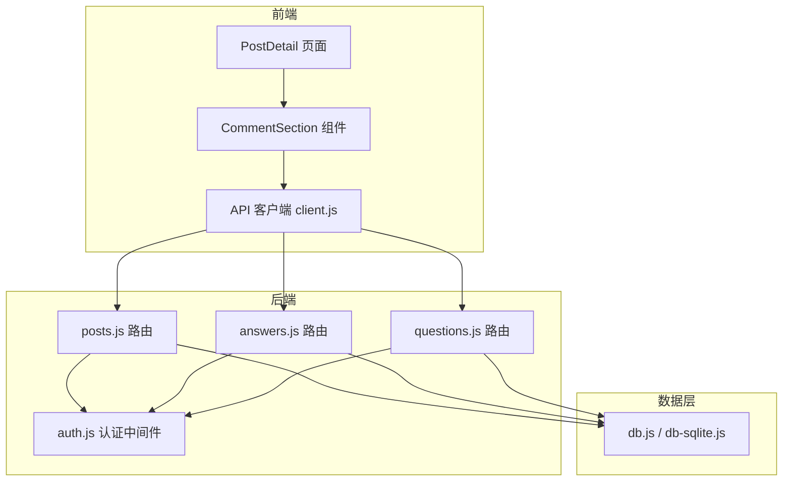
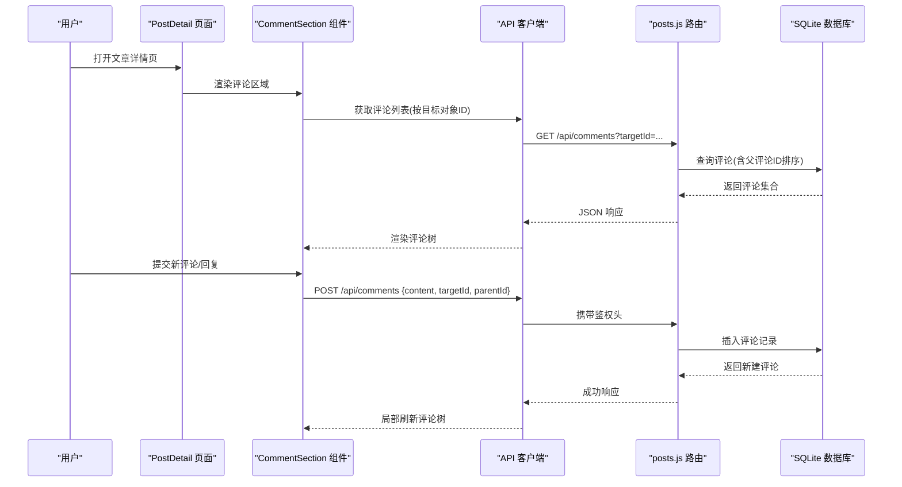
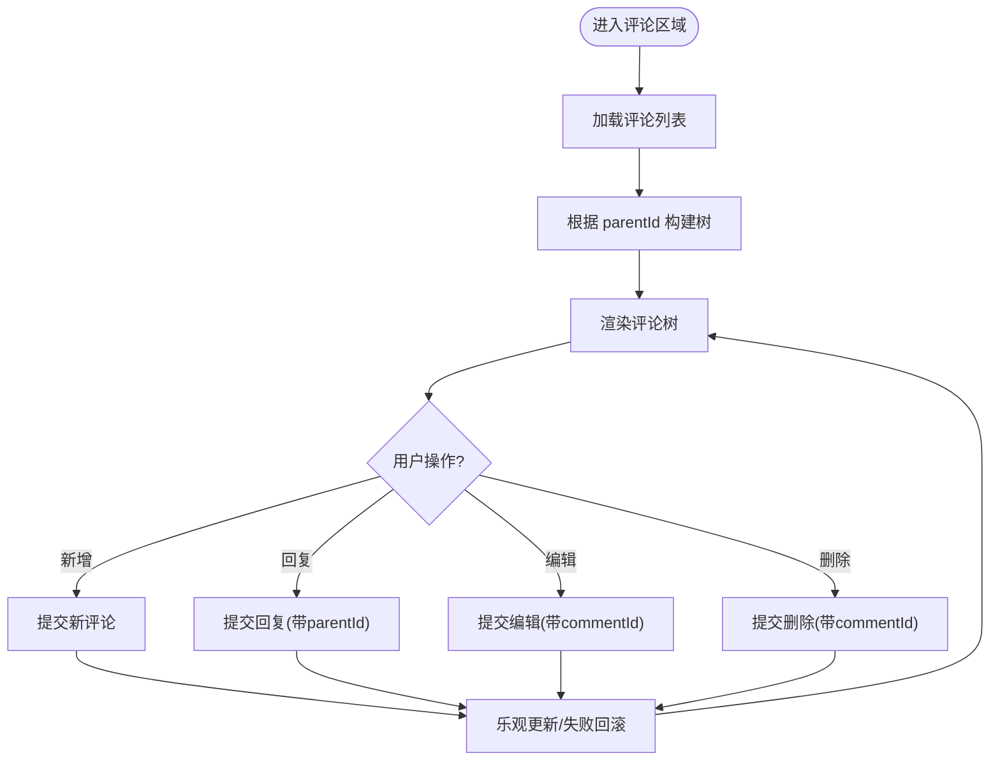
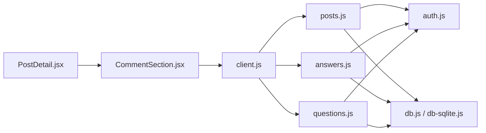

# 评论系统

<cite>
**本文引用的文件**   
- [CommentSection.jsx](file://src/components/CommentSection/CommentSection.jsx)
- [CommentSection.module.css](file://src/components/CommentSection/CommentSection.module.css)
- [client.js](file://src/api/client.js)
- [db.js](file://server/src/db.js)
- [db-sqlite.js](file://server/src/db-sqlite.js)
- [posts.js](file://server/src/routes/posts.js)
- [answers.js](file://server/src/routes/answers.js)
- [questions.js](file://server/src/routes/questions.js)
- [auth.js](file://server/src/middleware/auth.js)
- [PostDetail.jsx](file://src/css_pages/PostDetail.jsx)
- [PostDetail.module.css](file://src/css_pages/PostDetail.module.css)
- [02数据模型.md](file://docs/02数据模型.md)
</cite>

## 目录
1. [简介](#简介)
2. [项目结构](#项目结构)
3. [核心组件](#核心组件)
4. [架构总览](#架构总览)
5. [详细组件分析](#详细组件分析)
6. [依赖关系分析](#依赖关系分析)
7. [性能与缓存策略](#性能与缓存策略)
8. [审核与敏感词过滤](#审核与敏感词过滤)
9. [分页、无限滚动与虚拟列表](#分页无限滚动与虚拟列表)
10. [通知与提醒机制](#通知与提醒机制)
11. [测试策略](#测试策略)
12. [故障排查指南](#故障排查指南)
13. [结论](#结论)

## 简介
本文件围绕“评论系统”进行系统化文档化，覆盖以下方面：
- 评论组件的架构设计与交互流程（层级结构、嵌套回复、实时显示）
- 评论数据模型设计（表结构、关联关系、索引优化建议）
- CRUD 操作实现与权限控制
- 缓存策略与性能优化方案
- 审核机制与敏感词过滤
- 分页加载、无限滚动与虚拟列表技术
- 通知系统与用户提醒机制
- 测试策略与常见问题解决方案

## 项目结构
评论功能涉及前端组件、API 客户端、后端路由与数据库层。关键文件分布如下：
- 前端评论组件：src/components/CommentSection/*
- 文章详情页集成：src/css_pages/PostDetail.*
- API 客户端封装：src/api/client.js
- 后端路由：server/src/routes/{posts, answers, questions}.js
- 认证中间件：server/src/middleware/auth.js
- 数据库连接与初始化：server/src/db.js, server/src/db-sqlite.js
- 数据模型说明：docs/02数据模型.md

图表来源
- [CommentSection.jsx](file://src/components/CommentSection/CommentSection.jsx)
- [PostDetail.jsx](file://src/css_pages/PostDetail.jsx)
- [client.js](file://src/api/client.js)
- [posts.js](file://server/src/routes/posts.js)
- [answers.js](file://server/src/routes/answers.js)
- [questions.js](file://server/src/routes/questions.js)
- [auth.js](file://server/src/middleware/auth.js)
- [db.js](file://server/src/db.js)
- [db-sqlite.js](file://server/src/db-sqlite.js)

章节来源
- [CommentSection.jsx](file://src/components/CommentSection/CommentSection.jsx)
- [PostDetail.jsx](file://src/css_pages/PostDetail.jsx)
- [client.js](file://src/api/client.js)
- [posts.js](file://server/src/routes/posts.js)
- [answers.js](file://server/src/routes/answers.js)
- [questions.js](file://server/src/routes/questions.js)
- [auth.js](file://server/src/middleware/auth.js)
- [db.js](file://server/src/db.js)
- [db-sqlite.js](file://server/src/db-sqlite.js)
- [02数据模型.md](file://docs/02数据模型.md)

## 核心组件
- CommentSection 组件
  - 负责评论列表渲染、新增评论、回复嵌套、编辑与删除入口、错误提示等
  - 通过 API 客户端调用后端接口获取/提交评论数据
  - 样式由模块 CSS 管理
- PostDetail 页面
  - 在文章详情中嵌入评论区域，承载评论组件并处理页面级状态（如登录态、资源加载）
- API 客户端
  - 统一封装 HTTP 请求，提供评论相关方法（创建、查询、更新、删除）
- 后端路由
  - posts.js：文章维度评论接口
  - answers.js：问答维度评论接口
  - questions.js：问题维度评论接口
- 认证中间件
  - auth.js：校验登录态与权限，保护写操作接口
- 数据库层
  - db.js / db-sqlite.js：数据库连接、迁移与基础查询封装

章节来源
- [CommentSection.jsx](file://src/components/CommentSection/CommentSection.jsx)
- [CommentSection.module.css](file://src/components/CommentSection/CommentSection.module.css)
- [PostDetail.jsx](file://src/css_pages/PostDetail.jsx)
- [client.js](file://src/api/client.js)
- [posts.js](file://server/src/routes/posts.js)
- [answers.js](file://server/src/routes/answers.js)
- [questions.js](file://server/src/routes/questions.js)
- [auth.js](file://server/src/middleware/auth.js)
- [db.js](file://server/src/db.js)
- [db-sqlite.js](file://server/src/db-sqlite.js)

## 架构总览
评论系统采用前后端分离架构，前端通过 RESTful API 与后端交互，后端基于 Node.js 路由分发到对应业务逻辑，最终访问 SQLite 数据库。

图表来源
- [CommentSection.jsx](file://src/components/CommentSection/CommentSection.jsx)
- [client.js](file://src/api/client.js)
- [posts.js](file://server/src/routes/posts.js)
- [db.js](file://server/src/db.js)
- [db-sqlite.js](file://server/src/db-sqlite.js)

## 详细组件分析

### 评论组件（CommentSection）
- 职责
  - 展示评论树形结构（支持多级嵌套）
  - 提供新增评论、回复、编辑、删除入口
  - 处理表单输入校验、错误提示与成功反馈
  - 与 API 客户端协作完成数据同步
- 数据结构
  - 评论节点包含：唯一标识、内容、作者信息、时间戳、父评论ID、子评论集合等
  - 树构建：根据 parentId 将扁平列表组装为层级结构
- 交互流程
  - 首次加载：拉取评论列表并按时间或热度排序
  - 新增评论：提交后乐观更新本地树，必要时回滚
  - 回复：以当前评论为 parentId 创建子评论
  - 编辑/删除：仅对本人或管理员开放
- 样式
  - 使用模块 CSS 隔离样式，避免全局污染

图表来源
- [CommentSection.jsx](file://src/components/CommentSection/CommentSection.jsx)
- [CommentSection.module.css](file://src/components/CommentSection/CommentSection.module.css)

章节来源
- [CommentSection.jsx](file://src/components/CommentSection/CommentSection.jsx)
- [CommentSection.module.css](file://src/components/CommentSection/CommentSection.module.css)

### 文章详情页集成（PostDetail）
- 在文章详情页面中引入评论组件，传递文章 ID 作为目标对象标识
- 处理登录态与权限判断，决定评论写入能力
- 负责页面级错误边界与加载状态

章节来源
- [PostDetail.jsx](file://src/css_pages/PostDetail.jsx)
- [PostDetail.module.css](file://src/css_pages/PostDetail.module.css)

### API 客户端（client.js）
- 封装评论相关接口：
  - 获取评论列表（支持分页参数）
  - 创建评论（支持 parentId）
  - 更新评论
  - 删除评论
- 统一错误处理与重试策略（可选）

章节来源
- [client.js](file://src/api/client.js)

### 后端路由（posts.js / answers.js / questions.js）
- 评论读取
  - 根据目标对象 ID 查询评论，支持排序与分页
- 评论写入
  - 校验登录态与权限（作者/管理员）
  - 校验评论内容（长度、格式）
  - 插入评论记录，返回新建评论
- 评论修改/删除
  - 校验操作者是否为作者或管理员
  - 执行更新或删除

章节来源
- [posts.js](file://server/src/routes/posts.js)
- [answers.js](file://server/src/routes/answers.js)
- [questions.js](file://server/src/routes/questions.js)

### 认证中间件（auth.js）
- 校验请求中的身份令牌或会话
- 注入用户上下文（userId、角色）供路由使用
- 未授权时返回 401/403

章节来源
- [auth.js](file://server/src/middleware/auth.js)

### 数据库层（db.js / db-sqlite.js）
- 提供数据库连接与事务封装
- 执行 SQL 查询与写入
- 支持迁移脚本与初始数据填充

章节来源
- [db.js](file://server/src/db.js)
- [db-sqlite.js](file://server/src/db-sqlite.js)

## 依赖关系分析
- 前端依赖
  - CommentSection 依赖 API 客户端与样式模块
  - PostDetail 依赖 CommentSection 与认证上下文
- 后端依赖
  - 路由依赖认证中间件与数据库连接
- 数据依赖
  - 评论表与目标对象（文章/问题/回答）存在外键关联

图表来源
- [CommentSection.jsx](file://src/components/CommentSection/CommentSection.jsx)
- [client.js](file://src/api/client.js)
- [PostDetail.jsx](file://src/css_pages/PostDetail.jsx)
- [posts.js](file://server/src/routes/posts.js)
- [answers.js](file://server/src/routes/answers.js)
- [questions.js](file://server/src/routes/questions.js)
- [auth.js](file://server/src/middleware/auth.js)
- [db.js](file://server/src/db.js)
- [db-sqlite.js](file://server/src/db-sqlite.js)

章节来源
- [CommentSection.jsx](file://src/components/CommentSection/CommentSection.jsx)
- [client.js](file://src/api/client.js)
- [PostDetail.jsx](file://src/css_pages/PostDetail.jsx)
- [posts.js](file://server/src/routes/posts.js)
- [answers.js](file://server/src/routes/answers.js)
- [questions.js](file://server/src/routes/questions.js)
- [auth.js](file://server/src/middleware/auth.js)
- [db.js](file://server/src/db.js)
- [db-sqlite.js](file://server/src/db-sqlite.js)

## 性能与缓存策略
- 前端缓存
  - 使用内存缓存存储最近评论列表，减少重复请求
  - 对热门文章启用短期缓存（TTL），结合版本号失效
- 后端缓存
  - 对只读接口增加 Redis 缓存（可选），命中则直接返回
  - 写操作后主动失效相关缓存键
- 数据库优化
  - 针对目标对象ID、父评论ID、时间戳建立复合索引
  - 分页查询使用游标或范围扫描替代 OFFSET
- 传输优化
  - 压缩响应体，按需字段返回
  - 合并小请求（批量获取评论与作者信息）

[本节为通用性能建议，不直接分析具体文件]

## 审核与敏感词过滤
- 审核流程
  - 评论提交后进入待审队列，管理员审核后生效
  - 支持批量审核与快速通过/拒绝
- 敏感词过滤
  - 提交前前端轻量校验（用户体验）
  - 服务端强制过滤（正则/字典匹配），命中则标记违规或替换
- 审计日志
  - 记录审核操作人、时间与结果，便于追溯

[本节为通用审核方案，不直接分析具体文件]

## 分页、无限滚动与虚拟列表
- 分页加载
  - 后端支持 page/size 或 cursor 分页
  - 前端维护页码或游标状态，增量追加
- 无限滚动
  - 监听滚动位置，接近底部时触发下一页加载
  - 防抖与节流避免频繁请求
- 虚拟列表
  - 对长列表使用虚拟滚动，仅渲染可视区域项
  - 计算行高与偏移，提升大列表性能

[本节为通用技术方案，不直接分析具体文件]

## 通知与提醒机制
- 事件驱动
  - 当有新评论或回复时，向被提及用户发送站内通知
- 推送通道
  - 站内消息中心 + 邮件/短信（可选）
- 去重与频率限制
  - 同一用户短时间内多次提醒进行聚合
  - 设置每日上限，防止打扰

[本节为通用通知方案，不直接分析具体文件]

## 测试策略
- 单元测试
  - 评论树构建算法、权限判定逻辑、输入校验
- 集成测试
  - API 端到端流程：创建、查询、更新、删除
  - 认证中间件拦截未授权请求
- E2E 测试
  - 使用 Playwright 模拟用户操作：登录、发表评论、回复、编辑、删除
  - 验证 UI 渲染与交互正确性

章节来源
- [client.js](file://src/api/client.js)
- [posts.js](file://server/src/routes/posts.js)
- [answers.js](file://server/src/routes/answers.js)
- [questions.js](file://server/src/routes/questions.js)
- [auth.js](file://server/src/middleware/auth.js)

## 故障排查指南
- 常见问题
  - 评论无法提交：检查认证中间件是否放行、请求头是否正确
  - 评论不显示：确认目标对象ID传递、后端查询条件与排序
  - 嵌套错乱：检查 parentId 赋值与树构建逻辑
  - 性能问题：查看数据库索引、分页方式与前端缓存命中率
- 定位步骤
  - 前端控制台查看网络请求与响应
  - 后端日志输出关键路径（鉴权、SQL 执行）
  - 数据库慢查询分析与索引优化

[本节为通用排障建议，不直接分析具体文件]

## 结论
评论系统通过清晰的前后端分层与模块化设计，实现了可复用的评论组件与稳定的数据流。结合缓存、索引与虚拟列表等技术，可在保证用户体验的同时提升性能。审核与通知机制进一步完善了系统的可用性与安全性。后续可根据业务规模引入更完善的缓存与消息队列，持续优化扩展性。