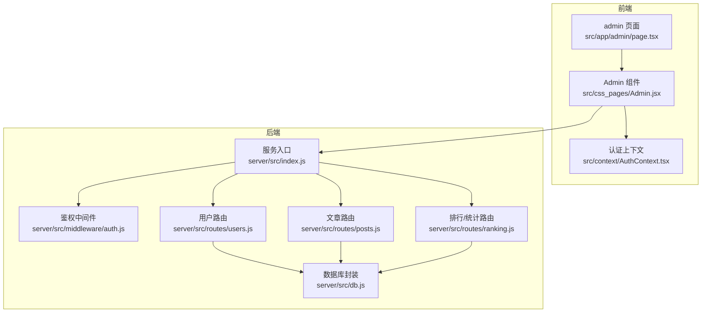
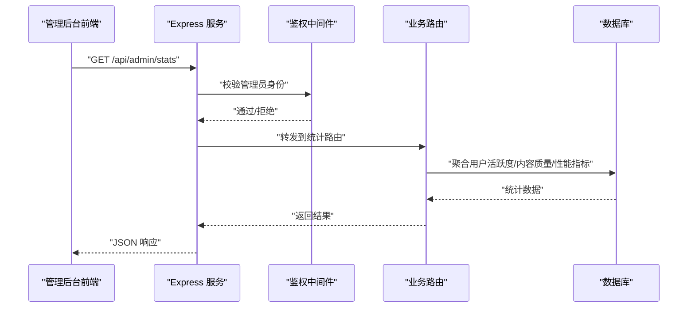
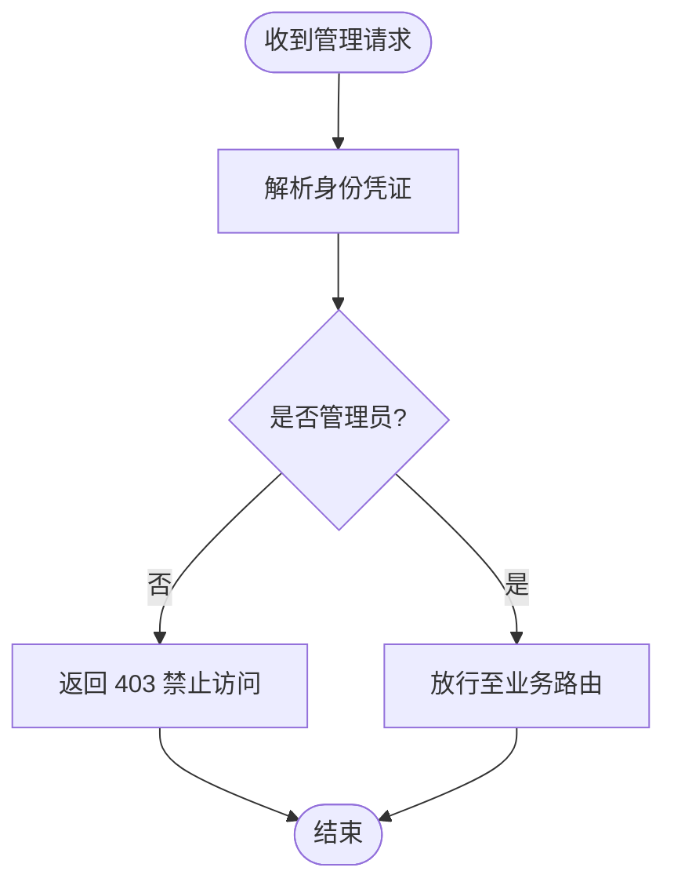
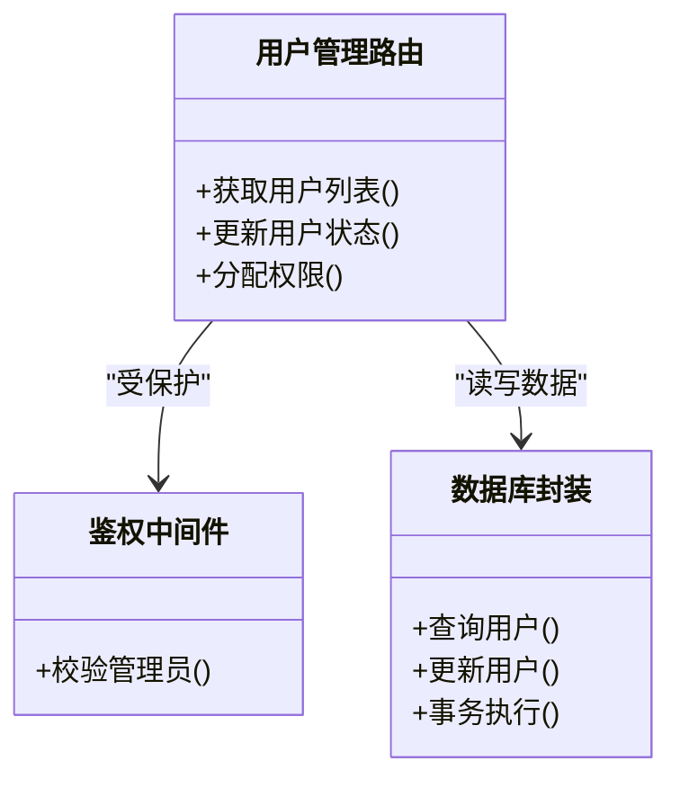
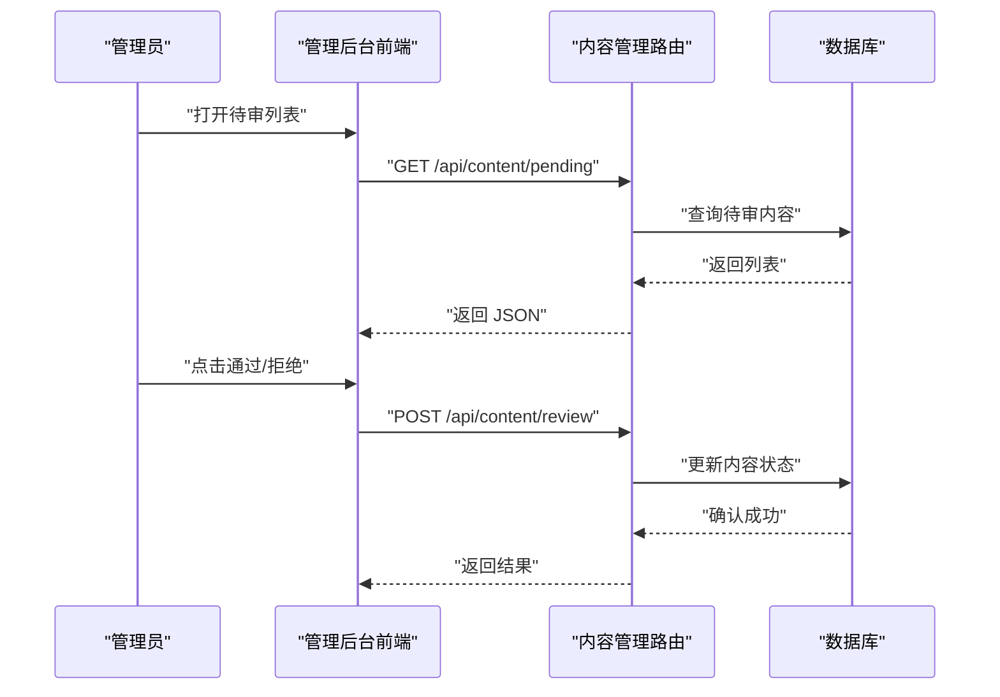
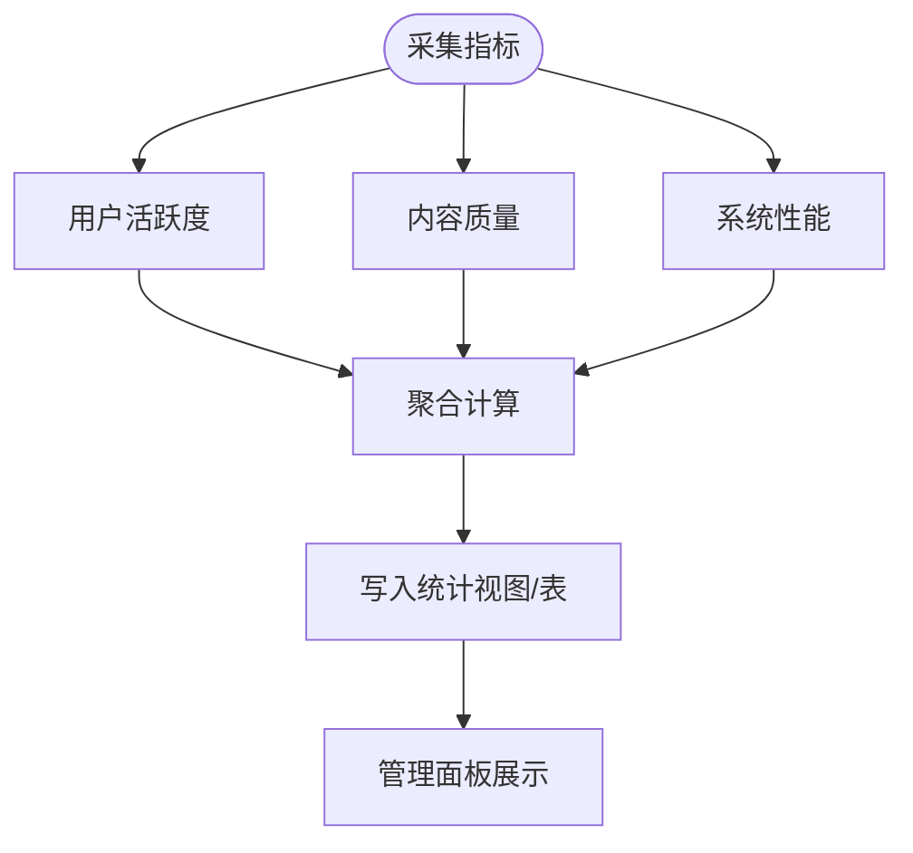
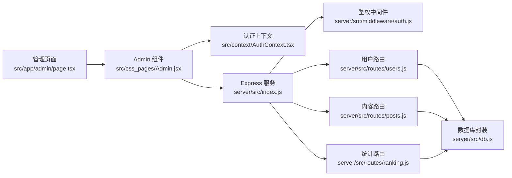

# 管理后台

<cite>
**本文引用的文件**   
- [server/src/middleware/auth.js](file://server/src/middleware/auth.js)
- [server/src/routes/users.js](file://server/src/routes/users.js)
- [server/src/routes/posts.js](file://server/src/routes/posts.js)
- [server/src/routes/ranking.js](file://server/src/routes/ranking.js)
- [server/src/db.js](file://server/src/db.js)
- [server/src/index.js](file://server/src/index.js)
- [src/app/admin/page.tsx](file://src/app/admin/page.tsx)
- [src/css_pages/Admin.jsx](file://src/css_pages/Admin.jsx)
- [src/context/AuthContext.tsx](file://src/context/AuthContext.tsx)
- [API.md](file://API.md)
</cite>

## 目录
1. [简介](#简介)
2. [项目结构](#项目结构)
3. [核心组件](#核心组件)
4. [架构总览](#架构总览)
5. [详细组件分析](#详细组件分析)
6. [依赖关系分析](#依赖关系分析)
7. [性能考虑](#性能考虑)
8. [故障排查指南](#故障排查指南)
9. [结论](#结论)
10. [附录](#附录)

## 简介
本文件面向“管理后台”的规划与实现，覆盖管理员权限验证与访问控制、用户管理、内容审核流程、数据统计与分析、系统配置与环境参数、日志与错误监控、备份恢复与维护、安全加固与审计追踪等主题。文档以现有代码为基础，结合合理的扩展建议，形成可落地的方案说明与操作指引。

## 项目结构
管理后台涉及前后端协作：
- 前端入口与管理页面位于 Next.js 应用层，提供管理员界面与交互逻辑。
- 后端基于 Express 路由与中间件，提供鉴权、用户管理、内容管理与统计接口。
- 数据持久化通过数据库模块进行统一封装。

图表来源
- [server/src/index.js](file://server/src/index.js)
- [server/src/middleware/auth.js](file://server/src/middleware/auth.js)
- [server/src/routes/users.js](file://server/src/routes/users.js)
- [server/src/routes/posts.js](file://server/src/routes/posts.js)
- [server/src/routes/ranking.js](file://server/src/routes/ranking.js)
- [server/src/db.js](file://server/src/db.js)
- [src/app/admin/page.tsx](file://src/app/admin/page.tsx)
- [src/css_pages/Admin.jsx](file://src/css_pages/Admin.jsx)
- [src/context/AuthContext.tsx](file://src/context/AuthContext.tsx)

章节来源
- [server/src/index.js](file://server/src/index.js)
- [server/src/middleware/auth.js](file://server/src/middleware/auth.js)
- [server/src/routes/users.js](file://server/src/routes/users.js)
- [server/src/routes/posts.js](file://server/src/routes/posts.js)
- [server/src/routes/ranking.js](file://server/src/routes/ranking.js)
- [server/src/db.js](file://server/src/db.js)
- [src/app/admin/page.tsx](file://src/app/admin/page.tsx)
- [src/css_pages/Admin.jsx](file://src/css_pages/Admin.jsx)
- [src/context/AuthContext.tsx](file://src/context/AuthContext.tsx)

## 核心组件
- 鉴权中间件：负责校验请求身份与管理员权限，拦截未授权访问。
- 用户管理路由：提供用户列表查询、状态变更（启用/禁用）、角色/权限分配等能力。
- 内容管理路由：提供文章/问答等内容的查看、审核（通过/拒绝）与删除等操作。
- 统计路由：聚合用户活跃度、内容质量与系统性能指标，供管理面板展示。
- 数据库封装：统一连接与查询方法，为各路由提供稳定数据访问。
- 前端管理页：集成认证上下文，渲染管理面板并调用后端 API。

章节来源
- [server/src/middleware/auth.js](file://server/src/middleware/auth.js)
- [server/src/routes/users.js](file://server/src/routes/users.js)
- [server/src/routes/posts.js](file://server/src/routes/posts.js)
- [server/src/routes/ranking.js](file://server/src/routes/ranking.js)
- [server/src/db.js](file://server/src/db.js)
- [src/app/admin/page.tsx](file://src/app/admin/page.tsx)
- [src/css_pages/Admin.jsx](file://src/css_pages/Admin.jsx)
- [src/context/AuthContext.tsx](file://src/context/AuthContext.tsx)

## 架构总览
管理后台采用前后端分离架构，前端通过 HTTP 调用后端 RESTful API；后端在路由层使用鉴权中间件进行权限校验，再执行业务逻辑并访问数据库。

图表来源
- [server/src/index.js](file://server/src/index.js)
- [server/src/middleware/auth.js](file://server/src/middleware/auth.js)
- [server/src/routes/ranking.js](file://server/src/routes/ranking.js)
- [server/src/db.js](file://server/src/db.js)

## 详细组件分析

### 管理员权限验证与访问控制
- 鉴权中间件职责
  - 解析请求中的身份凭证（如 Cookie/Token）。
  - 校验是否为管理员角色或具备相应权限。
  - 对未授权请求直接返回错误响应，阻止进入业务路由。
- 访问控制策略
  - 全局挂载鉴权中间件，保护所有管理接口。
  - 针对敏感操作（如删除、批量修改）增加二次校验或额外权限位。
- 前端配合
  - 在认证上下文中维护登录态与角色信息。
  - 根据角色动态显示管理菜单与按钮。

图表来源
- [server/src/middleware/auth.js](file://server/src/middleware/auth.js)
- [src/context/AuthContext.tsx](file://src/context/AuthContext.tsx)

章节来源
- [server/src/middleware/auth.js](file://server/src/middleware/auth.js)
- [src/context/AuthContext.tsx](file://src/context/AuthContext.tsx)

### 用户管理功能
- 用户信息查看
  - 支持分页、筛选（按状态、注册时间等）与搜索（用户名/邮箱）。
  - 返回字段包含基础信息与权限标识。
- 状态管理
  - 提供启用/禁用用户的接口，更新后同步缓存或索引（如有）。
- 权限分配
  - 支持为用户分配角色或权限位，记录变更历史以便审计。

图表来源
- [server/src/routes/users.js](file://server/src/routes/users.js)
- [server/src/middleware/auth.js](file://server/src/middleware/auth.js)
- [server/src/db.js](file://server/src/db.js)

章节来源
- [server/src/routes/users.js](file://server/src/routes/users.js)
- [server/src/middleware/auth.js](file://server/src/middleware/auth.js)
- [server/src/db.js](file://server/src/db.js)

### 内容审核流程
- 审核范围
  - 文章、问答、评论等内容类型均可纳入审核队列。
- 审核动作
  - 通过：将内容标记为公开可见。
  - 拒绝：将内容标记为不公开，并可附加拒绝原因。
  - 删除：彻底移除内容及其关联数据。
- 界面与交互
  - 管理面板提供待审列表、详情预览与批量操作。
  - 审核操作需管理员权限，并记录审计日志。

图表来源
- [server/src/routes/posts.js](file://server/src/routes/posts.js)
- [server/src/db.js](file://server/src/db.js)
- [src/css_pages/Admin.jsx](file://src/css_pages/Admin.jsx)

章节来源
- [server/src/routes/posts.js](file://server/src/routes/posts.js)
- [server/src/db.js](file://server/src/db.js)
- [src/css_pages/Admin.jsx](file://src/css_pages/Admin.jsx)

### 数据统计与分析
- 指标维度
  - 用户活跃度：日/周/月活跃用户数、登录次数、发帖量。
  - 内容质量：点赞率、收藏率、举报处理时长、审核通过率。
  - 系统性能：接口响应时间、错误率、资源占用。
- 数据来源
  - 从业务表聚合统计，必要时引入时序指标表或外部监控系统。
- 展示方式
  - 管理面板提供图表与导出功能，支持按时间范围筛选。

图表来源
- [server/src/routes/ranking.js](file://server/src/routes/ranking.js)
- [server/src/db.js](file://server/src/db.js)
- [src/css_pages/Admin.jsx](file://src/css_pages/Admin.jsx)

章节来源
- [server/src/routes/ranking.js](file://server/src/routes/ranking.js)
- [server/src/db.js](file://server/src/db.js)
- [src/css_pages/Admin.jsx](file://src/css_pages/Admin.jsx)

### 系统配置与环境参数
- 配置项分类
  - 运行时参数：端口、数据库连接、缓存配置、第三方服务密钥。
  - 功能开关：审核开关、注册开关、维护模式。
- 管理方式
  - 环境变量优先，配置文件次之；管理面板提供只读展示与受限编辑。
- 安全建议
  - 敏感配置仅通过环境变量注入，避免硬编码与版本库泄露。

章节来源
- [server/src/index.js](file://server/src/index.js)
- [server/src/db.js](file://server/src/db.js)

### 日志查看与错误监控
- 日志级别
  - 信息、警告、错误、致命四级，关键操作强制记录。
- 存储位置
  - 本地文件与集中式日志平台并存，便于检索与告警。
- 错误监控
  - 捕获未处理异常，上报错误堆栈与上下文，触发告警通知。

章节来源
- [server/src/index.js](file://server/src/index.js)

### 备份恢复与系统维护
- 备份策略
  - 定期全量+增量备份，保留多份历史快照。
  - 备份文件加密存储，限制访问权限。
- 恢复流程
  - 选择目标时间点，停止写服务，导入数据，校验一致性，重启服务。
- 维护窗口
  - 计划内维护提前公告，灰度发布与回滚预案完备。

章节来源
- [server/src/db.js](file://server/src/db.js)

### 安全加固与审计追踪
- 安全加固
  - 最小权限原则、输入校验与输出编码、防重放与限流、HTTPS 强制。
- 审计追踪
  - 记录管理员关键操作（登录、权限变更、内容审核），不可篡改且可追溯。
- 合规要求
  - 满足数据留存周期与隐私保护规范。

章节来源
- [server/src/middleware/auth.js](file://server/src/middleware/auth.js)
- [server/src/routes/users.js](file://server/src/routes/users.js)
- [server/src/routes/posts.js](file://server/src/routes/posts.js)

## 依赖关系分析
管理后台的关键依赖如下：
- 前端管理页依赖认证上下文与服务端 API。
- 服务端路由依赖鉴权中间件与数据库封装。
- 统计路由依赖业务数据与可能的时序指标源。

图表来源
- [src/app/admin/page.tsx](file://src/app/admin/page.tsx)
- [src/css_pages/Admin.jsx](file://src/css_pages/Admin.jsx)
- [src/context/AuthContext.tsx](file://src/context/AuthContext.tsx)
- [server/src/index.js](file://server/src/index.js)
- [server/src/middleware/auth.js](file://server/src/middleware/auth.js)
- [server/src/routes/users.js](file://server/src/routes/users.js)
- [server/src/routes/posts.js](file://server/src/routes/posts.js)
- [server/src/routes/ranking.js](file://server/src/routes/ranking.js)
- [server/src/db.js](file://server/src/db.js)

章节来源
- [src/app/admin/page.tsx](file://src/app/admin/page.tsx)
- [src/css_pages/Admin.jsx](file://src/css_pages/Admin.jsx)
- [src/context/AuthContext.tsx](file://src/context/AuthContext.tsx)
- [server/src/index.js](file://server/src/index.js)
- [server/src/middleware/auth.js](file://server/src/middleware/auth.js)
- [server/src/routes/users.js](file://server/src/routes/users.js)
- [server/src/routes/posts.js](file://server/src/routes/posts.js)
- [server/src/routes/ranking.js](file://server/src/routes/ranking.js)
- [server/src/db.js](file://server/src/db.js)

## 性能考虑
- 数据库层面
  - 为高频查询字段建立索引，避免 N+1 查询，合理使用分页与投影。
- 缓存策略
  - 对热点统计与字典数据进行缓存，设置合理过期与失效策略。
- 接口优化
  - 合并小接口、压缩响应体、异步任务与批处理降低主线程压力。
- 前端体验
  - 懒加载管理页面、虚拟滚动长列表、去抖与节流减少重复请求。

[本节为通用指导，无需特定文件来源]

## 故障排查指南
- 常见问题定位
  - 鉴权失败：检查凭证格式、会话有效期与角色判定逻辑。
  - 权限不足：核对管理员角色与权限位配置。
  - 数据不一致：核查事务边界与并发更新冲突。
- 日志与监控
  - 收集错误堆栈与请求上下文，关联审计日志定位操作人。
  - 使用指标看板观察错误率与响应时延趋势。
- 快速恢复
  - 临时降级非关键功能，优先恢复核心管理接口可用性。

章节来源
- [server/src/middleware/auth.js](file://server/src/middleware/auth.js)
- [server/src/index.js](file://server/src/index.js)

## 结论
管理后台围绕“鉴权—授权—操作—审计”的主线构建，通过中间件与路由分层实现清晰的权限控制与业务流程。在用户管理、内容审核与统计分析方面，建议持续完善数据模型与可视化能力，并结合日志与监控体系提升可观测性与稳定性。

[本节为总结性内容，无需特定文件来源]

## 附录
- 参考接口定义
  - 参见 API 文档中关于管理员统计与管理的接口说明。

章节来源
- [API.md](file://API.md)