# 问答系统

<cite>
**本文引用的文件**   
- [server/src/index.js](file://server/src/index.js)
- [server/src/db-sqlite.js](file://server/src/db-sqlite.js)
- [server/src/routes/questions.js](file://server/src/routes/questions.js)
- [server/src/routes/answers.js](file://server/src/routes/answers.js)
- [server/src/routes/ranking.js](file://server/src/routes/ranking.js)
- [server/src/routes/search.js](file://server/src/routes/search.js)
- [server/src/middleware/auth.js](file://server/src/middleware/auth.js)
- [src/app/questions/page.jsx](file://src/app/questions/page.jsx)
- [src/app/questions/[id]/page.jsx](file://src/app/questions/[id]/page.jsx)
- [src/app/questions/ask/page.jsx](file://src/app/questions/ask/page.jsx)
- [src/app/rankings/page.jsx](file://src/app/rankings/page.jsx)
- [src/app/rankings/[type]/page.jsx](file://src/app/rankings/[type]/page.jsx)
- [src/app/search/page.jsx](file://src/app/search/page.jsx)
- [src/components/CommentSection/CommentSection.jsx](file://src/components/CommentSection/CommentSection.jsx)
- [API.md](file://API.md)
</cite>

## 目录
1. [简介](#简介)
2. [项目结构](#项目结构)
3. [核心组件](#核心组件)
4. [架构总览](#架构总览)
5. [详细组件分析](#详细组件分析)
6. [依赖关系分析](#依赖关系分析)
7. [性能考虑](#性能考虑)
8. [故障排查指南](#故障排查指南)
9. [结论](#结论)
10. [附录](#附录)

## 简介
本问答系统提供问题发布、回答提交、投票排序、搜索筛选、最佳答案选择与采纳、评论嵌套、权限控制与内容审核、数据统计与排行榜等完整能力。后端基于 Node.js + SQLite，前端采用 Next.js 页面路由组织功能模块，前后端通过 RESTful API 交互。

## 项目结构
- 后端 server：Express 服务入口、数据库初始化与迁移、路由层（问题、回答、排名、搜索）、鉴权中间件。
- 前端 src：Next.js App Router 页面与通用组件（问答列表、详情、提问表单、评论、搜索、排行榜）。
- 文档 API.md：接口契约说明。

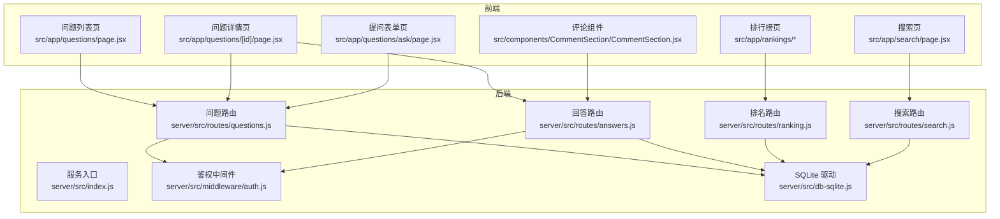

图表来源
- [server/src/index.js](file://server/src/index.js)
- [server/src/routes/questions.js](file://server/src/routes/questions.js)
- [server/src/routes/answers.js](file://server/src/routes/answers.js)
- [server/src/routes/ranking.js](file://server/src/routes/ranking.js)
- [server/src/routes/search.js](file://server/src/routes/search.js)
- [server/src/middleware/auth.js](file://server/src/middleware/auth.js)
- [server/src/db-sqlite.js](file://server/src/db-sqlite.js)
- [src/app/questions/page.jsx](file://src/app/questions/page.jsx)
- [src/app/questions/[id]/page.jsx](file://src/app/questions/[id]/page.jsx)
- [src/app/questions/ask/page.jsx](file://src/app/questions/ask/page.jsx)
- [src/app/search/page.jsx](file://src/app/search/page.jsx)
- [src/app/rankings/page.jsx](file://src/app/rankings/page.jsx)
- [src/app/rankings/[type]/page.jsx](file://src/app/rankings/[type]/page.jsx)
- [src/components/CommentSection/CommentSection.jsx](file://src/components/CommentSection/CommentSection.jsx)

章节来源
- [server/src/index.js](file://server/src/index.js)
- [API.md](file://API.md)

## 核心组件
- 问题路由：负责问题的创建、查询、更新、删除及状态管理（如是否已解决）。
- 回答路由：负责回答的增删改查、点赞、采纳为最佳答案、评论关联。
- 排名路由：按热度、时间权重等维度生成排行榜。
- 搜索路由：支持关键词检索、标签/分类筛选、分页。
- 鉴权中间件：校验登录态、角色（普通用户/管理员），保护敏感操作。
- 数据库驱动：封装 SQLite 连接、建表、迁移与基础查询。

章节来源
- [server/src/routes/questions.js](file://server/src/routes/questions.js)
- [server/src/routes/answers.js](file://server/src/routes/answers.js)
- [server/src/routes/ranking.js](file://server/src/routes/ranking.js)
- [server/src/routes/search.js](file://server/src/routes/search.js)
- [server/src/middleware/auth.js](file://server/src/middleware/auth.js)
- [server/src/db-sqlite.js](file://server/src/db-sqlite.js)

## 架构总览
整体采用前后端分离的 REST 架构。前端页面发起 HTTP 请求至后端路由，路由调用数据库驱动完成数据读写；鉴权中间件在关键接口前进行身份与权限校验。

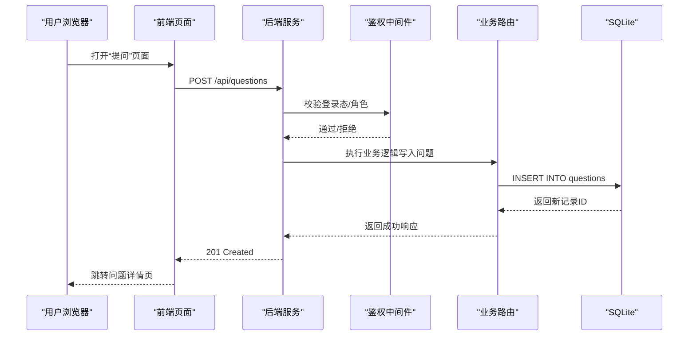

图表来源
- [server/src/index.js](file://server/src/index.js)
- [server/src/middleware/auth.js](file://server/src/middleware/auth.js)
- [server/src/routes/questions.js](file://server/src/routes/questions.js)
- [server/src/db-sqlite.js](file://server/src/db-sqlite.js)

## 详细组件分析

### 数据模型与表关系
- 用户 users：用户标识、用户名、角色、头像、注册时间等。
- 问题 questions：标题、正文、作者、标签/分类、浏览数、点赞数、收藏数、是否已解决、创建/更新时间。
- 回答 answers：所属问题、作者、正文、点赞数、是否最佳答案、创建/更新时间。
- 评论 comments：可评论对象（回答或问题）、父评论 ID（实现嵌套）、作者、正文、创建时间。
- 投票 votes：用户对问题/回答的点赞/踩，用于热度计算。
- 收藏 favorites：用户对问题/回答的收藏关系。
- 搜索索引 search_index：分词后的关键词映射，加速全文检索。

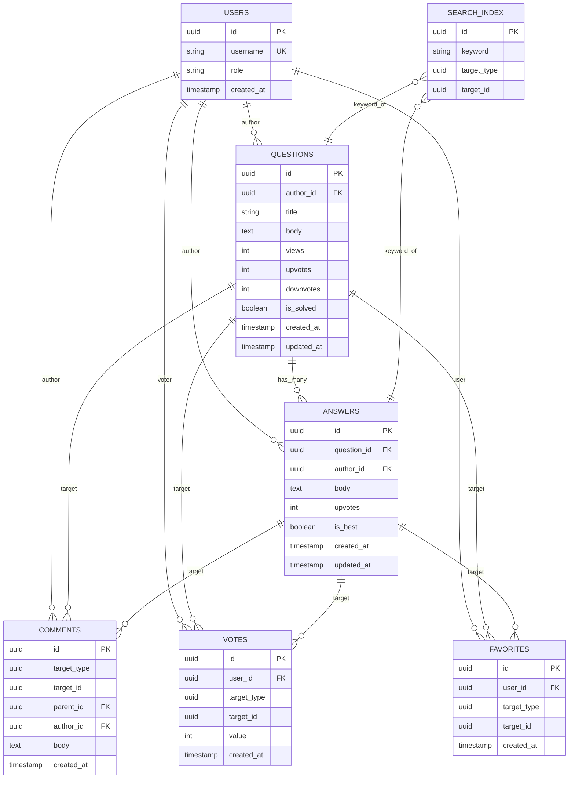

图表来源
- [server/src/db-sqlite.js](file://server/src/db-sqlite.js)

章节来源
- [server/src/db-sqlite.js](file://server/src/db-sqlite.js)

### 问题发布流程
- 前端“提问”页面收集标题、正文、标签等信息，调用后端问题创建接口。
- 鉴权中间件校验登录态与角色，允许普通用户创建问题。
- 后端写入 questions 表，并可选对正文进行分词写入 search_index。
- 返回新问题的 ID，前端跳转到问题详情页。

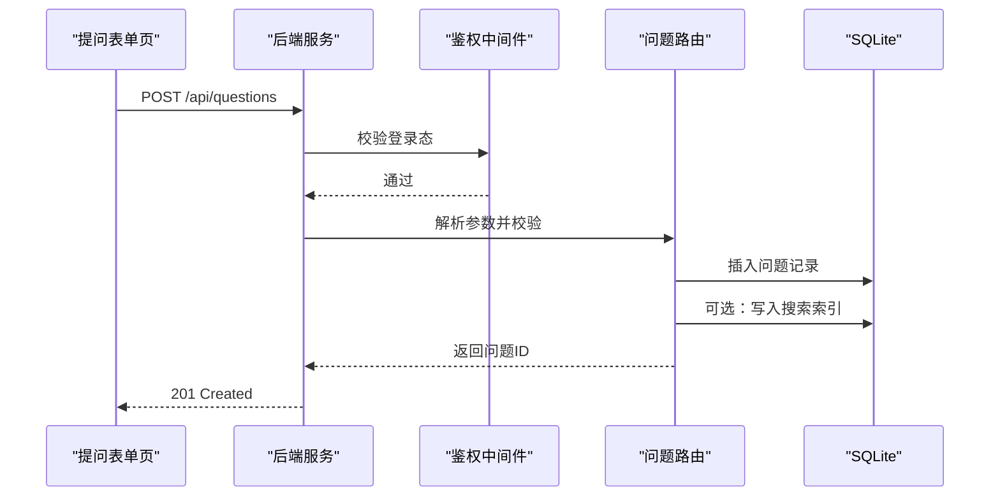

图表来源
- [server/src/routes/questions.js](file://server/src/routes/questions.js)
- [server/src/middleware/auth.js](file://server/src/middleware/auth.js)
- [server/src/db-sqlite.js](file://server/src/db-sqlite.js)

章节来源
- [src/app/questions/ask/page.jsx](file://src/app/questions/ask/page.jsx)
- [server/src/routes/questions.js](file://server/src/routes/questions.js)

### 回答提交与评论嵌套
- 回答提交：在问题详情页提交回答，后端写入 answers 表，并可选择更新问题“已解决”状态。
- 评论嵌套：comments 表包含 parent_id，形成树形结构；支持对问题或回答添加评论。
- 最佳回答：将某回答标记为最佳答案后，问题状态同步为已解决。

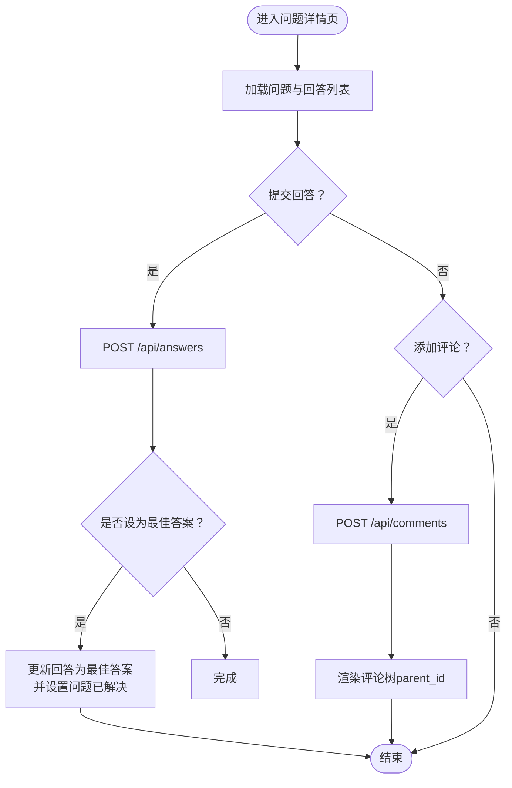

图表来源
- [server/src/routes/answers.js](file://server/src/routes/answers.js)
- [server/src/db-sqlite.js](file://server/src/db-sqlite.js)

章节来源
- [src/app/questions/[id]/page.jsx](file://src/app/questions/[id]/page.jsx)
- [src/components/CommentSection/CommentSection.jsx](file://src/components/CommentSection/CommentSection.jsx)
- [server/src/routes/answers.js](file://server/src/routes/answers.js)

### 投票与排序算法（热度与时间权重）
- 投票：用户对问题/回答进行点赞/踩，记录于 votes 表，影响 upvotes/downvotes 计数。
- 热度计算：综合点赞数、回答数、浏览量、最近活跃时间等指标，使用加权公式计算热度分数。
- 时间权重：近期活动（新增回答、评论、点赞）具有更高权重，随时间衰减。
- 排序：根据热度分数降序排列，支持按时间、票数等多维度排序。

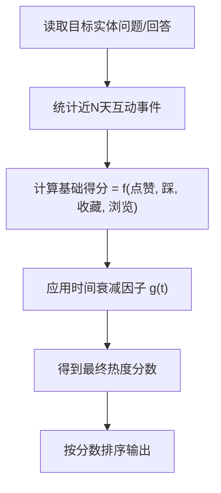

图表来源
- [server/src/routes/ranking.js](file://server/src/routes/ranking.js)
- [server/src/db-sqlite.js](file://server/src/db-sqlite.js)

章节来源
- [server/src/routes/ranking.js](file://server/src/routes/ranking.js)

### 搜索与筛选
- 关键词检索：基于 search_index 表进行关键词匹配，支持多关键词组合。
- 筛选条件：按标签/分类、时间范围、排序方式（热度/最新/最多回答）过滤。
- 分页：支持 page、per_page 参数，返回总数与当前页数据。

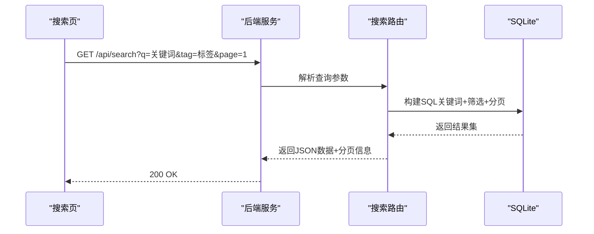

图表来源
- [server/src/routes/search.js](file://server/src/routes/search.js)
- [server/src/db-sqlite.js](file://server/src/db-sqlite.js)

章节来源
- [src/app/search/page.jsx](file://src/app/search/page.jsx)
- [server/src/routes/search.js](file://server/src/routes/search.js)

### 最佳答案选择与采纳流程
- 选择最佳答案：回答作者或问题作者可将某回答标记为最佳答案。
- 采纳生效：后端更新 answers.is_best 与 questions.is_solved，确保一致性。
- 并发控制：采用事务或行级锁避免重复采纳。

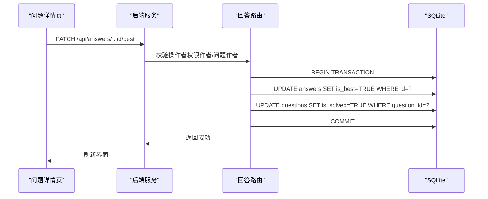

图表来源
- [server/src/routes/answers.js](file://server/src/routes/answers.js)
- [server/src/db-sqlite.js](file://server/src/db-sqlite.js)

章节来源
- [server/src/routes/answers.js](file://server/src/routes/answers.js)

### 权限控制与内容审核策略
- 权限控制：
  - 鉴权中间件校验登录态与角色，区分普通用户与管理员。
  - 敏感操作（删除、修改他人内容、设置最佳答案）需具备相应权限。
- 内容审核：
  - 管理员可对问题/回答进行置顶、加精、屏蔽或删除。
  - 违规内容可触发审核队列，限制展示直至人工复核。

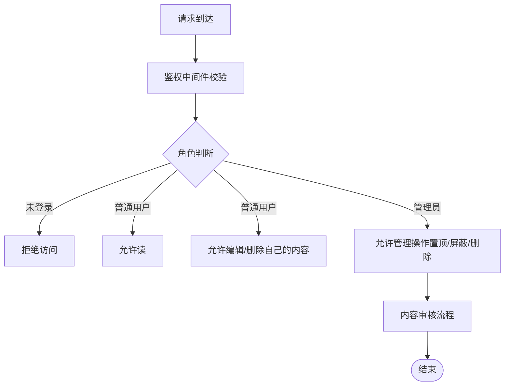

图表来源
- [server/src/middleware/auth.js](file://server/src/middleware/auth.js)

章节来源
- [server/src/middleware/auth.js](file://server/src/middleware/auth.js)

### 数据统计与排行榜
- 统计指标：问题总数、回答总数、活跃用户数、日均新增、热门标签分布等。
- 排行榜：
  - 热门问题榜：按热度分数排序。
  - 高赞回答榜：按点赞数排序。
  - 活跃用户榜：按贡献度（问题+回答+评论）排序。
- 缓存策略：对热点榜单进行短期缓存，降低数据库压力。

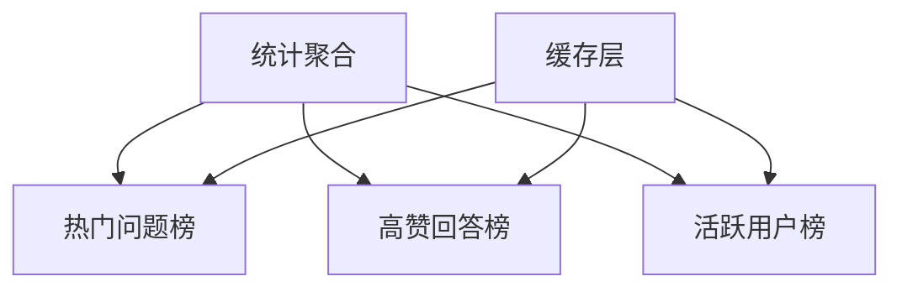

图表来源
- [server/src/routes/ranking.js](file://server/src/routes/ranking.js)

章节来源
- [server/src/routes/ranking.js](file://server/src/routes/ranking.js)
- [src/app/rankings/page.jsx](file://src/app/rankings/page.jsx)
- [src/app/rankings/[type]/page.jsx](file://src/app/rankings/[type]/page.jsx)

## 依赖关系分析
- 路由层依赖鉴权中间件与数据库驱动。
- 前端页面依赖对应后端路由接口。
- 排行榜与搜索均依赖数据库聚合与索引。

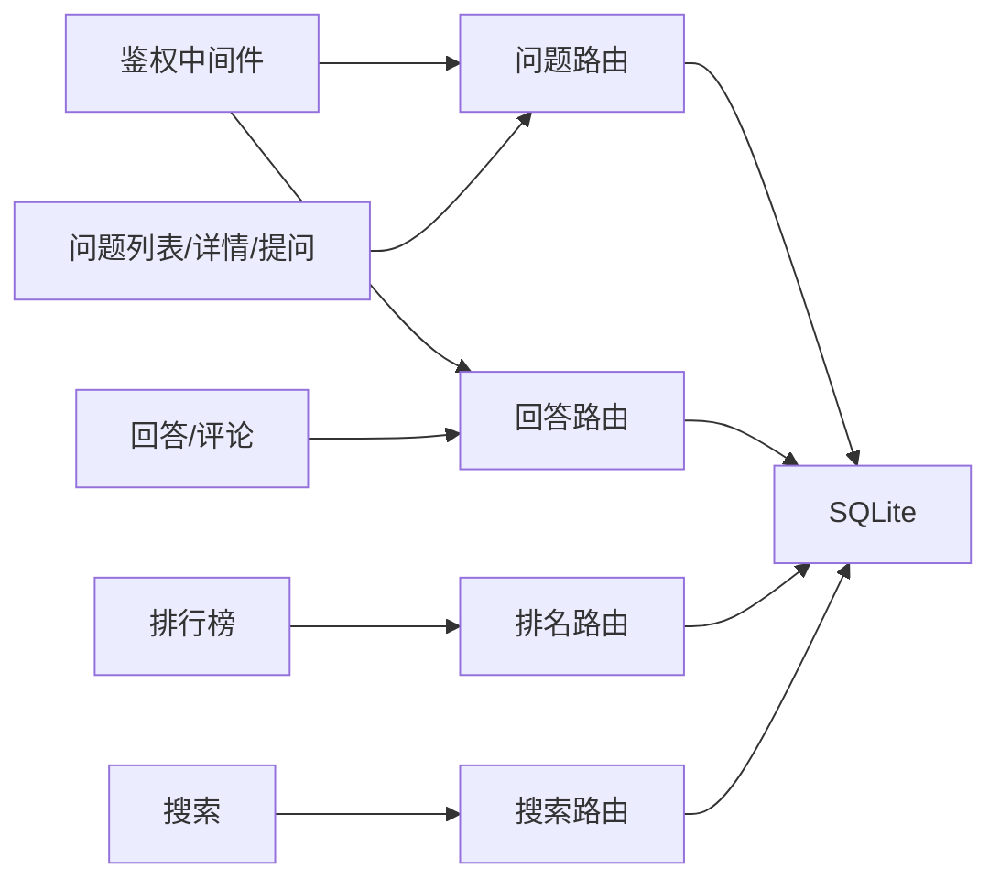

图表来源
- [server/src/middleware/auth.js](file://server/src/middleware/auth.js)
- [server/src/routes/questions.js](file://server/src/routes/questions.js)
- [server/src/routes/answers.js](file://server/src/routes/answers.js)
- [server/src/routes/ranking.js](file://server/src/routes/ranking.js)
- [server/src/routes/search.js](file://server/src/routes/search.js)
- [server/src/db-sqlite.js](file://server/src/db-sqlite.js)

章节来源
- [server/src/index.js](file://server/src/index.js)

## 性能考虑
- 数据库优化：
  - 为高频查询字段建立索引（如 author_id、question_id、is_best、created_at）。
  - 使用分页与限流减少大结果集传输。
- 缓存策略：
  - 对排行榜与搜索结果进行短期缓存，提高命中率。
- 计算优化：
  - 热度分数增量更新，避免全量重算。
  - 搜索索引异步构建，降低写入延迟。

[本节为通用指导，不直接分析具体文件]

## 故障排查指南
- 常见问题：
  - 401/403：鉴权失败或权限不足，检查登录态与角色。
  - 404：资源不存在或路由未注册，确认路径与参数。
  - 500：数据库异常或服务内部错误，查看日志与 SQL 执行计划。
- 定位方法：
  - 启用调试日志，记录请求参数与响应体。
  - 使用数据库慢查询日志定位瓶颈。
  - 前端网络面板检查接口状态码与响应结构。

章节来源
- [server/src/middleware/auth.js](file://server/src/middleware/auth.js)
- [server/src/db-sqlite.js](file://server/src/db-sqlite.js)

## 结论
本问答系统以清晰的模块化设计与 REST 接口实现了完整的问答业务流程，涵盖问题发布、回答与评论、投票排序、搜索筛选、最佳答案采纳、权限控制与内容审核、数据统计与排行榜。通过合理的数据库建模与索引策略、缓存与增量计算优化，系统在可扩展性与性能方面具备良好的基础。

## 附录
- 接口契约参考：详见 API.md。
- 前端页面入口：
  - 问题列表与详情：src/app/questions/*
  - 提问表单：src/app/questions/ask
  - 搜索：src/app/search
  - 排行榜：src/app/rankings/*

章节来源
- [API.md](file://API.md)
- [src/app/questions/page.jsx](file://src/app/questions/page.jsx)
- [src/app/questions/[id]/page.jsx](file://src/app/questions/[id]/page.jsx)
- [src/app/questions/ask/page.jsx](file://src/app/questions/ask/page.jsx)
- [src/app/search/page.jsx](file://src/app/search/page.jsx)
- [src/app/rankings/page.jsx](file://src/app/rankings/page.jsx)
- [src/app/rankings/[type]/page.jsx](file://src/app/rankings/[type]/page.jsx)