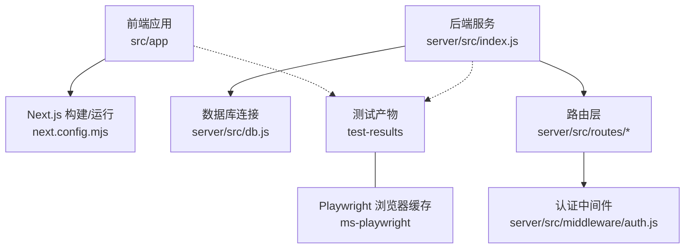
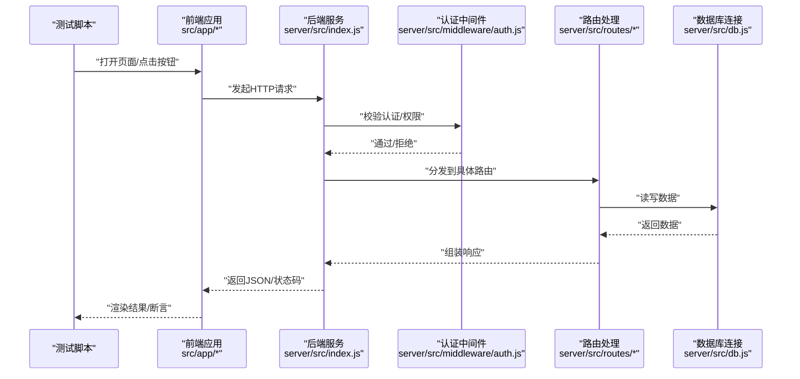
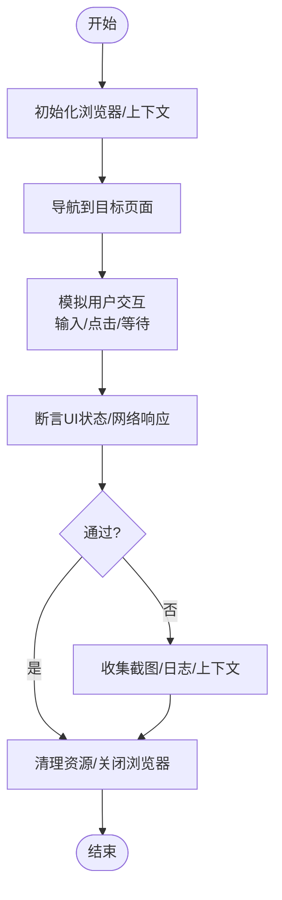
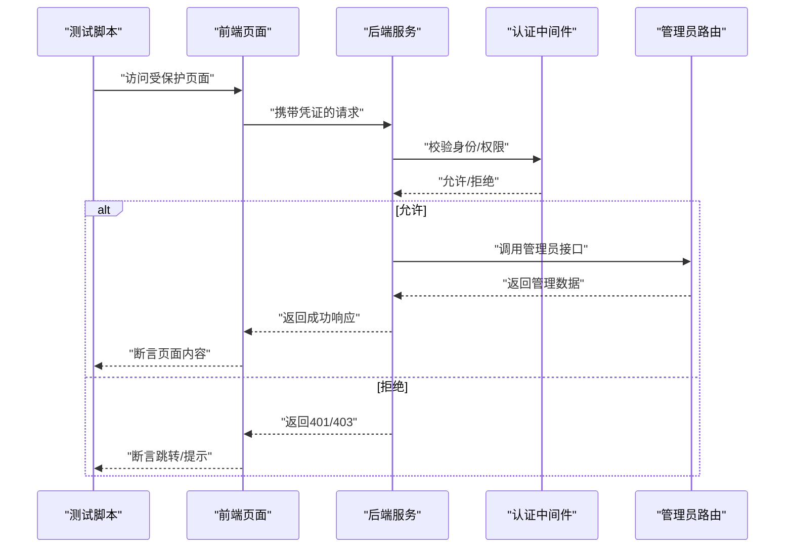
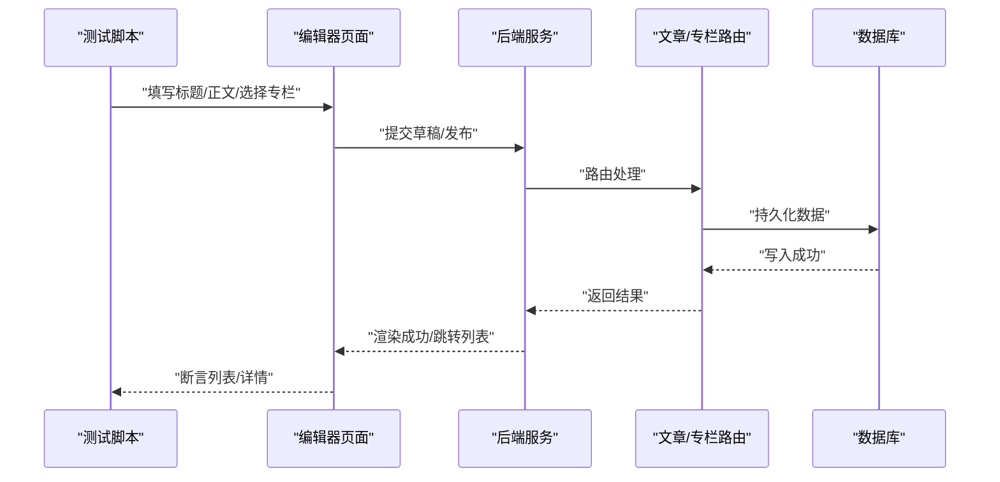
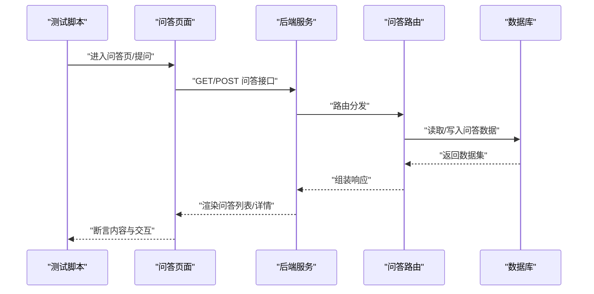
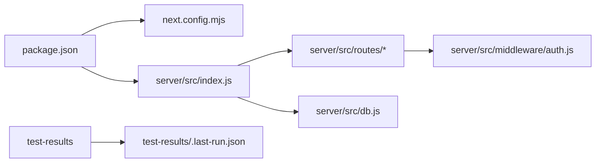

# 测试指南

<cite>
**本文引用的文件**
- [package.json](file://package.json)
- [next.config.mjs](file://next.config.mjs)
- [server/src/index.js](file://server/src/index.js)
- [server/src/db.js](file://server/src/db.js)
- [server/src/routes/auth.js](file://server/src/routes/auth.js)
- [server/src/routes/posts.js](file://server/src/routes/posts.js)
- [server/src/routes/columns.js](file://server/src/routes/columns.js)
- [server/src/routes/questions.js](file://server/src/routes/questions.js)
- [server/src/middleware/auth.js](file://server/src/middleware/auth.js)
- [src/app/layout.jsx](file://src/app/layout.jsx)
- [src/app/page.jsx](file://src/app/page.jsx)
- [src/app/providers.jsx](file://src/app/providers.jsx)
- [test-results/.last-run.json](file://test-results/.last-run.json)
</cite>

## 目录
1. [简介](#简介)
2. [项目结构](#项目结构)
3. [核心组件](#核心组件)
4. [架构总览](#架构总览)
5. [详细组件分析](#详细组件分析)
6. [依赖分析](#依赖分析)
7. [性能考虑](#性能考虑)
8. [故障排查指南](#故障排查指南)
9. [结论](#结论)
10. [附录](#附录)

## 简介
本测试指南面向博客演示项目的端到端与API自动化测试，重点说明：
- 测试策略与分层（单元、集成、端到端）
- Playwright 配置与使用方式
- 测试用例组织与命名规范
- 自动化执行流程与持续集成建议
- 测试环境搭建与数据准备
- 性能/压力测试指导
- 覆盖率统计与分析方法
- 测试结果解读与问题定位技巧
- 最佳实践与常见问题解决方案

## 项目结构
从仓库根目录可见，本项目采用前后端分离的 Next.js + Node.js 后端结构。测试相关产物位于 test-results 目录，Playwright 浏览器缓存位于 ms-playwright 目录。前端应用入口在 src/app 下，后端服务入口在 server/src/index.js。

图表来源
- [next.config.mjs](file://next.config.mjs)
- [server/src/index.js](file://server/src/index.js)
- [server/src/db.js](file://server/src/db.js)
- [server/src/routes/auth.js](file://server/src/routes/auth.js)
- [server/src/routes/posts.js](file://server/src/routes/posts.js)
- [server/src/routes/columns.js](file://server/src/routes/columns.js)
- [server/src/routes/questions.js](file://server/src/routes/questions.js)
- [server/src/middleware/auth.js](file://server/src/middleware/auth.js)
- [test-results/.last-run.json](file://test-results/.last-run.json)

章节来源
- [package.json](file://package.json)
- [next.config.mjs](file://next.config.mjs)
- [server/src/index.js](file://server/src/index.js)
- [server/src/db.js](file://server/src/db.js)
- [src/app/layout.jsx](file://src/app/layout.jsx)
- [src/app/page.jsx](file://src/app/page.jsx)
- [src/app/providers.jsx](file://src/app/providers.jsx)
- [test-results/.last-run.json](file://test-results/.last-run.json)

## 核心组件
- 前端应用
  - 布局与提供者：src/app/layout.jsx、src/app/providers.jsx
  - 首页入口：src/app/page.jsx
- 后端服务
  - 服务启动：server/src/index.js
  - 数据库连接：server/src/db.js
  - 认证中间件：server/src/middleware/auth.js
  - 关键路由：server/src/routes/auth.js、posts.js、columns.js、questions.js
- 测试与工具
  - 测试产物与上次运行记录：test-results/.last-run.json
  - Playwright 浏览器缓存：ms-playwright

章节来源
- [src/app/layout.jsx](file://src/app/layout.jsx)
- [src/app/page.jsx](file://src/app/page.jsx)
- [src/app/providers.jsx](file://src/app/providers.jsx)
- [server/src/index.js](file://server/src/index.js)
- [server/src/db.js](file://server/src/db.js)
- [server/src/middleware/auth.js](file://server/src/middleware/auth.js)
- [server/src/routes/auth.js](file://server/src/routes/auth.js)
- [server/src/routes/posts.js](file://server/src/routes/posts.js)
- [server/src/routes/columns.js](file://server/src/routes/columns.js)
- [server/src/routes/questions.js](file://server/src/routes/questions.js)
- [test-results/.last-run.json](file://test-results/.last-run.json)

## 架构总览
下图展示端到端测试的关键交互路径：测试脚本驱动浏览器访问前端页面，触发业务操作，请求经 Next.js 转发至后端 API，后端通过中间件鉴权后访问数据库并返回结果。

图表来源
- [server/src/index.js](file://server/src/index.js)
- [server/src/middleware/auth.js](file://server/src/middleware/auth.js)
- [server/src/routes/auth.js](file://server/src/routes/auth.js)
- [server/src/routes/posts.js](file://server/src/routes/posts.js)
- [server/src/routes/columns.js](file://server/src/routes/columns.js)
- [server/src/routes/questions.js](file://server/src/routes/questions.js)
- [server/src/db.js](file://server/src/db.js)

## 详细组件分析

### 端到端测试实现（Playwright）
- 目标
  - 验证用户可感知的完整业务流程，如登录、写文章、发布、问答等。
- 浏览器与环境
  - 使用 Chromium 内核（由 ms-playwright 缓存可知），支持无头模式以利于CI。
- 测试产物
  - 失败截图、错误上下文与重试信息保存在 test-results 目录中，便于定位问题。
- 执行记录
  - test-results/.last-run.json 记录了最近一次运行的元信息，可用于调试与回归。

图表来源
- [test-results/.last-run.json](file://test-results/.last-run.json)

章节来源
- [test-results/.last-run.json](file://test-results/.last-run.json)

### 认证与授权测试要点
- 关注点
  - 未登录访问受保护资源的拦截行为
  - 登录成功后的会话/令牌传递
  - 管理员权限控制
- 关键路径
  - 认证中间件对请求进行鉴权，路由根据角色返回不同数据或拒绝访问。

图表来源
- [server/src/middleware/auth.js](file://server/src/middleware/auth.js)
- [server/src/routes/auth.js](file://server/src/routes/auth.js)

章节来源
- [server/src/middleware/auth.js](file://server/src/middleware/auth.js)
- [server/src/routes/auth.js](file://server/src/routes/auth.js)

### 文章与专栏功能测试要点
- 文章创建/编辑/发布
  - 覆盖草稿保存、内容完整性、发布流程、列表更新等场景。
- 专栏管理
  - 覆盖创建、查询、权限控制等场景。
- 关键路由
  - posts.js、columns.js 提供对应能力。

图表来源
- [server/src/routes/posts.js](file://server/src/routes/posts.js)
- [server/src/routes/columns.js](file://server/src/routes/columns.js)
- [server/src/db.js](file://server/src/db.js)

章节来源
- [server/src/routes/posts.js](file://server/src/routes/posts.js)
- [server/src/routes/columns.js](file://server/src/routes/columns.js)
- [server/src/db.js](file://server/src/db.js)

### 问答功能测试要点
- 覆盖问答列表获取、提问、回答、排序等流程。
- 关键路由：questions.js。

图表来源
- [server/src/routes/questions.js](file://server/src/routes/questions.js)
- [server/src/db.js](file://server/src/db.js)

章节来源
- [server/src/routes/questions.js](file://server/src/routes/questions.js)
- [server/src/db.js](file://server/src/db.js)

### 前端应用与测试集成
- 布局与提供者
  - layout.jsx 定义全局布局与上下文；providers.jsx 注入全局状态/主题等。
- 首页
  - page.jsx 作为应用入口，用于导航与首屏渲染。
- 测试建议
  - 针对首页加载、主题切换、导航跳转等进行基础E2E断言。

章节来源
- [src/app/layout.jsx](file://src/app/layout.jsx)
- [src/app/providers.jsx](file://src/app/providers.jsx)
- [src/app/page.jsx](file://src/app/page.jsx)

## 依赖分析
- 运行时依赖
  - 前端：Next.js 应用（由 next.config.mjs 配置）
  - 后端：Node.js 服务（server/src/index.js）
  - 数据库：db.js 负责连接与封装
- 测试依赖
  - Playwright（浏览器缓存位于 ms-playwright）
  - 测试产物输出至 test-results

图表来源
- [package.json](file://package.json)
- [next.config.mjs](file://next.config.mjs)
- [server/src/index.js](file://server/src/index.js)
- [server/src/routes/auth.js](file://server/src/routes/auth.js)
- [server/src/routes/posts.js](file://server/src/routes/posts.js)
- [server/src/routes/columns.js](file://server/src/routes/columns.js)
- [server/src/routes/questions.js](file://server/src/routes/questions.js)
- [server/src/middleware/auth.js](file://server/src/middleware/auth.js)
- [server/src/db.js](file://server/src/db.js)
- [test-results/.last-run.json](file://test-results/.last-run.json)

章节来源
- [package.json](file://package.json)
- [next.config.mjs](file://next.config.mjs)
- [server/src/index.js](file://server/src/index.js)
- [server/src/db.js](file://server/src/db.js)
- [test-results/.last-run.json](file://test-results/.last-run.json)

## 性能考虑
- 指标建议
  - 首屏加载时间、关键交互响应时间、并发下的错误率与吞吐。
- 压测工具
  - 可使用轻量压测工具对后端API进行基准测试，关注CPU/内存占用与数据库慢查询。
- 优化方向
  - 前端：减少重渲染、懒加载、静态资源压缩
  - 后端：接口幂等、分页/索引优化、连接池调优
- 监控与回归
  - 将性能基线纳入CI，设置阈值告警，避免退化。

[本节为通用指导，不直接分析具体文件]

## 故障排查指南
- 常见现象
  - 浏览器启动失败、页面元素不可见、网络超时、鉴权失败。
- 快速定位
  - 查看 test-results 中的错误上下文与截图
  - 检查 last-run.json 了解最近一次运行环境与参数
  - 确认后端服务是否启动、端口是否可用、数据库连接是否正常
- 断言失败
  - 优先复现最小用例，逐步缩小范围
  - 增加等待与重试策略，避免竞态条件
- 权限问题
  - 核对认证中间件逻辑与路由权限控制
  - 确保测试账号具备相应角色与数据

章节来源
- [test-results/.last-run.json](file://test-results/.last-run.json)
- [server/src/middleware/auth.js](file://server/src/middleware/auth.js)
- [server/src/db.js](file://server/src/db.js)

## 结论
通过分层测试策略与Playwright端到端测试，结合清晰的测试产物与错误上下文，可有效保障博客网站的功能稳定性与用户体验。建议在CI中固化执行流程，完善性能基线与覆盖率报告，持续提升质量与交付效率。

[本节为总结性内容，不直接分析具体文件]

## 附录

### 测试策略与框架
- 分层
  - 单元测试：聚焦纯函数与工具模块
  - 集成测试：覆盖API契约与数据库交互
  - 端到端测试：基于Playwright的用户旅程验证
- 框架
  - Playwright：跨浏览器、稳定可靠、内置截图与追踪
  - 可选：Jest/Vitest（单元）、Supertest（API）

[本节为通用指导，不直接分析具体文件]

### Playwright 配置与使用要点
- 浏览器
  - 使用Chromium内核，支持无头模式
- 上下文
  - 合理设置视口、语言、时区与存储状态
- 等待与重试
  - 显式等待元素可见/可点击，必要时启用自动重试
- 截图与追踪
  - 失败时自动收集截图与追踪文件，便于回溯

[本节为通用指导，不直接分析具体文件]

### 测试用例组织与命名规范
- 组织
  - 按功能域划分目录（如 auth、posts、columns、questions）
  - 每个用例文件聚焦单一用户故事
- 命名
  - 使用“模块_功能_步骤”风格，清晰表达意图
  - 示例：auth_登录_成功、posts_创建文章_草稿保存
- 数据
  - 使用工厂/夹具生成测试数据，避免硬编码

[本节为通用指导，不直接分析具体文件]

### 自动化执行流程与持续集成
- 本地执行
  - 安装依赖、启动后端服务、运行测试、查看产物
- CI建议
  - 并行执行用例、缓存浏览器、上传产物与覆盖率报告
  - 失败时发送通知并保留日志

[本节为通用指导，不直接分析具体文件]

### 测试环境搭建与配置
- 前置条件
  - Node.js 环境、数据库可用
- 环境变量
  - 配置后端端口、数据库连接、第三方服务密钥
- 数据准备
  - 使用种子脚本或夹具初始化必要数据

[本节为通用指导，不直接分析具体文件]

### 测试数据准备与管理策略
- 原则
  - 隔离、可重复、最小化
- 策略
  - 事务回滚、快照对比、随机化敏感字段
  - 分环境数据（开发/测试/预发）

[本节为通用指导，不直接分析具体文件]

### 性能测试与压力测试指导
- 场景
  - 登录风暴、批量发布、搜索高并发
- 指标
  - P95/P99延迟、错误率、资源利用率
- 工具
  - 压测工具+APM监控，建立基线与回归阈值

[本节为通用指导，不直接分析具体文件]

### 测试覆盖率统计与分析
- 指标
  - 语句、分支、函数、行覆盖率
- 工具
  - 前端：V8/Istanbul；后端：Istanbul/Coverage
- 分析
  - 关注低覆盖热点与复杂分支，补充用例

[本节为通用指导，不直接分析具体文件]

### 测试结果解读与问题定位技巧
- 解读
  - 区分UI断言失败与网络/鉴权失败
  - 关注时序问题与异步竞态
- 技巧
  - 录制回放、分段断言、最小复现、日志增强

[本节为通用指导，不直接分析具体文件]

### 最佳实践与常见问题
- 最佳实践
  - 用例独立、幂等、可并行；失败即捕获上下文
  - 明确等待策略，避免脆弱断言
- 常见问题
  - 元素不可见：检查滚动/模态框/动态渲染
  - 鉴权失败：确认Cookie/Token/角色
  - 数据库不一致：使用事务/回滚/固定种子数据

[本节为通用指导，不直接分析具体文件]