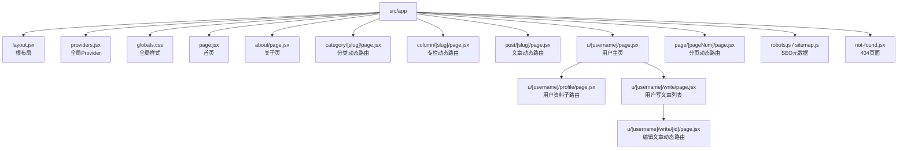
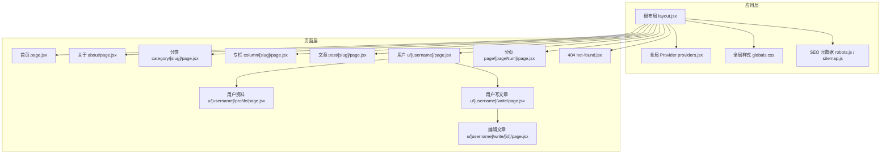
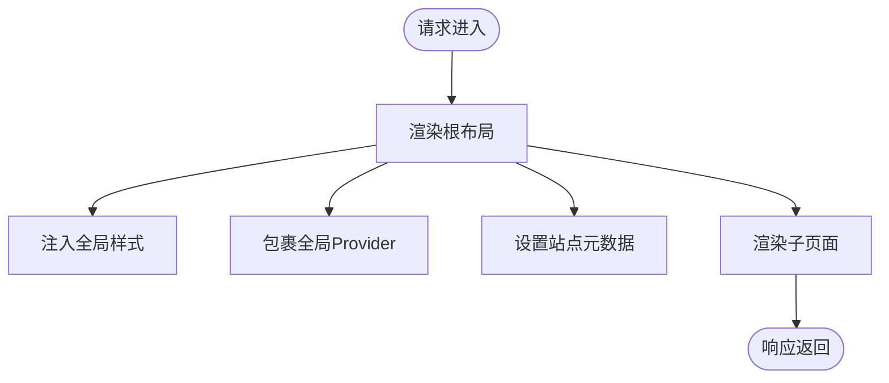
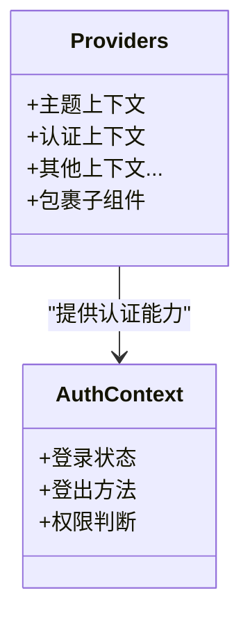
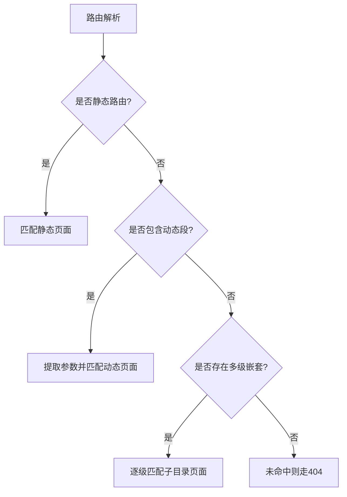
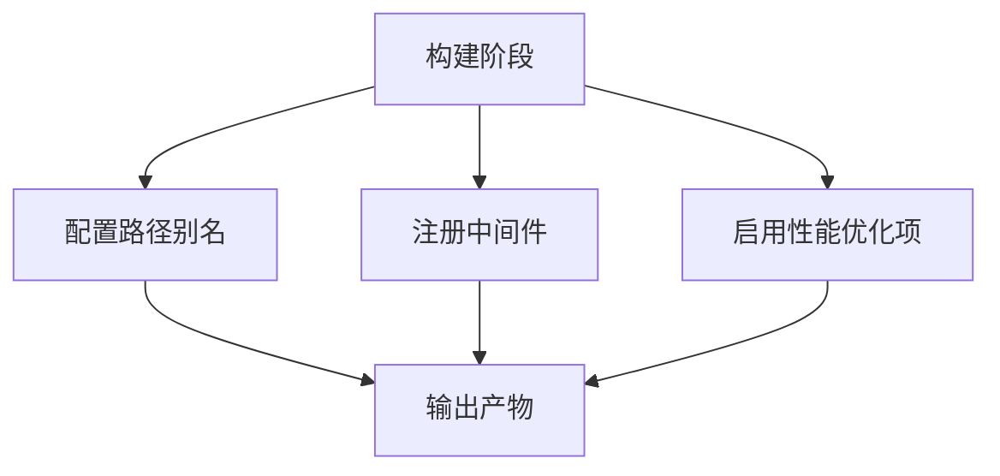
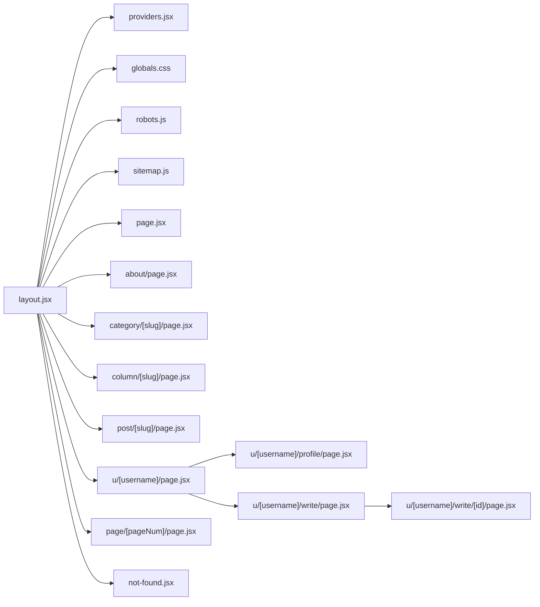

# Next.js应用结构

<cite>
**本文引用的文件**   
- [next.config.mjs](file://next.config.mjs)
- [src/app/layout.jsx](file://src/app/layout.jsx)
- [src/app/providers.jsx](file://src/app/providers.jsx)
- [src/app/globals.css](file://src/app/globals.css)
- [src/app/page.jsx](file://src/app/page.jsx)
- [src/app/about/page.jsx](file://src/app/about/page.jsx)
- [src/app/category/[slug]/page.jsx](file://src/app/category/[slug]/page.jsx)
- [src/app/column/[slug]/page.jsx](file://src/app/column/[slug]/page.jsx)
- [src/app/post/[slug]/page.jsx](file://src/app/post/[slug]/page.jsx)
- [src/app/u/[username]/page.jsx](file://src/app/u/[username]/page.jsx)
- [src/app/u/[username]/profile/page.jsx](file://src/app/u/[username]/profile/page.jsx)
- [src/app/u/[username]/write/page.jsx](file://src/app/u/[username]/write/page.jsx)
- [src/app/u/[username]/write/[id]/page.jsx](file://src/app/u/[username]/write/[id]/page.jsx)
- [src/app/page/[pageNum]/page.jsx](file://src/app/page/[pageNum]/page.jsx)
- [src/app/robots.js](file://src/app/robots.js)
- [src/app/sitemap.js](file://src/app/sitemap.js)
- [src/app/not-found.jsx](file://src/app/not-found.jsx)
- [src/context/AuthContext.tsx](file://src/context/AuthContext.tsx)
</cite>

## 目录
1. [简介](#简介)
2. [项目结构](#项目结构)
3. [核心组件](#核心组件)
4. [架构总览](#架构总览)
5. [详细组件分析](#详细组件分析)
6. [依赖关系分析](#依赖关系分析)
7. [性能考虑](#性能考虑)
8. [故障排查指南](#故障排查指南)
9. [结论](#结论)
10. [附录](#附录)

## 简介
本文件面向基于Next.js App Router的前端工程，系统化梳理根布局、全局Provider、页面组织策略与构建配置等关键设计。重点说明：
- 根布局组件如何承载全局样式注入、上下文提供者装配与元数据管理
- 页面路由的组织方式（静态、动态、嵌套）
- 全局Provider的拆分与组合模式
- next.config.mjs中的路径别名、中间件与性能优化选项
- 如何在现有架构上扩展新的功能模块

## 项目结构
本项目采用App Router约定式路由，核心前端代码位于src/app目录；全局样式、布局与Provider集中在该目录根部；页面按功能域分目录组织，支持静态路由、动态路由参数与多级嵌套。

图表来源
- [src/app/layout.jsx](file://src/app/layout.jsx)
- [src/app/providers.jsx](file://src/app/providers.jsx)
- [src/app/globals.css](file://src/app/globals.css)
- [src/app/page.jsx](file://src/app/page.jsx)
- [src/app/about/page.jsx](file://src/app/about/page.jsx)
- [src/app/category/[slug]/page.jsx](file://src/app/category/[slug]/page.jsx)
- [src/app/column/[slug]/page.jsx](file://src/app/column/[slug]/page.jsx)
- [src/app/post/[slug]/page.jsx](file://src/app/post/[slug]/page.jsx)
- [src/app/u/[username]/page.jsx](file://src/app/u/[username]/page.jsx)
- [src/app/u/[username]/profile/page.jsx](file://src/app/u/[username]/profile/page.jsx)
- [src/app/u/[username]/write/page.jsx](file://src/app/u/[username]/write/page.jsx)
- [src/app/u/[username]/write/[id]/page.jsx](file://src/app/u/[username]/write/[id]/page.jsx)
- [src/app/page/[pageNum]/page.jsx](file://src/app/page/[pageNum]/page.jsx)
- [src/app/robots.js](file://src/app/robots.js)
- [src/app/sitemap.js](file://src/app/sitemap.js)
- [src/app/not-found.jsx](file://src/app/not-found.jsx)

章节来源
- [src/app/layout.jsx](file://src/app/layout.jsx)
- [src/app/providers.jsx](file://src/app/providers.jsx)
- [src/app/globals.css](file://src/app/globals.css)
- [src/app/page.jsx](file://src/app/page.jsx)
- [src/app/about/page.jsx](file://src/app/about/page.jsx)
- [src/app/category/[slug]/page.jsx](file://src/app/category/[slug]/page.jsx)
- [src/app/column/[slug]/page.jsx](file://src/app/column/[slug]/page.jsx)
- [src/app/post/[slug]/page.jsx](file://src/app/post/[slug]/page.jsx)
- [src/app/u/[username]/page.jsx](file://src/app/u/[username]/page.jsx)
- [src/app/u/[username]/profile/page.jsx](file://src/app/u/[username]/profile/page.jsx)
- [src/app/u/[username]/write/page.jsx](file://src/app/u/[username]/write/page.jsx)
- [src/app/u/[username]/write/[id]/page.jsx](file://src/app/u/[username]/write/[id]/page.jsx)
- [src/app/page/[pageNum]/page.jsx](file://src/app/page/[pageNum]/page.jsx)
- [src/app/robots.js](file://src/app/robots.js)
- [src/app/sitemap.js](file://src/app/sitemap.js)
- [src/app/not-found.jsx](file://src/app/not-found.jsx)

## 核心组件
- 根布局组件：负责包裹所有页面，注入全局样式、提供主题与认证等上下文，并集中管理站点级元数据（如标题、描述、图标、SEO）。
- 全局Provider：将主题、认证等上下文在应用启动时统一装配，避免在各页面重复引入。
- 全局样式：通过CSS或CSS Modules在根布局中一次性引入，确保全站一致的主题与基础样式。
- 页面组织：静态路由用于固定页面（如关于），动态路由使用方括号语法处理URL参数，嵌套路由通过子目录实现层级化页面。

章节来源
- [src/app/layout.jsx](file://src/app/layout.jsx)
- [src/app/providers.jsx](file://src/app/providers.jsx)
- [src/app/globals.css](file://src/app/globals.css)
- [src/app/page.jsx](file://src/app/page.jsx)
- [src/app/about/page.jsx](file://src/app/about/page.jsx)
- [src/app/category/[slug]/page.jsx](file://src/app/category/[slug]/page.jsx)
- [src/app/column/[slug]/page.jsx](file://src/app/column/[slug]/page.jsx)
- [src/app/post/[slug]/page.jsx](file://src/app/post/[slug]/page.jsx)
- [src/app/u/[username]/page.jsx](file://src/app/u/[username]/page.jsx)
- [src/app/u/[username]/profile/page.jsx](file://src/app/u/[username]/profile/page.jsx)
- [src/app/u/[username]/write/page.jsx](file://src/app/u/[username]/write/page.jsx)
- [src/app/u/[username]/write/[id]/page.jsx](file://src/app/u/[username]/write/[id]/page.jsx)
- [src/app/page/[pageNum]/page.jsx](file://src/app/page/[pageNum]/page.jsx)
- [src/app/robots.js](file://src/app/robots.js)
- [src/app/sitemap.js](file://src/app/sitemap.js)
- [src/app/not-found.jsx](file://src/app/not-found.jsx)

## 架构总览
下图展示了App Router下“根布局—Provider—页面”的整体协作关系，以及SEO元数据的生成位置。

图表来源
- [src/app/layout.jsx](file://src/app/layout.jsx)
- [src/app/providers.jsx](file://src/app/providers.jsx)
- [src/app/globals.css](file://src/app/globals.css)
- [src/app/page.jsx](file://src/app/page.jsx)
- [src/app/about/page.jsx](file://src/app/about/page.jsx)
- [src/app/category/[slug]/page.jsx](file://src/app/category/[slug]/page.jsx)
- [src/app/column/[slug]/page.jsx](file://src/app/column/[slug]/page.jsx)
- [src/app/post/[slug]/page.jsx](file://src/app/post/[slug]/page.jsx)
- [src/app/u/[username]/page.jsx](file://src/app/u/[username]/page.jsx)
- [src/app/u/[username]/profile/page.jsx](file://src/app/u/[username]/profile/page.jsx)
- [src/app/u/[username]/write/page.jsx](file://src/app/u/[username]/write/page.jsx)
- [src/app/u/[username]/write/[id]/page.jsx](file://src/app/u/[username]/write/[id]/page.jsx)
- [src/app/page/[pageNum]/page.jsx](file://src/app/page/[pageNum]/page.jsx)
- [src/app/robots.js](file://src/app/robots.js)
- [src/app/sitemap.js](file://src/app/sitemap.js)
- [src/app/not-found.jsx](file://src/app/not-found.jsx)

## 详细组件分析

### 根布局组件（layout.jsx）
职责与设计要点：
- 作为所有页面的共同容器，渲染html/body骨架
- 注入全局样式（例如全局CSS文件）
- 包裹全局Provider（主题、认证等），使整棵组件树可访问上下文
- 集中管理站点级元数据（标题、描述、图标、Open Graph等），也可由具体页面覆盖
- 提供统一的错误边界与加载状态（可选）

图表来源
- [src/app/layout.jsx](file://src/app/layout.jsx)
- [src/app/globals.css](file://src/app/globals.css)
- [src/app/providers.jsx](file://src/app/providers.jsx)
- [src/app/robots.js](file://src/app/robots.js)
- [src/app/sitemap.js](file://src/app/sitemap.js)

章节来源
- [src/app/layout.jsx](file://src/app/layout.jsx)
- [src/app/globals.css](file://src/app/globals.css)
- [src/app/providers.jsx](file://src/app/providers.jsx)
- [src/app/robots.js](file://src/app/robots.js)
- [src/app/sitemap.js](file://src/app/sitemap.js)

### 全局Provider（providers.jsx）
职责与设计要点：
- 聚合多个上下文提供者（如主题、认证、国际化等）
- 在根布局中一次性包裹，避免各页面重复引入
- 为后续业务组件提供稳定的运行时环境

图表来源
- [src/app/providers.jsx](file://src/app/providers.jsx)
- [src/context/AuthContext.tsx](file://src/context/AuthContext.tsx)

章节来源
- [src/app/providers.jsx](file://src/app/providers.jsx)
- [src/context/AuthContext.tsx](file://src/context/AuthContext.tsx)

### 页面组织策略
- 静态路由：固定路径的页面，如“关于”页面
- 动态路由：使用方括号命名参数，如分类、专栏、文章详情、用户主页、分页等
- 嵌套路由：通过子目录形成层级结构，如用户主页下的“个人资料”、“写文章列表”和“编辑文章”

图表来源
- [src/app/about/page.jsx](file://src/app/about/page.jsx)
- [src/app/category/[slug]/page.jsx](file://src/app/category/[slug]/page.jsx)
- [src/app/column/[slug]/page.jsx](file://src/app/column/[slug]/page.jsx)
- [src/app/post/[slug]/page.jsx](file://src/app/post/[slug]/page.jsx)
- [src/app/u/[username]/page.jsx](file://src/app/u/[username]/page.jsx)
- [src/app/u/[username]/profile/page.jsx](file://src/app/u/[username]/profile/page.jsx)
- [src/app/u/[username]/write/page.jsx](file://src/app/u/[username]/write/page.jsx)
- [src/app/u/[username]/write/[id]/page.jsx](file://src/app/u/[username]/write/[id]/page.jsx)
- [src/app/page/[pageNum]/page.jsx](file://src/app/page/[pageNum]/page.jsx)
- [src/app/not-found.jsx](file://src/app/not-found.jsx)

章节来源
- [src/app/about/page.jsx](file://src/app/about/page.jsx)
- [src/app/category/[slug]/page.jsx](file://src/app/category/[slug]/page.jsx)
- [src/app/column/[slug]/page.jsx](file://src/app/column/[slug]/page.jsx)
- [src/app/post/[slug]/page.jsx](file://src/app/post/[slug]/page.jsx)
- [src/app/u/[username]/page.jsx](file://src/app/u/[username]/page.jsx)
- [src/app/u/[username]/profile/page.jsx](file://src/app/u/[username]/profile/page.jsx)
- [src/app/u/[username]/write/page.jsx](file://src/app/u/[username]/write/page.jsx)
- [src/app/u/[username]/write/[id]/page.jsx](file://src/app/u/[username]/write/[id]/page.jsx)
- [src/app/page/[pageNum]/page.jsx](file://src/app/page/[pageNum]/page.jsx)
- [src/app/not-found.jsx](file://src/app/not-found.jsx)

### 构建配置（next.config.mjs）
常见关注点：
- 路径别名：简化导入路径，提升可读性与维护性
- 中间件：统一鉴权、日志、重定向等横切逻辑
- 性能优化：图片、字体、脚本加载策略，缓存与压缩等

图表来源
- [next.config.mjs](file://next.config.mjs)

章节来源
- [next.config.mjs](file://next.config.mjs)

## 依赖关系分析
- 根布局依赖全局Provider与全局样式，并为所有页面提供一致的上下文与样式环境
- 页面组件按需引入业务逻辑与UI组件，并通过路由参数获取数据
- SEO元数据由站点级与页面级共同构成，便于统一管理与局部覆盖

图表来源
- [src/app/layout.jsx](file://src/app/layout.jsx)
- [src/app/providers.jsx](file://src/app/providers.jsx)
- [src/app/globals.css](file://src/app/globals.css)
- [src/app/page.jsx](file://src/app/page.jsx)
- [src/app/about/page.jsx](file://src/app/about/page.jsx)
- [src/app/category/[slug]/page.jsx](file://src/app/category/[slug]/page.jsx)
- [src/app/column/[slug]/page.jsx](file://src/app/column/[slug]/page.jsx)
- [src/app/post/[slug]/page.jsx](file://src/app/post/[slug]/page.jsx)
- [src/app/u/[username]/page.jsx](file://src/app/u/[username]/page.jsx)
- [src/app/u/[username]/profile/page.jsx](file://src/app/u/[username]/profile/page.jsx)
- [src/app/u/[username]/write/page.jsx](file://src/app/u/[username]/write/page.jsx)
- [src/app/u/[username]/write/[id]/page.jsx](file://src/app/u/[username]/write/[id]/page.jsx)
- [src/app/page/[pageNum]/page.jsx](file://src/app/page/[pageNum]/page.jsx)
- [src/app/robots.js](file://src/app/robots.js)
- [src/app/sitemap.js](file://src/app/sitemap.js)
- [src/app/not-found.jsx](file://src/app/not-found.jsx)

章节来源
- [src/app/layout.jsx](file://src/app/layout.jsx)
- [src/app/providers.jsx](file://src/app/providers.jsx)
- [src/app/globals.css](file://src/app/globals.css)
- [src/app/page.jsx](file://src/app/page.jsx)
- [src/app/about/page.jsx](file://src/app/about/page.jsx)
- [src/app/category/[slug]/page.jsx](file://src/app/category/[slug]/page.jsx)
- [src/app/column/[slug]/page.jsx](file://src/app/column/[slug]/page.jsx)
- [src/app/post/[slug]/page.jsx](file://src/app/post/[slug]/page.jsx)
- [src/app/u/[username]/page.jsx](file://src/app/u/[username]/page.jsx)
- [src/app/u/[username]/profile/page.jsx](file://src/app/u/[username]/profile/page.jsx)
- [src/app/u/[username]/write/page.jsx](file://src/app/u/[username]/write/page.jsx)
- [src/app/u/[username]/write/[id]/page.jsx](file://src/app/u/[username]/write/[id]/page.jsx)
- [src/app/page/[pageNum]/page.jsx](file://src/app/page/[pageNum]/page.jsx)
- [src/app/robots.js](file://src/app/robots.js)
- [src/app/sitemap.js](file://src/app/sitemap.js)
- [src/app/not-found.jsx](file://src/app/not-found.jsx)

## 性能考虑
- 路由级代码分割：每个页面独立打包，按需加载，减少首屏体积
- 资源预取与预加载：对高频导航目标进行预取，缩短跳转延迟
- 图片与字体优化：开启内置优化与缓存策略，降低带宽占用
- 中间件执行时机：将轻量校验前置，避免不必要的服务器渲染开销
- 元数据集中管理：减少重复计算与网络请求，提高SEO一致性

[本节为通用指导，不直接分析具体文件]

## 故障排查指南
- 路由未命中：检查是否存在对应静态/动态/嵌套页面，确认参数名与路径一致
- 404页面未生效：确认未找到页面是否正确导出，且未被更具体的路由拦截
- 上下文不可用：确认Provider已在根布局正确包裹，且组件在Provider作用域内
- 样式未生效：确认全局样式在根布局中引入，且无冲突选择器
- 构建失败：检查next.config.mjs中的别名与插件配置是否与导入路径一致

章节来源
- [src/app/not-found.jsx](file://src/app/not-found.jsx)
- [src/app/layout.jsx](file://src/app/layout.jsx)
- [src/app/providers.jsx](file://src/app/providers.jsx)
- [src/app/globals.css](file://src/app/globals.css)
- [next.config.mjs](file://next.config.mjs)

## 结论
通过根布局统一注入样式与上下文、集中管理元数据，配合清晰的页面组织策略与合理的构建配置，可在保证开发体验的同时获得良好的性能与可维护性。建议在新增功能时遵循既有模式：在根布局与Provider中扩展共享能力，在app目录下按功能域组织页面，并在构建配置中保持简洁与可演进。

[本节为总结性内容，不直接分析具体文件]

## 附录
- 扩展示例（以路径引用代替代码片段）
  - 在根布局中添加新的全局样式：参考 [src/app/layout.jsx](file://src/app/layout.jsx) 与 [src/app/globals.css](file://src/app/globals.css)
  - 新增一个全局Provider（如国际化）：参考 [src/app/providers.jsx](file://src/app/providers.jsx) 与 [src/context/AuthContext.tsx](file://src/context/AuthContext.tsx)
  - 新增静态页面：参考 [src/app/about/page.jsx](file://src/app/about/page.jsx)
  - 新增动态路由页面：参考 [src/app/post/[slug]/page.jsx](file://src/app/post/[slug]/page.jsx)
  - 新增嵌套路由：参考 [src/app/u/[username]/write/[id]/page.jsx](file://src/app/u/[username]/write/[id]/page.jsx)
  - 调整构建配置（别名/中间件/优化）：参考 [next.config.mjs](file://next.config.mjs)