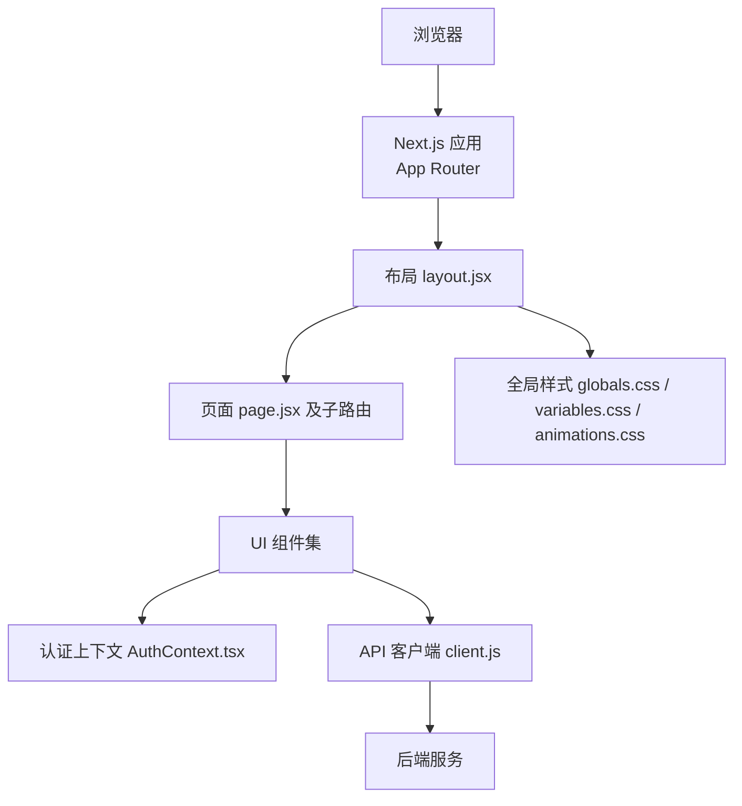
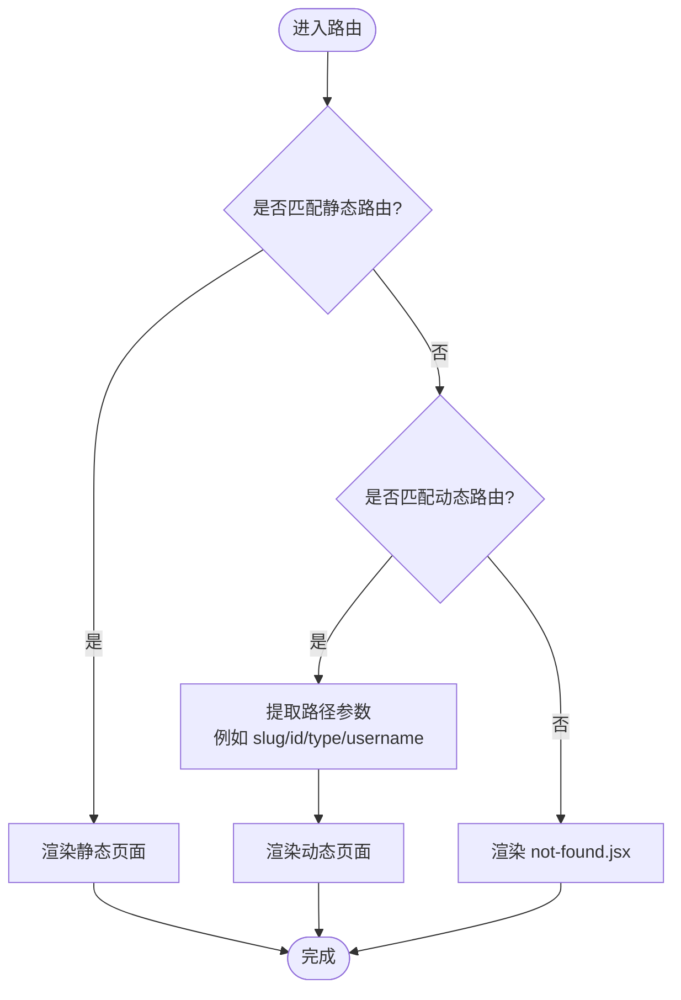
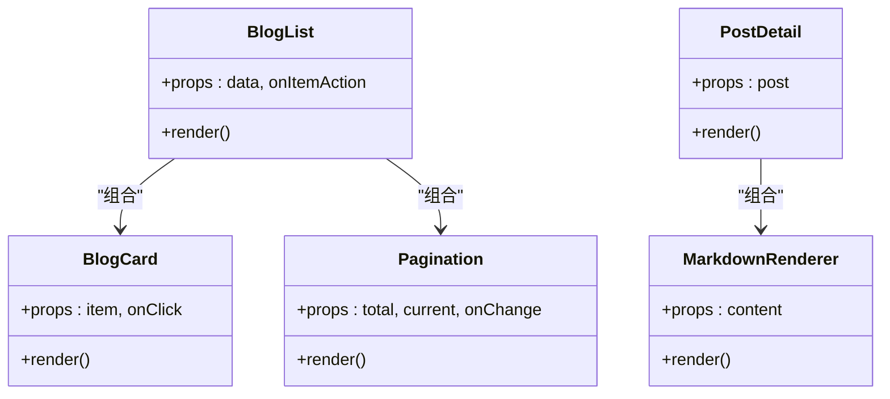
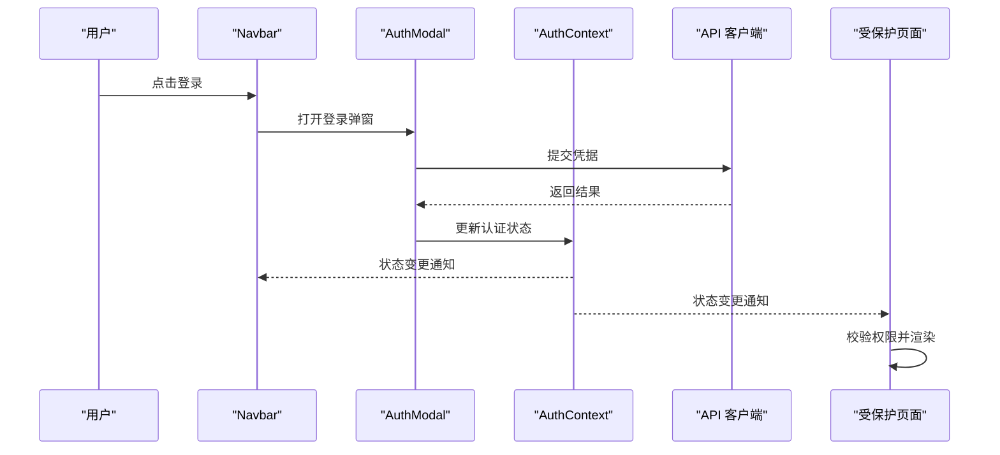
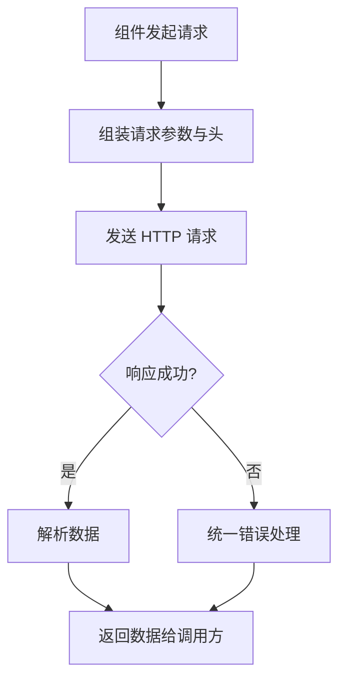
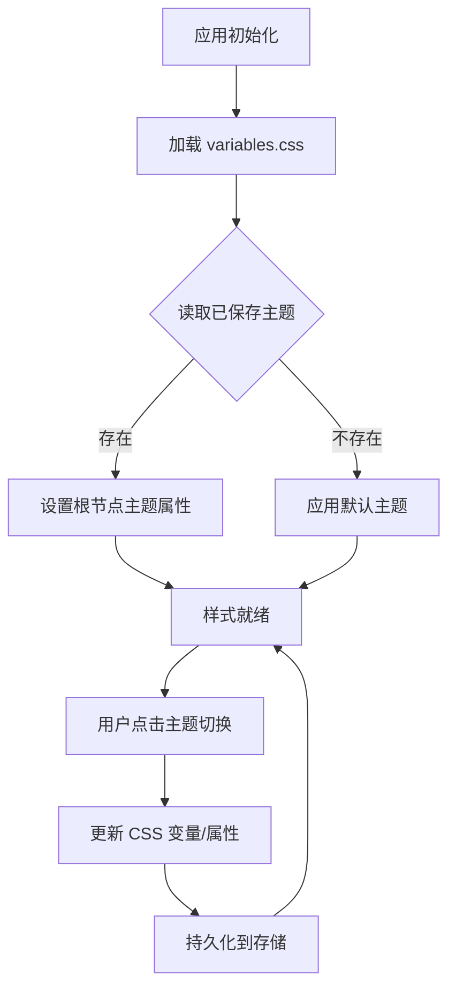
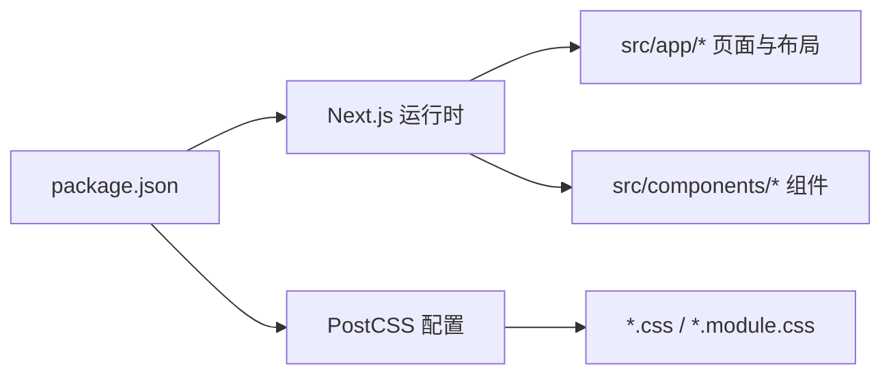

# 前端架构设计

<cite>
**本文引用的文件**   
- [next.config.mjs](file://next.config.mjs)
- [postcss.config.mjs](file://postcss.config.mjs)
- [package.json](file://package.json)
- [src/app/layout.jsx](file://src/app/layout.jsx)
- [src/app/page.jsx](file://src/app/page.jsx)
- [src/app/providers.jsx](file://src/app/providers.jsx)
- [src/app/globals.css](file://src/app/globals.css)
- [src/app/home-client.jsx](file://src/app/home-client.jsx)
- [src/app/about/page.jsx](file://src/app/about/page.jsx)
- [src/app/category/[slug]/page.jsx](file://src/app/category/[slug]/page.jsx)
- [src/app/column/[slug]/page.jsx](file://src/app/column/[slug]/page.jsx)
- [src/app/columns/page.jsx](file://src/app/columns/page.jsx)
- [src/app/post/[slug]/page.jsx](file://src/app/post/[slug]/page.jsx)
- [src/app/post/[slug]/client.jsx](file://src/app/post/[slug]/client.jsx)
- [src/app/page/[pageNum]/page.jsx](file://src/app/page/[pageNum]/page.jsx)
- [src/app/questions/page.jsx](file://src/app/questions/page.jsx)
- [src/app/questions/[id]/page.jsx](file://src/app/questions/[id]/page.jsx)
- [src/app/questions/ask/page.jsx](file://src/app/questions/ask/page.jsx)
- [src/app/rankings/page.jsx](file://src/app/rankings/page.jsx)
- [src/app/rankings/[type]/page.jsx](file://src/app/rankings/[type]/page.jsx)
- [src/app/search/page.jsx](file://src/app/search/page.jsx)
- [src/app/u/[username]/page.jsx](file://src/app/u/[username]/page.jsx)
- [src/app/u/[username]/profile/page.jsx](file://src/app/u/[username]/profile/page.jsx)
- [src/app/u/[username]/write/page.jsx](file://src/app/u/[username]/write/page.jsx)
- [src/app/u/[username]/write/[id]/page.jsx](file://src/app/u/[username]/write/[id]/page.jsx)
- [src/app/not-found.jsx](file://src/app/not-found.jsx)
- [src/context/AuthContext.tsx](file://src/context/AuthContext.tsx)
- [src/api/client.js](file://src/api/client.js)
- [src/components/Navbar/navbar.jsx](file://src/components/Navbar/navbar.jsx)
- [src/components/Footer/Footer.jsx](file://src/components/Footer/Footer.jsx)
- [src/components/BlogCard/BlogCard.jsx](file://src/components/BlogCard/BlogCard.jsx)
- [src/components/BlogList/BlogList.jsx](file://src/components/BlogList/BlogList.jsx)
- [src/components/Pagination/Pagination.jsx](file://src/components/Pagination/Pagination.jsx)
- [src/components/SearchModal/searchmodal.jsx](file://src/components/SearchModal/searchmodal.jsx)
- [src/components/AuthModal/AuthModal.jsx](file://src/components/AuthModal/AuthModal.jsx)
- [src/components/ThemeToggle/ThemeToggle.jsx](file://src/components/ThemeToggle/ThemeToggle.jsx)
- [src/components/FollowButton/followbutton.jsx](file://src/components/FollowButton/followbutton.jsx)
- [src/components/CommentSection/CommentSection.jsx](file://src/components/CommentSection/CommentSection.jsx)
- [src/components/ShareButtons/ShareButtons.jsx](file://src/components/ShareButtons/ShareButtons.jsx)
- [src/components/Sidebar/Sidebar.jsx](file://src/components/Sidebar/Sidebar.jsx)
- [src/components/Carousel/Carousel.jsx](file://src/components/Carousel/Carousel.jsx)
- [src/components/HeroCarousel/](file://src/components/HeroCarousel/)
- [src/components/MarkdownRenderer/index.jsx](file://src/components/MarkdownRenderer/index.jsx)
- [src/components/Toast/Toast.jsx](file://src/components/Toast/Toast.jsx)
- [src/styles/global.css](file://src/styles/global.css)
- [src/styles/variables.css](file://src/styles/variables.css)
- [src/styles/animations.css](file://src/styles/animations.css)
</cite>

## 目录
1. [简介](#简介)
2. [项目结构](#项目结构)
3. [核心组件](#核心组件)
4. [架构总览](#架构总览)
5. [详细组件分析](#详细组件分析)
6. [依赖关系分析](#依赖关系分析)
7. [性能考虑](#性能考虑)
8. [故障排查指南](#故障排查指南)
9. [结论](#结论)
10. [附录](#附录)

## 简介
本文件面向基于 Next.js 的前端应用，系统性阐述 App Router 路由体系、组件化架构、认证状态管理（React Context）、API 客户端统一封装、样式架构与主题切换、构建配置与优化策略。文档以“渐进式复杂度”组织内容，既提供高层概览，也给出代码级映射与可视化图示，帮助读者快速理解并落地实践。

## 项目结构
本项目采用 Next.js App Router 的目录约定：
- src/app 下按功能域组织页面与布局，支持动态路由与嵌套路由
- src/components 为可复用 UI 组件库，按功能模块拆分目录
- src/context 提供全局上下文（如认证状态）
- src/api 统一封装 API 客户端
- src/styles 存放全局样式、变量与动画等
- public 放置静态资源
- next.config.mjs、postcss.config.mjs 为构建与样式处理配置

```mermaid
graph TB
subgraph "应用入口"
L["layout.jsx"]
P["page.jsx"]
Prov["providers.jsx"]
end
subgraph "页面路由"
A["about/page.jsx"]
C["category/[slug]/page.jsx"]
COL["column/[slug]/page.jsx"]
COLS["columns/page.jsx"]
POST["post/[slug]/page.jsx"]
PG["page/[pageNum]/page.jsx"]
QP["questions/page.jsx"]
QD["questions/[id]/page.jsx"]
QA["questions/ask/page.jsx"]
R["rankings/page.jsx"]
RT["rankings/[type]/page.jsx"]
S["search/page.jsx"]
U["u/[username]/page.jsx"]
UP["u/[username]/profile/page.jsx"]
UW["u/[username]/write/page.jsx"]
UWI["u/[username]/write/[id]/page.jsx"]
NF["not-found.jsx"]
end
subgraph "UI 组件"
NAV["Navbar/navbar.jsx"]
FOOT["Footer/Footer.jsx"]
CARD["BlogCard/BlogCard.jsx"]
LIST["BlogList/BlogList.jsx"]
PAG["Pagination/Pagination.jsx"]
SM["SearchModal/searchmodal.jsx"]
AM["AuthModal/AuthModal.jsx"]
TT["ThemeToggle/ThemeToggle.jsx"]
FB["FollowButton/followbutton.jsx"]
CS["CommentSection/CommentSection.jsx"]
SB["Sidebar/Sidebar.jsx"]
CAR["Carousel/Carousel.jsx"]
MR["MarkdownRenderer/index.jsx"]
TOAST["Toast/Toast.jsx"]
end
subgraph "全局能力"
AC["context/AuthContext.tsx"]
API["api/client.js"]
GCSS["app/globals.css"]
STV["styles/variables.css"]
STA["styles/animations.css"]
end
L --> NAV
L --> FOOT
L --> Prov
Prov --> AC
P --> LIST
LIST --> CARD
POST --> MR
U --> UP
U --> UW
UW --> UWI
QP --> QD
QP --> QA
R --> RT
C --> |动态参数| C
COL --> |动态参数| COL
U --> |动态参数| U
PG --> |分页参数| PG
RT --> |类型参数| RT
UWI --> |编辑参数| UWI
NAV --> API
AM --> API
AC --> API
GCSS --> STV
GCSS --> STA
```

图表来源
- [src/app/layout.jsx](file://src/app/layout.jsx)
- [src/app/page.jsx](file://src/app/page.jsx)
- [src/app/providers.jsx](file://src/app/providers.jsx)
- [src/app/about/page.jsx](file://src/app/about/page.jsx)
- [src/app/category/[slug]/page.jsx](file://src/app/category/[slug]/page.jsx)
- [src/app/column/[slug]/page.jsx](file://src/app/column/[slug]/page.jsx)
- [src/app/columns/page.jsx](file://src/app/columns/page.jsx)
- [src/app/post/[slug]/page.jsx](file://src/app/post/[slug]/page.jsx)
- [src/app/page/[pageNum]/page.jsx](file://src/app/page/[pageNum]/page.jsx)
- [src/app/questions/page.jsx](file://src/app/questions/page.jsx)
- [src/app/questions/[id]/page.jsx](file://src/app/questions/[id]/page.jsx)
- [src/app/questions/ask/page.jsx](file://src/app/questions/ask/page.jsx)
- [src/app/rankings/page.jsx](file://src/app/rankings/page.jsx)
- [src/app/rankings/[type]/page.jsx](file://src/app/rankings/[type]/page.jsx)
- [src/app/search/page.jsx](file://src/app/search/page.jsx)
- [src/app/u/[username]/page.jsx](file://src/app/u/[username]/page.jsx)
- [src/app/u/[username]/profile/page.jsx](file://src/app/u/[username]/profile/page.jsx)
- [src/app/u/[username]/write/page.jsx](file://src/app/u/[username]/write/page.jsx)
- [src/app/u/[username]/write/[id]/page.jsx](file://src/app/u/[username]/write/[id]/page.jsx)
- [src/app/not-found.jsx](file://src/app/not-found.jsx)
- [src/components/Navbar/navbar.jsx](file://src/components/Navbar/navbar.jsx)
- [src/components/Footer/Footer.jsx](file://src/components/Footer/Footer.jsx)
- [src/components/BlogCard/BlogCard.jsx](file://src/components/BlogCard/BlogCard.jsx)
- [src/components/BlogList/BlogList.jsx](file://src/components/BlogList/BlogList.jsx)
- [src/components/Pagination/Pagination.jsx](file://src/components/Pagination/Pagination.jsx)
- [src/components/SearchModal/searchmodal.jsx](file://src/components/SearchModal/searchmodal.jsx)
- [src/components/AuthModal/AuthModal.jsx](file://src/components/AuthModal/AuthModal.jsx)
- [src/components/ThemeToggle/ThemeToggle.jsx](file://src/components/ThemeToggle/ThemeToggle.jsx)
- [src/components/FollowButton/followbutton.jsx](file://src/components/FollowButton/followbutton.jsx)
- [src/components/CommentSection/CommentSection.jsx](file://src/components/CommentSection/CommentSection.jsx)
- [src/components/ShareButtons/ShareButtons.jsx](file://src/components/ShareButtons/ShareButtons.jsx)
- [src/components/Sidebar/Sidebar.jsx](file://src/components/Sidebar/Sidebar.jsx)
- [src/components/Carousel/Carousel.jsx](file://src/components/Carousel/Carousel.jsx)
- [src/components/MarkdownRenderer/index.jsx](file://src/components/MarkdownRenderer/index.jsx)
- [src/components/Toast/Toast.jsx](file://src/components/Toast/Toast.jsx)
- [src/context/AuthContext.tsx](file://src/context/AuthContext.tsx)
- [src/api/client.js](file://src/api/client.js)
- [src/app/globals.css](file://src/app/globals.css)
- [src/styles/variables.css](file://src/styles/variables.css)
- [src/styles/animations.css](file://src/styles/animations.css)

章节来源
- [src/app/layout.jsx](file://src/app/layout.jsx)
- [src/app/page.jsx](file://src/app/page.jsx)
- [src/app/providers.jsx](file://src/app/providers.jsx)
- [src/app/globals.css](file://src/app/globals.css)

## 核心组件
- 导航与页脚
  - Navbar：顶部导航，承载站点导航、搜索入口、登录态展示与主题切换入口
  - Footer：底部信息区，包含版权、链接等
- 内容展示
  - BlogList/BlogCard：文章列表与卡片，负责数据渲染与交互入口
  - MarkdownRenderer：将 Markdown 内容渲染为 HTML，用于文章详情
  - Carousel/HeroCarousel：轮播图组件，用于首页或专题展示
- 用户交互
  - SearchModal：全局搜索弹窗
  - AuthModal：登录/注册弹窗
  - FollowButton：关注/取消关注按钮
  - CommentSection：评论区域
  - ShareButtons：分享按钮集合
  - Toast：轻量提示消息
- 布局辅助
  - Sidebar：侧边栏（分类、标签、排行等）
  - Pagination：分页控件

这些组件遵循“单一职责、可组合、可测试”的原则，通过 props 暴露行为，内部尽量无副作用；需要跨层共享的状态通过 React Context 或本地状态管理。

章节来源
- [src/components/Navbar/navbar.jsx](file://src/components/Navbar/navbar.jsx)
- [src/components/Footer/Footer.jsx](file://src/components/Footer/Footer.jsx)
- [src/components/BlogList/BlogList.jsx](file://src/components/BlogList/BlogList.jsx)
- [src/components/BlogCard/BlogCard.jsx](file://src/components/BlogCard/BlogCard.jsx)
- [src/components/MarkdownRenderer/index.jsx](file://src/components/MarkdownRenderer/index.jsx)
- [src/components/Carousel/Carousel.jsx](file://src/components/Carousel/Carousel.jsx)
- [src/components/SearchModal/searchmodal.jsx](file://src/components/SearchModal/searchmodal.jsx)
- [src/components/AuthModal/AuthModal.jsx](file://src/components/AuthModal/AuthModal.jsx)
- [src/components/FollowButton/followbutton.jsx](file://src/components/FollowButton/followbutton.jsx)
- [src/components/CommentSection/CommentSection.jsx](file://src/components/CommentSection/CommentSection.jsx)
- [src/components/ShareButtons/ShareButtons.jsx](file://src/components/ShareButtons/ShareButtons.jsx)
- [src/components/Sidebar/Sidebar.jsx](file://src/components/Sidebar/Sidebar.jsx)
- [src/components/Pagination/Pagination.jsx](file://src/components/Pagination/Pagination.jsx)
- [src/components/Toast/Toast.jsx](file://src/components/Toast/Toast.jsx)

## 架构总览
整体架构围绕 Next.js App Router 展开：
- 路由层：src/app 下的页面与布局，使用文件系统即路由
- 组件层：src/components 提供可复用 UI 组件
- 状态层：src/context 提供全局上下文（如认证）
- 网络层：src/api 统一封装请求与响应拦截
- 样式层：全局 CSS + 模块化 CSS + 主题变量

图表来源
- [src/app/layout.jsx](file://src/app/layout.jsx)
- [src/app/page.jsx](file://src/app/page.jsx)
- [src/context/AuthContext.tsx](file://src/context/AuthContext.tsx)
- [src/api/client.js](file://src/api/client.js)
- [src/app/globals.css](file://src/app/globals.css)
- [src/styles/variables.css](file://src/styles/variables.css)
- [src/styles/animations.css](file://src/styles/animations.css)

## 详细组件分析

### App Router 路由系统
- 静态路由
  - about、columns、questions、rankings、search 等页面位于各自目录下
- 动态路由
  - category/[slug]、column/[slug]、post/[slug]、questions/[id]、rankings/[type]、u/[username]、page/[pageNum]、u/[username]/write/[id] 等通过方括号命名参数捕获路径段
- 嵌套路由
  - u/[username]/profile、u/[username]/write、u/[username]/write/[id] 体现用户中心的多层级页面组织
- 页面组织策略
  - 以业务域划分目录，每个路由对应一个 page.jsx；复杂页面拆出 client.jsx 作为客户端组件
  - not-found.jsx 提供全局未找到页面

图表来源
- [src/app/about/page.jsx](file://src/app/about/page.jsx)
- [src/app/category/[slug]/page.jsx](file://src/app/category/[slug]/page.jsx)
- [src/app/column/[slug]/page.jsx](file://src/app/column/[slug]/page.jsx)
- [src/app/post/[slug]/page.jsx](file://src/app/post/[slug]/page.jsx)
- [src/app/page/[pageNum]/page.jsx](file://src/app/page/[pageNum]/page.jsx)
- [src/app/questions/[id]/page.jsx](file://src/app/questions/[id]/page.jsx)
- [src/app/rankings/[type]/page.jsx](file://src/app/rankings/[type]/page.jsx)
- [src/app/u/[username]/page.jsx](file://src/app/u/[username]/page.jsx)
- [src/app/u/[username]/profile/page.jsx](file://src/app/u/[username]/profile/page.jsx)
- [src/app/u/[username]/write/page.jsx](file://src/app/u/[username]/write/page.jsx)
- [src/app/u/[username]/write/[id]/page.jsx](file://src/app/u/[username]/write/[id]/page.jsx)
- [src/app/not-found.jsx](file://src/app/not-found.jsx)

章节来源
- [src/app/layout.jsx](file://src/app/layout.jsx)
- [src/app/page.jsx](file://src/app/page.jsx)
- [src/app/about/page.jsx](file://src/app/about/page.jsx)
- [src/app/category/[slug]/page.jsx](file://src/app/category/[slug]/page.jsx)
- [src/app/column/[slug]/page.jsx](file://src/app/column/[slug]/page.jsx)
- [src/app/columns/page.jsx](file://src/app/columns/page.jsx)
- [src/app/post/[slug]/page.jsx](file://src/app/post/[slug]/page.jsx)
- [src/app/post/[slug]/client.jsx](file://src/app/post/[slug]/client.jsx)
- [src/app/page/[pageNum]/page.jsx](file://src/app/page/[pageNum]/page.jsx)
- [src/app/questions/page.jsx](file://src/app/questions/page.jsx)
- [src/app/questions/[id]/page.jsx](file://src/app/questions/[id]/page.jsx)
- [src/app/questions/ask/page.jsx](file://src/app/questions/ask/page.jsx)
- [src/app/rankings/page.jsx](file://src/app/rankings/page.jsx)
- [src/app/rankings/[type]/page.jsx](file://src/app/rankings/[type]/page.jsx)
- [src/app/search/page.jsx](file://src/app/search/page.jsx)
- [src/app/u/[username]/page.jsx](file://src/app/u/[username]/page.jsx)
- [src/app/u/[username]/profile/page.jsx](file://src/app/u/[username]/profile/page.jsx)
- [src/app/u/[username]/write/page.jsx](file://src/app/u/[username]/write/page.jsx)
- [src/app/u/[username]/write/[id]/page.jsx](file://src/app/u/[username]/write/[id]/page.jsx)
- [src/app/not-found.jsx](file://src/app/not-found.jsx)

### 组件化架构与复用模式
- 设计原则
  - 单一职责：每个组件聚焦一个领域（如列表、卡片、分页）
  - 受控与非受控并存：表单类组件优先受控，展示类组件优先非受控
  - 样式隔离：使用 CSS Modules 或 scoped 样式，避免全局污染
- 复用模式
  - 组合优于继承：通过 children、slots、props 组合复杂界面
  - 高阶组件/渲染回调：对通用逻辑进行抽取（如加载态、错误态）
  - 原子化拆分：将大组件拆为小颗粒（如 BlogList 由多个 BlogCard 组成）
- 示例关系
  - BlogList 聚合 BlogCard 与 Pagination
  - PostDetail 使用 MarkdownRenderer 渲染正文
  - 用户操作（关注、评论、分享）通过独立组件解耦

图表来源
- [src/components/BlogList/BlogList.jsx](file://src/components/BlogList/BlogList.jsx)
- [src/components/BlogCard/BlogCard.jsx](file://src/components/BlogCard/BlogCard.jsx)
- [src/components/Pagination/Pagination.jsx](file://src/components/Pagination/Pagination.jsx)
- [src/components/MarkdownRenderer/index.jsx](file://src/components/MarkdownRenderer/index.jsx)
- [src/app/post/[slug]/page.jsx](file://src/app/post/[slug]/page.jsx)

章节来源
- [src/components/BlogList/BlogList.jsx](file://src/components/BlogList/BlogList.jsx)
- [src/components/BlogCard/BlogCard.jsx](file://src/components/BlogCard/BlogCard.jsx)
- [src/components/Pagination/Pagination.jsx](file://src/components/Pagination/Pagination.jsx)
- [src/components/MarkdownRenderer/index.jsx](file://src/components/MarkdownRenderer/index.jsx)
- [src/app/post/[slug]/page.jsx](file://src/app/post/[slug]/page.jsx)

### 认证状态管理（React Context）
- 上下文位置：src/context/AuthContext.tsx
- 提供者挂载：在 providers.jsx 中包裹应用根节点，使全树可用
- 典型流程
  - 登录弹窗触发后调用 API 客户端进行鉴权
  - 成功后更新上下文中的用户信息
  - 导航栏根据上下文状态显示不同入口（登录/个人中心）
  - 受保护页面在渲染前检查上下文状态，必要时跳转登录

图表来源
- [src/context/AuthContext.tsx](file://src/context/AuthContext.tsx)
- [src/app/providers.jsx](file://src/app/providers.jsx)
- [src/components/AuthModal/AuthModal.jsx](file://src/components/AuthModal/AuthModal.jsx)
- [src/components/Navbar/navbar.jsx](file://src/components/Navbar/navbar.jsx)
- [src/api/client.js](file://src/api/client.js)

章节来源
- [src/context/AuthContext.tsx](file://src/context/AuthContext.tsx)
- [src/app/providers.jsx](file://src/app/providers.jsx)
- [src/components/AuthModal/AuthModal.jsx](file://src/components/AuthModal/AuthModal.jsx)
- [src/components/Navbar/navbar.jsx](file://src/components/Navbar/navbar.jsx)
- [src/api/client.js](file://src/api/client.js)

### API 客户端统一封装
- 位置：src/api/client.js
- 职责
  - 统一请求基地址、超时、重试等
  - 统一请求头（如鉴权 token）
  - 统一响应拦截（错误码归一化、提示）
  - 提供 typed 方法（get/post/put/delete）供组件调用
- 集成点
  - 认证流程：登录/刷新 token
  - 业务页面：获取文章、问答、排行榜、用户信息等
  - 组件：关注、评论、收藏等动作

图表来源
- [src/api/client.js](file://src/api/client.js)
- [src/components/AuthModal/AuthModal.jsx](file://src/components/AuthModal/AuthModal.jsx)
- [src/components/FollowButton/followbutton.jsx](file://src/components/FollowButton/followbutton.jsx)
- [src/components/CommentSection/CommentSection.jsx](file://src/components/CommentSection/CommentSection.jsx)
- [src/components/ShareButtons/ShareButtons.jsx](file://src/components/ShareButtons/ShareButtons.jsx)

章节来源
- [src/api/client.js](file://src/api/client.js)
- [src/components/AuthModal/AuthModal.jsx](file://src/components/AuthModal/AuthModal.jsx)
- [src/components/FollowButton/followbutton.jsx](file://src/components/FollowButton/followbutton.jsx)
- [src/components/CommentSection/CommentSection.jsx](file://src/components/CommentSection/CommentSection.jsx)
- [src/components/ShareButtons/ShareButtons.jsx](file://src/components/ShareButtons/ShareButtons.jsx)

### 样式架构与主题切换
- 全局样式
  - app/globals.css 引入全局基础样式与变量
  - styles/variables.css 定义颜色、字号、间距等设计令牌
  - styles/animations.css 定义过渡与动画
- 模块化样式
  - 各组件目录内使用 .module.css 实现样式隔离
- 主题切换机制
  - ThemeToggle 组件控制主题开关
  - 通过根节点 data-theme 或 CSS 变量切换明暗主题
  - 持久化到 localStorage，并在首次渲染时恢复

图表来源
- [src/app/globals.css](file://src/app/globals.css)
- [src/styles/variables.css](file://src/styles/variables.css)
- [src/styles/animations.css](file://src/styles/animations.css)
- [src/components/ThemeToggle/ThemeToggle.jsx](file://src/components/ThemeToggle/ThemeToggle.jsx)

章节来源
- [src/app/globals.css](file://src/app/globals.css)
- [src/styles/variables.css](file://src/styles/variables.css)
- [src/styles/animations.css](file://src/styles/animations.css)
- [src/components/ThemeToggle/ThemeToggle.jsx](file://src/components/ThemeToggle/ThemeToggle.jsx)

## 依赖关系分析
- 运行时依赖
  - Next.js 框架与 React 生态
  - 样式处理：PostCSS（postcss.config.mjs）
- 构建与工具链
  - next.config.mjs 控制构建行为（如别名、压缩、图片优化等）
  - package.json 声明脚本与依赖版本

图表来源
- [package.json](file://package.json)
- [next.config.mjs](file://next.config.mjs)
- [postcss.config.mjs](file://postcss.config.mjs)

章节来源
- [package.json](file://package.json)
- [next.config.mjs](file://next.config.mjs)
- [postcss.config.mjs](file://postcss.config.mjs)

## 性能考虑
- 代码分割与懒加载
  - 利用 Next.js 自动按路由分割代码
  - 对重型组件（如轮播、编辑器）使用动态导入按需加载
- 首屏优化
  - 关键样式内联，非关键样式异步加载
  - 图片与媒体资源启用 Next 内置优化
- 缓存与预取
  - 合理设置请求缓存策略
  - 对热点页面使用预取/预加载
- 渲染优化
  - 列表项使用稳定 key
  - 避免不必要的重渲染（memo/useMemo/useCallback）
- 构建优化
  - 关闭开发调试输出
  - 开启 Tree Shaking 与压缩
  - 合理使用环境变量区分构建目标

[本节为通用指导，不直接分析具体文件]

## 故障排查指南
- 路由问题
  - 确认动态路由参数名与页面文件名一致
  - 检查嵌套路由是否存在缺失的 page.jsx
- 认证状态异常
  - 检查 AuthContext 是否正确包裹应用根节点
  - 确认 API 客户端是否正确注入 token 与错误处理
- 样式冲突
  - 确认组件样式使用模块化，避免全局覆盖
  - 检查主题切换是否持久化与正确恢复
- 构建失败
  - 核对 next.config.mjs 与 postcss.config.mjs 语法
  - 清理 .next 缓存后重试

章节来源
- [src/app/providers.jsx](file://src/app/providers.jsx)
- [src/context/AuthContext.tsx](file://src/context/AuthContext.tsx)
- [src/api/client.js](file://src/api/client.js)
- [next.config.mjs](file://next.config.mjs)
- [postcss.config.mjs](file://postcss.config.mjs)

## 结论
本架构以 Next.js App Router 为核心，结合组件化、上下文状态管理与统一 API 客户端，形成清晰的分层与职责边界。通过模块化样式与主题变量，实现一致的视觉体验与灵活的换肤能力。配合合理的构建与性能优化策略，可在保证可维护性的同时获得良好的用户体验。

## 附录
- 页面清单与路由映射参考
  - 静态页面：about、columns、questions、rankings、search
  - 动态页面：category/[slug]、column/[slug]、post/[slug]、questions/[id]、rankings/[type]、u/[username]、page/[pageNum]、u/[username]/write/[id]
  - 嵌套页面：u/[username]/profile、u/[username]/write、u/[username]/write/[id]
- 组件清单
  - 导航与布局：Navbar、Footer、Sidebar
  - 内容展示：BlogList、BlogCard、MarkdownRenderer、Carousel/HeroCarousel
  - 交互与反馈：SearchModal、AuthModal、FollowButton、CommentSection、ShareButtons、Toast
  - 通用控件：Pagination、ThemeToggle

章节来源
- [src/app/about/page.jsx](file://src/app/about/page.jsx)
- [src/app/columns/page.jsx](file://src/app/columns/page.jsx)
- [src/app/questions/page.jsx](file://src/app/questions/page.jsx)
- [src/app/rankings/page.jsx](file://src/app/rankings/page.jsx)
- [src/app/search/page.jsx](file://src/app/search/page.jsx)
- [src/app/category/[slug]/page.jsx](file://src/app/category/[slug]/page.jsx)
- [src/app/column/[slug]/page.jsx](file://src/app/column/[slug]/page.jsx)
- [src/app/post/[slug]/page.jsx](file://src/app/post/[slug]/page.jsx)
- [src/app/page/[pageNum]/page.jsx](file://src/app/page/[pageNum]/page.jsx)
- [src/app/questions/[id]/page.jsx](file://src/app/questions/[id]/page.jsx)
- [src/app/rankings/[type]/page.jsx](file://src/app/rankings/[type]/page.jsx)
- [src/app/u/[username]/page.jsx](file://src/app/u/[username]/page.jsx)
- [src/app/u/[username]/profile/page.jsx](file://src/app/u/[username]/profile/page.jsx)
- [src/app/u/[username]/write/page.jsx](file://src/app/u/[username]/write/page.jsx)
- [src/app/u/[username]/write/[id]/page.jsx](file://src/app/u/[username]/write/[id]/page.jsx)
- [src/components/Navbar/navbar.jsx](file://src/components/Navbar/navbar.jsx)
- [src/components/Footer/Footer.jsx](file://src/components/Footer/Footer.jsx)
- [src/components/Sidebar/Sidebar.jsx](file://src/components/Sidebar/Sidebar.jsx)
- [src/components/BlogList/BlogList.jsx](file://src/components/BlogList/BlogList.jsx)
- [src/components/BlogCard/BlogCard.jsx](file://src/components/BlogCard/BlogCard.jsx)
- [src/components/MarkdownRenderer/index.jsx](file://src/components/MarkdownRenderer/index.jsx)
- [src/components/Carousel/Carousel.jsx](file://src/components/Carousel/Carousel.jsx)
- [src/components/SearchModal/searchmodal.jsx](file://src/components/SearchModal/searchmodal.jsx)
- [src/components/AuthModal/AuthModal.jsx](file://src/components/AuthModal/AuthModal.jsx)
- [src/components/FollowButton/followbutton.jsx](file://src/components/FollowButton/followbutton.jsx)
- [src/components/CommentSection/CommentSection.jsx](file://src/components/CommentSection/CommentSection.jsx)
- [src/components/ShareButtons/ShareButtons.jsx](file://src/components/ShareButtons/ShareButtons.jsx)
- [src/components/Pagination/Pagination.jsx](file://src/components/Pagination/Pagination.jsx)
- [src/components/ThemeToggle/ThemeToggle.jsx](file://src/components/ThemeToggle/ThemeToggle.jsx)