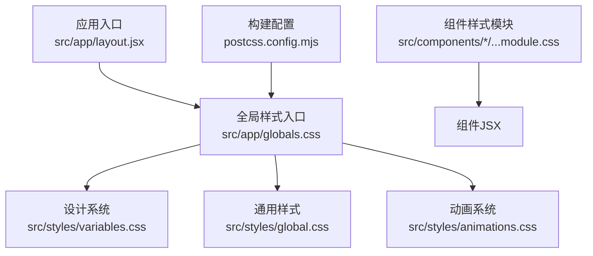
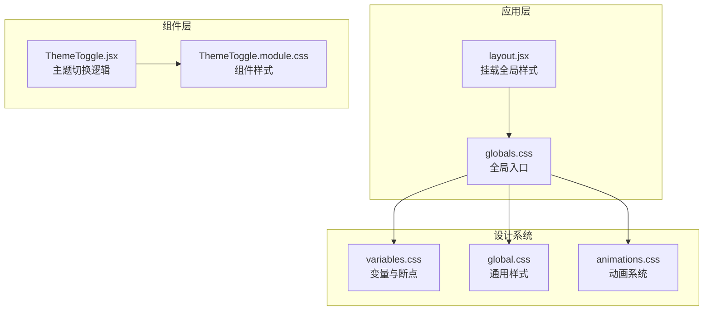
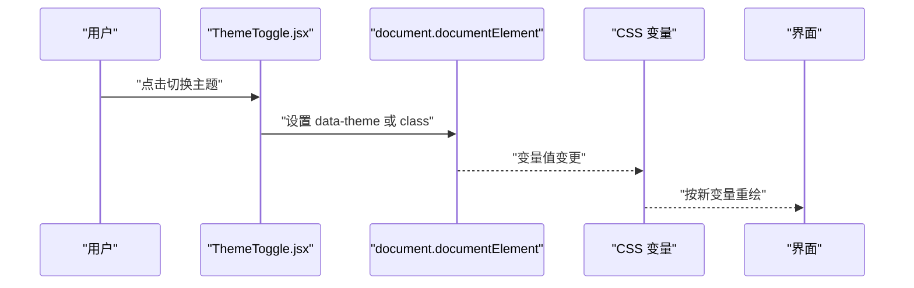
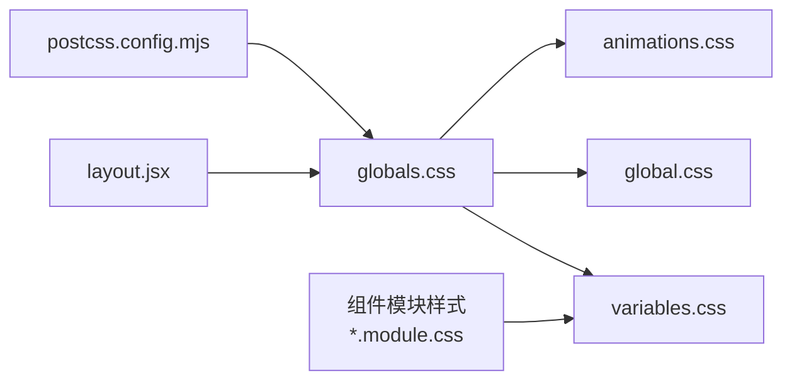

# 样式系统

<cite>
**本文引用的文件**   
- [src/app/globals.css](file://src/app/globals.css)
- [src/styles/global.css](file://src/styles/global.css)
- [src/styles/variables.css](file://src/styles/variables.css)
- [src/styles/animations.css](file://src/styles/animations.css)
- [src/components/ThemeToggle/ThemeToggle.jsx](file://src/components/ThemeToggle/ThemeToggle.jsx)
- [src/components/ThemeToggle/ThemeToggle.module.css](file://src/components/ThemeToggle/ThemeToggle.module.css)
- [src/app/layout.jsx](file://src/app/layout.jsx)
- [postcss.config.mjs](file://postcss.config.mjs)
</cite>

## 目录
1. [简介](#简介)
2. [项目结构](#项目结构)
3. [核心组件](#核心组件)
4. [架构总览](#架构总览)
5. [详细组件分析](#详细组件分析)
6. [依赖分析](#依赖分析)
7. [性能考虑](#性能考虑)
8. [故障排查指南](#故障排查指南)
9. [结论](#结论)
10. [附录](#附录)

## 简介
本样式系统文档面向前端开发者与维护者，系统化阐述项目的样式架构与设计体系。内容覆盖：
- 全局样式组织：基础重置、CSS 变量与响应式断点
- CSS 模块化策略：命名规范、作用域与隔离
- 主题切换机制：CSS 变量动态切换、深色模式与配置管理
- 动画系统：过渡、关键帧与性能优化
- 开发规范与最佳实践

## 项目结构
样式资源主要分布在以下位置：
- 应用级全局样式入口：src/app/globals.css
- 设计系统与通用样式：src/styles/{global.css, variables.css, animations.css}
- 组件级样式：各组件目录下的 *.module.css（如 ThemeToggle.module.css）
- 构建与工具链：postcss.config.mjs（PostCSS 配置）

图表来源
- [src/app/layout.jsx:1-200](file://src/app/layout.jsx#L1-L200)
- [src/app/globals.css:1-200](file://src/app/globals.css#L1-L200)
- [src/styles/variables.css:1-200](file://src/styles/variables.css#L1-L200)
- [src/styles/global.css:1-200](file://src/styles/global.css#L1-L200)
- [src/styles/animations.css:1-200](file://src/styles/animations.css#L1-L200)
- [postcss.config.mjs:1-200](file://postcss.config.mjs#L1-L200)

章节来源
- [src/app/layout.jsx:1-200](file://src/app/layout.jsx#L1-L200)
- [src/app/globals.css:1-200](file://src/app/globals.css#L1-L200)
- [src/styles/variables.css:1-200](file://src/styles/variables.css#L1-L200)
- [src/styles/global.css:1-200](file://src/styles/global.css#L1-L200)
- [src/styles/animations.css:1-200](file://src/styles/animations.css#L1-L200)
- [postcss.config.mjs:1-200](file://postcss.config.mjs#L1-L200)

## 核心组件
- 全局样式层
  - 基础重置与排版基线
  - CSS 自定义属性（变量）集中定义
  - 响应式断点与布局网格
  - 通用组件与页面级样式
- 动画系统层
  - 过渡效果与缓动函数
  - 关键帧动画集合
  - 可复用动画类名
- 主题与深色模式
  - 基于 CSS 变量的主题色板
  - 根节点 data-theme 或 class 驱动切换
  - 组件内通过模块样式隔离使用主题变量
- 组件样式模块
  - 采用 .module.css 实现局部作用域
  - 统一命名约定与组合类策略

章节来源
- [src/app/globals.css:1-200](file://src/app/globals.css#L1-L200)
- [src/styles/variables.css:1-200](file://src/styles/variables.css#L1-L200)
- [src/styles/global.css:1-200](file://src/styles/global.css#L1-L200)
- [src/styles/animations.css:1-200](file://src/styles/animations.css#L1-L200)
- [src/components/ThemeToggle/ThemeToggle.module.css:1-200](file://src/components/ThemeToggle/ThemeToggle.module.css#L1-L200)

## 架构总览
样式架构遵循“分层 + 模块化”的原则：
- 顶层：应用全局样式入口，负责引入设计系统与通用样式
- 中层：设计系统（变量、断点、基础组件样式）
- 底层：组件级样式模块，确保样式隔离与可维护性
- 横切：动画系统作为独立层，提供统一的过渡与关键帧能力
- 运行时：主题切换通过 CSS 变量在根节点上生效，组件按需消费

图表来源
- [src/app/layout.jsx:1-200](file://src/app/layout.jsx#L1-L200)
- [src/app/globals.css:1-200](file://src/app/globals.css#L1-L200)
- [src/styles/variables.css:1-200](file://src/styles/variables.css#L1-L200)
- [src/styles/global.css:1-200](file://src/styles/global.css#L1-L200)
- [src/styles/animations.css:1-200](file://src/styles/animations.css#L1-L200)
- [src/components/ThemeToggle/ThemeToggle.jsx:1-200](file://src/components/ThemeToggle/ThemeToggle.jsx#L1-L200)
- [src/components/ThemeToggle/ThemeToggle.module.css:1-200](file://src/components/ThemeToggle/ThemeToggle.module.css#L1-L200)

## 详细组件分析

### 全局样式与变量（variables.css / global.css / globals.css）
- 职责划分
  - variables.css：集中定义颜色、字体、间距、阴影、圆角等设计令牌；同时声明浅色/深色两套变量集
  - global.css：封装基础重置、排版基线、通用布局与页面级样式
  - globals.css：作为 Next.js 应用的全局样式入口，统一引入设计系统与通用样式
- 关键要点
  - 使用 CSS 自定义属性承载主题与尺寸令牌，便于运行时切换
  - 响应式断点以媒体查询形式在变量或通用样式中统一定义
  - 避免在组件样式中硬编码具体数值，优先引用变量

章节来源
- [src/styles/variables.css:1-200](file://src/styles/variables.css#L1-L200)
- [src/styles/global.css:1-200](file://src/styles/global.css#L1-L200)
- [src/app/globals.css:1-200](file://src/app/globals.css#L1-L200)

### 动画系统（animations.css）
- 职责
  - 提供统一的过渡与关键帧动画类名
  - 将常用动效抽象为可复用类，降低重复代码
- 关键点
  - 优先使用 transform 与 opacity 提升合成性能
  - 对复杂动画进行节流与降级处理，保障低端设备体验

章节来源
- [src/styles/animations.css:1-200](file://src/styles/animations.css#L1-L200)

### 主题切换机制（ThemeToggle.jsx + ThemeToggle.module.css）
- 工作原理
  - 通过操作根节点的 data-theme 或特定 class 切换主题
  - 组件样式模块通过模块类名访问主题变量，避免全局污染
- 交互流程
  - 用户点击主题切换按钮
  - 更新根节点主题状态
  - 浏览器根据新的 CSS 变量值即时重绘

图表来源
- [src/components/ThemeToggle/ThemeToggle.jsx:1-200](file://src/components/ThemeToggle/ThemeToggle.jsx#L1-L200)
- [src/components/ThemeToggle/ThemeToggle.module.css:1-200](file://src/components/ThemeToggle/ThemeToggle.module.css#L1-L200)
- [src/styles/variables.css:1-200](file://src/styles/variables.css#L1-L200)

章节来源
- [src/components/ThemeToggle/ThemeToggle.jsx:1-200](file://src/components/ThemeToggle/ThemeToggle.jsx#L1-L200)
- [src/components/ThemeToggle/ThemeToggle.module.css:1-200](file://src/components/ThemeToggle/ThemeToggle.module.css#L1-L200)
- [src/styles/variables.css:1-200](file://src/styles/variables.css#L1-L200)

### 组件样式模块化（*.module.css）
- 命名规范
  - 文件名与组件同名，后缀 .module.css
  - 类名采用小驼峰或短横线风格，保持团队一致
- 作用域与隔离
  - 模块样式自动注入唯一哈希前缀，避免冲突
  - 通过组合类与条件类实现变体与状态样式
- 与主题协作
  - 组件样式仅引用设计系统变量，不直接写死颜色与尺寸

章节来源
- [src/components/ThemeToggle/ThemeToggle.module.css:1-200](file://src/components/ThemeToggle/ThemeToggle.module.css#L1-L200)

### 应用入口与样式加载（layout.jsx）
- 职责
  - 作为应用根布局，负责引入全局样式入口
  - 保证样式在首屏渲染前可用
- 注意事项
  - 避免在子组件中重复引入全局样式
  - 合理拆分全局样式，减少首屏体积

章节来源
- [src/app/layout.jsx:1-200](file://src/app/layout.jsx#L1-L200)
- [src/app/globals.css:1-200](file://src/app/globals.css#L1-L200)

## 依赖分析
样式依赖关系如下：
- layout.jsx 引入 globals.css
- globals.css 引入 variables.css、global.css、animations.css
- 组件样式模块通过模块作用域引用设计系统变量
- PostCSS 配置影响全局样式的编译行为

图表来源
- [src/app/layout.jsx:1-200](file://src/app/layout.jsx#L1-L200)
- [src/app/globals.css:1-200](file://src/app/globals.css#L1-L200)
- [src/styles/variables.css:1-200](file://src/styles/variables.css#L1-L200)
- [src/styles/global.css:1-200](file://src/styles/global.css#L1-L200)
- [src/styles/animations.css:1-200](file://src/styles/animations.css#L1-L200)
- [postcss.config.mjs:1-200](file://postcss.config.mjs#L1-L200)

章节来源
- [src/app/layout.jsx:1-200](file://src/app/layout.jsx#L1-L200)
- [src/app/globals.css:1-200](file://src/app/globals.css#L1-L200)
- [src/styles/variables.css:1-200](file://src/styles/variables.css#L1-L200)
- [src/styles/global.css:1-200](file://src/styles/global.css#L1-L200)
- [src/styles/animations.css:1-200](file://src/styles/animations.css#L1-L200)
- [postcss.config.mjs:1-200](file://postcss.config.mjs#L1-L200)

## 性能考虑
- 变量与主题
  - 使用 CSS 变量减少重复计算与样式分支
  - 主题切换尽量只修改根节点属性，避免大规模 DOM 重排
- 动画与过渡
  - 优先使用 transform 与 opacity，触发 GPU 加速
  - 控制动画时长与复杂度，避免阻塞主线程
- 样式体积
  - 按需引入模块样式，避免全局样式膨胀
  - 利用构建工具（PostCSS）进行压缩与去重

[本节为通用指导，无需源码引用]

## 故障排查指南
- 主题未生效
  - 检查根节点是否设置了正确的 data-theme 或 class
  - 确认变量在不同主题下均有定义且被正确引用
- 样式冲突
  - 确认组件样式使用模块样式（.module.css），避免全局类名冲突
  - 检查全局样式是否意外覆盖了组件样式
- 动画卡顿
  - 检查是否使用了昂贵的属性（如 width/height/top/left）
  - 尝试改用 transform/opacity 并开启 will-change 的谨慎使用
- 构建问题
  - 核对 postcss.config.mjs 是否正确配置插件与目标浏览器

章节来源
- [src/components/ThemeToggle/ThemeToggle.jsx:1-200](file://src/components/ThemeToggle/ThemeToggle.jsx#L1-L200)
- [src/styles/variables.css:1-200](file://src/styles/variables.css#L1-L200)
- [postcss.config.mjs:1-200](file://postcss.config.mjs#L1-L200)

## 结论
本项目样式系统以“设计系统 + 模块化 + 主题化”为核心，通过 CSS 变量统一管理视觉令牌，结合模块样式实现组件级隔离，并以动画系统提供一致的动效体验。该架构具备良好的可维护性与扩展性，适合团队协作与长期演进。

[本节为总结性内容，无需源码引用]

## 附录
- 术语
  - 设计令牌：用于描述颜色、字体、间距等视觉属性的变量
  - 模块样式：通过 .module.css 实现的局部作用域样式
  - 主题切换：通过根节点属性或类名切换 CSS 变量值的机制
- 参考路径
  - 全局样式入口：src/app/globals.css
  - 设计系统：src/styles/variables.css、src/styles/global.css
  - 动画系统：src/styles/animations.css
  - 主题切换组件：src/components/ThemeToggle/ThemeToggle.jsx、ThemeToggle.module.css
  - 应用布局：src/app/layout.jsx
  - 构建配置：postcss.config.mjs

[本节为补充信息，无需源码引用]