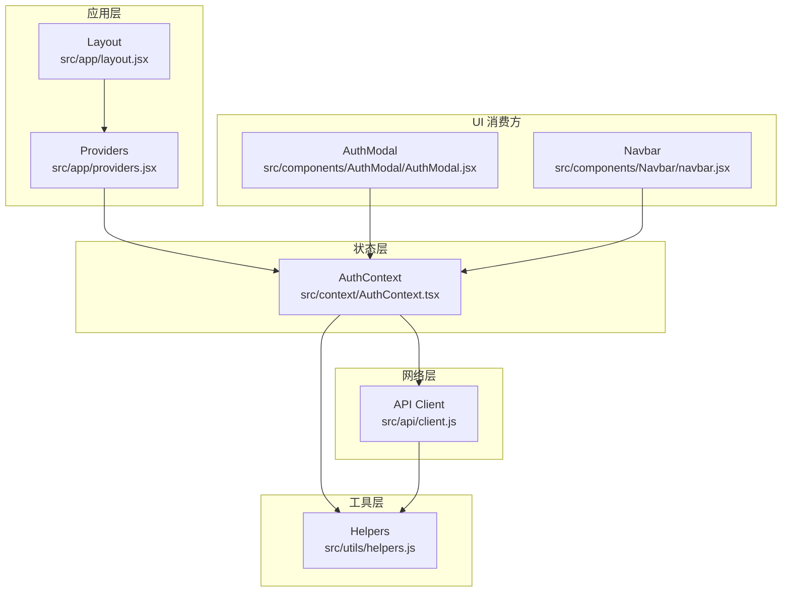
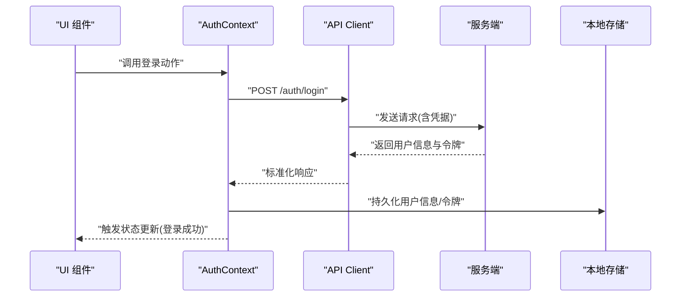
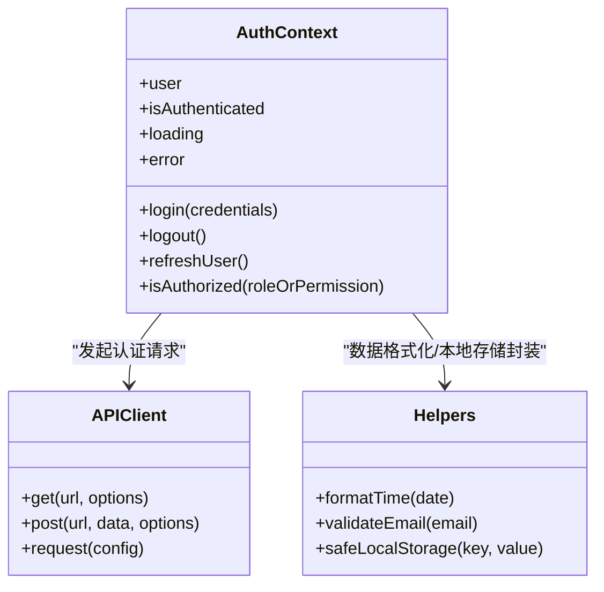
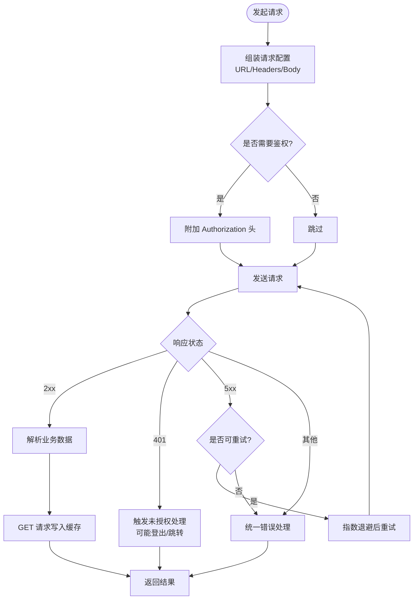
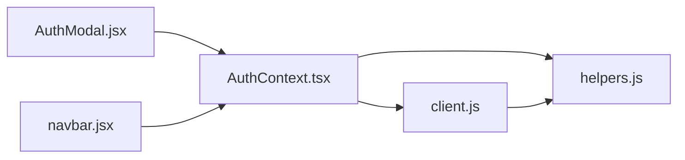

# 状态管理方案

<cite>
**本文引用的文件**
- [AuthContext.tsx](file://src/context/AuthContext.tsx)
- [client.js](file://src/api/client.js)
- [helpers.js](file://src/utils/helpers.js)
- [providers.jsx](file://src/app/providers.jsx)
- [layout.jsx](file://src/app/layout.jsx)
- [AuthModal.jsx](file://src/components/AuthModal/AuthModal.jsx)
- [navbar.jsx](file://src/components/Navbar/navbar.jsx)
</cite>

## 目录
1. [简介](#简介)
2. [项目结构](#项目结构)
3. [核心组件](#核心组件)
4. [架构总览](#架构总览)
5. [详细组件分析](#详细组件分析)
6. [依赖关系分析](#依赖关系分析)
7. [性能考虑](#性能考虑)
8. [故障排查指南](#故障排查指南)
9. [结论](#结论)
10. [附录：使用示例与最佳实践](#附录使用示例与最佳实践)

## 简介
本方案围绕基于 React Context 的状态管理，构建统一的前端认证与数据访问层。重点包括：
- 认证上下文 AuthContext 的用户信息存储、登录态维护与权限控制
- API 客户端的统一封装（请求拦截、错误处理、重试与缓存）
- 工具函数的组织与复用模式
- 状态同步机制（本地持久化、更新通知、一致性保证）
- 典型使用示例与最佳实践

## 项目结构
与状态管理相关的核心位置如下：
- 认证上下文：src/context/AuthContext.tsx
- API 客户端：src/api/client.js
- 通用工具：src/utils/helpers.js
- 应用提供者与布局：src/app/providers.jsx、src/app/layout.jsx
- 认证弹窗与导航栏等消费方：src/components/AuthModal/AuthModal.jsx、src/components/Navbar/navbar.jsx

图表来源
- [providers.jsx](file://src/app/providers.jsx)
- [layout.jsx](file://src/app/layout.jsx)
- [AuthContext.tsx](file://src/context/AuthContext.tsx)
- [client.js](file://src/api/client.js)
- [helpers.js](file://src/utils/helpers.js)
- [AuthModal.jsx](file://src/components/AuthModal/AuthModal.jsx)
- [navbar.jsx](file://src/components/Navbar/navbar.jsx)

章节来源
- [providers.jsx](file://src/app/providers.jsx)
- [layout.jsx](file://src/app/layout.jsx)
- [AuthContext.tsx](file://src/context/AuthContext.tsx)
- [client.js](file://src/api/client.js)
- [helpers.js](file://src/utils/helpers.js)
- [AuthModal.jsx](file://src/components/AuthModal/AuthModal.jsx)
- [navbar.jsx](file://src/components/Navbar/navbar.jsx)

## 核心组件
- 认证上下文（AuthContext）
  - 职责：集中管理用户信息、登录态、登出流程、权限判断；提供订阅式更新能力；负责与后端认证接口交互及本地持久化。
  - 关键能力：
    - 用户信息存储：从本地存储恢复并同步到内存状态
    - 登录状态维护：登录成功后写入本地存储并触发全局更新
    - 权限控制：暴露 isAuthorized 或 hasRole 等判定方法供 UI 与路由守卫使用
- API 客户端（client.js）
  - 职责：统一封装 fetch/axios，提供请求拦截器、响应拦截器、错误处理、重试策略与简单缓存
  - 关键能力：
    - 请求拦截：自动附加鉴权头、基础 URL、超时配置
    - 响应拦截：统一错误码映射、业务错误提示、幂等重试
    - 缓存策略：对 GET 请求按 URL 进行短期缓存，支持失效与刷新
- 工具函数（helpers.js）
  - 职责：数据处理、格式化、校验、通用逻辑封装
  - 常见类别：时间格式化、字符串处理、数组/对象操作、本地存储包装、防抖节流等

章节来源
- [AuthContext.tsx](file://src/context/AuthContext.tsx)
- [client.js](file://src/api/client.js)
- [helpers.js](file://src/utils/helpers.js)

## 架构总览
整体采用“上下文 + 客户端 + 工具”的分层设计：
- 应用启动时由 providers 注入 AuthContext，布局层确保全局可用
- 页面与组件通过 useContext 获取认证状态与动作
- 认证上下文在需要时调用 API 客户端发起网络请求
- 工具函数被上下文与客户端共同复用，避免重复实现

图表来源
- [AuthContext.tsx](file://src/context/AuthContext.tsx)
- [client.js](file://src/api/client.js)

## 详细组件分析

### 认证上下文（AuthContext）
- 状态模型
  - 用户信息：包含用户标识、昵称、头像、角色/权限集合等
  - 登录态：是否已登录、加载状态、错误信息
  - 权限：当前用户具备的权限列表或角色
- 生命周期与初始化
  - 组件挂载时从本地存储读取用户信息并恢复状态
  - 若本地存在有效会话则标记为已登录
- 核心动作
  - 登录：调用认证接口，成功后写入本地存储并更新状态
  - 登出：清除本地存储并重置状态
  - 刷新用户信息：按需拉取最新用户资料
- 权限控制
  - 提供 isAuthorized(role|permission) 判断
  - 结合路由守卫或条件渲染实现访问控制
- 状态同步与通知
  - 通过 Context 的 value 变化驱动订阅者重渲染
  - 本地存储变更可通过 storage 事件跨标签页同步（可选）

图表来源
- [AuthContext.tsx](file://src/context/AuthContext.tsx)
- [client.js](file://src/api/client.js)
- [helpers.js](file://src/utils/helpers.js)

章节来源
- [AuthContext.tsx](file://src/context/AuthContext.tsx)

### API 客户端（client.js）
- 请求拦截
  - 自动附加基础路径、超时、Content-Type
  - 根据登录态动态注入 Authorization 头
- 响应拦截
  - 统一解析业务状态码，抛出可识别的错误类型
  - 对特定错误（如未授权）触发登出或跳转登录
- 重试机制
  - 针对网络抖动或 5xx 错误进行有限次重试
  - 指数退避与最大重试次数限制
- 缓存策略
  - 对 GET 请求按 URL 做短期缓存
  - 提供手动失效与强制刷新接口
- 错误处理
  - 将网络错误、超时、业务错误归一化为标准结构
  - 提供全局错误回调用于 Toast 提示或埋点

图表来源
- [client.js](file://src/api/client.js)

章节来源
- [client.js](file://src/api/client.js)

### 工具函数（helpers.js）
- 数据格式化
  - 时间格式化、金额/百分比格式化、富文本清洗
- 通用逻辑
  - 防抖/节流、深拷贝、去重、分页参数构造
- 本地存储封装
  - 安全读写 JSON、异常捕获与降级
- 校验与断言
  - 邮箱/手机号/密码强度校验、必填字段检查

章节来源
- [helpers.js](file://src/utils/helpers.js)

### 应用提供者与布局
- providers.jsx
  - 作为根级 Provider 包裹应用，注入 AuthContext
- layout.jsx
  - 在布局层完成必要的初始化（如恢复会话、设置全局样式）

章节来源
- [providers.jsx](file://src/app/providers.jsx)
- [layout.jsx](file://src/app/layout.jsx)

### UI 消费方示例
- AuthModal.jsx
  - 展示登录/注册表单，调用 AuthContext 的登录动作，并根据返回结果反馈
- navbar.jsx
  - 根据登录态与权限显示不同菜单项与操作入口

章节来源
- [AuthModal.jsx](file://src/components/AuthModal/AuthModal.jsx)
- [navbar.jsx](file://src/components/Navbar/navbar.jsx)

## 依赖关系分析
- 低耦合高内聚
  - AuthContext 仅依赖 API 客户端与工具函数，不直接感知具体页面
  - API 客户端独立于业务，提供稳定契约
- 可能的循环依赖
  - 避免在 client.js 中反向引入 context，防止循环引用
- 外部集成点
  - 浏览器本地存储、网络请求库、第三方 Toast/路由库（如有）

图表来源
- [AuthContext.tsx](file://src/context/AuthContext.tsx)
- [client.js](file://src/api/client.js)
- [helpers.js](file://src/utils/helpers.js)
- [AuthModal.jsx](file://src/components/AuthModal/AuthModal.jsx)
- [navbar.jsx](file://src/components/Navbar/navbar.jsx)

章节来源
- [AuthContext.tsx](file://src/context/AuthContext.tsx)
- [client.js](file://src/api/client.js)
- [helpers.js](file://src/utils/helpers.js)
- [AuthModal.jsx](file://src/components/AuthModal/AuthModal.jsx)
- [navbar.jsx](file://src/components/Navbar/navbar.jsx)

## 性能考虑
- 减少不必要的重渲染
  - 将 user、actions 拆分为多个 context 或使用选择器模式，避免整树更新
- 缓存优化
  - 合理设置缓存过期时间与失效策略，避免频繁请求
- 重试与退避
  - 限制最大重试次数，避免雪崩；对非幂等请求谨慎重试
- 本地存储
  - 批量写入与异步写入，避免阻塞主线程

[本节为通用指导，无需源码引用]

## 故障排查指南
- 常见问题
  - 登录后状态未生效：检查本地存储键名与序列化格式是否一致
  - 401 未授权：确认 Authorization 头是否正确附加，服务端 token 校验是否通过
  - 请求失败无提示：检查响应拦截器的错误映射与全局错误回调是否注册
- 定位步骤
  - 在请求拦截器打印入参与出参
  - 在认证上下文的登录/登出动作前后打点
  - 对比本地存储中的用户信息与期望值

章节来源
- [client.js](file://src/api/client.js)
- [AuthContext.tsx](file://src/context/AuthContext.tsx)

## 结论
本方案以 React Context 为核心，配合统一的 API 客户端与工具函数，实现了可扩展、易维护的认证与数据访问体系。通过清晰的职责划分、完善的错误处理与合理的缓存/重试策略，提升了用户体验与系统稳定性。后续可在权限粒度、缓存策略与监控埋点上持续演进。

[本节为总结性内容，无需源码引用]

## 附录：使用示例与最佳实践

- 在页面中使用认证状态
  - 通过上下文提供的 isAuthenticated、user、isAuthorized 等方法进行条件渲染与路由保护
  - 参考：[AuthModal.jsx](file://src/components/AuthModal/AuthModal.jsx)、[navbar.jsx](file://src/components/Navbar/navbar.jsx)
- 发起受保护的资源请求
  - 使用 API 客户端的 get/post，自动携带鉴权头；对敏感资源增加重试与错误提示
  - 参考：[client.js](file://src/api/client.js)
- 本地持久化与一致性
  - 使用工具函数封装的本地存储方法，确保异常降级与格式兼容
  - 参考：[helpers.js](file://src/utils/helpers.js)
- 权限控制
  - 在路由守卫或组件内部使用 isAuthorized 进行细粒度控制
  - 参考：[AuthContext.tsx](file://src/context/AuthContext.tsx)
- 最佳实践
  - 将认证相关状态尽量集中在上下文，避免分散在多处
  - 对网络请求统一错误处理，避免在各处重复实现
  - 对高频读操作启用缓存，对写操作及时失效缓存
  - 保持工具函数纯函数化，便于测试与复用

章节来源
- [AuthModal.jsx](file://src/components/AuthModal/AuthModal.jsx)
- [navbar.jsx](file://src/components/Navbar/navbar.jsx)
- [client.js](file://src/api/client.js)
- [helpers.js](file://src/utils/helpers.js)
- [AuthContext.tsx](file://src/context/AuthContext.tsx)