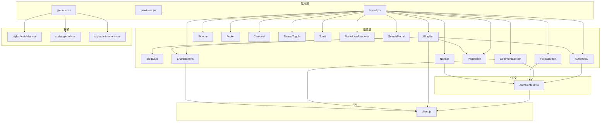
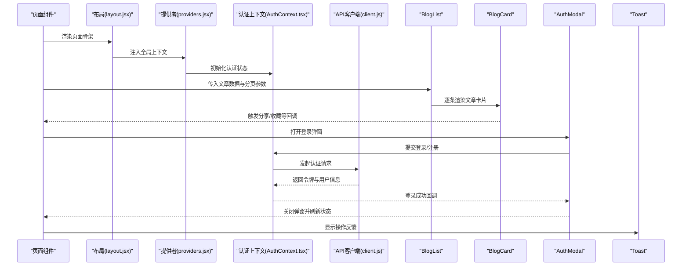
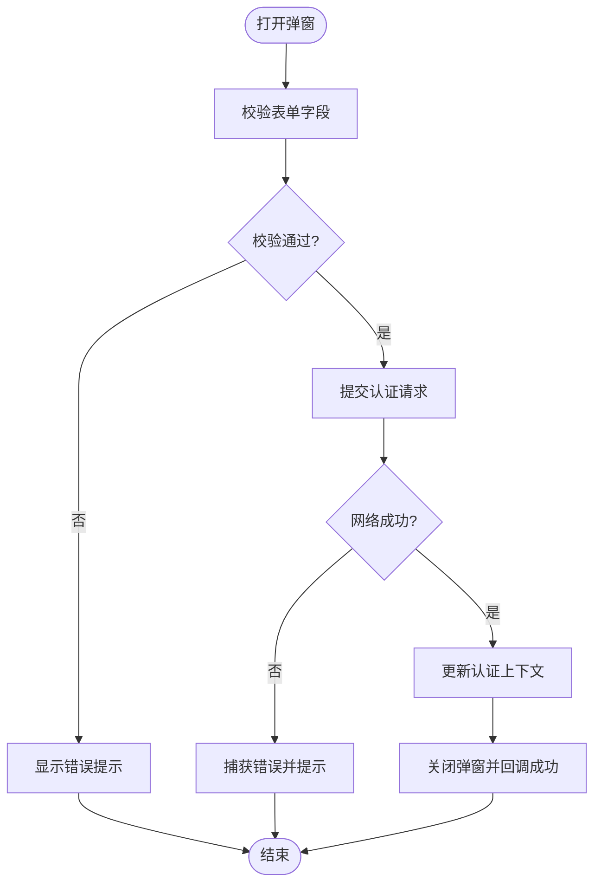
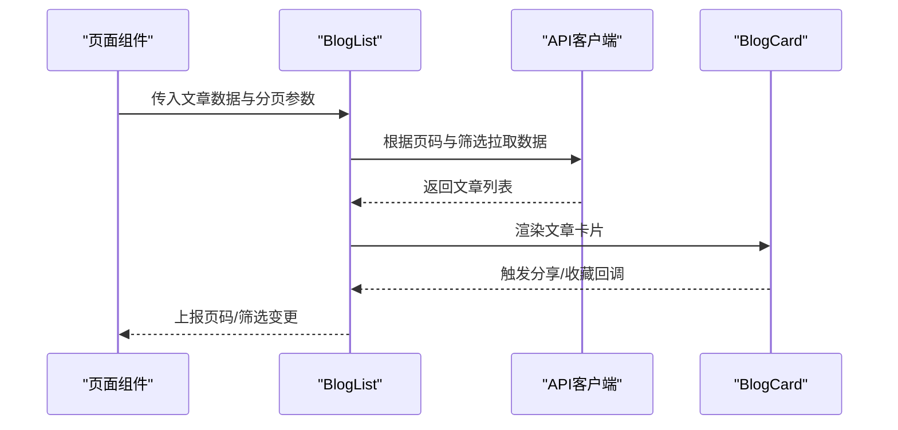
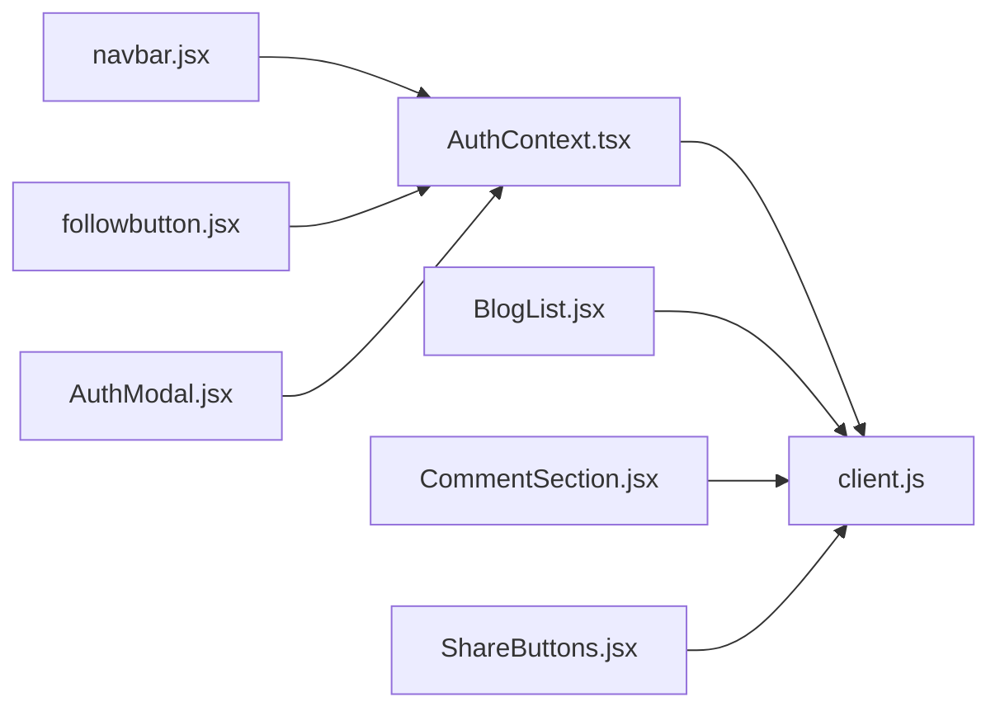

# 组件化架构

<cite>
**本文引用的文件**   
- [src/components/BlogCard/BlogCard.jsx](file://src/components/BlogCard/BlogCard.jsx)
- [src/components/BlogCard/BlogCard.module.css](file://src/components/BlogCard/BlogCard.module.css)
- [src/components/AuthModal/AuthModal.jsx](file://src/components/AuthModal/AuthModal.jsx)
- [src/components/AuthModal/AuthModal.module.css](file://src/components/AuthModal/AuthModal.module.css)
- [src/components/BlogList/BlogList.jsx](file://src/components/BlogList/BlogList.jsx)
- [src/components/BlogList/BlogList.module.css](file://src/components/BlogList/BlogList.module.css)
- [src/components/Carousel/Carousel.jsx](file://src/components/Carousel/Carousel.jsx)
- [src/components/Carousel/Carousel.module.css](file://src/components/Carousel/Carousel.module.css)
- [src/components/CommentSection/CommentSection.jsx](file://src/components/CommentSection/CommentSection.jsx)
- [src/components/CommentSection/CommentSection.module.css](file://src/components/CommentSection/CommentSection.module.css)
- [src/components/FollowButton/followbutton.jsx](file://src/components/FollowButton/followbutton.jsx)
- [src/components/FollowButton/FollowButton.module.css](file://src/components/FollowButton/FollowButton.module.css)
- [src/components/Footer/Footer.jsx](file://src/components/Footer/Footer.jsx)
- [src/components/Footer/Footer.module.css](file://src/components/Footer/Footer.module.css)
- [src/components/MarkdownRenderer/index.jsx](file://src/components/MarkdownRenderer/index.jsx)
- [src/components/Navbar/navbar.jsx](file://src/components/Navbar/navbar.jsx)
- [src/components/Navbar/Navbar.module.css](file://src/components/Navbar/Navbar.module.css)
- [src/components/Pagination/Pagination.jsx](file://src/components/Pagination/Pagination.jsx)
- [src/components/Pagination/Pagination.module.css](file://src/components/Pagination/Pagination.module.css)
- [src/components/SearchModal/searchmodal.jsx](file://src/components/SearchModal/searchmodal.jsx)
- [src/components/SearchModal/SearchModal.module.css](file://src/components/SearchModal/SearchModal.module.css)
- [src/components/ShareButtons/ShareButtons.jsx](file://src/components/ShareButtons/ShareButtons.jsx)
- [src/components/ShareButtons/ShareButtons.module.css](file://src/components/ShareButtons/ShareButtons.module.css)
- [src/components/Sidebar/Sidebar.jsx](file://src/components/Sidebar/Sidebar.jsx)
- [src/components/Sidebar/Sidebar.module.css](file://src/components/Sidebar/Sidebar.module.css)
- [src/components/ThemeToggle/ThemeToggle.jsx](file://src/components/ThemeToggle/ThemeToggle.jsx)
- [src/components/ThemeToggle/ThemeToggle.module.css](file://src/components/ThemeToggle/ThemeToggle.module.css)
- [src/components/Toast/Toast.jsx](file://src/components/Toast/Toast.jsx)
- [src/components/Toast/Toast.module.css](file://src/components/Toast/Toast.module.css)
- [src/context/AuthContext.tsx](file://src/context/AuthContext.tsx)
- [src/app/layout.jsx](file://src/app/layout.jsx)
- [src/app/providers.jsx](file://src/app/providers.jsx)
- [src/app/globals.css](file://src/app/globals.css)
- [src/styles/global.css](file://src/styles/global.css)
- [src/styles/variables.css](file://src/styles/variables.css)
- [src/styles/animations.css](file://src/styles/animations.css)
- [src/api/client.js](file://src/api/client.js)
</cite>

## 目录
1. [简介](#简介)
2. [项目结构](#项目结构)
3. [核心组件](#核心组件)
4. [架构总览](#架构总览)
5. [详细组件分析](#详细组件分析)
6. [依赖分析](#依赖分析)
7. [性能考虑](#性能考虑)
8. [故障排查指南](#故障排查指南)
9. [结论](#结论)
10. [附录](#附录)

## 简介
本文件面向React与Next.js前端工程，系统化阐述组件化架构的设计原则、分层组织策略、通信模式、复用策略与样式管理方案。文档以实际代码为依据，结合BlogCard、AuthModal等核心组件进行深度解析，并提供架构图、时序图与流程图，帮助读者快速理解并落地最佳实践。

## 项目结构
本项目采用“按功能域分目录”的组件组织方式：
- 基础UI组件：如按钮、分页、轮播、主题切换、提示等，强调无业务耦合与高内聚。
- 业务组件：如文章卡片列表、评论区、分享按钮等，封装特定业务场景的组合与交互。
- 页面组件：位于app路由下的页面级组件，负责数据获取、布局编排与状态协调。
- 上下文与提供者：全局状态（如认证）通过Context提供，避免深层props传递。
- 样式体系：CSS Modules实现样式隔离，全局变量与动画统一在styles下维护。

图表来源
- [src/app/layout.jsx](file://src/app/layout.jsx)
- [src/app/providers.jsx](file://src/app/providers.jsx)
- [src/app/globals.css](file://src/app/globals.css)
- [src/styles/variables.css](file://src/styles/variables.css)
- [src/styles/global.css](file://src/styles/global.css)
- [src/styles/animations.css](file://src/styles/animations.css)
- [src/context/AuthContext.tsx](file://src/context/AuthContext.tsx)
- [src/api/client.js](file://src/api/client.js)
- [src/components/BlogList/BlogList.jsx](file://src/components/BlogList/BlogList.jsx)
- [src/components/BlogCard/BlogCard.jsx](file://src/components/BlogCard/BlogCard.jsx)
- [src/components/AuthModal/AuthModal.jsx](file://src/components/AuthModal/AuthModal.jsx)
- [src/components/CommentSection/CommentSection.jsx](file://src/components/CommentSection/CommentSection.jsx)
- [src/components/Pagination/Pagination.jsx](file://src/components/Pagination/Pagination.jsx)
- [src/components/Carousel/Carousel.jsx](file://src/components/Carousel/Carousel.jsx)
- [src/components/ThemeToggle/ThemeToggle.jsx](file://src/components/ThemeToggle/ThemeToggle.jsx)
- [src/components/Toast/Toast.jsx](file://src/components/Toast/Toast.jsx)
- [src/components/MarkdownRenderer/index.jsx](file://src/components/MarkdownRenderer/index.jsx)
- [src/components/ShareButtons/ShareButtons.jsx](file://src/components/ShareButtons/ShareButtons.jsx)
- [src/components/FollowButton/followbutton.jsx](file://src/components/FollowButton/followbutton.jsx)
- [src/components/SearchModal/searchmodal.jsx](file://src/components/SearchModal/searchmodal.jsx)
- [src/components/Navbar/navbar.jsx](file://src/components/Navbar/navbar.jsx)
- [src/components/Footer/Footer.jsx](file://src/components/Footer/Footer.jsx)
- [src/components/Sidebar/Sidebar.jsx](file://src/components/Sidebar/Sidebar.jsx)

章节来源
- [src/app/layout.jsx](file://src/app/layout.jsx)
- [src/app/providers.jsx](file://src/app/providers.jsx)
- [src/app/globals.css](file://src/app/globals.css)
- [src/styles/variables.css](file://src/styles/variables.css)
- [src/styles/global.css](file://src/styles/global.css)
- [src/styles/animations.css](file://src/styles/animations.css)

## 核心组件
本节聚焦关键组件的职责划分与协作关系，说明其输入输出、事件回调与状态边界。

- BlogCard
  - 职责：展示单篇文章摘要信息（标题、摘要、标签、作者等），承载点击跳转与分享入口。
  - 输入：文章数据对象、可选操作回调（如收藏、点赞）。
  - 输出：用户交互事件（如点击、分享）。
  - 样式：使用CSS Modules隔离样式。
  - 参考路径
    - [src/components/BlogCard/BlogCard.jsx](file://src/components/BlogCard/BlogCard.jsx)
    - [src/components/BlogCard/BlogCard.module.css](file://src/components/BlogCard/BlogCard.module.css)

- AuthModal
  - 职责：登录/注册弹窗，集中处理表单校验、提交与错误提示。
  - 输入：可见性控制、关闭回调、成功回调。
  - 输出：登录/注册结果事件。
  - 集成：可与全局认证上下文联动，完成登录后刷新导航栏状态。
  - 参考路径
    - [src/components/AuthModal/AuthModal.jsx](file://src/components/AuthModal/AuthModal.jsx)
    - [src/components/AuthModal/AuthModal.module.css](file://src/components/AuthModal/AuthModal.module.css)

- BlogList
  - 职责：聚合文章列表渲染、分页加载、筛选与搜索联动。
  - 输入：文章数组、分页参数、加载状态、错误状态、回调。
  - 输出：页码变更、筛选条件变更、加载更多等事件。
  - 组合：内部组合BlogCard、Pagination、ShareButtons等。
  - 参考路径
    - [src/components/BlogList/BlogList.jsx](file://src/components/BlogList/BlogList.jsx)
    - [src/components/BlogList/BlogList.module.css](file://src/components/BlogList/BlogList.module.css)

- CommentSection
  - 职责：评论列表展示、新增评论、回复与删除。
  - 输入：评论数据、当前用户信息、操作回调。
  - 输出：新增/删除/点赞等事件。
  - 参考路径
    - [src/components/CommentSection/CommentSection.jsx](file://src/components/CommentSection/CommentSection.jsx)
    - [src/components/CommentSection/CommentSection.module.css](file://src/components/CommentSection/CommentSection.module.css)

- Pagination
  - 职责：分页控件，支持页码切换与总数显示。
  - 输入：总页数、当前页、变更回调。
  - 输出：页码变更事件。
  - 参考路径
    - [src/components/Pagination/Pagination.jsx](file://src/components/Pagination/Pagination.jsx)
    - [src/components/Pagination/Pagination.module.css](file://src/components/Pagination/Pagination.module.css)

- Carousel
  - 职责：轮播展示，支持自动播放与手动切换。
  - 输入：图片/内容数组、配置项（间隔、指示器）。
  - 输出：当前索引变更事件。
  - 参考路径
    - [src/components/Carousel/Carousel.jsx](file://src/components/Carousel/Carousel.jsx)
    - [src/components/Carousel/Carousel.module.css](file://src/components/Carousel/Carousel.module.css)

- ThemeToggle
  - 职责：切换主题（明/暗），持久化到本地存储或上下文。
  - 输入：当前主题、切换回调。
  - 输出：主题变更事件。
  - 参考路径
    - [src/components/ThemeToggle/ThemeToggle.jsx](file://src/components/ThemeToggle/ThemeToggle.jsx)
    - [src/components/ThemeToggle/ThemeToggle.module.css](file://src/components/ThemeToggle/ThemeToggle.module.css)

- Toast
  - 职责：轻量消息提示，支持成功、警告、错误类型。
  - 输入：消息文本、类型、自动消失时长。
  - 输出：关闭回调。
  - 参考路径
    - [src/components/Toast/Toast.jsx](file://src/components/Toast/Toast.jsx)
    - [src/components/Toast/Toast.module.css](file://src/components/Toast/Toast.module.css)

- MarkdownRenderer
  - 职责：将Markdown字符串渲染为HTML片段，支持安全过滤与自定义扩展。
  - 输入：Markdown字符串、渲染选项。
  - 输出：渲染后的DOM节点。
  - 参考路径
    - [src/components/MarkdownRenderer/index.jsx](file://src/components/MarkdownRenderer/index.jsx)

- ShareButtons
  - 职责：生成社交平台分享链接与快捷按钮。
  - 输入：文章URL、标题、描述。
  - 输出：点击分享事件。
  - 参考路径
    - [src/components/ShareButtons/ShareButtons.jsx](file://src/components/ShareButtons/ShareButtons.jsx)
    - [src/components/ShareButtons/ShareButtons.module.css](file://src/components/ShareButtons/ShareButtons.module.css)

- FollowButton
  - 职责：关注/取消关注按钮，与用户状态联动。
  - 输入：目标用户ID、当前关注状态、回调。
  - 输出：关注状态变更事件。
  - 参考路径
    - [src/components/FollowButton/followbutton.jsx](file://src/components/FollowButton/followbutton.jsx)
    - [src/components/FollowButton/FollowButton.module.css](file://src/components/FollowButton/FollowButton.module.css)

- SearchModal
  - 职责：全局搜索弹窗，支持关键词联想与历史。
  - 输入：可见性控制、查询回调、关闭回调。
  - 输出：搜索执行与选择结果事件。
  - 参考路径
    - [src/components/SearchModal/searchmodal.jsx](file://src/components/SearchModal/searchmodal.jsx)
    - [src/components/SearchModal/SearchModal.module.css](file://src/components/SearchModal/SearchModal.module.css)

- Navbar / Footer / Sidebar
  - 职责：站点导航、底部信息与侧边栏聚合，承担全局布局与入口分发。
  - 参考路径
    - [src/components/Navbar/navbar.jsx](file://src/components/Navbar/navbar.jsx)
    - [src/components/Navbar/Navbar.module.css](file://src/components/Navbar/Navbar.module.css)
    - [src/components/Footer/Footer.jsx](file://src/components/Footer/Footer.jsx)
    - [src/components/Footer/Footer.module.css](file://src/components/Footer/Footer.module.css)
    - [src/components/Sidebar/Sidebar.jsx](file://src/components/Sidebar/Sidebar.jsx)
    - [src/components/Sidebar/Sidebar.module.css](file://src/components/Sidebar/Sidebar.module.css)

章节来源
- [src/components/BlogCard/BlogCard.jsx](file://src/components/BlogCard/BlogCard.jsx)
- [src/components/BlogCard/BlogCard.module.css](file://src/components/BlogCard/BlogCard.module.css)
- [src/components/AuthModal/AuthModal.jsx](file://src/components/AuthModal/AuthModal.jsx)
- [src/components/AuthModal/AuthModal.module.css](file://src/components/AuthModal/AuthModal.module.css)
- [src/components/BlogList/BlogList.jsx](file://src/components/BlogList/BlogList.jsx)
- [src/components/BlogList/BlogList.module.css](file://src/components/BlogList/BlogList.module.css)
- [src/components/CommentSection/CommentSection.jsx](file://src/components/CommentSection/CommentSection.jsx)
- [src/components/CommentSection/CommentSection.module.css](file://src/components/CommentSection/CommentSection.module.css)
- [src/components/Pagination/Pagination.jsx](file://src/components/Pagination/Pagination.jsx)
- [src/components/Pagination/Pagination.module.css](file://src/components/Pagination/Pagination.module.css)
- [src/components/Carousel/Carousel.jsx](file://src/components/Carousel/Carousel.jsx)
- [src/components/Carousel/Carousel.module.css](file://src/components/Carousel/Carousel.module.css)
- [src/components/ThemeToggle/ThemeToggle.jsx](file://src/components/ThemeToggle/ThemeToggle.jsx)
- [src/components/ThemeToggle/ThemeToggle.module.css](file://src/components/ThemeToggle/ThemeToggle.module.css)
- [src/components/Toast/Toast.jsx](file://src/components/Toast/Toast.jsx)
- [src/components/Toast/Toast.module.css](file://src/components/Toast/Toast.module.css)
- [src/components/MarkdownRenderer/index.jsx](file://src/components/MarkdownRenderer/index.jsx)
- [src/components/ShareButtons/ShareButtons.jsx](file://src/components/ShareButtons/ShareButtons.jsx)
- [src/components/ShareButtons/ShareButtons.module.css](file://src/components/ShareButtons/ShareButtons.module.css)
- [src/components/FollowButton/followbutton.jsx](file://src/components/FollowButton/followbutton.jsx)
- [src/components/FollowButton/FollowButton.module.css](file://src/components/FollowButton/FollowButton.module.css)
- [src/components/SearchModal/searchmodal.jsx](file://src/components/SearchModal/searchmodal.jsx)
- [src/components/SearchModal/SearchModal.module.css](file://src/components/SearchModal/SearchModal.module.css)
- [src/components/Navbar/navbar.jsx](file://src/components/Navbar/navbar.jsx)
- [src/components/Navbar/Navbar.module.css](file://src/components/Navbar/Navbar.module.css)
- [src/components/Footer/Footer.jsx](file://src/components/Footer/Footer.jsx)
- [src/components/Footer/Footer.module.css](file://src/components/Footer/Footer.module.css)
- [src/components/Sidebar/Sidebar.jsx](file://src/components/Sidebar/Sidebar.jsx)
- [src/components/Sidebar/Sidebar.module.css](file://src/components/Sidebar/Sidebar.module.css)

## 架构总览
下图展示了从页面布局到具体组件的调用关系，以及全局上下文与API层的集成点。

图表来源
- [src/app/layout.jsx](file://src/app/layout.jsx)
- [src/app/providers.jsx](file://src/app/providers.jsx)
- [src/context/AuthContext.tsx](file://src/context/AuthContext.tsx)
- [src/api/client.js](file://src/api/client.js)
- [src/components/BlogList/BlogList.jsx](file://src/components/BlogList/BlogList.jsx)
- [src/components/BlogCard/BlogCard.jsx](file://src/components/BlogCard/BlogCard.jsx)
- [src/components/AuthModal/AuthModal.jsx](file://src/components/AuthModal/AuthModal.jsx)
- [src/components/Toast/Toast.jsx](file://src/components/Toast/Toast.jsx)

## 详细组件分析

### 组件分层与职责
- 基础UI组件
  - 特点：无业务逻辑、纯展示与交互、可跨页面复用。
  - 示例：Pagination、ThemeToggle、Toast、Carousel。
- 业务组件
  - 特点：封装特定业务场景的组合与流程，可能持有局部状态。
  - 示例：BlogList、CommentSection、ShareButtons、FollowButton。
- 页面组件
  - 特点：负责路由级数据获取、布局编排与状态提升。
  - 示例：首页、文章详情、问答列表等页面（位于app目录下）。

章节来源
- [src/components/Pagination/Pagination.jsx](file://src/components/Pagination/Pagination.jsx)
- [src/components/ThemeToggle/ThemeToggle.jsx](file://src/components/ThemeToggle/ThemeToggle.jsx)
- [src/components/Toast/Toast.jsx](file://src/components/Toast/Toast.jsx)
- [src/components/Carousel/Carousel.jsx](file://src/components/Carousel/Carousel.jsx)
- [src/components/BlogList/BlogList.jsx](file://src/components/BlogList/BlogList.jsx)
- [src/components/CommentSection/CommentSection.jsx](file://src/components/CommentSection/CommentSection.jsx)
- [src/components/ShareButtons/ShareButtons.jsx](file://src/components/ShareButtons/ShareButtons.jsx)
- [src/components/FollowButton/followbutton.jsx](file://src/components/FollowButton/followbutton.jsx)

### 组件通信模式
- props传递
  - 用于单向数据流，将数据与行为从父组件传递给子组件。
  - 典型用法：向BlogCard传递文章数据与回调；向Pagination传递页码与变更回调。
- 事件回调
  - 子组件通过回调函数通知父组件用户操作，父组件更新自身状态。
  - 典型用法：BlogList监听页码变更、筛选变化；CommentSection监听评论提交。
- 状态提升
  - 当多个兄弟组件需要共享状态时，将状态提升到最近的共同父组件或页面组件。
  - 典型用法：在页面中统一管理文章列表、分页与筛选条件。
- 上下文共享
  - 通过AuthContext提供认证状态与操作方法，避免深层props传递。
  - 典型用法：Navbar、FollowButton、AuthModal直接消费认证上下文。

章节来源
- [src/components/BlogList/BlogList.jsx](file://src/components/BlogList/BlogList.jsx)
- [src/components/BlogCard/BlogCard.jsx](file://src/components/BlogCard/BlogCard.jsx)
- [src/components/Pagination/Pagination.jsx](file://src/components/Pagination/Pagination.jsx)
- [src/components/CommentSection/CommentSection.jsx](file://src/components/CommentSection/CommentSection.jsx)
- [src/context/AuthContext.tsx](file://src/context/AuthContext.tsx)
- [src/components/Navbar/navbar.jsx](file://src/components/Navbar/navbar.jsx)
- [src/components/FollowButton/followbutton.jsx](file://src/components/FollowButton/followbutton.jsx)
- [src/components/AuthModal/AuthModal.jsx](file://src/components/AuthModal/AuthModal.jsx)

### 组件复用策略
- 高阶组件(HOC)
  - 适用场景：为多个组件注入相同能力（如权限检查、日志埋点）。
  - 建议：优先使用自定义Hooks替代HOC，以获得更好的类型推断与可读性。
- 自定义Hooks
  - 适用场景：抽取可复用的副作用逻辑（如网络请求、本地存储、主题切换）。
  - 建议：将API调用封装为useFetch/useMutation类Hook，统一错误与加载状态。
- 组件组合模式
  - 适用场景：通过children与插槽式组合构建复杂界面。
  - 建议：保持组件接口简洁，明确默认值与必填项。

章节来源
- [src/components/ThemeToggle/ThemeToggle.jsx](file://src/components/ThemeToggle/ThemeToggle.jsx)
- [src/components/Carousel/Carousel.jsx](file://src/components/Carousel/Carousel.jsx)
- [src/components/MarkdownRenderer/index.jsx](file://src/components/MarkdownRenderer/index.jsx)

### 组件样式管理
- CSS模块化
  - 每个组件目录包含同名.module.css，确保样式隔离与命名冲突最小化。
  - 推荐：在组件中按需引入模块样式，避免全局污染。
- 样式隔离
  - 通过CSS Modules生成的唯一类名，保证组件间样式互不干扰。
- 主题适配
  - 使用全局变量与根级主题类，配合ThemeToggle动态切换。
  - 推荐：将颜色、字号、间距等抽象为CSS变量，便于多主题维护。
- 动画与过渡
  - 将通用动画放入animations.css，由组件按需引用。

章节来源
- [src/components/BlogCard/BlogCard.module.css](file://src/components/BlogCard/BlogCard.module.css)
- [src/components/AuthModal/AuthModal.module.css](file://src/components/AuthModal/AuthModal.module.css)
- [src/components/BlogList/BlogList.module.css](file://src/components/BlogList/BlogList.module.css)
- [src/components/Carousel/Carousel.module.css](file://src/components/Carousel/Carousel.module.css)
- [src/components/CommentSection/CommentSection.module.css](file://src/components/CommentSection/CommentSection.module.css)
- [src/components/Pagination/Pagination.module.css](file://src/components/Pagination/Pagination.module.css)
- [src/components/ThemeToggle/ThemeToggle.module.css](file://src/components/ThemeToggle/ThemeToggle.module.css)
- [src/components/Toast/Toast.module.css](file://src/components/Toast/Toast.module.css)
- [src/components/ShareButtons/ShareButtons.module.css](file://src/components/ShareButtons/ShareButtons.module.css)
- [src/components/FollowButton/FollowButton.module.css](file://src/components/FollowButton/FollowButton.module.css)
- [src/components/SearchModal/SearchModal.module.css](file://src/components/SearchModal/SearchModal.module.css)
- [src/components/Navbar/Navbar.module.css](file://src/components/Navbar/Navbar.module.css)
- [src/components/Footer/Footer.module.css](file://src/components/Footer/Footer.module.css)
- [src/components/Sidebar/Sidebar.module.css](file://src/components/Sidebar/Sidebar.module.css)
- [src/styles/variables.css](file://src/styles/variables.css)
- [src/styles/global.css](file://src/styles/global.css)
- [src/styles/animations.css](file://src/styles/animations.css)
- [src/app/globals.css](file://src/app/globals.css)

### 核心组件示例：BlogCard
- 设计要点
  - 输入：文章数据对象（标题、摘要、标签、作者、封面等）、可选操作回调。
  - 输出：点击跳转、分享、收藏等事件。
  - 样式：使用CSS Modules隔离样式，遵循主题变量。
  - 可访问性：为图片添加alt，为按钮提供aria-label。
- 最佳实践
  - 对长文本进行截断与省略处理。
  - 对外暴露稳定的props接口，避免过度透传。
  - 将易变数据与不变数据分离，减少重渲染。

章节来源
- [src/components/BlogCard/BlogCard.jsx](file://src/components/BlogCard/BlogCard.jsx)
- [src/components/BlogCard/BlogCard.module.css](file://src/components/BlogCard/BlogCard.module.css)

### 核心组件示例：AuthModal
- 设计要点
  - 输入：可见性控制、关闭回调、成功回调。
  - 输出：登录/注册结果事件。
  - 集成：与AuthContext联动，完成登录后刷新全局状态。
  - 错误处理：表单校验失败、网络异常、重复提交保护。
- 交互流程

图表来源
- [src/components/AuthModal/AuthModal.jsx](file://src/components/AuthModal/AuthModal.jsx)
- [src/context/AuthContext.tsx](file://src/context/AuthContext.tsx)
- [src/api/client.js](file://src/api/client.js)

章节来源
- [src/components/AuthModal/AuthModal.jsx](file://src/components/AuthModal/AuthModal.jsx)
- [src/components/AuthModal/AuthModal.module.css](file://src/components/AuthModal/AuthModal.module.css)
- [src/context/AuthContext.tsx](file://src/context/AuthContext.tsx)
- [src/api/client.js](file://src/api/client.js)

### 核心组件示例：BlogList
- 设计要点
  - 输入：文章数组、分页参数、加载/错误状态、回调。
  - 输出：页码变更、筛选变化、加载更多。
  - 组合：内部组合BlogCard、Pagination、ShareButtons等。
  - 性能：对列表项进行key优化，避免不必要的重渲染。
- 数据流

图表来源
- [src/components/BlogList/BlogList.jsx](file://src/components/BlogList/BlogList.jsx)
- [src/components/BlogCard/BlogCard.jsx](file://src/components/BlogCard/BlogCard.jsx)
- [src/api/client.js](file://src/api/client.js)

章节来源
- [src/components/BlogList/BlogList.jsx](file://src/components/BlogList/BlogList.jsx)
- [src/components/BlogList/BlogList.module.css](file://src/components/BlogList/BlogList.module.css)
- [src/components/BlogCard/BlogCard.jsx](file://src/components/BlogCard/BlogCard.jsx)
- [src/components/Pagination/Pagination.jsx](file://src/components/Pagination/Pagination.jsx)
- [src/components/ShareButtons/ShareButtons.jsx](file://src/components/ShareButtons/ShareButtons.jsx)
- [src/api/client.js](file://src/api/client.js)

## 依赖分析
- 组件内聚与耦合
  - 基础UI组件低耦合，仅依赖样式与必要工具函数。
  - 业务组件适度依赖上下文与API客户端，保持单一职责。
- 外部依赖
  - API客户端集中管理请求与拦截器，组件通过回调或上下文消费结果。
- 潜在循环依赖
  - 避免组件之间相互import，必要时通过上下文或事件总线解耦。

图表来源
- [src/context/AuthContext.tsx](file://src/context/AuthContext.tsx)
- [src/api/client.js](file://src/api/client.js)
- [src/components/Navbar/navbar.jsx](file://src/components/Navbar/navbar.jsx)
- [src/components/FollowButton/followbutton.jsx](file://src/components/FollowButton/followbutton.jsx)
- [src/components/AuthModal/AuthModal.jsx](file://src/components/AuthModal/AuthModal.jsx)
- [src/components/BlogList/BlogList.jsx](file://src/components/BlogList/BlogList.jsx)
- [src/components/CommentSection/CommentSection.jsx](file://src/components/CommentSection/CommentSection.jsx)
- [src/components/ShareButtons/ShareButtons.jsx](file://src/components/ShareButtons/ShareButtons.jsx)

章节来源
- [src/context/AuthContext.tsx](file://src/context/AuthContext.tsx)
- [src/api/client.js](file://src/api/client.js)
- [src/components/Navbar/navbar.jsx](file://src/components/Navbar/navbar.jsx)
- [src/components/FollowButton/followbutton.jsx](file://src/components/FollowButton/followbutton.jsx)
- [src/components/AuthModal/AuthModal.jsx](file://src/components/AuthModal/AuthModal.jsx)
- [src/components/BlogList/BlogList.jsx](file://src/components/BlogList/BlogList.jsx)
- [src/components/CommentSection/CommentSection.jsx](file://src/components/CommentSection/CommentSection.jsx)
- [src/components/ShareButtons/ShareButtons.jsx](file://src/components/ShareButtons/ShareButtons.jsx)

## 性能考虑
- 列表渲染优化
  - 为列表项设置稳定key，避免频繁重建。
  - 对大数据量列表使用虚拟滚动或分页加载。
- 状态更新粒度
  - 拆分状态，避免整树重渲染；使用memo与useCallback减少子组件不必要更新。
- 网络请求优化
  - 合并请求、缓存热点数据、防抖节流搜索与筛选。
- 样式与主题切换
  - 使用CSS变量与类名切换，避免大量DOM重排。
- 资源加载
  - 图片懒加载、按需引入组件与样式。

[本节为通用指导，无需源码引用]

## 故障排查指南
- 认证相关
  - 现象：登录后导航栏未刷新。
  - 排查：确认AuthContext是否正确更新状态，Navbar是否订阅了上下文变化。
  - 参考路径
    - [src/context/AuthContext.tsx](file://src/context/AuthContext.tsx)
    - [src/components/Navbar/navbar.jsx](file://src/components/Navbar/navbar.jsx)
- 弹窗无法关闭
  - 现象：点击遮罩或关闭按钮无效。
  - 排查：检查可见性状态与关闭回调绑定是否正确。
  - 参考路径
    - [src/components/AuthModal/AuthModal.jsx](file://src/components/AuthModal/AuthModal.jsx)
- 分页不生效
  - 现象：切换页码后列表未更新。
  - 排查：确认页码变更事件是否冒泡至父组件，父组件是否正确更新分页参数。
  - 参考路径
    - [src/components/Pagination/Pagination.jsx](file://src/components/Pagination/Pagination.jsx)
    - [src/components/BlogList/BlogList.jsx](file://src/components/BlogList/BlogList.jsx)
- 样式冲突
  - 现象：组件样式互相覆盖。
  - 排查：确认是否误用全局样式而非CSS Modules；检查类名是否被意外覆盖。
  - 参考路径
    - [src/app/globals.css](file://src/app/globals.css)
    - [src/styles/global.css](file://src/styles/global.css)
    - [src/styles/variables.css](file://src/styles/variables.css)

章节来源
- [src/context/AuthContext.tsx](file://src/context/AuthContext.tsx)
- [src/components/Navbar/navbar.jsx](file://src/components/Navbar/navbar.jsx)
- [src/components/AuthModal/AuthModal.jsx](file://src/components/AuthModal/AuthModal.jsx)
- [src/components/Pagination/Pagination.jsx](file://src/components/Pagination/Pagination.jsx)
- [src/components/BlogList/BlogList.jsx](file://src/components/BlogList/BlogList.jsx)
- [src/app/globals.css](file://src/app/globals.css)
- [src/styles/global.css](file://src/styles/global.css)
- [src/styles/variables.css](file://src/styles/variables.css)

## 结论
本项目通过清晰的分层与职责划分、稳定的通信模式与复用策略，构建了可扩展且易维护的组件化架构。CSS Modules与主题变量保障了样式隔离与多主题适配，上下文与API客户端实现了状态与数据的集中管理。建议在后续迭代中持续完善自定义Hooks与错误处理机制，进一步提升组件的可测试性与健壮性。

[本节为总结性内容，无需源码引用]

## 附录
- 术语
  - 基础UI组件：无业务耦合、可复用的展示型组件。
  - 业务组件：封装特定业务场景的组合与流程。
  - 页面组件：负责路由级数据获取与布局编排。
  - 上下文：跨层级共享的状态与行为。
  - CSS Modules：基于文件的样式隔离方案。
- 最佳实践清单
  - 明确组件输入输出，保持接口稳定。
  - 使用事件回调与上下文进行通信，避免深层props。
  - 将副作用逻辑抽离为自定义Hooks。
  - 使用CSS Modules与主题变量管理样式。
  - 对列表与大图进行性能优化。

[本节为概念性内容，无需源码引用]