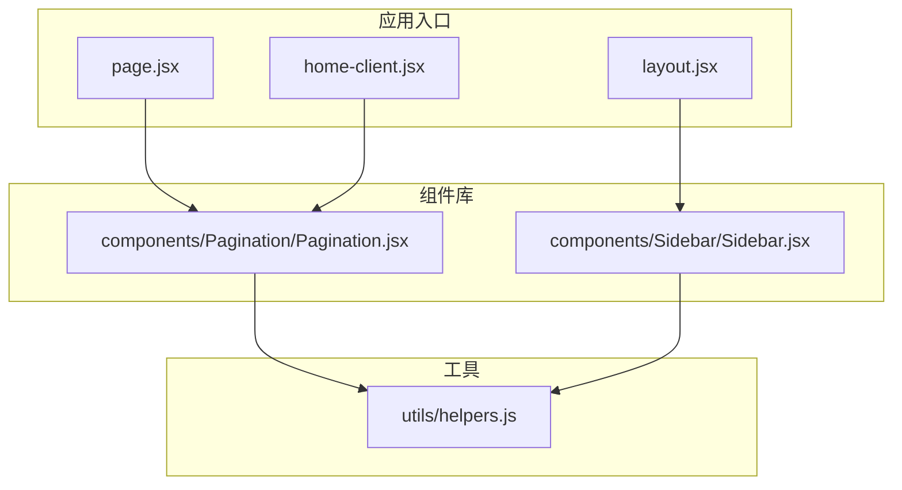
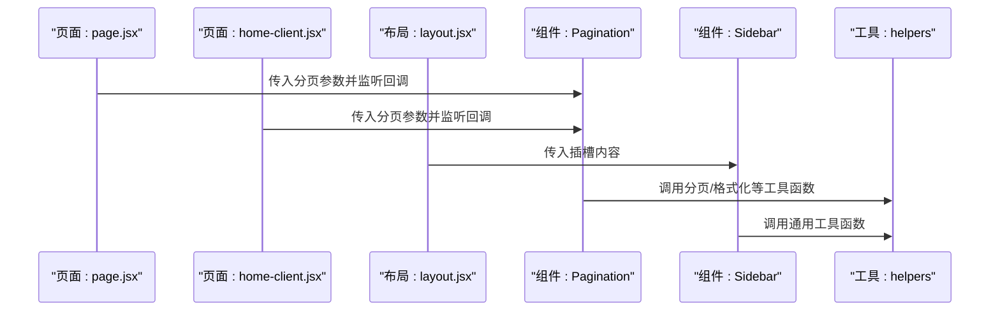
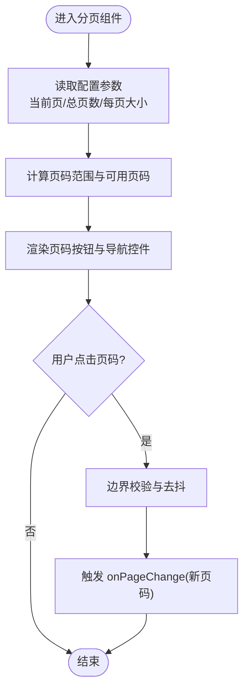
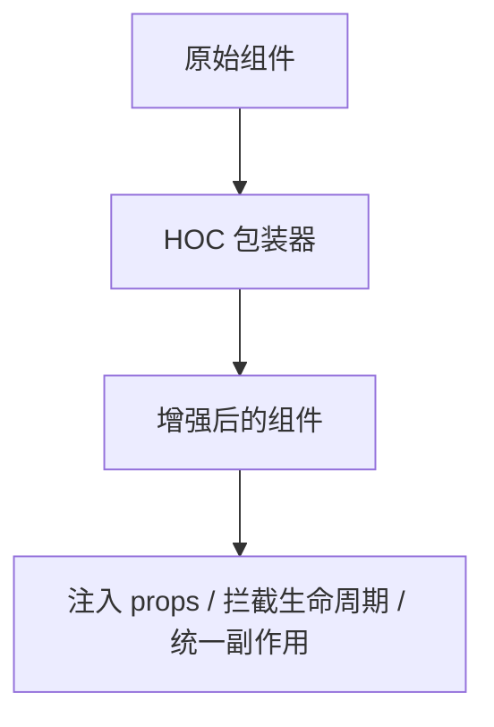
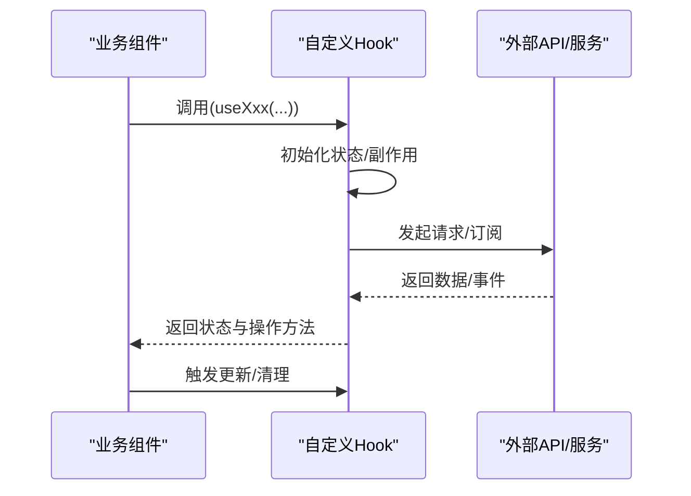
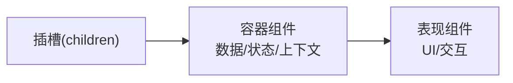
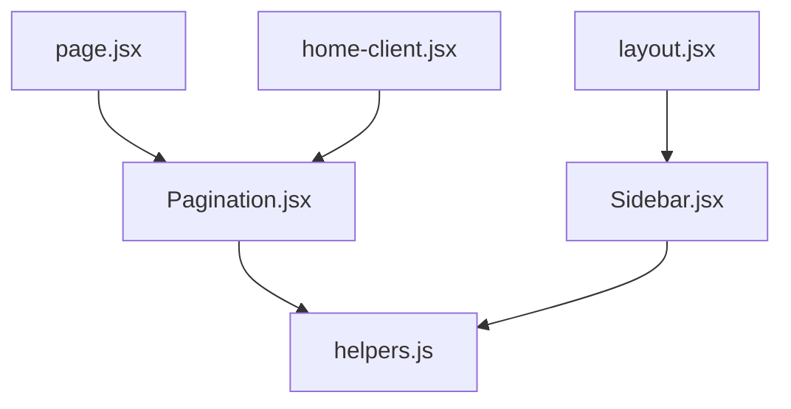

# 组件复用策略

<cite>
**本文引用的文件**   
- [src/components/Pagination/Pagination.jsx](file://src/components/Pagination/Pagination.jsx)
- [src/components/Sidebar/Sidebar.jsx](file://src/components/Sidebar/Sidebar.jsx)
- [src/utils/helpers.js](file://src/utils/helpers.js)
- [src/app/layout.jsx](file://src/app/layout.jsx)
- [src/app/page.jsx](file://src/app/page.jsx)
- [src/app/home-client.jsx](file://src/app/home-client.jsx)
</cite>

## 目录
1. [引言](#引言)
2. [项目结构](#项目结构)
3. [核心组件](#核心组件)
4. [架构总览](#架构总览)
5. [详细组件分析](#详细组件分析)
6. [依赖分析](#依赖分析)
7. [性能考虑](#性能考虑)
8. [故障排查指南](#故障排查指南)
9. [结论](#结论)
10. [附录](#附录)

## 引言
本文件面向前端工程中的“组件复用”主题，结合仓库中现有实现，系统化阐述提高组件复用性的设计模式与实现技巧。重点覆盖：
- 高阶组件（HOC）的使用场景与实现方式
- 自定义 Hooks 的开发模式（状态逻辑封装、副作用管理）
- 组件组合模式（插槽模式、容器组件设计）
- 工具函数与辅助模块的抽取策略
- 以 Pagination 分页组件与 Sidebar 侧边栏为例，展示可复用的参数配置与动态内容渲染

## 项目结构
本项目采用 Next.js 应用结构，UI 组件集中在 src/components，页面在 src/app，通用工具在 src/utils。本次文档聚焦于以下与复用相关的目录与文件：
- 组件层：Pagination、Sidebar 等基础/业务组件
- 页面层：layout、page、home-client 等作为容器或组合点
- 工具层：helpers 提供通用方法



图表来源
- [src/app/layout.jsx](file://src/app/layout.jsx)
- [src/app/page.jsx](file://src/app/page.jsx)
- [src/app/home-client.jsx](file://src/app/home-client.jsx)
- [src/components/Pagination/Pagination.jsx](file://src/components/Pagination/Pagination.jsx)
- [src/components/Sidebar/Sidebar.jsx](file://src/components/Sidebar/Sidebar.jsx)
- [src/utils/helpers.js](file://src/utils/helpers.js)

章节来源
- [src/app/layout.jsx](file://src/app/layout.jsx)
- [src/app/page.jsx](file://src/app/page.jsx)
- [src/app/home-client.jsx](file://src/app/home-client.jsx)
- [src/components/Pagination/Pagination.jsx](file://src/components/Pagination/Pagination.jsx)
- [src/components/Sidebar/Sidebar.jsx](file://src/components/Sidebar/Sidebar.jsx)
- [src/utils/helpers.js](file://src/utils/helpers.js)

## 核心组件
本节从“可复用性”的角度，梳理项目中关键组件的职责与扩展点：
- Pagination 分页组件：负责页码计算、导航事件派发、样式与交互细节；通过 props 暴露可配置项，便于在不同页面复用。
- Sidebar 侧边栏组件：负责侧边布局与内容区域渲染；通过插槽/子节点注入动态内容，提升组合灵活性。
- helpers 工具模块：提供跨组件复用的纯函数能力（如数据格式化、边界校验、列表分页辅助等），降低组件复杂度。

章节来源
- [src/components/Pagination/Pagination.jsx](file://src/components/Pagination/Pagination.jsx)
- [src/components/Sidebar/Sidebar.jsx](file://src/components/Sidebar/Sidebar.jsx)
- [src/utils/helpers.js](file://src/utils/helpers.js)

## 架构总览
下图展示了页面到组件再到工具的调用关系，体现“容器-表现-工具”的分层与组合方式：



图表来源
- [src/app/page.jsx](file://src/app/page.jsx)
- [src/app/home-client.jsx](file://src/app/home-client.jsx)
- [src/app/layout.jsx](file://src/app/layout.jsx)
- [src/components/Pagination/Pagination.jsx](file://src/components/Pagination/Pagination.jsx)
- [src/components/Sidebar/Sidebar.jsx](file://src/components/Sidebar/Sidebar.jsx)
- [src/utils/helpers.js](file://src/utils/helpers.js)

## 详细组件分析

### 分页组件（Pagination）复用策略
- 设计要点
  - 将“页码计算、边界处理、事件派发”与“具体业务数据获取”解耦，组件只关注 UI 与交互。
  - 通过 props 暴露可配置项（如当前页、总页数、每页条数、是否禁用等），并提供 onChange/onPageChange 回调供上层容器更新状态。
  - 内部使用工具函数进行边界校验与页码范围计算，保证健壮性与一致性。
- 典型用法
  - 在列表页或首页客户端组件中引入 Pagination，传入当前页与总数，并在回调中触发数据刷新。
- 可扩展点
  - 支持自定义页码按钮文案、跳转输入框、快捷页码段等。
  - 支持不同尺寸与主题风格（通过 className 或 theme 属性）。



图表来源
- [src/components/Pagination/Pagination.jsx](file://src/components/Pagination/Pagination.jsx)
- [src/utils/helpers.js](file://src/utils/helpers.js)

章节来源
- [src/components/Pagination/Pagination.jsx](file://src/components/Pagination/Pagination.jsx)
- [src/utils/helpers.js](file://src/utils/helpers.js)

### 侧边栏组件（Sidebar）复用策略
- 设计要点
  - 采用“容器 + 插槽”的组合模式：Sidebar 负责布局与样式，具体内容通过 children 或具名插槽注入，实现“同一容器，多种内容”。
  - 对常见区块（标题、列表、操作区）提供可选的子组件或占位符，便于按需启用。
  - 通过 props 控制显示/隐藏、宽度、响应式行为等。
- 典型用法
  - 在布局组件中引入 Sidebar，并将导航菜单、推荐文章等内容作为子节点传入。
- 可扩展点
  - 支持折叠/展开动画、滚动吸附、固定定位切换等。
  - 支持多列布局与分组标题。

```mermaid
classDiagram
class Sidebar {
+props : { title, width, collapsible, children }
+render() JSX
-handleToggle() void
}
class Layout {
+render() JSX
}
Layout --> Sidebar : "组合/注入内容"
```

图表来源
- [src/components/Sidebar/Sidebar.jsx](file://src/components/Sidebar/Sidebar.jsx)
- [src/app/layout.jsx](file://src/app/layout.jsx)

章节来源
- [src/components/Sidebar/Sidebar.jsx](file://src/components/Sidebar/Sidebar.jsx)
- [src/app/layout.jsx](file://src/app/layout.jsx)

### 高阶组件（HOC）使用场景与实现方式
- 适用场景
  - 横切关注点：权限校验、日志埋点、错误边界包裹、加载态统一处理、主题/语言上下文注入等。
  - 将重复的状态初始化、副作用清理、数据请求封装为 HOC，减少样板代码。
- 实现建议
  - 保持 HOC 无副作用、纯函数式，仅增强被包裹组件的 props 或行为。
  - 命名清晰（withXxx），避免过度嵌套；必要时提供 displayName 便于调试。
  - 与自定义 Hooks 互补：HOC 适合“包裹组件”，Hooks 适合“复用状态逻辑”。



[此图为概念示意，不直接映射具体源码文件]

### 自定义 Hooks 开发模式（状态逻辑封装与副作用管理）
- 职责划分
  - 将“状态定义、更新逻辑、副作用（如网络请求、定时器、订阅）”封装进 Hook，对外暴露最小 API。
  - 遵循单一职责原则，一个 Hook 解决一类问题（如 useList、usePagination、useAuth）。
- 最佳实践
  - 明确入参与返回值类型，做好默认值与边界处理。
  - 使用稳定的依赖数组，避免不必要的重渲染。
  - 对副作用进行清理（取消请求、移除监听），防止内存泄漏。
- 与 HOC 的关系
  - 优先使用 Hooks 表达状态逻辑；当需要“包裹组件”的能力时再选择 HOC。



[此图为概念示意，不直接映射具体源码文件]

### 组件组合模式（插槽与容器组件）
- 插槽模式
  - 将可变内容抽象为 children 或具名插槽，使容器组件具备“即插即用”的扩展能力。
- 容器组件
  - 容器负责“数据获取、状态管理、路由/上下文消费”，表现组件专注“UI 渲染与交互”。
  - 通过 props 传递数据与方法，保持低耦合与高内聚。



[此图为概念示意，不直接映射具体源码文件]

### 工具函数与辅助模块抽取策略
- 抽取原则
  - 纯函数优先：无副作用、可测试、可缓存。
  - 按领域组织：如分页、格式化、校验、日期时间、字符串处理等。
  - 稳定接口：向后兼容，变更需版本化与迁移说明。
- 在本项目中的应用
  - helpers 提供通用方法，被 Pagination、Sidebar 等组件复用，降低重复实现。

章节来源
- [src/utils/helpers.js](file://src/utils/helpers.js)

## 依赖分析
组件与工具之间的依赖关系如下：



图表来源
- [src/components/Pagination/Pagination.jsx](file://src/components/Pagination/Pagination.jsx)
- [src/components/Sidebar/Sidebar.jsx](file://src/components/Sidebar/Sidebar.jsx)
- [src/utils/helpers.js](file://src/utils/helpers.js)
- [src/app/layout.jsx](file://src/app/layout.jsx)
- [src/app/page.jsx](file://src/app/page.jsx)
- [src/app/home-client.jsx](file://src/app/home-client.jsx)

章节来源
- [src/components/Pagination/Pagination.jsx](file://src/components/Pagination/Pagination.jsx)
- [src/components/Sidebar/Sidebar.jsx](file://src/components/Sidebar/Sidebar.jsx)
- [src/utils/helpers.js](file://src/utils/helpers.js)
- [src/app/layout.jsx](file://src/app/layout.jsx)
- [src/app/page.jsx](file://src/app/page.jsx)
- [src/app/home-client.jsx](file://src/app/home-client.jsx)

## 性能考虑
- 分页组件
  - 避免在每次渲染时重新计算页码范围，可使用记忆化或惰性计算。
  - 大量页码按钮时，采用虚拟滚动或分段渲染。
- 侧边栏组件
  - 对重型子内容进行懒加载或按需渲染。
  - 合理使用 CSS 过渡与 transform，减少重排重绘。
- 工具函数
  - 对昂贵计算结果进行缓存（如 memoize）。
  - 避免在渲染路径中进行同步阻塞操作。

[本节为通用指导，不直接分析具体文件]

## 故障排查指南
- 分页异常
  - 检查传入的总页数、当前页、每页大小是否为有效数字且符合边界条件。
  - 确认 onPageChange 回调是否正确更新父级状态，避免死循环更新。
- 侧边栏内容不显示
  - 确认 children 或插槽内容是否正确传入。
  - 检查布局容器中是否存在遮挡或样式冲突。
- 工具函数报错
  - 核对入参类型与格式，确保空值与异常分支有兜底处理。

章节来源
- [src/components/Pagination/Pagination.jsx](file://src/components/Pagination/Pagination.jsx)
- [src/components/Sidebar/Sidebar.jsx](file://src/components/Sidebar/Sidebar.jsx)
- [src/utils/helpers.js](file://src/utils/helpers.js)

## 结论
通过合理的分层与组合（容器-表现-工具）、清晰的 props 契约、以及 HOC/Hooks 的恰当使用，可以显著提升组件的可复用性与可维护性。Pagination 与 Sidebar 的实现体现了“配置驱动 + 插槽组合 + 工具复用”的通用范式，建议在后续新增组件时沿用该模式，逐步沉淀为团队级的组件规范。

[本节为总结性内容，不直接分析具体文件]

## 附录
- 术语
  - HOC：高阶组件，用于增强或包装其他组件。
  - 插槽：将可变内容注入到容器组件中的机制。
  - 容器组件：负责数据与状态管理的组件。
  - 表现组件：专注于 UI 渲染与交互的组件。
- 参考文件
  - [src/components/Pagination/Pagination.jsx](file://src/components/Pagination/Pagination.jsx)
  - [src/components/Sidebar/Sidebar.jsx](file://src/components/Sidebar/Sidebar.jsx)
  - [src/utils/helpers.js](file://src/utils/helpers.js)
  - [src/app/layout.jsx](file://src/app/layout.jsx)
  - [src/app/page.jsx](file://src/app/page.jsx)
  - [src/app/home-client.jsx](file://src/app/home-client.jsx)