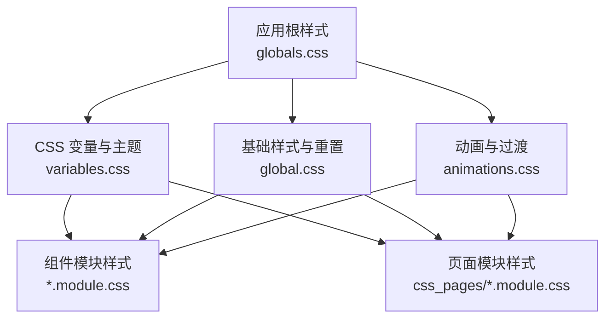
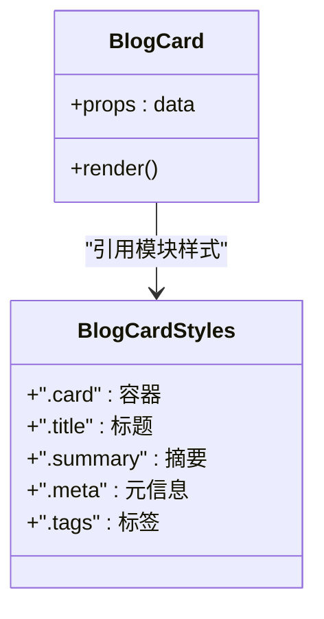
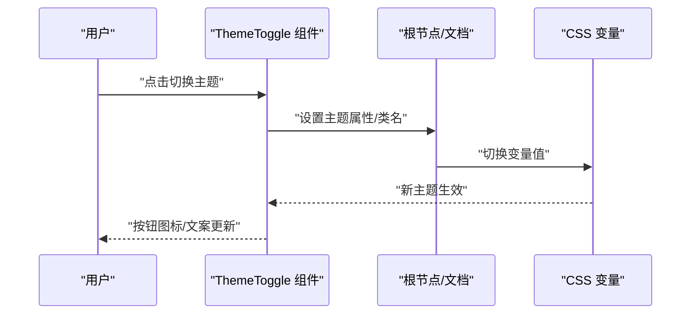
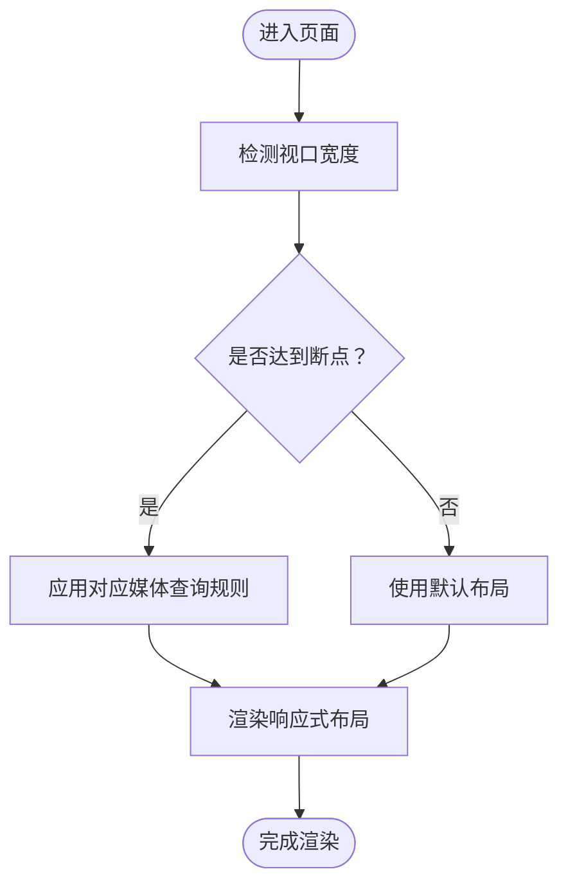
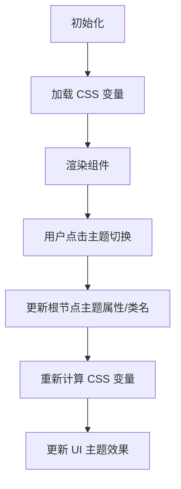
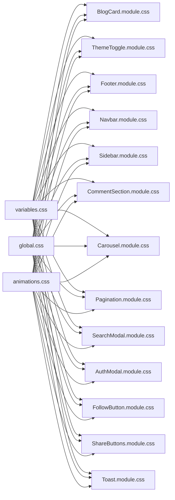

# 组件样式管理

<cite>
**本文引用的文件**   
- [src/app/globals.css](file://src/app/globals.css)
- [src/styles/variables.css](file://src/styles/variables.css)
- [src/styles/global.css](file://src/styles/global.css)
- [src/styles/animations.css](file://src/styles/animations.css)
- [src/components/BlogCard/BlogCard.jsx](file://src/components/BlogCard/BlogCard.jsx)
- [src/components/BlogCard/BlogCard.module.css](file://src/components/BlogCard/BlogCard.module.css)
- [src/components/ThemeToggle/ThemeToggle.jsx](file://src/components/ThemeToggle/ThemeToggle.jsx)
- [src/components/ThemeToggle/ThemeToggle.module.css](file://src/components/ThemeToggle/ThemeToggle.module.css)
- [src/components/Footer/Footer.jsx](file://src/components/Footer/Footer.jsx)
- [src/components/Footer/Footer.module.css](file://src/components/Footer/Footer.module.css)
- [src/components/Navbar/navbar.jsx](file://src/components/Navbar/navbar.jsx)
- [src/components/Navbar/Navbar.module.css](file://src/components/Navbar/Navbar.module.css)
- [src/components/Sidebar/Sidebar.jsx](file://src/components/Sidebar/Sidebar.jsx)
- [src/components/Sidebar/Sidebar.module.css](file://src/components/Sidebar/Sidebar.module.css)
- [src/components/CommentSection/CommentSection.jsx](file://src/components/CommentSection/CommentSection.jsx)
- [src/components/CommentSection/CommentSection.module.css](file://src/components/CommentSection/CommentSection.module.css)
- [src/components/Carousel/Carousel.jsx](file://src/components/Carousel/Carousel.jsx)
- [src/components/Carousel/Carousel.module.css](file://src/components/Carousel/Carousel.module.css)
- [src/components/Pagination/Pagination.jsx](file://src/components/Pagination/Pagination.jsx)
- [src/components/Pagination/Pagination.module.css](file://src/components/Pagination/Pagination.module.css)
- [src/components/SearchModal/searchmodal.jsx](file://src/components/SearchModal/searchmodal.jsx)
- [src/components/SearchModal/SearchModal.module.css](file://src/components/SearchModal/SearchModal.module.css)
- [src/components/AuthModal/AuthModal.jsx](file://src/components/AuthModal/AuthModal.jsx)
- [src/components/AuthModal/AuthModal.module.css](file://src/components/AuthModal/AuthModal.module.css)
- [src/components/FollowButton/followbutton.jsx](file://src/components/FollowButton/followbutton.jsx)
- [src/components/FollowButton/FollowButton.module.css](file://src/components/FollowButton/FollowButton.module.css)
- [src/components/ShareButtons/ShareButtons.jsx](file://src/components/ShareButtons/ShareButtons.jsx)
- [src/components/ShareButtons/ShareButtons.module.css](file://src/components/ShareButtons/ShareButtons.module.css)
- [src/components/Toast/Toast.jsx](file://src/components/Toast/Toast.jsx)
- [src/components/Toast/Toast.module.css](file://src/components/Toast/Toast.module.css)
- [src/css_pages/home.jsx](file://src/css_pages/home.jsx)
- [src/css_pages/home.module.css](file://src/css_pages/home.module.css)
- [src/css_pages/about.jsx](file://src/css_pages/about.jsx)
- [src/css_pages/about.module.css](file://src/css_pages/about.module.css)
- [src/css_pages/posteditor.module.css](file://src/css_pages/posteditor.module.css)
- [src/css_pages/Admin.jsx](file://src/css_pages/Admin.jsx)
- [src/css_pages/Admin.module.css](file://src/css_pages/Admin.module.css)
- [next.config.mjs](file://next.config.mjs)
- [postcss.config.mjs](file://postcss.config.mjs)
</cite>

## 目录
1. [简介](#简介)
2. [项目结构](#项目结构)
3. [核心组件](#核心组件)
4. [架构总览](#架构总览)
5. [详细组件分析](#详细组件分析)
6. [依赖分析](#依赖分析)
7. [性能考虑](#性能考虑)
8. [故障排查指南](#故障排查指南)
9. [结论](#结论)
10. [附录](#附录)

## 简介
本文件聚焦于前端样式管理与组织策略，覆盖以下主题：
- CSS 模块化方案与命名约定（.module.css）
- 样式隔离机制，避免冲突与全局污染
- 主题系统实现（深色模式切换、变量管理）
- 响应式设计策略（媒体查询、弹性布局）
- 最佳实践示例（BlogCard 卡片封装、ThemeToggle 主题切换）

## 项目结构
本项目采用“全局样式 + 组件级模块样式”的混合组织方式：
- 全局样式集中于 src/app/globals.css 与 src/styles/*，用于根变量、基础重置、动画等
- 组件样式以 .module.css 形式就近存放，确保样式局部作用域与可维护性
- 页面级样式在 src/css_pages/* 中按页面拆分，便于独立演进

```mermaid
graph TB
A["应用入口<br/>globals.css"] --> B["全局样式集<br/>styles/global.css"]
A --> C["CSS 变量与主题<br/>styles/variables.css"]
A --> D["动画与过渡<br/>styles/animations.css"]
subgraph "组件样式模块化"
E["BlogCard.module.css"]
F["ThemeToggle.module.css"]
G["Footer.module.css"]
H["Navbar.module.css"]
I["Sidebar.module.css"]
J["CommentSection.module.css"]
K["Carousel.module.css"]
L["Pagination.module.css"]
M["SearchModal.module.css"]
N["AuthModal.module.css"]
O["FollowButton.module.css"]
P["ShareButtons.module.css"]
Q["Toast.module.css"]
end
subgraph "页面样式模块化"
R["home.module.css"]
S["about.module.css"]
T["posteditor.module.css"]
U["Admin.module.css"]
end
B --> E
B --> F
B --> G
B --> H
B --> I
B --> J
B --> K
B --> L
B --> M
B --> N
B --> O
B --> P
B --> Q
C --> E
C --> F
C --> G
C --> H
C --> I
C --> J
C --> K
C --> L
C --> M
C --> N
C --> O
C --> P
C --> Q
C --> R
C --> S
C --> T
C --> U
```

图示来源
- [src/app/globals.css](file://src/app/globals.css)
- [src/styles/variables.css](file://src/styles/variables.css)
- [src/styles/global.css](file://src/styles/global.css)
- [src/styles/animations.css](file://src/styles/animations.css)
- [src/components/BlogCard/BlogCard.module.css](file://src/components/BlogCard/BlogCard.module.css)
- [src/components/ThemeToggle/ThemeToggle.module.css](file://src/components/ThemeToggle/ThemeToggle.module.css)
- [src/components/Footer/Footer.module.css](file://src/components/Footer/Footer.module.css)
- [src/components/Navbar/Navbar.module.css](file://src/components/Navbar/Navbar.module.css)
- [src/components/Sidebar/Sidebar.module.css](file://src/components/Sidebar/Sidebar.module.css)
- [src/components/CommentSection/CommentSection.module.css](file://src/components/CommentSection/CommentSection.module.css)
- [src/components/Carousel/Carousel.module.css](file://src/components/Carousel/Carousel.module.css)
- [src/components/Pagination/Pagination.module.css](file://src/components/Pagination/Pagination.module.css)
- [src/components/SearchModal/SearchModal.module.css](file://src/components/SearchModal/SearchModal.module.css)
- [src/components/AuthModal/AuthModal.module.css](file://src/components/AuthModal/AuthModal.module.css)
- [src/components/FollowButton/FollowButton.module.css](file://src/components/FollowButton/FollowButton.module.css)
- [src/components/ShareButtons/ShareButtons.module.css](file://src/components/ShareButtons/ShareButtons.module.css)
- [src/components/Toast/Toast.module.css](file://src/components/Toast/Toast.module.css)
- [src/css_pages/home.module.css](file://src/css_pages/home.module.css)
- [src/css_pages/about.module.css](file://src/css_pages/about.module.css)
- [src/css_pages/posteditor.module.css](file://src/css_pages/posteditor.module.css)
- [src/css_pages/Admin.module.css](file://src/css_pages/Admin.module.css)

章节来源
- [src/app/globals.css](file://src/app/globals.css)
- [src/styles/variables.css](file://src/styles/variables.css)
- [src/styles/global.css](file://src/styles/global.css)
- [src/styles/animations.css](file://src/styles/animations.css)
- [src/components/BlogCard/BlogCard.jsx](file://src/components/BlogCard/BlogCard.jsx)
- [src/components/BlogCard/BlogCard.module.css](file://src/components/BlogCard/BlogCard.module.css)
- [src/components/ThemeToggle/ThemeToggle.jsx](file://src/components/ThemeToggle/ThemeToggle.jsx)
- [src/components/ThemeToggle/ThemeToggle.module.css](file://src/components/ThemeToggle/ThemeToggle.module.css)
- [src/components/Footer/Footer.jsx](file://src/components/Footer/Footer.jsx)
- [src/components/Footer/Footer.module.css](file://src/components/Footer/Footer.module.css)
- [src/components/Navbar/navbar.jsx](file://src/components/Navbar/navbar.jsx)
- [src/components/Navbar/Navbar.module.css](file://src/components/Navbar/Navbar.module.css)
- [src/components/Sidebar/Sidebar.jsx](file://src/components/Sidebar/Sidebar.jsx)
- [src/components/Sidebar/Sidebar.module.css](file://src/components/Sidebar/Sidebar.module.css)
- [src/components/CommentSection/CommentSection.jsx](file://src/components/CommentSection/CommentSection.jsx)
- [src/components/CommentSection/CommentSection.module.css](file://src/components/CommentSection/CommentSection.module.css)
- [src/components/Carousel/Carousel.jsx](file://src/components/Carousel/Carousel.jsx)
- [src/components/Carousel/Carousel.module.css](file://src/components/Carousel/Carousel.module.css)
- [src/components/Pagination/Pagination.jsx](file://src/components/Pagination/Pagination.jsx)
- [src/components/Pagination/Pagination.module.css](file://src/components/Pagination/Pagination.module.css)
- [src/components/SearchModal/searchmodal.jsx](file://src/components/SearchModal/searchmodal.jsx)
- [src/components/SearchModal/SearchModal.module.css](file://src/components/SearchModal/SearchModal.module.css)
- [src/components/AuthModal/AuthModal.jsx](file://src/components/AuthModal/AuthModal.jsx)
- [src/components/AuthModal/AuthModal.module.css](file://src/components/AuthModal/AuthModal.module.css)
- [src/components/FollowButton/followbutton.jsx](file://src/components/FollowButton/followbutton.jsx)
- [src/components/FollowButton/FollowButton.module.css](file://src/components/FollowButton/FollowButton.module.css)
- [src/components/ShareButtons/ShareButtons.jsx](file://src/components/ShareButtons/ShareButtons.jsx)
- [src/components/ShareButtons/ShareButtons.module.css](file://src/components/ShareButtons/ShareButtons.module.css)
- [src/components/Toast/Toast.jsx](file://src/components/Toast/Toast.jsx)
- [src/components/Toast/Toast.module.css](file://src/components/Toast/Toast.module.css)
- [src/css_pages/home.jsx](file://src/css_pages/home.jsx)
- [src/css_pages/home.module.css](file://src/css_pages/home.module.css)
- [src/css_pages/about.jsx](file://src/css_pages/about.jsx)
- [src/css_pages/about.module.css](file://src/css_pages/about.module.css)
- [src/css_pages/posteditor.module.css](file://src/css_pages/posteditor.module.css)
- [src/css_pages/Admin.jsx](file://src/css_pages/Admin.jsx)
- [src/css_pages/Admin.module.css](file://src/css_pages/Admin.module.css)

## 核心组件
本节从样式角度梳理关键组件的职责与样式边界。

- BlogCard 卡片
  - 职责：展示文章摘要信息，包含标题、摘要、标签、作者等视觉元素
  - 样式要点：使用模块样式隔离；通过 CSS 变量控制颜色、圆角、阴影等；支持悬停态与焦点态
  - 参考路径：[BlogCard.jsx](file://src/components/BlogCard/BlogCard.jsx)、[BlogCard.module.css](file://src/components/BlogCard/BlogCard.module.css)

- ThemeToggle 主题切换
  - 职责：提供明暗主题切换入口，驱动全局主题状态变化
  - 样式要点：按钮图标与背景色随主题切换；通过 CSS 变量或类名切换实现
  - 参考路径：[ThemeToggle.jsx](file://src/components/ThemeToggle/ThemeToggle.jsx)、[ThemeToggle.module.css](file://src/components/ThemeToggle/ThemeToggle.module.css)

- Footer 页脚
  - 职责：站点底部导航与版权信息
  - 样式要点：使用 Flex 布局对齐内容；适配移动端堆叠显示
  - 参考路径：[Footer.jsx](file://src/components/Footer/Footer.jsx)、[Footer.module.css](file://src/components/Footer/Footer.module.css)

- Navbar 导航栏
  - 职责：顶部导航与搜索入口
  - 样式要点：固定定位、层级控制、响应式折叠
  - 参考路径：[navbar.jsx](file://src/components/Navbar/navbar.jsx)、[Navbar.module.css](file://src/components/Navbar/Navbar.module.css)

- Sidebar 侧边栏
  - 职责：分类、标签、归档等辅助导航
  - 样式要点：宽度自适应、滚动区域限制
  - 参考路径：[Sidebar.jsx](file://src/components/Sidebar/Sidebar.jsx)、[Sidebar.module.css](file://src/components/Sidebar/Sidebar.module.css)

- CommentSection 评论区
  - 职责：评论列表与输入框
  - 样式要点：嵌套层级清晰、输入框与按钮对齐
  - 参考路径：[CommentSection.jsx](file://src/components/CommentSection/CommentSection.jsx)、[CommentSection.module.css](file://src/components/CommentSection/CommentSection.module.css)

- Carousel 轮播
  - 职责：首页或专题图片轮播
  - 样式要点：容器溢出隐藏、指示器定位
  - 参考路径：[Carousel.jsx](file://src/components/Carousel/Carousel.jsx)、[Carousel.module.css](file://src/components/Carousel/Carousel.module.css)

- Pagination 分页
  - 职责：列表分页控件
  - 样式要点：居中排列、禁用态与激活态区分
  - 参考路径：[Pagination.jsx](file://src/components/Pagination/Pagination.jsx)、[Pagination.module.css](file://src/components/Pagination/Pagination.module.css)

- SearchModal 搜索弹窗
  - 职责：全屏或半屏搜索界面
  - 样式要点：遮罩层、输入高亮、结果列表滚动
  - 参考路径：[searchmodal.jsx](file://src/components/SearchModal/searchmodal.jsx)、[SearchModal.module.css](file://src/components/SearchModal/SearchModal.module.css)

- AuthModal 认证弹窗
  - 职责：登录/注册表单弹窗
  - 样式要点：表单布局、错误提示、关闭按钮
  - 参考路径：[AuthModal.jsx](file://src/components/AuthModal/AuthModal.jsx)、[AuthModal.module.css](file://src/components/AuthModal/AuthModal.module.css)

- FollowButton 关注按钮
  - 职责：用户关注/取消关注操作
  - 样式要点：状态切换、禁用态
  - 参考路径：[followbutton.jsx](file://src/components/FollowButton/followbutton.jsx)、[FollowButton.module.css](file://src/components/FollowButton/FollowButton.module.css)

- ShareButtons 分享按钮组
  - 职责：多平台分享入口
  - 样式要点：图标对齐、间距一致
  - 参考路径：[ShareButtons.jsx](file://src/components/ShareButtons/ShareButtons.jsx)、[ShareButtons.module.css](file://src/components/ShareButtons/ShareButtons.module.css)

- Toast 消息提示
  - 职责：轻量通知反馈
  - 样式要点：定位、层级、淡入淡出动画
  - 参考路径：[Toast.jsx](file://src/components/Toast/Toast.jsx)、[Toast.module.css](file://src/components/Toast/Toast.module.css)

章节来源
- [src/components/BlogCard/BlogCard.jsx](file://src/components/BlogCard/BlogCard.jsx)
- [src/components/BlogCard/BlogCard.module.css](file://src/components/BlogCard/BlogCard.module.css)
- [src/components/ThemeToggle/ThemeToggle.jsx](file://src/components/ThemeToggle/ThemeToggle.jsx)
- [src/components/ThemeToggle/ThemeToggle.module.css](file://src/components/ThemeToggle/ThemeToggle.module.css)
- [src/components/Footer/Footer.jsx](file://src/components/Footer/Footer.jsx)
- [src/components/Footer/Footer.module.css](file://src/components/Footer/Footer.module.css)
- [src/components/Navbar/navbar.jsx](file://src/components/Navbar/navbar.jsx)
- [src/components/Navbar/Navbar.module.css](file://src/components/Navbar/Navbar.module.css)
- [src/components/Sidebar/Sidebar.jsx](file://src/components/Sidebar/Sidebar.jsx)
- [src/components/Sidebar/Sidebar.module.css](file://src/components/Sidebar/Sidebar.module.css)
- [src/components/CommentSection/CommentSection.jsx](file://src/components/CommentSection/CommentSection.jsx)
- [src/components/CommentSection/CommentSection.module.css](file://src/components/CommentSection/CommentSection.module.css)
- [src/components/Carousel/Carousel.jsx](file://src/components/Carousel/Carousel.jsx)
- [src/components/Carousel/Carousel.module.css](file://src/components/Carousel/Carousel.module.css)
- [src/components/Pagination/Pagination.jsx](file://src/components/Pagination/Pagination.jsx)
- [src/components/Pagination/Pagination.module.css](file://src/components/Pagination/Pagination.module.css)
- [src/components/SearchModal/searchmodal.jsx](file://src/components/SearchModal/searchmodal.jsx)
- [src/components/SearchModal/SearchModal.module.css](file://src/components/SearchModal/SearchModal.module.css)
- [src/components/AuthModal/AuthModal.jsx](file://src/components/AuthModal/AuthModal.jsx)
- [src/components/AuthModal/AuthModal.module.css](file://src/components/AuthModal/AuthModal.module.css)
- [src/components/FollowButton/followbutton.jsx](file://src/components/FollowButton/followbutton.jsx)
- [src/components/FollowButton/FollowButton.module.css](file://src/components/FollowButton/FollowButton.module.css)
- [src/components/ShareButtons/ShareButtons.jsx](file://src/components/ShareButtons/ShareButtons.jsx)
- [src/components/ShareButtons/ShareButtons.module.css](file://src/components/ShareButtons/ShareButtons.module.css)
- [src/components/Toast/Toast.jsx](file://src/components/Toast/Toast.jsx)
- [src/components/Toast/Toast.module.css](file://src/components/Toast/Toast.module.css)

## 架构总览
样式架构遵循“全局变量 + 组件模块样式 + 页面模块样式”的分层模型：
- 全局层：定义 CSS 变量、基础重置、通用动画
- 组件层：每个组件拥有独立的 .module.css，仅作用于自身 DOM 树
- 页面层：页面级样式集中在 css_pages 下，按需引入

图示来源
- [src/app/globals.css](file://src/app/globals.css)
- [src/styles/variables.css](file://src/styles/variables.css)
- [src/styles/global.css](file://src/styles/global.css)
- [src/styles/animations.css](file://src/styles/animations.css)

## 详细组件分析

### BlogCard 卡片样式封装
- 设计目标：将文章卡片的外观与交互封装为独立模块，避免外部样式污染
- 样式策略：
  - 使用模块样式限定作用域
  - 通过 CSS 变量统一控制颜色、圆角、阴影、字体大小
  - 使用 Flex/Grid 进行内部排版，保证在不同屏幕尺寸下的可读性
  - 提供悬停、焦点、禁用等状态样式
- 推荐用法：在父组件中以 props 传入数据，由模块样式负责呈现

图示来源
- [src/components/BlogCard/BlogCard.jsx](file://src/components/BlogCard/BlogCard.jsx)
- [src/components/BlogCard/BlogCard.module.css](file://src/components/BlogCard/BlogCard.module.css)

章节来源
- [src/components/BlogCard/BlogCard.jsx](file://src/components/BlogCard/BlogCard.jsx)
- [src/components/BlogCard/BlogCard.module.css](file://src/components/BlogCard/BlogCard.module.css)

### ThemeToggle 主题切换实现
- 设计目标：提供明暗主题切换能力，并影响全局样式变量
- 实现思路：
  - 组件内部维护主题状态，并在切换时更新全局根节点的主题属性或类名
  - 通过 CSS 变量在根节点上定义明/暗两套值，组件样式直接消费这些变量
  - 可选：持久化到本地存储，保持用户偏好
- 交互流程

图示来源
- [src/components/ThemeToggle/ThemeToggle.jsx](file://src/components/ThemeToggle/ThemeToggle.jsx)
- [src/components/ThemeToggle/ThemeToggle.module.css](file://src/components/ThemeToggle/ThemeToggle.module.css)
- [src/styles/variables.css](file://src/styles/variables.css)

章节来源
- [src/components/ThemeToggle/ThemeToggle.jsx](file://src/components/ThemeToggle/ThemeToggle.jsx)
- [src/components/ThemeToggle/ThemeToggle.module.css](file://src/components/ThemeToggle/ThemeToggle.module.css)
- [src/styles/variables.css](file://src/styles/variables.css)

### 响应式设计策略
- 媒体查询：在组件模块样式中使用断点，针对小屏设备调整布局与字号
- 弹性布局：优先使用 Flexbox 与 Grid，减少绝对定位带来的脆弱性
- 流式单位：合理使用相对单位（如 rem、em、%），提升缩放一致性
- 示例参考：
  - 导航栏在小屏下折叠为汉堡菜单
  - 卡片列表在窄屏下改为单列布局
  - 弹窗在全屏模式下优化输入体验

章节来源
- [src/components/Navbar/Navbar.module.css](file://src/components/Navbar/Navbar.module.css)
- [src/components/Footer/Footer.module.css](file://src/components/Footer/Footer.module.css)
- [src/components/BlogCard/BlogCard.module.css](file://src/components/BlogCard/BlogCard.module.css)
- [src/components/SearchModal/SearchModal.module.css](file://src/components/SearchModal/SearchModal.module.css)

### 样式隔离与命名约定
- 模块化：所有组件样式使用 .module.css，借助构建工具生成唯一类名，避免冲突
- 命名规范：
  - 组件级：组件名 + 子元素描述，如 card、title、actions
  - 状态类：语义化前缀，如 is-active、is-disabled
  - 变体类：基于用途或外观，如 variant-primary、variant-danger
- 避免全局污染：
  - 不在组件样式中直接选择全局标签或 ID
  - 尽量使用 CSS 变量替代硬编码颜色与尺寸

章节来源
- [src/components/BlogCard/BlogCard.module.css](file://src/components/BlogCard/BlogCard.module.css)
- [src/components/ThemeToggle/ThemeToggle.module.css](file://src/components/ThemeToggle/ThemeToggle.module.css)
- [src/components/Footer/Footer.module.css](file://src/components/Footer/Footer.module.css)
- [src/components/Navbar/Navbar.module.css](file://src/components/Navbar/Navbar.module.css)
- [src/components/Sidebar/Sidebar.module.css](file://src/components/Sidebar/Sidebar.module.css)
- [src/components/CommentSection/CommentSection.module.css](file://src/components/CommentSection/CommentSection.module.css)
- [src/components/Carousel/Carousel.module.css](file://src/components/Carousel/Carousel.module.css)
- [src/components/Pagination/Pagination.module.css](file://src/components/Pagination/Pagination.module.css)
- [src/components/SearchModal/SearchModal.module.css](file://src/components/SearchModal/SearchModal.module.css)
- [src/components/AuthModal/AuthModal.module.css](file://src/components/AuthModal/AuthModal.module.css)
- [src/components/FollowButton/FollowButton.module.css](file://src/components/FollowButton/FollowButton.module.css)
- [src/components/ShareButtons/ShareButtons.module.css](file://src/components/ShareButtons/ShareButtons.module.css)
- [src/components/Toast/Toast.module.css](file://src/components/Toast/Toast.module.css)

### 主题系统与变量管理
- 变量集中：在 variables.css 中定义明/暗主题所需的颜色、阴影、圆角、字号等
- 切换机制：ThemeToggle 组件切换根节点主题属性或类名，从而触发变量值变化
- 扩展建议：新增主题只需在变量文件中添加键值对，并在切换逻辑中映射

图示来源
- [src/styles/variables.css](file://src/styles/variables.css)
- [src/components/ThemeToggle/ThemeToggle.jsx](file://src/components/ThemeToggle/ThemeToggle.jsx)
- [src/components/ThemeToggle/ThemeToggle.module.css](file://src/components/ThemeToggle/ThemeToggle.module.css)

章节来源
- [src/styles/variables.css](file://src/styles/variables.css)
- [src/components/ThemeToggle/ThemeToggle.jsx](file://src/components/ThemeToggle/ThemeToggle.jsx)
- [src/components/ThemeToggle/ThemeToggle.module.css](file://src/components/ThemeToggle/ThemeToggle.module.css)

### 最佳实践示例
- BlogCard 卡片封装
  - 将卡片结构与样式绑定，对外暴露最小接口
  - 使用 CSS 变量控制主题相关外观
  - 在模块样式内处理悬停、焦点、禁用等状态
  - 参考路径：[BlogCard.jsx](file://src/components/BlogCard/BlogCard.jsx)、[BlogCard.module.css](file://src/components/BlogCard/BlogCard.module.css)

- ThemeToggle 主题切换
  - 组件只负责交互与状态同步，不关心具体样式细节
  - 通过根节点属性或类名驱动全局变量切换
  - 参考路径：[ThemeToggle.jsx](file://src/components/ThemeToggle/ThemeToggle.jsx)、[ThemeToggle.module.css](file://src/components/ThemeToggle/ThemeToggle.module.css)

章节来源
- [src/components/BlogCard/BlogCard.jsx](file://src/components/BlogCard/BlogCard.jsx)
- [src/components/BlogCard/BlogCard.module.css](file://src/components/BlogCard/BlogCard.module.css)
- [src/components/ThemeToggle/ThemeToggle.jsx](file://src/components/ThemeToggle/ThemeToggle.jsx)
- [src/components/ThemeToggle/ThemeToggle.module.css](file://src/components/ThemeToggle/ThemeToggle.module.css)

## 依赖分析
样式依赖关系主要体现为“全局变量被多处消费”，以及“组件模块样式仅依赖自身 DOM”。

图示来源
- [src/styles/variables.css](file://src/styles/variables.css)
- [src/styles/global.css](file://src/styles/global.css)
- [src/styles/animations.css](file://src/styles/animations.css)
- [src/components/BlogCard/BlogCard.module.css](file://src/components/BlogCard/BlogCard.module.css)
- [src/components/ThemeToggle/ThemeToggle.module.css](file://src/components/ThemeToggle/ThemeToggle.module.css)
- [src/components/Footer/Footer.module.css](file://src/components/Footer/Footer.module.css)
- [src/components/Navbar/Navbar.module.css](file://src/components/Navbar/Navbar.module.css)
- [src/components/Sidebar/Sidebar.module.css](file://src/components/Sidebar/Sidebar.module.css)
- [src/components/CommentSection/CommentSection.module.css](file://src/components/CommentSection/CommentSection.module.css)
- [src/components/Carousel/Carousel.module.css](file://src/components/Carousel/Carousel.module.css)
- [src/components/Pagination/Pagination.module.css](file://src/components/Pagination/Pagination.module.css)
- [src/components/SearchModal/SearchModal.module.css](file://src/components/SearchModal/SearchModal.module.css)
- [src/components/AuthModal/AuthModal.module.css](file://src/components/AuthModal/AuthModal.module.css)
- [src/components/FollowButton/FollowButton.module.css](file://src/components/FollowButton/FollowButton.module.css)
- [src/components/ShareButtons/ShareButtons.module.css](file://src/components/ShareButtons/ShareButtons.module.css)
- [src/components/Toast/Toast.module.css](file://src/components/Toast/Toast.module.css)

章节来源
- [src/styles/variables.css](file://src/styles/variables.css)
- [src/styles/global.css](file://src/styles/global.css)
- [src/styles/animations.css](file://src/styles/animations.css)

## 性能考虑
- 减少全局样式体积：将通用样式拆分为模块，按需引入
- 利用 CSS 变量：避免重复声明，降低样式表体积
- 控制动画复杂度：仅在必要时启用复杂过渡，避免重排重绘开销
- 合理组织媒体查询：合并相近断点，减少重复规则
- 构建配置：确认 Next.js 与 PostCSS 已启用 CSS Modules 与必要的插件

章节来源
- [next.config.mjs](file://next.config.mjs)
- [postcss.config.mjs](file://postcss.config.mjs)

## 故障排查指南
- 样式未生效
  - 检查模块样式是否正确导入
  - 确认类名未被覆盖或拼写错误
  - 查看浏览器开发者工具的样式面板，确认最终计算样式
- 主题切换无效
  - 检查根节点主题属性或类名是否更新
  - 确认 CSS 变量键名一致且值正确
  - 验证 ThemeToggle 组件的事件绑定
- 响应式异常
  - 核对媒体查询断点是否与预期一致
  - 检查父容器的宽高与 overflow 设置
  - 确认 Flex/Grid 的子项约束是否合理
- 全局污染
  - 避免在模块样式中选择全局标签或 ID
  - 使用更具体的选择器或组合类名限定范围

章节来源
- [src/components/ThemeToggle/ThemeToggle.jsx](file://src/components/ThemeToggle/ThemeToggle.jsx)
- [src/components/ThemeToggle/ThemeToggle.module.css](file://src/components/ThemeToggle/ThemeToggle.module.css)
- [src/styles/variables.css](file://src/styles/variables.css)
- [src/components/BlogCard/BlogCard.module.css](file://src/components/BlogCard/BlogCard.module.css)
- [src/components/Navbar/Navbar.module.css](file://src/components/Navbar/Navbar.module.css)
- [src/components/Footer/Footer.module.css](file://src/components/Footer/Footer.module.css)

## 结论
本项目采用清晰的样式分层与模块化策略，结合 CSS 变量实现了灵活的主题系统。通过组件级 .module.css 有效避免了样式冲突与全局污染，同时利用响应式布局提升了跨设备体验。建议在后续迭代中持续完善变量体系、统一命名规范，并对复杂组件引入更细粒度的样式拆分与测试用例。

## 附录
- 页面级样式示例（供参考）
  - 首页样式：[home.jsx](file://src/css_pages/home.jsx)、[home.module.css](file://src/css_pages/home.module.css)
  - 关于页样式：[about.jsx](file://src/css_pages/about.jsx)、[about.module.css](file://src/css_pages/about.module.css)
  - 编辑器样式片段：[posteditor.module.css](file://src/css_pages/posteditor.module.css)
  - 后台管理样式：[Admin.jsx](file://src/css_pages/Admin.jsx)、[Admin.module.css](file://src/css_pages/Admin.module.css)

章节来源
- [src/css_pages/home.jsx](file://src/css_pages/home.jsx)
- [src/css_pages/home.module.css](file://src/css_pages/home.module.css)
- [src/css_pages/about.jsx](file://src/css_pages/about.jsx)
- [src/css_pages/about.module.css](file://src/css_pages/about.module.css)
- [src/css_pages/posteditor.module.css](file://src/css_pages/posteditor.module.css)
- [src/css_pages/Admin.jsx](file://src/css_pages/Admin.jsx)
- [src/css_pages/Admin.module.css](file://src/css_pages/Admin.module.css)