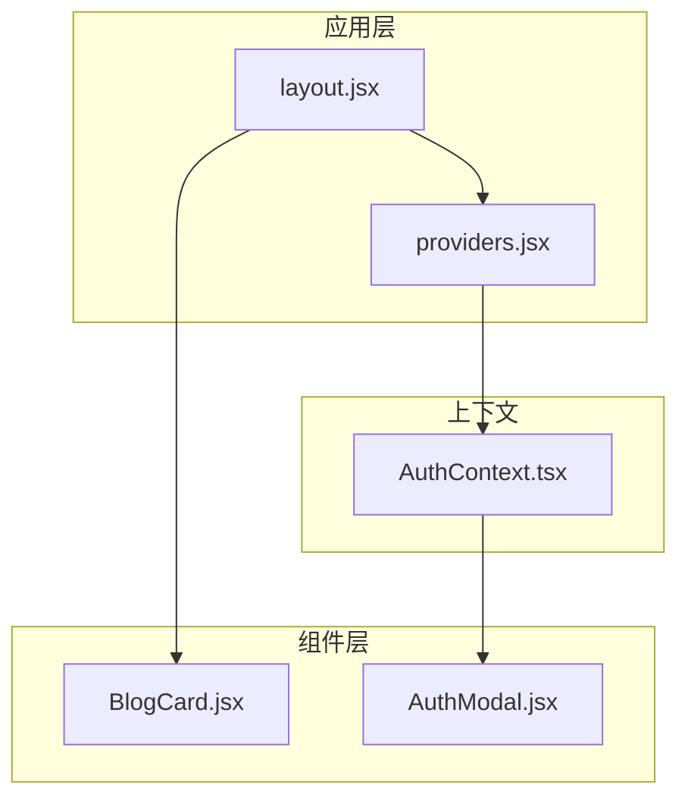
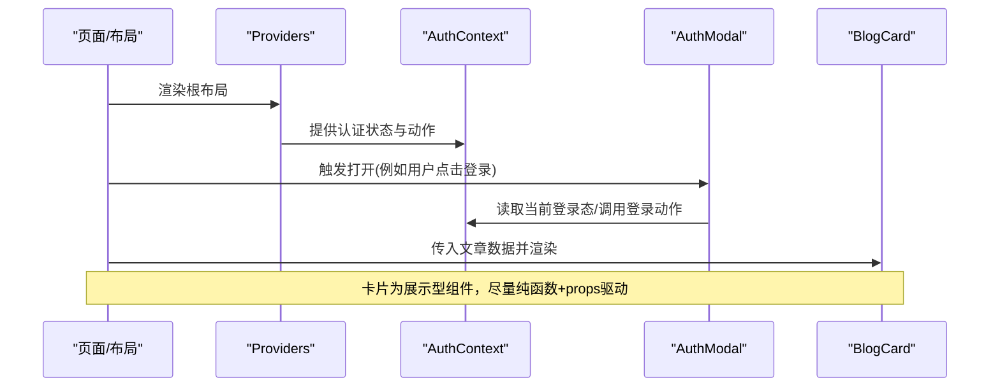
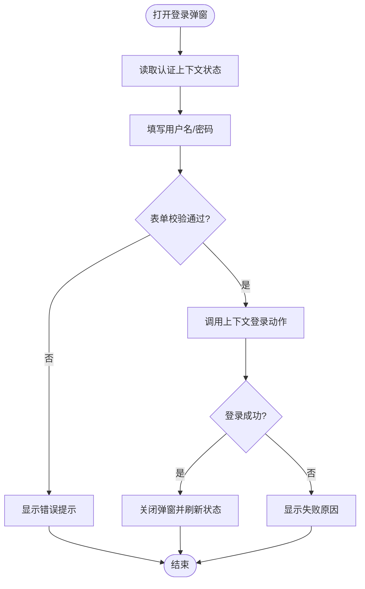
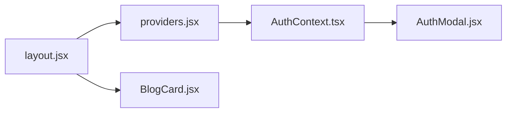

# 组件设计原则

<cite>
**本文引用的文件**   
- [BlogCard.jsx](file://src/components/BlogCard/BlogCard.jsx)
- [AuthModal.jsx](file://src/components/AuthModal/AuthModal.jsx)
- [AuthContext.tsx](file://src/context/AuthContext.tsx)
- [providers.jsx](file://src/app/providers.jsx)
- [layout.jsx](file://src/app/layout.jsx)
</cite>

## 目录
1. [简介](#简介)
2. [项目结构](#项目结构)
3. [核心组件](#核心组件)
4. [架构总览](#架构总览)
5. [详细组件分析](#详细组件分析)
6. [依赖分析](#依赖分析)
7. [性能考虑](#性能考虑)
8. [故障排查指南](#故障排查指南)
9. [结论](#结论)
10. [附录](#附录)

## 简介
本文件面向React/Next.js项目的组件设计与实现，聚焦以下目标：
- 单一职责与粒度划分：如何按职责拆分组件、避免“上帝组件”。
- 可复用性设计：props接口契约、默认值处理、受控与非受控模式。
- 可测试性：纯函数组件与状态管理分离、可预测的渲染路径。
- 性能优化：memo化、懒加载与代码分割策略。
- 实战示例：以BlogCard业务卡片与AuthModal登录模态框为例，展示优秀设计模式。

## 项目结构
本项目采用Next.js App Router组织页面与布局，通用UI与业务组件集中在src/components下，全局认证上下文位于src/context，应用级Provider在src/app中注入。

图表来源
- [layout.jsx](file://src/app/layout.jsx)
- [providers.jsx](file://src/app/providers.jsx)
- [AuthContext.tsx](file://src/context/AuthContext.tsx)
- [BlogCard.jsx](file://src/components/BlogCard/BlogCard.jsx)
- [AuthModal.jsx](file://src/components/AuthModal/AuthModal.jsx)

章节来源
- [layout.jsx](file://src/app/layout.jsx)
- [providers.jsx](file://src/app/providers.jsx)
- [AuthContext.tsx](file://src/context/AuthContext.tsx)
- [BlogCard.jsx](file://src/components/BlogCard/BlogCard.jsx)
- [AuthModal.jsx](file://src/components/AuthModal/AuthModal.jsx)

## 核心组件
- BlogCard：负责文章卡片的展示与交互（如点击跳转、点赞/收藏等），应仅关注数据呈现与轻量交互，不持有复杂业务状态。
- AuthModal：负责登录/注册弹窗的状态控制与表单交互，通常通过上下文或父组件提升状态，保持自身无副作用。

章节来源
- [BlogCard.jsx](file://src/components/BlogCard/BlogCard.jsx)
- [AuthModal.jsx](file://src/components/AuthModal/AuthModal.jsx)

## 架构总览
下图展示了认证上下文与模态框、布局的关系，以及BlogCard作为展示型组件的依赖边界。

图表来源
- [layout.jsx](file://src/app/layout.jsx)
- [providers.jsx](file://src/app/providers.jsx)
- [AuthContext.tsx](file://src/context/AuthContext.tsx)
- [AuthModal.jsx](file://src/components/AuthModal/AuthModal.jsx)
- [BlogCard.jsx](file://src/components/BlogCard/BlogCard.jsx)

## 详细组件分析

### 单一职责与粒度划分
- 展示型组件：只接收props并返回UI，不包含副作用与复杂状态。适合使用纯函数组件与React.memo。
- 容器型组件：负责获取数据、维护状态、编排副作用；将数据与方法通过props传递给展示型组件。
- 粒度建议：
  - 一个组件只做一件事：如BlogCard专注文章信息展示与基础交互；评论、标签、作者信息等可进一步拆分为子组件。
  - 避免跨层级透传过多props：可通过组合或上下文传递共享能力（如主题、语言、认证）。

章节来源
- [BlogCard.jsx](file://src/components/BlogCard/BlogCard.jsx)
- [AuthModal.jsx](file://src/components/AuthModal/AuthModal.jsx)

### 可复用性设计：Props接口与默认值
- 明确输入契约：对每个prop标注类型与用途，必要时提供JSDoc或TypeScript定义。
- 默认值与可选参数：为常见场景提供合理的默认值，减少调用方负担。
- 受控与非受控：对于表单类组件，支持受控（由父组件state驱动）与非受控（内部state）两种模式，提高复用度。
- 行为开关：通过布尔或枚举类型的prop控制显示/隐藏、尺寸、样式变体等。

章节来源
- [BlogCard.jsx](file://src/components/BlogCard/BlogCard.jsx)
- [AuthModal.jsx](file://src/components/AuthModal/AuthModal.jsx)

### 可测试性：纯函数与状态分离
- 纯函数优先：展示型组件应尽量成为纯函数，相同props产生相同输出，便于快照与单元断言。
- 状态外置：将状态提升到最近的容器组件或上下文，使UI组件可被独立测试。
- 模拟外部依赖：对API、路由、上下文等进行mock，确保测试稳定与快速。

章节来源
- [AuthContext.tsx](file://src/context/AuthContext.tsx)
- [AuthModal.jsx](file://src/components/AuthModal/AuthModal.jsx)

### 性能优化策略
- memo化：对展示型组件使用React.memo，配合稳定的props引用，避免不必要的重渲染。
- 懒加载与代码分割：对重型组件（如富文本编辑器、图表）使用动态导入与Suspense，按需加载。
- 列表渲染优化：为列表项提供稳定的key，避免频繁插入删除导致的重排。
- 事件与回调稳定：使用useCallback/useMemo缓存回调与计算结果，降低子组件更新频率。

章节来源
- [BlogCard.jsx](file://src/components/BlogCard/BlogCard.jsx)
- [AuthModal.jsx](file://src/components/AuthModal/AuthModal.jsx)

### 示例一：BlogCard业务组件封装策略
- 职责边界：仅负责文章标题、摘要、封面、元信息（作者、时间、标签）与基础交互（跳转、点赞/收藏）。
- Props设计要点：
  - 数据字段：标题、摘要、封面图、作者、发布时间、标签等。
  - 交互回调：点击跳转、点赞/收藏回调。
  - 展示开关：是否显示摘要、是否显示标签、尺寸变体等。
- 默认值：为可选字段提供合理默认值，保证最小可用形态。
- 可测试性：以不同props组合进行快照测试；对交互回调进行桩函数验证。
- 性能：对图片与长列表场景做懒加载与虚拟滚动；对回调与对象prop做稳定化处理。

章节来源
- [BlogCard.jsx](file://src/components/BlogCard/BlogCard.jsx)

### 示例二：AuthModal模态框的状态管理
- 职责边界：负责弹窗的打开/关闭、表单校验、提交流程与错误提示；不直接耦合具体认证逻辑。
- 状态来源：
  - 弹窗显隐：可由父组件或上下文统一控制。
  - 认证状态与动作：从AuthContext获取当前用户与登录/登出方法。
- 交互流程：
  - 打开弹窗 -> 填写表单 -> 校验 -> 调用上下文提供的登录动作 -> 成功关闭并反馈 -> 失败显示错误。
- 可测试性：
  - 对弹窗显隐进行快照测试。
  - 对表单校验与错误分支进行单元测试。
  - 对上下文方法进行mock，验证调用次数与参数。

图表来源
- [AuthModal.jsx](file://src/components/AuthModal/AuthModal.jsx)
- [AuthContext.tsx](file://src/context/AuthContext.tsx)

章节来源
- [AuthModal.jsx](file://src/components/AuthModal/AuthModal.jsx)
- [AuthContext.tsx](file://src/context/AuthContext.tsx)

## 依赖分析
- 组件间依赖关系：
  - layout与providers负责注入全局上下文。
  - AuthModal依赖认证上下文完成登录态读取与动作调用。
  - BlogCard为展示型组件，依赖父组件传入的数据与回调，不直接访问上下文。
- 可能的循环依赖风险：应避免在组件内直接引入页面或路由逻辑，防止形成环。
- 外部依赖：网络请求、路由跳转、第三方库应在容器层或工具层集中管理。

图表来源
- [layout.jsx](file://src/app/layout.jsx)
- [providers.jsx](file://src/app/providers.jsx)
- [AuthContext.tsx](file://src/context/AuthContext.tsx)
- [AuthModal.jsx](file://src/components/AuthModal/AuthModal.jsx)
- [BlogCard.jsx](file://src/components/BlogCard/BlogCard.jsx)

章节来源
- [layout.jsx](file://src/app/layout.jsx)
- [providers.jsx](file://src/app/providers.jsx)
- [AuthContext.tsx](file://src/context/AuthContext.tsx)
- [AuthModal.jsx](file://src/components/AuthModal/AuthModal.jsx)
- [BlogCard.jsx](file://src/components/BlogCard/BlogCard.jsx)

## 性能考虑
- 渲染路径优化：
  - 将高频更新的局部状态下沉到最小范围，避免整树重渲染。
  - 使用React.memo包裹展示型组件，结合稳定props减少更新。
- 资源加载：
  - 对大图、富媒体与重型组件使用动态导入与懒加载。
  - 列表分页与虚拟滚动结合，控制首屏体积。
- 计算与缓存：
  - 使用useMemo缓存昂贵计算结果，useCallback稳定回调引用。
- 网络与并发：
  - 合并请求、去抖/节流搜索与滚动事件，避免频繁触发。

[本节为通用指导，无需源码引用]

## 故障排查指南
- 常见问题定位：
  - 弹窗无法关闭：检查显隐状态是否被父组件或上下文正确更新。
  - 登录失败无提示：确认错误分支是否正确读取上下文错误信息并展示。
  - 卡片重复渲染：检查key是否稳定、回调是否每次创建新引用。
- 调试建议：
  - 在关键分支打印状态变化或使用浏览器开发者工具的组件面板。
  - 对上下文方法添加日志，观察调用时机与参数。

章节来源
- [AuthModal.jsx](file://src/components/AuthModal/AuthModal.jsx)
- [AuthContext.tsx](file://src/context/AuthContext.tsx)

## 结论
- 坚持单一职责与清晰边界，能显著提升可维护性与可测试性。
- 通过稳定的props契约与默认值，增强组件的可复用性。
- 将状态与副作用外置，结合memo化与懒加载，获得更优的性能表现。
- 以BlogCard与AuthModal为例，展示展示型与容器型组件的最佳实践。

[本节为总结性内容，无需源码引用]

## 附录
- 术语说明：
  - 展示型组件：仅根据props渲染UI，不含副作用。
  - 容器型组件：负责数据获取、状态管理与副作用编排。
  - 受控组件：由父组件state驱动的表单组件。
  - 非受控组件：内部维护自身state的表单组件。
- 参考文件路径：
  - 展示型组件示例：[BlogCard.jsx](file://src/components/BlogCard/BlogCard.jsx)
  - 容器型组件示例：[AuthModal.jsx](file://src/components/AuthModal/AuthModal.jsx)
  - 全局上下文：[AuthContext.tsx](file://src/context/AuthContext.tsx)
  - 应用提供者：[providers.jsx](file://src/app/providers.jsx)
  - 根布局：[layout.jsx](file://src/app/layout.jsx)