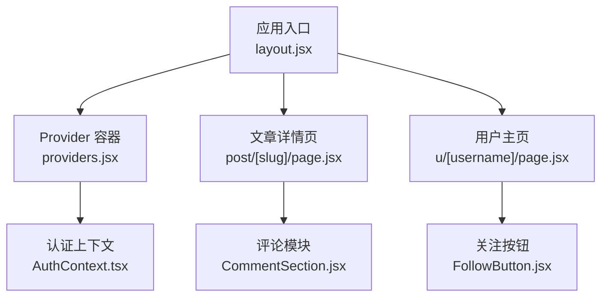
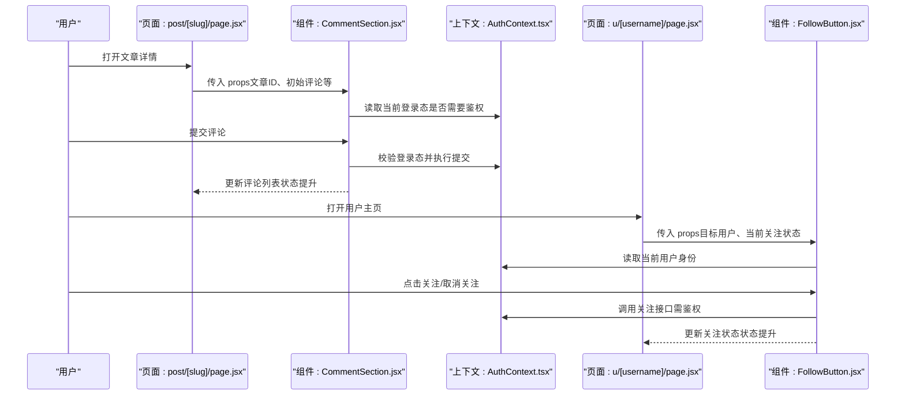
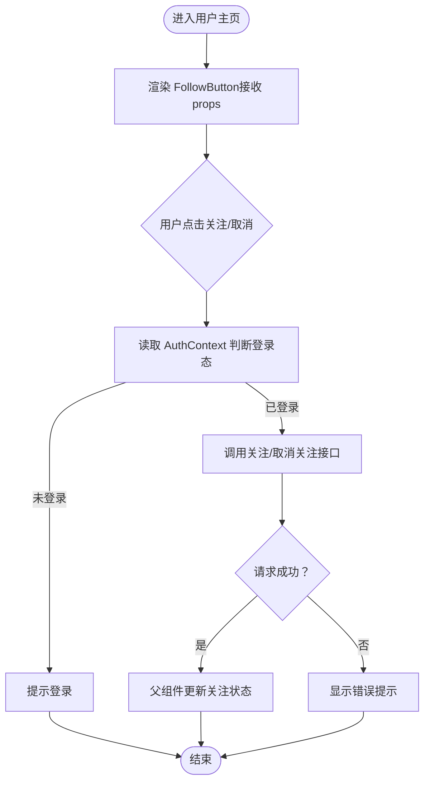
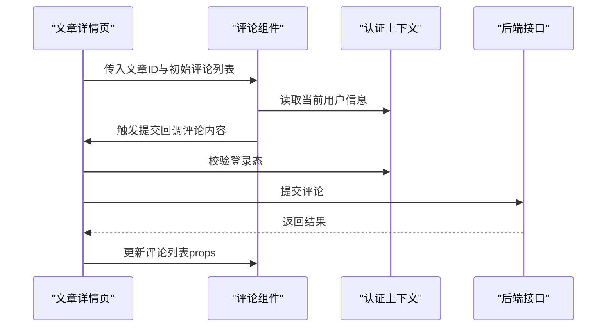
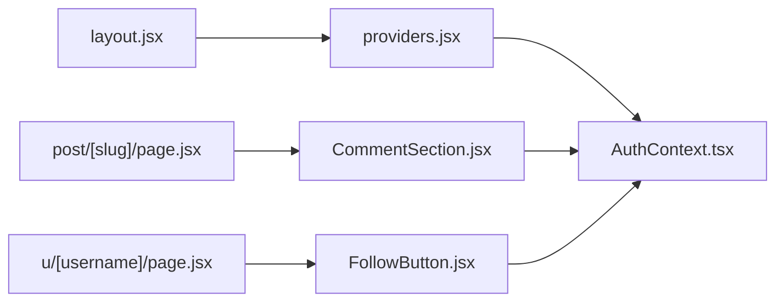

# 组件通信模式

<cite>
**本文引用的文件**
- [src/context/AuthContext.tsx](file://src/context/AuthContext.tsx)
- [src/components/FollowButton/followbutton.jsx](file://src/components/FollowButton/followbutton.jsx)
- [src/components/CommentSection/CommentSection.jsx](file://src/components/CommentSection/CommentSection.jsx)
- [src/app/providers.jsx](file://src/app/providers.jsx)
- [src/app/layout.jsx](file://src/app/layout.jsx)
- [src/app/post/[slug]/page.jsx](file://src/app/post/[slug]/page.jsx)
- [src/app/u/[username]/page.jsx](file://src/app/u/[username]/page.jsx)
</cite>

## 目录
1. [简介](#简介)
2. [项目结构](#项目结构)
3. [核心组件](#核心组件)
4. [架构总览](#架构总览)
5. [详细组件分析](#详细组件分析)
6. [依赖关系分析](#依赖关系分析)
7. [性能考量](#性能考量)
8. [故障排查指南](#故障排查指南)
9. [结论](#结论)
10. [附录](#附录)

## 简介
本文件聚焦于 React 应用中的组件通信模式，结合仓库中实际代码，系统阐述：
- 父子组件通信：props 传递、事件回调与状态提升
- 兄弟组件通信：通过父组件共享状态与自定义事件机制
- 跨层级通信：Context API 的使用场景与实现方式
- 全局状态管理：AuthContext 的实现模式与最佳实践
- 具体示例：FollowButton 的用户交互处理与 CommentSection 的评论数据流

## 项目结构
本项目采用 Next.js App Router 组织页面与布局，组件按功能域拆分在 src/components 下，全局上下文位于 src/context，应用级 Provider 挂载于 src/app/providers.jsx，并在根布局 src/app/layout.jsx 中注入。

图表来源
- [src/app/layout.jsx](file://src/app/layout.jsx)
- [src/app/providers.jsx](file://src/app/providers.jsx)
- [src/context/AuthContext.tsx](file://src/context/AuthContext.tsx)
- [src/app/post/[slug]/page.jsx](file://src/app/post/[slug]/page.jsx)
- [src/app/u/[username]/page.jsx](file://src/app/u/[username]/page.jsx)
- [src/components/CommentSection/CommentSection.jsx](file://src/components/CommentSection/CommentSection.jsx)
- [src/components/FollowButton/followbutton.jsx](file://src/components/FollowButton/followbutton.jsx)

章节来源
- [src/app/layout.jsx](file://src/app/layout.jsx)
- [src/app/providers.jsx](file://src/app/providers.jsx)
- [src/context/AuthContext.tsx](file://src/context/AuthContext.tsx)

## 核心组件
- AuthContext：提供登录态、用户信息以及登录/登出等动作，供任意层级组件消费。
- FollowButton：展示“关注/已关注”状态，触发关注/取消关注操作，通常与用户页或作者卡片组合使用。
- CommentSection：承载评论列表、提交表单与交互逻辑，负责评论数据的增删改查与渲染。

章节来源
- [src/context/AuthContext.tsx](file://src/context/AuthContext.tsx)
- [src/components/FollowButton/followbutton.jsx](file://src/components/FollowButton/followbutton.jsx)
- [src/components/CommentSection/CommentSection.jsx](file://src/components/CommentSection/CommentSection.jsx)

## 架构总览
下图展示了从页面到组件再到上下文的调用路径，体现不同通信模式的协作关系。

图表来源
- [src/app/post/[slug]/page.jsx](file://src/app/post/[slug]/page.jsx)
- [src/components/CommentSection/CommentSection.jsx](file://src/components/CommentSection/CommentSection.jsx)
- [src/context/AuthContext.tsx](file://src/context/AuthContext.tsx)
- [src/app/u/[username]/page.jsx](file://src/app/u/[username]/page.jsx)
- [src/components/FollowButton/followbutton.jsx](file://src/components/FollowButton/followbutton.jsx)

## 详细组件分析

### 父子组件通信：Props 传递、事件回调与状态提升
- Props 传递
  - 父组件将必要的数据（如文章 ID、初始评论列表、目标用户信息等）以 props 形式传递给子组件。
  - 子组件保持无状态或局部状态，仅负责渲染与触发事件。
- 事件回调
  - 父组件向子组件传入回调函数（如 onSubmit、onToggle），子组件在用户交互时调用，将变更通知回父组件。
- 状态提升
  - 当多个子组件需要共享同一份状态时，将该状态提升到最近的共同父组件中，由父组件统一维护并通过 props 下发。

适用场景
- 文章详情页中，父页面将文章元数据与评论列表传给 CommentSection，评论提交后由父页面更新列表。
- 用户主页中，父页面将目标用户信息与当前关注状态传给 FollowButton，关注结果由父页面更新。

章节来源
- [src/app/post/[slug]/page.jsx](file://src/app/post/[slug]/page.jsx)
- [src/components/CommentSection/CommentSection.jsx](file://src/components/CommentSection/CommentSection.jsx)
- [src/app/u/[username]/page.jsx](file://src/app/u/[username]/page.jsx)
- [src/components/FollowButton/followbutton.jsx](file://src/components/FollowButton/followbutton.jsx)

### 兄弟组件通信：通过父组件共享状态与自定义事件
- 通过父组件共享状态
  - 兄弟组件不直接通信，而是各自与父组件进行 props/cb 双向绑定，由父组件作为“总线”协调数据。
- 自定义事件机制
  - 在 React 中更推荐用回调替代 DOM 级别的自定义事件；若确需解耦，可在父组件内封装一个轻量事件中心，但应谨慎使用以避免隐式耦合。

适用场景
- 同一页面内的搜索框与结果列表：搜索框通过回调通知父组件，父组件更新查询条件并传给结果列表。
- 侧边栏与主内容区：侧边栏切换分类，主内容区根据分类刷新数据。

章节来源
- [src/app/post/[slug]/page.jsx](file://src/app/post/[slug]/page.jsx)
- [src/app/u/[username]/page.jsx](file://src/app/u/[username]/page.jsx)

### 跨层级通信：Context API 的使用场景与实现方式
- 使用场景
  - 主题、语言、用户认证信息等需要在多层级组件间共享且频繁读取的数据。
- 实现方式
  - 在顶层 Provider 中创建 Context 并提供值（如用户信息、登录态、操作方法）。
  - 任意层级的子组件通过 useContext 订阅变化，避免逐层透传 props。
- 注意事项
  - 合理拆分 Context，避免单一巨型 Context 导致不必要的重渲染。
  - 对频繁更新的值可考虑拆分或使用选择器模式减少影响范围。

章节来源
- [src/app/providers.jsx](file://src/app/providers.jsx)
- [src/context/AuthContext.tsx](file://src/context/AuthContext.tsx)
- [src/app/layout.jsx](file://src/app/layout.jsx)

### 全局状态管理：AuthContext 的实现模式与最佳实践
- 职责边界
  - 集中管理用户认证相关的全局状态（是否登录、用户基本信息、登录/登出方法等）。
- 典型流程
  - 页面或组件在需要时读取当前用户信息，判断是否允许执行敏感操作（如发表评论、关注用户）。
  - 执行操作前检查登录态，未登录则引导用户登录；已登录则调用后端接口并更新本地状态。
- 最佳实践
  - 将只读数据与写操作分离，避免在同一个对象中混入过多可变状态。
  - 在 Provider 中缓存必要的副作用（如 token 持久化、自动刷新），对外暴露稳定的 API。
  - 为关键操作增加错误处理与用户提示，保证用户体验一致。

章节来源
- [src/context/AuthContext.tsx](file://src/context/AuthContext.tsx)
- [src/app/providers.jsx](file://src/app/providers.jsx)
- [src/app/layout.jsx](file://src/app/layout.jsx)

### 示例一：FollowButton 的用户交互处理
- 交互流程
  - 父页面将目标用户与当前关注状态以 props 传入。
  - 组件内部监听点击事件，先通过 AuthContext 判断当前用户身份。
  - 若已登录，调用关注/取消关注接口；成功后将新状态返回给父组件，由父组件更新 UI。
- 关键点
  - 关注状态属于“受控”数据，应由父组件持有，子组件仅触发变更。
  - 网络请求失败时应给出明确反馈，并保持 UI 与服务器一致。

图表来源
- [src/app/u/[username]/page.jsx](file://src/app/u/[username]/page.jsx)
- [src/components/FollowButton/followbutton.jsx](file://src/components/FollowButton/followbutton.jsx)
- [src/context/AuthContext.tsx](file://src/context/AuthContext.tsx)

章节来源
- [src/app/u/[username]/page.jsx](file://src/app/u/[username]/page.jsx)
- [src/components/FollowButton/followbutton.jsx](file://src/components/FollowButton/followbutton.jsx)
- [src/context/AuthContext.tsx](file://src/context/AuthContext.tsx)

### 示例二：CommentSection 的评论数据流
- 数据流
  - 父页面加载文章详情时获取评论列表，并以 props 形式传入 CommentSection。
  - 用户在评论框输入并提交，CommentSection 通过回调通知父组件。
  - 父组件调用后端接口新增评论，成功后更新评论列表并重新渲染。
- 鉴权与错误处理
  - 提交前检查 AuthContext 的登录态；未登录则跳转登录。
  - 网络异常时保留用户输入并提示重试。

图表来源
- [src/app/post/[slug]/page.jsx](file://src/app/post/[slug]/page.jsx)
- [src/components/CommentSection/CommentSection.jsx](file://src/components/CommentSection/CommentSection.jsx)
- [src/context/AuthContext.tsx](file://src/context/AuthContext.tsx)

章节来源
- [src/app/post/[slug]/page.jsx](file://src/app/post/[slug]/page.jsx)
- [src/components/CommentSection/CommentSection.jsx](file://src/components/CommentSection/CommentSection.jsx)
- [src/context/AuthContext.tsx](file://src/context/AuthContext.tsx)

## 依赖关系分析
- 页面与组件
  - 文章详情页依赖 CommentSection 渲染评论区域。
  - 用户主页依赖 FollowButton 展示关注能力。
- 组件与上下文
  - FollowButton 与 CommentSection 均可能依赖 AuthContext 进行鉴权与用户信息读取。
- Provider 注入
  - providers.jsx 将 AuthContext 注入到应用树，确保所有子组件均可访问。

图表来源
- [src/app/layout.jsx](file://src/app/layout.jsx)
- [src/app/providers.jsx](file://src/app/providers.jsx)
- [src/context/AuthContext.tsx](file://src/context/AuthContext.tsx)
- [src/app/post/[slug]/page.jsx](file://src/app/post/[slug]/page.jsx)
- [src/components/CommentSection/CommentSection.jsx](file://src/components/CommentSection/CommentSection.jsx)
- [src/app/u/[username]/page.jsx](file://src/app/u/[username]/page.jsx)
- [src/components/FollowButton/followbutton.jsx](file://src/components/FollowButton/followbutton.jsx)

章节来源
- [src/app/layout.jsx](file://src/app/layout.jsx)
- [src/app/providers.jsx](file://src/app/providers.jsx)
- [src/context/AuthContext.tsx](file://src/context/AuthContext.tsx)
- [src/app/post/[slug]/page.jsx](file://src/app/post/[slug]/page.jsx)
- [src/components/CommentSection/CommentSection.jsx](file://src/components/CommentSection/CommentSection.jsx)
- [src/app/u/[username]/page.jsx](file://src/app/u/[username]/page.jsx)
- [src/components/FollowButton/followbutton.jsx](file://src/components/FollowButton/followbutton.jsx)

## 性能考量
- 控制重渲染范围
  - 将频繁变化的状态拆分为独立 Context 或状态钩子，避免大范围无效更新。
- 避免深层嵌套
  - 尽量在较浅层级订阅 Context，减少因中间层无关更新导致的连锁渲染。
- 优化网络请求
  - 对评论与关注等高频操作加入防抖/节流与乐观更新策略，提升交互流畅度。
- 组件粒度
  - 将大组件拆分为小颗粒子组件，配合 React.memo 等手段减少不必要渲染。

[本节为通用指导，无需源码引用]

## 故障排查指南
- 常见问题
  - 未正确包裹 Provider：导致上下文值为 undefined，组件无法读取用户信息。
  - 状态不同步：子组件未遵循受控模式，导致 UI 与真实状态不一致。
  - 鉴权缺失：未检查登录态即发起敏感操作，导致接口报错或行为异常。
- 定位步骤
  - 确认 providers.jsx 已在 layout.jsx 中正确注入。
  - 在组件中打印或断点调试上下文值，确认是否为预期类型与结构。
  - 检查回调是否正确冒泡至父组件，父组件是否及时更新状态。
- 修复建议
  - 为关键操作添加 try/catch 与用户提示，记录错误日志以便复现。
  - 使用严格模式与开发工具辅助定位重复渲染与副作用问题。

章节来源
- [src/app/providers.jsx](file://src/app/providers.jsx)
- [src/app/layout.jsx](file://src/app/layout.jsx)
- [src/context/AuthContext.tsx](file://src/context/AuthContext.tsx)

## 结论
通过合理的通信模式设计，可以在保证可维护性的同时提升用户体验：
- 父子通信以 props/cb 为主，状态提升解决共享需求
- 兄弟通信通过父组件协调，必要时引入轻量事件中心
- 跨层级通信借助 Context 降低透传成本
- 全局状态集中在 AuthContext，统一鉴权与用户信息管理
- 以 FollowButton 与 CommentSection 为例，展示受控组件与数据流的落地方式

[本节为总结性内容，无需源码引用]

## 附录
- 术语说明
  - 受控组件：由父组件通过 props 控制其值的组件
  - 状态提升：将状态上移至最近共同父组件进行统一管理
  - Context：React 提供的跨层级共享数据机制

[本节为概念性内容，无需源码引用]