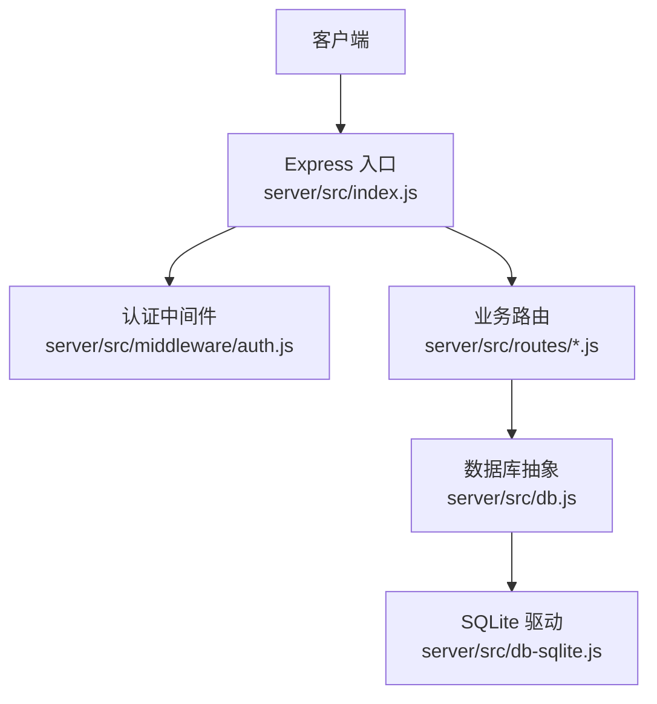
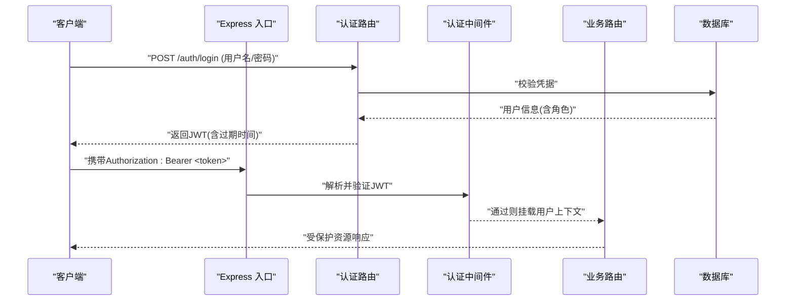
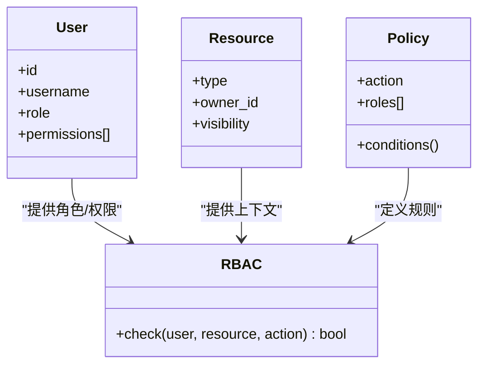

# API安全与认证

<cite>
**本文引用的文件**   
- [server/src/index.js](file://server/src/index.js)
- [server/src/middleware/auth.js](file://server/src/middleware/auth.js)
- [server/src/routes/auth.js](file://server/src/routes/auth.js)
- [server/src/routes/users.js](file://server/src/routes/users.js)
- [server/src/db.js](file://server/src/db.js)
- [server/src/db-sqlite.js](file://server/src/db-sqlite.js)
- [server/package.json](file://server/package.json)
- [API.md](file://API.md)
</cite>

## 目录
1. [简介](#简介)
2. [项目结构](#项目结构)
3. [核心组件](#核心组件)
4. [架构总览](#架构总览)
5. [详细组件分析](#详细组件分析)
6. [依赖关系分析](#依赖关系分析)
7. [性能与安全考量](#性能与安全考量)
8. [故障排查指南](#故障排查指南)
9. [结论](#结论)
10. [附录](#附录)

## 简介
本文件面向后端服务的安全与认证，聚焦以下目标：
- JWT令牌认证流程：生成、验证、刷新与撤销
- 权限控制模型：基于角色的访问控制（RBAC）、资源权限检查与操作授权
- 输入验证与输出过滤：SQL注入防护、XSS防护、敏感信息脱敏
- HTTPS配置与安全头部：CORS策略、CSRF保护、安全传输
- 限流与防刷：请求频率限制、IP白名单、异常行为检测
- 安全配置示例与常见威胁防护措施

说明：本项目为博客问答类应用的后端实现，采用Node.js + Express。当前仓库中已包含认证中间件与路由骨架，但尚未完整实现JWT签发/校验、RBAC、限流等能力。下文在“现状”和“建议”两个层面进行阐述，并给出可直接落地的架构图与流程图。

## 项目结构
后端位于 server 目录，关键路径如下：
- 入口与中间件注册：server/src/index.js
- 认证中间件：server/src/middleware/auth.js
- 认证相关路由：server/src/routes/auth.js
- 用户管理路由：server/src/routes/users.js
- 数据库抽象与SQLite实现：server/src/db.js、server/src/db-sqlite.js
- 依赖声明：server/package.json
- 接口文档：API.md



图表来源
- [server/src/index.js](file://server/src/index.js)
- [server/src/middleware/auth.js](file://server/src/middleware/auth.js)
- [server/src/routes/auth.js](file://server/src/routes/auth.js)
- [server/src/db.js](file://server/src/db.js)
- [server/src/db-sqlite.js](file://server/src/db-sqlite.js)

章节来源
- [server/src/index.js](file://server/src/index.js)
- [server/src/middleware/auth.js](file://server/src/middleware/auth.js)
- [server/src/routes/auth.js](file://server/src/routes/auth.js)
- [server/src/routes/users.js](file://server/src/routes/users.js)
- [server/src/db.js](file://server/src/db.js)
- [server/src/db-sqlite.js](file://server/src/db-sqlite.js)
- [server/package.json](file://server/package.json)
- [API.md](file://API.md)

## 核心组件
- 认证中间件：负责从请求中提取令牌并进行校验，将用户上下文挂载到请求对象，供后续路由使用。
- 认证路由：提供登录、注册、获取当前用户信息等接口，用于颁发或读取会话状态。
- 用户路由：提供用户资料查询与更新等接口，通常需鉴权。
- 数据库层：统一数据访问接口，SQLite作为具体实现。

章节来源
- [server/src/middleware/auth.js](file://server/src/middleware/auth.js)
- [server/src/routes/auth.js](file://server/src/routes/auth.js)
- [server/src/routes/users.js](file://server/src/routes/users.js)
- [server/src/db.js](file://server/src/db.js)
- [server/src/db-sqlite.js](file://server/src/db-sqlite.js)

## 架构总览
下图展示认证与鉴权的端到端流程，包括JWT的签发、携带、校验以及RBAC授权的关键节点。



图表来源
- [server/src/routes/auth.js](file://server/src/routes/auth.js)
- [server/src/middleware/auth.js](file://server/src/middleware/auth.js)
- [server/src/index.js](file://server/src/index.js)
- [server/src/db.js](file://server/src/db.js)

## 详细组件分析

### JWT令牌认证流程
- 令牌生成
  - 登录成功后，服务端根据用户标识与角色等信息签发JWT，设置合理的过期时间，并通过响应头返回给客户端。
  - 建议同时支持短期访问令牌与长期刷新令牌的组合，以提升安全性与用户体验。
- 令牌验证
  - 认证中间件从请求头提取Bearer令牌，校验签名、有效期与黑名单状态，通过后向请求上下文注入用户信息。
- 令牌刷新
  - 提供专用刷新接口，校验刷新令牌后签发新的访问令牌；刷新令牌可设置更长有效期并支持一次性使用或滑动窗口续期。
- 令牌撤销
  - 维护一个令牌黑名单（内存或持久化存储），对需要立即失效的令牌加入黑名单；验证时拒绝黑名单中的令牌。

```mermaid
flowchart TD
Start(["开始"]) --> Login["登录成功"]
Login --> Issue["签发访问令牌(短效)<br/>可选签发刷新令牌(长效)"]
Issue --> Store["记录令牌元数据(可选)<br/>如JTI、过期时间、角色]
Store --> NextReq["后续请求携带令牌"]
NextReq --> Verify["中间件校验签名/过期/黑名单"]
Verify --> |通过| Allow["放行并注入用户上下文"]
Verify --> |失败| Deny["返回未认证/未授权错误"]
Allow --> Refresh{"是否即将过期?"}
Refresh --> |是| Reissue["刷新接口换发新令牌"]
Reissue --> NextReq
Refresh --> |否| End(["结束"])
Deny --> End
```

图表来源
- [server/src/middleware/auth.js](file://server/src/middleware/auth.js)
- [server/src/routes/auth.js](file://server/src/routes/auth.js)

章节来源
- [server/src/middleware/auth.js](file://server/src/middleware/auth.js)
- [server/src/routes/auth.js](file://server/src/routes/auth.js)

### 权限控制模型（RBAC）
- 角色定义
  - 典型角色：访客、注册用户、作者、管理员。角色应存储在用户上下文中，便于后续授权判断。
- 资源与操作
  - 资源：文章、评论、专栏、用户资料等；操作：读、写、删除、审核等。
- 授权策略
  - 在路由或控制器层进行细粒度授权：例如仅作者可编辑自己的文章，管理员可执行全局操作。
- 实现要点
  - 在认证中间件之后增加授权中间件，依据用户角色与资源属性进行决策。
  - 对于批量或复杂场景，可引入策略引擎或规则表，集中管理权限矩阵。



图表来源
- [server/src/middleware/auth.js](file://server/src/middleware/auth.js)
- [server/src/routes/users.js](file://server/src/routes/users.js)

章节来源
- [server/src/middleware/auth.js](file://server/src/middleware/auth.js)
- [server/src/routes/users.js](file://server/src/routes/users.js)

### 输入验证与输出过滤
- SQL注入防护
  - 使用参数化查询或ORM，避免拼接SQL字符串；对动态字段名与排序参数做白名单校验。
- XSS防护
  - 对用户输入进行转义后再渲染；服务端输出JSON时确保正确的Content-Type；富文本内容需经过严格的白名单过滤。
- 敏感信息脱敏
  - 对外暴露的用户对象中剔除密码、密钥等敏感字段；日志中避免打印敏感信息。
- 通用校验
  - 对请求体进行类型、长度、格式校验；对枚举值进行白名单匹配；对分页与排序参数进行边界检查。

章节来源
- [server/src/db.js](file://server/src/db.js)
- [server/src/db-sqlite.js](file://server/src/db-sqlite.js)

### HTTPS配置与安全头部
- HTTPS
  - 在生产环境启用HTTPS，强制重定向HTTP到HTTPS；合理配置TLS版本与加密套件。
- 安全响应头
  - 设置HSTS、X-Content-Type-Options、X-Frame-Options、Referrer-Policy、Permissions-Policy等。
- CORS策略
  - 明确允许的源、方法、头部与凭证；生产环境严格限定域名。
- CSRF保护
  - 若使用Cookie会话，需启用CSRF令牌校验；纯JWT无状态方案下，避免使用Cookie承载敏感状态。

章节来源
- [server/src/index.js](file://server/src/index.js)

### 限流与防刷机制
- 请求频率限制
  - 针对登录、注册、重置密码等高风险接口实施更严格的速率限制；按用户ID或IP维度计数。
- IP白名单
  - 对管理后台或内部接口启用IP白名单；结合网络层ACL增强防护。
- 异常行为检测
  - 监控高频失败、异常UA、异常地域访问等指标，触发临时封禁或验证码挑战。
- 实现建议
  - 使用Redis或内存计数器作为限流存储；对分布式部署采用中心化存储。

章节来源
- [server/src/index.js](file://server/src/index.js)
- [server/src/routes/auth.js](file://server/src/routes/auth.js)

## 依赖关系分析
- 认证与鉴权
  - 认证中间件依赖JWT库进行签名与校验；鉴权逻辑依赖用户上下文中的角色与权限。
- 数据访问
  - 数据库抽象层屏蔽底层差异，SQLite作为默认实现；所有查询应使用参数化以避免注入。
- 外部依赖
  - 查看server/package.json确认是否已引入JWT、限流、CORS等依赖；若缺失，需按需添加。


图表来源
- [server/src/index.js](file://server/src/index.js)
- [server/src/middleware/auth.js](file://server/src/middleware/auth.js)
- [server/src/db.js](file://server/src/db.js)
- [server/src/db-sqlite.js](file://server/src/db-sqlite.js)

章节来源
- [server/package.json](file://server/package.json)
- [server/src/index.js](file://server/src/index.js)
- [server/src/db.js](file://server/src/db.js)
- [server/src/db-sqlite.js](file://server/src/db-sqlite.js)

## 性能与安全考量
- 令牌大小与载荷
  - JWT载荷尽量精简，避免存放大量敏感或易变数据；必要时将只读信息放入服务端缓存。
- 并发与限流
  - 在高并发场景下，限流存储建议使用高性能KV（如Redis）；注意原子性与过期清理。
- 数据库安全
  - 连接池最小化、超时与重试策略；慢查询监控与索引优化；定期备份与恢复演练。
- 日志与审计
  - 记录关键安全事件（登录失败、权限拒绝、令牌撤销），但避免记录敏感字段；日志分级与轮转。

[本节为通用指导，不直接分析具体文件]

## 故障排查指南
- 认证失败
  - 检查令牌是否存在、格式是否正确、签名是否有效、是否过期或被拉黑。
- 权限不足
  - 核对用户角色与资源操作策略；确认授权中间件是否被正确挂载。
- 跨域问题
  - 检查CORS配置是否允许当前Origin与方法；浏览器控制台查看预检请求结果。
- 限流触发
  - 观察限流统计与阈值；确认是否误判正常流量；调整策略或扩容。
- 数据库错误
  - 检查参数化查询是否正确；查看错误堆栈与慢查询日志；确认连接池配置。

章节来源
- [server/src/middleware/auth.js](file://server/src/middleware/auth.js)
- [server/src/routes/auth.js](file://server/src/routes/auth.js)
- [server/src/db.js](file://server/src/db.js)

## 结论
本项目已具备认证中间件与基础路由结构，下一步建议优先补齐JWT签发与校验、RBAC授权、输入输出安全加固、HTTPS与安全头部、限流与防刷等能力。通过分层防御与最小权限原则，可有效降低安全风险并提升系统韧性。

[本节为总结性内容，不直接分析具体文件]

## 附录

### 安全配置清单（示例）
- 环境变量
  - JWT_SECRET：强随机密钥
  - JWT_ACCESS_EXPIRES：访问令牌过期时间
  - JWT_REFRESH_EXPIRES：刷新令牌过期时间
  - CORS_ALLOWED_ORIGINS：允许的源列表
  - RATE_LIMIT_WINDOW_MS、RATE_LIMIT_MAX：限流窗口与最大请求数
  - ADMIN_IP_WHITELIST：管理接口IP白名单
- 安全响应头
  - Strict-Transport-Security、X-Content-Type-Options、X-Frame-Options、Referrer-Policy、Permissions-Policy
- CORS策略
  - 仅允许必要域名、方法与头部；生产环境禁用通配符与凭证滥用

章节来源
- [server/package.json](file://server/package.json)
- [server/src/index.js](file://server/src/index.js)

### 常见威胁与防护对照
- SQL注入：参数化查询、ORM、输入白名单
- XSS：输出转义、严格CSP、富文本白名单过滤
- 越权访问：RBAC、资源归属校验、最小权限
- 暴力破解：账号锁定、验证码、速率限制
- 令牌泄露：HTTPS、HttpOnly Cookie（如需）、短时效+刷新令牌、令牌撤销
- 跨站伪造：CSRF令牌、SameSite Cookie、同源策略

[本节为通用指导，不直接分析具体文件]