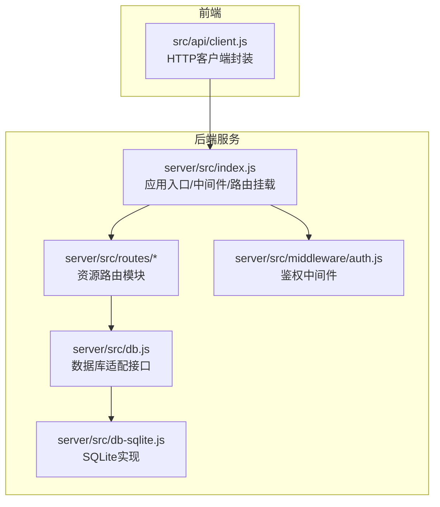
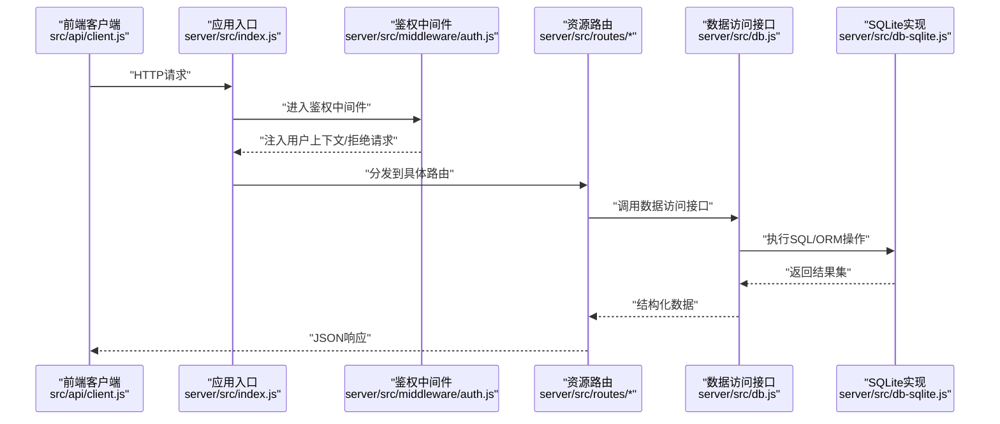
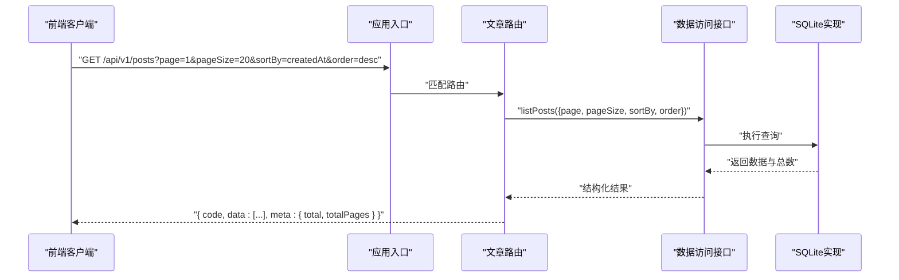
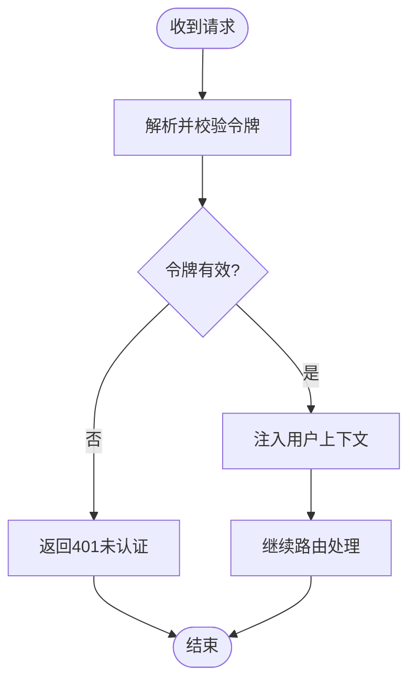
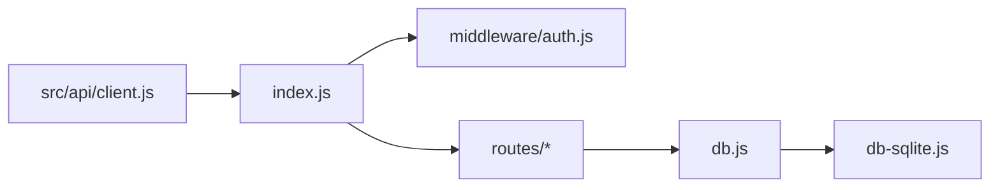

# API设计规范与实现

<cite>
**本文引用的文件**   
- [server/src/index.js](file://server/src/index.js)
- [server/src/middleware/auth.js](file://server/src/middleware/auth.js)
- [server/src/routes/posts.js](file://server/src/routes/posts.js)
- [server/src/routes/questions.js](file://server/src/routes/questions.js)
- [server/src/routes/answers.js](file://server/src/routes/answers.js)
- [server/src/routes/users.js](file://server/src/routes/users.js)
- [server/src/routes/columns.js](file://server/src/routes/columns.js)
- [server/src/routes/ranking.js](file://server/src/routes/ranking.js)
- [server/src/routes/search.js](file://server/src/routes/search.js)
- [server/src/db.js](file://server/src/db.js)
- [server/src/db-sqlite.js](file://server/src/db-sqlite.js)
- [src/api/client.js](file://src/api/client.js)
- [API.md](file://API.md)
- [docs/05api接口文档.md](file://docs/05api接口文档.md)
</cite>

## 目录
1. [简介](#简介)
2. [项目结构](#项目结构)
3. [核心组件](#核心组件)
4. [架构总览](#架构总览)
5. [详细组件分析](#详细组件分析)
6. [依赖关系分析](#依赖关系分析)
7. [性能考虑](#性能考虑)
8. [故障排查指南](#故障排查指南)
9. [结论](#结论)
10. [附录](#附录)

## 简介
本文件面向后端与前端开发者，系统化阐述本项目RESTful API的设计原则、路由组织、请求响应格式、错误处理、版本控制策略、文档生成与安全最佳实践。内容基于现有服务端代码结构与前端API客户端调用方式总结提炼，旨在为后续迭代提供统一规范与可操作建议。

## 项目结构
后端采用Express风格的路由分层：入口挂载中间件与全局配置，按资源划分路由模块，数据访问层通过数据库适配器抽象；前端通过统一的HTTP客户端封装发起请求。

图示来源
- [server/src/index.js](file://server/src/index.js)
- [server/src/middleware/auth.js](file://server/src/middleware/auth.js)
- [server/src/routes/posts.js](file://server/src/routes/posts.js)
- [server/src/routes/questions.js](file://server/src/routes/questions.js)
- [server/src/routes/answers.js](file://server/src/routes/answers.js)
- [server/src/routes/users.js](file://server/src/routes/users.js)
- [server/src/routes/columns.js](file://server/src/routes/columns.js)
- [server/src/routes/ranking.js](file://server/src/routes/ranking.js)
- [server/src/routes/search.js](file://server/src/routes/search.js)
- [server/src/db.js](file://server/src/db.js)
- [server/src/db-sqlite.js](file://server/src/db-sqlite.js)
- [src/api/client.js](file://src/api/client.js)

章节来源
- [server/src/index.js](file://server/src/index.js)
- [server/src/db.js](file://server/src/db.js)
- [server/src/db-sqlite.js](file://server/src/db-sqlite.js)
- [src/api/client.js](file://src/api/client.js)

## 核心组件
- 应用入口与中间件
  - 负责加载全局中间件（如认证）、挂载各资源路由、启动服务。
  - 参考路径：[server/src/index.js](file://server/src/index.js)
- 鉴权中间件
  - 校验请求令牌/会话，注入用户上下文供下游路由使用。
  - 参考路径：[server/src/middleware/auth.js](file://server/src/middleware/auth.js)
- 资源路由模块
  - posts、questions、answers、users、columns、ranking、search等，分别对应文章、问答、回答、用户、专栏、排行榜、搜索等资源。
  - 参考路径：
    - [server/src/routes/posts.js](file://server/src/routes/posts.js)
    - [server/src/routes/questions.js](file://server/src/routes/questions.js)
    - [server/src/routes/answers.js](file://server/src/routes/answers.js)
    - [server/src/routes/users.js](file://server/src/routes/users.js)
    - [server/src/routes/columns.js](file://server/src/routes/columns.js)
    - [server/src/routes/ranking.js](file://server/src/routes/ranking.js)
    - [server/src/routes/search.js](file://server/src/routes/search.js)
- 数据访问层
  - db.js定义数据库适配接口，db-sqlite.js提供SQLite实现。
  - 参考路径：[server/src/db.js](file://server/src/db.js)、[server/src/db-sqlite.js](file://server/src/db-sqlite.js)
- 前端API客户端
  - 统一封装HTTP请求，集中管理基础URL、拦截器、错误处理与重试策略。
  - 参考路径：[src/api/client.js](file://src/api/client.js)

章节来源
- [server/src/index.js](file://server/src/index.js)
- [server/src/middleware/auth.js](file://server/src/middleware/auth.js)
- [server/src/routes/posts.js](file://server/src/routes/posts.js)
- [server/src/routes/questions.js](file://server/src/routes/questions.js)
- [server/src/routes/answers.js](file://server/src/routes/answers.js)
- [server/src/routes/users.js](file://server/src/routes/users.js)
- [server/src/routes/columns.js](file://server/src/routes/columns.js)
- [server/src/routes/ranking.js](file://server/src/routes/ranking.js)
- [server/src/routes/search.js](file://server/src/routes/search.js)
- [server/src/db.js](file://server/src/db.js)
- [server/src/db-sqlite.js](file://server/src/db-sqlite.js)
- [src/api/client.js](file://src/api/client.js)

## 架构总览
整体遵循“前端HTTP客户端 -> Express应用 -> 鉴权中间件 -> 资源路由 -> 数据访问层 -> 数据库”的分层模型。

图示来源
- [server/src/index.js](file://server/src/index.js)
- [server/src/middleware/auth.js](file://server/src/middleware/auth.js)
- [server/src/routes/posts.js](file://server/src/routes/posts.js)
- [server/src/db.js](file://server/src/db.js)
- [server/src/db-sqlite.js](file://server/src/db-sqlite.js)
- [src/api/client.js](file://src/api/client.js)

## 详细组件分析

### 路由组织与RESTful设计
- 资源命名规范
  - 使用复数名词表示集合资源，单数表示实例资源，例如：posts、questions、answers、users、columns。
  - 子资源通过嵌套路径表达从属关系，例如：/posts/:id/comments。
- HTTP方法使用
  - GET：读取资源或列表（支持分页、过滤、排序）。
  - POST：创建新资源。
  - PUT/PATCH：更新资源（全量/增量）。
  - DELETE：删除资源。
- 状态码定义
  - 2xx：成功（200/201/204）。
  - 4xx：客户端错误（400参数错误、401未认证、403权限不足、404不存在、422校验失败）。
  - 5xx：服务端错误（500通用异常、503服务不可用）。
- 路由示例定位
  - 文章资源：[server/src/routes/posts.js](file://server/src/routes/posts.js)
  - 问答资源：[server/src/routes/questions.js](file://server/src/routes/questions.js)
  - 回答资源：[server/src/routes/answers.js](file://server/src/routes/answers.js)
  - 用户资源：[server/src/routes/users.js](file://server/src/routes/users.js)
  - 专栏资源：[server/src/routes/columns.js](file://server/src/routes/columns.js)
  - 排行榜：[server/src/routes/ranking.js](file://server/src/routes/ranking.js)
  - 搜索：[server/src/routes/search.js](file://server/src/routes/search.js)

章节来源
- [server/src/routes/posts.js](file://server/src/routes/posts.js)
- [server/src/routes/questions.js](file://server/src/routes/questions.js)
- [server/src/routes/answers.js](file://server/src/routes/answers.js)
- [server/src/routes/users.js](file://server/src/routes/users.js)
- [server/src/routes/columns.js](file://server/src/routes/columns.js)
- [server/src/routes/ranking.js](file://server/src/routes/ranking.js)
- [server/src/routes/search.js](file://server/src/routes/search.js)

### 请求与响应格式标准
- JSON数据结构
  - 统一响应体包含：code（业务状态码）、message（人类可读信息）、data（业务数据）、meta（元信息，如分页）。
  - 列表分页meta字段建议包含：page、pageSize、total、totalPages。
- 分页参数
  - page：页码，默认1。
  - pageSize：每页条数，默认20，最大限制需明确。
- 排序选项
  - sortBy：排序字段，支持多字段逗号分隔。
  - order：排序方向，asc/desc。
- 查询过滤
  - 使用query参数进行过滤，如status、category、keyword等。
- 客户端封装
  - 统一拦截器处理token注入、错误提示与重试。
  - 参考路径：[src/api/client.js](file://src/api/client.js)

章节来源
- [src/api/client.js](file://src/api/client.js)

### 错误处理机制
- 错误码定义
  - 业务错误码与HTTP状态码分离：HTTP状态码用于协议层，code用于业务语义。
  - 常见错误码：
    - 10000：未知错误
    - 10001：参数校验失败
    - 10002：未认证
    - 10003：权限不足
    - 10004：资源不存在
    - 10005：重复提交/冲突
- 错误信息格式
  - { code, message, details?: [] }，details可携带字段级错误。
- 调试支持
  - 开发环境开启详细堆栈与请求日志；生产环境仅记录必要上下文。
- 统一错误中间件
  - 捕获未处理异常，转换为标准错误响应。

章节来源
- [server/src/index.js](file://server/src/index.js)
- [server/src/middleware/auth.js](file://server/src/middleware/auth.js)

### 版本控制策略
- URL版本化
  - 在路由前缀加入版本号，如 /api/v1/posts。
- 头部版本协商
  - 可选：通过Accept-Version或X-API-Version头协商版本。
- 向后兼容性
  - 新增字段保持兼容，废弃字段保留并标记deprecated。
  - 重大破坏性变更升级主版本，旧版本并行维护一段时间。

章节来源
- [server/src/index.js](file://server/src/index.js)
- [server/src/routes/posts.js](file://server/src/routes/posts.js)

### API文档生成与在线测试
- Swagger集成
  - 使用OpenAPI注解描述接口，自动生成Swagger UI。
- 自动文档更新
  - 路由变更后同步更新注解，CI中校验文档一致性。
- 在线测试
  - 通过Swagger UI进行在线调试与批量测试。
- 现有文档位置
  - 项目内文档：[API.md](file://API.md)、[docs/05api接口文档.md](file://docs/05api接口文档.md)

章节来源
- [API.md](file://API.md)
- [docs/05api接口文档.md](file://docs/05api接口文档.md)

### API安全最佳实践
- 输入验证
  - 对请求体与查询参数进行白名单校验与类型检查。
  - 防注入：转义/参数化查询，避免拼接SQL。
- 输出过滤
  - 敏感字段脱敏（如密码、密钥），按需裁剪字段。
- 认证与授权
  - 使用JWT或会话，鉴权中间件校验令牌有效性及角色权限。
  - 参考路径：[server/src/middleware/auth.js](file://server/src/middleware/auth.js)
- 传输安全
  - 强制HTTPS，启用HSTS，设置安全Cookie属性。
- 速率限制与防护
  - 针对登录、注册、搜索等接口实施限流与验证码。
- 审计与日志
  - 记录关键操作审计日志，脱敏敏感信息。

章节来源
- [server/src/middleware/auth.js](file://server/src/middleware/auth.js)

### 典型流程时序图

#### 获取文章列表（含分页与排序）

图示来源
- [server/src/index.js](file://server/src/index.js)
- [server/src/routes/posts.js](file://server/src/routes/posts.js)
- [server/src/db.js](file://server/src/db.js)
- [server/src/db-sqlite.js](file://server/src/db-sqlite.js)
- [src/api/client.js](file://src/api/client.js)

#### 鉴权流程

图示来源
- [server/src/middleware/auth.js](file://server/src/middleware/auth.js)
- [server/src/index.js](file://server/src/index.js)

## 依赖关系分析
- 耦合与内聚
  - 路由模块高内聚于各自资源逻辑，低耦合于数据访问层。
  - 鉴权中间件独立于业务路由，便于复用。
- 外部依赖
  - 数据库适配器抽象屏蔽底层实现差异，便于切换存储引擎。
- 潜在循环依赖
  - 路由不直接依赖中间件，通过应用入口挂载，避免循环引用。

图示来源
- [server/src/index.js](file://server/src/index.js)
- [server/src/middleware/auth.js](file://server/src/middleware/auth.js)
- [server/src/routes/posts.js](file://server/src/routes/posts.js)
- [server/src/db.js](file://server/src/db.js)
- [server/src/db-sqlite.js](file://server/src/db-sqlite.js)
- [src/api/client.js](file://src/api/client.js)

章节来源
- [server/src/index.js](file://server/src/index.js)
- [server/src/db.js](file://server/src/db.js)
- [server/src/db-sqlite.js](file://server/src/db-sqlite.js)
- [src/api/client.js](file://src/api/client.js)

## 性能考虑
- 数据库层面
  - 合理使用索引，避免N+1查询，分页使用游标或键集分页优化大数据量场景。
- 缓存策略
  - 热点数据引入内存缓存（如Redis），设置合理TTL与失效策略。
- 连接池与并发
  - 数据库连接池大小调优，限制并发请求上限。
- 序列化开销
  - 按需裁剪返回字段，减少大对象传输。
- 压缩与CDN
  - 启用Gzip/Brotli，静态资源走CDN。

## 故障排查指南
- 常见问题定位
  - 401未认证：检查令牌是否过期、签名是否正确、中间件是否生效。
  - 404不存在：确认路由是否存在、资源ID是否合法。
  - 500内部错误：查看服务端日志与堆栈，定位异常点。
- 日志与追踪
  - 开启请求ID贯穿链路，记录入参出参与耗时。
- 断点与调试
  - 本地开发启用热重载与详细日志，逐步缩小问题范围。
- 参考路径
  - 应用入口与错误处理：[server/src/index.js](file://server/src/index.js)
  - 鉴权中间件：[server/src/middleware/auth.js](file://server/src/middleware/auth.js)

章节来源
- [server/src/index.js](file://server/src/index.js)
- [server/src/middleware/auth.js](file://server/src/middleware/auth.js)

## 结论
本项目已具备清晰的分层架构与模块化路由组织。建议在后续迭代中完善统一响应体与错误码规范、引入OpenAPI文档自动化、强化输入校验与输出过滤、建立完善的监控与审计体系，以提升API的可维护性与安全性。

## 附录
- 相关文档
  - [API.md](file://API.md)
  - [docs/05api接口文档.md](file://docs/05api接口文档.md)
- 关键实现路径
  - 应用入口：[server/src/index.js](file://server/src/index.js)
  - 鉴权中间件：[server/src/middleware/auth.js](file://server/src/middleware/auth.js)
  - 资源路由：[server/src/routes/posts.js](file://server/src/routes/posts.js)、[server/src/routes/questions.js](file://server/src/routes/questions.js)、[server/src/routes/answers.js](file://server/src/routes/answers.js)、[server/src/routes/users.js](file://server/src/routes/users.js)、[server/src/routes/columns.js](file://server/src/routes/columns.js)、[server/src/routes/ranking.js](file://server/src/routes/ranking.js)、[server/src/routes/search.js](file://server/src/routes/search.js)
  - 数据访问层：[server/src/db.js](file://server/src/db.js)、[server/src/db-sqlite.js](file://server/src/db-sqlite.js)
  - 前端客户端：[src/api/client.js](file://src/api/client.js)