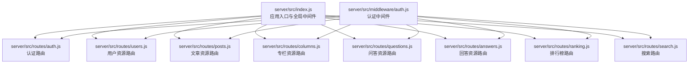
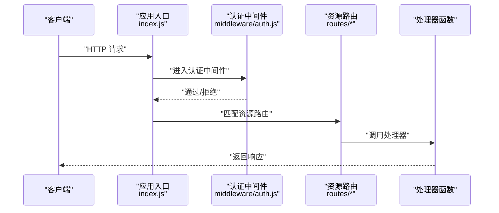
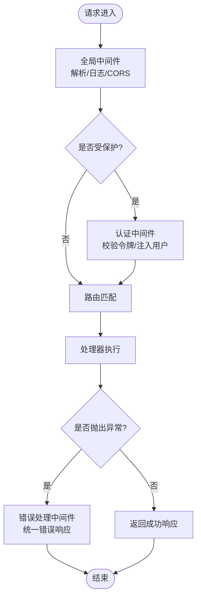
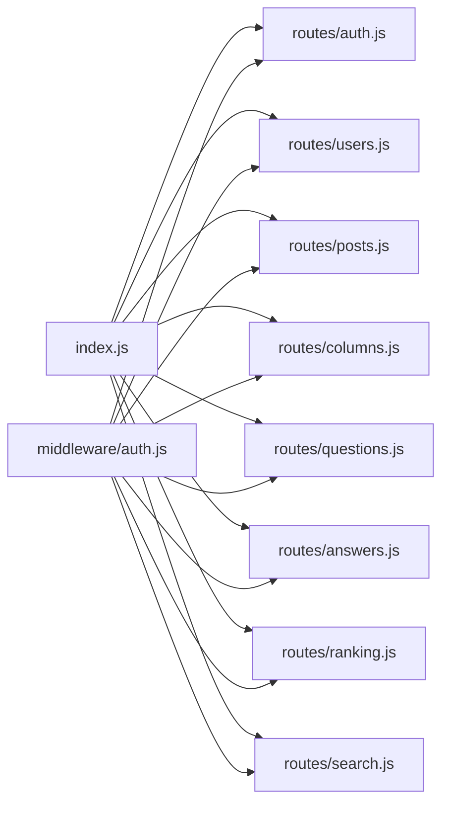

# RESTful路由设计

<cite>
**本文引用的文件**   
- [server/src/index.js](file://server/src/index.js)
- [server/src/routes/auth.js](file://server/src/routes/auth.js)
- [server/src/routes/users.js](file://server/src/routes/users.js)
- [server/src/routes/posts.js](file://server/src/routes/posts.js)
- [server/src/routes/columns.js](file://server/src/routes/columns.js)
- [server/src/routes/answers.js](file://server/src/routes/answers.js)
- [server/src/routes/questions.js](file://server/src/routes/questions.js)
- [server/src/routes/ranking.js](file://server/src/routes/ranking.js)
- [server/src/routes/search.js](file://server/src/routes/search.js)
- [server/src/middleware/auth.js](file://server/src/middleware/auth.js)
</cite>

## 目录
1. [简介](#简介)
2. [项目结构](#项目结构)
3. [核心组件](#核心组件)
4. [架构总览](#架构总览)
5. [详细组件分析](#详细组件分析)
6. [依赖分析](#依赖分析)
7. [性能考虑](#性能考虑)
8. [故障排查指南](#故障排查指南)
9. [结论](#结论)
10. [附录](#附录)

## 简介
本文件面向后端RESTful API的路由设计与实现，聚焦以下目标：
- 明确API路由的组织结构与命名规范
- 统一资源命名约定（单复数、嵌套与子资源）
- 规范HTTP方法语义（GET、POST、PUT、DELETE）
- 定义路由参数设计（路径参数、查询参数、请求体）
- 说明中间件集成模式（认证、日志、错误处理）
- 提供从简单CRUD到复杂业务逻辑的实现示例与最佳实践

## 项目结构
后端采用Express风格模块化组织：入口集中挂载路由，各资源独立路由文件，中间件按职责拆分。

图表来源
- [server/src/index.js](file://server/src/index.js)
- [server/src/routes/auth.js](file://server/src/routes/auth.js)
- [server/src/routes/users.js](file://server/src/routes/users.js)
- [server/src/routes/posts.js](file://server/src/routes/posts.js)
- [server/src/routes/columns.js](file://server/src/routes/columns.js)
- [server/src/routes/questions.js](file://server/src/routes/questions.js)
- [server/src/routes/answers.js](file://server/src/routes/answers.js)
- [server/src/routes/ranking.js](file://server/src/routes/ranking.js)
- [server/src/routes/search.js](file://server/src/routes/search.js)
- [server/src/middleware/auth.js](file://server/src/middleware/auth.js)

章节来源
- [server/src/index.js](file://server/src/index.js)

## 核心组件
- 应用入口与全局中间件
  - 负责注册全局中间件（如JSON解析、CORS、基础日志等），并挂载各资源路由前缀。
  - 建议将错误处理中间件置于最后，确保异常统一收敛。
- 资源路由模块
  - 每个资源一个文件，遵循“名词复数”的URL命名，使用Express Router进行分组。
  - 典型资源：认证、用户、文章、专栏、问答、回答、排行榜、搜索。
- 认证中间件
  - 校验令牌或会话状态，向上下文注入当前用户信息，供后续路由处理器使用。

章节来源
- [server/src/index.js](file://server/src/index.js)
- [server/src/middleware/auth.js](file://server/src/middleware/auth.js)

## 架构总览
下图展示请求从入口到具体资源路由的处理链路，以及认证中间件的接入点。

图表来源
- [server/src/index.js](file://server/src/index.js)
- [server/src/middleware/auth.js](file://server/src/middleware/auth.js)
- [server/src/routes/auth.js](file://server/src/routes/auth.js)
- [server/src/routes/users.js](file://server/src/routes/users.js)
- [server/src/routes/posts.js](file://server/src/routes/posts.js)
- [server/src/routes/columns.js](file://server/src/routes/columns.js)
- [server/src/routes/questions.js](file://server/src/routes/questions.js)
- [server/src/routes/answers.js](file://server/src/routes/answers.js)
- [server/src/routes/ranking.js](file://server/src/routes/ranking.js)
- [server/src/routes/search.js](file://server/src/routes/search.js)

## 详细组件分析

### 认证路由（auth）
- URL设计
  - 登录：POST /api/auth/login
  - 注册：POST /api/auth/register
  - 刷新令牌：POST /api/auth/token/refresh
- HTTP方法与语义
  - POST用于创建新凭证或刷新令牌，不改变已有资源状态。
- 参数设计
  - 请求体：用户名/邮箱、密码、可选设备指纹等
  - 响应体：访问令牌、刷新令牌、过期时间
- 中间件
  - 登录成功后签发令牌；其他受保护接口需携带有效令牌。

章节来源
- [server/src/routes/auth.js](file://server/src/routes/auth.js)

### 用户资源（users）
- URL设计
  - 列表：GET /api/users
  - 详情：GET /api/users/:id
  - 更新：PUT /api/users/:id
  - 删除：DELETE /api/users/:id
- 嵌套与子资源
  - 关注关系：GET /api/users/:id/following
  - 收藏列表：GET /api/users/:id/bookmarks
- 参数设计
  - 路径参数：id
  - 查询参数：page、limit、sort、keyword
  - 请求体：name、email、avatar等字段
- 权限控制
  - 修改自身资料需认证；管理员可操作任意用户。

章节来源
- [server/src/routes/users.js](file://server/src/routes/users.js)

### 文章资源（posts）
- URL设计
  - 列表：GET /api/posts
  - 详情：GET /api/posts/:slug
  - 创建：POST /api/posts
  - 更新：PUT /api/posts/:slug
  - 删除：DELETE /api/posts/:slug
- 嵌套与子资源
  - 评论：GET /api/posts/:slug/comments
  - 点赞：POST /api/posts/:slug/like
  - 收藏：POST /api/posts/:slug/bookmark
- 参数设计
  - 路径参数：slug
  - 查询参数：category、tag、author、page、limit、sort
  - 请求体：title、content、tags、cover、status等
- 版本化与软删除
  - 建议使用软删除标记is_deleted，避免硬删导致数据丢失。

章节来源
- [server/src/routes/posts.js](file://server/src/routes/posts.js)

### 专栏资源（columns）
- URL设计
  - 列表：GET /api/columns
  - 详情：GET /api/columns/:slug
  - 创建：POST /api/columns
  - 更新：PUT /api/columns/:slug
  - 删除：DELETE /api/columns/:slug
- 嵌套与子资源
  - 文章集合：GET /api/columns/:slug/posts
- 参数设计
  - 路径参数：slug
  - 查询参数：page、limit、sort
  - 请求体：title、description、cover、status等

章节来源
- [server/src/routes/columns.js](file://server/src/routes/columns.js)

### 问答资源（questions）
- URL设计
  - 列表：GET /api/questions
  - 详情：GET /api/questions/:id
  - 创建：POST /api/questions
  - 更新：PUT /api/questions/:id
  - 删除：DELETE /api/questions/:id
- 嵌套与子资源
  - 回答集合：GET /api/questions/:id/answers
- 参数设计
  - 路径参数：id
  - 查询参数：tag、status、page、limit、sort
  - 请求体：title、body、tags、status等

章节来源
- [server/src/routes/questions.js](file://server/src/routes/questions.js)

### 回答资源（answers）
- URL设计
  - 列表：GET /api/answers
  - 详情：GET /api/answers/:id
  - 创建：POST /api/answers
  - 更新：PUT /api/answers/:id
  - 删除：DELETE /api/answers/:id
- 嵌套与子资源
  - 所属问题：GET /api/answers/:id/question
  - 赞同：POST /api/answers/:id/upvote
- 参数设计
  - 路径参数：id
  - 查询参数：question_id、page、limit、sort
  - 请求体：body、status等

章节来源
- [server/src/routes/answers.js](file://server/src/routes/answers.js)

### 排行榜（ranking）
- URL设计
  - 综合排行：GET /api/ranking/overall
  - 周榜：GET /api/ranking/weekly
  - 月榜：GET /api/ranking/monthly
- 参数设计
  - 查询参数：limit、offset、type（文章/用户/专栏）
- 场景
  - 聚合统计型接口，适合缓存热点数据以提升性能。

章节来源
- [server/src/routes/ranking.js](file://server/src/routes/ranking.js)

### 搜索（search）
- URL设计
  - 全文检索：GET /api/search
- 参数设计
  - 查询参数：q、type、scope、page、limit、sort
- 场景
  - 支持多类型检索（文章、用户、专栏），可按权重排序。

章节来源
- [server/src/routes/search.js](file://server/src/routes/search.js)

### 认证中间件（auth）
- 职责
  - 校验请求头中的令牌或会话，验证签名与过期时间
  - 将当前用户信息注入上下文，供后续处理器使用
  - 对未授权请求返回标准错误码
- 集成方式
  - 在入口中作为全局中间件或按需挂载到特定路由组
- 扩展点
  - 可扩展为基于角色的访问控制（RBAC）或细粒度权限校验

章节来源
- [server/src/middleware/auth.js](file://server/src/middleware/auth.js)

### 路由参数设计规范
- 路径参数
  - 使用小写连字符或下划线，推荐短横线分隔，如 :slug、:user-id
  - 唯一标识优先使用数字ID或稳定slug
- 查询参数
  - 分页：page、limit
  - 排序：sort、order
  - 过滤：category、tag、status、keyword
  - 时间范围：start_date、end_date
- 请求体
  - JSON格式，字段名使用小写下划线或驼峰，保持前后端一致
  - 必填字段在服务端校验并返回结构化错误

章节来源
- [server/src/routes/posts.js](file://server/src/routes/posts.js)
- [server/src/routes/users.js](file://server/src/routes/users.js)
- [server/src/routes/columns.js](file://server/src/routes/columns.js)
- [server/src/routes/questions.js](file://server/src/routes/questions.js)
- [server/src/routes/answers.js](file://server/src/routes/answers.js)
- [server/src/routes/ranking.js](file://server/src/routes/ranking.js)
- [server/src/routes/search.js](file://server/src/routes/search.js)

### HTTP方法语义与适用场景
- GET：幂等、安全，用于读取资源或列表
- POST：非幂等，用于创建资源或触发动作（如点赞、收藏）
- PUT：幂等，用于全量更新资源
- DELETE：幂等，用于删除资源（建议软删除）
- PATCH：幂等，用于部分更新（可在需要时引入）

章节来源
- [server/src/routes/posts.js](file://server/src/routes/posts.js)
- [server/src/routes/users.js](file://server/src/routes/users.js)
- [server/src/routes/columns.js](file://server/src/routes/columns.js)
- [server/src/routes/questions.js](file://server/src/routes/questions.js)
- [server/src/routes/answers.js](file://server/src/routes/answers.js)
- [server/src/routes/ranking.js](file://server/src/routes/ranking.js)
- [server/src/routes/search.js](file://server/src/routes/search.js)

### 中间件集成模式
- 全局中间件
  - 在入口统一注册，如JSON解析、CORS、基础日志、请求追踪
- 认证中间件
  - 在入口或路由组级别挂载，校验令牌后放行
- 日志中间件
  - 记录请求方法、路径、耗时、状态码、用户ID（脱敏）
- 错误处理中间件
  - 捕获异常，返回统一错误结构，包含code、message、details

图表来源
- [server/src/index.js](file://server/src/index.js)
- [server/src/middleware/auth.js](file://server/src/middleware/auth.js)

章节来源
- [server/src/index.js](file://server/src/index.js)
- [server/src/middleware/auth.js](file://server/src/middleware/auth.js)

### 路由实现示例与最佳实践
- 简单CRUD
  - 用户资源：列表、详情、更新、删除，遵循RESTful命名与方法语义
- 嵌套资源
  - 专栏下的文章集合：/api/columns/:slug/posts
  - 问题下的回答集合：/api/questions/:id/answers
- 复杂业务逻辑
  - 排行榜：聚合计算+缓存策略
  - 搜索：多条件过滤+排序+分页
- 权限控制
  - 仅作者可编辑/删除自己的文章
  - 管理员可管理所有资源
- 错误与校验
  - 输入校验失败返回422
  - 资源不存在返回404
  - 未认证返回401，无权限返回403

章节来源
- [server/src/routes/users.js](file://server/src/routes/users.js)
- [server/src/routes/posts.js](file://server/src/routes/posts.js)
- [server/src/routes/columns.js](file://server/src/routes/columns.js)
- [server/src/routes/questions.js](file://server/src/routes/questions.js)
- [server/src/routes/answers.js](file://server/src/routes/answers.js)
- [server/src/routes/ranking.js](file://server/src/routes/ranking.js)
- [server/src/routes/search.js](file://server/src/routes/search.js)

## 依赖分析
- 入口文件集中挂载路由，降低耦合度
- 各资源路由相互独立，便于扩展与维护
- 认证中间件被多个路由复用，提升一致性

图表来源
- [server/src/index.js](file://server/src/index.js)
- [server/src/routes/auth.js](file://server/src/routes/auth.js)
- [server/src/routes/users.js](file://server/src/routes/users.js)
- [server/src/routes/posts.js](file://server/src/routes/posts.js)
- [server/src/routes/columns.js](file://server/src/routes/columns.js)
- [server/src/routes/questions.js](file://server/src/routes/questions.js)
- [server/src/routes/answers.js](file://server/src/routes/answers.js)
- [server/src/routes/ranking.js](file://server/src/routes/ranking.js)
- [server/src/routes/search.js](file://server/src/routes/search.js)
- [server/src/middleware/auth.js](file://server/src/middleware/auth.js)

章节来源
- [server/src/index.js](file://server/src/index.js)

## 性能考虑
- 分页与限流
  - 默认限制每页数量上限，防止大结果集拖垮服务
- 缓存策略
  - 排行榜、搜索等读多写少接口启用缓存（内存/Redis）
- 索引优化
  - 数据库层针对常用查询字段建立索引（如slug、category、status）
- 连接池与超时
  - 合理配置数据库连接池大小与超时时间，避免雪崩

[本节为通用指导，无需引用具体文件]

## 故障排查指南
- 常见问题
  - 401未认证：检查令牌是否过期或签名无效
  - 403无权限：确认当前用户角色与资源归属
  - 422参数校验失败：核对请求体字段与约束
  - 404资源不存在：检查路径参数是否正确
- 日志定位
  - 查看请求日志中的方法、路径、耗时、状态码
  - 结合用户ID与请求ID追踪完整链路
- 错误统一
  - 确保错误处理中间件返回一致的code、message、details结构

章节来源
- [server/src/middleware/auth.js](file://server/src/middleware/auth.js)
- [server/src/index.js](file://server/src/index.js)

## 结论
通过统一的资源命名、规范的HTTP方法语义、清晰的路由参数设计与可靠的中间件集成，本项目实现了高内聚、低耦合的RESTful API体系。建议在后续迭代中持续完善错误模型、鉴权策略与性能优化，以支撑更复杂的业务场景。

[本节为总结性内容，无需引用具体文件]

## 附录
- 术语
  - 资源：具有唯一标识的实体，如用户、文章、专栏
  - 子资源：依附于父资源的资源，如专栏下的文章
  - 幂等：多次执行产生相同结果的操作（GET、PUT、DELETE）
- 参考
  - 资源命名：使用名词复数形式，避免动词出现在URL中
  - 嵌套层级：不超过两层，必要时拆分为独立资源

[本节为概念性内容，无需引用具体文件]