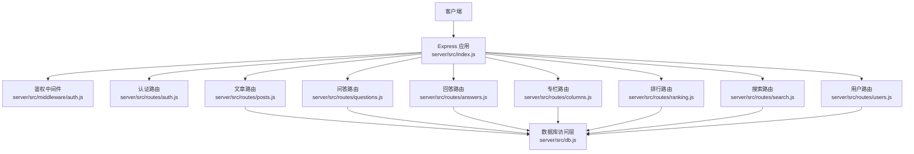
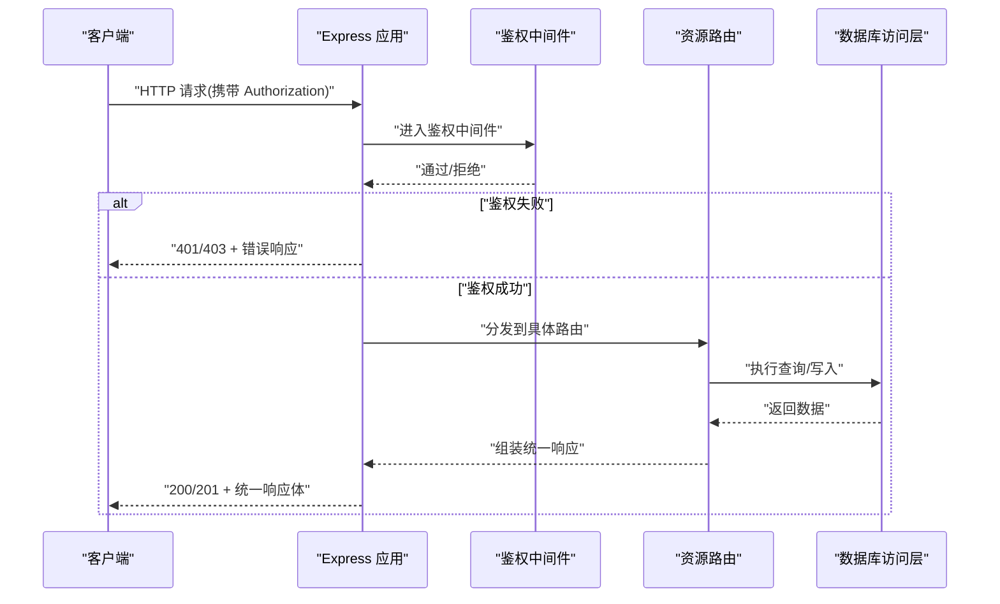
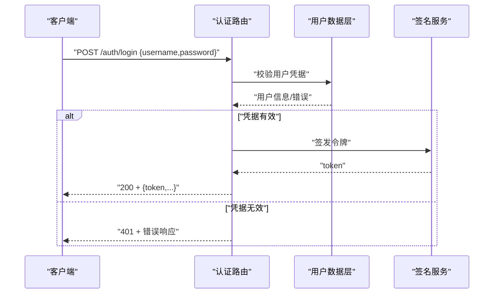
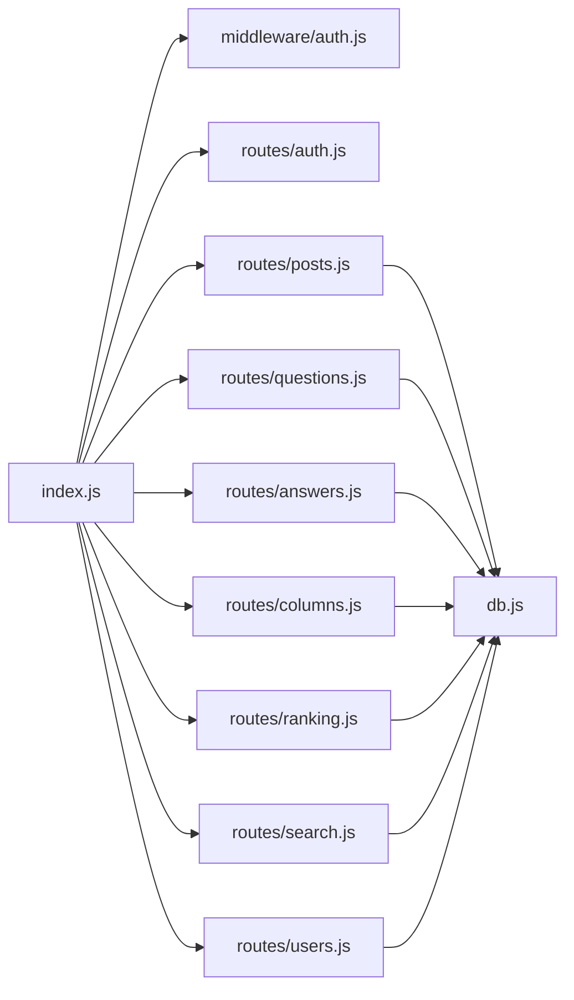

# 请求响应格式规范

<cite>
**本文引用的文件**   
- [server/src/index.js](file://server/src/index.js)
- [server/src/routes/auth.js](file://server/src/routes/auth.js)
- [server/src/routes/posts.js](file://server/src/routes/posts.js)
- [server/src/routes/questions.js](file://server/src/routes/questions.js)
- [server/src/routes/answers.js](file://server/src/routes/answers.js)
- [server/src/routes/columns.js](file://server/src/routes/columns.js)
- [server/src/routes/ranking.js](file://server/src/routes/ranking.js)
- [server/src/routes/search.js](file://server/src/routes/search.js)
- [server/src/routes/users.js](file://server/src/routes/users.js)
- [server/src/middleware/auth.js](file://server/src/middleware/auth.js)
- [server/src/db.js](file://server/src/db.js)
- [API.md](file://API.md)
</cite>

## 目录
1. [简介](#简介)
2. [项目结构](#项目结构)
3. [核心组件](#核心组件)
4. [架构总览](#架构总览)
5. [详细组件分析](#详细组件分析)
6. [依赖分析](#依赖分析)
7. [性能考虑](#性能考虑)
8. [故障排查指南](#故障排查指南)
9. [结论](#结论)
10. [附录](#附录)

## 简介
本规范定义前后端数据交换的统一格式，包括：
- 统一的JSON数据结构（成功响应、分页响应、列表响应）
- 请求头规范（Content-Type、Accept、Authorization等）
- 分页机制（页码、每页数量限制、总记录数与元信息）
- 排序与过滤（字段指定、多字段排序、条件过滤语法）
- 数据验证规则（必填、类型、业务规则）
- 完整示例（覆盖常见场景）

该规范适用于后端Express服务的所有REST接口。

## 项目结构
后端采用Express路由分层组织，统一入口挂载各功能模块路由；中间件负责鉴权与通用处理；数据库访问层提供查询能力。

**图示来源**
- [server/src/index.js](file://server/src/index.js)
- [server/src/middleware/auth.js](file://server/src/middleware/auth.js)
- [server/src/routes/auth.js](file://server/src/routes/auth.js)
- [server/src/routes/posts.js](file://server/src/routes/posts.js)
- [server/src/routes/questions.js](file://server/src/routes/questions.js)
- [server/src/routes/answers.js](file://server/src/routes/answers.js)
- [server/src/routes/columns.js](file://server/src/routes/columns.js)
- [server/src/routes/ranking.js](file://server/src/routes/ranking.js)
- [server/src/routes/search.js](file://server/src/routes/search.js)
- [server/src/routes/users.js](file://server/src/routes/users.js)
- [server/src/db.js](file://server/src/db.js)

**章节来源**
- [server/src/index.js](file://server/src/index.js)
- [server/src/middleware/auth.js](file://server/src/middleware/auth.js)
- [server/src/db.js](file://server/src/db.js)

## 核心组件
- 统一响应体：所有接口返回一致的JSON结构，包含状态码、消息、数据与分页元信息（如适用）。
- 鉴权中间件：校验Authorization头部，注入当前用户上下文。
- 路由层：按资源划分，实现CRUD与查询逻辑，遵循统一响应格式。
- 数据访问层：封装SQL/ORM调用，保证数据一致性。

**章节来源**
- [server/src/middleware/auth.js](file://server/src/middleware/auth.js)
- [server/src/routes/posts.js](file://server/src/routes/posts.js)
- [server/src/routes/questions.js](file://server/src/routes/questions.js)
- [server/src/routes/answers.js](file://server/src/routes/answers.js)
- [server/src/routes/columns.js](file://server/src/routes/columns.js)
- [server/src/routes/ranking.js](file://server/src/routes/ranking.js)
- [server/src/routes/search.js](file://server/src/routes/search.js)
- [server/src/routes/users.js](file://server/src/routes/users.js)
- [server/src/db.js](file://server/src/db.js)

## 架构总览
下图展示一次受保护的资源读取流程，体现请求头、鉴权、路由与数据层的协作关系。

**图示来源**
- [server/src/index.js](file://server/src/index.js)
- [server/src/middleware/auth.js](file://server/src/middleware/auth.js)
- [server/src/routes/posts.js](file://server/src/routes/posts.js)
- [server/src/db.js](file://server/src/db.js)

## 详细组件分析

### 统一响应格式
- 成功响应
  - 结构要点：状态码、消息、数据对象或数组、可选的分页元信息。
  - 字段说明：
    - code：数字型状态码，业务成功为0。
    - message：人类可读的消息文本。
    - data：响应主体，可为对象或数组。
    - pagination：当返回列表时附带分页元信息。
- 分页响应
  - 字段说明：
    - total：总记录数。
    - page：当前页码（从1开始）。
    - pageSize：每页数量。
    - totalPages：总页数。
- 列表响应
  - 在data中返回数组，并附带pagination元信息。
- 错误响应
  - 结构要点：code为非0的错误码、message描述错误原因、可选的details用于定位问题。

注意：以上为统一约定，具体字段名以实际实现为准。

**章节来源**
- [server/src/routes/posts.js](file://server/src/routes/posts.js)
- [server/src/routes/questions.js](file://server/src/routes/questions.js)
- [server/src/routes/answers.js](file://server/src/routes/answers.js)
- [server/src/routes/columns.js](file://server/src/routes/columns.js)
- [server/src/routes/ranking.js](file://server/src/routes/ranking.js)
- [server/src/routes/search.js](file://server/src/routes/search.js)
- [server/src/routes/users.js](file://server/src/routes/users.js)

### 请求头规范
- Content-Type
  - application/json：提交JSON请求体时使用。
  - multipart/form-data：上传文件时使用。
- Accept
  - application/json：期望返回JSON格式。
- Authorization
  - Bearer <token>：受保护接口需携带JWT令牌。
- 其他常用
  - X-Request-Id：追踪ID，便于日志关联。
  - Cache-Control：控制缓存策略（GET只读接口可设置）。

**章节来源**
- [server/src/middleware/auth.js](file://server/src/middleware/auth.js)
- [server/src/routes/auth.js](file://server/src/routes/auth.js)

### 分页机制
- 查询参数
  - page：页码，默认1，最小1。
  - pageSize：每页数量，默认值由服务端设定，最大上限由服务端限制。
- 响应元信息
  - total：总记录数。
  - page：当前页。
  - pageSize：每页数量。
  - totalPages：总页数。
- 行为约束
  - 非法page/pageSize将被修正或返回错误。
  - 空结果应返回空数组与正确的total=0。

**章节来源**
- [server/src/routes/posts.js](file://server/src/routes/posts.js)
- [server/src/routes/questions.js](file://server/src/routes/questions.js)
- [server/src/routes/answers.js](file://server/src/routes/answers.js)
- [server/src/routes/columns.js](file://server/src/routes/columns.js)
- [server/src/routes/ranking.js](file://server/src/routes/ranking.js)
- [server/src/routes/search.js](file://server/src/routes/search.js)
- [server/src/routes/users.js](file://server/src/routes/users.js)

### 排序与过滤
- 排序
  - sort：支持“字段:方向”形式，多个字段用逗号分隔，例如“createdAt:desc,views:asc”。
  - 未指定时采用默认排序（如创建时间倒序）。
- 过滤
  - 支持查询字符串键值对进行条件过滤，如status、category、keyword等。
  - 复杂条件可通过JSON字符串或专用参数传递（由具体接口定义）。
- 安全与性能
  - 白名单校验排序字段，防止任意列排序。
  - 过滤条件需做输入清洗与长度限制。

**章节来源**
- [server/src/routes/posts.js](file://server/src/routes/posts.js)
- [server/src/routes/questions.js](file://server/src/routes/questions.js)
- [server/src/routes/search.js](file://server/src/routes/search.js)

### 数据验证规则
- 必填字段
  - 根据接口定义，缺失必填字段将返回错误。
- 数据类型
  - 数值型、布尔型、枚举型需严格校验。
- 业务规则
  - 唯一性约束（如用户名、邮箱）。
  - 权限校验（管理员/作者/所有者）。
  - 内容长度与敏感词检查。
- 错误反馈
  - 使用统一错误响应结构，并在details中列出字段级错误。

**章节来源**
- [server/src/routes/auth.js](file://server/src/routes/auth.js)
- [server/src/routes/users.js](file://server/src/routes/users.js)
- [server/src/routes/posts.js](file://server/src/routes/posts.js)

### 认证与授权流程
- 登录
  - 提交账号密码，成功后返回令牌。
- 鉴权
  - 受保护接口需在Authorization中携带Bearer令牌。
  - 中间件解析令牌并注入用户上下文。
- 授权
  - 基于角色或资源归属判断操作权限。

**图示来源**
- [server/src/routes/auth.js](file://server/src/routes/auth.js)
- [server/src/middleware/auth.js](file://server/src/middleware/auth.js)

**章节来源**
- [server/src/routes/auth.js](file://server/src/routes/auth.js)
- [server/src/middleware/auth.js](file://server/src/middleware/auth.js)

### 资源接口约定（示例）
- 文章
  - 列表：GET /posts?page=&pageSize=&sort=&filter=...
  - 详情：GET /posts/:id
  - 创建：POST /posts (需要作者权限)
  - 更新：PUT /posts/:id (需要作者/管理员)
  - 删除：DELETE /posts/:id (需要作者/管理员)
- 问答
  - 列表：GET /questions?page=&pageSize=&sort=&filter=...
  - 详情：GET /questions/:id
  - 创建：POST /questions
  - 更新/删除：按权限控制
- 回答
  - 列表：GET /answers?questionId=&page=&pageSize=...
  - 详情：GET /answers/:id
  - 创建：POST /answers
- 专栏
  - 列表：GET /columns
  - 详情：GET /columns/:slug
  - 管理：POST/PUT/DELETE（管理员）
- 排行
  - GET /ranking?type=&limit=...
- 搜索
  - GET /search?q=&type=&page=&pageSize=...
- 用户
  - 注册/登录/登出
  - 个人资料：GET/PUT /users/me
  - 管理：管理员专属

上述路径与参数为约定式命名，具体以路由实现为准。

**章节来源**
- [server/src/routes/posts.js](file://server/src/routes/posts.js)
- [server/src/routes/questions.js](file://server/src/routes/questions.js)
- [server/src/routes/answers.js](file://server/src/routes/answers.js)
- [server/src/routes/columns.js](file://server/src/routes/columns.js)
- [server/src/routes/ranking.js](file://server/src/routes/ranking.js)
- [server/src/routes/search.js](file://server/src/routes/search.js)
- [server/src/routes/users.js](file://server/src/routes/users.js)

## 依赖分析
- 耦合关系
  - 路由层依赖鉴权中间件与数据库访问层。
  - 中间件仅关注认证与上下文注入，保持低耦合。
- 外部依赖
  - 数据库驱动/ORM（由db层封装）。
  - JWT库（用于令牌签发与校验）。
- 循环依赖
  - 路由与中间件之间无直接相互引用，避免循环。

**图示来源**
- [server/src/index.js](file://server/src/index.js)
- [server/src/middleware/auth.js](file://server/src/middleware/auth.js)
- [server/src/routes/*.js](file://server/src/routes/posts.js)
- [server/src/db.js](file://server/src/db.js)

**章节来源**
- [server/src/index.js](file://server/src/index.js)
- [server/src/db.js](file://server/src/db.js)

## 性能考虑
- 分页与限流
  - 强制pageSize上限，避免大结果集拖垮服务。
  - 合理设置数据库索引，优化排序与过滤字段。
- 缓存
  - 对热点只读接口启用短期缓存（ETag/Cache-Control）。
- 连接池
  - 复用数据库连接，减少握手开销。
- 序列化
  - 按需返回字段，避免冗余数据传输。

[本节为通用指导，不直接分析具体文件]

## 故障排查指南
- 常见问题
  - 401未认证：检查Authorization是否携带正确Bearer令牌。
  - 403无权限：确认当前用户角色与资源归属。
  - 400参数错误：检查必填字段、类型与取值范围。
  - 422业务校验失败：查看details中的字段错误。
  - 500服务器错误：查看服务端日志与堆栈。
- 诊断建议
  - 开启X-Request-Id并在日志中输出。
  - 记录关键入参与耗时。
  - 对分页与排序参数增加边界校验日志。

**章节来源**
- [server/src/middleware/auth.js](file://server/src/middleware/auth.js)
- [server/src/routes/auth.js](file://server/src/routes/auth.js)

## 结论
通过统一响应格式、严格的请求头约定、完善的分页/排序/过滤机制以及清晰的数据验证规则，本项目实现了稳定、可预期且易维护的API数据交换标准。建议在新增接口时严格遵循本规范，确保前后端协作顺畅。

[本节为总结性内容，不直接分析具体文件]

## 附录

### 统一响应体结构（字段说明）
- 成功响应
  - code：数字，0表示成功。
  - message：字符串，提示信息。
  - data：对象或数组，业务数据。
  - pagination：对象，仅在列表接口出现。
- 分页元信息
  - total：数字，总记录数。
  - page：数字，当前页。
  - pageSize：数字，每页数量。
  - totalPages：数字，总页数。
- 错误响应
  - code：非0错误码。
  - message：错误描述。
  - details：可选，字段级错误列表。

**章节来源**
- [server/src/routes/posts.js](file://server/src/routes/posts.js)
- [server/src/routes/questions.js](file://server/src/routes/questions.js)
- [server/src/routes/answers.js](file://server/src/routes/answers.js)
- [server/src/routes/columns.js](file://server/src/routes/columns.js)
- [server/src/routes/ranking.js](file://server/src/routes/ranking.js)
- [server/src/routes/search.js](file://server/src/routes/search.js)
- [server/src/routes/users.js](file://server/src/routes/users.js)

### 请求头清单
- Content-Type：application/json 或 multipart/form-data
- Accept：application/json
- Authorization：Bearer <token>
- X-Request-Id：可选，追踪ID
- Cache-Control：可选，缓存策略

**章节来源**
- [server/src/middleware/auth.js](file://server/src/middleware/auth.js)
- [server/src/routes/auth.js](file://server/src/routes/auth.js)

### 分页与排序参数约定
- 分页
  - page：整数，>=1
  - pageSize：整数，1..N（N由服务端限定）
- 排序
  - sort：字段:方向[,字段:方向...]
  - 方向：asc/desc
- 过滤
  - 查询字符串键值对，具体字段见各接口文档

**章节来源**
- [server/src/routes/posts.js](file://server/src/routes/posts.js)
- [server/src/routes/questions.js](file://server/src/routes/questions.js)
- [server/src/routes/search.js](file://server/src/routes/search.js)

### 数据验证规则摘要
- 必填字段：按接口定义校验
- 类型校验：number/boolean/string/enums
- 业务规则：唯一性、权限、长度与内容安全
- 错误细节：details字段列举字段级错误

**章节来源**
- [server/src/routes/auth.js](file://server/src/routes/auth.js)
- [server/src/routes/users.js](file://server/src/routes/users.js)
- [server/src/routes/posts.js](file://server/src/routes/posts.js)

### 参考文档
- 项目API文档：[API.md](file://API.md)

**章节来源**
- [API.md](file://API.md)