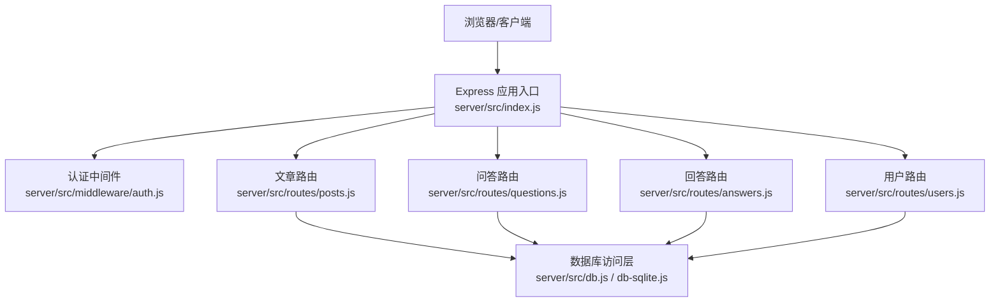
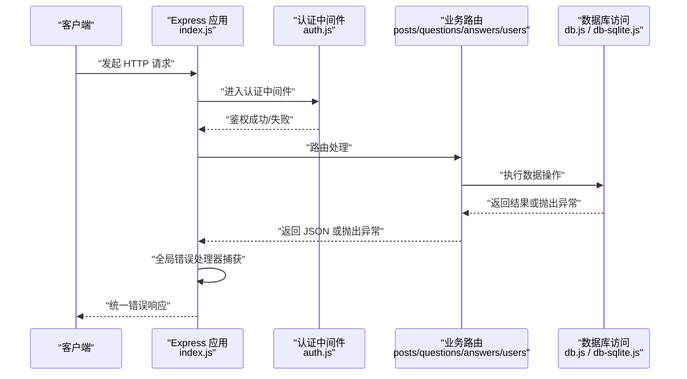
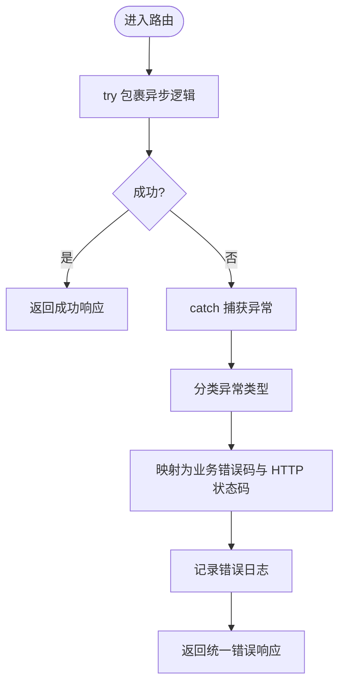
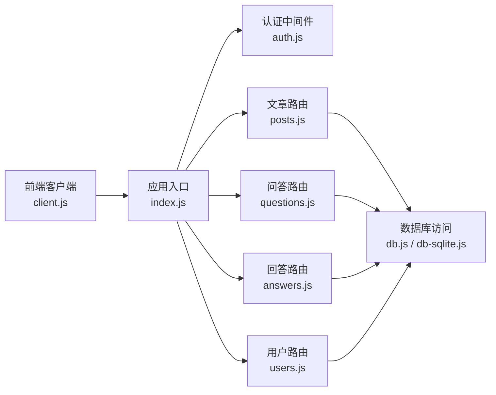

# 错误处理机制

<cite>
**本文引用的文件**   
- [server/src/index.js](file://server/src/index.js)
- [server/src/middleware/auth.js](file://server/src/middleware/auth.js)
- [server/src/routes/posts.js](file://server/src/routes/posts.js)
- [server/src/routes/questions.js](file://server/src/routes/questions.js)
- [server/src/routes/answers.js](file://server/src/routes/answers.js)
- [server/src/routes/users.js](file://server/src/routes/users.js)
- [server/src/db.js](file://server/src/db.js)
- [server/src/db-sqlite.js](file://server/src/db-sqlite.js)
- [src/api/client.js](file://src/api/client.js)
</cite>

## 目录
1. [简介](#简介)
2. [项目结构](#项目结构)
3. [核心组件](#核心组件)
4. [架构总览](#架构总览)
5. [详细组件分析](#详细组件分析)
6. [依赖分析](#依赖分析)
7. [性能考虑](#性能考虑)
8. [故障排查指南](#故障排查指南)
9. [结论](#结论)
10. [附录](#附录)

## 简介
本文件面向后端与前端协作团队，定义并统一博客项目的 API 错误处理策略。目标包括：
- 建立统一的错误码体系（HTTP 状态码映射、业务错误码分类、错误级别划分）
- 规范错误响应格式（消息结构、调试信息、堆栈处理）
- 明确异常捕获机制（全局异常处理器、异步错误处理、数据库异常处理）
- 覆盖输入验证错误（参数校验失败、类型转换错误、业务规则违反）
- 完善错误日志记录（信息收集、日志格式规范、调试支持）
- 提供常见错误场景的处理示例与最佳实践

## 项目结构
本项目采用前后端分离结构：
- 后端基于 Express，路由位于 server/src/routes，中间件位于 server/src/middleware，数据访问位于 server/src/db*.js
- 前端通过 src/api/client.js 调用后端 API，并在客户端进行基础错误提示

图表来源
- [server/src/index.js](file://server/src/index.js)
- [server/src/middleware/auth.js](file://server/src/middleware/auth.js)
- [server/src/routes/posts.js](file://server/src/routes/posts.js)
- [server/src/routes/questions.js](file://server/src/routes/questions.js)
- [server/src/routes/answers.js](file://server/src/routes/answers.js)
- [server/src/routes/users.js](file://server/src/routes/users.js)
- [server/src/db.js](file://server/src/db.js)
- [server/src/db-sqlite.js](file://server/src/db-sqlite.js)

章节来源
- [server/src/index.js](file://server/src/index.js)
- [server/src/middleware/auth.js](file://server/src/middleware/auth.js)
- [server/src/routes/posts.js](file://server/src/routes/posts.js)
- [server/src/routes/questions.js](file://server/src/routes/questions.js)
- [server/src/routes/answers.js](file://server/src/routes/answers.js)
- [server/src/routes/users.js](file://server/src/routes/users.js)
- [server/src/db.js](file://server/src/db.js)
- [server/src/db-sqlite.js](file://server/src/db-sqlite.js)

## 核心组件
本节聚焦于错误处理相关的关键位置与职责：
- 应用入口：注册全局错误处理中间件、请求日志、跨域等
- 认证中间件：鉴权失败返回统一错误
- 各业务路由：对输入校验、业务规则、资源不存在等进行错误返回
- 数据访问层：封装数据库异常，转换为统一业务错误
- 前端 API 客户端：统一解析响应、展示错误提示

章节来源
- [server/src/index.js](file://server/src/index.js)
- [server/src/middleware/auth.js](file://server/src/middleware/auth.js)
- [server/src/routes/posts.js](file://server/src/routes/posts.js)
- [server/src/routes/questions.js](file://server/src/routes/questions.js)
- [server/src/routes/answers.js](file://server/src/routes/answers.js)
- [server/src/routes/users.js](file://server/src/routes/users.js)
- [server/src/db.js](file://server/src/db.js)
- [server/src/db-sqlite.js](file://server/src/db-sqlite.js)
- [src/api/client.js](file://src/api/client.js)

## 架构总览
下图展示了从客户端到数据库的完整错误流，以及全局异常处理器的拦截点。

图表来源
- [server/src/index.js](file://server/src/index.js)
- [server/src/middleware/auth.js](file://server/src/middleware/auth.js)
- [server/src/routes/posts.js](file://server/src/routes/posts.js)
- [server/src/routes/questions.js](file://server/src/routes/questions.js)
- [server/src/routes/answers.js](file://server/src/routes/answers.js)
- [server/src/routes/users.js](file://server/src/routes/users.js)
- [server/src/db.js](file://server/src/db.js)
- [server/src/db-sqlite.js](file://server/src/db-sqlite.js)

## 详细组件分析

### 统一错误码体系
- HTTP 状态码映射
  - 2xx：成功
  - 400：请求参数错误或类型不匹配
  - 401：未认证或令牌无效
  - 403：权限不足
  - 404：资源不存在
  - 409：资源冲突（如重复创建）
  - 422：业务规则校验失败
  - 500：服务器内部错误
- 业务错误码分类
  - AUTH_*：认证与授权相关
  - VALIDATION_*：输入校验相关
  - BUSINESS_*：业务规则相关
  - DATABASE_*：数据库相关
  - SYSTEM_*：系统级异常
- 错误级别划分
  - INFO：可预期且不影响主流程
  - WARN：需要关注但不阻塞
  - ERROR：影响当前请求或功能
  - FATAL：服务不可用或严重异常

章节来源
- [server/src/index.js](file://server/src/index.js)
- [server/src/middleware/auth.js](file://server/src/middleware/auth.js)
- [server/src/routes/posts.js](file://server/src/routes/posts.js)
- [server/src/routes/questions.js](file://server/src/routes/questions.js)
- [server/src/routes/answers.js](file://server/src/routes/answers.js)
- [server/src/routes/users.js](file://server/src/routes/users.js)
- [server/src/db.js](file://server/src/db.js)
- [server/src/db-sqlite.js](file://server/src/db-sqlite.js)

### 错误响应格式
建议统一返回结构如下（字段名可按实现调整）：
- code：业务错误码（字符串）
- status：HTTP 状态码（数字）
- message：面向用户的可读消息（字符串）
- details：可选，结构化错误详情（对象或数组）
- traceId：可选，用于关联日志的请求追踪 ID（字符串）
- stack：仅开发环境包含，生产环境隐藏

说明：
- 所有错误均返回 JSON
- 敏感信息（如 SQL 语句、内部堆栈）不在生产环境暴露
- 前端根据 status 和 code 决定提示与跳转

章节来源
- [server/src/index.js](file://server/src/index.js)
- [server/src/middleware/auth.js](file://server/src/middleware/auth.js)
- [server/src/routes/posts.js](file://server/src/routes/posts.js)
- [server/src/routes/questions.js](file://server/src/routes/questions.js)
- [server/src/routes/answers.js](file://server/src/routes/answers.js)
- [server/src/routes/users.js](file://server/src/routes/users.js)
- [server/src/db.js](file://server/src/db.js)
- [server/src/db-sqlite.js](file://server/src/db-sqlite.js)
- [src/api/client.js](file://src/api/client.js)

### 异常捕获机制
- 全局异常处理器
  - 在应用入口注册一个兜底中间件，捕获所有未处理的同步/异步异常
  - 将异常转换为统一错误响应，并记录日志
- 异步错误处理
  - 路由中所有异步操作均需 try/catch 或使用 Promise 链式 catch
  - 确保每个分支都返回统一错误结构
- 数据库异常处理
  - 在数据访问层捕获底层驱动异常，转换为业务错误码
  - 区分连接错误、查询错误、约束冲突等，分别映射为不同 HTTP 状态码

图表来源
- [server/src/index.js](file://server/src/index.js)
- [server/src/routes/posts.js](file://server/src/routes/posts.js)
- [server/src/routes/questions.js](file://server/src/routes/questions.js)
- [server/src/routes/answers.js](file://server/src/routes/answers.js)
- [server/src/routes/users.js](file://server/src/routes/users.js)
- [server/src/db.js](file://server/src/db.js)
- [server/src/db-sqlite.js](file://server/src/db-sqlite.js)

章节来源
- [server/src/index.js](file://server/src/index.js)
- [server/src/routes/posts.js](file://server/src/routes/posts.js)
- [server/src/routes/questions.js](file://server/src/routes/questions.js)
- [server/src/routes/answers.js](file://server/src/routes/answers.js)
- [server/src/routes/users.js](file://server/src/routes/users.js)
- [server/src/db.js](file://server/src/db.js)
- [server/src/db-sqlite.js](file://server/src/db-sqlite.js)

### 输入验证错误
- 参数校验失败
  - 必填字段缺失、长度/范围/格式不符合要求时，返回 400 或 422
  - details 中包含具体字段与原因
- 类型转换错误
  - 非期望类型（如字符串传入了数字字段）返回 400
- 业务规则违反
  - 例如“文章标题不能为空”、“文章已存在”等，返回 409 或 422
- 推荐做法
  - 在路由入口处集中校验，使用中间件或工具函数统一处理
  - 将校验错误聚合为 details 数组，便于前端逐条提示

章节来源
- [server/src/routes/posts.js](file://server/src/routes/posts.js)
- [server/src/routes/questions.js](file://server/src/routes/questions.js)
- [server/src/routes/answers.js](file://server/src/routes/answers.js)
- [server/src/routes/users.js](file://server/src/routes/users.js)

### 认证与授权错误
- 未登录或令牌无效：返回 401，code 以 AUTH_ 开头
- 权限不足：返回 403，code 以 AUTH_ 开头
- 建议在认证中间件中统一处理，避免在各路由重复判断

章节来源
- [server/src/middleware/auth.js](file://server/src/middleware/auth.js)

### 数据库异常处理
- 连接失败、超时、SQL 语法错误、唯一约束冲突等
- 在数据访问层捕获并转换为业务错误码，避免泄露底层细节
- 对于唯一约束冲突，返回 409；其他数据库错误返回 500 并记录日志

章节来源
- [server/src/db.js](file://server/src/db.js)
- [server/src/db-sqlite.js](file://server/src/db-sqlite.js)

### 前端错误处理
- 统一解析响应体，根据 status 与 code 展示提示
- 网络错误、超时、服务端 5xx 错误需有重试或降级策略
- 敏感错误信息不在前端展示

章节来源
- [src/api/client.js](file://src/api/client.js)

## 依赖分析
错误处理涉及的模块耦合关系如下：

图表来源
- [server/src/index.js](file://server/src/index.js)
- [server/src/middleware/auth.js](file://server/src/middleware/auth.js)
- [server/src/routes/posts.js](file://server/src/routes/posts.js)
- [server/src/routes/questions.js](file://server/src/routes/questions.js)
- [server/src/routes/answers.js](file://server/src/routes/answers.js)
- [server/src/routes/users.js](file://server/src/routes/users.js)
- [server/src/db.js](file://server/src/db.js)
- [server/src/db-sqlite.js](file://server/src/db-sqlite.js)
- [src/api/client.js](file://src/api/client.js)

章节来源
- [server/src/index.js](file://server/src/index.js)
- [server/src/middleware/auth.js](file://server/src/middleware/auth.js)
- [server/src/routes/posts.js](file://server/src/routes/posts.js)
- [server/src/routes/questions.js](file://server/src/routes/questions.js)
- [server/src/routes/answers.js](file://server/src/routes/answers.js)
- [server/src/routes/users.js](file://server/src/routes/users.js)
- [server/src/db.js](file://server/src/db.js)
- [server/src/db-sqlite.js](file://server/src/db-sqlite.js)
- [src/api/client.js](file://src/api/client.js)

## 性能考虑
- 避免在错误路径中进行昂贵计算或额外 I/O
- 仅在开发环境输出详细堆栈，生产环境关闭
- 对高频错误进行采样统计，避免日志风暴
- 对数据库错误进行分类与快速失败，减少等待时间

## 故障排查指南
- 定位问题
  - 通过 traceId 关联请求与日志
  - 查看全局错误处理器记录的日志上下文（请求方法、URL、参数摘要、用户标识）
- 常见问题
  - 参数缺失或类型错误：检查路由入参校验与前端传参
  - 认证失败：检查令牌有效期与签名
  - 数据库错误：检查连接配置、表结构与索引
- 调试建议
  - 本地开启详细日志
  - 使用最小复现用例
  - 对比成功与失败请求的差异

章节来源
- [server/src/index.js](file://server/src/index.js)
- [server/src/middleware/auth.js](file://server/src/middleware/auth.js)
- [server/src/routes/posts.js](file://server/src/routes/posts.js)
- [server/src/routes/questions.js](file://server/src/routes/questions.js)
- [server/src/routes/answers.js](file://server/src/routes/answers.js)
- [server/src/routes/users.js](file://server/src/routes/users.js)
- [server/src/db.js](file://server/src/db.js)
- [server/src/db-sqlite.js](file://server/src/db-sqlite.js)

## 结论
通过统一的错误码体系、标准化的错误响应格式、完善的异常捕获与日志记录，可以显著提升系统的可观测性与可维护性。建议在后端各层严格执行上述规范，并在前端保持一致的错误处理策略，从而为用户提供稳定、清晰的交互体验。

## 附录

### 常见错误场景与处理示例
- 参数校验失败
  - 场景：创建文章时缺少标题或内容
  - 处理：返回 400/422，details 列出缺失字段与原因
- 类型转换错误
  - 场景：分页页码传入字符串
  - 处理：返回 400，message 提示类型不匹配
- 业务规则违反
  - 场景：重复收藏文章
  - 处理：返回 409，message 提示冲突
- 认证失败
  - 场景：访问受保护接口未携带有效令牌
  - 处理：返回 401，message 提示重新登录
- 权限不足
  - 场景：普通用户尝试删除文章
  - 处理：返回 403，message 提示无权限
- 资源不存在
  - 场景：获取不存在的文章
  - 处理：返回 404，message 提示资源不存在
- 数据库异常
  - 场景：连接失败或唯一约束冲突
  - 处理：连接失败返回 500；约束冲突返回 409

章节来源
- [server/src/routes/posts.js](file://server/src/routes/posts.js)
- [server/src/routes/questions.js](file://server/src/routes/questions.js)
- [server/src/routes/answers.js](file://server/src/routes/answers.js)
- [server/src/routes/users.js](file://server/src/routes/users.js)
- [server/src/db.js](file://server/src/db.js)
- [server/src/db-sqlite.js](file://server/src/db-sqlite.js)

### 最佳实践清单
- 所有异常必须被捕获并转换为统一错误响应
- 禁止在生产环境暴露内部堆栈与敏感信息
- 为每个错误分配稳定的业务错误码，便于前端与监控对接
- 在数据访问层屏蔽底层驱动差异，向上层暴露一致错误语义
- 为关键路径添加 traceId，贯穿请求生命周期
- 对高频错误进行告警与限流，防止雪崩