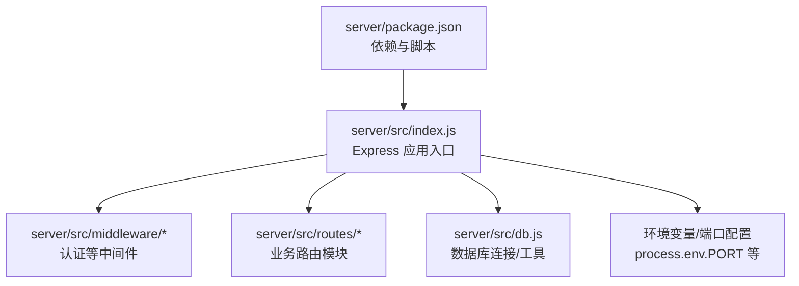
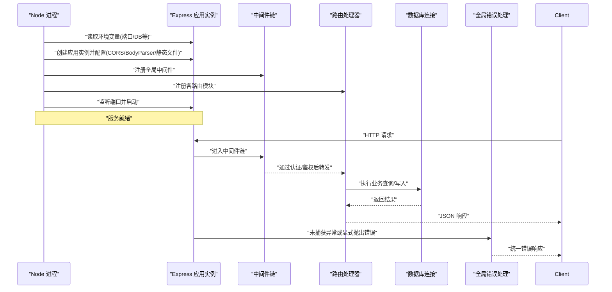
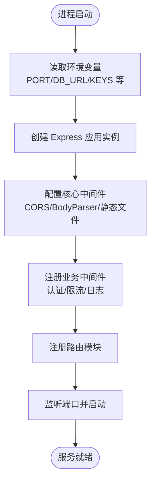
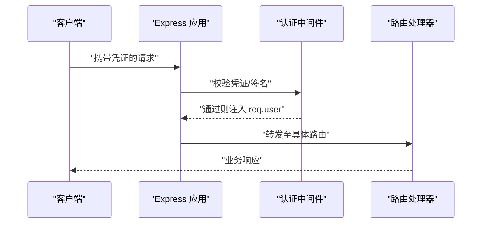
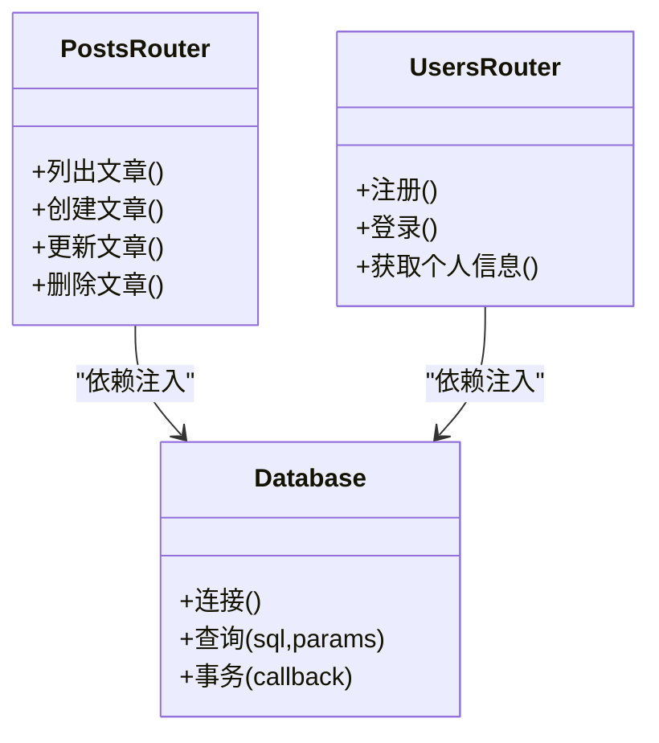
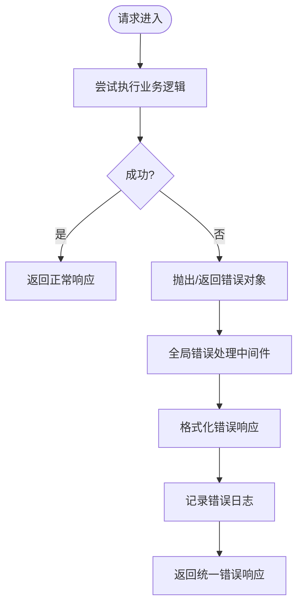
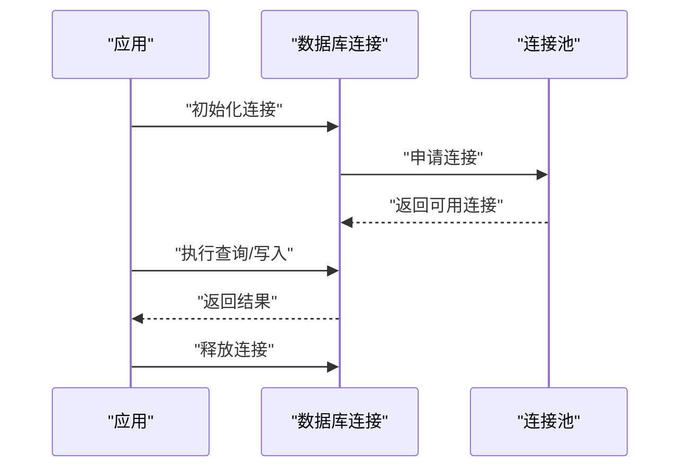
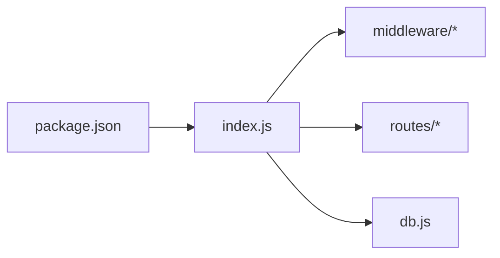

# Express服务器架构

<cite>
**本文引用的文件**   
- [server/src/index.js](file://server/src/index.js)
- [server/package.json](file://server/package.json)
- [server/src/middleware/auth.js](file://server/src/middleware/auth.js)
- [server/src/routes/posts.js](file://server/src/routes/posts.js)
- [server/src/routes/users.js](file://server/src/routes/users.js)
- [server/src/db.js](file://server/src/db.js)
</cite>

## 目录
1. [简介](#简介)
2. [项目结构](#项目结构)
3. [核心组件](#核心组件)
4. [架构总览](#架构总览)
5. [详细组件分析](#详细组件分析)
6. [依赖关系分析](#依赖关系分析)
7. [性能考虑](#性能考虑)
8. [故障排查指南](#故障排查指南)
9. [结论](#结论)
10. [附录](#附录)

## 简介
本文件面向基于 Node.js 与 Express 的后端服务，聚焦于服务器初始化、中间件注册、端口与环境变量管理、应用实例配置（CORS、请求体解析、静态资源）、模块化组织（路由加载与依赖注入）、错误处理机制以及性能优化建议。文档以代码级事实为依据，辅以可视化图示，帮助读者快速理解并扩展该 Express 服务。

## 项目结构
后端服务位于 server 目录，采用“按功能分层 + 模块化”的组织方式：
- 入口与启动：server/src/index.js
- 中间件：server/src/middleware/...
- 路由：server/src/routes/...
- 数据库连接与工具：server/src/db.js
- 依赖声明：server/package.json

图表来源
- [server/src/index.js](file://server/src/index.js)
- [server/src/middleware/auth.js](file://server/src/middleware/auth.js)
- [server/src/routes/posts.js](file://server/src/routes/posts.js)
- [server/src/routes/users.js](file://server/src/routes/users.js)
- [server/src/db.js](file://server/src/db.js)
- [server/package.json](file://server/package.json)

章节来源
- [server/src/index.js](file://server/src/index.js)
- [server/package.json](file://server/package.json)

## 核心组件
- 应用实例与生命周期
  - 创建 Express 应用实例，挂载全局中间件（如 CORS、请求体解析、日志等），注册路由，监听端口并输出启动信息。
  - 通过 process.env 读取端口与环境变量，支持开发/测试/生产环境差异化配置。
- 中间件体系
  - 认证中间件：校验请求身份（如 Token/Session），将用户上下文注入 req.user。
  - 其他通用中间件：CORS、请求体解析、安全头、速率限制等。
- 路由模块
  - 按领域拆分路由文件（posts、users 等），统一在入口集中注册，便于维护与权限控制。
- 数据访问层
  - 封装数据库连接与查询方法，提供事务、连接池等能力。
- 错误处理
  - 全局错误捕获中间件，统一错误响应格式与日志记录。

章节来源
- [server/src/index.js](file://server/src/index.js)
- [server/src/middleware/auth.js](file://server/src/middleware/auth.js)
- [server/src/routes/posts.js](file://server/src/routes/posts.js)
- [server/src/routes/users.js](file://server/src/routes/users.js)
- [server/src/db.js](file://server/src/db.js)

## 架构总览
下图展示从进程启动到请求处理的端到端流程，包括环境变量读取、应用实例创建、中间件链、路由分发与错误处理。

图表来源
- [server/src/index.js](file://server/src/index.js)
- [server/src/middleware/auth.js](file://server/src/middleware/auth.js)
- [server/src/routes/posts.js](file://server/src/routes/posts.js)
- [server/src/routes/users.js](file://server/src/routes/users.js)
- [server/src/db.js](file://server/src/db.js)

## 详细组件分析

### 应用实例与启动流程
- 环境变量与端口
  - 使用 process.env 获取端口、数据库连接串、密钥等；提供默认值以保证本地可运行。
- 应用实例创建与基础配置
  - 创建 Express 应用，启用 JSON/表单请求体解析、CORS、静态文件服务等。
- 中间件注册顺序
  - 先注册安全与通用中间件（CORS、Body Parser、日志、压缩等），再注册路由，最后注册错误处理中间件。
- 启动与优雅关闭
  - 监听端口并打印启动信息；可选地注册 SIGTERM/SIGINT 信号处理进行优雅关闭。

图表来源
- [server/src/index.js](file://server/src/index.js)

章节来源
- [server/src/index.js](file://server/src/index.js)

### 中间件注册机制
- 认证中间件
  - 校验请求头中的凭证（如 Authorization），验证通过后向 req 注入用户上下文，供后续路由使用。
- 通用中间件
  - CORS：允许跨域访问，可按域名白名单精细化控制。
  - Body Parser：解析 application/json 与 application/x-www-form-urlencoded。
  - 安全与日志：设置安全响应头、记录请求日志与耗时。
- 中间件执行顺序
  - 遵循“先注册先执行”，错误处理中间件需放在所有路由之后。

图表来源
- [server/src/middleware/auth.js](file://server/src/middleware/auth.js)
- [server/src/index.js](file://server/src/index.js)

章节来源
- [server/src/middleware/auth.js](file://server/src/middleware/auth.js)
- [server/src/index.js](file://server/src/index.js)

### 路由模块与依赖注入
- 路由组织
  - 按领域划分路由文件（如 posts、users），每个模块导出 express.Router 实例，并在入口集中注册。
- 依赖注入模式
  - 将数据库连接、配置对象、第三方客户端等作为参数注入到路由或控制器中，避免全局耦合，提升可测试性。
- 示例路径
  - 文章相关路由：[server/src/routes/posts.js](file://server/src/routes/posts.js)
  - 用户相关路由：[server/src/routes/users.js](file://server/src/routes/users.js)

图表来源
- [server/src/routes/posts.js](file://server/src/routes/posts.js)
- [server/src/routes/users.js](file://server/src/routes/users.js)
- [server/src/db.js](file://server/src/db.js)

章节来源
- [server/src/routes/posts.js](file://server/src/routes/posts.js)
- [server/src/routes/users.js](file://server/src/routes/users.js)
- [server/src/db.js](file://server/src/db.js)

### 错误处理机制
- 全局错误捕获
  - 注册一个接收四个参数的错误处理中间件，用于捕获同步/异步抛出的错误，并返回统一格式。
- 自定义错误类
  - 定义业务错误类型（如参数错误、权限不足、资源不存在），携带状态码与消息，便于上层统一处理。
- 错误响应格式
  - 统一包含 code、message、data 等字段，便于前端一致化处理。
- 未捕获异常
  - 监听 uncaughtException/unhandledRejection，记录日志并触发优雅退出。

图表来源
- [server/src/index.js](file://server/src/index.js)

章节来源
- [server/src/index.js](file://server/src/index.js)

### 数据库连接与连接池
- 连接管理
  - 在 db.js 中建立连接，复用连接对象，避免重复创建带来的开销。
- 连接池配置
  - 根据负载调整最大/最小连接数、超时时间、空闲回收策略等。
- 事务与重试
  - 对写操作提供事务封装，必要时实现幂等与重试策略。

图表来源
- [server/src/db.js](file://server/src/db.js)

章节来源
- [server/src/db.js](file://server/src/db.js)

## 依赖关系分析
- 运行时依赖
  - Express、CORS、Body Parser、数据库驱动、日志库等，均在 package.json 中声明。
- 模块内聚与耦合
  - 路由与中间件通过依赖注入解耦，降低与数据库和配置的直接耦合度。
- 外部集成点
  - 数据库、缓存、对象存储、第三方认证等通过抽象接口接入，便于替换与测试。

图表来源
- [server/package.json](file://server/package.json)
- [server/src/index.js](file://server/src/index.js)

章节来源
- [server/package.json](file://server/package.json)
- [server/src/index.js](file://server/src/index.js)

## 性能考虑
- 连接池与数据库
  - 合理设置最大/最小连接数、连接超时、空闲回收；对热点查询增加索引与缓存。
- 内存管理
  - 避免闭包持有大对象引用；及时释放临时 Buffer；监控堆内存增长。
- 并发与线程模型
  - 利用多进程/集群部署（如 PM2）提升吞吐；注意共享状态与锁。
- 网络与传输
  - 启用 Gzip/Brotli 压缩；合理设置 Keep-Alive 与超时；使用 HTTP/2。
- 监控与指标
  - 暴露健康检查与指标端点（QPS、延迟分位、错误率、GC 次数、句柄数）。
- 缓存策略
  - 多级缓存（内存/Redis/CDN）；缓存失效与一致性策略。
- 限流与熔断
  - 针对敏感接口实施限流、熔断与降级，保护系统稳定性。

[本节为通用指导，不直接分析具体文件]

## 故障排查指南
- 常见问题定位
  - 端口占用：检查 PORT 环境变量与进程占用情况。
  - 跨域失败：核对 CORS 配置与请求头。
  - 请求体解析失败：确认 Content-Type 与 Body Parser 配置。
  - 数据库连接失败：检查连接串、网络与凭据。
- 日志与追踪
  - 结构化日志记录关键上下文（请求ID、用户ID、耗时、错误栈）。
  - 结合分布式追踪 ID 串联前后端链路。
- 错误响应规范
  - 统一错误码与消息，便于前端提示与自动化测试断言。

章节来源
- [server/src/index.js](file://server/src/index.js)

## 结论
该 Express 服务以清晰的模块化与依赖注入为核心，配合统一的中间件链与错误处理机制，具备良好的可扩展性与可维护性。在生产环境中，应重点关注连接池、内存与监控指标，结合限流与熔断策略保障稳定性与可用性。

## 附录
- 环境变量清单（示例）
  - PORT：服务监听端口
  - DB_URL：数据库连接串
  - JWT_SECRET：JWT 密钥
  - CORS_ORIGIN：允许的跨域来源
- 常用命令
  - 安装依赖、启动服务、构建与测试等，详见 package.json 的 scripts。

章节来源
- [server/package.json](file://server/package.json)