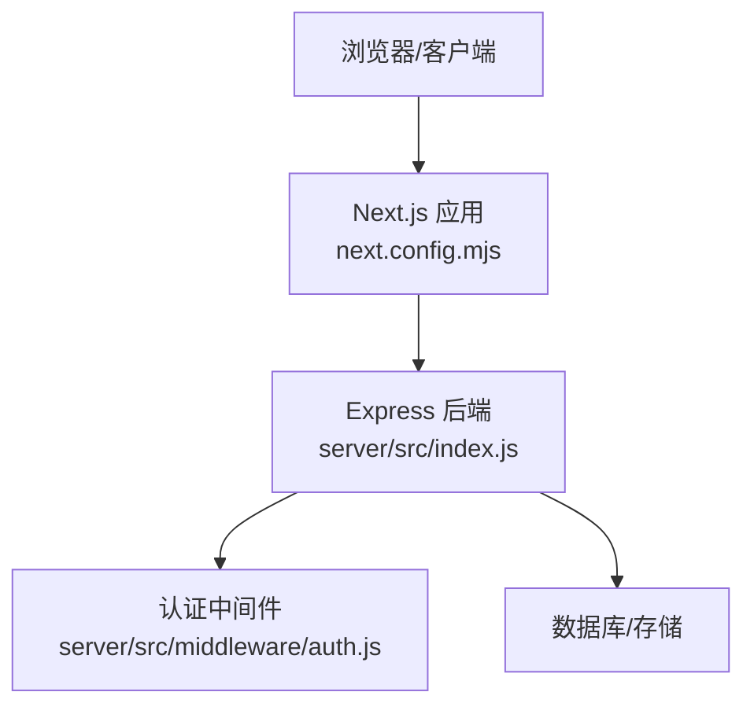
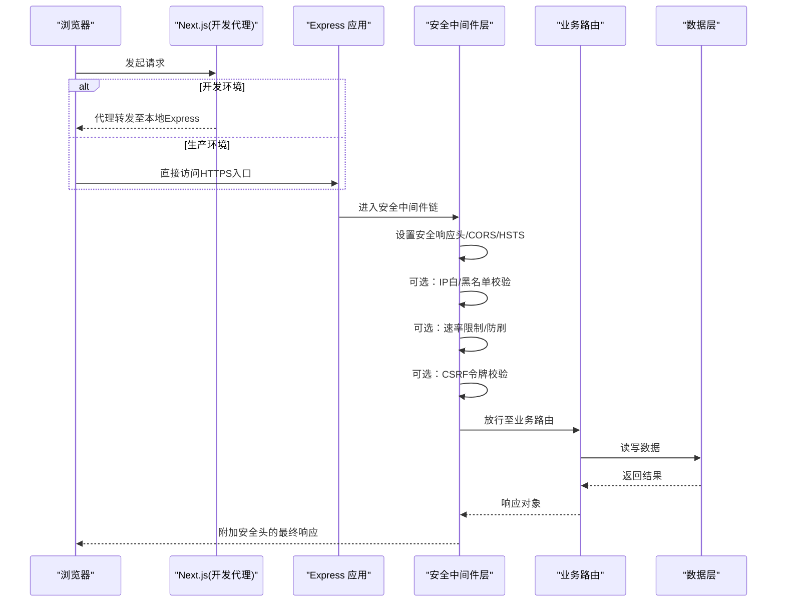
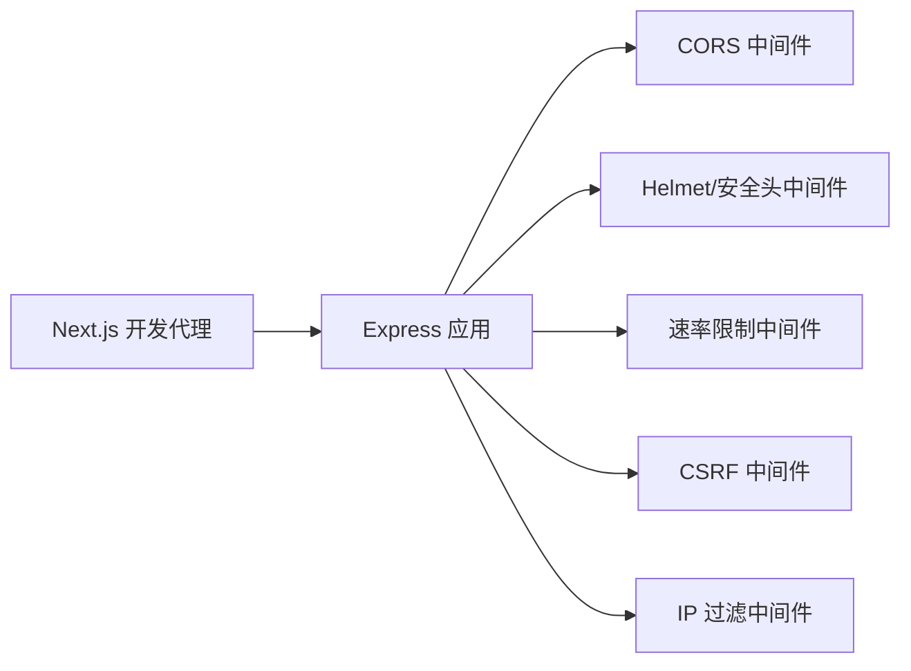

# CORS与安全中间件

<cite>
**本文引用的文件**   
- [server/src/index.js](file://server/src/index.js)
- [server/src/middleware/auth.js](file://server/src/middleware/auth.js)
- [server/package.json](file://server/package.json)
- [next.config.mjs](file://next.config.mjs)
</cite>

## 目录
1. [简介](#简介)
2. [项目结构](#项目结构)
3. [核心组件](#核心组件)
4. [架构总览](#架构总览)
5. [详细组件分析](#详细组件分析)
6. [依赖分析](#依赖分析)
7. [性能考虑](#性能考虑)
8. [故障排查指南](#故障排查指南)
9. [结论](#结论)
10. [附录](#附录)

## 简介
本文件聚焦于后端服务的安全与跨域能力，围绕以下目标展开：
- 跨域资源共享（CORS）配置：允许的域名、方法与请求头。
- 安全响应头：Content-Security-Policy、X-Frame-Options、HSTS等。
- HTTPS强制重定向与SSL证书配置。
- CSRF防护：令牌验证与同源检查。
- 速率限制与防刷保护。
- IP白名单/黑名单策略。
- 安全审计与漏洞扫描集成方法。

说明：当前仓库未包含现成的CORS与安全中间件实现。本节提供基于现有Node.js Express后端的落地方案与集成步骤，并给出与前端Next.js的协作要点。

## 项目结构
后端位于 server 目录，使用Express作为HTTP服务器；前端为Next.js应用，通过API客户端访问后端接口。

图表来源
- [server/src/index.js](file://server/src/index.js)
- [server/src/middleware/auth.js](file://server/src/middleware/auth.js)
- [next.config.mjs](file://next.config.mjs)

章节来源
- [server/src/index.js](file://server/src/index.js)
- [server/src/middleware/auth.js](file://server/src/middleware/auth.js)
- [next.config.mjs](file://next.config.mjs)

## 核心组件
- Express应用入口：负责挂载全局中间件、路由与错误处理。
- 认证中间件：用于鉴权与权限控制，可作为CSRF校验、IP过滤等扩展点。
- 前端代理与开发期CORS：由Next.js在开发环境提供代理与CORS支持。

章节来源
- [server/src/index.js](file://server/src/index.js)
- [server/src/middleware/auth.js](file://server/src/middleware/auth.js)
- [next.config.mjs](file://next.config.mjs)

## 架构总览
下图展示从浏览器到Express的完整请求链路，以及建议引入的安全中间件位置。

图表来源
- [server/src/index.js](file://server/src/index.js)
- [server/src/middleware/auth.js](file://server/src/middleware/auth.js)
- [next.config.mjs](file://next.config.mjs)

## 详细组件分析

### 1) CORS中间件配置
目标：精确控制允许的来源、方法与头部，避免过度开放。

- 允许的域名
  - 仅允许可信的前端域名，建议使用环境变量管理。
  - 生产环境严格匹配，开发环境可放宽但需明确范围。
- 允许的方法
  - 仅暴露必要的HTTP方法（如GET、POST、PUT、DELETE）。
- 允许的请求头
  - 仅声明业务所需的自定义Header，避免携带敏感信息。
- 凭证与预检
  - 若需要携带Cookie或Authorization，启用凭证模式。
  - 预检请求（OPTIONS）应快速返回并缓存策略合理。

参考实现位置
- 在Express入口中注册CORS中间件，并在路由前生效。
- 将域名与方法列表集中配置，便于统一维护。

章节来源
- [server/src/index.js](file://server/src/index.js)

### 2) 安全响应头设置
目标：通过标准响应头降低常见Web攻击面。

- Content-Security-Policy（CSP）
  - 定义资源加载策略，限制脚本、样式、图片等来源。
  - 对内联脚本与eval进行严格限制。
- X-Frame-Options / Frame-Options
  - 防止点击劫持，禁止或限制页面被嵌入iframe。
- HSTS（Strict-Transport-Security）
  - 强制浏览器使用HTTPS访问，提升传输安全。
- 其他建议
  - X-Content-Type-Options: nosniff
  - Referrer-Policy: strict-origin-when-cross-origin
  - Permissions-Policy: 限制浏览器特性使用

参考实现位置
- 在Express入口或通用中间件中统一设置响应头。

章节来源
- [server/src/index.js](file://server/src/index.js)

### 3) HTTPS强制重定向与SSL证书配置
目标：确保所有流量走加密通道，杜绝明文传输。

- 强制HTTPS重定向
  - 在非HTTPS请求到达时，返回301重定向到https版本。
- SSL证书配置
  - 使用受信任CA签发的证书，配置私钥与证书路径。
  - 推荐启用TLSv1.2及以上，禁用不安全协议与弱密码套件。
- 反向代理部署
  - 可在Nginx/Traefik等反向代理处终止TLS，并将请求转发给Express。

参考实现位置
- 在Express入口中增加HTTPS监听与重定向逻辑。

章节来源
- [server/src/index.js](file://server/src/index.js)

### 4) CSRF防护（令牌验证与同源检查）
目标：防止跨站请求伪造攻击，保障状态变更操作的安全性。

- 令牌生成与校验
  - 服务端生成一次性CSRF令牌，随表单或响应返回。
  - 提交时校验令牌与用户会话的一致性。
- 同源检查
  - 校验Referer或Origin，确保请求来自可信来源。
- 适用场景
  - 对写操作（POST/PUT/DELETE/PATCH）强制开启CSRF校验。
  - 纯读接口（GET）可不强制，但仍建议配合其他防护。

参考实现位置
- 在认证中间件或专用CSRF中间件中实现令牌校验逻辑。

章节来源
- [server/src/middleware/auth.js](file://server/src/middleware/auth.js)

### 5) 速率限制与防刷保护
目标：限制单位时间内的请求次数，抵御暴力破解与滥用。

- 按IP限流
  - 针对登录、注册、重置密码等敏感接口设置更严格的阈值。
- 按用户限流
  - 结合会话或Token对用户维度进行限速。
- 滑动窗口与固定窗口
  - 推荐使用滑动窗口算法减少边界抖动。
- 响应策略
  - 超限返回429，并附带重试间隔提示。

参考实现位置
- 在Express入口或通用中间件层注册限流器，并对关键路由单独配置。

章节来源
- [server/src/index.js](file://server/src/index.js)

### 6) IP白名单与黑名单
目标：基于来源IP进行访问控制，增强边界防护。

- 白名单
  - 仅允许特定网段或IP访问管理接口或内部API。
- 黑名单
  - 拦截已知恶意IP或异常来源。
- 动态更新
  - 支持热更新规则，无需重启服务。
- 代理场景
  - 当存在反向代理时，正确读取真实客户端IP。

参考实现位置
- 在通用中间件层实现IP过滤逻辑，优先于业务路由执行。

章节来源
- [server/src/index.js](file://server/src/index.js)

### 7) 安全审计与漏洞扫描集成
目标：在开发与发布流程中持续发现安全问题。

- 依赖漏洞扫描
  - 在CI中加入npm/yarn安全审计命令，阻断高危漏洞合并。
- 代码静态分析
  - 集成SAST工具，检测注入、硬编码密钥等问题。
- 运行时防护
  - 结合WAF与日志审计，记录异常访问与告警。
- 合规与基线
  - 定期复核安全头、TLS配置与最小权限原则。

参考实现位置
- 在后端构建与部署脚本中集成安全扫描任务。

章节来源
- [server/package.json](file://server/package.json)

## 依赖分析
- Express生态
  - 可通过第三方库实现CORS、限流、Helmet等安全能力。
- 前端代理
  - 开发环境下Next.js提供代理与CORS支持，便于前后端联调。

图表来源
- [server/src/index.js](file://server/src/index.js)
- [next.config.mjs](file://next.config.mjs)

章节来源
- [server/src/index.js](file://server/src/index.js)
- [server/package.json](file://server/package.json)
- [next.config.mjs](file://next.config.mjs)

## 性能考虑
- 中间件顺序
  - 将轻量级中间件（如IP过滤、限流）置于前面，尽早拒绝非法请求。
- 缓存策略
  - 对CORS预检响应设置合理的Cache-Control，减少重复预检开销。
- 限流粒度
  - 按接口维度差异化配置阈值，避免误伤正常流量。
- TLS开销
  - 在生产环境使用硬件加速或反向代理卸载TLS，减轻应用服务器压力。

## 故障排查指南
- 跨域失败
  - 检查Access-Control-Allow-Origin是否包含实际来源。
  - 确认是否启用了凭证模式且后端允许携带Cookie。
- 安全头缺失
  - 确认中间件已注册且未被后续逻辑覆盖。
- HTTPS无法访问
  - 检查证书路径、端口占用与防火墙规则。
- 429过多
  - 调整限流阈值或扩大白名单，关注异常来源IP。
- CSRF校验失败
  - 核对令牌传递方式（Header或表单字段）与来源校验策略。

## 结论
通过系统化的CORS配置、安全响应头、HTTPS强制、CSRF防护、速率限制与IP过滤，可以显著提升后端服务的安全性与可用性。建议在CI/CD中集成安全审计与漏洞扫描，形成持续改进的安全闭环。

## 附录

### 实施清单（建议）
- 在Express入口注册以下中间件（按顺序）
  - 安全响应头（CSP、X-Frame-Options、HSTS等）
  - CORS（精确白名单来源、方法与头部）
  - IP白/黑名单
  - 速率限制（按IP/用户/接口）
  - CSRF校验（写操作强制）
  - 认证与授权
- 在Next.js开发配置中启用代理与必要CORS
- 在生产环境启用HTTPS并配置受信任证书
- 在CI中集成依赖安全审计与静态分析

章节来源
- [server/src/index.js](file://server/src/index.js)
- [server/src/middleware/auth.js](file://server/src/middleware/auth.js)
- [next.config.mjs](file://next.config.mjs)
- [server/package.json](file://server/package.json)