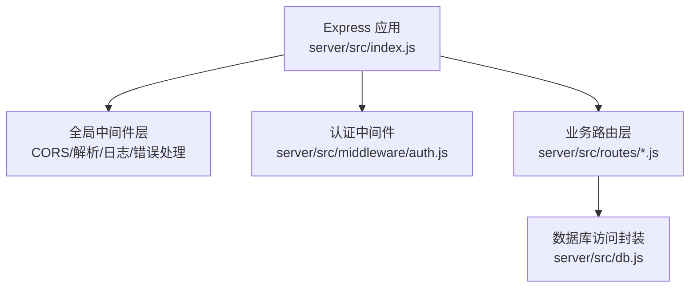
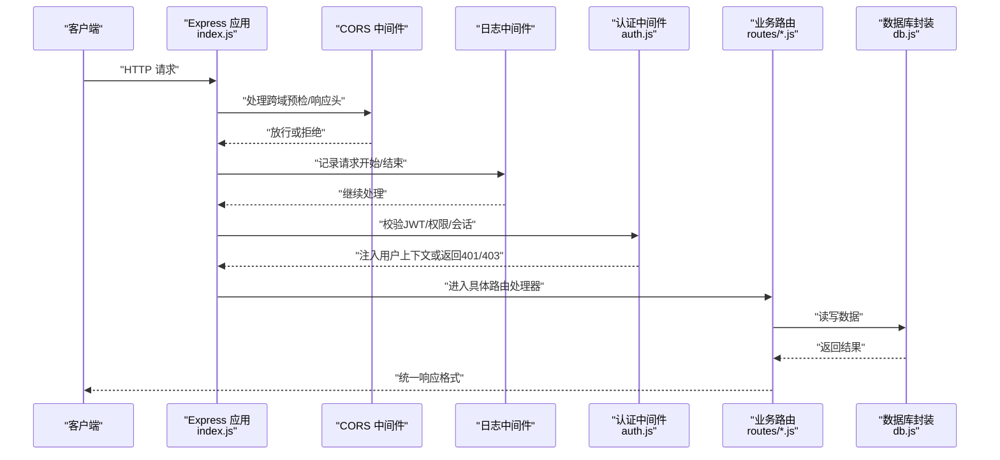
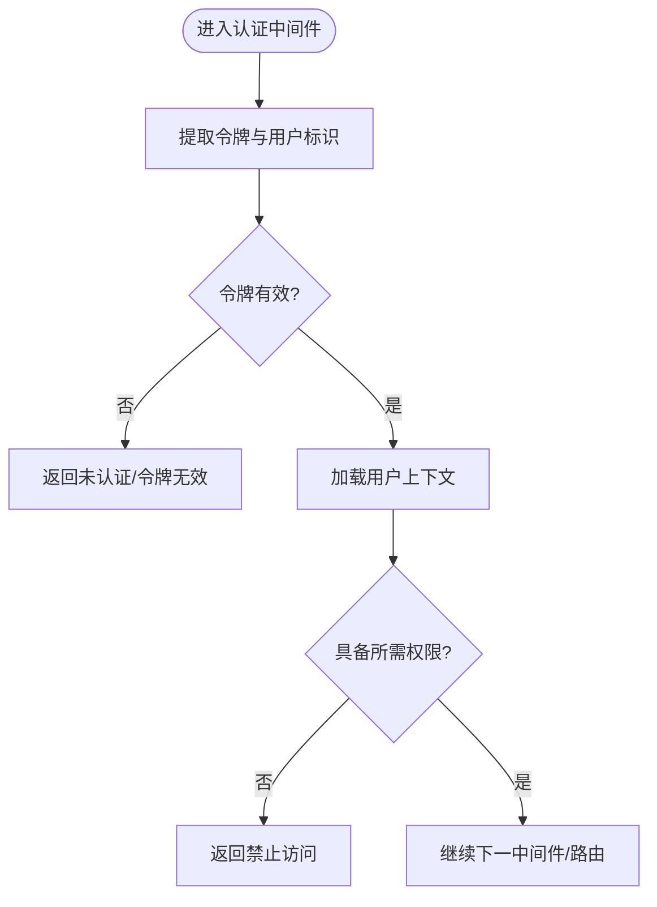
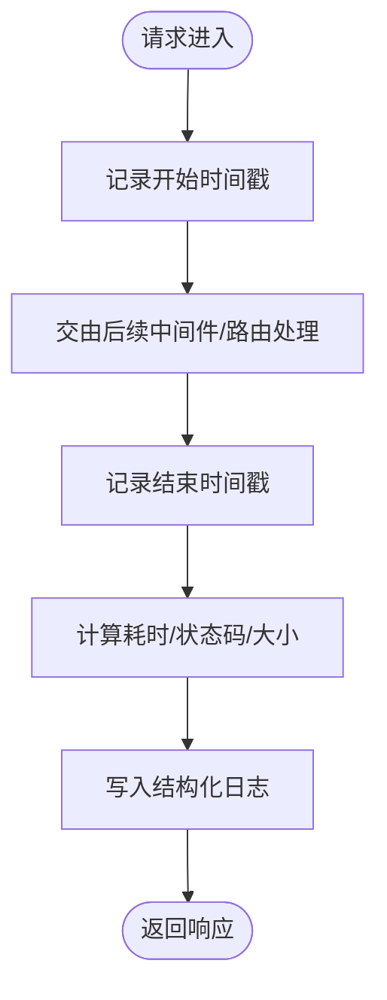
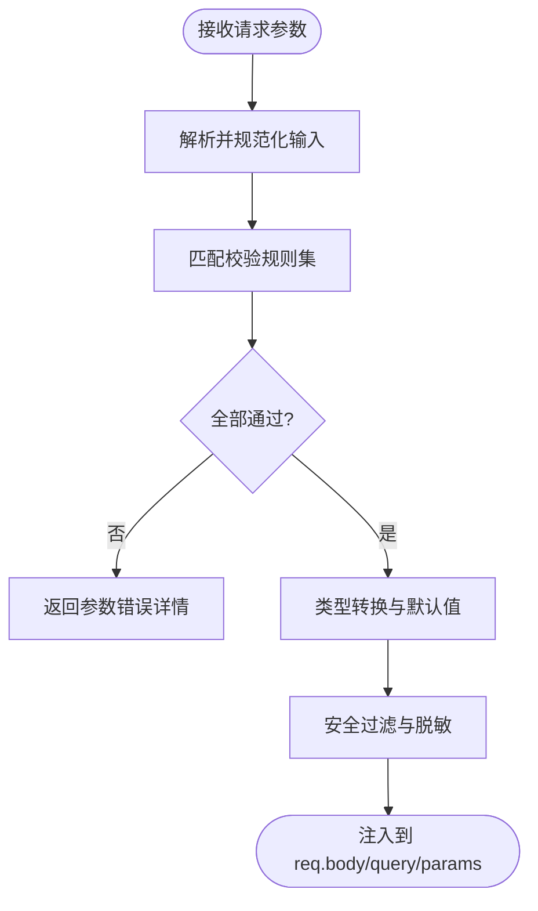
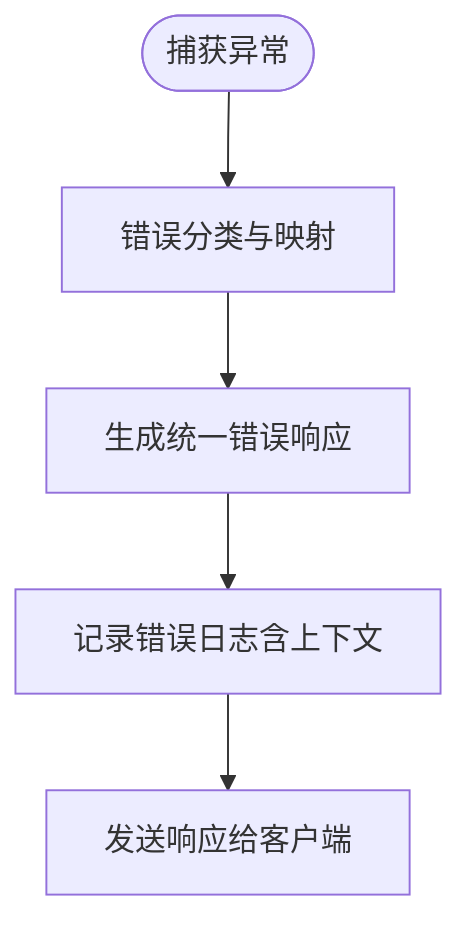
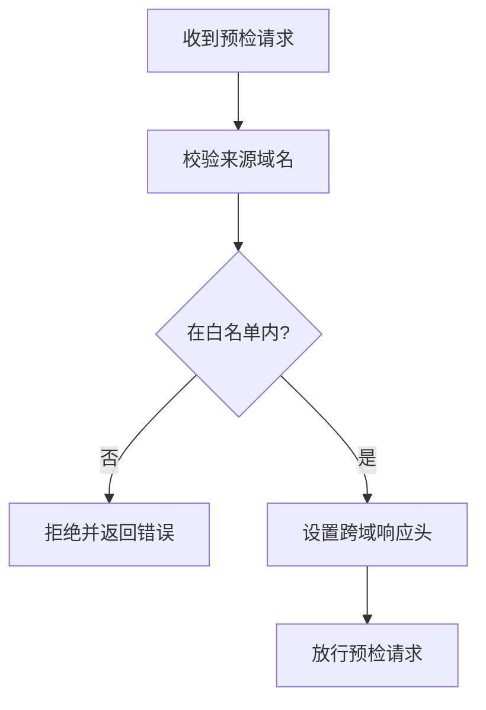
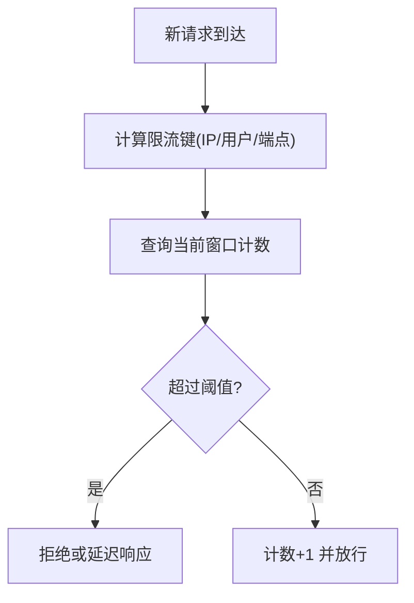
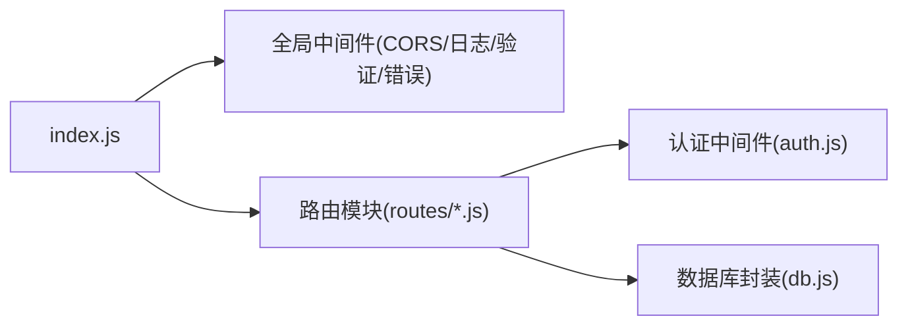

# 中间件系统

<cite>
**本文引用的文件**   
- [server/src/index.js](file://server/src/index.js)
- [server/src/middleware/auth.js](file://server/src/middleware/auth.js)
- [server/src/routes/auth.js](file://server/src/routes/auth.js)
- [server/src/routes/posts.js](file://server/src/routes/posts.js)
- [server/src/db.js](file://server/src/db.js)
</cite>

## 目录
1. [简介](#简介)
2. [项目结构](#项目结构)
3. [核心组件](#核心组件)
4. [架构总览](#架构总览)
5. [详细组件分析](#详细组件分析)
6. [依赖关系分析](#依赖关系分析)
7. [性能考量](#性能考量)
8. [故障排查指南](#故障排查指南)
9. [结论](#结论)
10. [附录](#附录)

## 简介
本文件聚焦于后端 Express 中间件系统的设计与实现，围绕认证、日志、输入验证、错误处理、CORS、速率限制等关键能力进行系统化说明。文档以“从概念到落地”的方式展开：先给出整体架构与数据流，再深入到各中间件的职责边界、调用顺序、异常路径与扩展点，最后提供开发指南与测试方法，帮助读者快速理解并安全地扩展中间件体系。

## 项目结构
后端服务位于 server 目录，入口为 server/src/index.js，负责初始化 Express 应用、挂载全局中间件与路由；认证相关逻辑集中在 server/src/middleware/auth.js，并在路由中按需使用。数据库访问通过 server/src/db.js 暴露的封装对象完成。

图表来源
- [server/src/index.js](file://server/src/index.js)
- [server/src/middleware/auth.js](file://server/src/middleware/auth.js)
- [server/src/routes/posts.js](file://server/src/routes/posts.js)
- [server/src/db.js](file://server/src/db.js)

章节来源
- [server/src/index.js](file://server/src/index.js)
- [server/src/middleware/auth.js](file://server/src/middleware/auth.js)
- [server/src/routes/posts.js](file://server/src/routes/posts.js)
- [server/src/db.js](file://server/src/db.js)

## 核心组件
- 认证中间件：基于 JWT 的令牌校验、用户上下文注入与权限检查，支持会话式状态（如登录态）管理。
- 日志记录中间件：统一采集请求日志、错误日志与性能指标（耗时、状态码、客户端信息等）。
- 输入验证中间件：对查询参数、路径参数、请求体进行类型校验、默认值填充与安全过滤。
- 错误处理中间件：集中捕获未处理异常，分类错误并返回统一响应格式。
- CORS 中间件：配置跨域策略、白名单与凭据策略。
- 速率限制中间件：按 IP/用户维度控制请求频率，防止滥用与刷接口。

章节来源
- [server/src/middleware/auth.js](file://server/src/middleware/auth.js)
- [server/src/index.js](file://server/src/index.js)

## 架构总览
下图展示了典型请求在 Express 管道中的流转过程，以及中间件之间的协作关系。

图表来源
- [server/src/index.js](file://server/src/index.js)
- [server/src/middleware/auth.js](file://server/src/middleware/auth.js)
- [server/src/routes/posts.js](file://server/src/routes/posts.js)
- [server/src/db.js](file://server/src/db.js)

## 详细组件分析

### 认证中间件（JWT + 权限 + 会话）
- 设计要点
  - 从请求头提取令牌并进行签名校验，失败则中断流程返回未认证错误。
  - 将解析后的用户信息挂载到请求上下文，供后续路由与中间件使用。
  - 根据角色或资源规则执行权限检查，不满足则返回禁止访问错误。
  - 可选：维护会话状态（如刷新令牌、黑名单），用于登出与失效控制。
- 典型调用链
  - 受保护路由在进入处理器前，先经过认证中间件完成鉴权。
- 异常与边界
  - 令牌缺失、过期、签名无效、用户不存在等情况应明确区分并返回相应状态码。
  - 权限不足时返回明确的资源级错误，避免泄露内部实现细节。

图表来源
- [server/src/middleware/auth.js](file://server/src/middleware/auth.js)
- [server/src/routes/auth.js](file://server/src/routes/auth.js)
- [server/src/routes/posts.js](file://server/src/routes/posts.js)

章节来源
- [server/src/middleware/auth.js](file://server/src/middleware/auth.js)
- [server/src/routes/auth.js](file://server/src/routes/auth.js)
- [server/src/routes/posts.js](file://server/src/routes/posts.js)

### 日志记录中间件（请求日志、错误日志、性能监控）
- 设计要点
  - 请求进入时记录时间戳、方法、URL、客户端IP、UA 等元信息。
  - 请求结束时记录状态码、耗时、响应大小等指标。
  - 捕获并记录异常堆栈，便于定位问题。
  - 输出结构化日志，便于接入日志平台与告警。
- 性能监控
  - 统计关键接口的 P50/P95/P99 耗时，识别慢请求。
  - 结合状态码分布与错误率，评估稳定性。

图表来源
- [server/src/index.js](file://server/src/index.js)

章节来源
- [server/src/index.js](file://server/src/index.js)

### 输入验证中间件（参数校验、类型转换、安全过滤）
- 设计要点
  - 对 query、params、body 分别定义校验规则（必填、类型、范围、正则等）。
  - 自动进行类型转换（字符串转数字/布尔/日期等）与默认值填充。
  - 安全过滤：去除危险字符、限制长度、白名单枚举校验。
  - 校验失败返回统一的参数错误响应，包含字段级错误提示。
- 最佳实践
  - 将校验规则与路由解耦，复用性强。
  - 对敏感字段做二次清洗，避免注入风险。

图表来源
- [server/src/index.js](file://server/src/index.js)

章节来源
- [server/src/index.js](file://server/src/index.js)

### 错误处理中间件（异常捕获、错误分类、统一响应）
- 设计要点
  - 捕获同步与异步异常，避免进程崩溃。
  - 错误分类：业务错误、参数错误、认证/授权错误、系统错误等。
  - 统一响应格式：包含状态码、错误码、消息、追踪ID等。
  - 生产环境隐藏敏感堆栈，仅记录到服务端日志。
- 响应规范
  - 成功：标准数据体
  - 失败：标准错误体，含可机读的错误码与人类可读的消息

图表来源
- [server/src/index.js](file://server/src/index.js)

章节来源
- [server/src/index.js](file://server/src/index.js)

### CORS 中间件（跨域策略与安全设置）
- 设计要点
  - 允许的来源域名白名单、允许的 HTTP 方法与头部。
  - 是否允许携带凭据（Cookie/Authorization）。
  - 预检请求缓存时长与最大年龄。
- 安全建议
  - 严格限定 allowedOrigins，避免使用通配符。
  - 谨慎开启 allowCredentials，配合严格的源校验。

图表来源
- [server/src/index.js](file://server/src/index.js)

章节来源
- [server/src/index.js](file://server/src/index.js)

### 速率限制中间件（请求频率控制与防刷）
- 设计要点
  - 限流维度：IP、用户ID、API 端点组合。
  - 窗口算法：固定窗口或滑动窗口，支持令牌桶/漏桶。
  - 超限策略：延迟、排队或直接拒绝，并返回标准错误码。
  - 存储后端：内存或 Redis，保证多实例一致性。
- 防刷建议
  - 针对敏感接口（登录、注册、重置密码）更严格的阈值。
  - 结合验证码或人机校验提升安全性。

图表来源
- [server/src/index.js](file://server/src/index.js)

章节来源
- [server/src/index.js](file://server/src/index.js)

## 依赖关系分析
- 入口与应用装配
  - index.js 负责创建 Express 实例、挂载全局中间件、注册路由与错误处理。
- 认证与路由
  - routes/auth.js 提供登录/登出/刷新等认证相关接口；受保护路由（如 posts.js）在需要时引入认证中间件。
- 数据访问
  - db.js 提供数据库连接与常用操作封装，被路由层调用。

图表来源
- [server/src/index.js](file://server/src/index.js)
- [server/src/middleware/auth.js](file://server/src/middleware/auth.js)
- [server/src/routes/auth.js](file://server/src/routes/auth.js)
- [server/src/routes/posts.js](file://server/src/routes/posts.js)
- [server/src/db.js](file://server/src/db.js)

章节来源
- [server/src/index.js](file://server/src/index.js)
- [server/src/middleware/auth.js](file://server/src/middleware/auth.js)
- [server/src/routes/auth.js](file://server/src/routes/auth.js)
- [server/src/routes/posts.js](file://server/src/routes/posts.js)
- [server/src/db.js](file://server/src/db.js)

## 性能考量
- 中间件顺序优化
  - 将无副作用且快速的中间件前置（如 CORS、静态资源），减少不必要的处理。
  - 认证与权限检查尽量短路，避免进入深层业务逻辑。
- 日志采样与异步化
  - 高吞吐场景下采用采样日志与异步落盘，降低 I/O 影响。
- 限流与缓存
  - 热点接口增加缓存层；限流使用高效数据结构与分布式存储。
- 错误快速失败
  - 尽早返回错误，缩短请求链路，降低资源占用。

[本节为通用指导，无需代码引用]

## 故障排查指南
- 常见问题定位
  - 401/403：检查令牌签发与校验逻辑、权限规则与上下文注入是否正确。
  - 400：查看输入验证中间件的错误明细，确认字段名与类型。
  - 5xx：查看错误处理中间件记录的堆栈与上下文，定位数据库或第三方依赖异常。
- 诊断手段
  - 启用调试日志，关注请求 ID 与耗时。
  - 复现最小用例，逐步关闭中间件定位问题。
  - 对比正常与异常请求的差异（来源、头部、负载）。

章节来源
- [server/src/index.js](file://server/src/index.js)
- [server/src/middleware/auth.js](file://server/src/middleware/auth.js)

## 结论
本中间件体系以“职责单一、可组合、可观测”为核心原则，围绕认证、日志、验证、错误、CORS、限流六大能力构建。通过清晰的调用顺序与统一响应格式，既保证了安全性与稳定性，也提升了可维护性与可扩展性。建议在新增功能时遵循现有模式，优先完善校验与错误处理，确保可观测与可回滚。

[本节为总结性内容，无需代码引用]

## 附录

### 中间件开发指南（最佳实践）
- 设计原则
  - 单一职责：每个中间件只做一件事，保持短小精悍。
  - 幂等与可重试：避免副作用，必要时提供幂等键。
  - 可配置：通过环境变量或配置文件注入策略。
- 开发步骤
  - 定义输入/输出契约与错误码。
  - 编写单元测试覆盖正常与异常分支。
  - 集成端到端测试验证完整链路。
- 测试方法
  - 单测：模拟 req/res，断言 next 调用与响应。
  - 集成：启动本地服务，使用 HTTP 客户端发起真实请求。
  - 压测：验证限流与性能指标达标。

[本节为通用指导，无需代码引用]