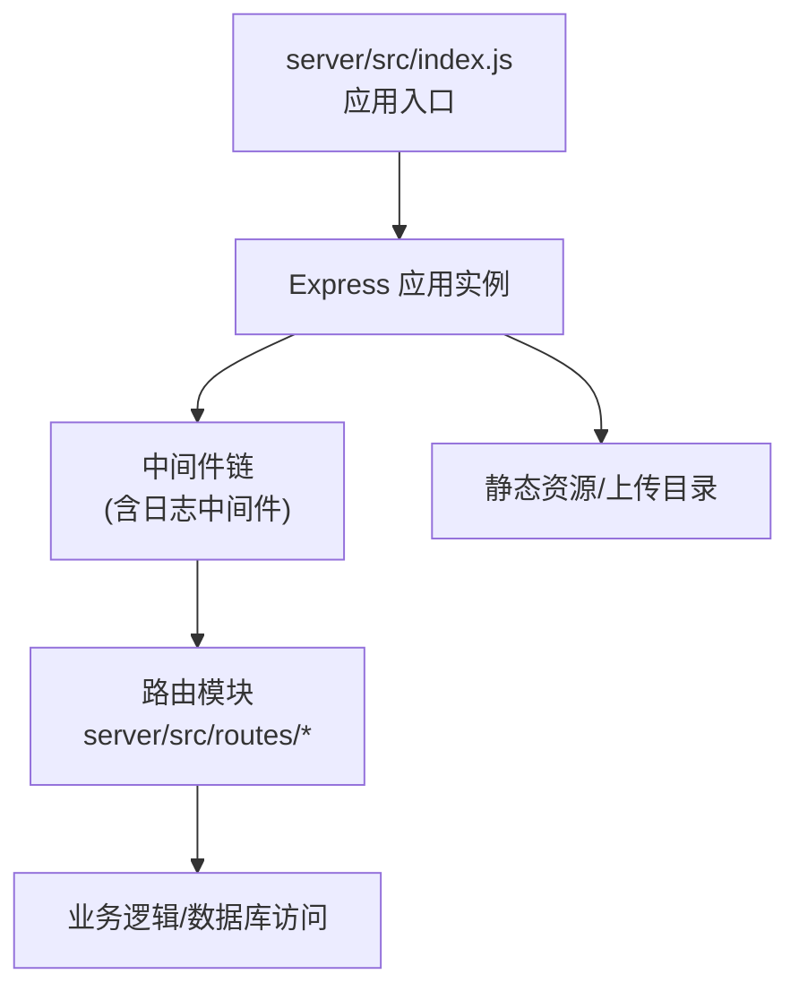
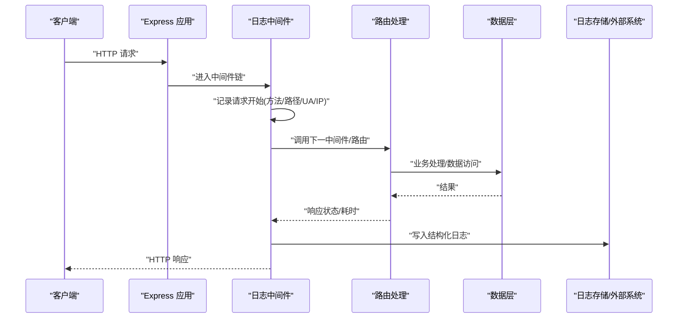
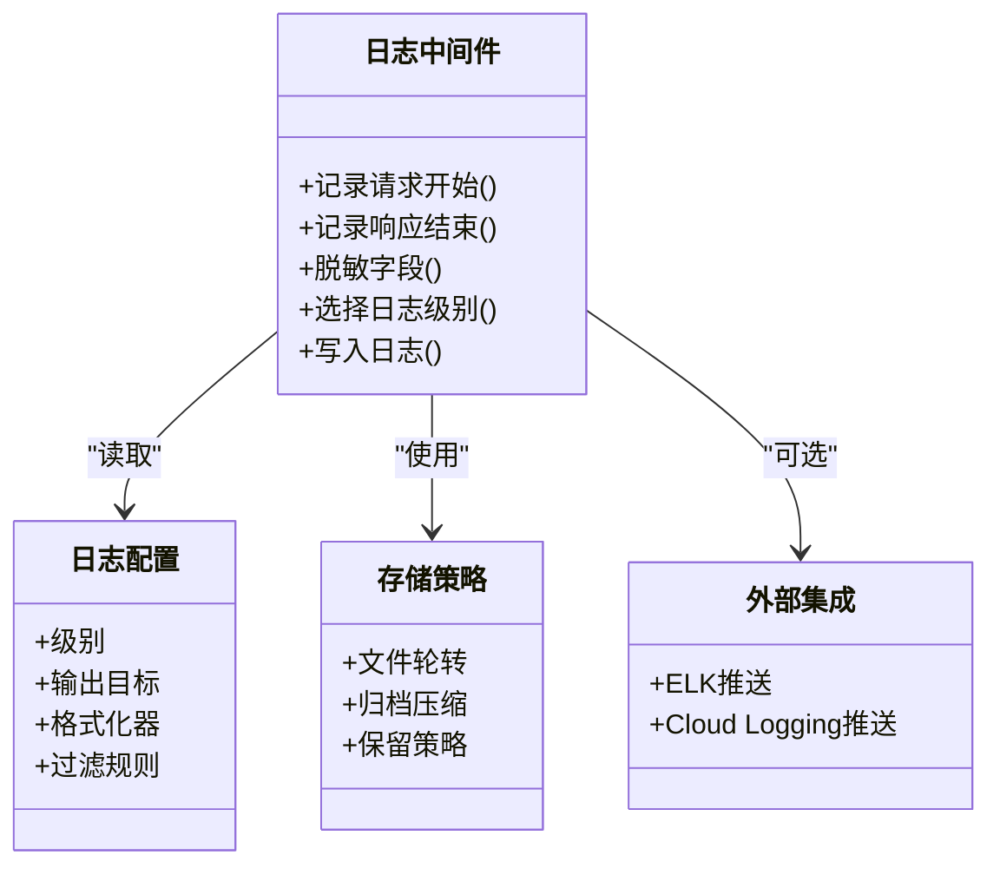
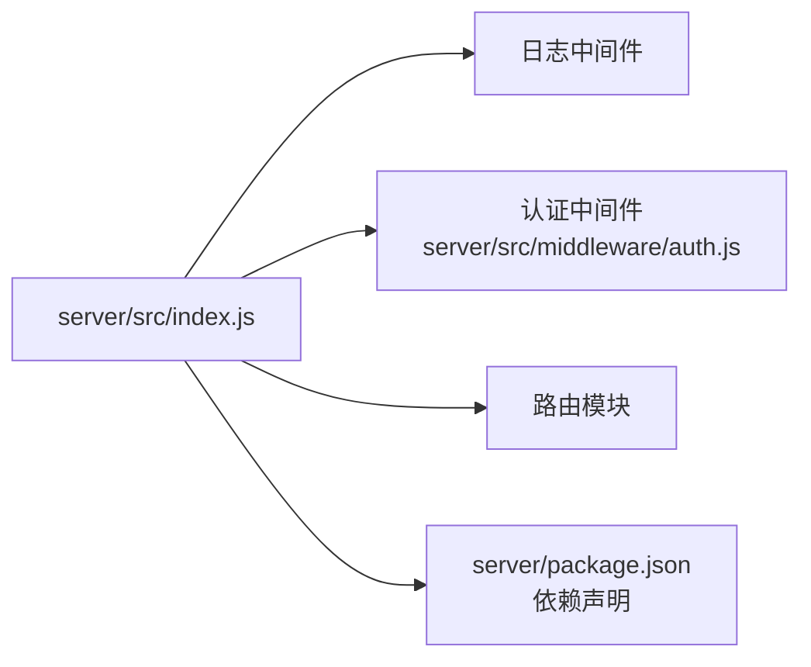

# 日志记录中间件

<cite>
**本文引用的文件**   
- [server/src/index.js](file://server/src/index.js)
- [server/src/middleware/auth.js](file://server/src/middleware/auth.js)
- [server/package.json](file://server/package.json)
</cite>

## 目录
1. [简介](#简介)
2. [项目结构](#项目结构)
3. [核心组件](#核心组件)
4. [架构总览](#架构总览)
5. [详细组件分析](#详细组件分析)
6. [依赖分析](#依赖分析)
7. [性能考虑](#性能考虑)
8. [故障排查指南](#故障排查指南)
9. [结论](#结论)
10. [附录](#附录)

## 简介
本文件面向后端服务中的“请求日志收集与分析”能力，目标是：
- 设计统一的请求日志格式（包含请求信息、响应状态、执行时间、用户代理等关键字段）
- 定义日志级别（调试、信息、警告、错误）与输出策略
- 制定日志存储策略（文件轮转、归档、性能优化）
- 提供查询与分析工具的使用建议
- 明确敏感信息过滤与安全合规要求
- 给出集成第三方日志平台（如 ELK Stack、Cloud Logging）的指引

说明：当前仓库未包含现成的日志中间件实现。本文基于现有后端入口与中间件位置，给出可落地的设计与集成方案，便于后续在 server 层快速落地。

## 项目结构
后端代码位于 server 目录，关键路径如下：
- 应用入口：server/src/index.js
- 中间件目录：server/src/middleware/
- 路由目录：server/src/routes/
- 包管理：server/package.json

图表来源
- [server/src/index.js](file://server/src/index.js)
- [server/src/middleware/auth.js](file://server/src/middleware/auth.js)

章节来源
- [server/src/index.js](file://server/src/index.js)
- [server/src/middleware/auth.js](file://server/src/middleware/auth.js)
- [server/package.json](file://server/package.json)

## 核心组件
- 日志中间件：统一拦截 HTTP 请求与响应，采集必要字段并写入日志
- 日志配置：日志级别、输出目标（控制台/文件）、格式化规则
- 存储策略：文件轮转、归档压缩、保留策略
- 安全过滤：对敏感字段进行脱敏或丢弃
- 外部集成：可选将结构化日志推送至 ELK/Cloud Logging

章节来源
- [server/src/index.js](file://server/src/index.js)
- [server/src/middleware/auth.js](file://server/src/middleware/auth.js)

## 架构总览
下图展示请求从进入应用到返回响应的全链路日志采集点，以及日志流向。

图表来源
- [server/src/index.js](file://server/src/index.js)
- [server/src/middleware/auth.js](file://server/src/middleware/auth.js)

## 详细组件分析

### 日志中间件设计
- 职责
  - 在请求开始时记录入参元数据（方法、URL、查询参数、IP、User-Agent、请求ID）
  - 在响应结束时记录出参元数据（状态码、Content-Type、响应大小、耗时）
  - 根据日志级别控制输出
  - 对敏感字段进行脱敏或丢弃
  - 将结构化日志写入目标（本地文件或远程系统）

- 日志字段规范（示例键名）
  - 基础字段：timestamp、level、service、env、trace_id、span_id
  - 请求字段：method、path、query、ip、user_agent、content_length
  - 响应字段：status、content_type、response_size、duration_ms
  - 业务字段：user_id、action、resource、error_code、error_message

- 日志级别
  - debug：开发环境启用，记录更详细的上下文（如完整请求体/响应体摘要）
  - info：生产默认级别，记录请求/响应摘要与耗时
  - warn：潜在问题（慢请求、限流、降级）
  - error：异常与失败（堆栈、错误码、关联 trace_id）

- 敏感信息过滤
  - 自动忽略或脱敏：Authorization、Cookie、Password、Token、CardNo、SSN、Phone、Email 等
  - 白名单：仅允许记录的请求头/字段
  - 黑名单：强制丢弃的请求头/字段

- 性能优化
  - 异步落盘：避免阻塞主线程
  - 批量写入：合并多条日志后一次性写入
  - 采样策略：对高频低价值日志进行采样
  - 缓冲队列：内存缓冲+背压保护

章节来源
- [server/src/index.js](file://server/src/index.js)
- [server/src/middleware/auth.js](file://server/src/middleware/auth.js)

#### 类图（概念性）

[此图为概念性结构示意，不直接映射具体源码文件]

### 日志格式设计
- 输出格式
  - JSON 结构化日志（推荐），便于机器解析与聚合
  - 统一字段命名与类型，避免歧义
- 字段示例（键名）
  - timestamp: ISO8601
  - level: "debug" | "info" | "warn" | "error"
  - service: 服务名
  - env: 运行环境
  - trace_id: 分布式追踪ID
  - method: "GET"/"POST"/...
  - path: 请求路径
  - query: 查询参数对象
  - ip: 客户端IP
  - user_agent: 浏览器/客户端标识
  - status: HTTP 状态码
  - duration_ms: 耗时毫秒
  - error_code: 业务错误码
  - error_message: 错误消息（不含敏感信息）

章节来源
- [server/src/index.js](file://server/src/index.js)
- [server/src/middleware/auth.js](file://server/src/middleware/auth.js)

### 日志级别配置
- 环境变量控制
  - LOG_LEVEL：全局最小级别
  - SERVICE_LOG_LEVEL：按服务/模块覆盖
- 动态调整
  - 支持运行时提升/降低级别（谨慎使用）
- 输出目标
  - 控制台：开发/调试
  - 文件：生产持久化
  - 远程：集中式日志平台

章节来源
- [server/src/index.js](file://server/src/index.js)
- [server/src/middleware/auth.js](file://server/src/middleware/auth.js)

### 日志存储策略
- 文件轮转
  - 按大小/时间切分
  - 限制最大文件数与单文件大小
- 归档压缩
  - 历史日志压缩为 .gz/.zip
  - 冷热分层：热数据本地，冷数据对象存储
- 保留策略
  - 按天/周/月清理
  - 合规要求下的长期留存

章节来源
- [server/src/index.js](file://server/src/index.js)
- [server/src/middleware/auth.js](file://server/src/middleware/auth.js)

### 日志查询与分析工具
- 本地文件
  - 使用 grep/awk/jq 进行筛选与统计
  - 结合 tail/watch 实时观察
- 集中式平台
  - ELK Stack：Kibana 可视化、告警、仪表盘
  - Cloud Logging：GCP 日志检索、指标导出
- 指标与告警
  - 基于日志生成 QPS、P95/P99 延迟、错误率
  - 阈值告警与通知

章节来源
- [server/src/index.js](file://server/src/index.js)
- [server/src/middleware/auth.js](file://server/src/middleware/auth.js)

### 敏感信息过滤与安全考虑
- 过滤范围
  - 请求头：Authorization、Cookie、Set-Cookie、X-Token 等
  - 请求体/响应体：密码、令牌、身份证、手机号、邮箱等
- 脱敏策略
  - 掩码显示（如 ****）
  - 哈希化（不可逆）
- 审计与合规
  - 记录访问审计日志（谁在何时访问了什么）
  - 最小化原则：只记录必要字段

章节来源
- [server/src/index.js](file://server/src/index.js)
- [server/src/middleware/auth.js](file://server/src/middleware/auth.js)

### 集成第三方日志服务
- ELK Stack
  - Filebeat/Fluent Bit 采集本地日志
  - Logstash 清洗与转发
  - Elasticsearch 索引与 Kibana 可视化
- Cloud Logging
  - 使用官方 SDK 或 Fluentd/Fluent Bit 推送
  - 设置日志标签与资源属性
  - 配置日志路由与告警

章节来源
- [server/src/index.js](file://server/src/index.js)
- [server/src/middleware/auth.js](file://server/src/middleware/auth.js)

## 依赖分析
- 应用入口负责注册中间件与路由，日志中间件应尽早挂载以捕获全部请求
- 认证中间件位于中间件链中，日志中间件需在其前后合理放置，确保既能记录鉴权相关字段，又能避免泄露敏感信息
- 包管理文件中可引入日志库与轮转/归档依赖

图表来源
- [server/src/index.js](file://server/src/index.js)
- [server/src/middleware/auth.js](file://server/src/middleware/auth.js)
- [server/package.json](file://server/package.json)

章节来源
- [server/src/index.js](file://server/src/index.js)
- [server/src/middleware/auth.js](file://server/src/middleware/auth.js)
- [server/package.json](file://server/package.json)

## 性能考虑
- 日志写入非阻塞：采用异步 I/O 与缓冲队列
- 批量写入：合并多条日志减少磁盘 IO
- 采样与降采样：对高频低价值日志进行采样
- 字段裁剪：仅记录必要字段，避免大对象序列化
- 监控与熔断：当日志写入失败时降级为丢弃或本地缓存

[本节为通用指导，不直接分析具体文件]

## 故障排查指南
- 常见问题
  - 日志缺失：检查中间件顺序与挂载位置
  - 日志过大：开启采样与字段裁剪
  - 敏感信息泄露：复核过滤规则与白名单
  - 磁盘爆满：检查轮转与保留策略
- 定位步骤
  - 通过 trace_id 串联一次请求的全链路日志
  - 使用状态码与耗时筛选异常请求
  - 对比不同环境的日志级别差异

章节来源
- [server/src/index.js](file://server/src/index.js)
- [server/src/middleware/auth.js](file://server/src/middleware/auth.js)

## 结论
通过统一的日志中间件与结构化日志规范，可实现跨服务的可观测性与可维护性。配合合理的存储策略与安全过滤，可在保障性能的同时满足合规与运维需求。后续可按本文档逐步落地并在生产环境中验证效果。

[本节为总结性内容，不直接分析具体文件]

## 附录
- 建议的中间件挂载顺序
  - 安全与CORS -> 日志中间件 -> 认证中间件 -> 业务路由
- 环境变量清单（示例）
  - LOG_LEVEL、LOG_OUTPUT、LOG_FILE_PATH、LOG_MAX_SIZE、LOG_KEEP_DAYS、LOG_REMOTE_ENDPOINT
- 参考命令（本地）
  - 使用 jq 过滤 JSON 日志
  - 使用 grep 匹配状态码与耗时阈值

[本节为补充信息，不直接分析具体文件]