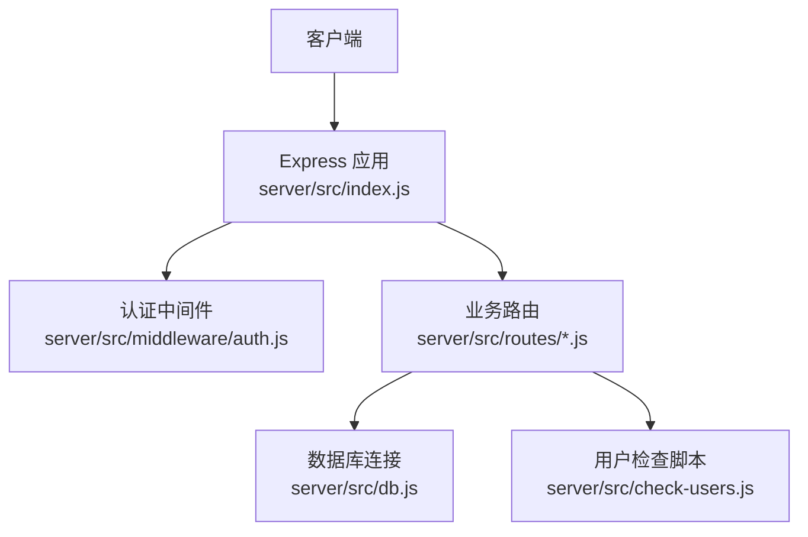
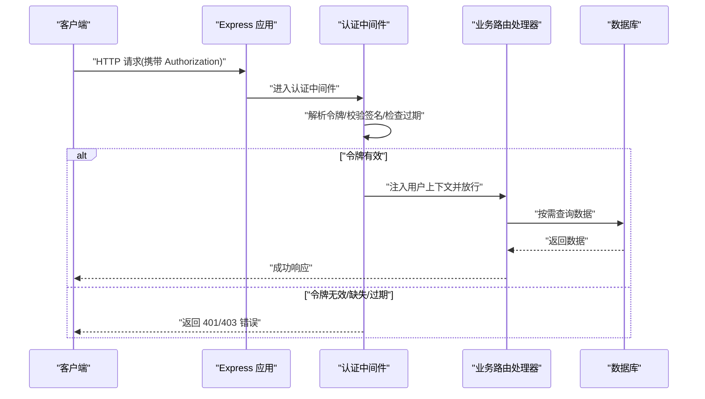
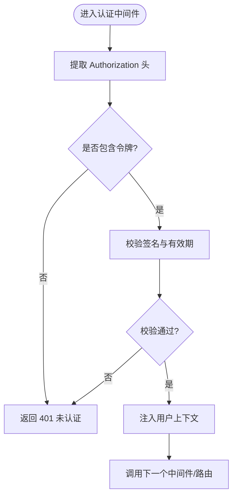
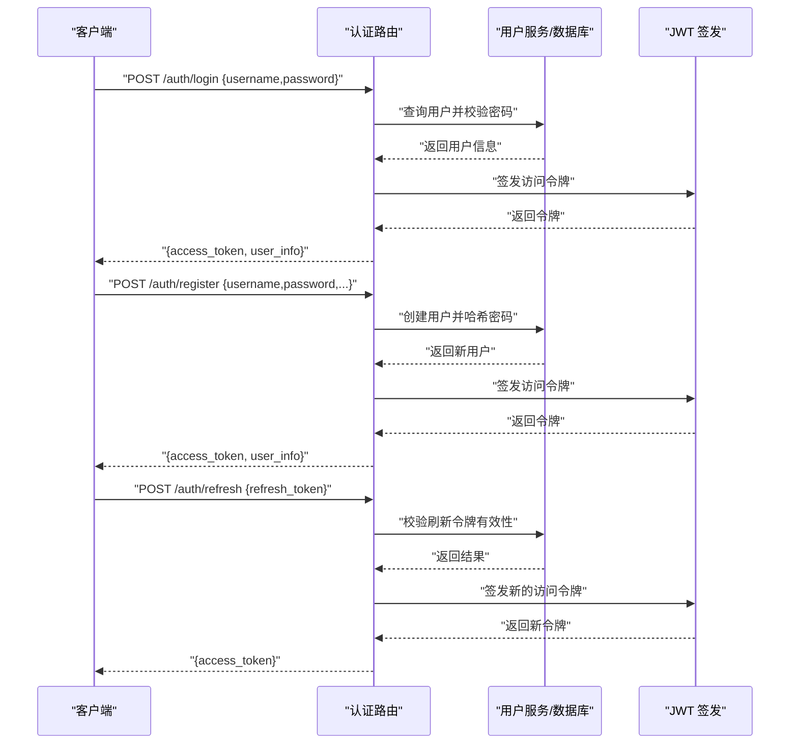
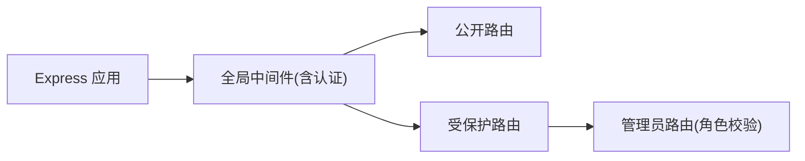
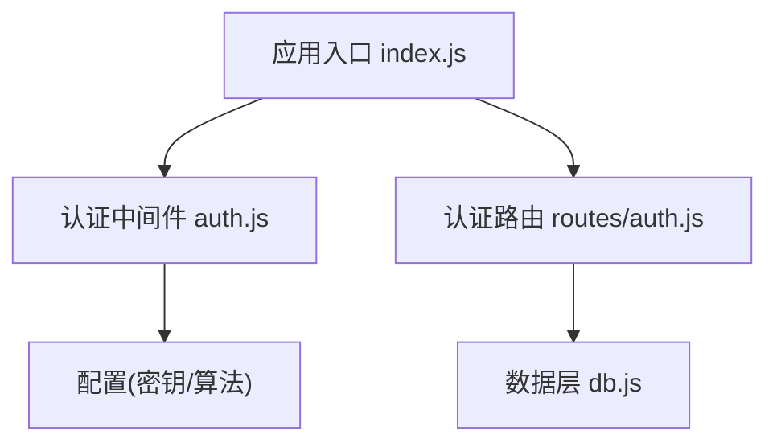

# 认证中间件

<cite>
**本文引用的文件**   
- [server/src/middleware/auth.js](file://server/src/middleware/auth.js)
- [server/src/routes/auth.js](file://server/src/routes/auth.js)
- [server/src/index.js](file://server/src/index.js)
- [server/src/db.js](file://server/src/db.js)
- [server/src/check-users.js](file://server/src/check-users.js)
</cite>

## 目录
1. [简介](#简介)
2. [项目结构](#项目结构)
3. [核心组件](#核心组件)
4. [架构总览](#架构总览)
5. [详细组件分析](#详细组件分析)
6. [依赖关系分析](#依赖关系分析)
7. [性能考虑](#性能考虑)
8. [故障排查指南](#故障排查指南)
9. [结论](#结论)
10. [附录](#附录)

## 简介
本文件聚焦于后端认证中间件的实现与使用，围绕JWT令牌的生命周期（生成、验证、刷新）、身份验证流程、权限控制（角色与资源访问控制）、会话管理策略（存储、过期与安全）、错误处理机制以及安全最佳实践进行系统化说明。文档同时提供基于现有代码的可视化流程图与时序图，帮助读者快速理解并正确集成认证能力到API路由中。

## 项目结构
本项目采用前后端分离架构，认证相关逻辑位于服务端：
- 认证中间件：统一校验请求中的JWT令牌，注入用户上下文
- 认证路由：登录/注册/刷新等鉴权入口
- 应用入口：挂载全局中间件与路由
- 数据层：数据库连接与用户查询
- 辅助脚本：用于检查或初始化用户数据

图表来源
- [server/src/index.js](file://server/src/index.js)
- [server/src/middleware/auth.js](file://server/src/middleware/auth.js)
- [server/src/routes/auth.js](file://server/src/routes/auth.js)
- [server/src/db.js](file://server/src/db.js)
- [server/src/check-users.js](file://server/src/check-users.js)

章节来源
- [server/src/index.js](file://server/src/index.js)
- [server/src/middleware/auth.js](file://server/src/middleware/auth.js)
- [server/src/routes/auth.js](file://server/src/routes/auth.js)
- [server/src/db.js](file://server/src/db.js)
- [server/src/check-users.js](file://server/src/check-users.js)

## 核心组件
- 认证中间件
  - 职责：从请求头解析JWT，校验签名与有效期，将用户信息注入请求上下文；对未认证或无效请求返回标准错误响应。
  - 关键点：密钥配置、算法选择、令牌位置（如Authorization: Bearer）、错误码与消息体规范。
- 认证路由
  - 职责：提供登录、注册、刷新令牌等接口；成功后签发JWT，失败时返回明确错误信息。
  - 关键点：密码哈希、最小化载荷、刷新令牌策略（可选）。
- 应用入口
  - 职责：加载全局中间件（含认证中间件），注册受保护路由。
- 数据层
  - 职责：提供用户查询、凭据校验等基础能力。
- 辅助脚本
  - 职责：用于开发/测试环境初始化或校验用户数据。

章节来源
- [server/src/middleware/auth.js](file://server/src/middleware/auth.js)
- [server/src/routes/auth.js](file://server/src/routes/auth.js)
- [server/src/index.js](file://server/src/index.js)
- [server/src/db.js](file://server/src/db.js)
- [server/src/check-users.js](file://server/src/check-users.js)

## 架构总览
下图展示了典型请求在认证中间件中的流转过程，包括令牌提取、校验、上下文注入与错误分支。

图表来源
- [server/src/middleware/auth.js](file://server/src/middleware/auth.js)
- [server/src/routes/auth.js](file://server/src/routes/auth.js)
- [server/src/index.js](file://server/src/index.js)
- [server/src/db.js](file://server/src/db.js)

## 详细组件分析

### 认证中间件（JWT 验证）
- 功能要点
  - 从请求头中提取令牌（通常为 Authorization: Bearer <token>）
  - 校验令牌签名与有效期
  - 将解码后的用户信息注入 req.user 或等效上下文
  - 对异常与非法状态返回统一错误格式
- 关键设计
  - 密钥与算法应通过环境变量注入，避免硬编码
  - 仅包含必要声明（如用户ID、角色），减少泄露面
  - 对未认证请求直接拒绝，不暴露内部细节
- 错误处理
  - 缺失令牌：返回未认证错误
  - 签名错误或无效：返回未认证错误
  - 已过期：返回令牌过期错误（可引导前端刷新）
  - 权限不足：由后续授权中间件或路由内判断返回禁止访问错误

图表来源
- [server/src/middleware/auth.js](file://server/src/middleware/auth.js)

章节来源
- [server/src/middleware/auth.js](file://server/src/middleware/auth.js)

### 认证路由（登录/注册/刷新）
- 登录流程
  - 接收用户名/邮箱与密码
  - 查询用户记录并校验密码哈希
  - 签发JWT（短生命周期访问令牌）
  - 返回令牌及必要用户信息
- 注册流程
  - 校验输入合法性
  - 哈希密码后持久化
  - 签发初始JWT
- 刷新流程（可选）
  - 支持使用刷新令牌换取新访问令牌
  - 刷新令牌需具备更长生命周期与更强保护（如HttpOnly Cookie）

图表来源
- [server/src/routes/auth.js](file://server/src/routes/auth.js)
- [server/src/db.js](file://server/src/db.js)

章节来源
- [server/src/routes/auth.js](file://server/src/routes/auth.js)
- [server/src/db.js](file://server/src/db.js)

### 应用入口（中间件与路由挂载）
- 全局中间件
  - 加载认证中间件，确保受保护路由统一鉴权
- 路由组织
  - 公开路由：无需认证即可访问
  - 受保护路由：需要有效JWT
  - 管理员路由：需要特定角色（如 admin）

图表来源
- [server/src/index.js](file://server/src/index.js)
- [server/src/middleware/auth.js](file://server/src/middleware/auth.js)

章节来源
- [server/src/index.js](file://server/src/index.js)
- [server/src/middleware/auth.js](file://server/src/middleware/auth.js)

### 数据层（用户查询与凭据校验）
- 职责
  - 提供用户查找、密码比对、用户属性读取等能力
- 注意事项
  - 使用安全的密码哈希算法（如 bcrypt）
  - 避免在日志中输出敏感信息
  - 对查询参数进行严格校验，防止注入

章节来源
- [server/src/db.js](file://server/src/db.js)
- [server/src/check-users.js](file://server/src/check-users.js)

### 权限控制（角色与资源访问）
- 角色校验
  - 在受保护路由前增加授权中间件，检查用户角色是否满足要求
- 资源级控制
  - 根据当前用户ID与资源归属关系进行二次校验（例如只能编辑自己的文章）
- 建议
  - 将角色信息放入JWT载荷或作为独立缓存项，避免每次请求都查库
  - 使用白名单方式定义资源与角色映射，便于维护

章节来源
- [server/src/middleware/auth.js](file://server/src/middleware/auth.js)
- [server/src/routes/auth.js](file://server/src/routes/auth.js)

## 依赖关系分析
- 模块耦合
  - 认证中间件依赖配置（密钥、算法）与请求上下文
  - 认证路由依赖数据层进行用户校验与持久化
  - 应用入口负责装配中间件与路由
- 外部依赖
  - JWT 库（用于签发与校验）
  - 数据库驱动（SQLite/MySQL/PostgreSQL 等）
  - 密码哈希库（bcrypt 等）

图表来源
- [server/src/index.js](file://server/src/index.js)
- [server/src/middleware/auth.js](file://server/src/middleware/auth.js)
- [server/src/routes/auth.js](file://server/src/routes/auth.js)
- [server/src/db.js](file://server/src/db.js)

章节来源
- [server/src/index.js](file://server/src/index.js)
- [server/src/middleware/auth.js](file://server/src/middleware/auth.js)
- [server/src/routes/auth.js](file://server/src/routes/auth.js)
- [server/src/db.js](file://server/src/db.js)

## 性能考虑
- 令牌校验开销
  - 尽量将用户角色与必要属性放入JWT，减少每次请求的数据库查询
- 刷新令牌策略
  - 若启用刷新令牌，建议将其存储在安全的HttpOnly Cookie中，降低XSS风险
- 并发与限流
  - 对登录/注册/刷新接口实施速率限制，防止暴力破解与滥用
- 缓存
  - 对频繁读取的用户属性可使用内存缓存或Redis，注意一致性

[本节为通用指导，不涉及具体文件]

## 故障排查指南
- 常见错误与定位
  - 401 未认证：检查请求头是否携带正确的Authorization字段与Bearer前缀
  - 403 禁止访问：确认用户角色是否满足资源访问要求
  - 400 参数错误：检查登录/注册/刷新请求体的必填字段与格式
- 调试建议
  - 开启详细日志（脱敏），记录请求路径、用户ID与错误类型
  - 使用统一的错误响应结构，便于前端提示与监控
- 常见问题
  - 跨域问题：确保CORS配置允许携带凭证与自定义头
  - 时间同步：服务器时间与客户端时间偏差可能导致“已过期”误判

章节来源
- [server/src/middleware/auth.js](file://server/src/middleware/auth.js)
- [server/src/routes/auth.js](file://server/src/routes/auth.js)

## 结论
通过统一的认证中间件与清晰的认证路由，本项目实现了基于JWT的身份验证与基础的权限控制。结合合理的会话管理策略与错误处理机制，可在保障安全性的前提下提供良好的用户体验。建议在后续迭代中引入更细粒度的授权模型与完善的审计日志，进一步提升系统的安全性与可观测性。

[本节为总结性内容，不涉及具体文件]

## 附录

### 使用示例（如何保护API路由）
- 在应用入口挂载认证中间件
- 为需要认证的API路由添加前置鉴权
- 在受保护路由中读取用户上下文进行业务处理

章节来源
- [server/src/index.js](file://server/src/index.js)
- [server/src/middleware/auth.js](file://server/src/middleware/auth.js)

### 安全最佳实践与漏洞防护
- 密钥管理
  - 使用环境变量或密钥管理服务，避免硬编码
  - 定期轮换密钥，并支持多版本密钥共存过渡期
- 令牌设计
  - 最小化载荷，避免存放敏感信息
  - 设置较短的访问令牌有效期，配合刷新令牌机制
- 传输安全
  - 全站HTTPS，强制HSTS
  - 刷新令牌建议使用HttpOnly+Secure+SameSite Cookie
- 输入校验与防注入
  - 对所有输入进行严格校验与白名单过滤
  - 使用参数化查询，避免SQL注入
- 速率限制与防爆破
  - 对登录/注册/刷新接口实施严格的速率限制
  - 检测异常行为并触发告警
- 日志与审计
  - 记录鉴权失败与权限拒绝事件（脱敏）
  - 保留必要的审计日志以满足合规要求

[本节为通用指导，不涉及具体文件]