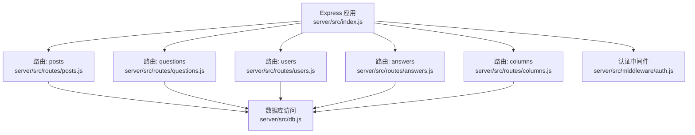
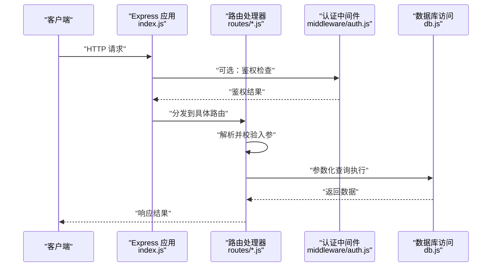
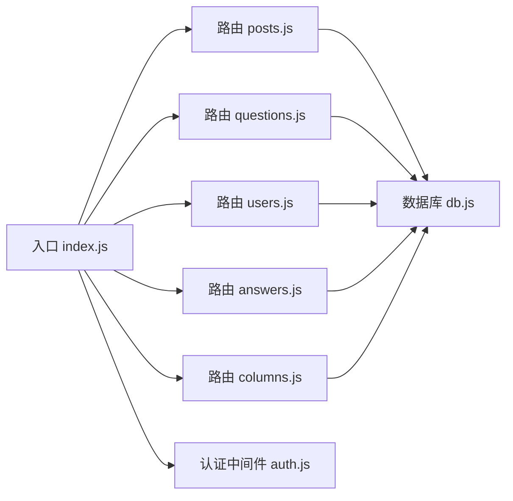
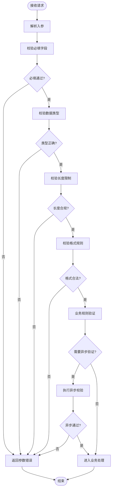

# 输入验证中间件

<cite>
**本文引用的文件**   
- [server/src/middleware/auth.js](file://server/src/middleware/auth.js)
- [server/src/routes/posts.js](file://server/src/routes/posts.js)
- [server/src/routes/questions.js](file://server/src/routes/questions.js)
- [server/src/routes/users.js](file://server/src/routes/users.js)
- [server/src/routes/answers.js](file://server/src/routes/answers.js)
- [server/src/routes/columns.js](file://server/src/routes/columns.js)
- [server/src/db.js](file://server/src/db.js)
- [server/src/index.js](file://server/src/index.js)
</cite>

## 目录
1. [简介](#简介)
2. [项目结构](#项目结构)
3. [核心组件](#核心组件)
4. [架构总览](#架构总览)
5. [详细组件分析](#详细组件分析)
6. [依赖分析](#依赖分析)
7. [性能考虑](#性能考虑)
8. [故障排查指南](#故障排查指南)
9. [结论](#结论)
10. [附录](#附录)

## 简介
本文件围绕“输入验证中间件”的目标，结合仓库中现有的后端实现，梳理并总结参数校验与数据验证机制、规则定义、错误消息定制、组合使用模式（链式与条件验证）、安全最佳实践（SQL注入与XSS防护），以及与表单提交和API请求的集成方式。由于当前仓库未提供统一的验证库或通用验证中间件，本文在尊重现有代码的基础上，给出可落地的落地方案与扩展建议，帮助你在不引入重型第三方库的前提下，构建稳定、可维护的输入验证体系。

## 项目结构
后端采用 Node.js + Express 风格的路由组织，验证逻辑分散在各路由文件中，尚未抽象为统一中间件。整体结构如下：
- 入口与全局配置：server/src/index.js
- 数据库访问：server/src/db.js
- 路由层：server/src/routes/*.js（文章、问答、用户、回答、专栏等）
- 认证中间件：server/src/middleware/auth.js

图表来源
- [server/src/index.js](file://server/src/index.js)
- [server/src/routes/posts.js](file://server/src/routes/posts.js)
- [server/src/routes/questions.js](file://server/src/routes/questions.js)
- [server/src/routes/users.js](file://server/src/routes/users.js)
- [server/src/routes/answers.js](file://server/src/routes/answers.js)
- [server/src/routes/columns.js](file://server/src/routes/columns.js)
- [server/src/db.js](file://server/src/db.js)
- [server/src/middleware/auth.js](file://server/src/middleware/auth.js)

章节来源
- [server/src/index.js](file://server/src/index.js)
- [server/src/routes/posts.js](file://server/src/routes/posts.js)
- [server/src/routes/questions.js](file://server/src/routes/questions.js)
- [server/src/routes/users.js](file://server/src/routes/users.js)
- [server/src/routes/answers.js](file://server/src/routes/answers.js)
- [server/src/routes/columns.js](file://server/src/routes/columns.js)
- [server/src/db.js](file://server/src/db.js)
- [server/src/middleware/auth.js](file://server/src/middleware/auth.js)

## 核心组件
- 路由层负责解析请求体、查询参数与路径参数，并在进入业务处理前进行基础校验。
- 数据库层通过参数化查询避免 SQL 注入风险。
- 认证中间件用于鉴权流程，可作为验证链的一部分参与请求处理。

章节来源
- [server/src/routes/posts.js](file://server/src/routes/posts.js)
- [server/src/routes/questions.js](file://server/src/routes/questions.js)
- [server/src/routes/users.js](file://server/src/routes/users.js)
- [server/src/routes/answers.js](file://server/src/routes/answers.js)
- [server/src/routes/columns.js](file://server/src/routes/columns.js)
- [server/src/db.js](file://server/src/db.js)
- [server/src/middleware/auth.js](file://server/src/middleware/auth.js)

## 架构总览
下图展示了从客户端到数据库的典型请求流，以及验证与安全控制点的位置。

图表来源
- [server/src/index.js](file://server/src/index.js)
- [server/src/middleware/auth.js](file://server/src/middleware/auth.js)
- [server/src/routes/posts.js](file://server/src/routes/posts.js)
- [server/src/routes/questions.js](file://server/src/routes/questions.js)
- [server/src/routes/users.js](file://server/src/routes/users.js)
- [server/src/routes/answers.js](file://server/src/routes/answers.js)
- [server/src/routes/columns.js](file://server/src/routes/columns.js)
- [server/src/db.js](file://server/src/db.js)

## 详细组件分析

### 验证规则定义与实现现状
- 必填字段：各路由在处理新增/更新接口时，对关键参数进行存在性与类型判断。
- 数据类型：对数字、字符串、布尔值等进行类型检查与转换。
- 长度限制：对标题、内容、用户名等字段进行最小/最大长度约束。
- 格式验证：对邮箱、URL、ID 等字段进行正则或内置方法校验。

说明：上述规则在当前仓库中以“内联校验”的形式存在于各路由文件中，尚未抽象为统一中间件。建议在后续迭代中抽取为可复用的验证器集合，并通过中间件形式挂载到路由上。

章节来源
- [server/src/routes/posts.js](file://server/src/routes/posts.js)
- [server/src/routes/questions.js](file://server/src/routes/questions.js)
- [server/src/routes/users.js](file://server/src/routes/users.js)
- [server/src/routes/answers.js](file://server/src/routes/answers.js)
- [server/src/routes/columns.js](file://server/src/routes/columns.js)

### 自定义验证器：业务规则与异步验证
- 业务规则验证：例如唯一性检查、权限校验、状态机约束等，可在路由层调用独立函数完成。
- 异步验证：如查重、黑名单检查、外部服务校验等，应基于 Promise 实现，并在路由中 await 处理。

建议：将常用验证封装为纯函数或类，返回标准化错误对象，便于统一错误处理与多语言支持。

章节来源
- [server/src/routes/posts.js](file://server/src/routes/posts.js)
- [server/src/routes/questions.js](file://server/src/routes/questions.js)
- [server/src/routes/users.js](file://server/src/routes/users.js)
- [server/src/routes/answers.js](file://server/src/routes/answers.js)
- [server/src/routes/columns.js](file://server/src/routes/columns.js)

### 错误消息定制与多语言支持
- 错误分类：区分参数缺失、类型错误、长度越界、格式非法、业务规则失败等。
- 多语言：以键值映射的方式管理错误文案，根据请求头或会话中的语言偏好选择对应文案。
- 用户友好：面向用户的错误提示应避免暴露内部细节，仅返回必要信息。

章节来源
- [server/src/routes/posts.js](file://server/src/routes/posts.js)
- [server/src/routes/questions.js](file://server/src/routes/questions.js)
- [server/src/routes/users.js](file://server/src/routes/users.js)
- [server/src/routes/answers.js](file://server/src/routes/answers.js)
- [server/src/routes/columns.js](file://server/src/routes/columns.js)

### 验证中间件的组合使用模式
- 链式验证：将多个验证步骤串联执行，任一失败即中断并返回错误。
- 条件验证：根据上下文动态启用某些规则（如按角色、按操作类型）。
- 与认证中间件组合：先鉴权再校验，减少无效请求进入业务层。

章节来源
- [server/src/middleware/auth.js](file://server/src/middleware/auth.js)
- [server/src/routes/posts.js](file://server/src/routes/posts.js)
- [server/src/routes/questions.js](file://server/src/routes/questions.js)
- [server/src/routes/users.js](file://server/src/routes/users.js)
- [server/src/routes/answers.js](file://server/src/routes/answers.js)
- [server/src/routes/columns.js](file://server/src/routes/columns.js)

### 安全最佳实践：SQL 注入与 XSS 防护
- SQL 注入防护：数据库访问必须使用参数化查询，禁止拼接用户输入。
- XSS 防护：输出到前端的内容需进行转义或白名单过滤；富文本场景建议使用安全的渲染库。

章节来源
- [server/src/db.js](file://server/src/db.js)

### 与表单提交和 API 请求的集成
- 表单提交：前端发送 application/x-www-form-urlencoded 或 multipart/form-data，后端在路由层解析后执行验证。
- API 请求：JSON 请求体需在路由层解析并进行结构化校验。
- 统一错误响应：所有验证失败应返回一致的结构，包含错误码与可读消息。

章节来源
- [server/src/routes/posts.js](file://server/src/routes/posts.js)
- [server/src/routes/questions.js](file://server/src/routes/questions.js)
- [server/src/routes/users.js](file://server/src/routes/users.js)
- [server/src/routes/answers.js](file://server/src/routes/answers.js)
- [server/src/routes/columns.js](file://server/src/routes/columns.js)

## 依赖分析
- 路由层依赖数据库访问模块进行持久化操作。
- 认证中间件作为可选前置步骤，影响后续路由是否继续处理。
- 入口文件负责注册路由与中间件，形成完整的请求处理管线。

图表来源
- [server/src/index.js](file://server/src/index.js)
- [server/src/routes/posts.js](file://server/src/routes/posts.js)
- [server/src/routes/questions.js](file://server/src/routes/questions.js)
- [server/src/routes/users.js](file://server/src/routes/users.js)
- [server/src/routes/answers.js](file://server/src/routes/answers.js)
- [server/src/routes/columns.js](file://server/src/routes/columns.js)
- [server/src/db.js](file://server/src/db.js)
- [server/src/middleware/auth.js](file://server/src/middleware/auth.js)

章节来源
- [server/src/index.js](file://server/src/index.js)
- [server/src/db.js](file://server/src/db.js)
- [server/src/middleware/auth.js](file://server/src/middleware/auth.js)

## 性能考虑
- 尽早失败：在路由入口处快速校验必要参数，避免不必要的数据库访问。
- 批量校验：对复杂对象采用一次性校验，减少重复计算。
- 缓存热点规则：对于频繁使用的验证规则，可缓存编译后的正则或校验函数。
- 异步验证限流：对外部服务的异步校验增加超时与重试策略，防止雪崩。

[本节为通用指导，无需特定文件引用]

## 故障排查指南
- 常见错误定位：
  - 参数缺失或类型错误：检查路由层的解析与校验逻辑。
  - 业务规则失败：查看自定义验证器的返回结构与错误码。
  - 数据库异常：确认参数化查询是否正确，避免拼接字符串。
- 日志与调试：
  - 记录请求的关键入参与校验结果，便于回溯问题。
  - 对异步验证增加超时与错误捕获，避免挂起请求。

章节来源
- [server/src/routes/posts.js](file://server/src/routes/posts.js)
- [server/src/routes/questions.js](file://server/src/routes/questions.js)
- [server/src/routes/users.js](file://server/src/routes/users.js)
- [server/src/routes/answers.js](file://server/src/routes/answers.js)
- [server/src/routes/columns.js](file://server/src/routes/columns.js)
- [server/src/db.js](file://server/src/db.js)

## 结论
当前仓库在后端路由层实现了基础的输入校验与数据库参数化查询，具备较好的安全性基础。建议下一步将验证逻辑抽象为可复用的中间件与验证器集合，统一错误消息与多语言支持，并结合认证中间件形成链式与条件验证的组合模式，从而提升可维护性与一致性。

[本节为总结性内容，无需特定文件引用]

## 附录

### 验证流程图（概念性）

[此图为概念性流程，不直接映射具体源码文件，故无图表来源]