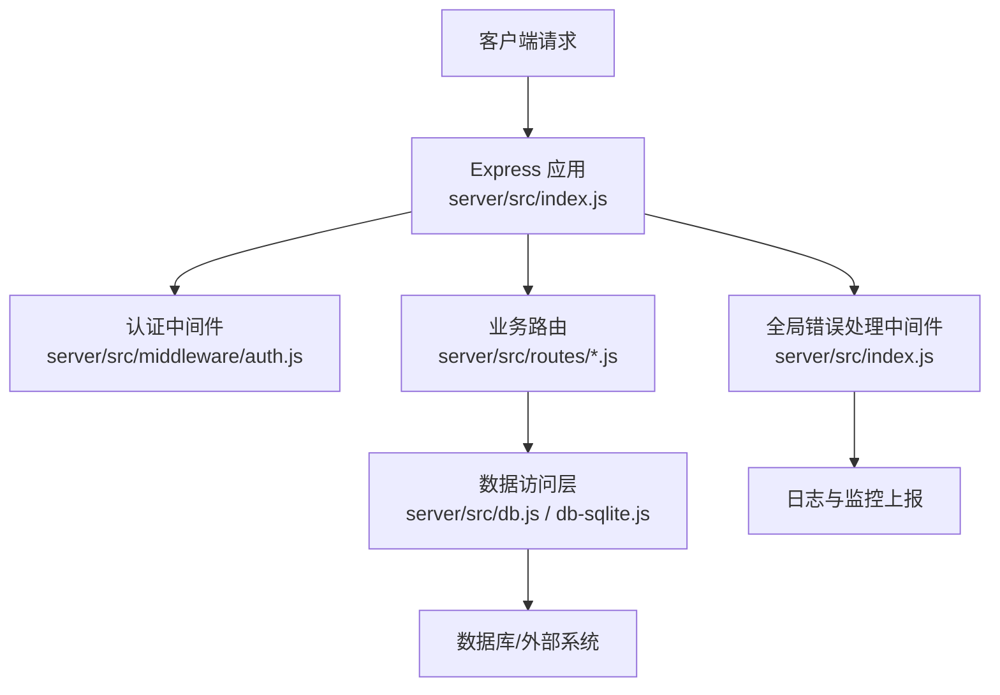
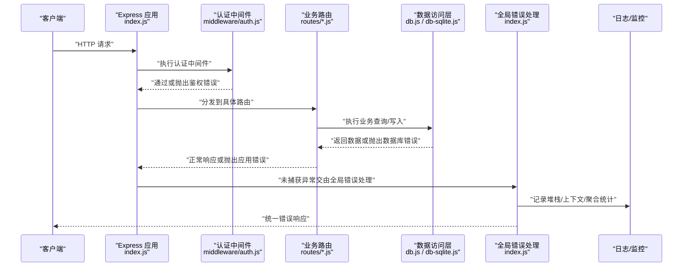
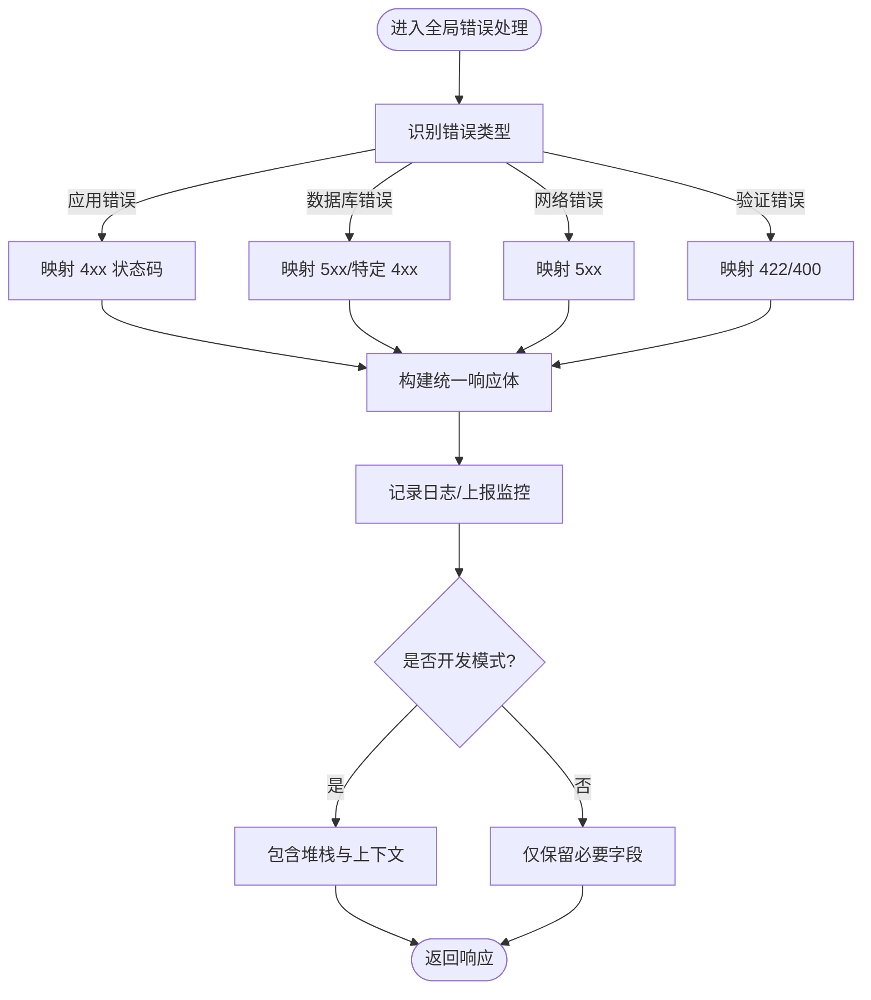
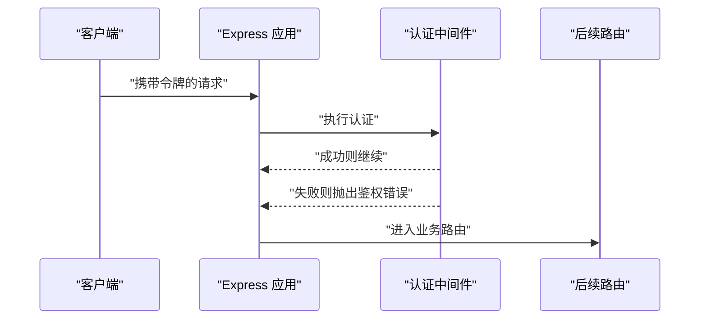
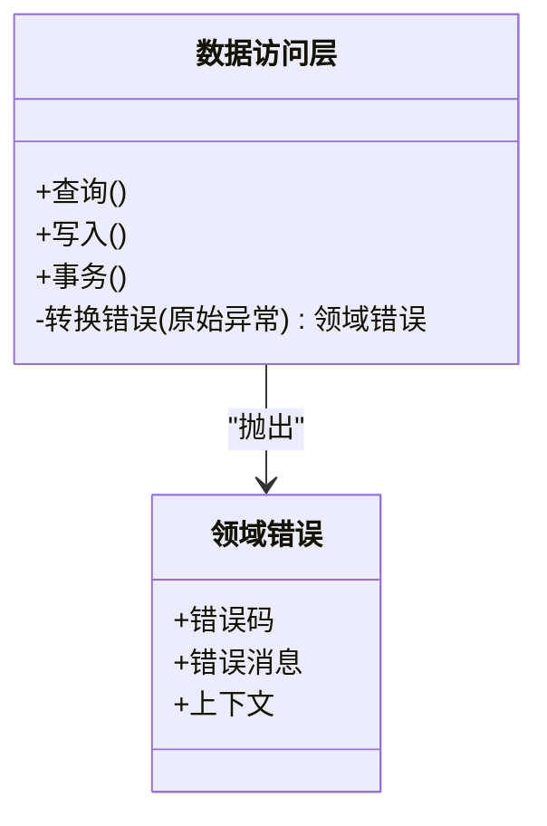
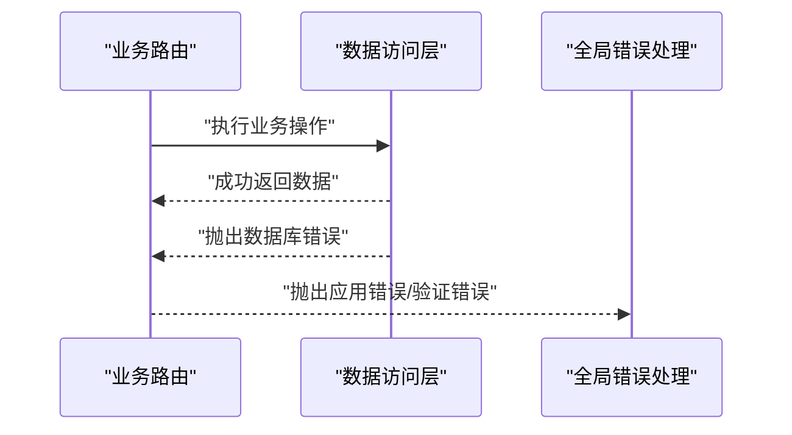
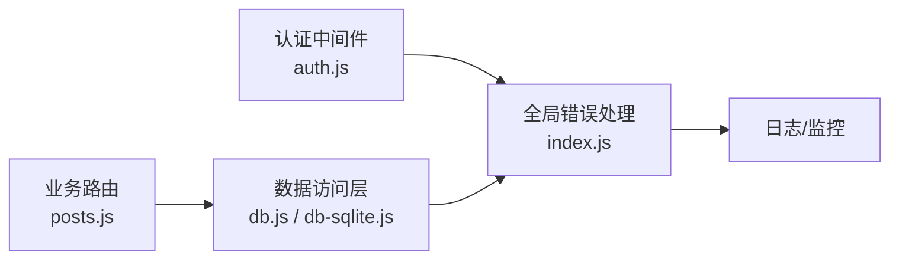

# 错误处理中间件

<cite>
**本文引用的文件**   
- [server/src/index.js](file://server/src/index.js)
- [server/src/middleware/auth.js](file://server/src/middleware/auth.js)
- [server/src/routes/posts.js](file://server/src/routes/posts.js)
- [server/src/db.js](file://server/src/db.js)
- [server/src/db-sqlite.js](file://server/src/db-sqlite.js)
</cite>

## 目录
1. [简介](#简介)
2. [项目结构](#项目结构)
3. [核心组件](#核心组件)
4. [架构总览](#架构总览)
5. [详细组件分析](#详细组件分析)
6. [依赖分析](#依赖分析)
7. [性能考虑](#性能考虑)
8. [故障排查指南](#故障排查指南)
9. [结论](#结论)
10. [附录](#附录) 

## 简介
本文件面向后端服务，系统化阐述“错误处理中间件”的设计与实现方案。目标包括：
- 建立全局异常捕获与统一响应机制
- 定义清晰的错误分类体系（应用错误、数据库错误、网络错误、验证错误）
- 规范统一错误响应格式（错误码、错误消息、调试信息）
- 完善错误日志记录（堆栈跟踪、上下文信息、错误聚合）
- 提供自定义错误类的创建与使用方式
- 制定生产环境策略（监控、告警、用户友好提示）
- 给出集成错误追踪服务（如 Sentry/Rollbar）的落地建议

## 项目结构
当前仓库采用前后端分离结构，后端位于 server 目录，基于 Express 风格的服务入口与路由组织。为构建统一的错误处理中间件，需要关注以下关键位置：
- 服务入口：负责注册全局中间件与错误处理器
- 业务路由：抛出结构化错误对象，避免未捕获异常
- 数据访问层：将底层异常转换为领域错误类型
- 认证中间件：在鉴权失败时返回标准化错误

图表来源
- [server/src/index.js](file://server/src/index.js)
- [server/src/middleware/auth.js](file://server/src/middleware/auth.js)
- [server/src/routes/posts.js](file://server/src/routes/posts.js)
- [server/src/db.js](file://server/src/db.js)
- [server/src/db-sqlite.js](file://server/src/db-sqlite.js)

章节来源
- [server/src/index.js](file://server/src/index.js)
- [server/src/middleware/auth.js](file://server/src/middleware/auth.js)
- [server/src/routes/posts.js](file://server/src/routes/posts.js)
- [server/src/db.js](file://server/src/db.js)
- [server/src/db-sqlite.js](file://server/src/db-sqlite.js)

## 核心组件
- 全局错误处理中间件
  - 职责：捕获所有未处理异常；识别错误类型；生成统一响应；记录日志；可选上报监控平台
  - 关键点：区分开发/生产模式；屏蔽敏感信息；保留调试上下文
- 认证中间件
  - 职责：校验令牌/权限；失败时返回标准鉴权错误
- 数据访问层
  - 职责：封装数据库调用；将底层异常映射为领域错误类型
- 业务路由
  - 职责：参数校验、业务规则检查；抛出结构化错误对象

章节来源
- [server/src/index.js](file://server/src/index.js)
- [server/src/middleware/auth.js](file://server/src/middleware/auth.js)
- [server/src/db.js](file://server/src/db.js)
- [server/src/db-sqlite.js](file://server/src/db-sqlite.js)

## 架构总览
下图展示从请求进入、经过认证与路由、到数据访问与全局错误处理的完整链路，以及错误如何被分类、格式化并上报。

图表来源
- [server/src/index.js](file://server/src/index.js)
- [server/src/middleware/auth.js](file://server/src/middleware/auth.js)
- [server/src/routes/posts.js](file://server/src/routes/posts.js)
- [server/src/db.js](file://server/src/db.js)
- [server/src/db-sqlite.js](file://server/src/db-sqlite.js)

## 详细组件分析

### 全局错误处理中间件
- 设计要点
  - 作为最后一个中间件注册，确保捕获所有上游抛出的错误
  - 根据错误类型决定 HTTP 状态码与响应体
  - 开发模式输出详细堆栈与上下文；生产模式仅输出必要信息
  - 对高频错误进行聚合统计，便于监控与告警
- 错误分类与映射
  - 应用错误：业务规则不满足、资源不存在等，通常映射 4xx
  - 数据库错误：连接失败、约束冲突、SQL 语法错误等，通常映射 5xx 或特定 4xx
  - 网络错误：第三方 API 超时、不可达等，通常映射 5xx
  - 验证错误：入参缺失、格式非法等，通常映射 422/400
- 统一响应格式
  - 字段建议：错误码、错误消息、调试信息（含堆栈、请求 ID、时间戳等）
  - 生产环境隐藏敏感调试信息，仅保留必要定位字段
- 日志与监控
  - 记录请求上下文（方法、路径、用户标识、耗时）
  - 记录错误类型、堆栈、错误码
  - 聚合统计（按错误码、模块、接口维度）
  - 可选接入 Sentry/Rollbar 等错误追踪服务

图表来源
- [server/src/index.js](file://server/src/index.js)

章节来源
- [server/src/index.js](file://server/src/index.js)

### 认证中间件
- 职责
  - 校验请求头中的令牌或会话
  - 解析用户身份并挂载到请求上下文
  - 失败时抛出标准化的鉴权错误
- 错误处理
  - 鉴权失败应返回明确的错误码与消息，便于前端提示
  - 避免泄露内部实现细节

图表来源
- [server/src/middleware/auth.js](file://server/src/middleware/auth.js)
- [server/src/index.js](file://server/src/index.js)

章节来源
- [server/src/middleware/auth.js](file://server/src/middleware/auth.js)
- [server/src/index.js](file://server/src/index.js)

### 数据访问层
- 职责
  - 封装数据库操作，向上层暴露稳定的接口
  - 捕获底层异常并转换为领域错误类型
- 错误映射
  - 连接失败、超时、锁等待等映射为数据库错误
  - 唯一约束冲突可映射为业务友好的错误码
- 日志与追踪
  - 记录慢查询与失败 SQL（脱敏）
  - 附加请求 ID 以便跨层追踪

图表来源
- [server/src/db.js](file://server/src/db.js)
- [server/src/db-sqlite.js](file://server/src/db-sqlite.js)

章节来源
- [server/src/db.js](file://server/src/db.js)
- [server/src/db-sqlite.js](file://server/src/db-sqlite.js)

### 业务路由
- 职责
  - 接收请求参数并进行基础校验
  - 调用数据访问层完成业务逻辑
  - 遇到异常时抛出结构化错误对象
- 最佳实践
  - 明确错误码与消息语义，避免模糊描述
  - 对可恢复错误进行重试或降级（必要时）

图表来源
- [server/src/routes/posts.js](file://server/src/routes/posts.js)
- [server/src/db.js](file://server/src/db.js)
- [server/src/index.js](file://server/src/index.js)

章节来源
- [server/src/routes/posts.js](file://server/src/routes/posts.js)
- [server/src/db.js](file://server/src/db.js)
- [server/src/index.js](file://server/src/index.js)

## 依赖分析
- 耦合关系
  - 全局错误处理中间件依赖错误分类器与日志/监控上报器
  - 认证中间件依赖令牌解析与用户服务（如有）
  - 数据访问层依赖数据库驱动与连接池
- 潜在风险
  - 未正确分类的错误可能导致状态码不一致
  - 日志中可能泄露敏感信息
  - 监控上报失败不应影响主流程

图表来源
- [server/src/index.js](file://server/src/index.js)
- [server/src/middleware/auth.js](file://server/src/middleware/auth.js)
- [server/src/routes/posts.js](file://server/src/routes/posts.js)
- [server/src/db.js](file://server/src/db.js)
- [server/src/db-sqlite.js](file://server/src/db-sqlite.js)

章节来源
- [server/src/index.js](file://server/src/index.js)
- [server/src/middleware/auth.js](file://server/src/middleware/auth.js)
- [server/src/routes/posts.js](file://server/src/routes/posts.js)
- [server/src/db.js](file://server/src/db.js)
- [server/src/db-sqlite.js](file://server/src/db-sqlite.js)

## 性能考虑
- 错误日志采样：在高并发场景下对高频错误进行采样，避免 I/O 瓶颈
- 异步上报：将监控上报放入独立队列，避免阻塞主线程
- 快速失败：对明显无效请求尽早返回，减少不必要的计算与 IO
- 限流与熔断：对下游依赖进行保护，防止雪崩效应

## 故障排查指南
- 常见问题
  - 未捕获异常导致 500：确认全局错误处理中间件已注册且顺序正确
  - 状态码不一致：检查错误分类与映射逻辑
  - 敏感信息泄露：确认生产模式屏蔽了堆栈与上下文
  - 监控无数据：检查上报通道与密钥配置
- 定位步骤
  - 通过请求 ID 关联日志与监控事件
  - 查看错误分类与状态码映射是否符合预期
  - 核对数据访问层的错误转换是否覆盖常见异常

章节来源
- [server/src/index.js](file://server/src/index.js)
- [server/src/db.js](file://server/src/db.js)
- [server/src/db-sqlite.js](file://server/src/db-sqlite.js)

## 结论
通过建立统一的全局错误处理中间件、清晰的错误分类体系、规范的响应格式与完善的日志监控，可以显著提升系统的可观测性与用户体验。建议在上线前完成错误埋点与告警策略配置，并在生产环境严格屏蔽敏感调试信息。

## 附录

### 统一错误响应格式（建议）
- 字段说明
  - 错误码：字符串或数字，用于前端分支处理
  - 错误消息：面向用户的简短提示
  - 调试信息：仅在开发模式包含，含堆栈、请求 ID、时间戳等
- 示例结构（示意）
  - { code, message, debug?: { stack, requestId, timestamp, ... } }

[本节为概念性说明，无需源码引用]

### 自定义错误类（建议）
- 基类
  - 属性：错误码、错误消息、上下文、是否可重试
  - 方法：toResponse() 生成统一响应体
- 派生类
  - 应用错误：业务规则不满足
  - 数据库错误：连接/约束/超时等
  - 网络错误：第三方调用失败
  - 验证错误：参数校验失败
- 使用方式
  - 在路由或数据访问层抛出对应错误类
  - 全局错误处理中间件统一消费并生成响应

[本节为概念性说明，无需源码引用]

### 生产环境策略
- 错误监控
  - 接入 Sentry/Rollbar，设置 DSN/Token
  - 过滤噪声错误，设置阈值告警
- 用户友好提示
  - 对可恢复错误提供重试按钮或替代路径
  - 对不可恢复错误显示通用提示与联系方式
- 合规与安全
  - 禁止在响应中输出堆栈、SQL、密钥等敏感信息
  - 对日志进行脱敏处理

[本节为概念性说明，无需源码引用]

### 集成错误追踪服务（Sentry/Rollbar）
- 接入步骤（示意）
  - 安装 SDK 并初始化（设置 DSN/Token、环境、版本）
  - 在全局错误处理中间件中上报错误事件
  - 附加请求上下文（方法、路径、用户标识、耗时）
- 注意事项
  - 控制上报频率与采样率
  - 过滤重复与噪声错误
  - 结合告警策略及时响应

[本节为概念性说明，无需源码引用]