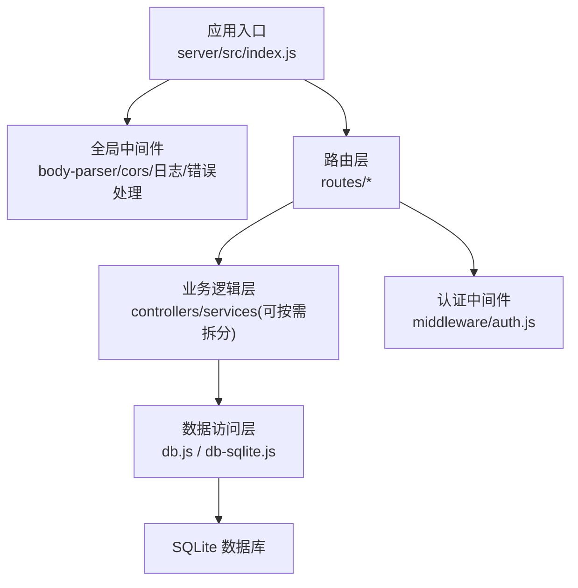
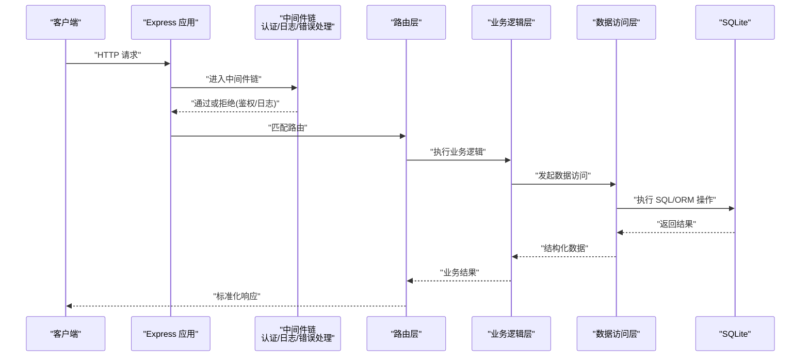
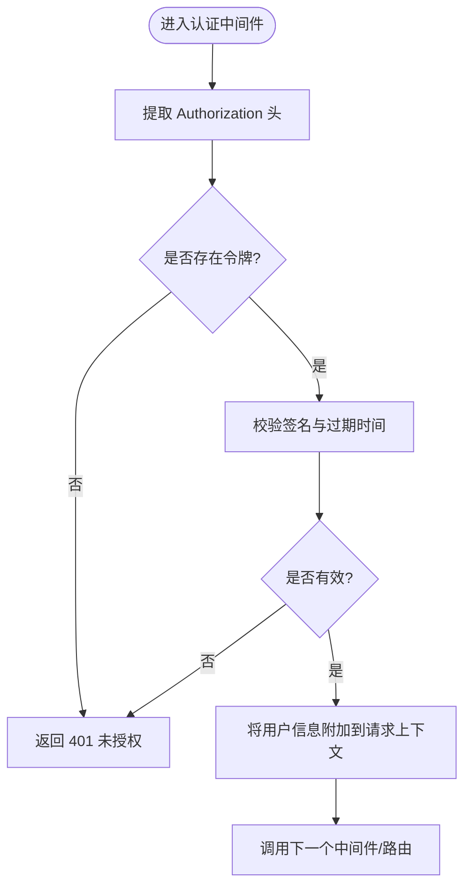
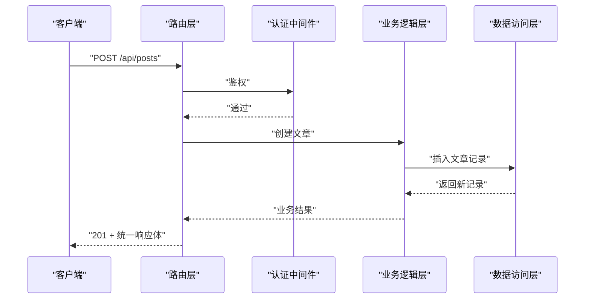
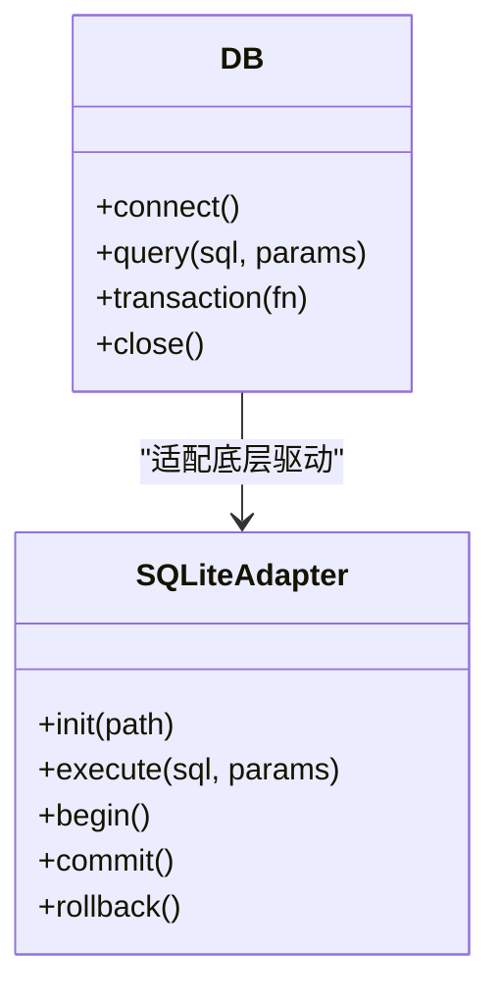
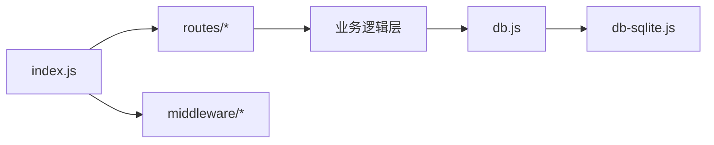

# 后端架构设计

<cite>
**本文引用的文件**   
- [server/src/index.js](file://server/src/index.js)
- [server/src/middleware/auth.js](file://server/src/middleware/auth.js)
- [server/src/routes/posts.js](file://server/src/routes/posts.js)
- [server/src/routes/users.js](file://server/src/routes/users.js)
- [server/src/routes/auth.js](file://server/src/routes/auth.js)
- [server/src/db.js](file://server/src/db.js)
- [server/src/db-sqlite.js](file://server/src/db-sqlite.js)
- [server/package.json](file://server/package.json)
</cite>

## 目录
1. [简介](#简介)
2. [项目结构](#项目结构)
3. [核心组件](#核心组件)
4. [架构总览](#架构总览)
5. [详细组件分析](#详细组件分析)
6. [依赖分析](#依赖分析)
7. [性能考虑](#性能考虑)
8. [故障排查指南](#故障排查指南)
9. [结论](#结论)
10. [附录](#附录)

## 简介
本文件面向基于 Express 的后端服务，围绕 MVC 分层、中间件机制、数据库与 ORM 策略、API 设计规范与安全架构进行系统化说明。文档以仓库中的 server 目录为核心，结合路由、中间件、数据访问层等关键实现，给出可落地的架构设计与最佳实践建议。

## 项目结构
后端采用典型的 MVC 分层：
- 路由层（Routes）：负责 URL 到控制器/业务逻辑的映射，解析请求参数与响应格式。
- 业务逻辑层（Controllers/Services）：封装领域规则、调用数据访问层、编排业务流程。
- 数据访问层（Data Access / DB）：封装数据库连接、SQL 或 ORM 操作、事务与查询优化。
- 中间件（Middleware）：横切关注点，如认证、日志、错误处理、输入校验等。
- 应用入口（Entry）：Express 初始化、全局中间件注册、路由挂载、启动监听。

图表来源
- [server/src/index.js](file://server/src/index.js)
- [server/src/middleware/auth.js](file://server/src/middleware/auth.js)
- [server/src/db.js](file://server/src/db.js)
- [server/src/db-sqlite.js](file://server/src/db-sqlite.js)

章节来源
- [server/src/index.js](file://server/src/index.js)
- [server/package.json](file://server/package.json)

## 核心组件
- 应用入口与中间件装配
  - 负责创建 Express 实例、注册全局中间件、挂载各模块路由、统一错误处理与优雅退出。
- 认证中间件
  - 提供 JWT 令牌验证能力，将已认证用户信息注入上下文，供后续路由使用。
- 路由模块
  - posts、users、auth 等按资源划分，定义 RESTful 路径与方法，并委派给业务逻辑层。
- 数据访问层
  - 封装 SQLite 连接与基础操作，提供统一的查询接口；在需要时支持事务与批量操作。

章节来源
- [server/src/index.js](file://server/src/index.js)
- [server/src/middleware/auth.js](file://server/src/middleware/auth.js)
- [server/src/routes/posts.js](file://server/src/routes/posts.js)
- [server/src/routes/users.js](file://server/src/routes/users.js)
- [server/src/routes/auth.js](file://server/src/routes/auth.js)
- [server/src/db.js](file://server/src/db.js)
- [server/src/db-sqlite.js](file://server/src/db-sqlite.js)

## 架构总览
下图展示从客户端请求到数据库返回的整体流程，以及关键中间件与分层职责。

图表来源
- [server/src/index.js](file://server/src/index.js)
- [server/src/middleware/auth.js](file://server/src/middleware/auth.js)
- [server/src/routes/posts.js](file://server/src/routes/posts.js)
- [server/src/db.js](file://server/src/db.js)

## 详细组件分析

### 应用入口与中间件装配
- 职责
  - 初始化 Express 实例，配置 CORS、静态资源、JSON 解析等。
  - 注册全局中间件：统一日志、统一错误处理、健康检查等。
  - 挂载各功能路由，暴露对外 API。
  - 启动 HTTP 服务，监听端口，处理进程信号与优雅关闭。
- 关键点
  - 错误处理中间件应放在所有路由之后，捕获未处理异常并返回统一错误格式。
  - 日志中间件应在请求早期记录入参、耗时与状态码，便于追踪。
  - 环境变量用于区分运行模式、端口、数据库路径、JWT 密钥等。

章节来源
- [server/src/index.js](file://server/src/index.js)

### 认证中间件（JWT）
- 职责
  - 从请求头提取令牌，校验签名与有效期，失败则返回 401。
  - 将解码后的用户信息注入到请求上下文，供下游路由使用。
- 安全要点
  - 仅信任 HTTPS 传输，避免中间人攻击。
  - 合理设置过期时间，必要时引入刷新令牌机制。
  - 对敏感字段最小化暴露，避免在响应中回传多余信息。

图表来源
- [server/src/middleware/auth.js](file://server/src/middleware/auth.js)

章节来源
- [server/src/middleware/auth.js](file://server/src/middleware/auth.js)

### 路由层（RESTful 示例）
- 设计原则
  - 资源名词复数形式，动词由 HTTP 方法表达。
  - 路径简洁明确，分页与过滤通过查询参数传递。
  - 响应体遵循统一结构，包含数据、分页信息与错误码。
- 典型资源
  - 文章：GET/POST/PUT/DELETE /api/posts
  - 用户：GET/POST/PUT/DELETE /api/users
  - 认证：POST /api/auth/login, POST /api/auth/register

图表来源
- [server/src/routes/posts.js](file://server/src/routes/posts.js)
- [server/src/middleware/auth.js](file://server/src/middleware/auth.js)

章节来源
- [server/src/routes/posts.js](file://server/src/routes/posts.js)
- [server/src/routes/users.js](file://server/src/routes/users.js)
- [server/src/routes/auth.js](file://server/src/routes/auth.js)

### 数据访问层与 SQLite 策略
- 连接管理
  - 单例连接池或按需复用连接，避免频繁打开/关闭。
  - 根据环境切换数据库路径与同步/异步模式。
- 查询与事务
  - 复杂写入使用事务保证一致性。
  - 高频读取增加索引，避免全表扫描。
- ORM 与原生 SQL
  - 若使用 ORM，注意 N+1 查询问题，合理使用预加载与关联查询。
  - 若使用原生 SQL，务必使用参数化查询防止 SQL 注入。

图表来源
- [server/src/db.js](file://server/src/db.js)
- [server/src/db-sqlite.js](file://server/src/db-sqlite.js)

章节来源
- [server/src/db.js](file://server/src/db.js)
- [server/src/db-sqlite.js](file://server/src/db-sqlite.js)

### 错误处理中间件
- 职责
  - 捕获未处理异常与业务错误，输出统一错误格式。
  - 记录错误堆栈与上下文，便于线上定位。
- 规范
  - 错误码分类：客户端错误（4xx）、服务端错误（5xx）。
  - 生产环境隐藏敏感细节，仅返回必要提示。

章节来源
- [server/src/index.js](file://server/src/index.js)

## 依赖分析
- 运行时依赖
  - Express：Web 框架，提供路由、中间件与请求/响应对象。
  - SQLite 驱动：本地嵌入式数据库，适合轻量级部署与开发测试。
  - JSON 解析与 CORS：标准 Web 能力扩展。
- 内部依赖关系
  - 入口依赖路由与中间件；路由依赖业务逻辑；业务逻辑依赖数据访问；数据访问依赖 SQLite 驱动。

图表来源
- [server/src/index.js](file://server/src/index.js)
- [server/src/db.js](file://server/src/db.js)
- [server/src/db-sqlite.js](file://server/src/db-sqlite.js)

章节来源
- [server/package.json](file://server/package.json)
- [server/src/index.js](file://server/src/index.js)

## 性能考虑
- 连接与并发
  - 复用数据库连接，避免每次请求新建连接。
  - 控制并发度，必要时引入队列或限流。
- 查询优化
  - 为常用过滤字段建立索引，减少排序与扫描成本。
  - 分页限制返回条数，避免大结果集。
- 缓存策略
  - 热点数据使用内存缓存或外部缓存（如 Redis），降低数据库压力。
- 序列化与传输
  - 压缩响应体，按需返回字段，减少带宽占用。

[本节为通用指导，不直接分析具体文件]

## 故障排查指南
- 常见问题
  - 401 未授权：检查令牌是否存在、是否过期、签名是否正确。
  - 404 未找到：确认路由前缀与路径大小写、是否被前置中间件拦截。
  - 500 服务器错误：查看错误处理中间件的日志与堆栈。
- 诊断步骤
  - 开启请求日志，记录入参、耗时与状态码。
  - 针对慢查询定位 SQL 与索引情况。
  - 隔离变更，逐步缩小问题范围。

章节来源
- [server/src/index.js](file://server/src/index.js)
- [server/src/middleware/auth.js](file://server/src/middleware/auth.js)

## 结论
本项目后端采用清晰的 MVC 分层与中间件机制，结合 SQLite 的轻量特性，适合快速迭代与中小规模场景。建议在以下方面持续完善：
- 统一错误码与响应体规范，提升前后端协作效率。
- 强化输入校验与权限控制，确保数据安全与合规。
- 引入监控与告警，提升线上稳定性与可观测性。

[本节为总结性内容，不直接分析具体文件]

## 附录

### API 设计规范（建议）
- 命名与路径
  - 使用名词复数表示资源，动词由 HTTP 方法表达。
  - 版本化：/api/v1/...
- 请求与响应
  - 请求体使用 JSON，统一 Content-Type。
  - 响应体包含 code、message、data 等字段。
- 分页与筛选
  - 使用 page、pageSize、sort、filter 等查询参数。
- 错误码
  - 4xx 客户端错误，5xx 服务端错误；业务错误码独立于 HTTP 状态码。

[本节为通用规范建议，不直接分析具体文件]

### 安全架构（建议）
- 身份认证
  - 使用 JWT，短期令牌配合刷新令牌机制。
  - 严格校验签名、过期时间与受众。
- 输入校验
  - 服务端对所有输入进行白名单校验与类型检查。
- 防注入
  - 使用参数化查询或 ORM 的安全 API，禁止拼接 SQL。
- 传输安全
  - 强制 HTTPS，启用 HSTS，妥善管理证书。
- 权限控制
  - 基于角色的访问控制（RBAC），最小权限原则。

[本节为通用安全建议，不直接分析具体文件]