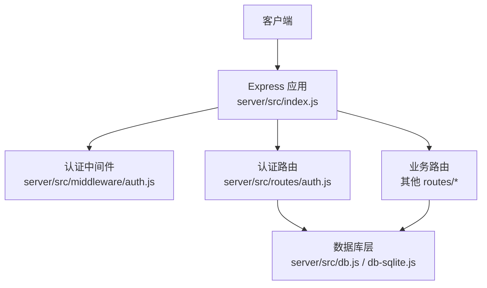
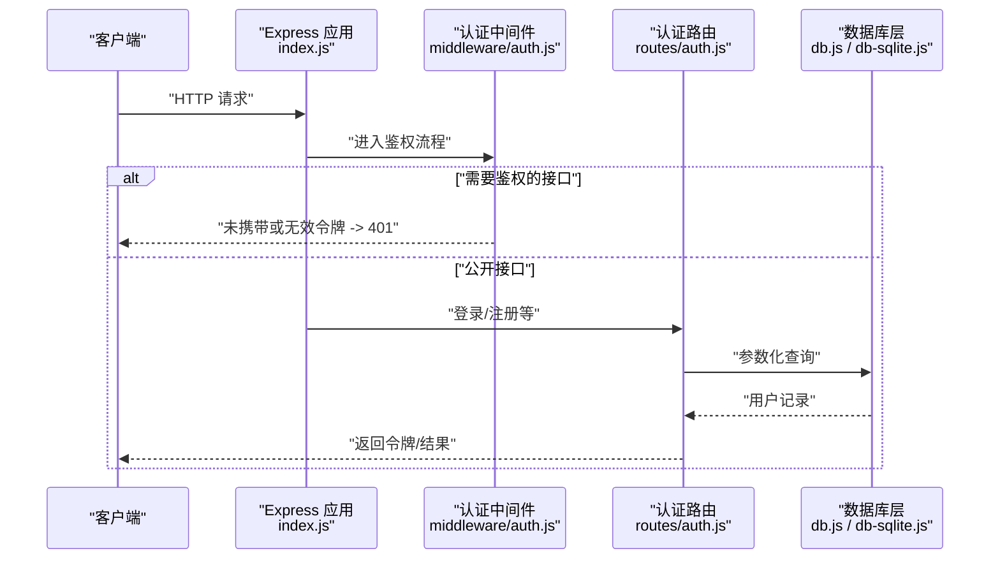
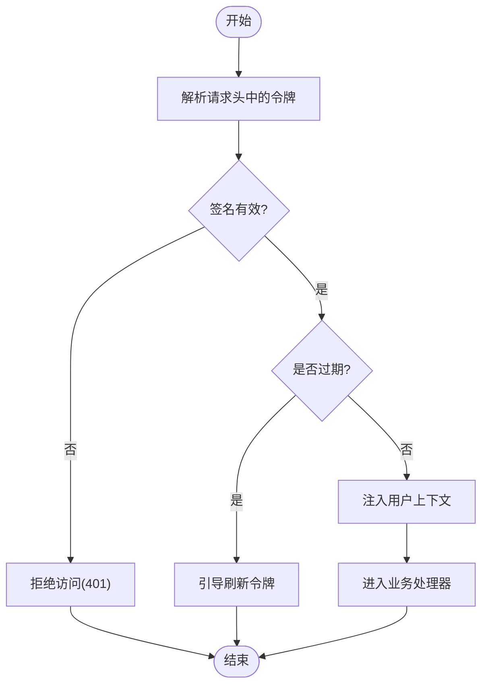
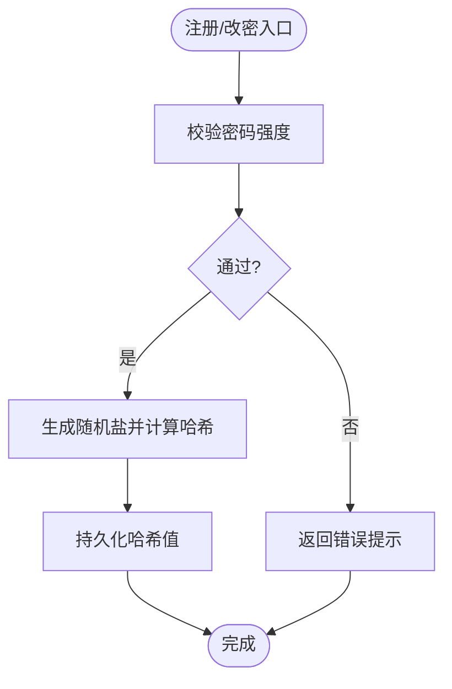
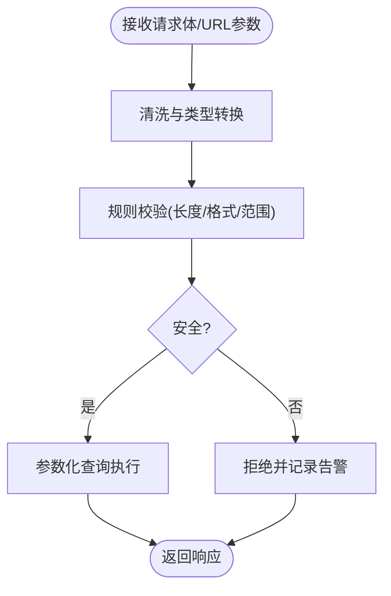
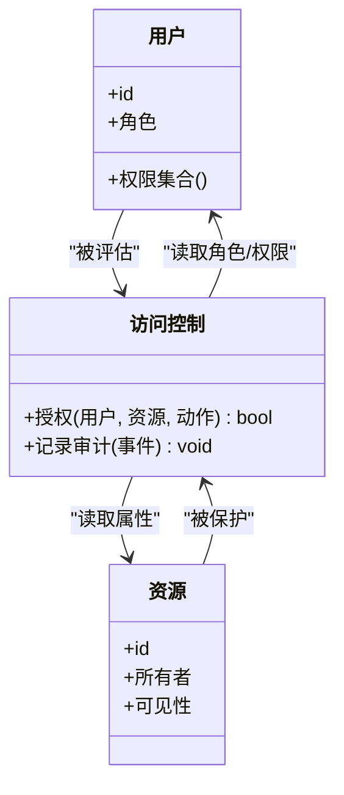
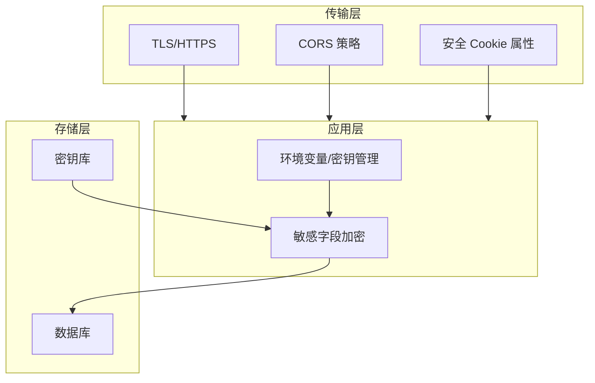
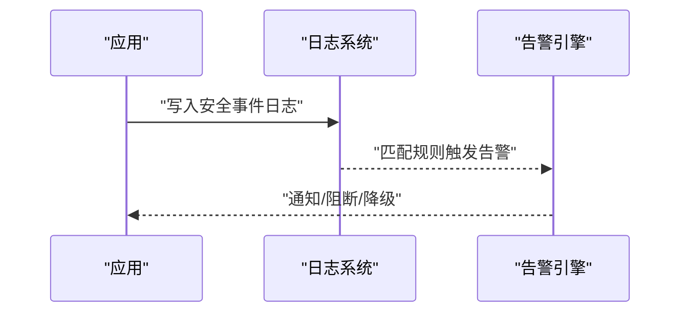
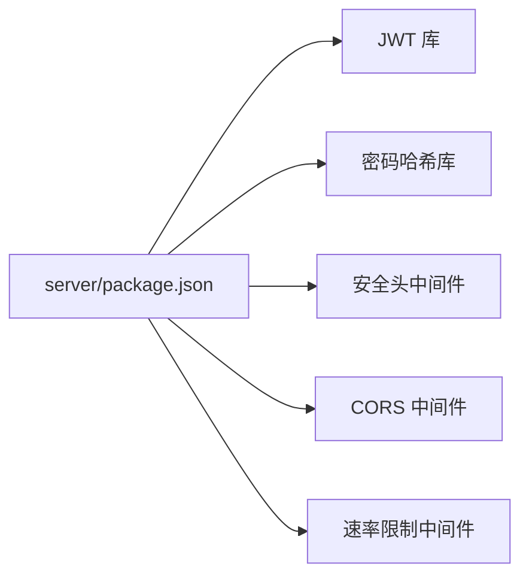

# 安全机制实现

<cite>
**本文引用的文件**   
- [server/src/index.js](file://server/src/index.js)
- [server/src/middleware/auth.js](file://server/src/middleware/auth.js)
- [server/src/routes/auth.js](file://server/src/routes/auth.js)
- [server/src/db.js](file://server/src/db.js)
- [server/src/db-sqlite.js](file://server/src/db-sqlite.js)
- [server/package.json](file://server/package.json)
</cite>

## 目录
1. [简介](#简介)
2. [项目结构](#项目结构)
3. [核心组件](#核心组件)
4. [架构总览](#架构总览)
5. [详细组件分析](#详细组件分析)
6. [依赖分析](#依赖分析)
7. [性能考虑](#性能考虑)
8. [故障排查指南](#故障排查指南)
9. [结论](#结论)
10. [附录](#附录) 

## 简介
本文件面向后端服务的安全机制实现与最佳实践，围绕以下主题展开：JWT认证（令牌生成、验证与刷新）、密码安全处理（哈希算法、盐值与强度校验）、输入验证与过滤（XSS/SQL注入/CSRF防护）、访问控制（角色权限、资源访问与操作审计）、数据安全（敏感数据加密、传输与存储安全）、安全监控与日志（事件检测、异常分析与合规报告），以及安全配置与环境管理。文档同时提供架构图、流程图和时序图，帮助读者快速理解并落地实施。

## 项目结构
后端采用Express风格的路由与中间件组织方式，关键安全相关代码位于 server 目录：
- 应用入口与全局中间件注册：server/src/index.js
- 认证中间件（鉴权）：server/src/middleware/auth.js
- 认证路由（登录/注册等）：server/src/routes/auth.js
- 数据库连接与查询封装：server/src/db.js、server/src/db-sqlite.js
- 依赖声明：server/package.json

图表来源
- [server/src/index.js](file://server/src/index.js)
- [server/src/middleware/auth.js](file://server/src/middleware/auth.js)
- [server/src/routes/auth.js](file://server/src/routes/auth.js)
- [server/src/db.js](file://server/src/db.js)
- [server/src/db-sqlite.js](file://server/src/db-sqlite.js)

章节来源
- [server/src/index.js](file://server/src/index.js)
- [server/src/middleware/auth.js](file://server/src/middleware/auth.js)
- [server/src/routes/auth.js](file://server/src/routes/auth.js)
- [server/src/db.js](file://server/src/db.js)
- [server/src/db-sqlite.js](file://server/src/db-sqlite.js)

## 核心组件
- 认证中间件：负责解析请求头中的令牌、校验签名与有效期，并将用户上下文注入后续处理器。
- 认证路由：提供注册、登录、登出、刷新等接口，负责密码哈希与令牌签发。
- 数据库层：统一封装参数化查询，避免拼接SQL；提供事务与错误处理。
- 应用入口：集中注册安全相关中间件（如CORS、速率限制、Helmet等）与路由。

章节来源
- [server/src/middleware/auth.js](file://server/src/middleware/auth.js)
- [server/src/routes/auth.js](file://server/src/routes/auth.js)
- [server/src/db.js](file://server/src/db.js)
- [server/src/db-sqlite.js](file://server/src/db-sqlite.js)
- [server/src/index.js](file://server/src/index.js)

## 架构总览
下图展示从客户端到数据库的端到端调用链与安全控制点：

图表来源
- [server/src/index.js](file://server/src/index.js)
- [server/src/middleware/auth.js](file://server/src/middleware/auth.js)
- [server/src/routes/auth.js](file://server/src/routes/auth.js)
- [server/src/db.js](file://server/src/db.js)
- [server/src/db-sqlite.js](file://server/src/db-sqlite.js)

## 详细组件分析

### JWT 认证机制（生成、验证与刷新）
- 令牌生成
  - 在认证路由中完成用户身份核验后签发JWT，载荷包含最小必要信息（如用户标识、角色）。
  - 使用强随机密钥，设置合理过期时间，必要时启用黑名单或短期有效+刷新令牌策略。
- 令牌验证
  - 认证中间件统一解析Authorization头，校验签名、过期时间与吊销状态。
  - 校验失败时返回明确的状态码与错误信息，避免泄露内部细节。
- 刷新策略
  - 建议采用“短时效访问令牌 + 长时效刷新令牌”的组合，刷新接口需绑定会话上下文与设备指纹，支持撤销与限流。

图表来源
- [server/src/middleware/auth.js](file://server/src/middleware/auth.js)
- [server/src/routes/auth.js](file://server/src/routes/auth.js)

章节来源
- [server/src/middleware/auth.js](file://server/src/middleware/auth.js)
- [server/src/routes/auth.js](file://server/src/routes/auth.js)

### 密码安全处理（哈希、盐值与强度校验）
- 哈希算法
  - 使用抗暴力破解的算法（如bcrypt/argon2），为每个密码独立生成随机盐值。
- 强度校验
  - 在服务端对注册/修改密码进行长度、复杂度与常见弱口令检查。
- 存储规范
  - 仅存储哈希值，不存储明文；禁止将哈希值作为JWT载荷。

图表来源
- [server/src/routes/auth.js](file://server/src/routes/auth.js)

章节来源
- [server/src/routes/auth.js](file://server/src/routes/auth.js)

### 输入验证与过滤（XSS/SQL注入/CSRF）
- XSS防护
  - 服务端输出前对富文本进行白名单过滤或转义；前端渲染侧启用安全的Markdown渲染器。
- SQL注入防护
  - 所有数据库查询必须使用参数化语句，禁止字符串拼接；对复杂查询构建器进行严格类型约束。
- CSRF防护
  - 对状态变更接口启用同源校验与可选的自定义Header或Token校验；跨域场景下谨慎配置Cookie与CORS。

图表来源
- [server/src/db.js](file://server/src/db.js)
- [server/src/db-sqlite.js](file://server/src/db-sqlite.js)

章节来源
- [server/src/db.js](file://server/src/db.js)
- [server/src/db-sqlite.js](file://server/src/db-sqlite.js)

### 访问控制（角色权限、资源访问与操作审计）
- 角色与权限
  - 基于角色的访问控制（RBAC）：在JWT载荷中携带角色，结合资源级权限表进行决策。
- 资源访问控制
  - 在路由层或控制器内校验当前用户对目标资源的归属与权限。
- 操作审计
  - 对关键写操作记录审计日志（操作者、时间、IP、动作、对象ID），便于追溯与合规。

图表来源
- [server/src/middleware/auth.js](file://server/src/middleware/auth.js)
- [server/src/routes/auth.js](file://server/src/routes/auth.js)

章节来源
- [server/src/middleware/auth.js](file://server/src/middleware/auth.js)
- [server/src/routes/auth.js](file://server/src/routes/auth.js)

### 数据安全保护（敏感数据加密、传输与存储）
- 传输安全
  - 强制HTTPS；配置严格的CORS策略；启用HSTS与安全的Cookie属性（Secure/SameSite）。
- 存储安全
  - 对敏感字段（如手机号、邮箱、第三方凭证）进行加密存储；密钥与数据分离管理。
- 密钥管理
  - 使用环境变量或密钥管理服务；定期轮换；禁止硬编码。

图表来源
- [server/src/index.js](file://server/src/index.js)
- [server/package.json](file://server/package.json)

章节来源
- [server/src/index.js](file://server/src/index.js)
- [server/package.json](file://server/package.json)

### 安全监控与日志（事件检测、异常分析与合规报告）
- 安全事件
  - 记录登录失败、越权尝试、异常频率等事件，聚合至日志系统。
- 异常行为分析
  - 基于阈值与规则触发告警（如短时间内多次失败、异地登录）。
- 合规报告
  - 定期导出审计报表，满足留存周期与可追溯要求。

图表来源
- [server/src/index.js](file://server/src/index.js)

章节来源
- [server/src/index.js](file://server/src/index.js)

## 依赖分析
后端安全相关依赖主要来源于 package.json 中声明的包，例如用于JWT、密码哈希、安全头与CORS等的库。建议在部署前核对版本与已知漏洞清单。

图表来源
- [server/package.json](file://server/package.json)

章节来源
- [server/package.json](file://server/package.json)

## 性能考虑
- 令牌校验应尽可能轻量，避免重复I/O；必要时引入内存缓存（如Redis）做黑名单或会话状态。
- 密码哈希选择合适的工作因子，平衡安全性与CPU开销。
- 数据库查询务必参数化且命中索引，避免全表扫描导致的延迟放大。
- 对高频接口启用速率限制与缓存，降低被滥用风险。

[本节为通用指导，无需源码引用]

## 故障排查指南
- 认证失败
  - 检查JWT签名与过期时间；确认中间件是否正确解析Authorization头。
- 权限不足
  - 核查JWT载荷中的角色与资源权限映射；确认路由层的授权逻辑。
- 数据库错误
  - 确认所有查询均为参数化；查看错误堆栈与SQL日志定位问题。
- 跨域与Cookie
  - 检查CORS配置与Cookie的SameSite/Secure属性是否符合部署环境。

章节来源
- [server/src/middleware/auth.js](file://server/src/middleware/auth.js)
- [server/src/db.js](file://server/src/db.js)
- [server/src/db-sqlite.js](file://server/src/db-sqlite.js)

## 结论
本项目在后端层面已具备基础的安全能力：基于JWT的身份认证、参数化查询与中间件化的安全控制。建议进一步完善刷新令牌策略、细粒度RBAC、全面的审计日志与密钥轮换机制，并通过自动化测试与渗透测试持续验证安全有效性。

[本节为总结性内容，无需源码引用]

## 附录

### 安全配置指南
- 环境变量管理
  - 使用.env或密钥管理服务存放JWT密钥、数据库凭据与第三方密钥；禁止提交到版本库。
- 密钥轮换
  - 制定轮换计划，支持多密钥并行期，确保旧令牌平滑过渡。
- 安全检查清单
  - 强制HTTPS与严格CORS
  - 启用安全头（HSTS、X-Content-Type-Options等）
  - 对所有输入进行校验与转义
  - 全面参数化查询
  - 开启速率限制与登录失败锁定
  - 完善审计日志与告警
  - 定期依赖漏洞扫描与更新

[本节为通用指导，无需源码引用]