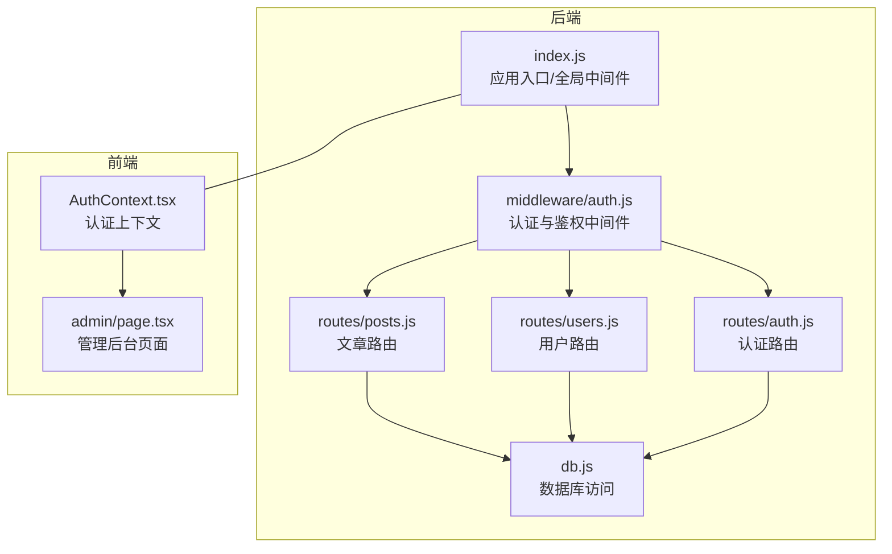
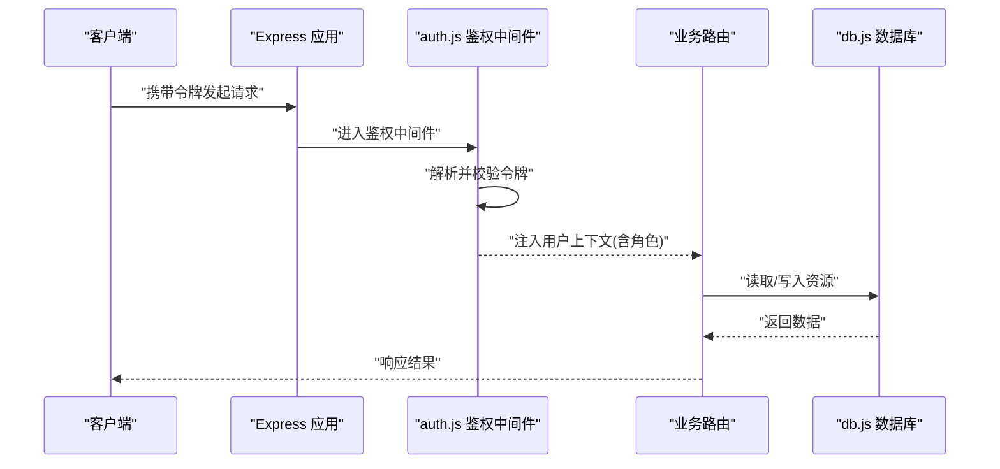
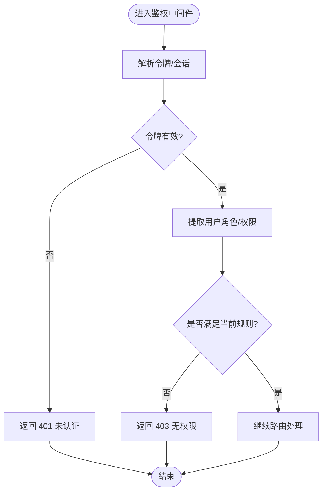
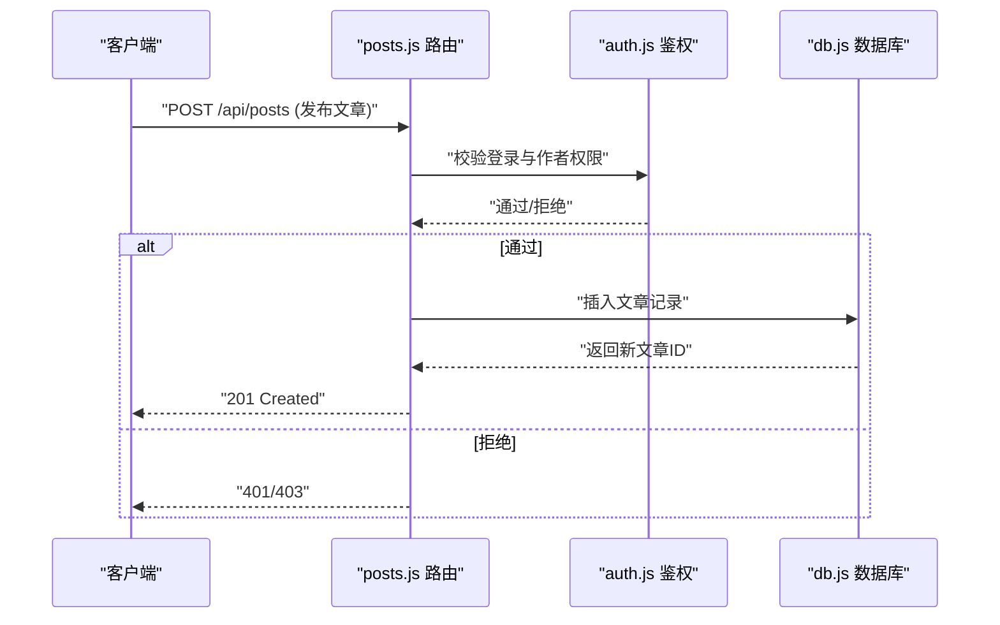
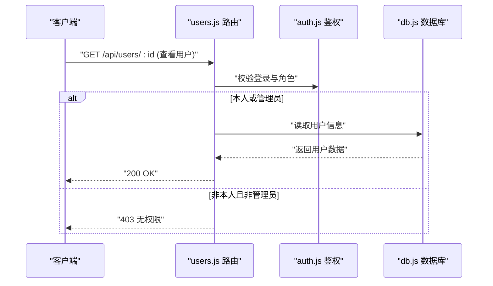
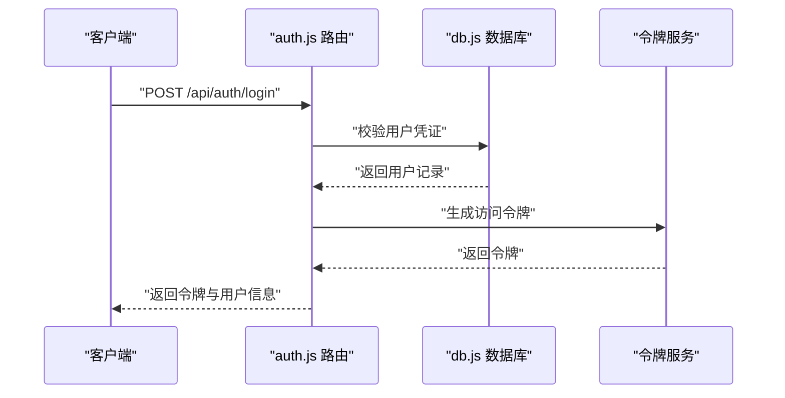
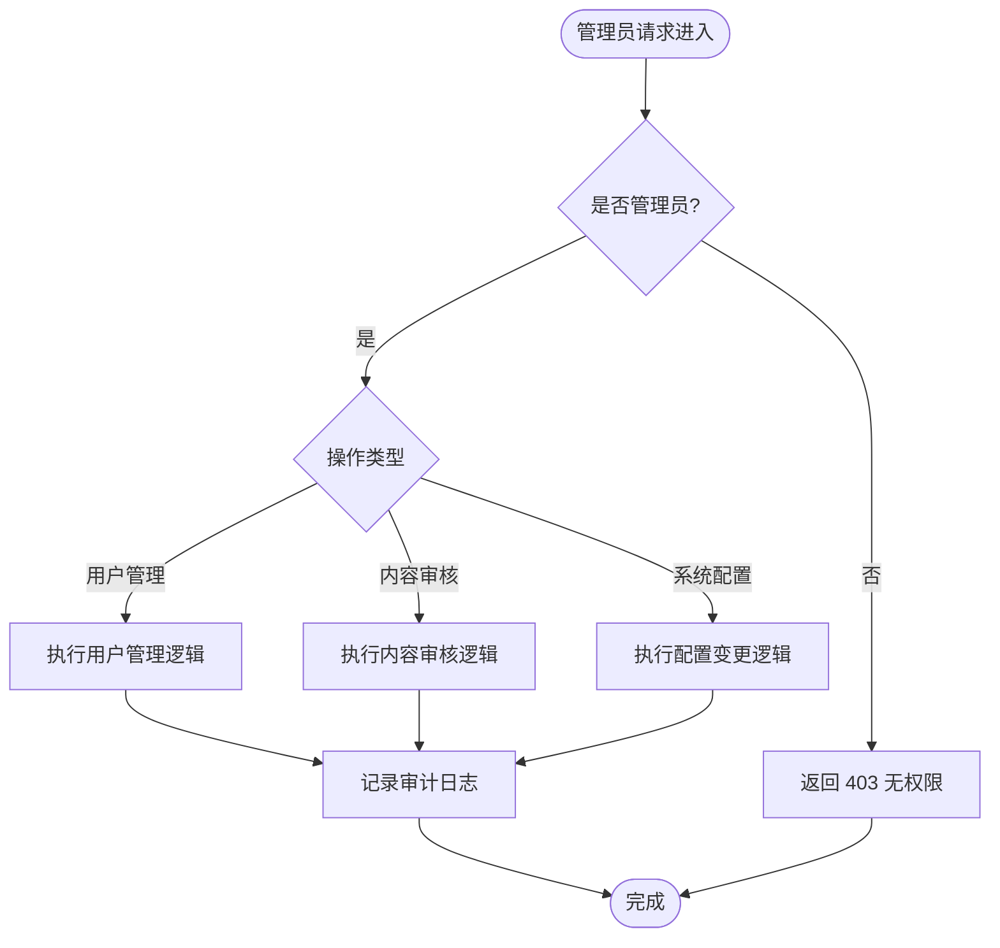
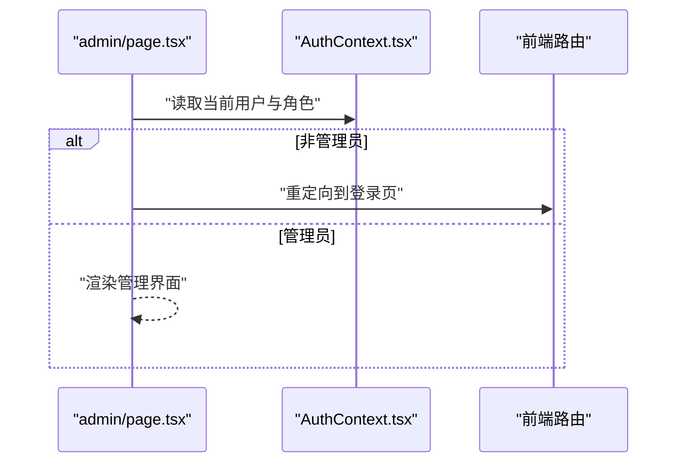
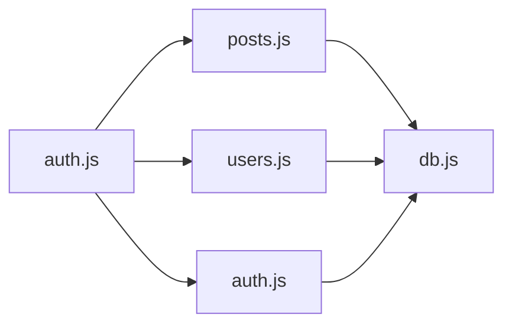

# 授权控制机制

<cite>
**本文引用的文件**   
- [server/src/middleware/auth.js](file://server/src/middleware/auth.js)
- [server/src/routes/posts.js](file://server/src/routes/posts.js)
- [server/src/routes/users.js](file://server/src/routes/users.js)
- [server/src/routes/auth.js](file://server/src/routes/auth.js)
- [server/src/index.js](file://server/src/index.js)
- [server/src/db.js](file://server/src/db.js)
- [src/context/AuthContext.tsx](file://src/context/AuthContext.tsx)
- [src/app/admin/page.tsx](file://src/app/admin/page.tsx)
</cite>

## 目录
1. [简介](#简介)
2. [项目结构](#项目结构)
3. [核心组件](#核心组件)
4. [架构总览](#架构总览)
5. [详细组件分析](#详细组件分析)
6. [依赖分析](#依赖分析)
7. [性能考虑](#性能考虑)
8. [故障排查指南](#故障排查指南)
9. [结论](#结论)
10. [附录](#附录)

## 简介
本文件面向“基于角色的访问控制（RBAC）”的授权控制机制，覆盖以下目标：
- 角色定义与权限差异：普通用户、作者、管理员三类角色的能力边界。
- 资源访问控制：文章读写、用户信息访问、操作权限验证。
- 权限检查中间件：路由级与API级的权限校验流程。
- 管理员特殊处理：用户管理、内容审核、系统配置等。
- 权限配置指南：角色定义、权限分配与动态权限控制。
- 权限审计日志：记录用户的访问与操作行为。

## 项目结构
后端采用 Express 风格的路由与中间件组织方式，认证与鉴权集中在中间件层，路由层按领域划分；前端通过上下文提供登录态与角色信息，并在受保护页面进行前置判断。

图表来源
- [server/src/index.js](file://server/src/index.js)
- [server/src/middleware/auth.js](file://server/src/middleware/auth.js)
- [server/src/routes/posts.js](file://server/src/routes/posts.js)
- [server/src/routes/users.js](file://server/src/routes/users.js)
- [server/src/routes/auth.js](file://server/src/routes/auth.js)
- [server/src/db.js](file://server/src/db.js)
- [src/context/AuthContext.tsx](file://src/context/AuthContext.tsx)
- [src/app/admin/page.tsx](file://src/app/admin/page.tsx)

章节来源
- [server/src/index.js](file://server/src/index.js)
- [server/src/middleware/auth.js](file://server/src/middleware/auth.js)
- [server/src/routes/posts.js](file://server/src/routes/posts.js)
- [server/src/routes/users.js](file://server/src/routes/users.js)
- [server/src/routes/auth.js](file://server/src/routes/auth.js)
- [server/src/db.js](file://server/src/db.js)
- [src/context/AuthContext.tsx](file://src/context/AuthContext.tsx)
- [src/app/admin/page.tsx](file://src/app/admin/page.tsx)

## 核心组件
- 认证与鉴权中间件：负责解析请求令牌、校验身份、注入用户上下文、执行角色与权限判定。
- 路由层：在文章、用户、认证等路由中组合使用鉴权中间件，实现细粒度访问控制。
- 数据访问层：统一数据库连接与查询封装，供各路由调用。
- 前端认证上下文：维护登录态、用户信息与角色，用于前端导航与按钮显隐控制。
- 管理后台页面：作为管理员专属入口的前端守卫示例。

章节来源
- [server/src/middleware/auth.js](file://server/src/middleware/auth.js)
- [server/src/routes/posts.js](file://server/src/routes/posts.js)
- [server/src/routes/users.js](file://server/src/routes/users.js)
- [server/src/routes/auth.js](file://server/src/routes/auth.js)
- [server/src/db.js](file://server/src/db.js)
- [src/context/AuthContext.tsx](file://src/context/AuthContext.tsx)
- [src/app/admin/page.tsx](file://src/app/admin/page.tsx)

## 架构总览
下图展示了从客户端到服务端的关键鉴权路径，包括令牌校验、角色判定、资源级权限检查以及管理员特殊处理的分支。

图表来源
- [server/src/index.js](file://server/src/index.js)
- [server/src/middleware/auth.js](file://server/src/middleware/auth.js)
- [server/src/routes/posts.js](file://server/src/routes/posts.js)
- [server/src/routes/users.js](file://server/src/routes/users.js)
- [server/src/db.js](file://server/src/db.js)

## 详细组件分析

### 角色与权限模型
- 角色集合
  - 普通用户：可浏览公开内容、阅读文章、评论、收藏、点赞、编辑自己的草稿等。
  - 作者：在普通用户基础上，拥有发布文章、编辑自己发布的文章、查看个人统计等能力。
  - 管理员：在作者基础上，具备用户管理、内容审核、系统配置等高级权限。
- 权限维度
  - 资源维度：文章（读/写）、用户信息（读/写）、系统配置（读/写）。
  - 操作维度：创建、更新、删除、审核、导出、重置密码等。
- 角色-权限映射建议
  - 普通用户：read_article, comment, like, favorite, edit_own_draft
  - 作者：+ publish_article, edit_own_article, view_my_stats
  - 管理员：+ manage_users, audit_content, manage_config, export_data, reset_password

[本节为概念性说明，不直接分析具体文件]

### 认证与鉴权中间件（auth.js）
职责
- 解析请求中的认证凭据（如令牌），校验有效性并提取用户标识与角色。
- 将用户上下文挂载到请求对象，供后续路由与控制器使用。
- 提供通用权限检查函数，支持“需要登录”、“需要特定角色”、“需要特定权限”的组合。
- 对未认证或无权限的请求返回标准错误码（如 401/403）。

关键流程
- 令牌校验失败：拒绝访问并返回未认证错误。
- 令牌有效但缺少必要角色/权限：拒绝访问并返回无权限错误。
- 校验通过：继续执行业务路由。

图表来源
- [server/src/middleware/auth.js](file://server/src/middleware/auth.js)

章节来源
- [server/src/middleware/auth.js](file://server/src/middleware/auth.js)

### 文章资源访问控制（posts.js）
- 列表与详情：通常允许匿名或仅要求登录即可访问（读权限）。
- 创建文章：要求登录且具备“发布文章”权限（作者及以上）。
- 更新/删除文章：要求登录且为文章所有者或具备更高权限（作者/管理员）。
- 草稿相关：仅作者本人可编辑自己的草稿。

图表来源
- [server/src/routes/posts.js](file://server/src/routes/posts.js)
- [server/src/middleware/auth.js](file://server/src/middleware/auth.js)
- [server/src/db.js](file://server/src/db.js)

章节来源
- [server/src/routes/posts.js](file://server/src/routes/posts.js)

### 用户信息访问控制（users.js）
- 获取个人信息：仅本人可访问（需登录）。
- 修改个人信息：仅本人可修改（需登录）。
- 管理员接口：管理员可查询用户列表、禁用/启用用户、重置密码等。

图表来源
- [server/src/routes/users.js](file://server/src/routes/users.js)
- [server/src/middleware/auth.js](file://server/src/middleware/auth.js)
- [server/src/db.js](file://server/src/db.js)

章节来源
- [server/src/routes/users.js](file://server/src/routes/users.js)

### 认证路由（auth.js）
- 登录：校验用户名/密码，签发令牌并返回用户基本信息与角色。
- 登出：清除本地令牌与会话状态。
- 刷新令牌：根据刷新令牌换取新的访问令牌。

图表来源
- [server/src/routes/auth.js](file://server/src/routes/auth.js)
- [server/src/db.js](file://server/src/db.js)

章节来源
- [server/src/routes/auth.js](file://server/src/routes/auth.js)

### 管理员权限的特殊处理
- 用户管理：增删改查用户、启用/禁用账号、重置密码。
- 内容审核：批量审核文章/问答、置顶/加精、下架违规内容。
- 系统配置：站点参数、公告、黑白名单、功能开关等。
- 审计与报表：导出访问与操作日志、统计指标。

图表来源
- [server/src/middleware/auth.js](file://server/src/middleware/auth.js)
- [server/src/routes/users.js](file://server/src/routes/users.js)

章节来源
- [server/src/middleware/auth.js](file://server/src/middleware/auth.js)
- [server/src/routes/users.js](file://server/src/routes/users.js)

### 前端权限控制（AuthContext 与管理后台）
- 认证上下文：集中管理登录态、用户信息与角色，提供 isLogin、isAdmin 等便捷方法。
- 页面守卫：在受保护页面（如管理后台）加载前检查角色，未达标则重定向至登录页。
- UI 控制：根据角色动态显示/隐藏敏感操作按钮与菜单项。

图表来源
- [src/context/AuthContext.tsx](file://src/context/AuthContext.tsx)
- [src/app/admin/page.tsx](file://src/app/admin/page.tsx)

章节来源
- [src/context/AuthContext.tsx](file://src/context/AuthContext.tsx)
- [src/app/admin/page.tsx](file://src/app/admin/page.tsx)

## 依赖分析
- 中间件与路由耦合度
  - auth.js 被多个路由复用，形成统一的鉴权入口，降低重复代码。
  - posts.js、users.js、auth.js 均依赖 db.js 的数据访问能力。
- 外部依赖
  - 数据库驱动与连接池由 db.js 统一管理。
  - 前端通过 AuthContext 与后端认证接口协作。

图表来源
- [server/src/middleware/auth.js](file://server/src/middleware/auth.js)
- [server/src/routes/posts.js](file://server/src/routes/posts.js)
- [server/src/routes/users.js](file://server/src/routes/users.js)
- [server/src/routes/auth.js](file://server/src/routes/auth.js)
- [server/src/db.js](file://server/src/db.js)

章节来源
- [server/src/middleware/auth.js](file://server/src/middleware/auth.js)
- [server/src/routes/posts.js](file://server/src/routes/posts.js)
- [server/src/routes/users.js](file://server/src/routes/users.js)
- [server/src/routes/auth.js](file://server/src/routes/auth.js)
- [server/src/db.js](file://server/src/db.js)

## 性能考虑
- 令牌校验缓存：对高频访问的公共接口，可在内存或缓存层缓存用户角色与权限，减少数据库查询。
- 最小化鉴权范围：仅在必要时进行角色/权限检查，避免对只读列表接口做冗余校验。
- 批量操作优化：管理员批量审核时，尽量合并数据库事务，减少往返次数。
- 分页与索引：对用户列表、文章列表等接口做好分页与索引优化，避免全表扫描。

[本节为通用指导，不直接分析具体文件]

## 故障排查指南
- 401 未认证
  - 检查请求是否携带有效令牌，确认令牌过期策略与刷新流程。
  - 核对中间件解析令牌的字段名与签名算法是否与认证路由一致。
- 403 无权限
  - 确认用户角色是否正确，检查路由所需的角色/权限声明。
  - 对于资源级权限（如“仅本人可编辑”），比对当前用户ID与资源归属。
- 管理员接口不可用
  - 确认管理员标志位是否正确设置，检查管理员专用路由是否挂载了管理员校验。
- 审计日志缺失
  - 检查审计日志写入是否成功，确认日志表结构与写入权限。
  - 核对关键操作的埋点是否遗漏。

章节来源
- [server/src/middleware/auth.js](file://server/src/middleware/auth.js)
- [server/src/routes/posts.js](file://server/src/routes/posts.js)
- [server/src/routes/users.js](file://server/src/routes/users.js)
- [server/src/routes/auth.js](file://server/src/routes/auth.js)

## 结论
本方案以中间件为核心，结合路由级与API级权限校验，实现了清晰的 RBAC 模型。通过角色-权限映射与资源级控制，既能满足普通用户与作者的日常需求，又能保障管理员对系统的高权限管控。配合前端上下文与页面守卫，整体授权链路完整、可扩展性强，便于后续引入更细粒度的动态权限与审计追踪。

[本节为总结性内容，不直接分析具体文件]

## 附录

### 权限配置指南
- 角色定义
  - 在用户表中增加 role 字段，枚举值包含 user、author、admin。
  - 在权限表中定义权限键（如 read_article、publish_article、manage_users 等）。
- 权限分配
  - 默认注册为用户，作者可通过申请或后台授予，管理员由超级管理员授予。
  - 支持多角色叠加与继承关系（如 admin 自动拥有 author 与 user 的全部权限）。
- 动态权限控制
  - 在中间件中提供 withPermission(requiredPermissions) 装饰器，按需组合权限。
  - 支持条件权限（如“仅本人可编辑”、“仅管理员可删除”）。
- 审计日志
  - 在鉴权中间件或路由层统一记录：时间戳、用户ID、角色、IP、请求路径、HTTP方法、操作结果、失败原因。
  - 对敏感操作（用户管理、内容审核、系统配置）强制记录并保留较长周期。

[本节为概念性说明，不直接分析具体文件]