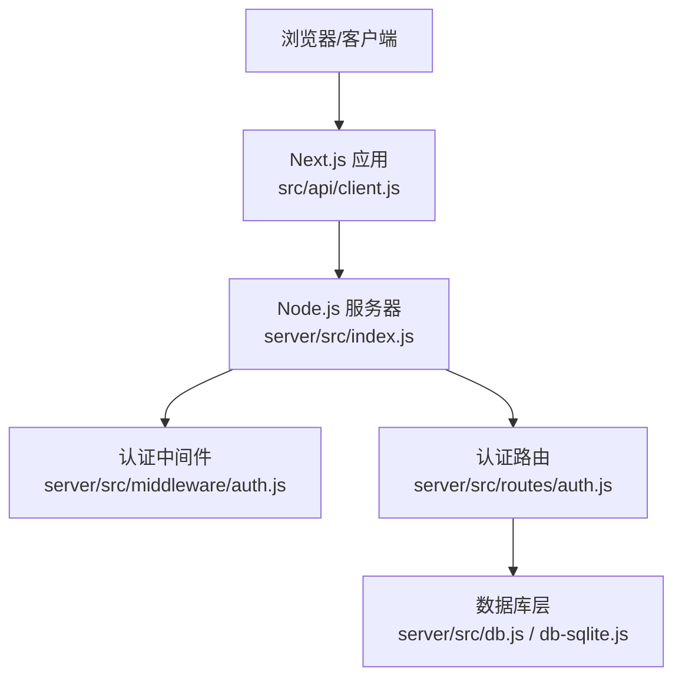
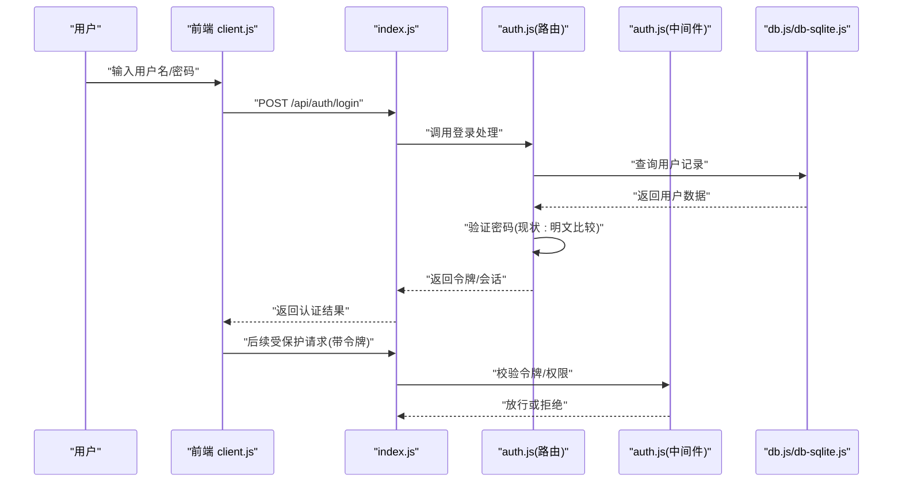
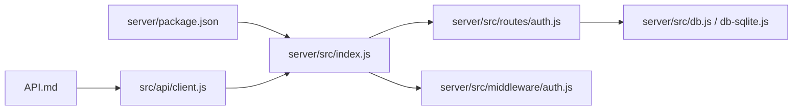

# 数据安全保护

<cite>
**本文引用的文件**   
- [server/src/index.js](file://server/src/index.js)
- [server/src/middleware/auth.js](file://server/src/middleware/auth.js)
- [server/src/routes/auth.js](file://server/src/routes/auth.js)
- [server/src/db.js](file://server/src/db.js)
- [server/src/db-sqlite.js](file://server/src/db-sqlite.js)
- [server/package.json](file://server/package.json)
- [src/api/client.js](file://src/api/client.js)
- [API.md](file://API.md)
</cite>

## 目录
1. [简介](#简介)
2. [项目结构](#项目结构)
3. [核心组件](#核心组件)
4. [架构总览](#架构总览)
5. [详细组件分析](#详细组件分析)
6. [依赖关系分析](#依赖关系分析)
7. [性能与安全权衡](#性能与安全权衡)
8. [故障排查指南](#故障排查指南)
9. [结论](#结论)
10. [附录：安全配置清单与最佳实践](#附录安全配置清单与最佳实践)

## 简介
本文件面向本项目（博客问答系统）的数据安全保护，聚焦以下方面：
- 密码安全存储：哈希算法、盐值策略、强度校验
- 敏感数据加密：用户个人信息、数据库字段、配置文件密钥
- 数据传输安全：HTTPS、SSL/TLS证书管理、HTTP响应头安全
- 数据库安全：连接池、参数化查询、备份加密
- API 安全：频率限制、参数校验、响应脱敏
- 安全配置：环境变量、密钥轮换、安全检查清单

说明：当前仓库未实现生产级安全能力（如 HTTPS、bcrypt、参数化查询等），本文在“现状”基础上给出“改进建议”，并标注对应代码位置以便落地。

## 项目结构
后端服务位于 server 目录，前端位于 src 目录。关键安全相关路径：
- 服务端入口与中间件：server/src/index.js、server/src/middleware/auth.js
- 认证路由：server/src/routes/auth.js
- 数据库连接与迁移：server/src/db.js、server/src/db-sqlite.js
- 前端 API 客户端：src/api/client.js
- 接口文档：API.md
- 依赖声明：server/package.json

图表来源
- [server/src/index.js](file://server/src/index.js)
- [server/src/middleware/auth.js](file://server/src/middleware/auth.js)
- [server/src/routes/auth.js](file://server/src/routes/auth.js)
- [server/src/db.js](file://server/src/db.js)
- [server/src/db-sqlite.js](file://server/src/db-sqlite.js)
- [src/api/client.js](file://src/api/client.js)

章节来源
- [server/src/index.js](file://server/src/index.js)
- [server/src/middleware/auth.js](file://server/src/middleware/auth.js)
- [server/src/routes/auth.js](file://server/src/routes/auth.js)
- [server/src/db.js](file://server/src/db.js)
- [server/src/db-sqlite.js](file://server/src/db-sqlite.js)
- [src/api/client.js](file://src/api/client.js)
- [API.md](file://API.md)

## 核心组件
- 认证中间件：负责鉴权逻辑与权限控制，当前基于会话或令牌的状态判断。
- 认证路由：处理注册/登录流程，包含密码处理与用户信息存取。
- 数据库层：封装 SQLite 连接与查询执行。
- 前端 API 客户端：统一发起 HTTP 请求，携带认证凭据。

章节来源
- [server/src/middleware/auth.js](file://server/src/middleware/auth.js)
- [server/src/routes/auth.js](file://server/src/routes/auth.js)
- [server/src/db.js](file://server/src/db.js)
- [server/src/db-sqlite.js](file://server/src/db-sqlite.js)
- [src/api/client.js](file://src/api/client.js)

## 架构总览
下图展示从前端到后端的请求链路及关键安全点（当前多为待改进项）。

图表来源
- [server/src/index.js](file://server/src/index.js)
- [server/src/routes/auth.js](file://server/src/routes/auth.js)
- [server/src/middleware/auth.js](file://server/src/middleware/auth.js)
- [server/src/db.js](file://server/src/db.js)
- [server/src/db-sqlite.js](file://server/src/db-sqlite.js)
- [src/api/client.js](file://src/api/client.js)

## 详细组件分析

### 密码安全存储（现状与建议）
- 现状
  - 认证路由中涉及密码比对逻辑，当前为明文比较，存在严重安全风险。
  - 未使用 bcrypt 或其他抗碰撞的哈希算法；无独立盐值生成与存储。
  - 未实施密码强度校验（长度、复杂度、黑名单等）。
- 风险
  - 一旦数据库泄露，所有用户口令可被离线破解。
  - 撞库与彩虹表攻击成本低。
- 改进建议
  - 采用 bcrypt 进行密码哈希，确保每次哈希自动引入随机盐值。
  - 增加密码强度校验规则（最小长度、大小写/数字/特殊字符组合、常见弱口令黑名单）。
  - 对登录失败次数进行限流与锁定策略，防止暴力破解。
  - 将旧明文密码在下次成功登录后迁移至 bcrypt 哈希。
- 参考实现位置
  - 认证路由中的密码处理逻辑：[server/src/routes/auth.js](file://server/src/routes/auth.js)
  - 认证中间件的鉴权逻辑：[server/src/middleware/auth.js](file://server/src/middleware/auth.js)

章节来源
- [server/src/routes/auth.js](file://server/src/routes/auth.js)
- [server/src/middleware/auth.js](file://server/src/middleware/auth.js)

### 敏感数据加密（现状与建议）
- 现状
  - 用户个人信息（如邮箱、手机号等）以明文形式存储于数据库中。
  - 配置文件与密钥未通过环境变量或密钥管理服务注入。
- 风险
  - 数据库泄露导致隐私数据直接暴露。
  - 配置文件泄露导致系统凭据被滥用。
- 改进建议
  - 对高敏感字段（身份证、手机号、邮箱、地址等）进行字段级加密（AES-GCM 或同构加密库），密钥由环境变量或 KMS 提供。
  - 数据库层面启用透明数据加密（TDE）或文件系统级加密（如 LUKS）。
  - 配置文件与密钥一律通过环境变量注入，禁止硬编码与提交到版本库。
  - 日志中避免输出敏感字段，必要时做脱敏处理。
- 参考实现位置
  - 数据库连接与查询封装：[server/src/db.js](file://server/src/db.js)、[server/src/db-sqlite.js](file://server/src/db-sqlite.js)
  - 前端 API 客户端（注意不缓存敏感数据）：[src/api/client.js](file://src/api/client.js)

章节来源
- [server/src/db.js](file://server/src/db.js)
- [server/src/db-sqlite.js](file://server/src/db-sqlite.js)
- [src/api/client.js](file://src/api/client.js)

### 数据传输安全（现状与建议）
- 现状
  - 当前未启用 HTTPS，前后端通信可能为明文 HTTP。
  - 未设置严格的安全响应头（HSTS、CSP、X-Frame-Options 等）。
- 风险
  - 中间人窃听与篡改。
  - 点击劫持、跨站脚本等风险上升。
- 改进建议
  - 部署反向代理（Nginx/Caddy）终止 TLS，强制 HTTPS，开启 HSTS。
  - 配置安全响应头：Strict-Transport-Security、Content-Security-Policy、X-Content-Type-Options、X-Frame-Options、Referrer-Policy、Permissions-Policy。
  - 禁用不安全 Cookie 属性，启用 Secure、SameSite=Strict/Lax。
  - 定期更新 SSL 证书，自动化续期（如 Let's Encrypt）。
- 参考实现位置
  - 服务器入口（用于挂载安全中间件与 HTTPS 监听）：[server/src/index.js](file://server/src/index.js)

章节来源
- [server/src/index.js](file://server/src/index.js)

### 数据库安全（现状与建议）
- 现状
  - 使用 SQLite 作为数据存储，连接与查询封装在 db.js/db-sqlite.js。
  - 查询拼接方式存在 SQL 注入风险（需确认是否已参数化）。
- 风险
  - SQL 注入可导致数据泄露与破坏。
  - 本地文件型数据库备份若未加密，泄露风险高。
- 改进建议
  - 全面使用参数化查询，杜绝字符串拼接。
  - 最小权限原则运行数据库进程，限制文件系统访问。
  - 启用数据库文件加密或磁盘加密；备份文件加密存储并限制访问。
  - 审计与告警：记录异常查询与错误堆栈（脱敏）。
- 参考实现位置
  - 数据库连接与执行封装：[server/src/db.js](file://server/src/db.js)、[server/src/db-sqlite.js](file://server/src/db-sqlite.js)

章节来源
- [server/src/db.js](file://server/src/db.js)
- [server/src/db-sqlite.js](file://server/src/db-sqlite.js)

### API 安全（现状与建议）
- 现状
  - 认证流程通过中间件校验令牌/会话，但未见全局速率限制与严格的参数校验。
  - 部分接口可能返回过多敏感字段。
- 风险
  - 暴力破解、枚举攻击、资源耗尽。
  - 敏感信息泄露。
- 改进建议
  - 全局速率限制（按 IP/用户维度），针对登录、注册、重置密码等高风险接口更严格。
  - 输入校验：白名单校验、类型与长度限制、SQL 注入/XSS 防护。
  - 响应脱敏：移除内部标识、调试信息、完整邮箱/手机号等。
  - 统一错误格式，避免泄露堆栈与内部路径。
- 参考实现位置
  - 认证中间件：[server/src/middleware/auth.js](file://server/src/middleware/auth.js)
  - 认证路由：[server/src/routes/auth.js](file://server/src/routes/auth.js)
  - 接口文档（便于核对返回字段）：[API.md](file://API.md)

章节来源
- [server/src/middleware/auth.js](file://server/src/middleware/auth.js)
- [server/src/routes/auth.js](file://server/src/routes/auth.js)
- [API.md](file://API.md)

### 前端 API 客户端安全（现状与建议）
- 现状
  - 前端通过统一客户端发起请求，需确保不持久化敏感数据，合理设置超时与重试。
- 风险
  - 内存泄漏、意外缓存敏感数据。
- 改进建议
  - 不在 localStorage/sessionStorage 中保存敏感数据；令牌仅存内存或 HttpOnly Cookie。
  - 统一拦截器添加必要安全头与超时控制。
  - 避免在控制台打印敏感信息。
- 参考实现位置
  - 前端 API 客户端：[src/api/client.js](file://src/api/client.js)

章节来源
- [src/api/client.js](file://src/api/client.js)

## 依赖关系分析
- 认证与鉴权：认证路由依赖数据库层；中间件依赖认证状态。
- 传输层：前端客户端依赖后端接口契约（API.md）。
- 运行时依赖：server/package.json 声明了 Node 依赖，需关注安全更新。

图表来源
- [server/package.json](file://server/package.json)
- [server/src/index.js](file://server/src/index.js)
- [server/src/routes/auth.js](file://server/src/routes/auth.js)
- [server/src/middleware/auth.js](file://server/src/middleware/auth.js)
- [server/src/db.js](file://server/src/db.js)
- [server/src/db-sqlite.js](file://server/src/db-sqlite.js)
- [src/api/client.js](file://src/api/client.js)
- [API.md](file://API.md)

章节来源
- [server/package.json](file://server/package.json)
- [server/src/index.js](file://server/src/index.js)
- [server/src/routes/auth.js](file://server/src/routes/auth.js)
- [server/src/middleware/auth.js](file://server/src/middleware/auth.js)
- [server/src/db.js](file://server/src/db.js)
- [server/src/db-sqlite.js](file://server/src/db-sqlite.js)
- [src/api/client.js](file://src/api/client.js)
- [API.md](file://API.md)

## 性能与安全权衡
- 密码哈希：bcrypt 计算开销大，应结合并发与缓存策略，避免阻塞主线程。
- 字段级加密：加解密带来 CPU 与 I/O 开销，建议按需加密、批量处理与索引优化。
- 速率限制：在高并发下需考虑分布式限流与滑动窗口算法，避免单点瓶颈。
- HTTPS 与压缩：TLS 握手与压缩会消耗 CPU，建议合理选择套件与协议版本，启用会话复用。

## 故障排查指南
- 登录失败频繁
  - 检查认证中间件与路由的错误分支，确认是否缺少合理的错误消息与限流。
  - 参考位置：[server/src/middleware/auth.js](file://server/src/middleware/auth.js)、[server/src/routes/auth.js](file://server/src/routes/auth.js)
- 数据库连接异常
  - 检查连接参数、权限与文件路径，确认是否启用了参数化查询。
  - 参考位置：[server/src/db.js](file://server/src/db.js)、[server/src/db-sqlite.js](file://server/src/db-sqlite.js)
- 前端请求失败
  - 检查客户端基础 URL、超时与重试策略，确认是否携带必要认证头。
  - 参考位置：[src/api/client.js](file://src/api/client.js)

章节来源
- [server/src/middleware/auth.js](file://server/src/middleware/auth.js)
- [server/src/routes/auth.js](file://server/src/routes/auth.js)
- [server/src/db.js](file://server/src/db.js)
- [server/src/db-sqlite.js](file://server/src/db-sqlite.js)
- [src/api/client.js](file://src/api/client.js)

## 结论
当前项目在安全方面具备基本骨架（认证中间件、数据库封装、统一客户端），但在密码存储、传输加密、参数化查询、速率限制与响应脱敏等方面仍需完善。建议优先落地 bcrypt 密码哈希、HTTPS 与 HSTS、参数化查询与速率限制，并建立密钥管理与轮换机制，逐步提升整体安全水位。

## 附录：安全配置清单与最佳实践
- 密码与身份
  - 使用 bcrypt 进行密码哈希；每次哈希自动生成随机盐值。
  - 实施密码强度校验与弱口令黑名单。
  - 登录失败计数与账户锁定策略。
- 敏感数据
  - 对用户敏感字段进行字段级加密；密钥通过环境变量或 KMS 注入。
  - 日志脱敏，禁止输出敏感信息。
- 传输安全
  - 全站 HTTPS，启用 HSTS；配置强加密套件与 TLS 1.2+。
  - 设置安全响应头（CSP、X-Frame-Options、X-Content-Type-Options、Referrer-Policy、Permissions-Policy）。
  - Cookie 标记 Secure、SameSite、HttpOnly。
- 数据库
  - 全面参数化查询，禁止拼接 SQL。
  - 最小权限运行数据库进程；启用磁盘或数据库文件加密。
  - 备份文件加密存储，限制访问与保留周期。
- API 安全
  - 全局速率限制（IP/用户维度），高风险接口更严格。
  - 输入白名单校验与长度限制；统一错误格式，隐藏内部细节。
  - 响应脱敏，移除不必要字段。
- 配置与运维
  - 环境变量管理，禁止硬编码；密钥轮换策略（定期更换、灰度切换、回滚预案）。
  - 依赖安全扫描与漏洞修复；最小化镜像与容器权限。
  - 审计日志与告警：登录、权限变更、异常错误。