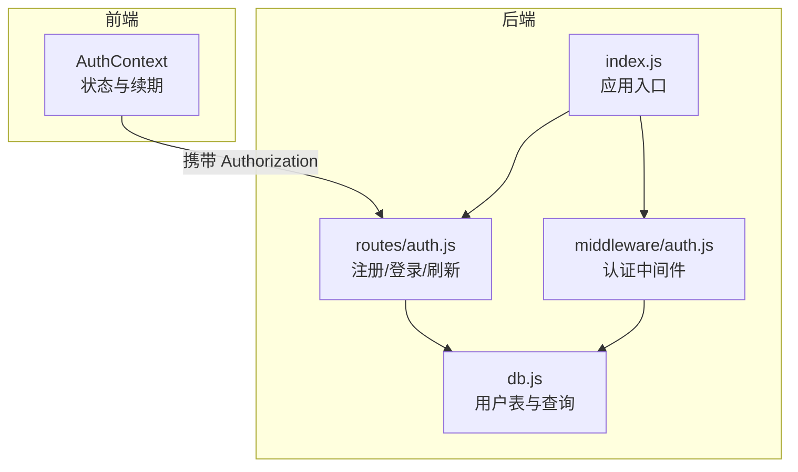
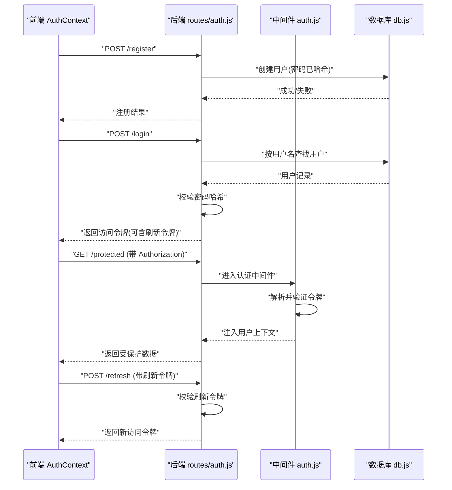
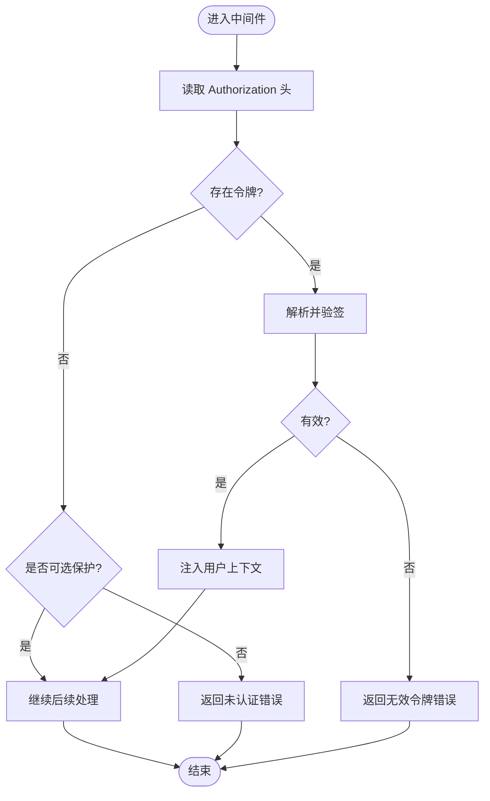
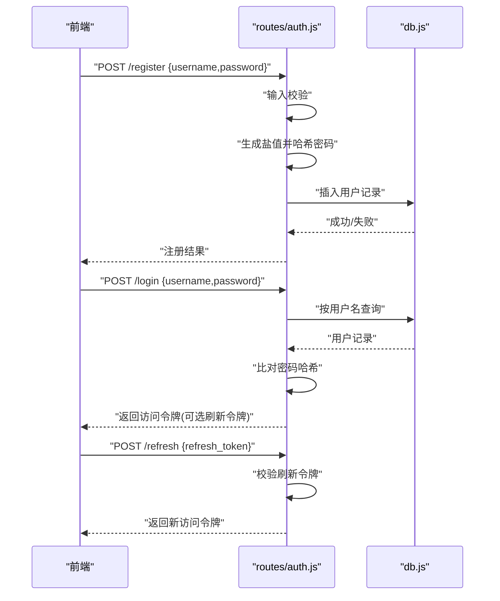
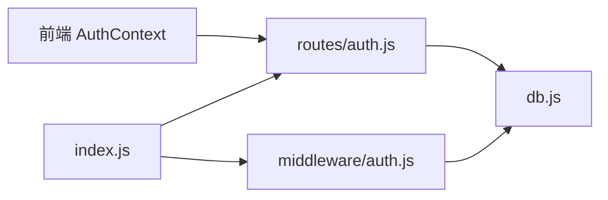

# 认证系统实现

<cite>
**本文引用的文件**   
- [server/src/middleware/auth.js](file://server/src/middleware/auth.js)
- [server/src/routes/auth.js](file://server/src/routes/auth.js)
- [server/src/db.js](file://server/src/db.js)
- [server/src/index.js](file://server/src/index.js)
- [src/context/AuthContext.tsx](file://src/context/AuthContext.tsx)
</cite>

## 目录
1. [简介](#简介)
2. [项目结构](#项目结构)
3. [核心组件](#核心组件)
4. [架构总览](#架构总览)
5. [详细组件分析](#详细组件分析)
6. [依赖分析](#依赖分析)
7. [性能考虑](#性能考虑)
8. [故障排查指南](#故障排查指南)
9. [结论](#结论)
10. [附录](#附录)

## 简介
本文件面向后端与前端开发者，系统化阐述本项目中基于 JWT 的认证机制实现。内容覆盖用户注册与登录流程、密码哈希与盐值处理、JWT 生成/签名/验证/刷新策略、会话管理（令牌存储、过期与续期）、中间件鉴权流程、配置项与安全参数，以及错误处理策略。文档以“渐进式复杂度”组织，既提供高层概览，也给出代码级流程图与依赖关系图，帮助读者快速定位问题并优化实现。

## 项目结构
认证相关的关键位置如下：
- 服务端中间件：用于请求拦截、令牌解析与权限检查
- 服务端路由：暴露注册、登录、刷新等认证接口
- 数据库层：负责用户数据读写（含密码哈希字段）
- 应用入口：挂载认证中间件与路由
- 前端上下文：维护登录态、令牌与自动续期逻辑

图表来源
- [server/src/index.js](file://server/src/index.js)
- [server/src/middleware/auth.js](file://server/src/middleware/auth.js)
- [server/src/routes/auth.js](file://server/src/routes/auth.js)
- [server/src/db.js](file://server/src/db.js)
- [src/context/AuthContext.tsx](file://src/context/AuthContext.tsx)

章节来源
- [server/src/index.js](file://server/src/index.js)
- [server/src/middleware/auth.js](file://server/src/middleware/auth.js)
- [server/src/routes/auth.js](file://server/src/routes/auth.js)
- [server/src/db.js](file://server/src/db.js)
- [src/context/AuthContext.tsx](file://src/context/AuthContext.tsx)

## 核心组件
- 认证中间件：统一校验请求中的令牌，注入用户上下文，支持可选/必选保护
- 认证路由：注册、登录、刷新令牌；返回访问令牌与可选刷新令牌
- 数据库层：用户模型与查询封装，包含密码哈希字段
- 前端上下文：集中管理登录态、令牌生命周期与自动续期

章节来源
- [server/src/middleware/auth.js](file://server/src/middleware/auth.js)
- [server/src/routes/auth.js](file://server/src/routes/auth.js)
- [server/src/db.js](file://server/src/db.js)
- [src/context/AuthContext.tsx](file://src/context/AuthContext.tsx)

## 架构总览
下图展示从前端发起认证请求到后端完成鉴权的端到端流程，包括注册、登录、受保护资源访问与令牌刷新。

图表来源
- [server/src/routes/auth.js](file://server/src/routes/auth.js)
- [server/src/middleware/auth.js](file://server/src/middleware/auth.js)
- [server/src/db.js](file://server/src/db.js)
- [src/context/AuthContext.tsx](file://src/context/AuthContext.tsx)

## 详细组件分析

### 认证中间件（请求拦截、令牌解析、权限检查）
职责
- 从请求头提取令牌并进行签名与有效期校验
- 将解析出的用户信息注入请求上下文
- 支持可选/必选保护模式，未通过时返回标准错误响应

关键流程
- 读取 Authorization 头
- 校验格式与签名
- 校验过期时间
- 根据配置决定是否放行或拒绝
- 向后续处理器注入用户上下文

图表来源
- [server/src/middleware/auth.js](file://server/src/middleware/auth.js)

章节来源
- [server/src/middleware/auth.js](file://server/src/middleware/auth.js)

### 认证路由（注册、登录、刷新）
职责
- 注册：接收用户名与明文密码，进行必要校验后写入数据库（密码需哈希）
- 登录：按用户名查用户，比对密码哈希，签发访问令牌（可选签发刷新令牌）
- 刷新：校验刷新令牌，签发新的访问令牌

关键流程
- 输入校验（非空、长度、格式等）
- 密码哈希与盐值处理（注册时）
- 登录时密码比对
- 签发与刷新令牌（含过期时间控制）
- 返回标准化响应体

图表来源
- [server/src/routes/auth.js](file://server/src/routes/auth.js)
- [server/src/db.js](file://server/src/db.js)

章节来源
- [server/src/routes/auth.js](file://server/src/routes/auth.js)
- [server/src/db.js](file://server/src/db.js)

### 数据库层（用户模型与查询）
职责
- 定义用户表结构与索引（如用户名唯一）
- 提供按用户名查询用户的封装方法
- 确保密码字段仅保存哈希值，不保存明文

要点
- 用户名唯一约束，避免重复注册
- 密码字段为哈希字符串
- 查询方法应只返回必要字段，避免泄露敏感信息

章节来源
- [server/src/db.js](file://server/src/db.js)

### 应用入口（中间件与路由挂载）
职责
- 初始化服务
- 挂载全局认证中间件与认证路由
- 统一错误处理与日志

章节来源
- [server/src/index.js](file://server/src/index.js)

### 前端上下文（登录态与自动续期）
职责
- 维护当前用户信息与令牌
- 在请求前自动附加 Authorization 头
- 监听令牌即将过期，提前调用刷新接口
- 处理认证失败跳转与清理本地状态

关键流程
- 首次登录后缓存访问令牌与刷新令牌
- 每次请求前附加令牌
- 定时检测或基于剩余有效期触发刷新
- 捕获 401/403 等错误，引导重新登录

章节来源
- [src/context/AuthContext.tsx](file://src/context/AuthContext.tsx)

## 依赖分析
- 中间件依赖数据库层用于解析令牌后的用户上下文（若采用无状态方案则无需二次查询）
- 认证路由依赖数据库层进行用户注册与登录校验
- 前端上下文依赖后端认证路由提供的注册、登录、刷新接口
- 应用入口聚合中间件与路由，形成完整的认证链路

图表来源
- [server/src/index.js](file://server/src/index.js)
- [server/src/middleware/auth.js](file://server/src/middleware/auth.js)
- [server/src/routes/auth.js](file://server/src/routes/auth.js)
- [server/src/db.js](file://server/src/db.js)
- [src/context/AuthContext.tsx](file://src/context/AuthContext.tsx)

章节来源
- [server/src/index.js](file://server/src/index.js)
- [server/src/middleware/auth.js](file://server/src/middleware/auth.js)
- [server/src/routes/auth.js](file://server/src/routes/auth.js)
- [server/src/db.js](file://server/src/db.js)
- [src/context/AuthContext.tsx](file://src/context/AuthContext.tsx)

## 性能考虑
- 令牌校验尽量无状态化，减少数据库查询
- 登录与注册路径对密码哈希计算进行合理开销控制，避免 CPU 瓶颈
- 刷新令牌批量刷新时注意幂等与并发安全
- 前端侧使用最小化重试与退避策略，避免雪崩

## 故障排查指南
常见问题与定位建议
- 无效令牌：检查中间件解析逻辑、签名算法与密钥一致性
- 过期令牌：确认前端刷新时机与后端刷新接口返回值
- 认证失败：核对用户名是否存在、密码哈希是否正确、数据库连接是否正常
- 跨域与头缺失：确认 Authorization 头是否被正确发送与代理转发

章节来源
- [server/src/middleware/auth.js](file://server/src/middleware/auth.js)
- [server/src/routes/auth.js](file://server/src/routes/auth.js)
- [server/src/db.js](file://server/src/db.js)

## 结论
本认证体系以 JWT 为核心，结合中间件统一鉴权与前端上下文自动化续期，实现了注册、登录、受保护资源访问与令牌刷新的完整闭环。通过合理的错误处理与性能优化策略，可在保证安全性的同时提供良好的用户体验。建议在后续迭代中完善配置化管理、审计日志与多角色权限扩展。

## 附录

### 配置项与安全参数（建议）
- 令牌有效期：访问令牌短效、刷新令牌长效
- 加密算法：选择强哈希算法与安全的签名算法
- 密钥管理：使用环境变量管理密钥，禁止硬编码
- 安全参数：最小密码强度、最大尝试次数、锁定策略

[本节为通用指导，不直接分析具体文件]