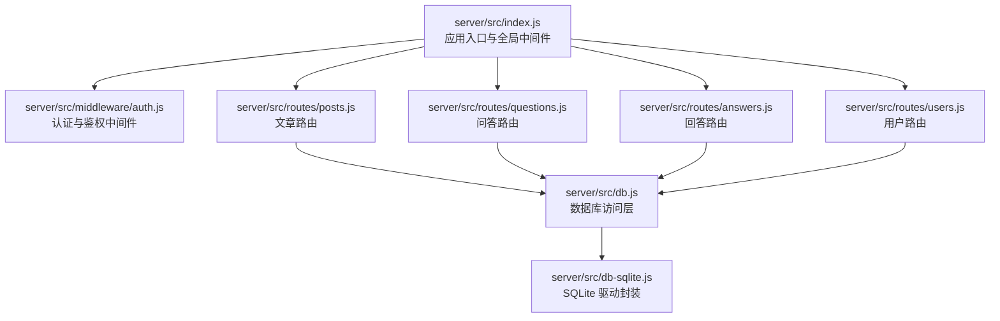
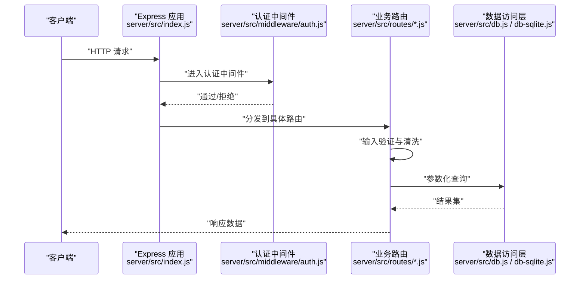
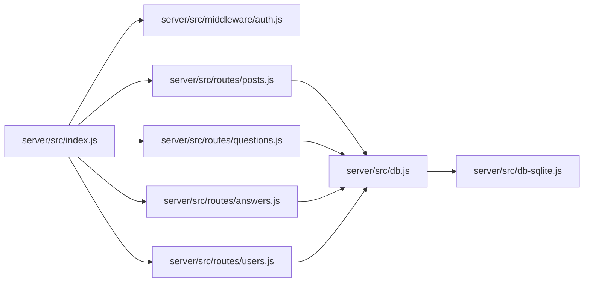

# 输入验证与防护

<cite>
**本文引用的文件**
- [server/src/index.js](file://server/src/index.js)
- [server/src/middleware/auth.js](file://server/src/middleware/auth.js)
- [server/src/routes/posts.js](file://server/src/routes/posts.js)
- [server/src/routes/questions.js](file://server/src/routes/questions.js)
- [server/src/routes/answers.js](file://server/src/routes/answers.js)
- [server/src/routes/users.js](file://server/src/routes/users.js)
- [server/src/db.js](file://server/src/db.js)
- [server/src/db-sqlite.js](file://server/src/db-sqlite.js)
</cite>

## 目录
1. [简介](#简介)
2. [项目结构](#项目结构)
3. [核心组件](#核心组件)
4. [架构总览](#架构总览)
5. [详细组件分析](#详细组件分析)
6. [依赖分析](#依赖分析)
7. [性能考虑](#性能考虑)
8. [故障排查指南](#故障排查指南)
9. [结论](#结论)
10. [附录](#附录)

## 简介
本文件聚焦后端服务的数据验证与安全防护，覆盖以下主题：
- 输入数据验证规则（字段类型、长度限制、格式校验、业务规则）
- XSS 攻击防护（HTML 标签过滤、脚本注入检测、输出编码）
- SQL 注入防护（参数化查询、SQL 白名单、数据库访问控制）
- CSRF 攻击防护（令牌验证、同源检查、请求来源验证）
- 文件上传安全（类型验证、大小限制、恶意文件检测）
- 输入清理工具函数（字符串净化、特殊字符转义、数据标准化）

说明：本文基于仓库中 server 目录的后端代码进行分析。若某些能力在当前实现中缺失，将明确标注并给出改进建议。

## 项目结构
后端采用 Express 风格路由组织，入口在 index.js，认证中间件位于 middleware/auth.js，各功能模块以 routes/* 划分，数据库访问集中在 db.js 与 db-sqlite.js。

图表来源
- [server/src/index.js](file://server/src/index.js)
- [server/src/middleware/auth.js](file://server/src/middleware/auth.js)
- [server/src/routes/posts.js](file://server/src/routes/posts.js)
- [server/src/routes/questions.js](file://server/src/routes/questions.js)
- [server/src/routes/answers.js](file://server/src/routes/answers.js)
- [server/src/routes/users.js](file://server/src/routes/users.js)
- [server/src/db.js](file://server/src/db.js)
- [server/src/db-sqlite.js](file://server/src/db-sqlite.js)

章节来源
- [server/src/index.js](file://server/src/index.js)
- [server/src/middleware/auth.js](file://server/src/middleware/auth.js)
- [server/src/routes/posts.js](file://server/src/routes/posts.js)
- [server/src/routes/questions.js](file://server/src/routes/questions.js)
- [server/src/routes/answers.js](file://server/src/routes/answers.js)
- [server/src/routes/users.js](file://server/src/routes/users.js)
- [server/src/db.js](file://server/src/db.js)
- [server/src/db-sqlite.js](file://server/src/db-sqlite.js)

## 核心组件
- 应用入口与全局中间件：负责加载基础中间件、注册路由、统一错误处理等。
- 认证中间件：校验登录态、权限控制，为受保护路由提供鉴权上下文。
- 路由层：接收请求参数，进行输入验证与业务编排，调用数据访问层。
- 数据访问层：封装数据库操作，确保使用参数化查询，避免拼接 SQL。

章节来源
- [server/src/index.js](file://server/src/index.js)
- [server/src/middleware/auth.js](file://server/src/middleware/auth.js)
- [server/src/db.js](file://server/src/db.js)
- [server/src/db-sqlite.js](file://server/src/db-sqlite.js)

## 架构总览
下图展示从客户端到数据库的完整链路，以及关键的安全控制点（认证、输入验证、参数化查询）。

图表来源
- [server/src/index.js](file://server/src/index.js)
- [server/src/middleware/auth.js](file://server/src/middleware/auth.js)
- [server/src/routes/posts.js](file://server/src/routes/posts.js)
- [server/src/routes/questions.js](file://server/src/routes/questions.js)
- [server/src/routes/answers.js](file://server/src/routes/answers.js)
- [server/src/routes/users.js](file://server/src/routes/users.js)
- [server/src/db.js](file://server/src/db.js)
- [server/src/db-sqlite.js](file://server/src/db-sqlite.js)

## 详细组件分析

### 输入数据验证规则
- 字段类型检查
  - 建议在路由层对 body/query/params 进行强类型校验，例如使用结构化校验库或自定义校验器，确保数字、布尔、枚举等类型正确。
- 长度限制
  - 对标题、内容、用户名等字段设置最小/最大长度，防止超长输入导致存储异常或前端渲染问题。
- 格式验证
  - 邮箱、URL、时间戳等字段需按正则或专用校验器验证；富文本内容应仅允许白名单标签。
- 业务规则校验
  - 如“作者必须存在且拥有编辑权限”、“问题分类必须在白名单内”、“重复提交去重”等。

当前状态与建议
- 请在各路由文件中集中实现输入验证逻辑，并在失败时返回明确的错误码与消息。
- 参考路径：[server/src/routes/posts.js](file://server/src/routes/posts.js)、[server/src/routes/questions.js](file://server/src/routes/questions.js)、[server/src/routes/answers.js](file://server/src/routes/answers.js)、[server/src/routes/users.js](file://server/src/routes/users.js)

章节来源
- [server/src/routes/posts.js](file://server/src/routes/posts.js)
- [server/src/routes/questions.js](file://server/src/routes/questions.js)
- [server/src/routes/answers.js](file://server/src/routes/answers.js)
- [server/src/routes/users.js](file://server/src/routes/users.js)

### XSS 攻击防护
- HTML 标签过滤
  - 对富文本输入执行严格的白名单过滤，仅保留必要标签与属性，移除事件处理器与危险协议。
- 脚本注入检测
  - 在入库前对输入进行二次扫描，拦截常见注入模式（如 script、on* 事件、javascript: 协议等）。
- 输出编码处理
  - 在前端渲染 Markdown 或 HTML 时使用安全的渲染器；服务端返回 JSON 时避免直接嵌入未编码的 HTML。

当前状态与建议
- 建议在路由层增加统一的“富文本清洗”步骤，并对所有可能输出的文本字段进行编码。
- 参考路径：[server/src/routes/posts.js](file://server/src/routes/posts.js)、[server/src/routes/questions.js](file://server/src/routes/questions.js)

章节来源
- [server/src/routes/posts.js](file://server/src/routes/posts.js)
- [server/src/routes/questions.js](file://server/src/routes/questions.js)

### SQL 注入防护
- 参数化查询
  - 所有数据库写入与读取均使用占位符传参，禁止字符串拼接 SQL。
- SQL 语句白名单
  - 固定 SQL 模板，动态部分仅通过参数传入，避免运行时构造 SQL。
- 数据库访问控制
  - 使用最小权限账户连接数据库，限制可执行的语句类型（仅 SELECT/INSERT/UPDATE/DELETE）。

当前状态与建议
- 请确认数据访问层已全面使用参数化查询，并审计是否存在任何字符串拼接 SQL 的情况。
- 参考路径：[server/src/db.js](file://server/src/db.js)、[server/src/db-sqlite.js](file://server/src/db-sqlite.js)

章节来源
- [server/src/db.js](file://server/src/db.js)
- [server/src/db-sqlite.js](file://server/src/db-sqlite.js)

### CSRF 攻击防护
- 令牌验证
  - 对写操作接口引入一次性 CSRF Token，前后端配合校验。
- 同源检查
  - 校验 Referer/Origin，确保请求来自可信域名。
- 请求来源验证
  - 结合 SameSite Cookie 策略与自定义头校验增强安全性。

当前状态与建议
- 请在认证中间件中增加 CSRF 校验逻辑，并在敏感路由强制启用。
- 参考路径：[server/src/middleware/auth.js](file://server/src/middleware/auth.js)

章节来源
- [server/src/middleware/auth.js](file://server/src/middleware/auth.js)

### 文件上传安全
- 文件类型验证
  - 基于扩展名与 MIME 类型双重校验，仅允许图片/文档等白名单类型。
- 大小限制
  - 配置上传体大小上限，防止超大文件导致资源耗尽。
- 恶意文件检测
  - 对上传文件进行病毒扫描与内容签名校验，必要时重命名并隔离存储。

当前状态与建议
- 请在上传路由中增加严格校验与存储隔离，并记录审计日志。
- 参考路径：[server/src/routes/posts.js](file://server/src/routes/posts.js)、[server/src/routes/users.js](file://server/src/routes/users.js)

章节来源
- [server/src/routes/posts.js](file://server/src/routes/posts.js)
- [server/src/routes/users.js](file://server/src/routes/users.js)

### 输入清理工具函数
- 字符串净化
  - 去除首尾空白、规范化换行与空格、剔除不可见字符。
- 特殊字符转义
  - 对输出到 HTML/SQL/JSON 的内容分别进行对应编码。
- 数据标准化处理
  - 统一日期、时间、数值格式，规范化 URL 与邮箱格式。

当前状态与建议
- 建议抽取独立的 utils/input-sanitizer.js，在各路由中复用。
- 参考路径：[server/src/routes/posts.js](file://server/src/routes/posts.js)、[server/src/routes/questions.js](file://server/src/routes/questions.js)

章节来源
- [server/src/routes/posts.js](file://server/src/routes/posts.js)
- [server/src/routes/questions.js](file://server/src/routes/questions.js)

## 依赖分析
- 入口与中间件耦合度低，便于扩展新的安全中间件（如速率限制、CSP、CSRF）。
- 路由层与数据访问层职责清晰，有利于统一实施输入验证与参数化查询。
- 数据库驱动封装集中，利于审计与替换。

图表来源
- [server/src/index.js](file://server/src/index.js)
- [server/src/middleware/auth.js](file://server/src/middleware/auth.js)
- [server/src/routes/posts.js](file://server/src/routes/posts.js)
- [server/src/routes/questions.js](file://server/src/routes/questions.js)
- [server/src/routes/answers.js](file://server/src/routes/answers.js)
- [server/src/routes/users.js](file://server/src/routes/users.js)
- [server/src/db.js](file://server/src/db.js)
- [server/src/db-sqlite.js](file://server/src/db-sqlite.js)

章节来源
- [server/src/index.js](file://server/src/index.js)
- [server/src/middleware/auth.js](file://server/src/middleware/auth.js)
- [server/src/db.js](file://server/src/db.js)
- [server/src/db-sqlite.js](file://server/src/db-sqlite.js)

## 性能考虑
- 输入验证尽量前置，尽早失败以减少后续处理开销。
- 富文本清洗与恶意文件扫描属于 CPU/IO 密集操作，建议异步队列处理与超时控制。
- 数据库参数化查询可减少解析成本并提升缓存命中率。
- 对频繁读写的热点接口增加缓存层，但注意缓存键的规范化与失效策略。

## 故障排查指南
- 常见问题定位
  - 400 错误：多为输入验证失败，检查路由层的校验逻辑与错误消息。
  - 401/403：认证或鉴权失败，检查中间件的会话/令牌校验流程。
  - 500 错误：数据库或系统异常，查看数据访问层日志与堆栈。
- 日志与追踪
  - 为关键路由添加结构化日志，包含请求 ID、用户标识、输入摘要（脱敏）、耗时与错误码。
- 回归测试
  - 针对 XSS、SQLi、CSRF、越权、上传绕过等场景编写自动化用例，纳入 CI。

章节来源
- [server/src/middleware/auth.js](file://server/src/middleware/auth.js)
- [server/src/db.js](file://server/src/db.js)
- [server/src/db-sqlite.js](file://server/src/db-sqlite.js)

## 结论
为确保后端服务具备稳健的输入验证与安全防护能力，建议：
- 在所有路由层统一实施强类型与白名单校验，并输出清晰的错误信息。
- 对富文本与用户生成内容进行严格的 XSS 防护与输出编码。
- 坚持参数化查询与最小权限原则，杜绝 SQL 拼接。
- 引入 CSRF 令牌与同源校验，保护写操作接口。
- 完善文件上传安全策略，包括类型、大小与恶意内容检测。
- 建立输入清理工具库，贯穿全链路的数据净化与标准化。

## 附录
- 术语
  - XSS：跨站脚本攻击
  - SQL 注入：通过构造恶意 SQL 获取或破坏数据
  - CSRF：跨站请求伪造
- 参考实现位置
  - 路由与验证：[server/src/routes/posts.js](file://server/src/routes/posts.js)、[server/src/routes/questions.js](file://server/src/routes/questions.js)、[server/src/routes/answers.js](file://server/src/routes/answers.js)、[server/src/routes/users.js](file://server/src/routes/users.js)
  - 认证中间件：[server/src/middleware/auth.js](file://server/src/middleware/auth.js)
  - 数据访问层：[server/src/db.js](file://server/src/db.js)、[server/src/db-sqlite.js](file://server/src/db-sqlite.js)
  - 应用入口：[server/src/index.js](file://server/src/index.js)