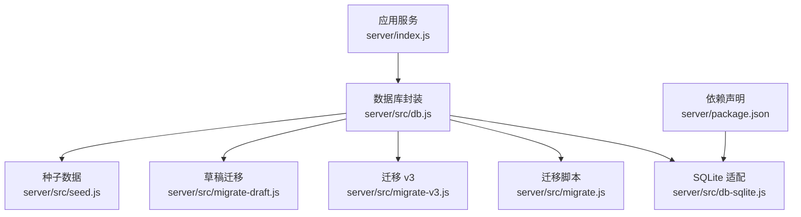
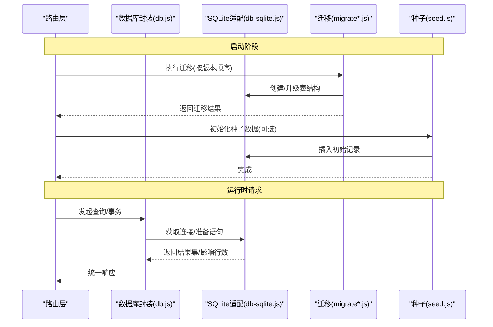
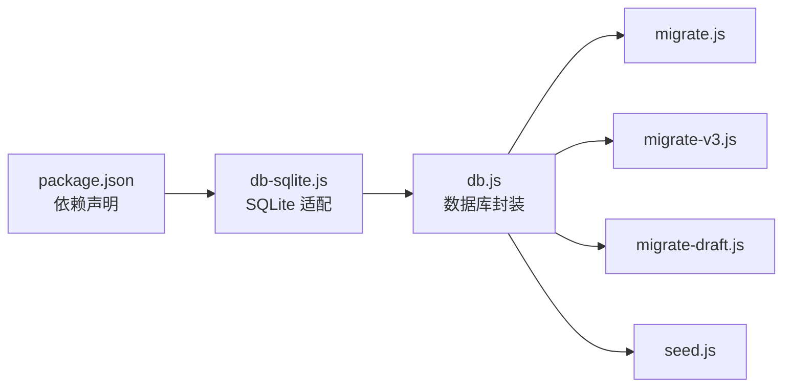

# 数据库设计与连接管理

<cite>
**本文引用的文件**   
- [server/src/db.js](file://server/src/db.js)
- [server/src/db-sqlite.js](file://server/src/db-sqlite.js)
- [server/src/migrate.js](file://server/src/migrate.js)
- [server/src/migrate-v3.js](file://server/src/migrate-v3.js)
- [server/src/migrate-draft.js](file://server/src/migrate-draft.js)
- [server/src/seed.js](file://server/src/seed.js)
- [server/package.json](file://server/package.json)
- [docs/02数据模型.md](file://docs/02数据模型.md)
</cite>

## 目录
1. [简介](#简介)
2. [项目结构](#项目结构)
3. [核心组件](#核心组件)
4. [架构总览](#架构总览)
5. [详细组件分析](#详细组件分析)
6. [依赖关系分析](#依赖关系分析)
7. [性能考虑](#性能考虑)
8. [故障排查指南](#故障排查指南)
9. [结论](#结论)
10. [附录](#附录)

## 简介
本文件面向后端数据库层，聚焦 SQLite 的配置与优化、连接管理与复用、SQL 查询构建（参数化、事务、批量）、数据模型设计（表结构、关系映射、索引策略）、迁移机制（版本控制、回滚策略、数据同步）、性能优化（查询优化、缓存策略、监控分析）以及备份与恢复方案。文档以仓库中 server 目录下的数据库相关文件为依据，并结合 docs/02数据模型.md 的数据模型说明进行系统化阐述。

## 项目结构
后端数据库相关代码集中在 server/src 目录：
- db.js：数据库连接与基础操作封装
- db-sqlite.js：SQLite 驱动适配与配置
- migrate.js / migrate-v3.js / migrate-draft.js：数据迁移脚本
- seed.js：种子数据初始化
- package.json：依赖声明（含 SQLite 驱动等）

图表来源
- [server/src/db.js](file://server/src/db.js)
- [server/src/db-sqlite.js](file://server/src/db-sqlite.js)
- [server/src/migrate.js](file://server/src/migrate.js)
- [server/src/migrate-v3.js](file://server/src/migrate-v3.js)
- [server/src/migrate-draft.js](file://server/src/migrate-draft.js)
- [server/src/seed.js](file://server/src/seed.js)
- [server/package.json](file://server/package.json)

章节来源
- [server/src/db.js](file://server/src/db.js)
- [server/src/db-sqlite.js](file://server/src/db-sqlite.js)
- [server/src/migrate.js](file://server/src/migrate.js)
- [server/src/migrate-v3.js](file://server/src/migrate-v3.js)
- [server/src/migrate-draft.js](file://server/src/migrate-draft.js)
- [server/src/seed.js](file://server/src/seed.js)
- [server/package.json](file://server/package.json)

## 核心组件
- 数据库连接与封装（db.js）
  - 负责建立与获取数据库连接实例，提供统一的查询、执行、事务等接口。
  - 对外暴露的 API 通常包括：查询（支持参数化）、执行（增删改）、事务（begin/commit/rollback）。
- SQLite 适配（db-sqlite.js）
  - 基于 SQLite 驱动实现具体连接、语句准备与执行逻辑。
  - 可配置项包括：数据库文件路径、WAL 模式、超时、并发写入限制等。
- 迁移系统（migrate*.js）
  - 维护 schema 版本，按顺序执行增量变更，记录已迁移版本。
  - 支持多阶段迁移（如 v3、draft），便于灰度与回滚。
- 种子数据（seed.js）
  - 在开发或测试环境初始化基础数据，确保运行态可用。

章节来源
- [server/src/db.js](file://server/src/db.js)
- [server/src/db-sqlite.js](file://server/src/db-sqlite.js)
- [server/src/migrate.js](file://server/src/migrate.js)
- [server/src/migrate-v3.js](file://server/src/migrate-v3.js)
- [server/src/migrate-draft.js](file://server/src/migrate-draft.js)
- [server/src/seed.js](file://server/src/seed.js)

## 架构总览
下图展示了请求从路由到数据库层的调用链，以及迁移与种子数据的启动流程。

图表来源
- [server/src/db.js](file://server/src/db.js)
- [server/src/db-sqlite.js](file://server/src/db-sqlite.js)
- [server/src/migrate.js](file://server/src/migrate.js)
- [server/src/migrate-v3.js](file://server/src/migrate-v3.js)
- [server/src/migrate-draft.js](file://server/src/migrate-draft.js)
- [server/src/seed.js](file://server/src/seed.js)

## 详细组件分析

### 数据库连接与连接池
- 连接获取与复用
  - 通过 db.js 提供的工厂方法获取连接实例；在高并发场景下建议复用连接以减少开销。
  - 若使用单进程模型，可在应用生命周期内持有单一连接；在多进程/集群环境下，建议使用外部连接池或队列化写操作以避免 SQLite 锁竞争。
- 超时处理
  - 建议在 db-sqlite.js 中设置 busy_timeout 与 statement timeout，避免长时间阻塞。
  - 对长事务和复杂查询增加超时保护，防止雪崩。
- 故障恢复
  - 捕获数据库不可用、锁冲突、磁盘 I/O 错误等异常，实施重试与退避策略。
  - 对 WAL 模式下可能出现的“数据库被锁定”错误，采用指数退避重试。
- 连接池实现要点
  - 连接池应包含：最大连接数、空闲回收、健康检查、借出/归还语义。
  - 针对 SQLite 的写串行特性，读多写少场景可分离读写连接，写连接走队列串行化。

章节来源
- [server/src/db.js](file://server/src/db.js)
- [server/src/db-sqlite.js](file://server/src/db-sqlite.js)

### SQL 查询构建器
- 参数化查询
  - 所有用户输入必须通过占位符传入，禁止字符串拼接，防止 SQL 注入。
  - 统一封装 query/exec 方法，自动绑定参数并处理类型转换。
- 事务处理
  - 提供 begin/commit/rollback 包装，确保业务原子性。
  - 在事务中捕获异常时自动回滚，并向上抛出结构化错误。
- 批量操作
  - 将多条 INSERT/UPDATE 合并为单次事务提交，减少往返与锁竞争。
  - 对大批量写入分片执行，避免单次事务过大导致内存与锁压力。

章节来源
- [server/src/db.js](file://server/src/db.js)

### 数据模型设计
- 表结构与关系
  - 参考 docs/02数据模型.md 中的实体定义，明确主键、外键与约束。
  - 常见实体包括：文章、分类、标签、问答、评论、用户等，注意一对多/多对多关系的建模。
- 索引策略
  - 为高频查询条件列建立索引（如 slug、category_id、user_id、created_at）。
  - 复合索引用于覆盖排序与过滤组合（如 (status, created_at)）。
  - 全文检索可使用 SQLite FTS5 扩展，提升搜索性能。
- 规范化与反规范化权衡
  - 适度冗余字段（如作者名快照）可减少 JOIN 成本，但需保证一致性。

章节来源
- [docs/02数据模型.md](file://docs/02数据模型.md)

### 数据迁移机制
- 版本控制
  - 每个迁移脚本对应一个版本号或时间戳，按序执行，避免重复应用。
  - 维护迁移元数据表记录已执行版本，确保幂等。
- 回滚策略
  - 为关键迁移编写反向脚本，或在迁移内部实现 up/down 双函数。
  - 发布前在预发环境验证回滚路径，确保数据安全。
- 数据同步
  - 迁移过程中涉及数据清洗/迁移时，分批处理并记录进度，失败可断点续跑。
  - 对于大表变更，优先采用在线迁移策略（加新列、双写、回填、切换、清理旧列）。

章节来源
- [server/src/migrate.js](file://server/src/migrate.js)
- [server/src/migrate-v3.js](file://server/src/migrate-v3.js)
- [server/src/migrate-draft.js](file://server/src/migrate-draft.js)

### 种子数据
- 用途
  - 快速搭建开发/测试环境，填充必要的基础数据（分类、示例文章、管理员账户等）。
- 注意事项
  - 幂等执行，避免重复插入。
  - 与迁移保持兼容，确保在任意迁移状态下均可安全运行。

章节来源
- [server/src/seed.js](file://server/src/seed.js)

## 依赖关系分析
- 外部依赖
  - SQLite 驱动由 package.json 声明，确保安装正确版本。
- 模块耦合
  - db.js 作为门面，屏蔽底层驱动差异；db-sqlite.js 专注 SQLite 细节。
  - 迁移与种子脚本依赖 db.js 的统一接口，降低耦合度。

图表来源
- [server/package.json](file://server/package.json)
- [server/src/db-sqlite.js](file://server/src/db-sqlite.js)
- [server/src/db.js](file://server/src/db.js)
- [server/src/migrate.js](file://server/src/migrate.js)
- [server/src/migrate-v3.js](file://server/src/migrate-v3.js)
- [server/src/migrate-draft.js](file://server/src/migrate-draft.js)
- [server/src/seed.js](file://server/src/seed.js)

章节来源
- [server/package.json](file://server/package.json)
- [server/src/db.js](file://server/src/db.js)
- [server/src/db-sqlite.js](file://server/src/db-sqlite.js)

## 性能考虑
- 查询优化
  - 使用 EXPLAIN ANALYZE 分析慢查询，补充缺失索引。
  - 避免 SELECT *，仅选择必要字段；分页使用游标式分页替代 OFFSET 深翻页。
- 缓存策略
  - 热点数据（首页列表、分类树、热门排行）引入内存缓存（如 Redis 或进程内缓存）。
  - 对频繁读取且更新不频繁的字典表做本地缓存，设置合理失效策略。
- 监控与分析
  - 记录慢查询日志、错误率、连接池状态、事务耗时分布。
  - 定期导出 SQLite 统计信息（如 PRAGMA stats），结合 APM 工具观察趋势。
- 写入优化
  - 批量写入使用事务包裹，减少 fsync 次数。
  - 开启 WAL 模式提升并发读性能，必要时调整 max_page_count 与 cache_size。

[本节为通用指导，无需特定文件引用]

## 故障排查指南
- 常见问题
  - “数据库被锁定”：检查是否有多写并发、事务过长、未释放连接。
  - 查询缓慢：确认索引命中、避免全表扫描、拆分复杂 JOIN。
  - 迁移失败：核对版本元数据、回滚至上一版本、逐步定位问题脚本。
- 诊断步骤
  - 启用详细日志，记录 SQL 文本与参数（脱敏）、执行时长与错误堆栈。
  - 使用 sqlite3 命令行工具直接验证表结构与索引。
  - 在低峰期执行 EXPLAIN ANALYZE 与 VACUUM 整理碎片。
- 恢复策略
  - 先回滚最近一次变更，再逐步重放迁移；必要时从备份恢复。
  - 对损坏的数据库文件尝试 .recover 或从 WAL 重建。

章节来源
- [server/src/db.js](file://server/src/db.js)
- [server/src/db-sqlite.js](file://server/src/db-sqlite.js)
- [server/src/migrate.js](file://server/src/migrate.js)

## 结论
本项目数据库层以 db.js 为统一入口，db-sqlite.js 承载 SQLite 适配，配合迁移与种子脚本形成完整的生命周期管理。为确保高可用与高性能，建议完善连接池与超时/重试策略，强化参数化与事务封装，完善索引与缓存体系，并通过监控与演练保障备份恢复能力。

[本节为总结性内容，无需特定文件引用]

## 附录

### SQLite 配置与优化清单
- 启用 WAL 模式，提高并发读性能
- 设置合适的 busy_timeout 与 statement timeout
- 调整 cache_size、max_page_count 以适应工作负载
- 定期 VACUUM 与 REINDEX，保持统计信息与索引健康

[本节为通用指导，无需特定文件引用]

### 备份与恢复方案
- 定期全量备份
  - 每日定时备份数据库文件与 WAL 文件，保留 N 天历史。
- 增量备份
  - 基于 WAL 的增量复制，缩短备份窗口，降低对业务影响。
- 灾难恢复
  - 制定 RTO/RPO 目标，演练恢复流程，确保在故障时能快速恢复。
- 校验与审计
  - 备份后校验完整性（如 checksum），记录备份任务日志与告警。

[本节为通用指导，无需特定文件引用]